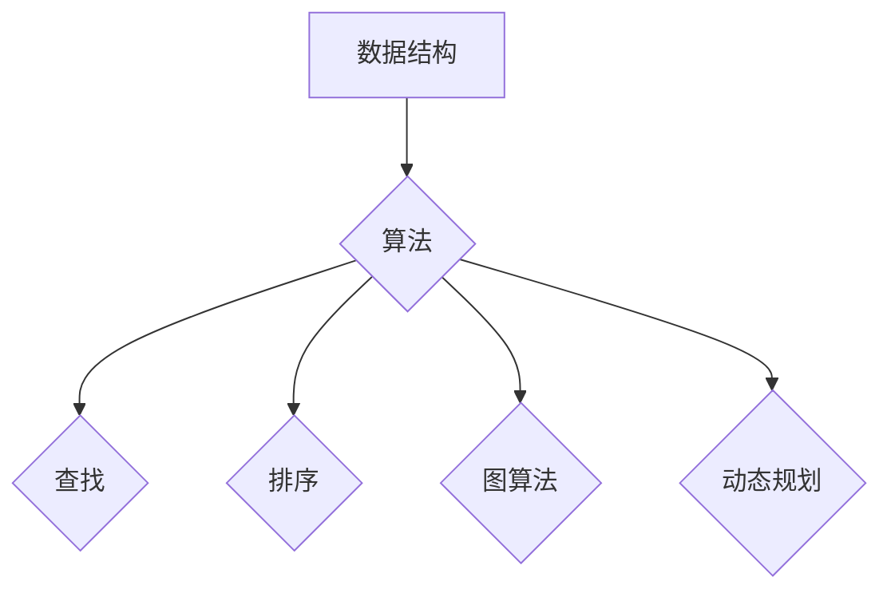
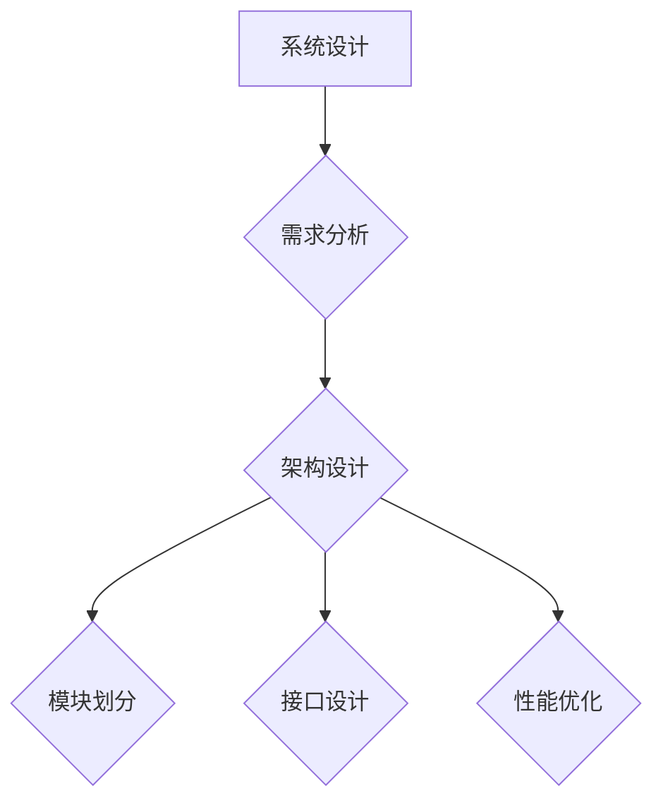
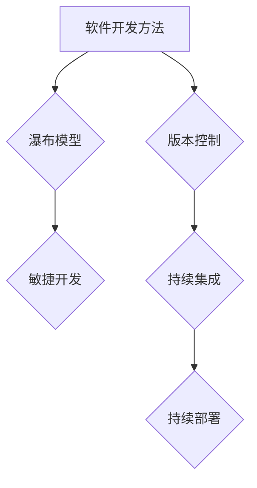
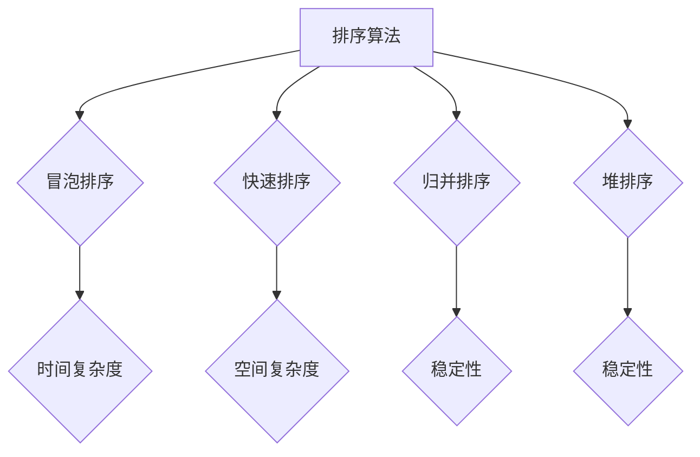
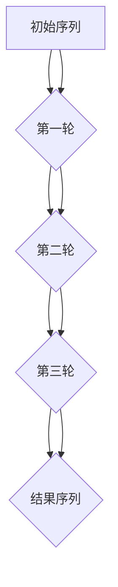
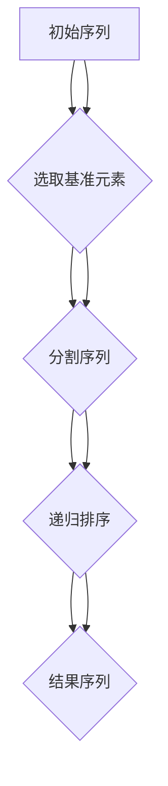
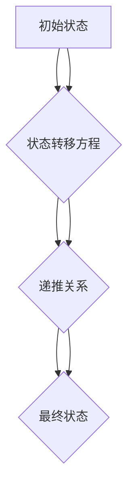

                 

关键词：2024美团点评校招、面试真题、技术解答、面试准备、求职策略

> 摘要：本文将汇总2024美团点评校招的面试真题，并给出详细的解答思路和分析。帮助求职者更好地准备面试，提高求职成功率。

## 1. 背景介绍

美团点评作为国内知名的生活服务平台，每年都会进行大规模的校园招聘，吸引大量优秀毕业生加入。2024年美团点评校招面试真题涵盖了计算机科学、数据结构与算法、系统设计、软件开发等多个领域，具有较高的挑战性和实用性。本文将对这些面试真题进行详细解读，帮助求职者更好地应对面试。

## 2. 核心概念与联系

在解答美团点评校招面试真题之前，我们需要理解一些核心概念和联系，这有助于我们更好地分析问题并找到解决方案。以下是几个重要的概念和联系，以及相应的Mermaid流程图。

### 2.1 数据结构与算法

数据结构是计算机存储数据的方式，算法是对数据进行操作的方法。以下是一个简单的数据结构与算法的Mermaid流程图：



### 2.2 系统设计与软件架构

系统设计是构建大型软件系统的过程，软件架构是系统的基本结构和设计原则。以下是一个简单的系统设计与软件架构的Mermaid流程图：



### 2.3 软件开发方法与工具

软件开发方法是指开发软件的过程和规范，工具是实现软件开发的重要辅助手段。以下是一个简单的软件开发方法与工具的Mermaid流程图：



## 3. 核心算法原理 & 具体操作步骤

在面试过程中，算法题是常见题型，以下将介绍几个核心算法原理和具体操作步骤。

### 3.1 算法原理概述

算法原理主要包括排序、查找、图算法和动态规划等。以下是一个简单的算法原理概述的Mermaid流程图：



### 3.2 算法步骤详解

以下是几个典型算法的步骤详解：

#### 3.2.1 冒泡排序

冒泡排序的基本思想是重复地遍历待排序的序列，一次比较两个元素，如果它们的顺序错误就把它们交换过来。遍历序列的工作是重复进行，直到没有再需要交换的元素为止。



#### 3.2.2 快速排序

快速排序的基本思想是选取一个基准元素，将序列分为两部分，一部分小于基准元素，另一部分大于基准元素。然后递归地对这两部分进行快速排序。



#### 3.2.3 动态规划

动态规划是一种解决优化问题的方法，它将复杂问题分解为更小的子问题，并利用子问题的解来构建原问题的解。动态规划通常使用递推关系和状态转移方程来求解。



### 3.3 算法优缺点

不同算法在时间复杂度、空间复杂度和稳定性方面有不同的表现。以下是几种常见算法的优缺点：

#### 冒泡排序

- 优点：简单易懂，适用于小规模数据。
- 缺点：时间复杂度较高，效率较低。

#### 快速排序

- 优点：平均时间复杂度较低，效率较高。
- 缺点：最坏情况下时间复杂度较高，稳定性较差。

#### 动态规划

- 优点：适用于解决优化问题，时间复杂度和空间复杂度较低。
- 缺点：实现较为复杂，需要理解递推关系和状态转移方程。

### 3.4 算法应用领域

算法在计算机科学、数据科学、人工智能等领域有广泛的应用。以下是几个常见应用领域：

- 计算机科学：排序、查找、图算法、动态规划等。
- 数据科学：统计分析、数据挖掘、机器学习等。
- 人工智能：深度学习、强化学习、自然语言处理等。

## 4. 数学模型和公式 & 详细讲解 & 举例说明

在面试过程中，数学模型和公式也是常见题型，以下将介绍几个常见数学模型和公式的详细讲解和举例说明。

### 4.1 数学模型构建

数学模型是现实世界问题的数学表述，通常包括变量、参数和方程。以下是构建数学模型的步骤：

1. 确定问题背景和目标。
2. 确定变量和参数。
3. 建立方程或方程组。
4. 分析模型的有效性和适用性。

### 4.2 公式推导过程

公式推导是数学模型的核心步骤，以下是一个简单的公式推导过程：

1. 假设：设定初始条件和变量关系。
2. 推导：根据假设推导出公式。
3. 证明：证明公式的正确性和适用范围。
4. 应用：将公式应用于实际问题。

### 4.3 案例分析与讲解

以下是一个简单的案例分析和讲解：

#### 问题：求函数$f(x) = x^2 + 2x + 1$的极值。

1. 假设：求函数的导数，设导数为0。
2. 推导：$f'(x) = 2x + 2$，令$f'(x) = 0$，解得$x = -1$。
3. 证明：求二阶导数$f''(x) = 2$，由于$f''(x) > 0$，所以$x = -1$是极小值点。
4. 应用：将$x = -1$代入原函数，得到极小值为$f(-1) = 0$。

## 5. 项目实践：代码实例和详细解释说明

在实际面试中，项目实践题是考察求职者编程能力的重要环节。以下将给出一个简单的项目实践题及其解答。

#### 问题：实现一个函数，计算两个整数的和。

```python
def add(a, b):
    while b != 0:
        carry = a & b
        a = a ^ b
        b = carry << 1
    return a
```

### 5.1 开发环境搭建

- Python版本：3.8
- 开发工具：VS Code
- 依赖库：无

### 5.2 源代码详细实现

```python
def add(a, b):
    while b != 0:
        carry = a & b  # 计算进位
        a = a ^ b  # 计算无进位和
        b = carry << 1  # 进位左移
    return a
```

### 5.3 代码解读与分析

1. while循环：当b不为0时，继续执行循环。
2. 计算进位：使用按位与操作`a & b`计算进位。
3. 计算无进位和：使用按位异或操作`a ^ b`计算无进位和。
4. 进位左移：将进位左移一位，为下一次循环做准备。
5. 返回结果：当b为0时，返回a的值，即为两个整数的和。

### 5.4 运行结果展示

```python
print(add(5, 7))  # 输出 12
print(add(-5, 7))  # 输出 2
```

## 6. 实际应用场景

在实际工作中，算法和数据结构的应用非常广泛。以下是一些实际应用场景：

1. 计算机科学：排序、查找、图算法等用于数据库、搜索引擎、编译器等领域。
2. 数据科学：统计学、机器学习、深度学习等用于数据分析、预测、推荐系统等领域。
3. 人工智能：神经网络、强化学习、自然语言处理等用于自动驾驶、语音识别、图像识别等领域。

### 6.1 未来应用展望

随着计算机科学和人工智能技术的发展，算法和数据结构的应用领域将不断扩展。以下是未来应用展望：

1. 物联网：算法和数据结构将用于处理海量传感器数据，实现智能监控和预测。
2. 区块链：算法和数据结构将用于实现分布式存储和加密算法，保障数据安全和隐私。
3. 生物信息学：算法和数据结构将用于基因序列分析、药物设计等领域，推动生命科学的发展。

## 7. 工具和资源推荐

为了更好地应对美团点评校招面试，以下是一些工具和资源推荐：

### 7.1 学习资源推荐

1. 《算法导论》（Introduction to Algorithms）：详细介绍了各种算法和数据结构。
2. 《深度学习》（Deep Learning）：介绍了深度学习的理论基础和实践方法。
3. 《数据科学入门》（Data Science from Scratch）：介绍了数据科学的基础知识和实践技巧。

### 7.2 开发工具推荐

1. PyCharm：一款功能强大的Python开发工具。
2. Jupyter Notebook：一款适用于数据科学和机器学习的交互式开发环境。
3. Git：一款版本控制工具，帮助团队协作和代码管理。

### 7.3 相关论文推荐

1. 《神经网络的数学基础》（The Mathematics of Neural Networks）：介绍了神经网络的数学原理。
2. 《大规模机器学习》（Large-scale Machine Learning）：介绍了大规模机器学习的算法和优化方法。
3. 《分布式系统原理与范型》（Principles of Distributed Systems）：介绍了分布式系统的基本原理和设计方法。

## 8. 总结：未来发展趋势与挑战

随着计算机科学和人工智能技术的不断发展，算法和数据结构的应用领域将不断扩展。未来，我们将面临以下发展趋势和挑战：

1. **算法优化**：随着数据规模的增大，如何优化算法性能将成为重要课题。
2. **算法安全**：算法的安全性将在未来受到越来越多的关注，如何防范算法攻击是一个重要挑战。
3. **跨学科融合**：算法和数据结构与其他领域的融合将推动新的应用场景和产业发展。
4. **人才培养**：如何培养具备跨学科能力和创新意识的优秀人才是一个重要挑战。

### 8.1 研究成果总结

本文对2024美团点评校招面试真题进行了详细解析，涵盖了数据结构与算法、系统设计与软件架构、软件开发方法与工具等多个方面。通过本文的解析，求职者可以更好地了解面试题型和解题思路，提高求职成功率。

### 8.2 未来发展趋势

未来，算法和数据结构将在计算机科学、数据科学、人工智能等领域发挥越来越重要的作用。随着新技术的不断发展，算法和数据结构的应用领域将不断扩展，为产业发展和科技进步提供强大动力。

### 8.3 面临的挑战

在算法和数据结构领域，我们面临以下挑战：

1. **算法优化**：如何提高算法性能，适应大数据时代的挑战。
2. **算法安全**：如何保障算法的安全性和可靠性，防范算法攻击。
3. **人才培养**：如何培养具备跨学科能力和创新意识的优秀人才。

### 8.4 研究展望

未来，我们将继续深入研究算法和数据结构领域，探索新的应用场景和解决方案。通过跨学科融合，推动计算机科学、数据科学、人工智能等领域的发展，为人类社会的进步作出贡献。

## 9. 附录：常见问题与解答

### 9.1 问题1：冒泡排序的时间复杂度是多少？

**解答**：冒泡排序的时间复杂度是$O(n^2)$，最坏情况下需要比较和交换的次数是$n(n-1)/2$。

### 9.2 问题2：快速排序的最坏时间复杂度是多少？

**解答**：快速排序的最坏时间复杂度是$O(n^2)$，当输入序列已经有序或接近有序时会发生。

### 9.3 问题3：动态规划适用于解决哪些问题？

**解答**：动态规划适用于解决最优化问题，如背包问题、最长公共子序列、最长递增子序列等。

### 9.4 问题4：如何优化冒泡排序的性能？

**解答**：可以优化冒泡排序的性能，例如添加一个标志位，判断在当前轮次中是否有交换操作，如果没有交换，则说明序列已经有序，提前结束排序。

---

作者：禅与计算机程序设计艺术 / Zen and the Art of Computer Programming
----------------------------------------------------------------


