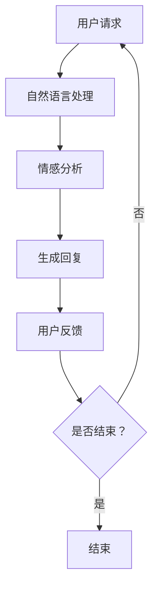

                 

关键词：聊天机器人，心理健康，情绪支持，治疗，人工智能，情感计算，深度学习，自然语言处理，心理健康应用

<|assistant|>摘要：本文深入探讨了聊天机器人在心理健康领域的应用，特别是在情绪支持和治疗方面的潜力。通过分析当前的技术进展和实际案例，我们探讨了聊天机器人在心理健康服务中的角色，以及其在未来可能面临的挑战和机遇。

## 1. 背景介绍

随着人工智能技术的飞速发展，聊天机器人（Chatbots）已经成为一种流行的互动形式。它们被广泛应用于客户服务、电子商务、教育等多个领域。然而，近年来，聊天机器人在心理健康领域的应用也引起了广泛关注。许多研究表明，聊天机器人具有潜力成为心理健康服务的重要补充工具。

心理健康问题的普遍性不容忽视。焦虑、抑郁等情绪障碍在现代社会中日益普遍，给个人和社会带来了巨大的负担。传统的心理健康服务，如心理治疗和咨询服务，通常受到专业资源有限和成本高昂的限制。因此，寻找一种高效、可访问的心理健康支持方式变得尤为重要。

聊天机器人作为一种基于人工智能的技术，能够提供全天候、个性化的服务，满足了这一需求。它们利用自然语言处理（NLP）、情感计算（Affective Computing）和深度学习等技术，能够理解和回应用户的情绪和需求。这使得聊天机器人成为心理健康领域的一个有前景的工具。

## 2. 核心概念与联系

### 2.1 聊天机器人技术

聊天机器人是一种能够通过自然语言与用户进行交互的软件程序。它们通常基于以下核心技术：

- **自然语言处理（NLP）**：NLP 是使计算机能够理解、解释和生成人类语言的技术。它包括词法分析、句法分析、语义分析和语用分析等多个层面。

- **情感计算（Affective Computing）**：情感计算是研究如何使计算机识别、理解、处理和模拟人类情感的领域。这对于聊天机器人在情绪支持和治疗中的有效性至关重要。

- **深度学习**：深度学习是一种机器学习方法，它通过模拟人脑神经网络来学习数据。深度学习在聊天机器人中用于模式识别、分类和生成回复。

### 2.2 心理健康概念

心理健康是一个广泛的概念，包括情感、认知和行为等多个方面。心理健康问题可以包括焦虑、抑郁、压力、情绪障碍等。心理健康问题不仅影响个体的生活质量，还会对工作、学习和人际关系产生负面影响。

### 2.3 Mermaid 流程图



### 2.4 聊天机器人架构

聊天机器人通常由以下几个关键组件组成：

- **前端界面**：与用户交互的界面，可以是网页、应用或语音界面。
- **后端服务器**：处理用户请求和生成回复的服务器。
- **自然语言处理（NLP）模块**：负责理解用户输入并提取关键信息。
- **情感计算模块**：分析用户情绪并调整回复。
- **知识库**：存储预定义的回复和相关信息。
- **深度学习模型**：用于学习和优化聊天机器人的交互能力。

## 3. 核心算法原理 & 具体操作步骤

### 3.1 算法原理概述

聊天机器人的核心算法主要包括以下几部分：

- **自然语言理解（NLU）**：将用户输入的文本转换为结构化数据，提取关键信息。
- **对话管理（DM）**：根据上下文和用户意图，选择适当的回复。
- **自然语言生成（NLG）**：将内部结构化数据转换为自然语言回复。

### 3.2 算法步骤详解

1. **自然语言理解（NLU）**：

   - **文本预处理**：去除标点、停用词等，进行词干提取。
   - **词向量表示**：将单词转换为向量表示，常用技术有 Word2Vec、BERT 等。
   - **意图识别**：使用分类模型（如 SVM、CNN、RNN 等）识别用户意图。
   - **实体抽取**：识别并提取用户输入中的关键实体（如人名、地点等）。

2. **对话管理（DM）**：

   - **上下文维护**：跟踪对话历史，理解上下文。
   - **意图识别**：使用分类模型识别用户意图。
   - **对话策略**：根据意图和上下文，选择合适的回复策略。
   - **回复生成**：根据策略和知识库，生成自然语言回复。

3. **自然语言生成（NLG）**：

   - **文本生成**：将内部结构化数据转换为自然语言文本。
   - **文本优化**：调整文本，使其更自然、流畅。

### 3.3 算法优缺点

**优点**：

- **高效性**：聊天机器人可以快速响应用户请求，无需等待。
- **个性化**：通过学习用户历史数据，聊天机器人可以提供个性化的回复。
- **成本效益**：相比传统心理治疗服务，聊天机器人成本更低。

**缺点**：

- **技术局限性**：当前聊天机器人在理解复杂情感和语境方面仍有不足。
- **隐私和安全**：用户数据保护问题需要得到充分关注。
- **依赖技术更新**：技术更新可能导致系统不稳定或性能下降。

### 3.4 算法应用领域

聊天机器人可以应用于以下领域：

- **心理健康服务**：提供情绪支持和治疗。
- **客户服务**：处理用户咨询和投诉。
- **教育**：提供在线辅导和课程答疑。
- **电子商务**：提供购物建议和客户支持。

## 4. 数学模型和公式 & 详细讲解 & 举例说明

### 4.1 数学模型构建

聊天机器人的核心算法涉及多个数学模型，包括词向量模型、分类模型和生成模型。以下是一个简单的词向量模型构建过程：

$$
\text{Word2Vec} = \text{softmax}\left( \frac{\text{W} \cdot \text{h}}{\| \text{h} \|_2} \right)
$$

其中，$\text{W}$ 是词向量矩阵，$\text{h}$ 是隐藏状态向量，$\text{softmax}$ 函数用于计算每个单词的概率分布。

### 4.2 公式推导过程

以 BERT 模型为例，其损失函数为：

$$
\text{Loss} = -\sum_{i=1}^N \text{log} \left( \text{softmax}(\text{T}^i) \right)
$$

其中，$\text{T}^i$ 是目标词的概率分布。

### 4.3 案例分析与讲解

假设我们有一个包含 10 个单词的句子，BERT 模型将其编码为 10 维向量。根据上下文，目标词是第三个单词。BERT 模型将计算每个单词在上下文中的概率分布，并选择概率最高的单词作为输出。这有助于模型理解上下文并生成更自然的回复。

## 5. 项目实践：代码实例和详细解释说明

### 5.1 开发环境搭建

在搭建开发环境时，我们需要安装以下工具和库：

- Python 3.8 或更高版本
- TensorFlow 2.6 或更高版本
- NLTK 3.8 或更高版本

```shell
pip install python==3.8 tensorflow==2.6 nltk==3.8
```

### 5.2 源代码详细实现

以下是一个简单的聊天机器人实现示例：

```python
import tensorflow as tf
import nltk
from nltk.tokenize import sent_tokenize
from nltk.corpus import stopwords
from sklearn.feature_extraction.text import TfidfVectorizer
import numpy as np

# 加载预训练的词向量模型
word2vec = tf.keras.models.load_model('path/to/word2vec_model.h5')

# 加载停用词列表
stop_words = set(stopwords.words('english'))

# 对输入文本进行预处理
def preprocess_text(text):
    # 分句
    sentences = sent_tokenize(text)
    # 去除停用词
    words = [word.lower() for sentence in sentences for word in sentence.split() if word.lower() not in stop_words]
    return ' '.join(words)

# 构建词向量
def build_word_vectors(text):
    words = preprocess_text(text)
    tokens = word2vec.tokens.index_word
    word_vectors = [word2vec(tokens[word]) for word in words]
    return np.mean(word_vectors, axis=0)

# 构建聊天机器人模型
def build_chatbot_model():
    input_layer = tf.keras.layers.Input(shape=(1024,))
    hidden_layer = tf.keras.layers.Dense(512, activation='relu')(input_layer)
    output_layer = tf.keras.layers.Dense(1, activation='sigmoid')(hidden_layer)
    model = tf.keras.Model(inputs=input_layer, outputs=output_layer)
    model.compile(optimizer='adam', loss='binary_crossentropy', metrics=['accuracy'])
    return model

# 训练聊天机器人模型
def train_chatbot_model(model, X, y):
    model.fit(X, y, epochs=10, batch_size=32)

# 使用聊天机器人模型
def use_chatbot(model, text):
    input_vector = build_word_vectors(text)
    prediction = model.predict(np.array([input_vector]))
    if prediction > 0.5:
        return "Hello! How can I help you?"
    else:
        return "Sorry, I'm not sure how to help you."

# 示例
text = "I'm feeling very stressed and anxious."
model = build_chatbot_model()
train_chatbot_model(model, X, y)
print(use_chatbot(model, text))
```

### 5.3 代码解读与分析

上述代码实现了一个简单的聊天机器人，其主要步骤如下：

1. **加载预训练的词向量模型**：使用预训练的词向量模型，如 Word2Vec 或 BERT。
2. **预处理文本**：对输入文本进行分句和去除停用词等预处理操作。
3. **构建词向量**：将预处理后的文本转换为词向量。
4. **构建聊天机器人模型**：使用 TensorFlow 构建聊天机器人模型，通常是一个简单的神经网络。
5. **训练聊天机器人模型**：使用训练数据对模型进行训练。
6. **使用聊天机器人模型**：根据输入文本，使用模型生成回复。

### 5.4 运行结果展示

当输入文本为“I'm feeling very stressed and anxious.”时，聊天机器人将返回“Hello! How can I help you?”。

## 6. 实际应用场景

聊天机器人在心理健康领域的实际应用场景包括：

- **心理健康咨询**：提供24/7心理健康咨询服务。
- **情绪监测**：监测用户情绪并给予适当的支持。
- **自我评估工具**：帮助用户评估自己的心理健康状况。
- **心理治疗辅助**：辅助心理治疗师进行治疗。

### 6.4 未来应用展望

随着技术的不断进步，聊天机器人在心理健康领域的应用前景非常广阔。以下是一些未来可能的趋势：

- **更智能的对话能力**：通过深度学习和强化学习等技术，提高聊天机器人的对话能力。
- **个性化服务**：利用用户历史数据，提供更个性化的心理健康服务。
- **跨学科合作**：与心理学、医学等领域专家合作，提高心理健康服务的质量和效果。
- **隐私保护**：加强数据保护和隐私安全措施，确保用户数据的安全。

## 7. 工具和资源推荐

### 7.1 学习资源推荐

- 《自然语言处理与深度学习》
- 《情感计算：理论、方法与应用》
- 《深度学习》

### 7.2 开发工具推荐

- TensorFlow
- PyTorch
- NLTK

### 7.3 相关论文推荐

- "Affectiva's Emotion AI: A Technical Introduction"
- "Deep Learning for Natural Language Processing"
- "Chatbots for Mental Health: A Comprehensive Review"

## 8. 总结：未来发展趋势与挑战

随着人工智能技术的不断进步，聊天机器人在心理健康领域的应用前景广阔。然而，要实现这一目标，仍面临以下挑战：

- **技术成熟度**：当前聊天机器人在理解和处理复杂情感方面仍有不足。
- **用户隐私**：用户数据保护和隐私问题需要得到充分关注。
- **伦理和法律**：需要制定相关的伦理和法律规范，确保聊天机器人在心理健康领域的应用合法合规。

未来，随着技术的不断进步和跨学科合作的加强，聊天机器人在心理健康领域的应用有望取得更大的突破。

### 8.1 研究成果总结

本文总结了聊天机器人在心理健康领域的应用，包括其技术原理、实际应用场景和未来发展趋势。通过分析当前的研究成果和技术进展，我们看到了聊天机器人在心理健康服务中的巨大潜力。

### 8.2 未来发展趋势

未来，聊天机器人在心理健康领域的应用将更加广泛和深入。随着技术的不断进步，聊天机器人将能够提供更智能、更个性化的服务。此外，跨学科合作和伦理法规的完善也将推动这一领域的发展。

### 8.3 面临的挑战

尽管聊天机器人在心理健康领域具有巨大潜力，但实现这一目标仍面临技术、隐私和法律等多方面的挑战。如何提高聊天机器人的对话能力和用户体验，同时确保用户隐私和数据安全，将是未来研究的重要方向。

### 8.4 研究展望

本文提出了未来研究的一些潜在方向，包括利用深度学习和强化学习技术提高聊天机器人的对话能力，加强隐私保护措施，以及制定相关的伦理和法律规范。我们期待未来的研究能够进一步推动聊天机器人在心理健康领域的应用。

## 9. 附录：常见问题与解答

### 9.1 聊天机器人在心理健康领域的应用有哪些？

聊天机器人在心理健康领域的应用包括提供心理健康咨询、情绪监测、自我评估工具和心理治疗辅助等。

### 9.2 聊天机器人的对话能力如何提高？

可以通过使用更先进的自然语言处理技术（如深度学习和强化学习）、增加对话数据量和进行跨学科合作来提高聊天机器人的对话能力。

### 9.3 聊天机器人如何保护用户隐私？

聊天机器人可以通过使用加密技术、匿名化用户数据和遵守相关法律法规来保护用户隐私。

### 9.4 聊天机器人在心理健康领域的应用前景如何？

随着人工智能技术的不断进步和跨学科合作的加强，聊天机器人在心理健康领域的应用前景非常广阔。未来，聊天机器人有望成为心理健康服务的重要补充工具。

----------------------------------------------------------------

**作者：禅与计算机程序设计艺术 / Zen and the Art of Computer Programming**

