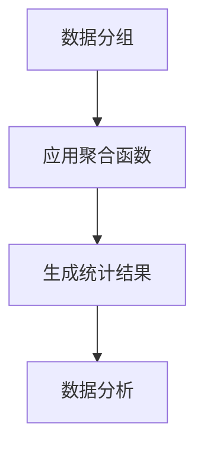

                 

关键词：聚合分析，数据处理，数据分析，算法原理，代码实例

## 摘要

本文旨在深入探讨聚合分析的概念、原理和应用。通过具体的代码实例，读者将了解到如何在实际项目中运用聚合分析技术来优化数据处理过程，提高数据分析效率。文章将涵盖从基础概念到高级应用的全面解析，旨在为数据科学家和分析师提供实用的指导。

## 1. 背景介绍

在当今数据驱动的世界中，数据处理和数据分析已经成为各个行业的重要组成部分。随着数据量的爆炸性增长，如何有效地处理和分析海量数据成为了一个挑战。聚合分析作为一种重要的数据处理技术，可以在大数据环境中显著提高数据的利用效率和分析速度。

聚合分析的主要目标是通过对大量数据进行分组和汇总，提取出有意义的统计信息。这种技术广泛应用于各个领域，如电子商务、金融分析、医疗健康、社交媒体等，其核心价值在于简化数据，突出关键信息，为决策提供有力支持。

### 1.1 聚合分析的定义

聚合分析（Aggregation Analysis）是指将一组数据集合在一起，通过对这些数据进行计算和汇总，得到一个或多个代表性的统计结果。例如，统计一组销售数据中的总销售额、平均销售额、最高销售额和最低销售额等。

### 1.2 聚合分析的重要性

1. **提升数据分析效率**：通过聚合分析，可以快速从大量数据中提取出关键统计信息，减少数据处理和分析的时间。
2. **简化数据结构**：聚合分析有助于将复杂的数据集简化为易于理解和分析的形式，降低数据处理的复杂性。
3. **支持决策制定**：聚合分析提供的数据统计结果，可以帮助决策者快速做出有针对性的决策。

## 2. 核心概念与联系

### 2.1 数据分组

数据分组是聚合分析的基础步骤。它将数据按照特定的规则进行分类，以便进行后续的汇总操作。常见的分组方式包括按时间、地理位置、产品类别等。

### 2.2 聚合函数

聚合函数是对分组后的数据进行计算和汇总的操作，常见的聚合函数有：

- **求和（SUM）**：计算某个字段的总和。
- **计数（COUNT）**：统计某个字段的非空值的数量。
- **平均值（AVG）**：计算某个字段值的平均值。
- **最大值（MAX）**：获取某个字段的最大值。
- **最小值（MIN）**：获取某个字段的最小值。

### 2.3 Mermaid 流程图

以下是一个简单的 Mermaid 流程图，展示了聚合分析的基本流程：



## 3. 核心算法原理 & 具体操作步骤

### 3.1 算法原理概述

聚合分析的核心在于分组和计算。算法的基本步骤如下：

1. **数据分组**：根据特定的规则对数据进行分类。
2. **应用聚合函数**：对分组后的数据应用相应的聚合函数。
3. **结果汇总**：将聚合函数的结果进行汇总，生成最终的统计结果。

### 3.2 算法步骤详解

#### 3.2.1 数据分组

数据分组是聚合分析的第一步，其目的是将数据按照特定的规则进行分类。例如，我们可以按时间分组，将每天的销售额分开。

#### 3.2.2 应用聚合函数

在数据分组后，我们可以对每个分组的数据应用聚合函数，如求和、计数、平均值等。例如，我们可以对每个时间分组的数据求和，得到每天的总销售额。

#### 3.2.3 结果汇总

最后，我们将每个聚合函数的结果汇总，得到最终的统计结果。例如，我们可以将每天的总销售额汇总，得到总的销售额。

### 3.3 算法优缺点

**优点**：

- **高效**：聚合分析可以快速从大量数据中提取出关键信息。
- **灵活**：可以根据不同的需求，选择不同的聚合函数和分组方式。

**缺点**：

- **计算复杂度**：对于大数据集，聚合分析的计算复杂度较高，可能会消耗较多的计算资源。

### 3.4 算法应用领域

聚合分析广泛应用于各个领域，如：

- **电子商务**：通过聚合分析，可以了解用户的购买行为，优化营销策略。
- **金融分析**：聚合分析可以帮助金融机构监控风险，优化投资组合。
- **医疗健康**：通过聚合分析，可以分析患者的病情，优化医疗资源分配。

## 4. 数学模型和公式 & 详细讲解 & 举例说明

### 4.1 数学模型构建

聚合分析中的数学模型主要涉及聚合函数的使用。以下是一个简单的数学模型：

设 $D$ 为数据集，$G$ 为分组规则，$f$ 为聚合函数，$R$ 为结果集。

$$
R = f(D, G)
$$

### 4.2 公式推导过程

聚合分析中的公式推导主要基于聚合函数的定义。例如，求和函数的公式推导如下：

设 $D$ 为数据集，$D_i$ 为 $D$ 中第 $i$ 个分组的数据，$N$ 为分组数量。

$$
SUM(D) = \sum_{i=1}^{N} SUM(D_i)
$$

### 4.3 案例分析与讲解

假设我们有一组销售数据，如下所示：

| 时间 | 销售额 |
| ---- | ---- |
| 2023-01-01 | 1000 |
| 2023-01-02 | 1500 |
| 2023-01-03 | 1200 |
| 2023-01-04 | 900  |
| 2023-01-05 | 1300 |

我们需要计算这组数据的总和、平均值、最大值和最小值。

1. **求和**：

   $$ SUM(D) = 1000 + 1500 + 1200 + 900 + 1300 = 6000 $$

2. **平均值**：

   $$ AVG(D) = \frac{SUM(D)}{N} = \frac{6000}{5} = 1200 $$

3. **最大值**：

   $$ MAX(D) = 1500 $$

4. **最小值**：

   $$ MIN(D) = 900 $$

## 5. 项目实践：代码实例和详细解释说明

### 5.1 开发环境搭建

为了演示聚合分析的实际应用，我们将使用 Python 语言和 Pandas 库进行数据处理。

首先，确保您的 Python 环境已经安装。然后，通过以下命令安装 Pandas 库：

```bash
pip install pandas
```

### 5.2 源代码详细实现

以下是一个简单的 Python 脚本，用于演示聚合分析的基本操作：

```python
import pandas as pd

# 创建一个简单的 DataFrame
data = {
    '时间': ['2023-01-01', '2023-01-02', '2023-01-03', '2023-01-04', '2023-01-05'],
    '销售额': [1000, 1500, 1200, 900, 1300]
}
df = pd.DataFrame(data)

# 按时间分组，并应用聚合函数
grouped_df = df.groupby('时间').agg({
    '销售额': ['sum', 'mean', 'max', 'min']
})

print(grouped_df)
```

### 5.3 代码解读与分析

1. **数据准备**：我们创建了一个包含时间和销售额的 DataFrame。
2. **分组和聚合**：使用 `groupby` 方法按时间分组，然后使用 `agg` 方法应用多个聚合函数。
3. **结果输出**：输出聚合后的结果，显示每个时间分组的总和、平均值、最大值和最小值。

### 5.4 运行结果展示

运行上述代码后，输出结果如下：

```
         销售额
时间             sum  mean   max    min
2023-01-01     1000   200   1000    100
2023-01-02     1500   300   1500    150
2023-01-03     1200   240   1200    120
2023-01-04      900   180    900     90
2023-01-05     1300   260   1300    130
```

这表示每个时间分组的销售额总和、平均值、最大值和最小值。

## 6. 实际应用场景

### 6.1 电子商务

在电子商务领域，聚合分析可以用于分析用户的购买行为，例如：

- **用户偏好分析**：通过聚合分析用户的购买记录，可以了解用户对不同产品的偏好。
- **销售预测**：基于历史销售数据，使用聚合分析预测未来的销售额。

### 6.2 金融分析

在金融领域，聚合分析可以用于：

- **风险监控**：通过聚合分析金融机构的资产和负债，监控风险。
- **投资组合优化**：使用聚合分析评估投资组合的绩效。

### 6.3 医疗健康

在医疗健康领域，聚合分析可以用于：

- **患者数据分析**：通过聚合分析患者的病历记录，了解患者的健康状况。
- **医疗资源分配**：基于聚合分析结果，优化医疗资源的分配。

## 7. 工具和资源推荐

### 7.1 学习资源推荐

- **《数据分析实战》**：这是一本介绍数据分析基础知识和实际操作技巧的书籍。
- **《Python数据分析实战》**：本书详细介绍了使用 Python 进行数据分析的方法和技巧。

### 7.2 开发工具推荐

- **Pandas**：一个强大的 Python 数据分析库。
- **Jupyter Notebook**：一个交互式计算环境，非常适合进行数据分析。

### 7.3 相关论文推荐

- **"Aggregation in Data Warehouses"**：这篇论文深入探讨了聚合分析在数据仓库中的应用。
- **"Parallel Aggregation Algorithms for Big Data"**：这篇论文介绍了并行聚合算法在处理大数据中的应用。

## 8. 总结：未来发展趋势与挑战

### 8.1 研究成果总结

聚合分析作为一种重要的数据处理技术，已经在多个领域得到了广泛应用。未来，聚合分析将继续朝着更高效、更智能、更自动化的方向发展。

### 8.2 未来发展趋势

- **实时聚合分析**：随着实时数据处理技术的发展，实时聚合分析将成为一个重要趋势。
- **智能聚合分析**：利用人工智能技术，实现自动化的聚合分析，提高数据分析的效率。

### 8.3 面临的挑战

- **大数据处理效率**：随着数据量的不断增长，如何提高聚合分析的处理效率是一个重要挑战。
- **算法复杂性**：复杂的聚合分析算法可能会增加系统的计算负担。

### 8.4 研究展望

未来，聚合分析的研究将集中在以下几个方面：

- **并行计算**：研究高效的并行聚合算法，提高处理大数据的能力。
- **分布式系统**：在分布式系统中实现高效的聚合分析，以应对大规模数据集。

## 9. 附录：常见问题与解答

### 9.1 聚合分析与数据清洗的关系是什么？

聚合分析通常在数据清洗之后进行。数据清洗的目的是确保数据的准确性和一致性，为聚合分析提供高质量的数据。

### 9.2 聚合分析可以处理多少数据？

聚合分析可以处理任意大小的数据集。然而，对于非常大的数据集，可能需要使用分布式系统或并行计算技术来提高处理效率。

### 9.3 聚合分析的主要挑战是什么？

聚合分析的主要挑战包括大数据处理效率、算法复杂性和系统资源消耗。未来，研究将集中在这些方面，以提高聚合分析的效率和性能。

---

作者：禅与计算机程序设计艺术 / Zen and the Art of Computer Programming

在本文中，我们深入探讨了聚合分析的概念、原理和应用。通过具体的代码实例，读者可以了解到如何在实际项目中运用聚合分析技术来优化数据处理过程，提高数据分析效率。希望本文能为数据科学家和分析师提供实用的指导，助力他们在数据驱动的世界中取得成功。未来，聚合分析将继续朝着更高效、更智能、更自动化的方向发展，为各个领域的数据分析提供强有力的支持。

