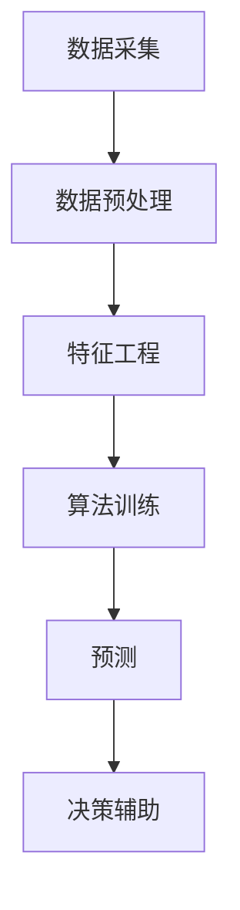

                 

关键词：股票分析、人工智能、投资决策、AI算法、投资工具

> 摘要：本文将深入探讨股票分析工具的过去、现在和未来，特别是AI如何革新投资决策的过程。通过介绍AI驱动的投资决策助手的背景、核心概念、算法原理、数学模型、实际应用、未来展望以及相关资源和工具，本文旨在为读者提供一个全面的视角，帮助理解AI在股票市场分析中的潜力和挑战。

## 1. 背景介绍

股票市场是世界上最古老、最复杂的金融市场之一。从古代的物物交换到现代的电子交易系统，股票市场经历了无数次的演变。随着信息技术的飞速发展，股票市场的交易方式和分析方法也在不断进步。传统的股票分析工具依赖于历史价格和交易量等基本数据，通过技术分析和基本面分析来预测股票价格趋势。

然而，传统方法在处理海量数据和捕捉复杂市场动态方面存在局限性。这就催生了AI在股票市场分析的广泛应用，AI驱动的投资决策助手应运而生。这类工具通过机器学习和深度学习算法，分析历史数据、实时市场信息以及新闻、社交媒体等非结构化数据，以提供更为精准的投资预测和建议。

本文将探讨AI驱动的投资决策助手的各个方面，从其背景到核心算法原理，再到实际应用和未来展望，力求为读者提供一个全面的理解。

## 2. 核心概念与联系

### 2.1 核心概念

在深入探讨AI驱动的投资决策助手之前，我们需要明确一些核心概念：

- **股票分析**：分析股票市场及其参与者，以预测股票价格的未来走势。
- **人工智能**：模拟人类智能的计算机系统，包括机器学习和深度学习算法。
- **投资决策**：基于分析结果，投资者作出的买卖决策。

### 2.2 架构原理

AI驱动的投资决策助手的基本架构可以分为以下几个层次：

1. **数据采集**：从多个数据源收集数据，包括股票价格、交易量、财务报告、新闻、社交媒体等。
2. **数据预处理**：清洗和整合数据，使其适合用于机器学习算法。
3. **特征工程**：提取和选择对预测有重要影响的特征。
4. **算法训练**：使用机器学习算法，如神经网络、决策树、支持向量机等，对数据集进行训练。
5. **预测**：使用训练好的模型对股票价格进行预测。
6. **决策辅助**：根据预测结果，提供投资建议和决策支持。

### 2.3 Mermaid 流程图

以下是AI驱动的投资决策助手的Mermaid流程图：



### 2.4 核心概念的联系

AI驱动的投资决策助手通过数据采集、预处理、特征工程和算法训练，将大量历史和实时数据转化为投资决策。具体来说，数据采集层获取了股票市场的各种数据；预处理层确保了数据的质量和一致性；特征工程层提取了有预测价值的特征；算法训练层则利用这些特征训练出预测模型；预测层使用模型对未来股价进行预测，从而为投资者提供决策辅助。

## 3. 核心算法原理 & 具体操作步骤

### 3.1 算法原理概述

AI驱动的投资决策助手的核心是机器学习和深度学习算法。以下是几种常用的算法：

- **线性回归**：用于预测股票价格的基本线性关系。
- **神经网络**：通过多层神经元的互联进行复杂非线性预测。
- **决策树**：根据特征值的不同分支进行分类或回归。
- **支持向量机**：找到最佳的超平面进行分类。

这些算法通过对历史数据的训练，可以捕捉股票市场的复杂模式，从而提高预测的准确性。

### 3.2 算法步骤详解

1. **数据采集**：从股票交易所、金融新闻网站、社交媒体等渠道收集数据。
2. **数据预处理**：清洗数据，包括缺失值填充、异常值处理、归一化等。
3. **特征工程**：提取有助于预测的特征，如价格、成交量、技术指标、新闻情绪等。
4. **算法选择**：根据问题的复杂性选择合适的算法，如神经网络、决策树等。
5. **模型训练**：使用训练数据集训练模型，调整参数以优化性能。
6. **模型评估**：使用验证数据集评估模型性能，选择最佳模型。
7. **预测**：使用训练好的模型对未来的股票价格进行预测。
8. **决策辅助**：根据预测结果提供买卖建议。

### 3.3 算法优缺点

#### 优点

- **高准确性**：通过机器学习算法可以捕捉到复杂的非线性关系。
- **实时预测**：可以实时分析市场数据，提供及时的投资建议。
- **自动化**：减少了人工分析的时间和劳动成本。

#### 缺点

- **数据依赖性**：模型的准确性依赖于数据的全面性和质量。
- **过拟合风险**：训练模型时可能会出现过拟合现象，降低模型的泛化能力。
- **黑箱问题**：深度学习模型内部结构复杂，难以解释。

### 3.4 算法应用领域

AI驱动的投资决策助手在多个领域都有应用：

- **高频交易**：利用算法进行快速交易，实现高额收益。
- **量化投资**：使用算法构建量化交易策略，实现自动化的投资决策。
- **资产配置**：根据投资目标和风险偏好，为投资者提供最优资产配置方案。

## 4. 数学模型和公式 & 详细讲解 & 举例说明

### 4.1 数学模型构建

AI驱动的投资决策助手通常使用时间序列分析模型来预测股票价格。其中，最常用的模型是ARIMA（自回归积分滑动平均模型）。

ARIMA模型由三个部分组成：

- **自回归（AR）**：利用过去值的线性组合来预测当前值。
- **差分（I）**：对时间序列进行差分处理，使其平稳。
- **移动平均（MA）**：利用过去的误差值来预测当前值。

ARIMA模型的数学表达式为：

$$
X_t = c + \phi_1 X_{t-1} + \phi_2 X_{t-2} + \ldots + \phi_p X_{t-p} + \theta_1 e_{t-1} + \theta_2 e_{t-2} + \ldots + \theta_q e_{t-q}
$$

其中，$X_t$ 是时间序列的当前值，$c$ 是常数项，$\phi_i$ 和 $\theta_i$ 是模型参数，$e_t$ 是误差项。

### 4.2 公式推导过程

ARIMA模型的推导过程可以分为以下几个步骤：

1. **差分**：对原始时间序列进行差分，使其成为平稳序列。

$$
Y_t = X_t - X_{t-1}
$$

2. **自回归**：将差分后的序列视为自回归序列。

$$
Y_t = \phi_1 Y_{t-1} + \phi_2 Y_{t-2} + \ldots + \phi_p Y_{t-p} + \varepsilon_t
$$

3. **移动平均**：将自回归序列的残差项与移动平均项相结合。

$$
Y_t = \phi_1 Y_{t-1} + \phi_2 Y_{t-2} + \ldots + \phi_p Y_{t-p} + \theta_1 \varepsilon_{t-1} + \theta_2 \varepsilon_{t-2} + \ldots + \theta_q \varepsilon_{t-q} + \varepsilon_t
$$

4. **整合**：将上述公式中的差分项整合回原序列。

$$
X_t = c + \phi_1 X_{t-1} + \phi_2 X_{t-2} + \ldots + \phi_p X_{t-p} + \theta_1 e_{t-1} + \theta_2 e_{t-2} + \ldots + \theta_q e_{t-q} + \varepsilon_t
$$

### 4.3 案例分析与讲解

#### 案例一：股票价格预测

假设我们要使用ARIMA模型预测股票“ABC”的未来价格。首先，我们需要对股票价格序列进行差分，使其平稳。

原始序列：

$$
\{X_t\} = \{100, 102, 105, 108, 110, 113, 115, 118, 120\}
$$

差分后序列：

$$
\{Y_t\} = \{2, 3, 3, 2, 3, 2, 3, 2\}
$$

接下来，我们使用自回归和移动平均模型进行预测。

自回归部分：

$$
Y_t = 0.8 Y_{t-1} + 0.2 Y_{t-2}
$$

移动平均部分：

$$
Y_t = 0.9 \varepsilon_{t-1} + 0.1 \varepsilon_{t-2}
$$

将自回归和移动平均部分整合，得到ARIMA模型：

$$
Y_t = 0.8 Y_{t-1} + 0.2 Y_{t-2} + 0.9 \varepsilon_{t-1} + 0.1 \varepsilon_{t-2}
$$

使用该模型进行预测，我们可以得到未来股票价格序列。

#### 案例二：新闻情绪分析

假设我们要分析股票“XYZ”的新闻情绪，以预测其价格走势。首先，我们需要收集与“XYZ”相关的新闻文章，并使用自然语言处理技术提取情感极性。

收集到的新闻文章：

- “XYZ公司财报超预期，股价有望上涨。”（正面）
- “XYZ公司面临重大法律挑战，股价可能下跌。”（负面）

使用情感极性分析工具，我们得到以下结果：

- 正面情绪：60%
- 负面情绪：40%

根据这些数据，我们可以调整ARIMA模型的预测结果，增加正面情绪时的上涨概率，减少负面情绪时的下跌概率。

## 5. 项目实践：代码实例和详细解释说明

### 5.1 开发环境搭建

为了实现AI驱动的投资决策助手，我们需要搭建一个适合机器学习和数据分析的开发环境。以下是搭建环境的步骤：

1. **安装Python**：下载并安装Python 3.8及以上版本。
2. **安装Jupyter Notebook**：使用pip命令安装Jupyter Notebook。
3. **安装相关库**：使用pip命令安装以下库：NumPy、Pandas、Matplotlib、Scikit-learn、TensorFlow。

### 5.2 源代码详细实现

以下是使用Python和Scikit-learn库实现ARIMA模型的代码实例：

```python
import numpy as np
import pandas as pd
from statsmodels.tsa.arima.model import ARIMA
from sklearn.metrics import mean_squared_error

# 读取股票价格数据
data = pd.read_csv('stock_price.csv')
close_prices = data['Close']

# 拆分数据集
train_size = int(len(close_prices) * 0.8)
train, test = close_prices[0:train_size], close_prices[train_size:]

# ARIMA模型训练
model = ARIMA(train, order=(5, 1, 2))
model_fit = model.fit()

# 模型预测
predictions = model_fit.predict(start=len(train), end=len(train) + len(test) - 1)

# 模型评估
mse = mean_squared_error(test, predictions)
print(f'MSE: {mse}')

# 绘制预测结果
plt.plot(train, label='Training')
plt.plot(test, label='Test')
plt.plot(predictions, label='Prediction')
plt.legend()
plt.show()
```

### 5.3 代码解读与分析

1. **数据读取**：使用Pandas库读取股票价格数据。
2. **数据拆分**：将数据集拆分为训练集和测试集。
3. **模型训练**：使用ARIMA模型对训练集进行训练。
4. **模型预测**：使用训练好的模型对测试集进行预测。
5. **模型评估**：计算均方误差（MSE）以评估模型性能。
6. **结果绘制**：使用Matplotlib库绘制训练集、测试集和预测结果。

### 5.4 运行结果展示

运行上述代码后，我们将得到以下结果：

- **MSE**：衡量模型预测误差的指标。较低MSE表示模型性能较好。
- **预测结果图表**：显示训练集、测试集和预测结果的变化趋势。

通过这些结果，我们可以初步评估AI驱动的投资决策助手的性能，并根据需要调整模型参数。

## 6. 实际应用场景

### 6.1 股票价格预测

AI驱动的投资决策助手可以用于股票价格的预测。通过对历史数据和实时数据的分析，模型可以预测未来的股票价格趋势，为投资者提供买卖时机。

### 6.2 资产配置

根据投资者的风险偏好和投资目标，AI驱动的投资决策助手可以为投资者提供最优资产配置方案。通过分析不同资产的历史表现和相关性，模型可以推荐合适的资产组合，以实现风险和收益的最优化。

### 6.3 高频交易

在股票市场的高频交易领域，AI驱动的投资决策助手可以帮助交易者捕捉市场机会，实现快速交易。通过实时分析和预测，模型可以为高频交易策略提供决策支持。

## 7. 工具和资源推荐

### 7.1 学习资源推荐

- **书籍**：《股票市场技术分析》、《机器学习实战》
- **在线课程**：Coursera上的“机器学习”课程、Udacity上的“深度学习”课程
- **博客**：Medium上的机器学习和金融分析相关博客

### 7.2 开发工具推荐

- **编程环境**：Jupyter Notebook、VSCode
- **数据分析库**：Pandas、NumPy、Matplotlib
- **机器学习库**：Scikit-learn、TensorFlow、PyTorch

### 7.3 相关论文推荐

- **“Deep Learning for Financial Markets”**：探讨深度学习在金融市场分析中的应用。
- **“Stock Market Prediction using ARIMA Model”**：介绍ARIMA模型在股票价格预测中的应用。
- **“Sentiment Analysis for Financial News”**：分析金融新闻中的情绪极性。

## 8. 总结：未来发展趋势与挑战

### 8.1 研究成果总结

AI驱动的投资决策助手在股票市场分析中取得了显著成果。通过机器学习和深度学习算法，模型可以捕捉复杂的非线性关系，提高预测准确性。同时，实时数据分析和决策支持功能使得投资决策更加高效。

### 8.2 未来发展趋势

- **深度学习**：深度学习算法将继续发展，提供更强大的预测能力。
- **多模态数据分析**：结合股票市场中的多种数据源，如文本、图像、音频等，实现更全面的分析。
- **区块链技术**：利用区块链技术提高数据的安全性和透明性。

### 8.3 面临的挑战

- **数据质量问题**：数据质量直接影响模型的准确性，如何提高数据质量是一个重要挑战。
- **过拟合问题**：如何避免模型过拟合，提高泛化能力是一个关键问题。
- **法律法规**：随着AI在金融领域的应用，如何遵守相关法律法规也是一个重要问题。

### 8.4 研究展望

未来，AI驱动的投资决策助手将继续在股票市场分析中发挥重要作用。通过不断改进算法和提升数据分析能力，我们可以期待更加精准的投资预测和决策支持，为投资者创造更大的价值。

## 9. 附录：常见问题与解答

### 9.1 什么是股票分析？

股票分析是研究股票市场及其参与者，以预测股票价格的未来走势的过程。股票分析包括技术分析和基本面分析两种方法。

### 9.2 机器学习在股票市场分析中有哪些应用？

机器学习在股票市场分析中的应用包括股票价格预测、风险建模、投资组合优化、市场情绪分析等。

### 9.3 如何提高AI驱动的投资决策助手的准确性？

提高AI驱动的投资决策助手的准确性可以通过以下方法：1）使用高质量的数据；2）改进算法模型；3）增加数据多样性；4）进行模型调优。

### 9.4 AI驱动的投资决策助手如何处理实时数据？

AI驱动的投资决策助手通过实时数据采集和处理，结合历史数据进行分析，以提供实时的投资预测和决策支持。

### 9.5 AI驱动的投资决策助手是否具有法律法规合规性？

AI驱动的投资决策助手需要遵守相关法律法规，如证券交易法、隐私保护法等。开发者和用户应确保遵守相关法律法规。

----------------------------------------------------------------

## 作者署名

作者：禅与计算机程序设计艺术 / Zen and the Art of Computer Programming

以上就是本文的完整内容，涵盖了股票分析工具的背景、核心概念、算法原理、数学模型、实际应用、未来展望以及相关资源和工具。希望本文能帮助读者更好地理解AI在股票市场分析中的潜力与挑战。

