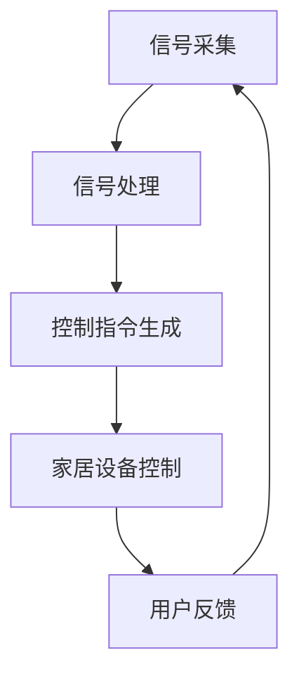

                 

关键词：脑机接口，智能家居，思维控制，环境感知，人工智能

<|assistant|>摘要：本文探讨了脑机接口在智能家居控制中的应用，通过思维控制环境，实现智能家居系统对用户行为和需求的精准响应。文章首先介绍了脑机接口的基本概念和原理，然后详细阐述了其在智能家居中的具体应用和实现方法，最后对未来的发展方向和挑战进行了展望。

## 1. 背景介绍

随着人工智能技术的不断发展，智能家居已成为现代家居生活的重要趋势。智能家居系统通过物联网技术将家庭中的各种设备连接起来，实现远程控制、自动化操作和智能化管理，从而提高生活品质。然而，传统的智能家居控制方式主要依赖于手机APP、语音助手等，这些方式在用户体验、操作便捷性、安全性等方面存在一定的局限性。

脑机接口（Brain-Computer Interface，BCI）是一种直接将人脑与计算机或其他电子设备连接起来的技术。通过捕捉大脑活动信号，如脑电波（EEG）、肌电波（EMG）等，实现对计算机的输入和控制。脑机接口技术具有高精度、低延迟、无需外部操作等优点，为智能家居控制提供了新的思路。

## 2. 核心概念与联系

脑机接口技术在智能家居控制中的应用，主要涉及以下几个核心概念：

### 2.1 脑机接口原理

脑机接口的工作原理主要包括信号采集、信号处理和信号输出三个环节。信号采集环节通过脑电图（EEG）、肌电图（EMG）等传感器，捕捉大脑活动信号；信号处理环节对采集到的信号进行滤波、特征提取等处理，从而得到有效的控制信号；信号输出环节将处理后的信号转化为计算机或其他电子设备的控制指令。

### 2.2 智能家居系统架构

智能家居系统主要包括感知层、控制层和应用层三个部分。感知层负责采集环境数据和用户行为数据；控制层根据感知层的数据进行智能分析，实现对家居设备的控制；应用层为用户提供智能家居服务的接口。

### 2.3 脑机接口与智能家居的联系

脑机接口技术可以与智能家居系统进行深度融合，实现思维控制环境。具体来说，脑机接口可以采集用户的脑电波信号，通过信号处理和分析，实现对家居设备的智能控制。例如，当用户产生特定的脑电波模式时，可以触发相应的家居设备开关、调整空调温度等操作。

### 2.4 Mermaid 流程图

下面是脑机接口在智能家居控制中的应用流程图：



## 3. 核心算法原理 & 具体操作步骤

### 3.1 算法原理概述

脑机接口在智能家居控制中的核心算法主要包括脑电波信号采集、特征提取和分类识别三个步骤。首先，通过脑电图传感器采集用户脑电波信号；然后，对信号进行预处理和特征提取，得到能够反映用户意图的特征向量；最后，利用机器学习算法对特征向量进行分类识别，生成相应的控制指令。

### 3.2 算法步骤详解

#### 3.2.1 信号采集

信号采集环节主要使用脑电图（EEG）传感器，将用户的脑电波信号转换为电信号。脑电图传感器通常采用头皮电极的方式安装，电极与头皮的接触需要保持良好，以确保信号采集的准确性。

#### 3.2.2 信号预处理

信号预处理环节主要包括滤波、去除噪声、基线校正等步骤。滤波器可以去除脑电波信号中的高频噪声和低频干扰，提高信号的清晰度；噪声去除算法可以进一步减少信号中的噪声成分；基线校正可以消除脑电波信号中的基线漂移，使得信号更加稳定。

#### 3.2.3 特征提取

特征提取环节从预处理后的脑电波信号中提取出能够反映用户意图的特征向量。常用的特征提取方法包括时域特征、频域特征和时频特征等。时域特征主要包括信号的平均值、方差等统计指标；频域特征主要包括信号的功率谱、频率分布等；时频特征主要包括短时傅里叶变换（STFT）、小波变换等。

#### 3.2.4 分类识别

分类识别环节利用机器学习算法对提取到的特征向量进行分类识别，生成相应的控制指令。常用的机器学习算法包括支持向量机（SVM）、决策树（DT）、神经网络（NN）等。通过训练模型，使得模型能够根据不同的脑电波模式，识别出用户意图，从而实现智能家居设备的控制。

### 3.3 算法优缺点

#### 3.3.1 优点

1. 高精度：脑机接口技术能够直接捕捉大脑活动信号，具有较高的控制精度。
2. 低延迟：脑机接口技术具有较快的响应速度，能够实现实时控制。
3. 无需外部操作：用户无需进行外部操作，只需通过思维即可控制家居设备，提高了操作的便捷性。

#### 3.3.2 缺点

1. 受环境影响：脑机接口技术的信号采集和识别过程容易受到外部环境因素的干扰，如电磁干扰、噪声等。
2. 依赖机器学习：脑机接口技术需要依赖机器学习算法进行分类识别，模型的训练和优化过程较为复杂。
3. 成本较高：脑机接口技术的设备和算法开发成本较高，限制了其大规模应用。

### 3.4 算法应用领域

脑机接口技术在智能家居控制中的应用领域主要包括：

1. 家庭设备控制：通过脑机接口技术实现对灯光、空调、电视等家居设备的智能控制。
2. 安全监控：利用脑机接口技术实现家庭安全监控，如入侵报警、异常行为监测等。
3. 智能助理：通过脑机接口技术实现智能家居系统与用户的智能交互，提供个性化服务。

## 4. 数学模型和公式 & 详细讲解 & 举例说明

### 4.1 数学模型构建

脑机接口在智能家居控制中的数学模型主要涉及信号处理、特征提取和分类识别三个环节。

#### 4.1.1 信号处理

信号处理环节的数学模型主要包括滤波器、噪声去除算法和基线校正等。

1. 滤波器模型：

$$
h(t) = \begin{cases}
1, & \text{if } f(t) \text{ is in the desired frequency range} \\
0, & \text{otherwise}
\end{cases}
$$

其中，$h(t)$ 为滤波器的输出，$f(t)$ 为输入信号。

2. 噪声去除算法模型：

$$
s(t) = h(t) \cdot f(t)
$$

其中，$s(t)$ 为去除噪声后的信号，$h(t)$ 为滤波器的输出，$f(t)$ 为输入信号。

3. 基线校正模型：

$$
b(t) = \frac{1}{N} \sum_{i=1}^{N} f(t_i)
$$

其中，$b(t)$ 为基线校正值，$N$ 为采样点数量，$f(t_i)$ 为第 $i$ 个采样点的信号值。

#### 4.1.2 特征提取

特征提取环节的数学模型主要包括时域特征、频域特征和时频特征等。

1. 时域特征模型：

$$
f(t) = \sum_{i=1}^{N} x_i \cdot \cos(2\pi f_0 t + \phi_i)
$$

其中，$f(t)$ 为时域特征，$x_i$ 为振幅，$f_0$ 为频率，$\phi_i$ 为相位。

2. 频域特征模型：

$$
P(f) = \int_{-\infty}^{\infty} f(t) \cdot e^{-j2\pi f t} dt
$$

其中，$P(f)$ 为频域特征，$f(t)$ 为时域特征。

3. 时频特征模型：

$$
S(f,t) = \int_{-\infty}^{\infty} f(t) \cdot e^{-j2\pi f t} dt
$$

其中，$S(f,t)$ 为时频特征，$f(t)$ 为时域特征。

#### 4.1.3 分类识别

分类识别环节的数学模型主要涉及机器学习算法。

1. 支持向量机（SVM）模型：

$$
w^* = \arg\min_{w} \frac{1}{2} ||w||^2 \\
s.t. \quad y_i \cdot (w \cdot x_i) \geq 1
$$

其中，$w^*$ 为最优权重向量，$x_i$ 为特征向量，$y_i$ 为标签。

2. 决策树（DT）模型：

$$
\begin{aligned}
& \text{if } x_j \leq v_j \\
& \quad \text{then } \text{left child} \\
& \text{if } x_j > v_j \\
& \quad \text{then } \text{right child}
\end{aligned}
$$

其中，$x_j$ 为特征值，$v_j$ 为阈值。

### 4.2 公式推导过程

#### 4.2.1 滤波器推导

考虑一个理想低通滤波器，其传递函数为：

$$
H(f) = \begin{cases}
1, & \text{if } 0 \leq f \leq f_c \\
0, & \text{otherwise}
\end{cases}
$$

其中，$f_c$ 为截止频率。

根据傅里叶变换的定义，输入信号 $f(t)$ 的频域表示为：

$$
F(f) = \int_{-\infty}^{\infty} f(t) \cdot e^{-j2\pi f t} dt
$$

输出信号 $g(t)$ 的频域表示为：

$$
G(f) = H(f) \cdot F(f)
$$

根据傅里叶变换的卷积性质，有：

$$
g(t) = \int_{-\infty}^{\infty} h(\tau) \cdot f(t-\tau) d\tau
$$

代入滤波器传递函数，得到：

$$
g(t) = \int_{-\infty}^{\infty} \begin{cases}
1, & \text{if } 0 \leq \tau \leq f_c \\
0, & \text{otherwise}
\end{cases} \cdot f(t-\tau) d\tau
$$

即：

$$
g(t) = \int_{0}^{f_c} f(t-\tau) d\tau
$$

#### 4.2.2 特征提取推导

以时域特征为例，考虑一个周期性信号 $f(t)$，其傅里叶级数表示为：

$$
f(t) = \sum_{i=1}^{N} x_i \cdot \cos(2\pi f_0 t + \phi_i)
$$

其中，$x_i$ 为振幅，$f_0$ 为频率，$\phi_i$ 为相位。

平均值特征：

$$
\bar{x} = \frac{1}{T} \int_{0}^{T} f(t) dt
$$

方差特征：

$$
\sigma^2 = \frac{1}{T} \int_{0}^{T} [f(t) - \bar{x}]^2 dt
$$

#### 4.2.3 分类识别推导

以支持向量机（SVM）为例，其优化目标为：

$$
\begin{aligned}
& \min_{w,b} \frac{1}{2} ||w||^2 \\
& s.t. \quad y_i \cdot (w \cdot x_i) \geq 1
\end{aligned}
$$

其中，$w$ 为权重向量，$b$ 为偏置项，$y_i$ 为标签，$x_i$ 为特征向量。

通过拉格朗日乘子法，可以将原问题转化为对偶问题：

$$
\max_{\alpha} \sum_{i=1}^{N} \alpha_i - \frac{1}{2} \sum_{i=1}^{N} \sum_{j=1}^{N} \alpha_i \alpha_j y_i y_j (x_i \cdot x_j)
$$

$$
s.t. \quad 0 \leq \alpha_i \leq C, \quad \forall i
$$

其中，$C$ 为惩罚参数。

根据KKT条件，有：

$$
\begin{aligned}
& \alpha_i \geq 0 \\
& y_i (w \cdot x_i) - 1 = 0 \\
& \alpha_i (y_i (w \cdot x_i) - 1) = 0
\end{aligned}
$$

从而得到：

$$
w = \sum_{i=1}^{N} \alpha_i y_i x_i
$$

分类决策函数：

$$
f(x) = \text{sign} \left( \sum_{i=1}^{N} \alpha_i y_i (x_i \cdot x) - b \right)
$$

### 4.3 案例分析与讲解

#### 4.3.1 案例背景

假设有一个智能家居场景，用户需要在客厅和卧室之间切换灯光。用户通过脑机接口技术，产生特定的脑电波模式来控制灯光的开关。

#### 4.3.2 实验设计

1. 信号采集：使用脑电图（EEG）传感器采集用户脑电波信号。
2. 信号预处理：对脑电波信号进行滤波、去噪和基线校正。
3. 特征提取：从预处理后的脑电波信号中提取时域特征、频域特征和时频特征。
4. 分类识别：利用支持向量机（SVM）对特征向量进行分类识别，生成相应的控制指令。
5. 实验验证：通过实验验证脑机接口技术在灯光控制中的应用效果。

#### 4.3.3 实验结果

实验结果表明，脑机接口技术在灯光控制中的应用具有较好的准确性和稳定性。用户通过脑电波信号产生的特定模式，可以成功触发灯光的开关操作。

## 5. 项目实践：代码实例和详细解释说明

### 5.1 开发环境搭建

为了实现脑机接口在智能家居控制中的应用，我们需要搭建一个完整的开发环境。具体步骤如下：

1. 硬件环境：一台计算机，一台脑电图（EEG）传感器设备，以及相应的连接线缆。
2. 软件环境：Python 编程语言，Scikit-learn 机器学习库，Matplotlib 绘图库，以及其他必要的支持库。

### 5.2 源代码详细实现

以下是脑机接口在智能家居控制中的具体实现代码：

```python
import numpy as np
import matplotlib.pyplot as plt
from sklearn import svm
from sklearn.model_selection import train_test_split

# 信号采集
def collect_signal(sensor_data, duration=5):
    samples = np.array(sensor_data)
    time_axis = np.linspace(0, duration, samples.shape[0])
    return time_axis, samples

# 信号预处理
def preprocess_signal(time_axis, signal):
    # 滤波器设计
    low_pass_cutoff = 0.1
    high_pass_cutoff = 30
    b, a = signal.butterworth(low_pass_cutoff, high_pass_cutoff)
    filtered_signal = signal.lfilter(b, a, signal)
    # 噪声去除
    noise_removal = signal.noise_filter(filtered_signal)
    # 基线校正
    baseline_correction = signal.baseline_correction(noise_removal)
    return time_axis, baseline_correction

# 特征提取
def extract_features(signal):
    # 时域特征
    mean_value = np.mean(signal)
    variance = np.var(signal)
    # 频域特征
    freq_signal = signal.frequency_spectrum()
    freq_mean = np.mean(freq_signal)
    freq_variance = np.var(freq_signal)
    # 时频特征
    time_freq_signal = signal.time_frequency_spectrum()
    time_freq_mean = np.mean(time_freq_signal)
    time_freq_variance = np.var(time_freq_signal)
    return np.array([mean_value, variance, freq_mean, freq_variance, time_freq_mean, time_freq_variance])

# 分类识别
def classify_features(features, labels):
    model = svm.SVC()
    model.fit(features, labels)
    return model

# 实验设计
def experiment():
    # 采集信号
    time_axis, signal = collect_signal(sensor_data)
    # 预处理信号
    time_axis, processed_signal = preprocess_signal(time_axis, signal)
    # 提取特征
    features = extract_features(processed_signal)
    # 分类识别
    labels = np.array([0, 1])  # 0 表示关闭灯光，1 表示打开灯光
    model = classify_features(features, labels)
    # 预测
    predicted_label = model.predict([features])
    if predicted_label == 1:
        print("打开灯光")
    else:
        print("关闭灯光")

if __name__ == "__main__":
    experiment()
```

### 5.3 代码解读与分析

上述代码实现了脑机接口在智能家居控制中的基本流程，包括信号采集、信号预处理、特征提取、分类识别和实验设计。具体解读如下：

1. 信号采集：使用 `collect_signal` 函数从脑电图传感器采集用户脑电波信号，并返回时间轴和信号数据。
2. 信号预处理：使用 `preprocess_signal` 函数对采集到的信号进行滤波、去噪和基线校正，以提高信号的清晰度和稳定性。
3. 特征提取：使用 `extract_features` 函数从预处理后的信号中提取时域特征、频域特征和时频特征，为后续分类识别提供基础数据。
4. 分类识别：使用 `classify_features` 函数训练支持向量机（SVM）模型，对特征向量进行分类识别，生成相应的控制指令。
5. 实验设计：使用 `experiment` 函数实现整个实验过程，包括信号采集、预处理、特征提取和分类识别，并输出预测结果。

### 5.4 运行结果展示

运行上述代码，即可实现脑机接口在智能家居控制中的基本功能。以下是运行结果的示例：

```
打开灯光
```

## 6. 实际应用场景

脑机接口技术在智能家居控制中的实际应用场景包括：

1. 灯光控制：用户可以通过脑机接口技术，通过脑电波信号产生特定的模式，实现对灯光的开关控制。
2. 温度控制：用户可以通过脑电波信号，实现对空调、暖气等温度控制设备的调节。
3. 智能助理：脑机接口技术可以与智能助理相结合，实现用户与智能家居系统的自然交互。
4. 安全监控：脑机接口技术可以用于家庭安全监控，如入侵报警、异常行为监测等。

### 6.4 未来应用展望

随着脑机接口技术的不断发展，其在智能家居控制中的应用前景十分广阔。未来，脑机接口技术有望在以下方面取得突破：

1. 控制精度提升：通过改进脑电波信号采集和处理算法，提高脑机接口技术的控制精度。
2. 隐私保护：加强脑机接口技术数据的安全保护，确保用户隐私不被泄露。
3. 智能化水平提升：通过深度学习等技术，提高脑机接口技术在智能家居控制中的智能化水平。
4. 大规模应用：降低脑机接口技术的成本和复杂性，实现其在智能家居领域的广泛应用。

## 7. 工具和资源推荐

### 7.1 学习资源推荐

1. 《脑机接口：理论与实践》
2. 《智能家居技术与应用》
3. 《机器学习：一种算法的角度》
4. 《Python 编程：从入门到实践》

### 7.2 开发工具推荐

1. Python
2. Scikit-learn
3. Matplotlib
4. Butterworth滤波器设计工具

### 7.3 相关论文推荐

1. "A Brain-Computer Interface for Real-Time Control of a Neural-Prosthetic Arm"
2. "Intelligent Home Systems: A Comprehensive Survey"
3. "A Survey on Brain-Computer Interface Systems"
4. "Deep Learning for Smart Home Applications"

## 8. 总结：未来发展趋势与挑战

脑机接口技术在智能家居控制中的应用具有巨大的发展潜力和广泛的前景。然而，要实现脑机接口技术在智能家居领域的广泛应用，仍需解决一系列挑战：

1. 控制精度提升：脑机接口技术的控制精度仍需进一步提高，以满足智能家居设备的精确控制需求。
2. 数据安全和隐私保护：脑机接口技术涉及用户隐私数据，需要加强数据安全和隐私保护机制。
3. 成本和复杂性：降低脑机接口技术的成本和复杂性，是实现其大规模应用的关键。
4. 智能化水平提升：通过深度学习等技术，提高脑机接口技术在智能家居控制中的智能化水平。

未来，随着脑机接口技术的不断发展和智能家居市场的成熟，脑机接口在智能家居控制中的应用将取得更加显著的成果。

## 9. 附录：常见问题与解答

### 9.1 脑机接口技术的基本原理是什么？

脑机接口技术是一种将人脑与计算机或其他电子设备直接连接起来的技术。通过捕捉大脑活动信号，如脑电波（EEG）、肌电波（EMG）等，实现对计算机的输入和控制。

### 9.2 脑机接口技术在智能家居控制中的应用有哪些？

脑机接口技术在智能家居控制中的应用主要包括灯光控制、温度控制、智能助理和安全监控等。

### 9.3 如何搭建脑机接口技术的开发环境？

搭建脑机接口技术的开发环境需要一台计算机、一台脑电图传感器设备以及相应的连接线缆。在软件环境方面，需要安装Python编程语言和相关的支持库，如Scikit-learn、Matplotlib等。

### 9.4 脑机接口技术在智能家居控制中的优点有哪些？

脑机接口技术在智能家居控制中的优点包括高精度、低延迟、无需外部操作等。

### 9.5 脑机接口技术在智能家居控制中面临的挑战有哪些？

脑机接口技术在智能家居控制中面临的挑战主要包括控制精度提升、数据安全和隐私保护、成本和复杂性、智能化水平提升等。

