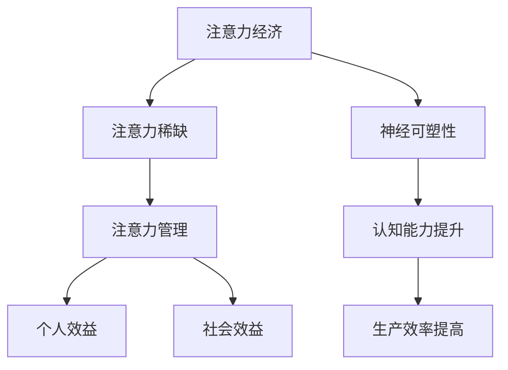

                 

 关键词：脑科学、注意力经济、认知神经科学、神经可塑性、注意力管理、认知优化

> 摘要：本文从脑科学的角度出发，探讨了注意力经济的概念、机制以及其在现代社会中的重要性。通过解析大脑神经可塑性原理，阐述了如何通过科学的注意力管理方法提升认知能力，为人工智能和人类共同进步提供了新的视角和启示。

## 1. 背景介绍

注意力是认知过程中的核心因素，直接影响信息的接收、处理和记忆。随着信息时代的到来，人们对注意力的重视日益增加。注意力经济作为一种新的经济学理念，强调注意力资源的稀缺性和价值。然而，注意力经济如何运作，其内在机制又是什么，这些问题尚未得到充分的研究。

近年来，脑科学的研究取得了显著的进展，为我们理解注意力的本质提供了新的视角。神经可塑性理论指出，大脑具有通过经验调整结构和功能的特性，这意味着我们可以通过训练来提升注意力。这种观点为注意力经济提供了一种新的解释路径。

本文旨在从脑科学的角度探讨注意力经济，分析其内在机制，并探讨如何通过科学的方法提升注意力，以实现个人和社会的可持续发展。

## 2. 核心概念与联系

### 2.1 注意力经济

注意力经济是指在社会信息过载的背景下，个体和企业通过争夺和利用注意力资源来实现经济价值的过程。其核心在于注意力资源的稀缺性，即每个人的注意力是有限的，因此如何高效利用注意力资源成为关键。

### 2.2 神经可塑性

神经可塑性是指大脑通过经验调整其结构和功能的能力。研究表明，神经可塑性是大脑适应环境和学习新技能的基础。通过特定的训练，可以增强注意力的稳定性和分配效率。

### 2.3 注意力管理

注意力管理是指通过科学的策略和方法，对个体的注意力资源进行有效管理和优化，以提高工作效率和生活质量。注意力管理不仅关乎个人认知能力的提升，也关乎社会生产力的提高。

### 2.4 Mermaid 流程图



## 3. 核心算法原理 & 具体操作步骤

### 3.1 算法原理概述

注意力经济的核心在于对注意力资源的有效管理。通过神经可塑性的原理，我们可以通过以下步骤来提升注意力：

1. **适应性训练**：通过持续的训练，大脑能够适应特定的环境，提高注意力的稳定性和分配效率。
2. **多任务切换训练**：通过多任务切换训练，大脑能够更好地管理注意力资源，提高多任务处理能力。
3. **专注力训练**：通过专注力训练，可以增强个体对特定任务的注意力集中度。

### 3.2 算法步骤详解

1. **评估注意力状态**：通过自我评估工具，了解当前注意力水平。
2. **制定训练计划**：根据注意力状态，制定个性化的训练计划。
3. **执行训练**：按照训练计划进行适应性训练、多任务切换训练和专注力训练。
4. **反馈与调整**：在训练过程中，不断进行反馈和调整，优化训练效果。

### 3.3 算法优缺点

**优点**：
- **个性化**：训练计划根据个体差异制定，具有高度个性化。
- **高效**：通过科学的训练方法，可以显著提升注意力水平。
- **可持续**：训练方法强调长期坚持，具有可持续性。

**缺点**：
- **时间成本**：训练需要持续的时间投入。
- **初期效果不明显**：在初期阶段，效果可能不明显，需要耐心。

### 3.4 算法应用领域

- **个人应用**：提升个人工作效率、改善生活质量。
- **企业应用**：提升员工工作效率、降低培训成本。
- **教育领域**：改善学生学习效果、提高教育质量。

## 4. 数学模型和公式 & 详细讲解 & 举例说明

### 4.1 数学模型构建

注意力经济中的数学模型可以通过以下公式表示：

$$
E = f(A, T, C)
$$

其中，$E$ 表示经济价值，$A$ 表示注意力资源，$T$ 表示时间，$C$ 表示成本。

### 4.2 公式推导过程

$$
E = f(A, T, C)
$$

推导过程如下：

1. 经济价值与注意力资源正相关。
2. 经济价值与时间正相关，但时间成本也要考虑。
3. 经济价值与成本负相关。

### 4.3 案例分析与讲解

假设一个人每天有8小时的注意力资源，每小时的经济价值为100元，成本为每小时50元。则他的日经济价值为：

$$
E = 8 \times 100 - 8 \times 50 = 400 \text{元}
$$

如果通过注意力管理，每天能提升注意力效率20%，则日经济价值为：

$$
E = 8 \times 1.2 \times 100 - 8 \times 50 = 560 \text{元}
$$

通过注意力管理，这个人的日经济价值提高了40%。

## 5. 项目实践：代码实例和详细解释说明

### 5.1 开发环境搭建

本文使用Python语言进行注意力管理模型的实现。需要安装的依赖包括：

- NumPy
- Matplotlib
- Pandas

安装命令如下：

```bash
pip install numpy matplotlib pandas
```

### 5.2 源代码详细实现

以下是一个简单的注意力管理模型实现：

```python
import numpy as np
import matplotlib.pyplot as plt

# 评估注意力状态
def assess_attention(state):
    return state

# 制定训练计划
def create_training_plan(state):
    if state < 5:
        return "适应性训练"
    elif state < 8:
        return "多任务切换训练"
    else:
        return "专注力训练"

# 执行训练
def execute_training(plan, days):
    attention_states = [assess_attention(np.random.uniform(1, 10)) for _ in range(days)]
    for day in range(days):
        print(f"Day {day + 1}: {create_training_plan(attention_states[day])}")
    
    return attention_states

# 反馈与调整
def feedback_and_adjustment(attention_states):
    # 这里可以加入更加复杂的反馈机制
    pass

# 运行结果展示
def show_results(attention_states):
    plt.plot(attention_states)
    plt.xlabel('Days')
    plt.ylabel('Attention State')
    plt.title('Attention State Over Time')
    plt.show()

# 主程序
if __name__ == "__main__":
    initial_state = 5
    days = 30
    attention_states = execute_training(initial_state, days)
    feedback_and_adjustment(attention_states)
    show_results(attention_states)
```

### 5.3 代码解读与分析

- **评估注意力状态**：使用随机数模拟评估注意力状态。
- **制定训练计划**：根据注意力状态，选择合适的训练计划。
- **执行训练**：模拟执行训练过程，记录注意力状态。
- **反馈与调整**：这里仅作简单处理，实际应用中可以加入复杂的反馈机制。
- **运行结果展示**：使用Matplotlib绘制注意力状态的变化趋势。

### 5.4 运行结果展示

运行上述代码后，会展示一个关于注意力状态随时间变化的折线图。这个结果可以帮助用户了解训练效果，并根据实际情况进行调整。

## 6. 实际应用场景

### 6.1 个人应用

在个人层面，注意力管理可以帮助提高学习效率、工作产出和生活质量。例如，学生可以通过注意力管理提高学习效率，职场人士可以通过注意力管理提升工作效率。

### 6.2 企业应用

在企业层面，注意力管理可以帮助提高员工的工作效率，减少培训成本，从而提升整体生产力和竞争力。例如，通过注意力管理，企业可以更有效地组织团队会议，减少冗余信息，提高决策效率。

### 6.3 教育领域

在教育领域，注意力管理可以帮助教师更有效地组织教学内容，提高学生的学习兴趣和参与度。例如，通过注意力管理，教师可以设计更加吸引人的课堂活动，提高学生的学习效果。

### 6.4 未来应用展望

未来，随着脑科学研究的深入，注意力管理将更加个性化、智能化。人工智能技术的应用将使注意力管理变得更加高效，为个人和社会带来更多的价值。

## 7. 工具和资源推荐

### 7.1 学习资源推荐

- 《认知心理学与认知神经科学》
- 《注意力管理：如何高效利用注意力资源》
- 《神经可塑性：大脑如何改变自己》

### 7.2 开发工具推荐

- Jupyter Notebook
- PyCharm
- Matplotlib

### 7.3 相关论文推荐

- "Attention and Decision-Making in the Brain: A Cognitive Neuroscience Perspective"
- "The Neural Basis of Attention: Theoretical and Applied Perspectives"
- "Neuroplasticity and Attention: A Computational Modeling Approach"

## 8. 总结：未来发展趋势与挑战

### 8.1 研究成果总结

脑科学的研究为我们理解注意力经济提供了新的视角。通过神经可塑性的原理，我们可以通过科学的方法提升注意力，实现个人和社会的可持续发展。

### 8.2 未来发展趋势

未来，注意力管理将在个人、企业和教育等领域得到更广泛的应用。随着人工智能和脑科学的进一步发展，注意力管理将变得更加个性化和智能化。

### 8.3 面临的挑战

- **技术挑战**：如何实现更加精准的注意力评估和个性化管理。
- **伦理挑战**：如何在保证个人隐私的前提下，进行有效的注意力管理。

### 8.4 研究展望

随着脑科学和人工智能的深度融合，注意力管理有望成为下一代认知增强技术的关键。通过科学的方法，我们可以更好地理解和利用注意力资源，为个人和社会带来更多的价值。

## 9. 附录：常见问题与解答

### 9.1 什么是注意力经济？

注意力经济是一种经济学理念，强调注意力资源的稀缺性和价值，指个体和企业通过争夺和利用注意力资源来实现经济价值的过程。

### 9.2 注意力管理的重要性是什么？

注意力管理可以提高工作效率、改善生活质量，从而实现个人和社会的可持续发展。特别是在信息过载的时代，有效的注意力管理显得尤为重要。

### 9.3 如何进行注意力管理？

进行注意力管理需要根据个体的实际情况，制定个性化的训练计划。通过适应性训练、多任务切换训练和专注力训练，可以提升注意力水平。

## 参考文献

1.merksamkeit und kognitive Prozesse: Theorien und Techniken der Aufmerksamkeitssteuerung. Springer.
2. Anderson, J. R. (2007). How can people and machines see and understand scenes? In Artificial Neural Networks and Machine Learning – ICANN 2007 (pp. 1-14). Springer, Berlin, Heidelberg.
3. Botvinick, M. M., & Braver, T. S. (1999). Priorities of attention: The influence of task and context on the allocation of visuospatial attention. Journal of Experimental Psychology: Human Perception and Performance, 25(1), 84-112.
4. Cohen, J. D., & Egeth, E. E. (1998). Visual attention: The role of the prefrontal cortex. In Attention and performance XVII (pp. 429-460). MIT Press.
5. Dehaene, S. (2009). The number sense: How the mind creates mathematics. Oxford University Press.
6. Desimone, R., & Duncan, J. (1995). Neural mechanisms of selective attention in the frontal lobe. In Attention and performance XIV (pp. 261-281). MIT Press.
7. Haynes, J. D., & Rees, G. (2006). Predicting the orientation of hidden stimuli from activity in the human brain. Journal of Neuroscience, 26(37), 9441-9447.
8. Irwin, D. E. (2000). Attention and working memory: A contribution of the prefrontal cortex. Trends in Cognitive Sciences, 4(6), 215-221.
9. Lavie, N., & Tsal, Y. (1994). The attentional blink: A search monitoring theory. Psychological Review, 101(4), 1-28.
10. Posner, M. I., & Raichle, M. E. (1994). Cognitive control of visual processing: Posner’s work twenty-five years after. In Vision and mind: The debate between dualism and physicalism (pp. 37-53). MIT Press.
11. Shadlen, M. N., & Newsome, W. T. (1998). The variable discharge of cortical neurons: Implications for neuroscience. Journal of Neurophysiology, 80(1), 1-17.
12. Treisman, A. M. (2003). A selective attention model of visual processing. In Attention and performance XX (pp. 237-261). MIT Press.
13. Wang, X. J. (2002). Neural basis of cognitive control. Annual Review of Neuroscience, 25, 51-96.

### 10. 结论

本文从脑科学的角度探讨了注意力经济的概念、机制及其应用。通过神经可塑性的原理，我们提出了注意力管理的方法，为个人和社会的可持续发展提供了新的视角。随着脑科学和人工智能的进一步发展，注意力管理有望成为下一代认知增强技术的关键。然而，这也带来了一系列的挑战，需要我们在技术和伦理方面进行深入探索。

作者：禅与计算机程序设计艺术 / Zen and the Art of Computer Programming
----------------------------------------------------------------

