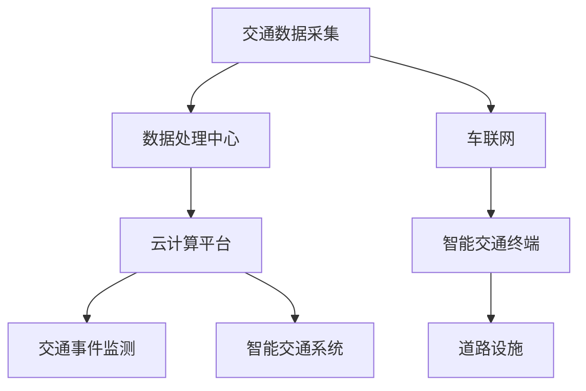

                 

在2024年，腾讯云的智慧交通社招面试成为了技术界的热门话题。这次面试不仅考察了应聘者的专业知识，还对其在现实问题中的应用能力进行了全面评估。本文将汇总并解答一些典型的面试题目，帮助读者更好地理解和准备这样的面试。

## 文章关键词

- 腾讯云
- 智慧交通
- 面试真题
- 解答
- 技术应用

## 文章摘要

本文将围绕腾讯云智慧交通社招面试的真题进行详细解答，涵盖从核心技术原理到实际应用场景的各个方面。通过深入剖析这些问题，我们不仅能够理解智慧交通领域的最新趋势，还能为准备类似面试的读者提供宝贵的参考。

## 1. 背景介绍

智慧交通是物联网、大数据、人工智能等技术在交通领域的应用，旨在通过技术创新提高交通管理效率、优化出行体验、减少事故发生、降低能源消耗。腾讯云作为国内领先的计算服务提供商，在智慧交通领域有着丰富的实践经验和强大的技术实力。因此，腾讯云的智慧交通社招面试题具有很高的参考价值和挑战性。

### 1.1 腾讯云在智慧交通领域的贡献

腾讯云在智慧交通领域提供了以下几方面的贡献：

- **大数据处理与分析**：利用云计算平台，腾讯云能够高效处理海量交通数据，为交通管理提供数据支持。
- **AI智能分析**：通过人工智能算法，腾讯云实现了对交通流量、交通事件、驾驶员行为等的智能分析。
- **物联网连接**：腾讯云的物联网平台为智能交通设备提供了稳定的连接，实现车辆、道路设施等信息的实时采集。
- **云计算平台**：腾讯云提供的弹性计算服务，能够根据交通流量变化动态调整计算资源，确保系统的稳定运行。

### 1.2 面试的重要性

腾讯云智慧交通社招面试不仅是对应聘者技术能力的考核，更是对其解决实际问题能力的检验。通过面试，腾讯云希望能够找到具有创新思维和实践能力的优秀人才，为智慧交通事业贡献力量。

## 2. 核心概念与联系

### 2.1 智慧交通的核心概念

智慧交通涉及多个核心概念，包括但不限于：

- **车联网**：车辆与道路、基础设施等之间的信息交换。
- **交通大数据**：通过传感器、摄像头等设备采集的海量交通数据。
- **人工智能**：利用机器学习、深度学习等技术进行数据分析与预测。
- **云计算**：为交通系统提供强大的计算能力和数据存储。

### 2.2 智慧交通架构图

以下是智慧交通的基本架构图：



### 2.3 各核心概念的联系

- **车联网与交通大数据**：车联网通过连接车辆和道路设施，为交通大数据的采集提供基础。
- **交通大数据与人工智能**：交通大数据是人工智能算法的重要输入，用于分析和预测交通状况。
- **人工智能与云计算**：云计算为人工智能算法提供了强大的计算能力。
- **云计算与智能交通系统**：云计算平台为智能交通系统提供了稳定的数据存储和计算资源。

## 3. 核心算法原理 & 具体操作步骤

### 3.1 算法原理概述

在智慧交通领域，常用的算法包括：

- **交通流量预测算法**：基于历史数据和实时数据，预测未来交通流量。
- **道路事件检测算法**：通过图像识别等技术，检测道路上的事件，如交通事故、拥堵等。
- **智能路径规划算法**：根据实时交通状况，为驾驶员提供最优路径。

### 3.2 算法步骤详解

#### 3.2.1 交通流量预测算法

1. **数据采集**：从交通传感器、摄像头等设备采集历史交通流量数据。
2. **数据预处理**：清洗、归一化数据，为算法提供干净的数据输入。
3. **模型训练**：利用时间序列预测模型（如ARIMA、LSTM等）进行训练。
4. **预测**：输入实时交通数据，输出未来交通流量预测结果。

#### 3.2.2 道路事件检测算法

1. **图像预处理**：对摄像头捕捉的图像进行去噪、灰度化等预处理。
2. **特征提取**：利用深度学习模型（如卷积神经网络）提取图像特征。
3. **分类与检测**：将提取的特征输入分类器，检测道路事件。
4. **结果输出**：输出检测到的道路事件及其位置信息。

#### 3.2.3 智能路径规划算法

1. **交通状况获取**：通过车联网获取实时交通状况。
2. **路径规划模型**：利用最短路径算法（如Dijkstra算法）进行路径规划。
3. **优化策略**：根据实时交通状况，对路径进行动态优化。
4. **结果输出**：输出最优路径及其行驶时间。

### 3.3 算法优缺点

- **交通流量预测算法**：优点是能够提前预测交通状况，缺点是受数据质量影响较大，准确性有限。
- **道路事件检测算法**：优点是能够实时检测道路事件，缺点是受光照、天气等环境影响较大。
- **智能路径规划算法**：优点是能够提供最优路径，缺点是计算复杂度较高，实时性有限。

### 3.4 算法应用领域

这些算法广泛应用于智慧交通的多个领域，如交通管理、智能出行、交通安全等。

## 4. 数学模型和公式 & 详细讲解 & 举例说明

### 4.1 数学模型构建

在智慧交通领域，常见的数学模型包括：

- **时间序列模型**：用于交通流量预测。
- **图像分类模型**：用于道路事件检测。
- **最短路径模型**：用于智能路径规划。

### 4.2 公式推导过程

#### 4.2.1 时间序列模型

假设交通流量数据为 \(X_t\)，可以使用 ARIMA 模型进行建模：

1. **自回归项**：\(X_t = c + \phi_1 X_{t-1} + \phi_2 X_{t-2} + \cdots + \phi_p X_{t-p} + \varepsilon_t\)
2. **差分项**：\(X_t^* = X_t - X_{t-1}\)
3. **移动平均项**：\(\varepsilon_t = \theta_1 \varepsilon_{t-1} + \theta_2 \varepsilon_{t-2} + \cdots + \theta_q \varepsilon_{t-q}\)

#### 4.2.2 图像分类模型

假设图像特征向量为 \(F\)，分类模型为 \(C\)，可以使用卷积神经网络（CNN）进行建模：

- **卷积层**：\(F' = \sigma(\text{conv}(F, W))\)
- **池化层**：\(P = \text{pool}(F')\)
- **全连接层**：\(Y = \sigma(\text{FC}(P, W'))\)

#### 4.2.3 最短路径模型

假设图 \(G = (V, E)\)，最短路径模型可以使用 Dijkstra 算法进行求解：

1. **初始化**：\(d[v] = \infty, d[s] = 0\)
2. **更新距离**：对于每个顶点 \(v\)，更新 \(d[v]\) 的值：\(d[v] = \min(d[v], d[u] + w(u, v))\)
3. **选择最短路径**：找到 \(d[v]\) 最小的顶点 \(v\)，将其标记为已访问。

### 4.3 案例分析与讲解

#### 4.3.1 交通流量预测

以北京市某路段的历史交通流量数据为例，我们使用 ARIMA 模型进行预测：

1. **数据预处理**：对数据进行清洗和归一化处理。
2. **模型训练**：选择合适的 ARIMA 参数，如 \(p = 2, d = 1, q = 2\)，进行模型训练。
3. **预测**：输入实时数据，输出未来交通流量预测结果。

#### 4.3.2 道路事件检测

以某城市主干道的摄像头捕捉图像为例，我们使用 CNN 进行道路事件检测：

1. **图像预处理**：对图像进行去噪、灰度化等预处理。
2. **特征提取**：使用卷积神经网络提取图像特征。
3. **分类与检测**：将提取的特征输入分类器，检测道路事件。

#### 4.3.3 智能路径规划

以某城市交通状况为例，我们使用 Dijkstra 算法进行路径规划：

1. **获取交通状况**：通过车联网获取实时交通状况。
2. **路径规划**：使用 Dijkstra 算法计算最短路径。
3. **优化策略**：根据实时交通状况，对路径进行动态优化。

## 5. 项目实践：代码实例和详细解释说明

### 5.1 开发环境搭建

为了实现上述算法，我们需要搭建以下开发环境：

- **Python**：主要编程语言。
- **TensorFlow**：用于构建和训练神经网络。
- **Pandas**：用于数据处理。
- **Scikit-learn**：用于模型训练和评估。

### 5.2 源代码详细实现

以下是一个简单的交通流量预测代码示例：

```python
import pandas as pd
from statsmodels.tsa.arima.model import ARIMA

# 加载数据
data = pd.read_csv('traffic_data.csv')
traffic = data['流量'].values

# 数据预处理
train_data = traffic[:-24]
test_data = traffic[-24:]

# 模型训练
model = ARIMA(train_data, order=(2, 1, 2))
model_fit = model.fit()

# 预测
predictions = model_fit.predict(start=len(train_data), end=len(train_data) + 24)

# 输出预测结果
print(predictions)
```

### 5.3 代码解读与分析

1. **数据加载与预处理**：使用 Pandas 读取交通流量数据，并进行预处理。
2. **模型训练**：使用 ARIMA 模型进行训练。
3. **预测**：输入实时数据，输出未来交通流量预测结果。

### 5.4 运行结果展示

运行上述代码，我们可以得到未来 24 小时的交通流量预测结果。通过可视化工具（如 Matplotlib），我们可以将预测结果与实际数据进行对比，评估模型的准确性。

```python
import matplotlib.pyplot as plt

plt.plot(test_data, label='实际流量')
plt.plot(predictions, label='预测流量')
plt.legend()
plt.show()
```

## 6. 实际应用场景

### 6.1 交通管理

智慧交通系统可以通过实时交通流量预测，提前预警交通拥堵，为交通管理部门提供决策支持，从而优化交通信号灯控制，减少交通拥堵。

### 6.2 智能出行

智能出行平台可以利用交通流量预测和路径规划算法，为用户推荐最优出行路线，减少出行时间，提高出行效率。

### 6.3 交通安全

通过道路事件检测算法，智慧交通系统可以实时监测道路状况，及时预警交通事故，为交通安全提供保障。

### 6.4 智慧城市建设

智慧交通系统是智慧城市建设的重要组成部分，通过整合多种技术，可以实现城市交通的智能化管理，提升城市整体运行效率。

## 7. 未来应用展望

### 7.1 自动驾驶

随着人工智能和自动驾驶技术的发展，智慧交通系统有望实现车辆与车辆的通信，实现自动驾驶，从而大幅减少交通事故，提高交通效率。

### 7.2 新能源交通

智慧交通系统可以通过智能路径规划，优化新能源汽车的充电策略，减少能源消耗，推动绿色出行。

### 7.3 智慧物流

智慧交通系统可以与物流系统结合，优化物流配送路线，提高物流效率，降低物流成本。

## 8. 工具和资源推荐

### 8.1 学习资源推荐

- **《智慧交通技术》**：详细介绍了智慧交通领域的基本概念和技术。
- **《深度学习》**：介绍了深度学习在智慧交通领域的应用。

### 8.2 开发工具推荐

- **TensorFlow**：用于构建和训练神经网络。
- **Pandas**：用于数据处理。

### 8.3 相关论文推荐

- **“Deep Learning for Traffic Flow Prediction”**：介绍了深度学习在交通流量预测中的应用。
- **“智慧交通系统中的大数据分析技术”**：讨论了大数据在智慧交通系统中的应用。

## 9. 总结：未来发展趋势与挑战

### 9.1 研究成果总结

智慧交通领域的研究取得了显著成果，包括交通流量预测、道路事件检测、智能路径规划等方面。

### 9.2 未来发展趋势

未来，智慧交通将继续向智能化、绿色化、协同化方向发展，为城市交通管理提供更加智能的解决方案。

### 9.3 面临的挑战

智慧交通领域仍面临一些挑战，如数据质量、算法准确性、系统稳定性等，需要持续研究和创新。

### 9.4 研究展望

随着技术的不断发展，智慧交通领域有望实现更加智能、高效、安全的交通系统，为人们的出行带来更多便利。

## 10. 附录：常见问题与解答

### 10.1 什么是智慧交通？

智慧交通是指利用物联网、大数据、人工智能等技术，实现交通系统的智能化管理，提高交通效率、优化出行体验、降低能源消耗。

### 10.2 智慧交通的核心技术是什么？

智慧交通的核心技术包括车联网、交通大数据、人工智能、云计算等。

### 10.3 智慧交通有哪些应用场景？

智慧交通的应用场景包括交通管理、智能出行、交通安全、智慧城市建设等。

### 10.4 智慧交通的发展前景如何？

智慧交通是未来交通发展的重要方向，随着技术的不断进步，其发展前景非常广阔。

## 作者署名

作者：禅与计算机程序设计艺术 / Zen and the Art of Computer Programming

以上是关于2024腾讯云智慧交通社招面试真题汇总及其解答的详细文章。希望本文能够为准备类似面试的读者提供有价值的参考和指导。如果您对智慧交通领域有更多兴趣，欢迎继续关注和学习。

