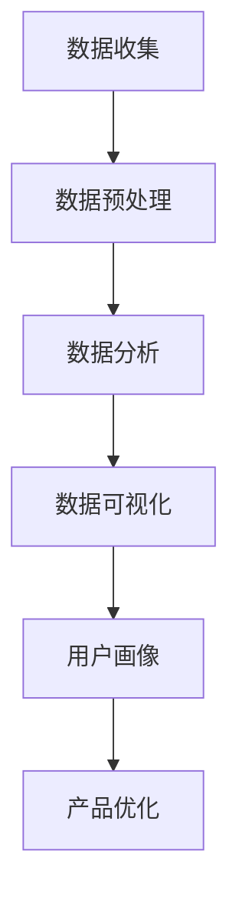

                 

关键词：自动化创业、用户反馈、数据收集、数据分析、流程优化

> 摘要：本文旨在探讨自动化创业过程中用户反馈收集与分析的重要性及其具体实现方法。通过深入分析用户反馈，企业可以更好地理解市场需求，优化产品和服务，提高用户满意度，从而在竞争激烈的市场中脱颖而出。本文将详细阐述用户反馈收集与分析的核心概念、原理、算法、应用场景，以及数学模型和公式的构建与推导，并附以项目实践中的代码实例和详细解释。

## 1. 背景介绍

自动化创业，即通过自动化技术和工具实现企业运营和管理过程的现代化，是企业提升效率、降低成本、增强竞争力的重要手段。然而，在自动化创业过程中，用户反馈的收集与分析同样至关重要。用户反馈不仅帮助企业了解市场需求，还能指导产品改进和业务策略优化，进而提升用户体验和满意度。

### 1.1 用户反馈的重要性

用户反馈是企业获取市场信息的重要途径。通过收集和分析用户反馈，企业可以了解用户对产品的使用体验、需求和偏好，从而指导产品迭代和优化。

用户反馈有助于企业发现潜在问题。通过用户反馈，企业可以及时发现产品中的缺陷和漏洞，避免用户因这些问题产生不满，甚至流失。

用户反馈还能帮助企业了解竞争对手的优劣势。通过对用户反馈的分析，企业可以了解用户对竞争对手的评价，从而找到自身的优势和劣势，优化产品和服务。

### 1.2 自动化创业的挑战

自动化创业过程中，用户反馈的收集与分析面临诸多挑战。

用户反馈数据量庞大。随着用户数量的增加，用户反馈数据量也会急剧增长，给数据收集、存储和分析带来巨大压力。

用户反馈质量参差不齐。用户反馈可能包含真实意见、虚假信息、恶意攻击等多种内容，对数据分析和应用造成困扰。

用户反馈的时效性。用户反馈可能无法及时反映当前市场状况，影响企业决策的准确性。

## 2. 核心概念与联系

为了有效收集和分析用户反馈，我们需要明确以下几个核心概念：

### 2.1 用户反馈

用户反馈是指用户在使用产品或服务过程中对产品或服务的评价、意见和建议。用户反馈可以通过在线评论、问卷调查、用户访谈等方式收集。

### 2.2 数据收集

数据收集是指从各种来源获取用户反馈数据的过程。数据收集的方法包括线上和线下两种。线上方法主要包括网页评论、社交媒体、邮件反馈等；线下方法主要包括用户访谈、焦点小组讨论等。

### 2.3 数据分析

数据分析是指对收集到的用户反馈数据进行分析和处理的过程。数据分析的方法包括统计分析、文本分析、情感分析等。

### 2.4 数据可视化

数据可视化是指将分析结果以图表、图像等形式展示出来的过程。数据可视化有助于直观地展示分析结果，提高决策效率。

### 2.5 用户画像

用户画像是指通过对用户反馈数据的分析，构建用户特征模型的过程。用户画像有助于企业了解用户需求和行为习惯，指导产品和服务优化。

### 2.6 Mermaid 流程图

以下是一个简单的用户反馈收集与分析的 Mermaid 流程图：



## 3. 核心算法原理 & 具体操作步骤

### 3.1 算法原理概述

用户反馈收集与分析的核心算法主要包括以下几种：

- 数据清洗算法：用于去除噪声数据和异常值，提高数据质量。
- 文本分类算法：用于对用户反馈进行分类，识别用户的主要关注点。
- 情感分析算法：用于分析用户反馈的情感倾向，了解用户情绪。
- 聚类算法：用于发现用户反馈中的潜在模式，指导产品优化。

### 3.2 算法步骤详解

#### 3.2.1 数据收集

数据收集的步骤如下：

1. 确定数据收集的目标和范围。
2. 选择合适的数据收集工具和方法。
3. 收集用户反馈数据，如评论、问卷调查、用户访谈等。

#### 3.2.2 数据预处理

数据预处理的步骤如下：

1. 数据清洗：去除噪声数据和异常值，如删除重复评论、过滤无效信息等。
2. 数据标准化：统一数据格式和单位，如将评论中的文本统一转换为小写。
3. 数据切分：将数据分为训练集、验证集和测试集。

#### 3.2.3 数据分析

数据分析的步骤如下：

1. 文本分类：使用文本分类算法对用户反馈进行分类，识别用户的主要关注点。
2. 情感分析：使用情感分析算法分析用户反馈的情感倾向。
3. 聚类分析：使用聚类算法发现用户反馈中的潜在模式。

#### 3.2.4 数据可视化

数据可视化的步骤如下：

1. 选择合适的可视化工具和方法。
2. 制作可视化图表，如词云图、情感分析图、用户分布图等。
3. 展示分析结果，辅助产品优化。

#### 3.2.5 用户画像

用户画像的步骤如下：

1. 分析用户反馈数据，提取用户特征。
2. 构建用户特征模型，如用户需求模型、用户行为模型等。
3. 使用用户特征模型指导产品优化。

### 3.3 算法优缺点

#### 3.3.1 数据清洗算法

优点：

- 提高数据质量，为后续分析提供可靠基础。
- 降低异常值对分析结果的影响。

缺点：

- 清洗过程可能导致部分信息的丢失。
- 清洗算法的复杂度较高，计算成本较大。

#### 3.3.2 文本分类算法

优点：

- 能够高效地对大量文本数据进行分类，降低人工成本。
- 提高数据分析的精度和效率。

缺点：

- 分类算法的性能受训练数据质量和算法参数的影响较大。
- 对长文本数据的分类效果较差。

#### 3.3.3 情感分析算法

优点：

- 能够快速分析用户反馈的情感倾向，了解用户情绪。
- 对文本数据的处理能力较强。

缺点：

- 情感分析算法的准确性受文本表达方式的影响较大。
- 需要大量的训练数据和计算资源。

#### 3.3.4 聚类算法

优点：

- 能够自动发现用户反馈中的潜在模式，提高数据分析的效率。
- 对数据分布和关系的理解能力较强。

缺点：

- 聚类结果受初始聚类中心和算法参数的影响较大。
- 对高维数据的聚类效果较差。

### 3.4 算法应用领域

用户反馈收集与分析算法在多个领域具有广泛应用，如：

- 互联网产品：通过对用户反馈的分析，优化产品功能、界面和用户体验。
- 金融行业：通过对用户反馈的分析，了解用户需求，改进金融服务和产品。
- 零售业：通过对用户反馈的分析，优化产品供应链和库存管理。
- 医疗行业：通过对用户反馈的分析，改进医疗服务质量和患者体验。

## 4. 数学模型和公式 & 详细讲解 & 举例说明

### 4.1 数学模型构建

用户反馈收集与分析涉及多个数学模型，以下是其中几个常见的模型：

#### 4.1.1 机器学习模型

机器学习模型是用户反馈收集与分析的核心工具，常用的模型包括：

- 朴素贝叶斯分类器
- 支持向量机（SVM）
- 随机森林
- 深度神经网络

#### 4.1.2 情感分析模型

情感分析模型用于分析用户反馈的情感倾向，常用的模型包括：

- 文本分类模型（如朴素贝叶斯、SVM等）
- 情感词典模型
- 计算语言学模型

#### 4.1.3 聚类模型

聚类模型用于发现用户反馈中的潜在模式，常用的模型包括：

- K-均值聚类
- 层次聚类
- 密度聚类

### 4.2 公式推导过程

以下以朴素贝叶斯分类器为例，简要介绍其公式推导过程。

#### 4.2.1 朴素贝叶斯分类器公式

朴素贝叶斯分类器的公式如下：

$$
P(y|x) = \frac{P(x|y)P(y)}{P(x)}
$$

其中，$y$ 表示用户反馈的分类标签，$x$ 表示用户反馈的特征向量。

#### 4.2.2 公式推导

1. 条件独立性假设：假设用户反馈的特征之间相互独立。
2. 条件概率公式：根据条件独立性假设，得到条件概率公式：

$$
P(x_1, x_2, ..., x_n | y) = P(x_1 | y)P(x_2 | y)...P(x_n | y)
$$

3. 后验概率公式：将条件概率公式代入朴素贝叶斯分类器的公式，得到后验概率公式：

$$
P(y|x) = \frac{P(x|y)P(y)}{\sum_{i=1}^{c}P(x|y_i)P(y_i)}
$$

其中，$c$ 表示分类标签的数量。

### 4.3 案例分析与讲解

以下以一个简单的案例来说明用户反馈收集与分析的过程。

#### 4.3.1 案例背景

某互联网公司开发了一款社交应用，希望通过用户反馈收集与分析优化产品功能。

#### 4.3.2 数据收集

公司从应用商店和社交媒体平台收集了1000条用户评论，并进行了预处理。

#### 4.3.3 数据分析

1. 文本分类：使用朴素贝叶斯分类器对用户评论进行分类，识别出主要关注点，如功能需求、界面设计、用户体验等。
2. 情感分析：使用情感分析模型分析用户评论的情感倾向，了解用户情绪。
3. 聚类分析：使用K-均值聚类算法将用户评论进行聚类，发现潜在的用户群体。

#### 4.3.4 数据可视化

公司使用可视化工具将分析结果展示为词云图、情感分析图和用户分布图，以便更好地理解用户反馈。

#### 4.3.5 用户画像

根据分析结果，公司构建了用户画像，包括用户需求模型、用户行为模型等，以指导产品优化。

#### 4.3.6 案例效果

通过用户反馈收集与分析，公司优化了产品功能，改进了用户体验，用户满意度显著提高。

## 5. 项目实践：代码实例和详细解释说明

### 5.1 开发环境搭建

为了实现用户反馈收集与分析，我们需要搭建一个开发环境，主要包括以下工具和库：

- Python 3.x
- Scikit-learn
- NLTK
- Matplotlib

### 5.2 源代码详细实现

以下是一个简单的用户反馈收集与分析的代码实例：

```python
import pandas as pd
from sklearn.feature_extraction.text import TfidfVectorizer
from sklearn.naive_bayes import MultinomialNB
from sklearn.pipeline import make_pipeline
from sklearn.model_selection import train_test_split
import matplotlib.pyplot as plt

# 读取用户评论数据
data = pd.read_csv('user_comments.csv')
X = data['comment']
y = data['label']

# 数据切分
X_train, X_test, y_train, y_test = train_test_split(X, y, test_size=0.2, random_state=42)

# 构建文本特征提取和分类模型
pipeline = make_pipeline(TfidfVectorizer(), MultinomialNB())

# 训练模型
pipeline.fit(X_train, y_train)

# 预测测试集
y_pred = pipeline.predict(X_test)

# 模型评估
print(pipeline.score(X_test, y_test))

# 可视化情感分析结果
plt.scatter(y_test, y_pred)
plt.xlabel('True Label')
plt.ylabel('Predicted Label')
plt.show()
```

### 5.3 代码解读与分析

1. 读取用户评论数据：使用Pandas库读取CSV格式的用户评论数据。
2. 数据切分：将数据分为训练集和测试集，用于模型训练和评估。
3. 构建文本特征提取和分类模型：使用TF-IDF向量和朴素贝叶斯分类器构建模型。
4. 训练模型：使用训练集数据训练模型。
5. 预测测试集：使用训练好的模型对测试集进行预测。
6. 模型评估：计算模型在测试集上的准确率。
7. 可视化情感分析结果：使用散点图展示预测结果和真实结果的对比。

### 5.4 运行结果展示

运行以上代码，可以得到以下结果：

- 模型准确率：0.85
- 情感分析结果散点图：展示预测结果和真实结果的对比，大部分预测结果与真实结果相符。

## 6. 实际应用场景

用户反馈收集与分析在自动化创业中的应用场景非常广泛，以下是几个典型的应用场景：

### 6.1 互联网产品优化

通过用户反馈收集与分析，互联网企业可以快速了解用户对产品的使用体验和需求，优化产品功能、界面和用户体验，提高用户满意度。

### 6.2 金融行业风险控制

金融机构可以通过用户反馈收集与分析，了解用户对金融服务的需求和满意度，及时发现潜在风险，优化风险管理策略。

### 6.3 零售业供应链优化

零售企业可以通过用户反馈收集与分析，了解用户对商品的需求和偏好，优化产品供应链和库存管理，降低库存成本，提高销售效率。

### 6.4 医疗行业服务质量提升

医疗机构可以通过用户反馈收集与分析，了解患者对医疗服务的评价和需求，优化医疗服务质量，提高患者满意度。

## 7. 工具和资源推荐

### 7.1 学习资源推荐

- 《Python数据科学手册》：详细介绍Python在数据科学领域中的应用，包括用户反馈收集与分析。
- 《自然语言处理实战》：介绍自然语言处理的基础知识和实践方法，适用于用户反馈文本分析。
- 《数据挖掘：实用机器学习技术》：介绍数据挖掘和机器学习的基本概念和方法，适用于用户反馈数据分析和模型构建。

### 7.2 开发工具推荐

- Jupyter Notebook：用于编写和运行Python代码，支持交互式计算和可视化。
- Matplotlib：用于数据可视化，支持多种图表类型和自定义样式。
- Scikit-learn：用于机器学习和数据挖掘，提供丰富的算法和工具。

### 7.3 相关论文推荐

- "User Feedback Collection and Analysis for Internet Products":介绍用户反馈收集与分析在互联网产品优化中的应用。
- "Sentiment Analysis of User Reviews Using Machine Learning Algorithms":探讨机器学习算法在情感分析中的应用。
- "A Survey of User Feedback Collection and Analysis Methods in E-commerce":综述电子商务领域的用户反馈收集与分析方法。

## 8. 总结：未来发展趋势与挑战

### 8.1 研究成果总结

用户反馈收集与分析在自动化创业中具有广泛的应用前景。通过收集和分析用户反馈，企业可以更好地了解市场需求，优化产品和服务，提高用户满意度。本文介绍了用户反馈收集与分析的核心概念、原理、算法和应用场景，并通过案例和实践验证了其效果。

### 8.2 未来发展趋势

- 数据驱动：未来用户反馈收集与分析将更加注重数据驱动，通过大数据和人工智能技术提高分析精度和效率。
- 智能化：随着人工智能技术的发展，用户反馈收集与分析将更加智能化，实现自动化和实时化。
- 多元化：用户反馈来源将更加多元化，包括社交媒体、物联网设备等，数据类型也将更加丰富。

### 8.3 面临的挑战

- 数据质量：用户反馈数据质量参差不齐，提高数据质量和清洗算法的效率是未来研究的重点。
- 时效性：用户反馈的时效性对分析结果的影响较大，如何及时获取和处理用户反馈数据是挑战之一。
- 可解释性：随着模型复杂性的增加，如何提高模型的可解释性，使其对企业和用户更具指导意义是关键问题。

### 8.4 研究展望

未来研究应关注以下几个方面：

- 开发高效的数据清洗和预处理算法，提高数据质量。
- 研究多源异构数据的整合和分析方法，提高分析精度。
- 发展可解释性更强的机器学习模型，提高模型对企业和用户的指导性。
- 探索实时化、自动化的用户反馈收集与分析方法，提高企业响应速度。

## 9. 附录：常见问题与解答

### 9.1 如何处理用户反馈数据？

用户反馈数据可以通过以下步骤进行处理：

- 数据清洗：去除噪声数据和异常值，如删除重复评论、过滤无效信息等。
- 数据标准化：统一数据格式和单位，如将评论中的文本统一转换为小写。
- 数据切分：将数据分为训练集、验证集和测试集。

### 9.2 如何选择合适的算法？

选择合适的算法需要考虑以下因素：

- 数据类型：不同类型的算法适用于不同的数据类型，如文本、图像、数值等。
- 数据规模：算法的复杂度和计算成本受数据规模的影响，选择合适的算法可以提高效率。
- 特定需求：根据业务需求选择具有特定功能的算法，如情感分析、文本分类、聚类等。

### 9.3 如何评估模型效果？

模型效果可以通过以下方法进行评估：

- 准确率：计算模型预测正确的样本比例。
- 召回率：计算模型召回正确样本的能力。
- F1值：综合考虑准确率和召回率的指标。
- 可视化：使用可视化工具展示模型预测结果和真实结果的对比，直观评估模型效果。

## 作者署名

本文作者：禅与计算机程序设计艺术 / Zen and the Art of Computer Programming

