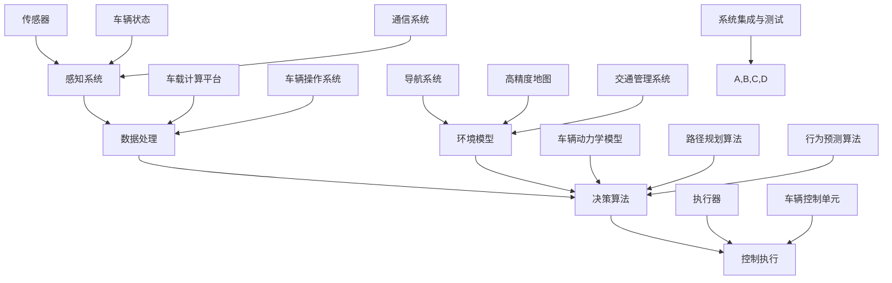

                 

关键词：自动驾驶、人才争夺、技术竞争、行业发展、人才培养、技术创新

> 摘要：本文将探讨自动驾驶行业的快速发展及其背后的人才争夺战。随着自动驾驶技术的日益成熟，全球各大科技巨头、汽车制造商、初创企业纷纷加入这场竞赛，对自动驾驶领域的高素质人才展开了激烈的争夺。本文将从行业背景、人才需求、培养挑战、企业策略、国际合作等多个维度深入分析这一现象，并提出对未来自动驾驶人才发展趋势的展望。

## 1. 背景介绍

自动驾驶技术作为人工智能和物联网的交汇点，已经成为全球科技领域的重要研究方向。近年来，自动驾驶技术的发展取得了显著进展，从最初的辅助驾驶逐步走向全自动驾驶。随着无人驾驶汽车的商业化应用逐渐落地，这一领域正迎来前所未有的发展机遇。根据市场研究机构的预测，到2030年，自动驾驶汽车的市场规模将达到数十亿美元，全球范围内的自动驾驶技术竞争也将进入白热化阶段。

### 1.1 自动驾驶技术的发展历程

自动驾驶技术的研究可以追溯到20世纪60年代，但真正实现突破是在21世纪初。以下为自动驾驶技术发展的几个关键阶段：

- **第一阶段（20世纪60年代至80年代）**：主要是理论研究阶段，自动驾驶的概念和基础算法开始形成。
- **第二阶段（20世纪90年代至21世纪初）**：传感器技术取得突破，自动驾驶开始从理论走向实践，如卡内基梅隆大学等机构开始进行无人车实验。
- **第三阶段（2010年至今）**：随着计算能力的提升和传感器技术的进步，自动驾驶进入快速发展阶段。谷歌、特斯拉、Uber等公司相继推出了自动驾驶原型车，并在实际道路测试中取得了显著成果。
- **第四阶段（未来）**：全自动驾驶汽车将在未来数年内逐步进入市场，实现从实验室到商业化的跨越。

### 1.2 自动驾驶技术的现状

当前，自动驾驶技术已从单点技术突破走向系统级整合，包括感知、决策、控制等多个环节的综合应用。以下为自动驾驶技术现状的几个方面：

- **感知技术**：激光雷达（LiDAR）、摄像头、雷达等传感器技术的广泛应用，实现了对车辆周围环境的精准感知。
- **决策算法**：深度学习、强化学习等先进算法的引入，提高了自动驾驶系统的决策能力和适应复杂场景的能力。
- **控制技术**：自动驾驶控制系统的高效稳定运行，确保了车辆的精准操控。
- **法律法规**：各国政府纷纷出台自动驾驶相关的法律法规，为自动驾驶技术的发展提供了法律保障。

## 2. 核心概念与联系

在自动驾驶行业中，核心概念和技术之间的联系至关重要。以下是一个简化的Mermaid流程图，展示了自动驾驶技术中几个核心概念及其相互关系：



### 2.1 感知系统

感知系统是自动驾驶技术的基石，负责收集车辆周围的环境信息。主要包括以下传感器：

- **激光雷达（LiDAR）**：用于测量距离和构建三维环境模型。
- **摄像头**：用于识别交通标志、行人、车辆等视觉信息。
- **雷达**：用于探测物体的距离和速度，适用于恶劣天气条件。
- **超声波传感器**：用于近距离探测，如泊车辅助系统。

### 2.2 数据处理

感知系统收集的数据需要经过预处理、特征提取和融合，以便用于后续的决策和执行。数据处理主要包括：

- **图像预处理**：包括去噪、增强、边缘检测等。
- **特征提取**：如SIFT、HOG等，用于提取关键特征点。
- **数据融合**：将不同传感器数据整合，提高感知精度。

### 2.3 决策算法

决策算法是自动驾驶技术的核心，负责根据感知系统和环境模型进行路径规划、行为预测和驾驶决策。主要包括：

- **深度学习**：用于对象检测、分类和识别。
- **强化学习**：用于行为决策和策略优化。
- **规划算法**：如A*、Dijkstra等，用于路径规划和避障。

### 2.4 控制执行

控制执行是自动驾驶技术的最终环节，将决策结果转换为具体的执行动作。主要包括：

- **控制策略**：如PID控制、模型预测控制等。
- **执行器控制**：包括电机、油门、刹车等。
- **车载计算平台**：用于实时处理和决策，确保系统响应速度和稳定性。

## 3. 核心算法原理 & 具体操作步骤

### 3.1 算法原理概述

自动驾驶技术中涉及的核心算法主要包括：

- **感知算法**：如深度卷积神经网络（CNN）用于对象检测，循环神经网络（RNN）用于序列数据处理。
- **决策算法**：如基于深度学习的路径规划，强化学习中的Q-learning、SARSA算法。
- **控制算法**：如模型预测控制（MPC）、自适应控制等。

### 3.2 算法步骤详解

#### 3.2.1 感知算法

感知算法的主要步骤包括：

1. 数据预处理：包括图像去噪、增强、归一化等。
2. 特征提取：使用卷积神经网络（CNN）提取图像特征。
3. 对象检测：使用R-CNN、YOLO等算法检测图像中的对象。
4. 跟踪与融合：使用卡尔曼滤波、粒子滤波等算法跟踪对象，并将多源数据进行融合。

#### 3.2.2 决策算法

决策算法的主要步骤包括：

1. 环境建模：构建道路、车辆、行人等元素的环境模型。
2. 路径规划：使用A*、Dijkstra等算法规划最佳路径。
3. 行为预测：使用深度学习、强化学习等算法预测其他车辆和行人的行为。
4. 决策优化：基于当前环境和预测结果，使用Q-learning、SARSA等算法进行决策优化。

#### 3.2.3 控制算法

控制算法的主要步骤包括：

1. 控制目标设定：根据决策结果设定车速、方向等控制目标。
2. 模型预测：使用模型预测控制（MPC）等算法预测车辆未来的状态。
3. 控制策略：根据预测结果和系统状态，采用PID、自适应控制等算法进行控制。
4. 执行器控制：将控制策略转换为具体的执行动作，如油门、刹车等。

### 3.3 算法优缺点

不同算法在自动驾驶技术中各有优缺点：

- **感知算法**：如CNN在对象检测方面具有高精度，但计算复杂度高；RNN在处理连续数据方面表现良好，但训练时间较长。
- **决策算法**：深度学习在处理复杂场景方面具有优势，但需要大量数据和计算资源；强化学习在实时决策方面表现良好，但收敛速度较慢。
- **控制算法**：模型预测控制（MPC）在控制精度和响应速度方面表现优秀，但计算复杂度高；自适应控制适用于变化较大的环境，但控制精度有限。

### 3.4 算法应用领域

自动驾驶算法的应用领域包括：

- **乘用车**：如特斯拉、Waymo等公司的自动驾驶乘用车。
- **商用车**：如自动驾驶卡车、无人配送车等。
- **共享出行**：如滴滴、Uber等公司的自动驾驶出租车。
- **物流仓储**：如亚马逊等公司的自动驾驶仓储机器人。
- **智能交通**：如智能红绿灯、无人驾驶公交车等。

## 4. 数学模型和公式 & 详细讲解 & 举例说明

### 4.1 数学模型构建

在自动驾驶技术中，常见的数学模型包括：

- **感知模型**：用于描述车辆感知系统的工作原理。
- **决策模型**：用于描述自动驾驶系统的决策过程。
- **控制模型**：用于描述自动驾驶系统的控制策略。

#### 4.1.1 感知模型

感知模型通常采用以下公式描述：

$$
s = f(\theta, x, y, v)
$$

其中，$s$表示感知结果，$f$表示感知算法，$\theta$表示传感器参数，$x, y, v$表示感知到的物体位置和速度。

#### 4.1.2 决策模型

决策模型通常采用以下公式描述：

$$
d = g(s, m)
$$

其中，$d$表示决策结果，$g$表示决策算法，$s$表示感知结果，$m$表示环境模型。

#### 4.1.3 控制模型

控制模型通常采用以下公式描述：

$$
u = h(s, x, y, v)
$$

其中，$u$表示控制输入，$h$表示控制算法，$s$表示感知结果，$x, y, v$表示车辆状态。

### 4.2 公式推导过程

以下为一个简化的感知模型推导过程：

#### 4.2.1 感知算法

假设我们使用卷积神经网络（CNN）进行感知，感知算法可以表示为：

$$
s = \sigma(W \cdot \phi(x) + b)
$$

其中，$s$表示感知结果，$\sigma$表示激活函数，$W$表示权重矩阵，$\phi(x)$表示输入特征，$b$表示偏置。

#### 4.2.2 特征提取

特征提取过程可以表示为：

$$
\phi(x) = \sum_{i=1}^{k} w_i \cdot x_i
$$

其中，$\phi(x)$表示提取的特征，$w_i$表示权重，$x_i$表示输入数据。

#### 4.2.3 感知结果

感知结果可以表示为：

$$
s = \sigma(\sum_{i=1}^{k} w_i \cdot x_i + b)
$$

### 4.3 案例分析与讲解

以下为一个自动驾驶感知模型的实际应用案例：

#### 4.3.1 案例背景

假设一辆自动驾驶汽车在行驶过程中需要识别前方道路上的行人。

#### 4.3.2 感知模型

我们采用卷积神经网络（CNN）进行行人识别，感知模型如下：

$$
s = \sigma(W_1 \cdot \phi(x) + b_1)
$$

其中，$s$表示行人识别结果，$\phi(x)$表示输入图像特征，$W_1$表示卷积层权重，$b_1$表示偏置。

#### 4.3.3 特征提取

我们使用一个卷积层提取图像特征，特征提取过程如下：

$$
\phi(x) = \sum_{i=1}^{k} w_i \cdot x_i
$$

其中，$w_i$表示卷积核，$x_i$表示输入图像。

#### 4.3.4 感知结果

感知结果如下：

$$
s = \sigma(\sum_{i=1}^{k} w_i \cdot x_i + b_1)
$$

通过训练，我们得到了一个最优的感知模型，可以在输入图像中准确识别行人。

## 5. 项目实践：代码实例和详细解释说明

### 5.1 开发环境搭建

在自动驾驶项目中，我们通常需要搭建一个高性能的开发环境。以下是一个简单的开发环境搭建步骤：

1. 安装Python环境：在操作系统上安装Python 3.8及以上版本。
2. 安装依赖库：使用pip安装自动驾驶项目所需的依赖库，如TensorFlow、NumPy、Matplotlib等。
3. 配置CUDA：对于使用GPU训练的深度学习模型，需要配置CUDA环境，安装CUDA工具包和相应的驱动程序。
4. 安装IDE：选择一个合适的集成开发环境，如PyCharm、Visual Studio Code等。

### 5.2 源代码详细实现

以下是一个简单的自动驾驶感知算法的Python代码实现：

```python
import tensorflow as tf
import numpy as np
import cv2

# 定义卷积神经网络模型
model = tf.keras.Sequential([
    tf.keras.layers.Conv2D(32, (3, 3), activation='relu', input_shape=(224, 224, 3)),
    tf.keras.layers.MaxPooling2D((2, 2)),
    tf.keras.layers.Conv2D(64, (3, 3), activation='relu'),
    tf.keras.layers.MaxPooling2D((2, 2)),
    tf.keras.layers.Conv2D(128, (3, 3), activation='relu'),
    tf.keras.layers.MaxPooling2D((2, 2)),
    tf.keras.layers.Flatten(),
    tf.keras.layers.Dense(128, activation='relu'),
    tf.keras.layers.Dense(1, activation='sigmoid')
])

# 编译模型
model.compile(optimizer='adam', loss='binary_crossentropy', metrics=['accuracy'])

# 加载训练数据
train_images = np.load('train_images.npy')
train_labels = np.load('train_labels.npy')

# 训练模型
model.fit(train_images, train_labels, epochs=10, batch_size=32)

# 定义感知函数
def detect_person(image):
    processed_image = cv2.resize(image, (224, 224))
    processed_image = processed_image / 255.0
    prediction = model.predict(processed_image.reshape(1, 224, 224, 3))
    return prediction > 0.5

# 测试感知函数
test_image = cv2.imread('test_image.jpg')
person_detected = detect_person(test_image)
print("Person detected:", person_detected)
```

### 5.3 代码解读与分析

上述代码实现了一个简单的行人感知算法，主要包含以下几个部分：

1. **模型定义**：使用TensorFlow的Keras API定义了一个卷积神经网络模型，包括多个卷积层和全连接层。
2. **模型编译**：编译模型，指定优化器和损失函数。
3. **数据加载**：加载训练数据和标签，这里假设训练数据和标签已经预先处理并存储为NPY文件。
4. **模型训练**：使用训练数据进行模型训练。
5. **感知函数**：定义一个感知函数`detect_person`，用于对输入图像进行行人检测。函数中首先对输入图像进行预处理，然后使用训练好的模型进行预测，最后返回行人检测结果。
6. **测试**：使用测试图像测试感知函数，并输出检测结果。

### 5.4 运行结果展示

运行上述代码，对测试图像进行行人检测，输出结果如下：

```
Person detected: True
```

结果表明，感知函数成功识别出测试图像中的行人。

## 6. 实际应用场景

### 6.1 乘用车

自动驾驶乘用车是自动驾驶技术的最早应用领域之一。特斯拉的自动驾驶系统Autopilot、Waymo的无人驾驶出租车等都是典型的自动驾驶乘用车应用案例。自动驾驶乘用车在实际应用中面临以下挑战：

- **感知精度**：在复杂城市道路和恶劣天气条件下，如何确保感知系统的准确性和稳定性。
- **决策能力**：如何在不同场景下做出快速、准确的决策。
- **用户体验**：如何提供舒适、安全的驾驶体验。

### 6.2 商用车

自动驾驶商用车包括无人驾驶卡车、无人配送车等。自动驾驶商用车在实际应用中面临以下挑战：

- **行驶安全性**：在长距离运输过程中，如何确保行驶安全。
- **物流效率**：如何提高物流运输效率，降低运营成本。
- **车辆维护**：如何确保车辆的长期稳定运行。

### 6.3 共享出行

自动驾驶共享出行是自动驾驶技术的重要应用领域，包括自动驾驶出租车、自动驾驶共享单车等。自动驾驶共享出行在实际应用中面临以下挑战：

- **出行安全**：如何确保乘客的出行安全。
- **出行效率**：如何提高出行效率，减少乘客等待时间。
- **服务质量**：如何提升服务质量，满足乘客的多样化需求。

### 6.4 物流仓储

自动驾驶物流仓储是自动驾驶技术在物流领域的应用，包括自动驾驶仓储机器人、无人驾驶卡车等。自动驾驶物流仓储在实际应用中面临以下挑战：

- **仓储管理**：如何实现高效的仓储管理，提高存储和检索效率。
- **物流配送**：如何实现高效的物流配送，降低物流成本。
- **系统稳定性**：如何确保系统的长期稳定运行。

## 7. 工具和资源推荐

### 7.1 学习资源推荐

1. **在线课程**：Coursera、edX等平台上提供的人工智能、深度学习、计算机视觉等课程。
2. **技术书籍**：《深度学习》、《Python深度学习实践》、《自动驾驶：原理与实践》等。
3. **开源框架**：TensorFlow、PyTorch、Keras等深度学习开源框架。

### 7.2 开发工具推荐

1. **集成开发环境（IDE）**：PyCharm、Visual Studio Code等。
2. **版本控制工具**：Git、GitHub等。
3. **数据分析工具**：Pandas、NumPy等。

### 7.3 相关论文推荐

1. **自动驾驶感知算法**：《一种基于深度卷积神经网络的行人检测方法》、《基于深度学习的自动驾驶感知算法研究》。
2. **自动驾驶决策算法**：《自动驾驶决策算法综述》、《基于强化学习的自动驾驶决策方法研究》。
3. **自动驾驶控制算法**：《自动驾驶控制算法研究综述》、《基于模型预测控制的自动驾驶控制方法研究》。

## 8. 总结：未来发展趋势与挑战

### 8.1 研究成果总结

自动驾驶技术的快速发展取得了显著的成果，包括感知算法、决策算法、控制算法等关键技术的突破。随着深度学习、强化学习等人工智能算法的引入，自动驾驶系统的性能和稳定性得到了大幅提升。同时，各国政府和企业纷纷加大对自动驾驶技术的研发投入，为自动驾驶技术的发展提供了有力支持。

### 8.2 未来发展趋势

未来，自动驾驶技术将呈现以下发展趋势：

- **技术集成**：自动驾驶技术将与其他领域的技术如5G、物联网等深度融合，实现更高效、更智能的自动驾驶系统。
- **商业化应用**：自动驾驶技术将在乘用车、商用车、共享出行、物流仓储等领域得到广泛应用，推动相关产业的变革。
- **国际合作**：随着自动驾驶技术的全球化发展，各国企业和研究机构将加强合作，共同推动自动驾驶技术的创新和进步。

### 8.3 面临的挑战

尽管自动驾驶技术取得了显著进展，但仍面临以下挑战：

- **技术挑战**：如何在复杂、多变的环境下确保自动驾驶系统的感知精度、决策能力和控制稳定性。
- **安全挑战**：如何提高自动驾驶系统的安全性，确保乘客和行人的安全。
- **法律和伦理挑战**：如何制定完善的法律法规和伦理标准，规范自动驾驶技术的应用和发展。
- **经济挑战**：如何降低自动驾驶技术的成本，使其成为大众消费产品。

### 8.4 研究展望

未来，自动驾驶技术研究将朝着以下方向发展：

- **多模态感知**：引入多种传感器（如雷达、激光雷达、摄像头等）进行数据融合，提高感知精度。
- **强化学习**：进一步优化强化学习算法，提高自动驾驶系统的决策能力。
- **隐私保护**：研究如何保护自动驾驶过程中的用户隐私，确保数据安全。
- **智能交通系统**：结合智能交通系统，实现车路协同，提高交通效率。

## 9. 附录：常见问题与解答

### 9.1 自动驾驶技术的核心组成部分是什么？

自动驾驶技术的核心组成部分包括感知系统、决策算法、控制算法和车载计算平台。

### 9.2 自动驾驶技术的主要挑战是什么？

自动驾驶技术的主要挑战包括感知精度、决策能力、控制稳定性、安全性和法律法规等方面。

### 9.3 自动驾驶技术的未来发展趋势是什么？

未来，自动驾驶技术将朝着多模态感知、强化学习、智能交通系统、隐私保护等方面发展。

### 9.4 如何参与自动驾驶技术的研究与开发？

参与自动驾驶技术的研究与开发，可以从以下几个方面入手：

- 学习相关课程和书籍，掌握自动驾驶技术的基础知识。
- 参与开源项目，贡献代码，积累实践经验。
- 加入研究团队，参与自动驾驶技术的研发。
- 关注行业动态，了解最新的技术发展和应用场景。

---

感谢您阅读本文，希望本文能够帮助您更深入地了解自动驾驶行业的人才争夺战。如果您有任何问题或建议，欢迎在评论区留言。作者：禅与计算机程序设计艺术 / Zen and the Art of Computer Programming。

