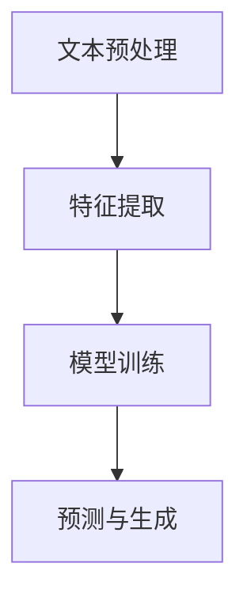

                 

关键词：自然语言处理，人工智能，内容创作，AI写作，文本生成，语义理解，机器学习，深度学习，大数据

> 摘要：随着自然语言处理（NLP）技术的飞速发展，人工智能（AI）在内容创作领域展现了强大的潜力。本文将探讨NLP在AI内容创作中的应用，从核心概念到算法原理，再到实际案例，全面分析NLP如何引发内容创作的革命。

## 1. 背景介绍

随着互联网的普及和信息爆炸，内容创作成为了一个重要的产业。然而，传统的内容创作方式往往耗时耗力，且难以满足大量个性化需求的快速响应。人工智能，特别是自然语言处理技术的发展，为解决这一难题提供了新的可能性。NLP作为AI的核心技术之一，旨在使计算机能够理解、生成和处理人类语言，从而实现自动化内容创作。

NLP的应用场景非常广泛，包括但不限于自动写作、机器翻译、情感分析、问答系统、智能客服等。其中，自动写作技术已经取得显著进展，能够生成新闻文章、产品评论、广告文案等。这些技术不仅提高了内容创作的效率，还拓展了内容的多样性和个性化程度。

## 2. 核心概念与联系

### 2.1. 自然语言处理的核心概念

自然语言处理涉及多个核心概念，包括词汇学、句法学、语义学和语用学。词汇学关注词汇的构成和意义，句法学研究句子的结构，语义学探讨语义的表示和理解，语用学则研究语言在具体情境中的应用。

这些概念相互关联，共同构成了NLP的理论基础。例如，词汇和句法知识有助于构建语法规则，语义理解需要结合上下文，而语用学则提供了语言使用的实际背景。

### 2.2. 自然语言处理的架构

自然语言处理的架构通常包括以下几个层次：

1. **预处理**：包括文本清洗、分词、词性标注等，目的是将原始文本转换为机器可以理解的格式。
2. **特征提取**：从文本中提取特征，如词袋模型、TF-IDF等，用于后续的机器学习过程。
3. **模型训练**：使用机器学习或深度学习算法训练模型，如循环神经网络（RNN）、长短时记忆网络（LSTM）和Transformer等。
4. **预测与生成**：模型根据训练数据生成新的文本，如自动写作、机器翻译等。

### 2.3. Mermaid流程图



## 3. 核心算法原理 & 具体操作步骤

### 3.1. 算法原理概述

自然语言处理的核心算法主要包括以下几种：

1. **词袋模型（Bag of Words, BoW）**：将文本表示为一个词汇的集合，不考虑单词的顺序。
2. **TF-IDF（Term Frequency-Inverse Document Frequency）**：衡量单词在文档中的重要程度，综合考虑词频和逆文档频率。
3. **循环神经网络（Recurrent Neural Network, RNN）**：适用于序列数据，如文本，能够捕捉到上下文信息。
4. **长短时记忆网络（Long Short-Term Memory, LSTM）**：RNN的变体，能够更好地处理长序列数据。
5. **Transformer模型**：基于自注意力机制，广泛应用于机器翻译和文本生成等领域。

### 3.2. 算法步骤详解

1. **文本预处理**：
   - 清洗：去除标点符号、HTML标签等。
   - 分词：将文本分割成单词或词汇。
   - 词性标注：标记每个单词的词性，如名词、动词等。

2. **特征提取**：
   - 词袋模型：将文本转换为词汇向量。
   - TF-IDF：计算每个词的TF-IDF值，用于表示文档。

3. **模型训练**：
   - RNN/LSTM：使用训练数据训练模型，调整权重。
   - Transformer：通过多层自注意力机制和前馈网络训练模型。

4. **预测与生成**：
   - 使用训练好的模型生成文本，如自动写作、机器翻译等。

### 3.3. 算法优缺点

- **词袋模型和TF-IDF**：
  - 优点：简单，易于实现。
  - 缺点：不考虑上下文，容易丢失语义信息。

- **RNN和LSTM**：
  - 优点：能够捕捉到上下文信息，适用于序列数据。
  - 缺点：难以处理长序列数据，计算复杂度较高。

- **Transformer**：
  - 优点：基于自注意力机制，能够高效处理长序列数据，生成文本质量高。
  - 缺点：模型参数较多，训练时间长。

### 3.4. 算法应用领域

- **自动写作**：新闻文章、产品评论、广告文案等。
- **机器翻译**：将一种语言翻译成另一种语言。
- **情感分析**：分析文本的情感倾向，如正面、负面等。
- **问答系统**：根据用户的问题生成回答。

## 4. 数学模型和公式 & 详细讲解 & 举例说明

### 4.1. 数学模型构建

自然语言处理中的数学模型主要包括以下几个方面：

- **词汇向量表示**：使用词嵌入（word embeddings）将单词转换为向量。
- **概率模型**：如朴素贝叶斯、隐马尔可夫模型（HMM）等。
- **神经网络模型**：如RNN、LSTM、Transformer等。

### 4.2. 公式推导过程

- **词嵌入**：

  $$ \text{word\_embeddings} = \{ \text{word}_1, \text{word}_2, ..., \text{word}_n \} \in \mathbb{R}^d $$

  其中，$ \text{word}_i $ 是单词 $ i $ 的词向量，$ d $ 是词向量的维度。

- **朴素贝叶斯**：

  $$ P(\text{label} = y | \text{features}) = \frac{P(\text{features} | \text{label} = y)P(\text{label} = y)}{P(\text{features})} $$

  其中，$ \text{label} $ 是标签，$ \text{features} $ 是特征向量。

- **神经网络**：

  $$ \text{output} = \text{激活函数}(\text{权重} \cdot \text{输入}) + \text{偏置} $$

  其中，$ \text{激活函数} $ 通常为ReLU、Sigmoid或Tanh等。

### 4.3. 案例分析与讲解

以自动写作为例，我们使用Transformer模型生成一篇新闻文章。

1. **数据预处理**：

   - 清洗文本，去除标点符号、HTML标签等。
   - 分词，将文本分割成单词或词汇。
   - 构建词汇表，将单词转换为索引。

2. **模型训练**：

   - 使用训练数据训练Transformer模型。
   - 调整模型参数，优化损失函数。

3. **文本生成**：

   - 输入一个单词或词汇作为起始。
   - 模型根据上下文生成下一个单词或词汇。
   - 重复上述过程，生成完整的文本。

## 5. 项目实践：代码实例和详细解释说明

### 5.1. 开发环境搭建

1. 安装Python环境（如Anaconda）。
2. 安装NLP相关库，如NLTK、spaCy、TensorFlow等。
3. 准备训练数据和测试数据。

### 5.2. 源代码详细实现

```python
import tensorflow as tf
from tensorflow.keras.layers import Embedding, LSTM, Dense
from tensorflow.keras.models import Sequential

# 模型构建
model = Sequential()
model.add(Embedding(input_dim=vocab_size, output_dim=embedding_dim))
model.add(LSTM(units=128))
model.add(Dense(units=vocab_size, activation='softmax'))

# 编译模型
model.compile(optimizer='adam', loss='categorical_crossentropy', metrics=['accuracy'])

# 训练模型
model.fit(x_train, y_train, epochs=10, batch_size=32)

# 文本生成
def generate_text(model, seed_text, num_words):
    generated = []
    seed_text = [word_index[word] for word in seed_text.split()]
    for _ in range(num_words):
        token_list = seed_text.copy()
        token_list.append('<NEXT>')
        token_list = tf.expand_dims(token_list, 0)
        predictions = model.predict(token_list)
        predicted_index = tf.argmax(predictions[0], axis=1).numpy()[0]
        predicted_word = reverse_word_index[predicted_index]
        generated.append(predicted_word)
        seed_text.append(predicted_word)
    return ' '.join(generated)

# 示例
seed_text = "Today is a beautiful day"
generated_text = generate_text(model, seed_text, num_words=20)
print(generated_text)
```

### 5.3. 代码解读与分析

1. **模型构建**：使用Sequential模型堆叠Embedding、LSTM和Dense层。
2. **编译模型**：指定优化器、损失函数和评估指标。
3. **训练模型**：使用fit方法训练模型。
4. **文本生成**：定义generate_text函数，根据输入种子文本生成新的文本。

## 6. 实际应用场景

### 6.1. 自动写作

- **新闻文章**：自动化新闻写作，提高新闻生产的速度和效率。
- **产品评论**：生成产品评论，提高电子商务平台的用户体验。

### 6.2. 机器翻译

- **跨语言交流**：实现跨语言沟通，促进全球交流。
- **多语言文档处理**：自动化翻译多语言文档，提高工作效率。

### 6.3. 情感分析

- **社交媒体监测**：分析社交媒体中的情感倾向，帮助企业了解用户需求。
- **舆情分析**：分析公众舆论，为政府和企业提供决策支持。

## 6.4. 未来应用展望

随着NLP技术的不断发展，未来有望实现更加智能化、个性化、高效化的内容创作。例如，基于多模态数据的融合技术，可以实现文本、图像、声音等多种形式的自动化创作。此外，随着深度学习和生成对抗网络（GAN）等技术的发展，内容生成的质量和多样性将得到进一步提升。

## 7. 工具和资源推荐

### 7.1. 学习资源推荐

- **书籍**：
  - 《自然语言处理综论》（Jurafsky和Martin著）
  - 《深度学习》（Goodfellow、Bengio和Courville著）
- **在线课程**：
  - Coursera上的“自然语言处理与深度学习”课程
  - edX上的“深度学习基础”课程

### 7.2. 开发工具推荐

- **Python库**：
  - NLTK：自然语言处理工具包
  - spaCy：快速、高效的NLP库
  - TensorFlow：深度学习框架
- **文本数据集**：
  - NLTK语料库：丰富的文本数据集
  - Wikipedia：维基百科全量文本数据

### 7.3. 相关论文推荐

- **NLP领域**：
  - “Attention Is All You Need”（Vaswani等，2017）
  - “BERT：Pre-training of Deep Bidirectional Transformers for Language Understanding”（Devlin等，2019）
- **深度学习领域**：
  - “Deep Learning”（Goodfellow、Bengio和Courville著）
  - “Neural Network Methods for Natural Language Processing”（Collobert和Johnson著）

## 8. 总结：未来发展趋势与挑战

### 8.1. 研究成果总结

自然语言处理技术在近年来取得了显著进展，尤其在自动写作、机器翻译、情感分析等领域。基于深度学习的模型，如Transformer，取得了突破性的成果，显著提高了文本生成的质量和效率。

### 8.2. 未来发展趋势

- **多模态融合**：结合文本、图像、声音等多模态数据，实现更智能的内容创作。
- **个性化生成**：基于用户偏好和历史行为，生成个性化内容。
- **跨语言交流**：实现更加准确、自然的跨语言翻译。

### 8.3. 面临的挑战

- **数据隐私与安全**：在处理大规模文本数据时，如何保护用户隐私和数据安全。
- **语义理解**：深入理解语言中的隐含意义和复杂逻辑关系。

### 8.4. 研究展望

随着技术的不断进步，NLP在内容创作领域的应用将更加广泛，未来有望实现高度智能化和自动化的内容创作。然而，要实现这一目标，仍需克服众多技术挑战。

## 9. 附录：常见问题与解答

### 9.1. 如何选择合适的NLP模型？

选择NLP模型时，需要考虑以下因素：

- **任务类型**：如文本分类、情感分析、文本生成等。
- **数据量**：大数据量建议使用复杂模型，小数据量建议使用简单模型。
- **计算资源**：复杂模型需要更多的计算资源。

### 9.2. 如何处理NLP中的长文本？

处理长文本时，可以使用以下方法：

- **文本摘要**：将长文本简化为摘要，减少处理复杂度。
- **分句处理**：将长文本分割为短句子，逐句处理。
- **动态窗口**：使用动态窗口技术，处理长序列数据。

### 9.3. 如何评估NLP模型的性能？

评估NLP模型性能的方法包括：

- **准确率**：正确分类的样本数占总样本数的比例。
- **召回率**：正确分类的样本数占所有正类样本数的比例。
- **F1值**：准确率和召回率的调和平均值。

### 9.4. 如何提高NLP模型的鲁棒性？

提高NLP模型鲁棒性的方法包括：

- **数据增强**：增加训练数据的多样性和质量。
- **正则化**：使用正则化技术，防止过拟合。
- **迁移学习**：使用预训练模型，迁移到新任务。

---

作者：禅与计算机程序设计艺术 / Zen and the Art of Computer Programming

在内容创作领域，自然语言处理（NLP）正在引发一场革命。随着技术的不断进步，我们可以期待看到更加智能化、高效化和个性化化的内容创作方式。然而，要实现这一目标，仍需克服众多技术挑战。本文从核心概念到算法原理，再到实际案例，全面探讨了NLP在内容创作中的应用，为读者提供了全面的视角和深入的见解。希望本文能够为您的NLP研究和实践提供有价值的参考。让我们共同期待NLP技术在内容创作领域带来更多精彩的应用。

