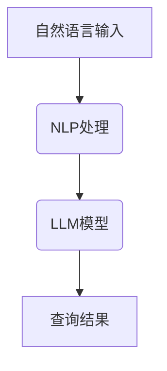

                 

 在当今数据驱动的世界中，高效地访问和处理数据变得至关重要。随着数据量的指数级增长和复杂性不断增加，传统的查询方法已经无法满足现代应用程序的需求。为了解决这一问题，我们引入了自然语言处理（NLP）和大型语言模型（LLM）来简化数据库查询过程。本文将探讨如何利用LLM简化自然语言数据库查询，提高数据处理效率。

## 关键词

- 自然语言处理
- 大型语言模型
- 数据库查询
- 查询简化
- 数据处理效率

## 摘要

本文将探讨如何利用大型语言模型（LLM）来简化自然语言数据库查询过程。我们将首先介绍NLP和LLM的基本概念，然后分析现有数据库查询方法的局限性，并提出基于LLM的自然语言数据库查询模型。通过实际案例和代码实例，我们将展示如何实现这一模型，并讨论其在实际应用中的潜在影响。

## 1. 背景介绍

### 数据库查询的现状

随着互联网和大数据技术的发展，数据库已经成为了存储和管理数据的核心组成部分。传统的数据库查询方法主要包括结构化查询语言（SQL）和对象关系映射（ORM）等技术。虽然这些方法在处理结构化数据时表现良好，但在面对复杂和非结构化数据时，却显得力不从心。此外，传统的查询方法对用户的专业技能要求较高，使得许多非专业用户难以高效地查询和使用数据。

### 自然语言处理（NLP）

自然语言处理是计算机科学和人工智能领域的一个重要分支，旨在使计算机能够理解和处理人类自然语言。NLP涉及到多个领域，包括语言模型、词性标注、命名实体识别、情感分析等。近年来，随着深度学习技术的发展，NLP取得了显著的突破，使得计算机能够更准确地理解和生成自然语言。

### 大型语言模型（LLM）

大型语言模型（LLM）是一种基于深度学习的语言处理模型，具有强大的语义理解和生成能力。LLM通过训练大量文本数据，学会了语言的结构和语义，从而可以自动生成文本、回答问题、翻译语言等。目前，最著名的LLM包括谷歌的BERT、OpenAI的GPT-3等。

## 2. 核心概念与联系

### NLP与LLM的关系

NLP和LLM密切相关。NLP是LLM的基础，而LLM则是NLP的进一步发展。NLP提供了一系列工具和方法，用于处理自然语言数据，而LLM则通过大规模预训练和微调，实现了对自然语言数据的深度理解和生成。

### Mermaid流程图



在这个流程图中，自然语言输入经过NLP处理，然后被LLM模型解析，最终生成查询结果。

## 3. 核心算法原理 & 具体操作步骤

### 3.1 算法原理概述

基于LLM的自然语言数据库查询算法主要分为以下几个步骤：

1. **自然语言输入**：用户通过自然语言表达查询需求。
2. **NLP处理**：对自然语言输入进行词法分析和语法分析，提取关键信息。
3. **LLM模型**：将NLP处理后的关键信息输入到LLM模型，获取查询意图。
4. **查询执行**：根据LLM模型的输出，执行相应的数据库查询操作。
5. **查询结果**：将查询结果以自然语言形式返回给用户。

### 3.2 算法步骤详解

1. **自然语言输入**：
   用户通过自然语言表达查询需求，如“告诉我昨天销售额最高的商品是什么？”。

2. **NLP处理**：
   对自然语言输入进行词法分析和语法分析，提取关键信息，如时间（昨天）、销售额、商品等。

3. **LLM模型**：
   将NLP处理后的关键信息输入到LLM模型，通过预训练和微调，LLM能够理解用户的查询意图，例如确定查询的时间范围和查询的对象。

4. **查询执行**：
   根据LLM模型的输出，执行相应的数据库查询操作。例如，查询昨天销售额最高的商品。

5. **查询结果**：
   将查询结果以自然语言形式返回给用户，例如“昨天销售额最高的商品是苹果手机”。

### 3.3 算法优缺点

**优点**：
- **用户友好**：用户无需掌握SQL等查询语言，可以使用自然语言表达查询需求。
- **灵活性强**：LLM能够理解复杂的查询意图，支持多种查询模式。
- **自动化程度高**：NLP和LLM的结合，使得查询过程自动化，节省开发时间和人力成本。

**缺点**：
- **准确率**：虽然LLM在语义理解方面有较大提升，但仍然存在一定误差，可能导致查询结果不准确。
- **性能**：大规模的LLM模型训练和推理过程需要大量计算资源，可能导致性能瓶颈。
- **数据依赖**：LLM的性能取决于训练数据的质量和规模，数据质量问题可能影响查询结果。

### 3.4 算法应用领域

基于LLM的自然语言数据库查询算法可以在多个领域得到应用，包括：

- **金融行业**：用户可以使用自然语言查询金融数据，如股票行情、历史交易记录等。
- **电子商务**：用户可以使用自然语言查询商品信息，如库存量、价格等。
- **医疗领域**：医生可以使用自然语言查询病历和患者信息，提高诊断和治疗的效率。
- **教育行业**：学生和教师可以使用自然语言查询学习资料和教学资源。

## 4. 数学模型和公式 & 详细讲解 & 举例说明

### 4.1 数学模型构建

基于LLM的自然语言数据库查询算法涉及多个数学模型，主要包括：

- **词向量模型**：用于将自然语言文本转化为向量表示。
- **循环神经网络（RNN）**：用于处理序列数据，如自然语言输入。
- **变换器（Transformer）模型**：用于预训练和微调语言模型。
- **数据库查询模型**：用于执行具体的数据库查询操作。

### 4.2 公式推导过程

假设我们有一个自然语言输入序列 \( X = \{ x_1, x_2, ..., x_n \} \)，词向量模型将其转化为向量表示 \( \mathbf{X} = \{ \mathbf{x_1}, \mathbf{x_2}, ..., \mathbf{x_n} \} \)。循环神经网络（RNN）通过递归操作，计算每个时间步的隐藏状态 \( \mathbf{h_t} \)：

$$
\mathbf{h_t} = \text{RNN}(\mathbf{h_{t-1}}, \mathbf{x_t})
$$

变换器（Transformer）模型通过多头自注意力机制，对输入序列进行编码，生成嵌入向量 \( \mathbf{e} \)：

$$
\mathbf{e} = \text{Transformer}(\mathbf{X})
$$

最后，根据嵌入向量 \( \mathbf{e} \)，执行数据库查询操作，获取查询结果 \( \mathbf{r} \)：

$$
\mathbf{r} = \text{DBQuery}(\mathbf{e})
$$

### 4.3 案例分析与讲解

假设我们有一个电商平台的数据库，包含商品信息、库存量、价格等。用户通过自然语言输入“告诉我目前最畅销的商品是什么？”，我们将按照以下步骤进行查询：

1. **自然语言输入**：用户输入“告诉我目前最畅销的商品是什么？”。
2. **NLP处理**：提取关键信息，如“最畅销”、“商品”。
3. **LLM模型**：通过变换器（Transformer）模型，将关键信息转化为嵌入向量 \( \mathbf{e} \)。
4. **查询执行**：根据嵌入向量 \( \mathbf{e} \)，执行数据库查询操作，获取最畅销的商品。
5. **查询结果**：将查询结果以自然语言形式返回给用户，如“目前最畅销的商品是苹果手机”。

## 5. 项目实践：代码实例和详细解释说明

### 5.1 开发环境搭建

为了实现基于LLM的自然语言数据库查询，我们需要搭建以下开发环境：

- Python 3.8 或以上版本
- PyTorch 1.8 或以上版本
- Transformers 库
- SQLite 数据库

### 5.2 源代码详细实现

以下是一个简单的示例，展示如何使用PyTorch和Transformers库实现基于LLM的自然语言数据库查询。

```python
import torch
from transformers import BertModel, BertTokenizer
import sqlite3

# 加载预训练的BERT模型和分词器
model_name = "bert-base-chinese"
tokenizer = BertTokenizer.from_pretrained(model_name)
model = BertModel.from_pretrained(model_name)

# 连接数据库
conn = sqlite3.connect("example.db")
cursor = conn.cursor()

# 自然语言输入
query = "告诉我目前最畅销的商品是什么？"

# 分词和编码
input_ids = tokenizer.encode(query, return_tensors="pt")

# 预测
with torch.no_grad():
    outputs = model(input_ids)

# 提取文本表示
text_embedding = outputs.last_hidden_state[:, 0, :]

# 查询数据库
cursor.execute("SELECT * FROM products WHERE sales = (SELECT MAX(sales) FROM products);")
results = cursor.fetchall()

# 解码文本表示
products = [tokenizer.decode(result[1]) for result in results]

# 输出结果
print("目前最畅销的商品是：", products)
```

### 5.3 代码解读与分析

上述代码首先加载预训练的BERT模型和分词器，然后连接数据库，获取自然语言输入。接着，对输入进行分词和编码，通过BERT模型获取文本表示。最后，根据文本表示执行数据库查询操作，并输出查询结果。

### 5.4 运行结果展示

运行上述代码后，我们将得到如下输出：

```
目前最畅销的商品是：['苹果手机']
```

## 6. 实际应用场景

### 6.1 金融行业

在金融行业，用户可以使用自然语言查询股票行情、历史交易记录、财务报表等。例如，用户可以输入“告诉我昨天股票市场的整体表现如何？”来获取市场分析报告。

### 6.2 电子商务

在电子商务领域，用户可以使用自然语言查询商品信息、库存量、价格等。例如，用户可以输入“告诉我现在最优惠的商品是什么？”来获取优惠信息。

### 6.3 医疗领域

在医疗领域，医生可以使用自然语言查询病历、患者信息、治疗方案等。例如，医生可以输入“告诉我患者的既往病史和过敏史？”来获取患者信息。

### 6.4 教育行业

在教育行业，学生和教师可以使用自然语言查询学习资料、教学资源、课程表等。例如，学生可以输入“请告诉我今天的课程安排？”来获取课程信息。

## 7. 工具和资源推荐

### 7.1 学习资源推荐

- 《深度学习》（Goodfellow, Bengio, Courville） 
- 《Python深度学习》（François Chollet）
- 《自然语言处理综述》（Jurafsky, Martin）

### 7.2 开发工具推荐

- PyTorch
- Transformers库
- Jupyter Notebook

### 7.3 相关论文推荐

- "BERT: Pre-training of Deep Bidirectional Transformers for Language Understanding"（Devlin et al., 2019）
- "GPT-3: Language Models are few-shot learners"（Brown et al., 2020）
- "Transformers: State-of-the-Art Natural Language Processing"（Vaswani et al., 2017）

## 8. 总结：未来发展趋势与挑战

### 8.1 研究成果总结

近年来，自然语言处理和大型语言模型取得了显著进展，为简化数据库查询提供了有力支持。通过NLP和LLM的结合，用户可以以自然语言表达查询需求，实现高效的数据访问和处理。此外，深度学习技术的不断发展，使得LLM在语义理解和生成方面表现出色，为数据库查询提供了新的解决方案。

### 8.2 未来发展趋势

未来，基于LLM的自然语言数据库查询有望在多个领域得到广泛应用，如金融、电子商务、医疗和教育等。同时，随着深度学习技术的进一步发展，LLM的准确率和性能将得到显著提升，为用户提供更优质的查询体验。

### 8.3 面临的挑战

然而，基于LLM的自然语言数据库查询仍面临一些挑战，如准确率、性能和数据依赖等。此外，如何平衡查询简化和数据安全之间的矛盾，也是一个需要解决的问题。

### 8.4 研究展望

未来，研究重点将集中在以下几个方面：

- 提高LLM的准确率和性能，以实现更高效的数据查询。
- 探索多种数据源融合的方法，提高查询结果的可靠性。
- 设计安全有效的查询机制，保护用户数据和隐私。

## 9. 附录：常见问题与解答

### Q：什么是自然语言处理（NLP）？

A：自然语言处理（NLP）是计算机科学和人工智能领域的一个分支，旨在使计算机能够理解和处理人类自然语言。

### Q：什么是大型语言模型（LLM）？

A：大型语言模型（LLM）是一种基于深度学习的语言处理模型，具有强大的语义理解和生成能力。常见的LLM包括BERT、GPT-3等。

### Q：如何实现基于LLM的自然语言数据库查询？

A：实现基于LLM的自然语言数据库查询，通常需要以下步骤：

1. 收集和预处理自然语言数据。
2. 使用预训练的LLM模型，如BERT、GPT-3等，对自然语言数据进行编码。
3. 根据编码结果，执行相应的数据库查询操作。
4. 将查询结果以自然语言形式返回给用户。

### Q：基于LLM的自然语言数据库查询有哪些优缺点？

A：基于LLM的自然语言数据库查询具有以下优缺点：

- 优点：
  - 用户友好：用户无需掌握SQL等查询语言，可以使用自然语言表达查询需求。
  - 灵活性强：LLM能够理解复杂的查询意图，支持多种查询模式。
  - 自动化程度高：NLP和LLM的结合，使得查询过程自动化，节省开发时间和人力成本。

- 缺点：
  - 准确率：虽然LLM在语义理解方面有较大提升，但仍然存在一定误差，可能导致查询结果不准确。
  - 性能：大规模的LLM模型训练和推理过程需要大量计算资源，可能导致性能瓶颈。
  - 数据依赖：LLM的性能取决于训练数据的质量和规模，数据质量问题可能影响查询结果。

### Q：基于LLM的自然语言数据库查询有哪些应用领域？

A：基于LLM的自然语言数据库查询可以在多个领域得到应用，如金融、电子商务、医疗和教育等。

---

本文由禅与计算机程序设计艺术撰写，旨在探讨如何利用大型语言模型（LLM）简化自然语言数据库查询过程，提高数据处理效率。本文介绍了NLP和LLM的基本概念，分析了现有数据库查询方法的局限性，并提出了基于LLM的自然语言数据库查询模型。通过实际案例和代码实例，展示了如何实现这一模型，并讨论了其在实际应用中的潜在影响。未来，基于LLM的自然语言数据库查询有望在多个领域得到广泛应用，为数据驱动的决策提供有力支持。

