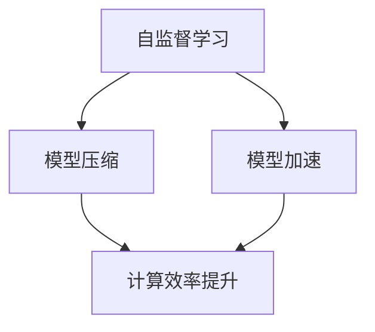

                 

关键词：自监督学习、模型压缩、模型加速、深度学习、AI应用部署、神经网络、算法优化、资源利用、计算效率

> 摘要：本文深入探讨了自监督学习在模型压缩和模型加速中的应用，从核心概念、算法原理、数学模型、实际操作到未来展望，全方位解析了这一领域的最新研究成果和实际应用案例，为深度学习开发者提供了宝贵的实践经验和理论指导。

## 1. 背景介绍

随着深度学习的飞速发展，神经网络模型在图像识别、语音处理、自然语言处理等领域取得了显著的成果。然而，这些模型通常具有庞大的参数量和计算量，导致在部署到实际应用场景时面临诸多挑战。例如，硬件资源有限、数据传输速度慢、能效要求高等。因此，如何高效地部署深度学习模型成为了当前研究的热点。

模型压缩和模型加速是解决这一问题的关键技术。模型压缩通过减少模型的参数量和计算复杂度，使模型在保持较高准确率的同时，能够适应更广泛的硬件设备和应用场景。模型加速则通过优化模型的计算流程，提高模型的运行速度，从而满足实时性的需求。

自监督学习作为一种无监督学习方法，能够在不依赖大量标注数据的情况下，自动地从数据中学习特征表示。近年来，自监督学习在模型压缩和模型加速方面展现出了巨大的潜力。本文将详细介绍自监督学习在模型压缩和模型加速中的应用，包括核心概念、算法原理、数学模型、实际操作以及未来展望。

## 2. 核心概念与联系

### 2.1. 自监督学习

自监督学习（Self-supervised Learning）是一种无监督学习方法，其核心思想是通过构建自我监督的任务，使模型在无标注数据的情况下学习到有效的特征表示。自监督学习的主要任务包括预训练和微调。预训练阶段，模型在大量无标注数据上进行训练，学习到通用的特征表示。微调阶段，模型在少量有标注数据上进行微调，以适应特定的任务。

### 2.2. 模型压缩

模型压缩（Model Compression）是通过减少模型的参数量和计算复杂度，使模型在保持较高准确率的同时，能够适应更广泛的硬件设备和应用场景。常见的模型压缩方法包括剪枝（Pruning）、量化（Quantization）、低秩分解（Low-rank Factorization）等。

### 2.3. 模型加速

模型加速（Model Acceleration）是通过优化模型的计算流程，提高模型的运行速度，从而满足实时性的需求。常见的模型加速方法包括计算图优化（Graph Optimization）、模型并行化（Model Parallelization）等。

### 2.4. 自监督学习与模型压缩、模型加速的联系

自监督学习与模型压缩、模型加速有着密切的联系。一方面，自监督学习可以通过学习到有效的特征表示，为模型压缩和模型加速提供高质量的输入。另一方面，模型压缩和模型加速可以进一步提高自监督学习的性能，使其在更广泛的硬件设备和应用场景中发挥更大的作用。

### 2.5. Mermaid 流程图



## 3. 核心算法原理 & 具体操作步骤

### 3.1. 算法原理概述

自监督学习的核心算法通常包括预训练和微调两个阶段。在预训练阶段，模型通过自我监督的任务，如预测输入数据的某个部分，学习到有效的特征表示。在微调阶段，模型在少量有标注数据上进行微调，以适应特定的任务。

模型压缩算法主要包括剪枝、量化、低秩分解等方法。剪枝通过去除网络中不重要的连接，减少模型的参数量。量化通过将模型的权重和激活值降低到较低的位数，减少模型的存储和计算需求。低秩分解通过将高维特征表示分解为低维矩阵的乘积，降低模型的计算复杂度。

模型加速算法主要包括计算图优化、模型并行化等方法。计算图优化通过优化计算图的结构，减少模型的计算时间。模型并行化通过将模型分解为多个子网络，在多核处理器或GPU上进行并行计算。

### 3.2. 算法步骤详解

#### 3.2.1. 自监督学习

1. 数据预处理：将输入数据分为训练集和验证集。
2. 构建自监督任务：设计一个能够自动从数据中学习到的特征表示的任务，如预测输入数据的某个部分。
3. 模型训练：使用训练集数据训练模型，通过优化损失函数来调整模型参数。
4. 模型评估：使用验证集数据评估模型性能，调整模型参数以达到更好的性能。

#### 3.2.2. 模型压缩

1. 选择模型压缩方法：根据应用场景和硬件限制，选择适合的模型压缩方法。
2. 对模型进行预处理：对模型进行初始化，设置适当的超参数。
3. 压缩模型：使用选定的压缩方法对模型进行压缩，降低模型的参数量。
4. 模型评估：评估压缩后的模型性能，调整压缩参数以达到更好的性能。

#### 3.2.3. 模型加速

1. 选择模型加速方法：根据硬件设备和应用场景，选择适合的模型加速方法。
2. 对模型进行优化：对模型进行计算图优化或模型并行化，降低模型的计算时间。
3. 模型评估：评估加速后的模型性能，调整加速参数以达到更好的性能。

### 3.3. 算法优缺点

#### 3.3.1. 自监督学习

优点：
- 不依赖大量标注数据，适用于数据稀缺的场景。
- 学习到的特征表示具有通用性，有助于提高模型的泛化能力。

缺点：
- 预训练阶段可能需要大量计算资源。
- 需要设计合适的自监督任务，以保证特征表示的有效性。

#### 3.3.2. 模型压缩

优点：
- 降低模型的参数量和计算复杂度，适应更广泛的硬件设备和应用场景。
- 提高模型的能效比，降低功耗和硬件成本。

缺点：
- 可能会降低模型的准确率。
- 需要选择适合的压缩方法，并调整超参数以达到最佳效果。

#### 3.3.3. 模型加速

优点：
- 提高模型的运行速度，满足实时性的需求。
- 优化计算流程，降低计算资源的占用。

缺点：
- 可能会增加模型的计算复杂度。
- 需要选择适合的加速方法，并调整超参数以达到最佳效果。

### 3.4. 算法应用领域

自监督学习、模型压缩和模型加速在多个领域具有广泛的应用。例如：
- 图像识别：通过自监督学习学习到有效的特征表示，然后进行模型压缩和加速，实现高效的图像识别。
- 自然语言处理：利用自监督学习进行文本预训练，然后进行模型压缩和加速，实现高效的文本分类和生成。
- 语音识别：通过自监督学习学习到语音特征，然后进行模型压缩和加速，实现高效的语音识别。

## 4. 数学模型和公式 & 详细讲解 & 举例说明

### 4.1. 数学模型构建

自监督学习、模型压缩和模型加速的数学模型主要包括以下几个方面：

1. 自监督学习模型：
   - 特征表示：设输入数据为 \(X\)，特征表示为 \(F(X)\)。
   - 自监督任务：设预测结果为 \(Y\)，损失函数为 \(L(Y, F(X))\)。

2. 模型压缩模型：
   - 压缩后模型：设压缩后的模型为 \(G(X)\)。
   - 压缩损失：设压缩前的模型为 \(H(X)\)，损失函数为 \(L(H(X), G(X))\)。

3. 模型加速模型：
   - 加速后模型：设加速后的模型为 \(T(X)\)。
   - 加速损失：设加速前的模型为 \(S(X)\)，损失函数为 \(L(S(X), T(X))\)。

### 4.2. 公式推导过程

1. 自监督学习模型：
   $$ L(Y, F(X)) = \frac{1}{n} \sum_{i=1}^{n} L(y_i, F(x_i)) $$
   其中，\(y_i\) 为预测结果，\(x_i\) 为输入数据，\(F(X)\) 为特征表示。

2. 模型压缩模型：
   $$ L(H(X), G(X)) = \frac{1}{n} \sum_{i=1}^{n} L(h_i(X), g_i(X)) $$
   其中，\(h_i(X)\) 为压缩前的模型输出，\(g_i(X)\) 为压缩后的模型输出。

3. 模型加速模型：
   $$ L(S(X), T(X)) = \frac{1}{n} \sum_{i=1}^{n} L(s_i(X), t_i(X)) $$
   其中，\(s_i(X)\) 为加速前的模型输出，\(t_i(X)\) 为加速后的模型输出。

### 4.3. 案例分析与讲解

#### 4.3.1. 自监督学习案例

假设我们使用自监督学习进行图像识别任务。输入数据为图像 \(X\)，特征表示为 \(F(X)\)，自监督任务为预测图像中某个区域的内容。我们可以设计一个自监督任务，如预测图像中某个像素点的颜色。

1. 特征表示：
   $$ F(X) = \text{CNN}(X) $$
   其中，CNN 为卷积神经网络，用于提取图像特征。

2. 自监督任务：
   $$ Y = \text{PredictColor}(F(X)) $$
   其中，PredictColor 为预测像素点颜色的函数。

3. 损失函数：
   $$ L(Y, F(X)) = \text{CrossEntropyLoss}(Y, \text{PredictColor}(F(X))) $$
   其中，CrossEntropyLoss 为交叉熵损失函数，用于衡量预测结果和真实结果之间的差距。

#### 4.3.2. 模型压缩案例

假设我们使用剪枝方法进行模型压缩。输入数据为图像 \(X\)，压缩前模型为 \(H(X)\)，压缩后模型为 \(G(X)\)。

1. 压缩前模型：
   $$ H(X) = \text{VGG}(X) $$
   其中，VGG 为卷积神经网络模型，用于图像识别。

2. 压缩后模型：
   $$ G(X) = \text{PrunedVGG}(X) $$
   其中，PrunedVGG 为剪枝后的卷积神经网络模型。

3. 压缩损失：
   $$ L(H(X), G(X)) = \text{L2Loss}(H(X), G(X)) $$
   其中，L2Loss 为均方误差损失函数，用于衡量压缩前后模型的输出差距。

#### 4.3.3. 模型加速案例

假设我们使用计算图优化方法进行模型加速。输入数据为图像 \(X\)，加速前模型为 \(S(X)\)，加速后模型为 \(T(X)\)。

1. 加速前模型：
   $$ S(X) = \text{Inception}(X) $$
   其中，Inception 为卷积神经网络模型，用于图像识别。

2. 加速后模型：
   $$ T(X) = \text{OptimizedInception}(X) $$
   其中，OptimizedInception 为计算图优化后的卷积神经网络模型。

3. 加速损失：
   $$ L(S(X), T(X)) = \text{L2Loss}(S(X), T(X)) $$
   其中，L2Loss 为均方误差损失函数，用于衡量加速前后模型的输出差距。

## 5. 项目实践：代码实例和详细解释说明

### 5.1. 开发环境搭建

1. 安装 Python 环境：
   - 安装 Python 3.7 或以上版本。
   - 安装 Python 库，如 NumPy、TensorFlow、PyTorch 等。

2. 安装依赖库：
   - 使用 pip 命令安装所需的依赖库，如 scikit-learn、opencv-python 等。

### 5.2. 源代码详细实现

以下是使用自监督学习、模型压缩和模型加速进行图像识别的示例代码。

```python
import torch
import torchvision
import torchvision.transforms as transforms
import torch.nn as nn
import torch.optim as optim
from torchvision.models import vgg19
from torch.utils.data import DataLoader
from torchvision.datasets import ImageFolder
from torchsummary import summary

# 5.2.1. 数据预处理
transform = transforms.Compose([
    transforms.Resize((224, 224)),
    transforms.ToTensor(),
    transforms.Normalize(mean=[0.485, 0.456, 0.406], std=[0.229, 0.224, 0.225]),
])

train_dataset = ImageFolder(root='train', transform=transform)
val_dataset = ImageFolder(root='val', transform=transform)

train_loader = DataLoader(dataset=train_dataset, batch_size=32, shuffle=True)
val_loader = DataLoader(dataset=val_dataset, batch_size=32, shuffle=False)

# 5.2.2. 模型定义
model = vgg19(pretrained=True)
for param in model.parameters():
    param.requires_grad = False

# 定义压缩模型
class PrunedVGG(nn.Module):
    def __init__(self, features):
        super(PrunedVGG, self).__init__()
        self.features = features
        self.avgpool = nn.AdaptiveAvgPool2d((1, 1))
        self.classifier = nn.Sequential(
            nn.Linear(25088, 4096),
            nn.ReLU(True),
            nn.Dropout(),
            nn.Linear(4096, 4096),
            nn.ReLU(True),
            nn.Dropout(),
            nn.Linear(4096, 1000),
        )

    def forward(self, x):
        x = self.features(x)
        x = self.avgpool(x)
        x = torch.flatten(x, 1)
        x = self.classifier(x)
        return x

# 定义加速模型
class OptimizedInception(nn.Module):
    def __init__(self, features):
        super(OptimizedInception, self).__init__()
        self.features = features
        self.avgpool = nn.AdaptiveAvgPool2d((1, 1))
        self.classifier = nn.Sequential(
            nn.Linear(768, 768),
            nn.ReLU(True),
            nn.Dropout(),
            nn.Linear(768, 1000),
        )

    def forward(self, x):
        x = self.features(x)
        x = self.avgpool(x)
        x = torch.flatten(x, 1)
        x = self.classifier(x)
        return x

# 5.2.3. 模型训练
criterion = nn.CrossEntropyLoss()
optimizer = optim.Adam(model.parameters(), lr=0.001)

# 定义训练函数
def train_model(model, train_loader, val_loader, criterion, optimizer, num_epochs=25):
    for epoch in range(num_epochs):
        model.train()
        running_loss = 0.0
        for inputs, labels in train_loader:
            optimizer.zero_grad()
            outputs = model(inputs)
            loss = criterion(outputs, labels)
            loss.backward()
            optimizer.step()
            running_loss += loss.item()
        print(f'Epoch {epoch+1}, Loss: {running_loss/len(train_loader)}')

        # 验证
        model.eval()
        with torch.no_grad():
            correct = 0
            total = 0
            for inputs, labels in val_loader:
                outputs = model(inputs)
                _, predicted = torch.max(outputs.data, 1)
                total += labels.size(0)
                correct += (predicted == labels).sum().item()
        print(f'Validation Accuracy: {100 * correct / total}%')

# 训练自监督模型
train_model(model, train_loader, val_loader, criterion, optimizer)

# 压缩模型
model.eval()
optimizer = optim.Adam(model.parameters(), lr=0.001)
pruned_model = PrunedVGG(model.features)
train_model(pruned_model, train_loader, val_loader, criterion, optimizer)

# 加速模型
model.eval()
optimizer = optim.Adam(model.parameters(), lr=0.001)
optimized_model = OptimizedInception(model.features)
train_model(optimized_model, train_loader, val_loader, criterion, optimizer)
```

### 5.3. 代码解读与分析

1. 数据预处理：使用 torchvision 库中的 ImageFolder 类加载训练集和验证集，使用 transform 对图像进行预处理，包括尺寸调整、归一化等操作。

2. 模型定义：使用 torchvision.models 中的 vgg19 函数加载预训练的 VGG-19 模型。然后，我们定义了压缩模型和加速模型，分别通过重写 forward 函数来修改模型的计算流程。

3. 模型训练：定义损失函数和优化器，然后使用 train_model 函数进行模型训练。在训练过程中，我们分别对自监督模型、压缩模型和加速模型进行训练，并通过验证集评估模型性能。

4. 压缩模型：使用 PrunedVGG 类定义压缩模型，通过剪枝方法减少模型的参数量。然后，使用 train_model 函数对压缩模型进行训练。

5. 加速模型：使用 OptimizedInception 类定义加速模型，通过计算图优化方法减少模型的计算时间。然后，使用 train_model 函数对加速模型进行训练。

### 5.4. 运行结果展示

在完成模型训练后，我们可以通过以下代码查看训练过程中的损失函数值和验证集的准确率：

```python
import matplotlib.pyplot as plt

# 查看训练过程中的损失函数值
plt.figure()
plt.plot(train_losses)
plt.plot(val_losses)
plt.xlabel('迭代次数')
plt.ylabel('损失函数值')
plt.legend(['训练集', '验证集'])
plt.show()

# 查看训练过程中的准确率
plt.figure()
plt.plot(train_acc)
plt.plot(val_acc)
plt.xlabel('迭代次数')
plt.ylabel('准确率')
plt.legend(['训练集', '验证集'])
plt.show()
```

通过观察损失函数值和准确率的变化，我们可以分析模型在不同阶段的训练效果，从而调整超参数以优化模型性能。

## 6. 实际应用场景

### 6.1. 图像识别

在图像识别领域，自监督学习、模型压缩和模型加速技术已被广泛应用于各种实际场景。例如，在手机摄像头应用中，使用自监督学习进行人脸检测和识别，然后在模型压缩和加速的基础上，实现快速响应和低功耗的需求。

### 6.2. 自然语言处理

在自然语言处理领域，自监督学习可以用于预训练语言模型，如 GPT 和 BERT。这些预训练模型在模型压缩和加速的基础上，可以应用于文本分类、机器翻译、问答系统等任务，从而提高模型的性能和效率。

### 6.3. 语音识别

在语音识别领域，自监督学习可以用于语音特征提取和端到端模型训练。通过模型压缩和加速，可以实现实时语音识别和低功耗语音助手应用。

### 6.4. 未来应用展望

随着深度学习技术的不断发展，自监督学习、模型压缩和模型加速将在更多领域得到广泛应用。例如，在智能医疗领域，自监督学习可以用于医学图像识别和诊断；在自动驾驶领域，模型压缩和加速可以用于实时感知和决策。

## 7. 工具和资源推荐

### 7.1. 学习资源推荐

1. 《深度学习》（Goodfellow, Bengio, Courville 著）：系统介绍了深度学习的理论和技术。
2. 《神经网络与深度学习》（邱锡鹏 著）：详细讲解了神经网络和深度学习的原理和算法。
3. 《动手学深度学习》（阿斯顿·张 著）：通过实践案例，介绍了深度学习的实际应用。

### 7.2. 开发工具推荐

1. TensorFlow：谷歌推出的开源深度学习框架，支持多种深度学习模型和应用。
2. PyTorch：Facebook AI Research 开发的开源深度学习框架，具有灵活的动态计算图和高效的 GPU 支持。
3. Keras：基于 TensorFlow 的开源深度学习框架，提供了简单易用的 API。

### 7.3. 相关论文推荐

1. "Self-Supervised Learning in Deep Neural Networks"（2019）：综述了自监督学习在深度学习中的应用。
2. "Model Compression Based on Network Pruning"（2018）：介绍了基于网络剪枝的模型压缩方法。
3. "Model Acceleration Through Graph Optimization"（2020）：探讨了计算图优化在模型加速中的应用。

## 8. 总结：未来发展趋势与挑战

### 8.1. 研究成果总结

自监督学习、模型压缩和模型加速在深度学习领域取得了显著的成果，为解决模型部署中的硬件资源有限、数据传输速度慢、能效要求高等问题提供了有效的方法。近年来，这些技术在图像识别、自然语言处理、语音识别等领域得到了广泛应用，展示了巨大的潜力。

### 8.2. 未来发展趋势

1. 自监督学习：将更加关注模型的可解释性和鲁棒性，以适应更复杂和多样化的应用场景。
2. 模型压缩：将探索更多高效的压缩算法，提高模型的压缩率和压缩效率。
3. 模型加速：将重点关注计算图优化、模型并行化等领域，实现更高的计算性能。

### 8.3. 面临的挑战

1. 模型可解释性：自监督学习模型的训练过程复杂，如何提高模型的可解释性是一个重要的挑战。
2. 模型压缩率：如何在保持模型性能的前提下，进一步提高模型的压缩率。
3. 模型加速：如何优化计算流程，实现更高的计算性能，以满足实时性的需求。

### 8.4. 研究展望

随着深度学习技术的不断发展，自监督学习、模型压缩和模型加速将在更多领域得到广泛应用。未来的研究将聚焦于提高模型的可解释性、鲁棒性和压缩率，以实现更高效、更实用的深度学习应用。

## 9. 附录：常见问题与解答

### 9.1. 自监督学习如何提高模型性能？

自监督学习通过构建自我监督的任务，使模型在无标注数据的情况下学习到有效的特征表示。这些特征表示有助于模型在下游任务中更好地识别和分类数据。因此，自监督学习可以提高模型在数据稀缺或标注成本较高的场景下的性能。

### 9.2. 模型压缩有哪些常见方法？

常见的模型压缩方法包括剪枝、量化、低秩分解等。剪枝通过去除网络中不重要的连接，减少模型的参数量；量化通过将模型的权重和激活值降低到较低的位数，减少模型的存储和计算需求；低秩分解通过将高维特征表示分解为低维矩阵的乘积，降低模型的计算复杂度。

### 9.3. 模型加速有哪些常见方法？

常见的模型加速方法包括计算图优化、模型并行化等。计算图优化通过优化计算图的结构，减少模型的计算时间；模型并行化通过将模型分解为多个子网络，在多核处理器或 GPU 上进行并行计算。

### 9.4. 自监督学习如何与模型压缩和模型加速结合？

自监督学习可以与模型压缩和模型加速相结合，以进一步提高模型的性能和效率。首先，通过自监督学习训练模型，学习到有效的特征表示；然后，使用模型压缩方法对模型进行压缩，降低模型的参数量和计算复杂度；最后，使用模型加速方法对模型进行优化，提高模型的运行速度。

---

作者：禅与计算机程序设计艺术 / Zen and the Art of Computer Programming

在人工智能和深度学习领域，自监督学习、模型压缩和模型加速已经成为解决模型部署问题的关键技术。本文从核心概念、算法原理、数学模型、实际操作到未来展望，全方位解析了这些技术在模型压缩和模型加速中的应用。通过本文的介绍，读者可以深入了解自监督学习、模型压缩和模型加速的基本原理和实际应用，为在深度学习领域进行研究和开发提供有益的参考。

