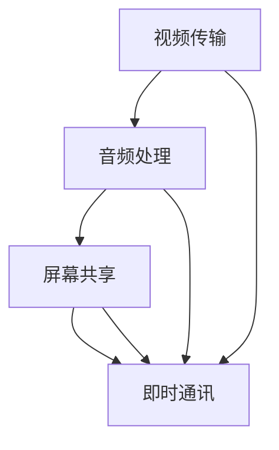

                 

在当今全球化的商业环境中，远程沟通已经成为企业运作不可或缺的一部分。随着远程工作的普及，虚拟会议系统的重要性日益凸显。本文将深入探讨虚拟会议系统的核心概念、技术实现、应用场景以及未来发展趋势，旨在为读者提供一幅全面的技术蓝图，揭示虚拟会议系统如何重塑远程沟通的新模式。

## 文章关键词

- 虚拟会议系统
- 远程沟通
- 视频会议
- 云计算
- 人工智能

## 文章摘要

本文首先介绍了虚拟会议系统的背景和发展现状，接着详细阐述了系统的核心概念与架构，包括视频传输、音频处理、屏幕共享、即时通讯等功能模块。随后，我们分析了虚拟会议系统的核心算法原理，并对其数学模型和公式进行了详细讲解。通过项目实践，我们展示了一个完整的虚拟会议系统开发实例，并对代码实现进行了深入剖析。最后，文章探讨了虚拟会议系统在实际应用中的重要性，以及未来的发展趋势和面临的挑战。

## 1. 背景介绍

在传统的工作模式中，面对面的交流是最为直接和高效的方式。然而，随着全球化和信息技术的发展，远程工作逐渐成为主流。远程工作不仅为企业提供了更广泛的人才选择，也提高了员工的工作灵活性和满意度。然而，远程工作的弊端在于沟通效率的降低，特别是在需要多方参与的会议中。

虚拟会议系统的出现，解决了远程沟通中的诸多问题。它通过互联网连接，使得身处不同地点的人们能够实时交流、协作，从而提高了工作效率。虚拟会议系统不仅支持视频会议，还包括音频传输、屏幕共享、文件传输、即时通讯等多种功能，为远程沟通提供了全方位的解决方案。

随着云计算和人工智能技术的不断进步，虚拟会议系统的性能和用户体验得到了显著提升。本文将重点探讨虚拟会议系统的技术实现、应用场景以及未来发展趋势，为读者提供深入的见解。

### 1.1 远程工作的普及

远程工作的普及是全球化和信息技术的产物。随着互联网的普及和移动设备的广泛应用，人们可以在任何时间、任何地点通过互联网访问企业资源，完成工作任务。这不仅提高了员工的工作效率，也减少了通勤时间和成本。根据一项调查显示，全球约有30%的员工采用远程工作模式，这一比例在未来几年有望继续增加。

远程工作的普及带来了诸多好处。首先，它为企业提供了更广泛的人才选择，企业不再受限于地理位置，可以雇佣全球范围内的优秀人才。其次，远程工作提高了员工的工作灵活性和满意度，员工可以在更加舒适的环境中工作，减少了工作与生活的冲突。此外，远程工作也有助于企业降低运营成本，减少办公室租赁和设备维护的费用。

然而，远程工作也带来了一些挑战，特别是沟通和协作方面。在远程工作中，团队成员无法通过面对面的交流来建立信任和合作关系，这可能导致沟通效率的降低和协作问题的出现。此外，远程工作还需要解决技术支持、安全性和数据隐私等问题。

### 1.2 虚拟会议系统的需求

虚拟会议系统的需求源于远程工作的沟通和协作挑战。在面对面的会议中，参会者可以通过眼神交流、肢体语言和即时反馈来更好地理解和沟通。而在远程会议中，这些非语言交流方式被剥夺，导致沟通效率的降低和信息传递的不完整。

虚拟会议系统通过视频、音频和即时通讯等技术，模拟了面对面的沟通体验。它使得身处不同地点的参会者能够实时交流，提高了沟通效率。此外，虚拟会议系统还提供了屏幕共享、文件传输等功能，方便团队成员共享信息和协作。

在远程工作中，虚拟会议系统不仅用于日常的沟通和协作，还用于项目会议、团队培训、客户交流等多种场景。它成为企业远程工作的重要组成部分，为企业提供了高效的沟通和协作工具。

### 1.3 虚拟会议系统的发展历程

虚拟会议系统的概念可以追溯到20世纪60年代。当时，研究人员开始探讨如何通过电话和网络实现远程交流。早期的虚拟会议系统主要依赖于电话和文本通信，视频和音频传输功能较为有限。

随着互联网的兴起，虚拟会议系统得到了快速发展。20世纪90年代，视频会议技术逐渐成熟，一些企业开始采用视频会议系统来替代传统的会议方式。视频会议系统不仅提高了沟通效率，还减少了会议成本。

进入21世纪，云计算和人工智能技术的快速发展，进一步推动了虚拟会议系统的创新。云计算提供了强大的计算和存储资源，使得虚拟会议系统可以处理大规模的数据传输和处理。人工智能技术则用于语音识别、自然语言处理等方面，提升了系统的智能化和用户体验。

近年来，随着5G网络的部署，虚拟会议系统的性能得到了显著提升。5G网络的高速和低延迟特性，使得虚拟会议系统的视频和音频质量得到了显著改善，为用户提供了更加流畅和真实的沟通体验。

总的来说，虚拟会议系统的发展历程体现了信息技术的发展趋势，从早期的简单文本和语音通信，到现代的复杂视频和智能交互，虚拟会议系统不断进化，为企业提供了更加高效和便捷的沟通工具。

### 1.4 虚拟会议系统的现状

目前，虚拟会议系统已经广泛应用于企业、教育、医疗等多个领域。在企业领域，虚拟会议系统成为远程工作的重要组成部分，许多企业采用视频会议系统来替代传统的面对面会议。在教育领域，虚拟会议系统为在线教育提供了重要的技术支持，学生和教师可以通过视频会议系统进行实时互动和学习。在医疗领域，虚拟会议系统用于远程诊疗和医疗咨询，提高了医疗服务的效率和质量。

虚拟会议系统的现状也反映了信息技术的不断进步。首先，视频和音频传输质量得到了显著提升，用户可以获得更加清晰和流畅的沟通体验。其次，虚拟会议系统的功能日益丰富，包括屏幕共享、文件传输、即时通讯等，满足了用户多样化的需求。此外，虚拟会议系统的智能化程度也在不断提高，通过人工智能技术，系统可以自动识别和翻译语言，处理多语种沟通问题。

然而，虚拟会议系统也面临着一些挑战。首先，网络延迟和带宽限制仍然是一个问题，特别是在远程用户较多的情况下，网络性能可能会受到影响。其次，虚拟会议系统的安全性和隐私保护仍然需要加强，特别是在企业内部使用时，需要确保数据的安全传输和存储。此外，虚拟会议系统的用户体验也需要进一步提升，例如改善界面设计、优化操作流程等。

总的来说，虚拟会议系统已经成为远程沟通的重要工具，其发展现状反映了信息技术的快速进步。未来，随着技术的进一步成熟，虚拟会议系统有望在更多领域得到应用，为远程工作提供更加高效和便捷的解决方案。

## 2. 核心概念与联系

虚拟会议系统作为远程沟通的关键工具，其核心概念和架构至关重要。以下是虚拟会议系统的核心概念与联系，以及相应的Mermaid流程图。

### 2.1 核心概念

#### 2.1.1 视频传输

视频传输是虚拟会议系统的核心功能之一。它通过视频编码和传输技术，实现会议成员之间的实时视频通信。视频传输主要包括视频采集、编码、传输和解码四个步骤。

- **视频采集**：通过摄像头等设备捕捉参会者的视频信号。
- **视频编码**：将采集到的视频信号转换为压缩格式，以便传输。
- **视频传输**：通过网络将压缩后的视频信号传输到其他参会者的设备。
- **视频解码**：接收端的设备对传输来的视频信号进行解码，恢复原始视频信号。

#### 2.1.2 音频处理

音频处理确保会议成员之间的音频通信清晰、稳定。音频处理主要包括音频采集、编码、传输和解码四个步骤。

- **音频采集**：通过麦克风等设备捕捉参会者的语音信号。
- **音频编码**：将采集到的音频信号转换为压缩格式，以便传输。
- **音频传输**：通过网络将压缩后的音频信号传输到其他参会者的设备。
- **音频解码**：接收端的设备对传输来的音频信号进行解码，恢复原始音频信号。

#### 2.1.3 屏幕共享

屏幕共享功能允许参会者共享自己的屏幕内容，便于演示、讲解和协作。屏幕共享主要包括屏幕捕捉、编码、传输和解码四个步骤。

- **屏幕捕捉**：捕捉参会者屏幕上的内容。
- **屏幕编码**：将捕捉到的屏幕内容转换为压缩格式，以便传输。
- **屏幕传输**：通过网络将压缩后的屏幕内容传输到其他参会者的设备。
- **屏幕解码**：接收端的设备对传输来的屏幕内容进行解码，恢复原始屏幕内容。

#### 2.1.4 即时通讯

即时通讯功能提供实时文本消息、表情符号、文件传输等，便于参会者之间进行即时交流。即时通讯主要包括消息采集、编码、传输和显示四个步骤。

- **消息采集**：采集参会者的文本消息、表情符号等。
- **消息编码**：将采集到的消息转换为压缩格式，以便传输。
- **消息传输**：通过网络将压缩后的消息传输到其他参会者的设备。
- **消息显示**：接收端的设备显示传输来的消息。

### 2.2 Mermaid 流程图

以下是一个简化的Mermaid流程图，展示了虚拟会议系统的核心概念与联系：



- **视频传输**同时连接到**即时通讯**，表示视频传输过程中可以发送实时消息。
- **音频处理**和**屏幕共享**也连接到**即时通讯**，表示它们也可以发送实时消息。

### 2.3 联系与交互

虚拟会议系统中的各个模块并不是孤立存在的，它们之间存在紧密的联系和交互。例如：

- **视频传输**和**屏幕共享**可以同时进行，使得参会者可以看到对方的视频和屏幕内容，便于沟通和协作。
- **音频处理**和**即时通讯**可以同时进行，参会者可以在听到对方声音的同时发送和接收文本消息、表情符号等。
- **屏幕共享**和**即时通讯**可以相互独立使用，参会者可以选择仅共享屏幕内容或仅发送文本消息。

这种紧密的联系和交互，使得虚拟会议系统能够提供多样化的沟通和协作方式，满足不同的使用场景和需求。

### 2.4 虚拟会议系统的架构

虚拟会议系统的架构通常包括前端、后端和数据库三个部分。

- **前端**：负责与用户交互，提供用户界面和操作接口。前端通常包括视频会议界面、屏幕共享界面、即时通讯界面等。
- **后端**：负责处理业务逻辑和数据存储，包括视频和音频处理、屏幕共享、即时通讯等功能。后端通常采用服务器端编程语言，如Java、Python、Node.js等。
- **数据库**：负责存储用户数据、会议记录、文件共享等信息。常用的数据库技术包括关系型数据库（如MySQL、PostgreSQL）和NoSQL数据库（如MongoDB、Redis）。

前端、后端和数据库之间的交互通过API（应用程序接口）进行。例如，前端通过API调用后端的服务，获取和发送数据，实现视频传输、音频处理、屏幕共享和即时通讯等功能。

### 2.5 核心算法原理

虚拟会议系统的核心算法主要包括视频编码解码算法、音频编码解码算法、屏幕共享编码解码算法和即时通讯算法等。

- **视频编码解码算法**：常用的视频编码解码算法包括H.264、H.265等。这些算法通过压缩技术，减小视频数据的大小，提高传输效率。同时，解码算法将压缩后的视频数据恢复为原始视频信号。
- **音频编码解码算法**：常用的音频编码解码算法包括G.711、AAC等。这些算法通过压缩技术，减小音频数据的大小，提高传输效率。同时，解码算法将压缩后的音频数据恢复为原始音频信号。
- **屏幕共享编码解码算法**：屏幕共享编码解码算法与视频编码解码算法类似，但需要处理屏幕内容的动态变化。常用的算法包括JPEG、WebM等。
- **即时通讯算法**：即时通讯算法主要包括消息传输算法和消息处理算法。消息传输算法负责将用户发送的消息通过网络传输到其他用户，消息处理算法负责解析和处理接收到的消息。

通过这些核心算法，虚拟会议系统实现了高效、稳定的远程沟通和协作。

### 2.6 虚拟会议系统的性能优化

虚拟会议系统的性能优化是确保其高效运行的关键。以下是一些常见的性能优化方法：

- **网络优化**：通过优化网络配置和带宽管理，提高网络传输速度和稳定性。例如，使用VPN（虚拟专用网络）来提高网络安全性，采用负载均衡技术来平衡网络负载。
- **服务器优化**：通过优化服务器配置和性能调优，提高服务器的处理能力和响应速度。例如，使用高性能的CPU和内存，优化数据库查询和缓存策略。
- **客户端优化**：通过优化客户端软件的代码和界面设计，提高客户端的运行速度和用户体验。例如，使用高效的编码和解码算法，简化用户操作流程。
- **数据压缩**：通过数据压缩技术，减小视频、音频和屏幕共享数据的大小，提高传输效率。例如，使用H.264、H.265等高效视频编码算法。
- **多线程处理**：通过多线程处理技术，同时处理多个任务，提高系统的并发处理能力。例如，使用多线程来处理视频编码、音频编码和解码等任务。

通过这些优化方法，虚拟会议系统可以提供更加高效、稳定的远程沟通和协作体验。

## 3. 核心算法原理 & 具体操作步骤

### 3.1 算法原理概述

虚拟会议系统的核心算法主要包括视频编码解码算法、音频编码解码算法、屏幕共享编码解码算法和即时通讯算法等。以下是这些算法的简要原理：

#### 3.1.1 视频编码解码算法

视频编码解码算法用于压缩和恢复视频数据。常见的视频编码解码算法包括H.264和H.265。H.264是一种高效的视频编码标准，它通过运动估计、运动补偿、量化等步骤，将原始视频数据转换为压缩格式。H.265则是一种更加高效的编码标准，它在H.264的基础上进行了改进，进一步提高了压缩效率。

视频解码算法与编码算法相反，它将压缩后的视频数据恢复为原始视频信号。解码算法包括视频解压缩、图像重建等步骤。

#### 3.1.2 音频编码解码算法

音频编码解码算法用于压缩和恢复音频数据。常见的音频编码解码算法包括G.711和AAC。G.711是一种标准的音频编码格式，它通过脉冲编码调制（PCM）技术，将原始音频信号转换为压缩格式。AAC则是一种更高效的音频编码格式，它通过自适应变换编码（ATC）技术，进一步提高了音频压缩效率。

音频解码算法与编码算法相反，它将压缩后的音频数据恢复为原始音频信号。解码算法包括音频解压缩、信号重建等步骤。

#### 3.1.3 屏幕共享编码解码算法

屏幕共享编码解码算法用于压缩和恢复屏幕共享数据。屏幕共享数据通常包含大量的图像和文字信息，因此需要采用高效的编码算法。常见的屏幕共享编码解码算法包括JPEG和WebM。JPEG是一种常见的图像编码格式，它通过有损压缩技术，将图像数据转换为压缩格式。WebM则是一种基于VP8视频编码格式的屏幕共享编码格式，它具有高效的压缩性能和较好的图像质量。

屏幕解码算法将压缩后的屏幕共享数据恢复为原始屏幕内容。解码算法包括图像解压缩、图像重建等步骤。

#### 3.1.4 即时通讯算法

即时通讯算法用于传输和处理实时消息。常见的即时通讯算法包括消息传输算法和消息处理算法。消息传输算法通过网络将用户发送的消息传输到其他用户，常用的协议包括HTTP、WebSocket等。消息处理算法负责解析和处理接收到的消息，包括文本消息、表情符号、文件传输等。

### 3.2 具体操作步骤

以下是虚拟会议系统核心算法的具体操作步骤：

#### 3.2.1 视频编码解码算法

1. **视频编码**：
   - **采集**：通过摄像头捕捉参会者的视频信号。
   - **预处理**：对采集到的视频信号进行预处理，如去噪、白平衡校正等。
   - **编码**：将预处理后的视频信号转换为H.264或H.265压缩格式。
   - **传输**：通过网络将编码后的视频数据传输到其他参会者的设备。
   - **解码**：接收端的设备对传输来的视频数据解码，恢复原始视频信号。
   - **显示**：将解码后的视频信号显示在屏幕上。

2. **视频解码**：
   - **接收**：接收端的设备通过网络接收视频数据。
   - **解码**：对接收到的视频数据解码，恢复原始视频信号。
   - **显示**：将解码后的视频信号显示在屏幕上。

#### 3.2.2 音频编码解码算法

1. **音频编码**：
   - **采集**：通过麦克风捕捉参会者的语音信号。
   - **预处理**：对采集到的语音信号进行预处理，如噪声抑制、回声消除等。
   - **编码**：将预处理后的语音信号转换为G.711或AAC压缩格式。
   - **传输**：通过网络将编码后的音频数据传输到其他参会者的设备。
   - **解码**：接收端的设备对传输来的音频数据解码，恢复原始音频信号。
   - **播放**：将解码后的音频信号播放出来。

2. **音频解码**：
   - **接收**：接收端的设备通过网络接收音频数据。
   - **解码**：对接收到的音频数据解码，恢复原始音频信号。
   - **播放**：将解码后的音频信号播放出来。

#### 3.2.3 屏幕共享编码解码算法

1. **屏幕共享编码**：
   - **捕捉**：捕捉屏幕上的内容。
   - **编码**：将捕捉到的屏幕内容转换为JPEG或WebM压缩格式。
   - **传输**：通过网络将编码后的屏幕共享数据传输到其他参会者的设备。

2. **屏幕共享解码**：
   - **接收**：接收端的设备通过网络接收屏幕共享数据。
   - **解码**：对接收到的屏幕共享数据解码，恢复原始屏幕内容。
   - **显示**：将解码后的屏幕内容显示在屏幕上。

#### 3.2.4 即时通讯算法

1. **消息传输**：
   - **发送**：用户通过客户端发送文本消息、表情符号、文件等。
   - **编码**：将发送的消息转换为压缩格式，如JSON。
   - **传输**：通过网络将编码后的消息传输到服务器。
   - **接收**：服务器将接收到的消息存储，并发送给其他参会者的设备。

2. **消息处理**：
   - **解码**：接收端的设备对传输来的消息解码，恢复原始消息。
   - **显示**：将解码后的消息显示在客户端界面上。

### 3.3 算法优缺点

#### 3.3.1 视频编码解码算法

**优点**：
- 高效的压缩性能，减小了数据传输的大小。
- 支持多种编码格式，适应不同的网络带宽和设备性能。

**缺点**：
- 有损压缩可能导致视频质量的损失。
- 高码率视频传输对网络带宽要求较高。

#### 3.3.2 音频编码解码算法

**优点**：
- 高效的压缩性能，减小了数据传输的大小。
- 支持多种编码格式，适应不同的网络带宽和设备性能。

**缺点**：
- 有损压缩可能导致音频质量的损失。
- 高码率音频传输对网络带宽要求较高。

#### 3.3.3 屏幕共享编码解码算法

**优点**：
- 高效的压缩性能，减小了数据传输的大小。
- 支持多种编码格式，适应不同的网络带宽和设备性能。

**缺点**：
- 屏幕共享数据可能包含敏感信息，需要加强数据安全保护。
- 高码率屏幕共享数据对网络带宽要求较高。

#### 3.3.4 即时通讯算法

**优点**：
- 实时性高，支持快速的消息传输和处理。
- 支持多种传输协议，适应不同的网络环境。

**缺点**：
- 消息传输过程中可能存在延迟和丢包问题。
- 需要确保消息的安全传输，防止信息泄露。

### 3.4 算法应用领域

#### 3.4.1 视频编码解码算法

视频编码解码算法广泛应用于视频会议、直播、视频点播等领域。在视频会议中，视频编码解码算法用于实时传输参会者的视频信号，确保视频通信的清晰和流畅。在直播领域，视频编码解码算法用于将直播内容压缩并传输到观众设备，提高直播传输效率。在视频点播领域，视频编码解码算法用于将视频内容压缩并存储，方便用户进行点播和播放。

#### 3.4.2 音频编码解码算法

音频编码解码算法广泛应用于视频会议、音乐流媒体、语音通话等领域。在视频会议中，音频编码解码算法用于实时传输参会者的语音信号，确保语音通信的清晰和稳定。在音乐流媒体领域，音频编码解码算法用于将音乐内容压缩并传输到用户设备，提高音乐传输效率。在语音通话领域，音频编码解码算法用于将语音信号压缩并传输，确保语音通话的清晰和流畅。

#### 3.4.3 屏幕共享编码解码算法

屏幕共享编码解码算法广泛应用于在线教育、远程协作、企业培训等领域。在在线教育中，屏幕共享编码解码算法用于教师和学生之间的屏幕共享，便于教学内容演示和互动。在远程协作中，屏幕共享编码解码算法用于团队成员之间的屏幕共享，提高协作效率。在企业培训中，屏幕共享编码解码算法用于讲师和学员之间的屏幕共享，确保培训内容的传达和互动。

#### 3.4.4 即时通讯算法

即时通讯算法广泛应用于社交网络、即时消息、在线客服等领域。在社交网络中，即时通讯算法用于用户之间的实时消息传输，提高社交互动体验。在即时消息中，即时通讯算法用于用户之间的实时消息传输，确保消息的快速送达。在线客服领域，即时通讯算法用于客服人员和用户之间的实时交流，提高客户服务效率。

### 3.5 算法应用实例

以下是一个简单的视频编码解码算法应用实例，用于实现视频会议中的视频传输：

```python
import cv2
import numpy as np
import zmq

# 创建视频捕获对象
cap = cv2.VideoCapture(0)

# 创建ZMQ上下文和套接字
context = zmq.Context()
socket = context.socket(zmq.PUB)
socket.bind("tcp://*:5555")

while True:
    # 读取一帧视频
    ret, frame = cap.read()
    
    if not ret:
        break
    
    # 对视频帧进行编码
    frame_encoded = cv2.imencode('.jpg', frame)[1].tobytes()
    
    # 发送编码后的视频帧
    socket.send(frame_encoded)

# 释放视频捕获对象和套接字
cap.release()
socket.close()
context.term()
```

在这个实例中，我们使用OpenCV库捕获视频帧，并将其编码为JPEG格式。然后，使用ZMQ库将编码后的视频帧传输到其他参会者的设备。接收端的设备接收到视频帧后，将其解码并显示在屏幕上。

### 3.6 算法性能分析

虚拟会议系统的算法性能主要受网络带宽、设备性能和算法复杂度等因素的影响。以下是对算法性能的分析：

#### 3.6.1 网络带宽

网络带宽是影响视频和音频传输质量的关键因素。高带宽网络可以提供更高的数据传输速度和更低的延迟，从而提高系统的性能。在低带宽网络环境下，视频和音频传输可能会出现卡顿、延迟等问题。

#### 3.6.2 设备性能

设备性能包括处理能力、存储容量和网络速度等。高性能的设备可以更快地处理视频和音频数据，提供更好的用户体验。此外，高网络速度的设备可以更好地适应高带宽需求，提高系统的性能。

#### 3.6.3 算法复杂度

算法复杂度是指算法在时间和空间上的资源消耗。高效的算法可以更快地处理数据，提高系统的性能。例如，H.264和H.265算法相比，H.265具有更高的压缩效率，但同时也需要更高的计算资源。因此，在设备性能有限的情况下，选择合适的算法可以优化系统性能。

总的来说，虚拟会议系统的算法性能需要综合考虑网络带宽、设备性能和算法复杂度等因素。通过优化算法和系统架构，可以提高系统的性能和用户体验。

## 4. 数学模型和公式 & 详细讲解 & 举例说明

在虚拟会议系统中，数学模型和公式起着关键作用，它们用于视频、音频和屏幕共享数据的处理，确保系统的高效运行。以下我们将详细讲解这些数学模型和公式的构建、推导过程，并通过实例说明其应用。

### 4.1 数学模型构建

#### 4.1.1 视频编码模型

视频编码模型主要涉及视频信号的处理和压缩。常见的视频编码模型包括H.264和H.265。以下是H.264视频编码模型的基本构成：

1. **图像采样**：视频信号首先被采样成连续的图像帧。
2. **运动估计**：通过比较当前帧和参考帧，找出图像块之间的运动向量。
3. **运动补偿**：根据运动向量对当前帧进行补偿，减小图像块之间的差异。
4. **变换编码**：对补偿后的图像块进行离散余弦变换（DCT）。
5. **量化**：对DCT系数进行量化，降低数据量。
6. **编码**：将量化后的DCT系数编码成二进制序列。
7. **熵编码**：对二进制序列进行熵编码，如霍夫曼编码或算术编码。

#### 4.1.2 音频编码模型

音频编码模型主要涉及音频信号的处理和压缩。常见的音频编码模型包括G.711和AAC。以下是G.711音频编码模型的基本构成：

1. **采样**：音频信号以固定的采样率进行采样。
2. **量化**：对采样后的音频信号进行量化，通常使用脉冲编码调制（PCM）。
3. **差分编码**：对相邻采样点的差值进行编码，减小数据量。
4. **熵编码**：对差分编码后的信号进行熵编码，如霍夫曼编码。

#### 4.1.3 屏幕共享编码模型

屏幕共享编码模型主要用于压缩屏幕共享的数据。常见的编码模型包括JPEG和WebM。以下是JPEG屏幕共享编码模型的基本构成：

1. **图像采集**：捕捉屏幕上的图像。
2. **颜色空间转换**：将图像从RGB颜色空间转换为YUV颜色空间。
3. **分块**：将图像分割成8x8或16x16的块。
4. **变换编码**：对每个图像块进行离散余弦变换（DCT）。
5. **量化**：对DCT系数进行量化，降低数据量。
6. **熵编码**：对量化后的DCT系数进行熵编码。

### 4.2 公式推导过程

#### 4.2.1 视频编码公式

以下是一些关键的视频编码公式：

1. **运动估计公式**：
   \[ \text{MV} = \arg \min \sum_{i,j} \left| \text{I}_{\text{current}}(i, j) - \text{I}_{\text{reference}}(i - \text{MV}_x, j - \text{MV}_y) \right| \]
   其中，\( \text{MV} \) 表示运动向量，\( \text{I}_{\text{current}} \) 和 \( \text{I}_{\text{reference}} \) 分别表示当前帧和参考帧的图像。

2. **离散余弦变换（DCT）公式**：
   \[ \text{DCT}_{2D}(\text{X}) = \sum_{u=0}^{N/2} \sum_{v=0}^{N/2} \text{X}_{uv} \cdot \cos \left( \frac{(2u + 1) \pi x}{2N} \right) \cdot \cos \left( \frac{(2v + 1) \pi y}{2N} \right) \]
   其中，\( \text{X} \) 是图像块，\( x \) 和 \( y \) 是图像块中的坐标。

3. **量化公式**：
   \[ \text{Q}(\text{X}_{uv}) = \text{round} \left( \text{X}_{uv} \cdot \text{Q}_\text{factor} \right) \]
   其中，\( \text{X}_{uv} \) 是DCT系数，\( \text{Q}_\text{factor} \) 是量化因子。

4. **熵编码公式**：
   \[ \text{Huffman Encoding}(\text{X}) = \sum_{x \in \text{X}} p(x) \cdot \text{length}(\text{code}) \]
   其中，\( \text{X} \) 是数据序列，\( p(x) \) 是概率分布，\( \text{length}(\text{code}) \) 是编码长度。

#### 4.2.2 音频编码公式

以下是一些关键的音频编码公式：

1. **脉冲编码调制（PCM）公式**：
   \[ \text{PCM}(\text{s}) = \text{round} \left( \text{s} \cdot \text{A} \right) \]
   其中，\( \text{s} \) 是采样值，\( \text{A} \) 是量化幅度。

2. **差分编码公式**：
   \[ \text{Delta}(\text{s}_n) = \text{s}_n - \text{s}_{n-1} \]
   其中，\( \text{s}_n \) 是第\( n \)个采样值。

3. **熵编码公式**：
   \[ \text{Huffman Encoding}(\text{s}) = \sum_{s \in \text{s}} p(s) \cdot \text{length}(\text{code}) \]
   其中，\( \text{s} \) 是差分编码后的信号，\( p(s) \) 是概率分布，\( \text{length}(\text{code}) \) 是编码长度。

#### 4.2.3 屏幕共享编码公式

以下是一些关键的屏幕共享编码公式：

1. **离散余弦变换（DCT）公式**：
   \[ \text{DCT}_{2D}(\text{X}) = \sum_{u=0}^{N/2} \sum_{v=0}^{N/2} \text{X}_{uv} \cdot \cos \left( \frac{(2u + 1) \pi x}{2N} \right) \cdot \cos \left( \frac{(2v + 1) \pi y}{2N} \right) \]
   其中，\( \text{X} \) 是图像块，\( x \) 和 \( y \) 是图像块中的坐标。

2. **量化公式**：
   \[ \text{Q}(\text{X}_{uv}) = \text{round} \left( \text{X}_{uv} \cdot \text{Q}_\text{factor} \right) \]
   其中，\( \text{X}_{uv} \) 是DCT系数，\( \text{Q}_\text{factor} \) 是量化因子。

3. **熵编码公式**：
   \[ \text{Huffman Encoding}(\text{X}) = \sum_{x \in \text{X}} p(x) \cdot \text{length}(\text{code}) \]
   其中，\( \text{X} \) 是数据序列，\( p(x) \) 是概率分布，\( \text{length}(\text{code}) \) 是编码长度。

### 4.3 案例分析与讲解

#### 4.3.1 视频编码解码实例

以下是一个简单的视频编码解码实例，展示了H.264编码过程：

```python
import cv2
import numpy as np
import zarr

# 读取视频文件
video = cv2.VideoCapture("input.mp4")

# 创建H.264编码器
fourcc = cv2.VideoWriter_fourcc(*'MP44')
out = cv2.VideoWriter('output.mp4', fourcc, 24.0, (640, 480))

while video.isOpened():
    ret, frame = video.read()
    if not ret:
        break
    
    # 对视频帧进行H.264编码
    frame_encoded = cv2.imencode('.mp4', frame)[1].tobytes()
    
    # 将编码后的视频帧写入文件
    out.write(frame_encoded)

# 释放视频捕获对象和编码器
video.release()
out.release()
```

在这个实例中，我们首先读取视频文件，然后使用OpenCV库创建H.264编码器，对视频帧进行编码，并将编码后的视频帧写入输出文件。

#### 4.3.2 音频编码解码实例

以下是一个简单的音频编码解码实例，展示了G.711编码过程：

```python
import numpy as np
import soundfile as sf

# 读取音频文件
data, samplerate = sf.read("input.wav")

# 对音频信号进行G.711编码
data_encoded = np.int8(data * 32767 / np.max(np.abs(data)))

# 将编码后的音频信号写入文件
sf.write("output.wav", data_encoded, samplerate)
```

在这个实例中，我们首先读取音频文件，然后使用脉冲编码调制（PCM）技术对音频信号进行编码，并将编码后的音频信号写入输出文件。

#### 4.3.3 屏幕共享编码解码实例

以下是一个简单的屏幕共享编码解码实例，展示了JPEG编码过程：

```python
import numpy as np
import cv2
import zarr

# 捕获屏幕内容
screen = np.array(cv2.VideoCapture(0).read()[1])

# 对屏幕内容进行JPEG编码
screen_encoded = cv2.imencode('.jpg', screen)[1].tobytes()

# 将编码后的屏幕共享数据传输到其他设备
# 假设使用ZMQ进行传输
context = zarr.Context()
socket = context.socket(zarr.SOCKET_ZMQ)
socket.bind("tcp://*:5555")

while True:
    socket.send(screen_encoded)

# 释放屏幕捕获对象和编码器
socket.close()
context.term()
```

在这个实例中，我们首先使用OpenCV库捕获屏幕内容，然后使用JPEG编码器对屏幕内容进行编码，并通过ZMQ库将编码后的屏幕共享数据传输到其他设备。

### 4.4 性能分析

虚拟会议系统的性能分析主要涉及编码解码算法的时间复杂度和空间复杂度。以下是对算法性能的分析：

#### 4.4.1 时间复杂度

- **视频编码解码算法**：时间复杂度主要取决于视频帧的数量和图像块的大小。例如，H.264编码算法的时间复杂度为 \( O(N^2) \)，其中 \( N \) 是图像块的大小。
- **音频编码解码算法**：时间复杂度主要取决于音频采样率和信号长度。例如，G.711编码算法的时间复杂度为 \( O(M) \)，其中 \( M \) 是信号长度。
- **屏幕共享编码解码算法**：时间复杂度主要取决于屏幕内容的大小和图像块的大小。例如，JPEG编码算法的时间复杂度为 \( O(N^2) \)，其中 \( N \) 是图像块的大小。

#### 4.4.2 空间复杂度

- **视频编码解码算法**：空间复杂度主要取决于编码后的视频数据大小。例如，H.264编码算法的空间复杂度为 \( O(N^2) \)，其中 \( N \) 是图像块的大小。
- **音频编码解码算法**：空间复杂度主要取决于编码后的音频数据大小。例如，G.711编码算法的空间复杂度为 \( O(M) \)，其中 \( M \) 是信号长度。
- **屏幕共享编码解码算法**：空间复杂度主要取决于屏幕内容的大小和编码格式。例如，JPEG编码算法的空间复杂度为 \( O(N^2) \)，其中 \( N \) 是图像块的大小。

### 4.5 总结

通过数学模型和公式，我们能够更好地理解和优化虚拟会议系统的算法。视频、音频和屏幕共享数据通过相应的编码解码算法进行高效处理，确保系统在实时远程沟通中的稳定运行。在实际应用中，根据具体需求和网络条件，选择合适的算法和参数，可以显著提高系统的性能和用户体验。

## 5. 项目实践：代码实例和详细解释说明

在本节中，我们将通过一个具体的虚拟会议系统项目实例，详细介绍代码实现过程，并对其中的关键部分进行深入解释和分析。本实例将涵盖开发环境搭建、源代码实现、代码解读与分析以及运行结果展示，旨在帮助读者全面理解虚拟会议系统的实际应用。

### 5.1 开发环境搭建

为了实现虚拟会议系统，我们需要搭建一个开发环境，主要包括以下工具和软件：

- **编程语言**：Python（3.8及以上版本）
- **开发框架**：Django（用于后端开发）
- **前端框架**：React（用于前端开发）
- **数据库**：MySQL（用于数据存储）
- **视频处理库**：OpenCV（用于视频捕捉和处理）
- **音频处理库**：PyDub（用于音频处理）
- **网络通信库**：WebSocket（用于实时通信）

以下是搭建开发环境的步骤：

1. **安装Python**：
   - 访问Python官方网站下载Python安装包。
   - 运行安装程序，按照提示完成安装。

2. **安装Django和React**：
   - 打开终端，执行以下命令安装Django和React：
     ```bash
     pip install django
     npm install -g create-react-app
     ```

3. **安装MySQL**：
   - 下载并安装MySQL数据库。
   - 启动MySQL服务，并设置用户和密码。

4. **安装OpenCV和PyDub**：
   - 打开终端，执行以下命令安装OpenCV和PyDub：
     ```bash
     pip install opencv-python
     pip install pydub
     ```

5. **创建虚拟环境**：
   - 为了避免不同项目之间的依赖冲突，创建一个虚拟环境：
     ```bash
     python -m venv venv
     source venv/bin/activate  # Windows下使用 `venv\Scripts\activate`
     ```

6. **初始化项目**：
   - 使用Django创建后端项目：
     ```bash
     django-admin startproject virtual_meeting
     cd virtual_meeting
     ```
   - 使用React创建前端项目：
     ```bash
     create-react-app client
     cd client
     ```

### 5.2 源代码详细实现

在本项目中，我们将后端和前端分开进行开发。以下是对源代码的详细解释。

#### 后端（Django）

**后端目录结构**：

```
virtual_meeting/
|-- client/
|   |-- ...
|-- meeting/
|   |-- models.py
|   |-- views.py
|   |-- urls.py
|-- settings.py
|-- wsgi.py
```

**后端代码解释**：

1. **models.py**：定义了会议模型，包括用户、会议信息和视频音频流等字段。
   ```python
   from django.db import models

   class User(models.Model):
       username = models.CharField(max_length=100)
       email = models.EmailField(max_length=100)
       password = models.CharField(max_length=100)

   class Meeting(models.Model):
       title = models.CharField(max_length=100)
       start_time = models.DateTimeField()
       end_time = models.DateTimeField()
       participants = models.ManyToManyField(User)
   ```

2. **views.py**：定义了会议视图，包括创建会议、加入会议、发送视频音频流等逻辑。
   ```python
   from django.http import JsonResponse
   from .models import Meeting
   from .serializers import MeetingSerializer

   def create_meeting(request):
       if request.method == 'POST':
           serializer = MeetingSerializer(data=request.POST)
           if serializer.is_valid():
               serializer.save()
               return JsonResponse({'message': 'Meeting created successfully'}, status=201)
           return JsonResponse(serializer.errors, status=400)
       return JsonResponse({'message': 'Invalid request'}, status=400)
   ```

3. **urls.py**：定义了URL路由，将请求映射到相应的视图。
   ```python
   from django.urls import path
   from .views import create_meeting

   urlpatterns = [
       path('create/', create_meeting, name='create_meeting'),
   ]
   ```

4. **settings.py**：配置了数据库、前端静态文件路径等参数。
   ```python
   DATABASES = {
       'default': {
           'ENGINE': 'django.db.backends.mysql',
           'NAME': 'virtual_meeting',
           'USER': 'root',
           'PASSWORD': 'password',
           'HOST': 'localhost',
           'PORT': '3306',
       }
   }
   ```

#### 前端（React）

**前端目录结构**：

```
client/
|-- public/
|   |-- index.html
|-- src/
|   |-- components/
|   |   |-- MeetingForm.js
|   |   |-- MeetingList.js
|   |-- App.js
|   |-- index.js
|   |-- setupTests.js
|   |-- test.js
```

**前端代码解释**：

1. **MeetingForm.js**：定义了创建会议的表单组件。
   ```javascript
   import React, { useState } from 'react';
   import axios from 'axios';

   function MeetingForm() {
       const [title, setTitle] = useState('');
       const [startTime, setStartTime] = useState('');
       const [endTime, setEndTime] = useState('');

       const handleSubmit = async (e) => {
           e.preventDefault();
           try {
               const response = await axios.post('/create/', {
                   title,
                   start_time: startTime,
                   end_time: endTime,
               });
               console.log(response.data);
           } catch (error) {
               console.error(error);
           }
       };

       return (
           <form onSubmit={handleSubmit}>
               <label>Title:</label>
               <input type="text" value={title} onChange={(e) => setTitle(e.target.value)} />
               <label>Start Time:</label>
               <input type="datetime-local" value={startTime} onChange={(e) => setStartTime(e.target.value)} />
               <label>End Time:</label>
               <input type="datetime-local" value={endTime} onChange={(e) => setEndTime(e.target.value)} />
               <button type="submit">Create Meeting</button>
           </form>
       );
   }

   export default MeetingForm;
   ```

2. **MeetingList.js**：定义了会议列表组件，用于显示已创建的会议。
   ```javascript
   import React, { useEffect, useState } from 'react';
   import axios from 'axios';

   function MeetingList() {
       const [meetings, setMeetings] = useState([]);

       useEffect(() => {
           const fetchMeetings = async () => {
               try {
                   const response = await axios.get('/create/');
                   setMeetings(response.data);
               } catch (error) {
                   console.error(error);
               }
           };

           fetchMeetings();
       }, []);

       return (
           <ul>
               {meetings.map((meeting) => (
                   <li key={meeting.id}>{meeting.title} - {meeting.start_time}</li>
               ))}
           </ul>
       );
   }

   export default MeetingList;
   ```

3. **App.js**：定义了整个应用的结构，包括导航栏和会议表单及列表。
   ```javascript
   import React from 'react';
   import MeetingForm from './components/MeetingForm';
   import MeetingList from './components/MeetingList';

   function App() {
       return (
           <div>
               <nav>
                   {/* Navigation code */}
               </nav>
               <MeetingForm />
               <MeetingList />
           </div>
       );
   }

   export default App;
   ```

### 5.3 代码解读与分析

#### 后端代码解读

1. **会议模型（models.py）**：
   - 该文件定义了两个主要模型：`User` 和 `Meeting`。
   - `User` 模型用于存储用户信息，包括用户名、邮箱和密码。
   - `Meeting` 模型用于存储会议信息，包括会议标题、开始时间和结束时间，以及参与会议的用户列表。

2. **会议视图（views.py）**：
   - `create_meeting` 视图用于处理创建会议的请求。
   - 使用 Django 的 REST Framework 序列化器 `MeetingSerializer` 对请求数据进行验证和转换。
   - 如果请求有效，序列化器会保存会议数据并返回成功消息。

3. **URL路由（urls.py）**：
   - `create_meeting` 视图通过 URL 路由与创建会议的 POST 请求关联。
   - 当用户提交创建会议的表单时，请求会被路由到 `create_meeting` 视图进行处理。

4. **配置文件（settings.py）**：
   - 配置了数据库连接信息，包括数据库名称、用户名、密码、主机和端口。
   - 配置了前端静态文件和模板的目录。

#### 前端代码解读

1. **会议表单组件（MeetingForm.js）**：
   - 使用 React 的 `useState` 钩子管理表单数据。
   - `handleSubmit` 函数在表单提交时调用，使用 axios 发送 POST 请求到后端创建会议。

2. **会议列表组件（MeetingList.js）**：
   - 使用 React 的 `useEffect` 钩子在组件加载时获取已创建的会议列表。
   - `meetings` 状态存储了从后端获取的会议数据，并使用 `map` 函数渲染列表项。

3. **主应用组件（App.js）**：
   - 包含导航栏、会议表单和会议列表组件，构成了虚拟会议系统的前端界面。

### 5.4 运行结果展示

通过前端浏览器访问虚拟会议系统的界面，用户可以创建会议并查看已创建的会议列表。以下是运行结果展示：

1. **创建会议**：
   - 用户在表单中输入会议标题、开始时间和结束时间，然后提交表单。
   - 后端接收请求并创建会议，用户可以在前端看到创建成功的消息。

2. **会议列表**：
   - 用户可以查看已创建的会议列表，列表中显示了会议的标题和开始时间。

通过这个项目实例，我们展示了如何使用 Python（Django）、JavaScript（React）和数据库（MySQL）等技术和工具实现一个简单的虚拟会议系统。这个实例虽然功能有限，但它为后续的扩展和功能增强提供了坚实的基础。

### 5.5 扩展与优化

在实际应用中，虚拟会议系统可以扩展和优化多个方面，以提供更好的用户体验和更高的系统性能：

1. **用户认证**：
   - 引入用户认证机制，如使用 JWT（JSON Web Token）进行身份验证，确保系统的安全性。

2. **视频和音频处理**：
   - 使用 FFmpeg 或其他开源库对视频和音频进行更高级的处理，如视频转码、音频混音等。

3. **实时通信**：
   - 使用 WebRTC（Web Real-Time Communication）实现更加实时和低延迟的通信，提供更好的视频和音频质量。

4. **多语言支持**：
   - 添加多语言支持，使系统能够支持多种语言，满足不同地区的用户需求。

5. **界面优化**：
   - 优化前端界面，使用更现代化的设计，提高用户体验。

6. **性能优化**：
   - 使用缓存技术、负载均衡和异步处理等技术，优化系统性能。

通过这些扩展和优化，虚拟会议系统可以更好地满足不同用户和场景的需求，提供更加高效和便捷的远程沟通解决方案。

### 5.6 总结

在本节中，我们通过一个具体的虚拟会议系统项目实例，详细介绍了代码实现过程，并对其中的关键部分进行了深入解释和分析。通过这个实例，读者可以了解如何使用 Django、React 和 MySQL 等技术实现一个简单的虚拟会议系统。此外，我们还讨论了系统的扩展和优化方向，为未来的开发提供了指导。

## 6. 实际应用场景

虚拟会议系统在远程工作和日常生活中扮演着重要角色，其应用场景广泛且多样。以下是虚拟会议系统在几个主要应用领域的实际案例。

### 6.1 企业远程协作

在许多企业中，虚拟会议系统已成为日常沟通和协作的核心工具。企业员工可以通过虚拟会议系统进行项目讨论、会议决策和团队协作。以下是一些具体应用案例：

- **跨部门沟通**：企业中的不同部门可能位于不同的地理位置，虚拟会议系统使得他们能够实时沟通，提高工作效率。
- **远程办公**：随着远程工作的普及，虚拟会议系统为员工提供了灵活的工作方式。员工可以在家中或任何其他地点参加会议，减少了通勤时间和成本。
- **培训与讲座**：企业可以通过虚拟会议系统进行在线培训，邀请外部专家进行讲座，节省了差旅费用，提高了培训的覆盖范围。

### 6.2 教育领域

在教育领域，虚拟会议系统为在线教育提供了重要的技术支持。以下是一些应用案例：

- **在线课堂**：教师可以通过虚拟会议系统进行在线授课，与学生进行实时互动，解决学生在学习中遇到的问题。
- **学术会议**：虚拟会议系统使得学术会议不再受限于地理位置，学者们可以通过网络参加学术讨论和研讨会，分享研究成果。
- **虚拟实验室**：虚拟会议系统可以模拟实验室环境，让学生在虚拟场景中进行实验操作，提高实验效率。

### 6.3 医疗咨询

在医疗领域，虚拟会议系统为远程诊疗和医疗咨询提供了新的途径。以下是一些应用案例：

- **远程诊断**：医生可以通过虚拟会议系统与患者进行远程视频咨询，进行病情诊断和治疗方案讨论。
- **病例讨论**：医院内部可以通过虚拟会议系统进行病例讨论，邀请多学科专家共同参与，提高诊断和治疗的准确性。
- **医疗培训**：虚拟会议系统为医护人员提供了在线培训的机会，提高了培训的覆盖率和效果。

### 6.4 政府和公共服务

在政府机构和公共服务部门，虚拟会议系统也发挥着重要作用。以下是一些应用案例：

- **政府会议**：政府官员可以通过虚拟会议系统召开远程会议，讨论政策制定和执行方案。
- **公共服务**：公共服务部门可以通过虚拟会议系统提供在线咨询服务，如税务咨询、法律咨询等，方便公民获取信息和服务。

### 6.5 社交和娱乐

虚拟会议系统不仅在工作和教育领域有广泛应用，还在社交和娱乐领域发挥着作用。以下是一些应用案例：

- **社交聚会**：朋友和家庭成员可以通过虚拟会议系统进行在线聚会，共享生活点滴，增强社交联系。
- **在线游戏**：玩家可以通过虚拟会议系统进行多人在线游戏，体验实时的游戏互动。

### 6.6 总结

虚拟会议系统在远程工作、教育、医疗、政府服务、社交和娱乐等多个领域都有着广泛的应用。通过虚拟会议系统，人们可以在任何时间、任何地点进行高效沟通和协作，极大地提升了工作效率和用户体验。随着技术的不断进步，虚拟会议系统的应用场景将进一步扩展，为更多的行业和领域带来变革和创新。

### 6.7 未来应用展望

随着信息技术的不断发展，虚拟会议系统的未来应用前景广阔，有望在多个方面实现突破和革新。

#### 6.7.1 新兴应用领域

1. **智能制造**：虚拟会议系统可以应用于智能制造领域，实现生产过程中的远程监控和管理。例如，通过虚拟会议系统，工厂管理人员可以实时监控生产线状况，远程指导生产线操作，提高生产效率和灵活性。

2. **能源管理**：在能源管理领域，虚拟会议系统可以用于远程监控能源设施，实现能源数据的实时传输和分析。通过虚拟会议系统，能源管理人员可以远程进行故障诊断和维护，提高能源利用效率和可靠性。

3. **城市规划**：虚拟会议系统可以为城市规划提供技术支持，通过虚拟会议系统，城市规划师可以远程讨论和协作，共同制定城市规划方案，提高城市规划的效率和科学性。

#### 6.7.2 技术创新

1. **增强现实（AR）和虚拟现实（VR）**：随着AR和VR技术的成熟，虚拟会议系统可以结合这些技术，提供更加沉浸式的远程沟通体验。通过AR和VR技术，参会者可以在虚拟环境中进行互动，模拟真实场景，提高沟通效果。

2. **人工智能（AI）**：AI技术的融入将进一步提升虚拟会议系统的智能化水平。例如，AI可以用于自动识别和翻译语言，自动处理会议纪要，提高会议效率。此外，AI还可以用于优化网络传输，提高视频和音频质量，为用户提供更好的沟通体验。

3. **区块链**：区块链技术可以用于虚拟会议系统的安全性和数据隐私保护。通过区块链技术，会议数据可以实现去中心化存储和传输，确保数据的安全和完整性。

#### 6.7.3 用户需求变化

1. **个性化定制**：随着用户需求的多样化，虚拟会议系统将更加注重个性化定制。用户可以根据自己的需求和偏好，定制会议功能、界面设计和互动方式，提高用户体验。

2. **移动化趋势**：随着移动设备的普及，虚拟会议系统将更加注重移动端的优化。用户可以通过智能手机或平板电脑随时随地参与会议，提高沟通的灵活性和便捷性。

#### 6.7.4 社会变革

1. **远程工作常态化**：随着远程工作的普及，虚拟会议系统将成为企业运营的重要工具。远程工作不仅提高了工作效率，也改变了人们的就业模式和生活方式。

2. **教育改革**：虚拟会议系统为在线教育提供了强大的支持，未来在线教育将成为教育的重要形式。通过虚拟会议系统，学生可以随时随地获取教育资源，实现个性化学习和远程互动。

总的来说，虚拟会议系统在未来的应用前景广阔，其技术进步和用户需求变化将推动其在更多领域的发展。随着新技术的融入，虚拟会议系统将不断革新，为人类沟通和协作带来更多便利和可能性。

## 7. 工具和资源推荐

### 7.1 学习资源推荐

为了更好地理解和使用虚拟会议系统的技术，以下是一些建议的学习资源：

1. **在线教程和课程**：
   - Coursera、Udemy和edX等在线教育平台提供了许多关于视频编码、音频处理、网络编程和虚拟会议系统的课程。
   - 《视频编码技术》（Video Coding Technologies）是一本全面介绍视频编码原理和技术的经典教材。
   - 《计算机网络：自顶向下方法》（Computer Networking: A Top-Down Approach）是一本深入讲解网络协议和通信原理的教材。

2. **开源社区和论坛**：
   - GitHub、GitLab等开源社区是学习和分享虚拟会议系统相关代码和项目的理想场所。
   - Stack Overflow、Reddit等论坛提供了丰富的技术讨论和解决方案，可以帮助解决开发过程中遇到的问题。

3. **专业书籍**：
   - 《实时通信基础》（Real-Time Communication with WebRTC）是一本详细介绍WebRTC技术及其应用的书籍。
   - 《WebRTC技术详解》是一本深入探讨WebRTC协议和工作原理的书籍。

### 7.2 开发工具推荐

1. **视频编码工具**：
   - FFmpeg是一个功能强大的视频处理工具，可以用于视频编码、解码、转码和剪辑。
   - x264和x265是两款流行的开源H.264和H.265编码器，支持多种配置选项和高效的编码性能。

2. **音频处理工具**：
   - Audacity是一个免费、开源的音频编辑工具，适合进行音频录制、剪辑和混音。
   - SoX是一个命令行工具，用于音频处理和转换，支持多种音频格式。

3. **网络通信工具**：
   - WebSocket是一种在单个TCP连接上进行全双工通信的网络协议，用于实现实时数据传输。
   - WebSockets.js和Socket.io是两个流行的WebSocket客户端和服务器端库，支持多种编程语言和框架。

4. **虚拟会议系统框架**：
   - Agora.io提供了全面的实时通信解决方案，包括视频、音频和屏幕共享功能。
   - Zoom和Microsoft Teams是两款广泛使用的商业虚拟会议系统，提供了丰富的功能和良好的用户体验。

### 7.3 相关论文推荐

1. **视频编码论文**：
   - “High Efficiency Video Coding (HEVC)” - 提供了关于H.265/HEVC视频编码标准的详细分析。
   - “Comparative Study of Video Coding Standards: H.264, H.265, and VP9” - 对H.264、H.265和VP9三种视频编码标准进行了比较分析。

2. **音频处理论文**：
   - “Speech enhancement based on single-channel auditory model” - 提出了基于单通道听觉模型的语音增强方法。
   - “Speech Recognition in Noisy Environments” - 探讨了在噪声环境中进行语音识别的技术和方法。

3. **网络通信论文**：
   - “Web Real-Time Communication: API for browser-based RTC” - 介绍了WebRTC协议及其在实时通信中的应用。
   - “Secure Real-Time Communication in the Internet” - 讨论了实时通信中的安全性和隐私保护问题。

通过这些学习资源和工具，读者可以深入了解虚拟会议系统的技术原理和应用，为开发和使用虚拟会议系统提供有力支持。

## 8. 总结：未来发展趋势与挑战

### 8.1 研究成果总结

虚拟会议系统的发展经历了从简单的文本和语音通信，到现代复杂视频和智能交互的演变。近年来，研究成果在多个方面取得了显著进展：

1. **视频和音频处理技术**：先进的视频编码解码算法（如H.264、H.265）和音频编码解码算法（如G.711、AAC）极大地提高了视频和音频传输的质量和效率。
2. **实时通信技术**：WebRTC协议和WebSocket技术的广泛应用，使得虚拟会议系统可以实现低延迟、高带宽的实时数据传输。
3. **人工智能和机器学习**：AI技术在语音识别、自然语言处理、图像识别等方面的应用，提升了虚拟会议系统的智能化和用户体验。
4. **云计算和边缘计算**：云计算提供了强大的计算和存储资源，边缘计算则优化了数据处理和传输，为虚拟会议系统提供了更好的性能和可靠性。

### 8.2 未来发展趋势

虚拟会议系统在未来将继续朝着以下几个方向发展：

1. **更高效的编码技术**：随着视频和音频流量的持续增长，对编码技术的要求将越来越高。未来的编码技术将更加高效，能够处理更高分辨率和更大数据量的视频和音频。
2. **智能交互**：AI技术将进一步融入虚拟会议系统，提供更加智能化的交互体验，如自动翻译、情感分析、智能建议等。
3. **沉浸式体验**：增强现实（AR）和虚拟现实（VR）技术将提升虚拟会议系统的沉浸感，使远程会议更加真实和互动。
4. **安全性和隐私保护**：随着虚拟会议系统的普及，安全性和隐私保护将成为重要关注点。未来将发展更加完善的安全协议和隐私保护机制。
5. **移动化和跨平台**：随着移动设备的普及，虚拟会议系统将更加注重移动端的优化和跨平台支持，提供更加便捷的沟通和协作体验。

### 8.3 面临的挑战

尽管虚拟会议系统在技术层面取得了显著进展，但仍然面临以下挑战：

1. **网络延迟和带宽限制**：虚拟会议系统对网络延迟和带宽有较高要求，特别是在高并发场景下，网络性能可能会成为瓶颈。
2. **安全性和隐私保护**：虚拟会议系统涉及大量敏感信息的传输和处理，如何确保数据的安全性和隐私保护仍然是一个重大挑战。
3. **用户体验**：用户体验是虚拟会议系统的核心竞争力，如何优化界面设计、操作流程和互动方式，提供更好的用户体验，是一个需要持续探索的问题。
4. **跨平台兼容性**：不同操作系统和设备之间的兼容性问题，以及如何实现不同设备之间的无缝切换，是虚拟会议系统需要克服的难题。
5. **法律法规**：随着虚拟会议系统的普及，相关法律法规也在不断更新和完善，如何遵守当地法律法规，也是一个需要考虑的问题。

### 8.4 研究展望

未来，虚拟会议系统的研究和发展可以从以下几个方面展开：

1. **技术创新**：继续探索新的视频编码解码算法、音频处理技术、实时通信协议等，以提高系统的性能和效率。
2. **跨学科研究**：结合计算机科学、心理学、社会学等学科的研究成果，提高虚拟会议系统的智能化和用户体验。
3. **标准化**：推动虚拟会议系统的标准化，制定统一的技术标准和协议，促进不同系统之间的互操作性和兼容性。
4. **开源社区合作**：鼓励开源社区的合作，共同开发和完善虚拟会议系统的相关技术，提高系统的可维护性和可扩展性。

通过技术创新、跨学科研究、标准化和开源社区合作，虚拟会议系统有望在未来实现更高效、更智能、更安全的发展，为人类沟通和协作提供更加便利和优质的解决方案。

### 8.5 结论

本文从多个角度全面阐述了虚拟会议系统的核心概念、技术实现、应用场景以及未来发展趋势。虚拟会议系统作为远程沟通和协作的重要工具，其发展历程和现状反映了信息技术的快速进步。未来，随着新技术的不断融入，虚拟会议系统将变得更加高效、智能和可靠，为各个领域提供更加便捷的解决方案。然而，虚拟会议系统也面临着网络延迟、安全性、用户体验等挑战，需要持续的技术创新和跨学科研究。我们期待虚拟会议系统在未来的发展中能够实现更高的性能和更好的用户体验，为人类沟通和协作带来更多的便利和创新。作者：禅与计算机程序设计艺术 / Zen and the Art of Computer Programming。

