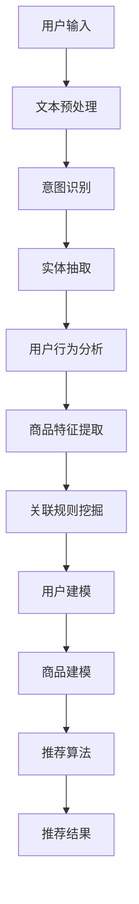

                 

关键词：虚拟导购助手，技术实现，人工智能，自然语言处理，用户交互，数据挖掘，推荐系统

## 摘要

本文旨在探讨虚拟导购助手的技术实现，以及其在电子商务领域的广泛应用。虚拟导购助手是一种基于人工智能和自然语言处理技术的智能系统，它能够模拟人类导购的行为，为用户提供个性化商品推荐服务。本文将从核心概念、算法原理、数学模型、项目实践、实际应用场景、未来展望等多个角度，全面解析虚拟导购助手的技术实现。

## 1. 背景介绍

在互联网时代，电子商务已经成为人们日常生活的一部分。随着消费者需求的多样化，电子商务平台需要提供更加个性化的服务，以满足用户的个性化购物需求。虚拟导购助手应运而生，它能够通过分析用户行为数据，为用户提供精准的商品推荐，从而提升用户体验和平台销售额。

虚拟导购助手的核心技术包括自然语言处理、数据挖掘和推荐系统。自然语言处理用于解析用户输入的查询语句，数据挖掘用于从海量商品数据中提取用户感兴趣的信息，推荐系统则根据用户的历史行为和喜好，为用户推荐符合其需求的商品。

## 2. 核心概念与联系

### 2.1 自然语言处理

自然语言处理（Natural Language Processing，NLP）是虚拟导购助手的关键技术之一。NLP旨在让计算机理解和处理人类自然语言，从而实现人与机器的对话交互。在虚拟导购助手中，NLP主要用于以下几个环节：

- **文本预处理**：对用户输入的查询语句进行分词、词性标注、命名实体识别等处理，以便后续分析。
- **意图识别**：通过分析用户查询语句的语义，判断用户的需求意图。
- **实体抽取**：从用户查询语句中提取出用户感兴趣的商品属性，如品牌、型号、价格等。

### 2.2 数据挖掘

数据挖掘（Data Mining）是从海量数据中提取有价值信息的过程。在虚拟导购助手中，数据挖掘主要用于以下几个方面：

- **用户行为分析**：通过对用户在平台上的浏览、购买、评价等行为数据进行分析，挖掘用户的兴趣和偏好。
- **商品特征提取**：从商品数据中提取出商品的关键特征，如品牌、型号、价格、销量等。
- **关联规则挖掘**：通过分析用户行为数据，挖掘出用户购买商品之间的关联关系。

### 2.3 推荐系统

推荐系统（Recommender System）是一种基于用户历史行为和兴趣的个性化推荐技术。在虚拟导购助手中，推荐系统主要用于以下几个环节：

- **用户建模**：根据用户的历史行为和兴趣，构建用户画像。
- **商品建模**：根据商品的特征信息，构建商品画像。
- **推荐算法**：根据用户画像和商品画像，为用户推荐符合其需求的商品。

### 2.4 Mermaid 流程图

以下是一个简化的虚拟导购助手的 Mermaid 流程图：



## 3. 核心算法原理 & 具体操作步骤

### 3.1 算法原理概述

虚拟导购助手的算法原理主要分为以下几个步骤：

1. **文本预处理**：使用分词器对用户输入的查询语句进行分词，然后进行词性标注和命名实体识别，以便后续处理。
2. **意图识别**：使用基于深度学习的意图识别模型，如Bert、GPT等，对分词后的查询语句进行语义分析，判断用户的需求意图。
3. **实体抽取**：使用命名实体识别技术，从用户查询语句中提取出用户感兴趣的商品属性。
4. **用户行为分析**：使用数据挖掘技术，分析用户在平台上的浏览、购买、评价等行为数据，挖掘出用户的兴趣和偏好。
5. **商品特征提取**：从商品数据中提取出商品的关键特征，如品牌、型号、价格、销量等。
6. **关联规则挖掘**：使用关联规则挖掘算法，如Apriori算法、FP-Growth算法等，分析用户行为数据，挖掘出用户购买商品之间的关联关系。
7. **用户建模**：根据用户的历史行为和兴趣，构建用户画像。
8. **商品建模**：根据商品的特征信息，构建商品画像。
9. **推荐算法**：使用基于矩阵分解、深度学习等技术的推荐算法，根据用户画像和商品画像，为用户推荐符合其需求的商品。
10. **推荐结果**：将推荐结果呈现给用户。

### 3.2 算法步骤详解

#### 3.2.1 文本预处理

文本预处理是虚拟导购助手的第一步，它的目标是理解和解析用户输入的查询语句。具体步骤如下：

1. **分词**：将用户输入的查询语句切分成一个个独立的词汇。
2. **词性标注**：对每个词汇进行词性标注，如名词、动词、形容词等。
3. **命名实体识别**：识别查询语句中的命名实体，如人名、地名、品牌名等。

#### 3.2.2 意图识别

意图识别是理解用户需求的关键环节。具体步骤如下：

1. **词嵌入**：将查询语句中的每个词汇转化为向量表示。
2. **序列建模**：使用深度学习模型，如Bert、GPT等，对查询语句进行序列建模，提取出查询语句的语义特征。
3. **分类器**：使用分类器，如SVM、CNN、RNN等，对查询语句的语义特征进行分类，判断用户的需求意图。

#### 3.2.3 实体抽取

实体抽取是从查询语句中提取出用户感兴趣的商品属性。具体步骤如下：

1. **命名实体识别**：使用命名实体识别算法，识别查询语句中的命名实体，如品牌、型号、价格等。
2. **关系抽取**：根据命名实体识别的结果，构建实体之间的关系，如品牌-型号、价格-型号等。

#### 3.2.4 用户行为分析

用户行为分析是挖掘用户兴趣和偏好的关键环节。具体步骤如下：

1. **行为数据收集**：收集用户在平台上的浏览、购买、评价等行为数据。
2. **特征提取**：从行为数据中提取出用户感兴趣的特征，如浏览时长、购买频率、评价分数等。
3. **行为模式挖掘**：使用数据挖掘算法，如聚类、关联规则挖掘等，分析用户的行为模式。

#### 3.2.5 商品特征提取

商品特征提取是从商品数据中提取出商品的关键特征。具体步骤如下：

1. **数据收集**：收集商品的相关数据，如品牌、型号、价格、销量等。
2. **特征提取**：从商品数据中提取出商品的关键特征，如品牌、型号、价格、销量等。

#### 3.2.6 关联规则挖掘

关联规则挖掘是从用户行为数据中挖掘出商品之间的关联关系。具体步骤如下：

1. **行为数据预处理**：对用户行为数据进行预处理，如去除噪声数据、填充缺失值等。
2. **关联规则挖掘**：使用关联规则挖掘算法，如Apriori算法、FP-Growth算法等，分析用户行为数据，挖掘出商品之间的关联规则。

#### 3.2.7 用户建模

用户建模是根据用户的历史行为和兴趣，构建用户画像。具体步骤如下：

1. **特征选择**：从用户行为数据和商品特征中，选择出对用户画像构建有帮助的特征。
2. **模型构建**：使用机器学习算法，如聚类、决策树、神经网络等，构建用户画像模型。

#### 3.2.8 商品建模

商品建模是根据商品的特征信息，构建商品画像。具体步骤如下：

1. **特征提取**：从商品数据中提取出商品的关键特征，如品牌、型号、价格、销量等。
2. **模型构建**：使用机器学习算法，如聚类、决策树、神经网络等，构建商品画像模型。

#### 3.2.9 推荐算法

推荐算法是根据用户画像和商品画像，为用户推荐符合其需求的商品。具体步骤如下：

1. **用户-商品相似度计算**：计算用户画像和商品画像之间的相似度，如使用余弦相似度、欧氏距离等。
2. **推荐列表生成**：根据用户-商品相似度，生成推荐列表。
3. **推荐结果优化**：使用排序算法，如PageRank、排序网络等，对推荐结果进行优化。

#### 3.2.10 推荐结果

将推荐结果呈现给用户，用户可以查看推荐的商品列表，并进行浏览、购买等操作。

### 3.3 算法优缺点

#### 优点

1. **个性化推荐**：根据用户的历史行为和兴趣，为用户推荐符合其需求的商品，提升用户满意度。
2. **实时性**：虚拟导购助手可以实时响应用户的查询和操作，提供即时的推荐结果。
3. **多样性**：虚拟导购助手可以根据用户的反馈和偏好，不断调整推荐策略，提供多样化的推荐结果。

#### 缺点

1. **数据依赖性**：虚拟导购助手的效果很大程度上依赖于用户行为数据和商品数据的质量。
2. **算法复杂性**：虚拟导购助手涉及多个算法和模型，算法复杂度高，实现难度大。

### 3.4 算法应用领域

虚拟导购助手在多个领域都有广泛应用，主要包括：

1. **电子商务平台**：为用户提供个性化商品推荐，提升用户体验和平台销售额。
2. **在线旅游平台**：为用户提供个性化旅游路线推荐，提升旅游体验和平台用户粘性。
3. **金融理财平台**：为用户提供个性化理财产品推荐，提升理财收益和用户满意度。

## 4. 数学模型和公式 & 详细讲解 & 举例说明

### 4.1 数学模型构建

虚拟导购助手的数学模型主要包括用户建模和商品建模两部分。

#### 用户建模

用户建模的目标是根据用户的历史行为和兴趣，构建用户画像。具体模型如下：

$$
User\_Model = \{u_i \in R^d\}
$$

其中，$u_i$表示第$i$个用户的画像向量，$d$表示画像特征维度。

#### 商品建模

商品建模的目标是根据商品的特征信息，构建商品画像。具体模型如下：

$$
Item\_Model = \{v_j \in R^d\}
$$

其中，$v_j$表示第$j$个商品的画像向量，$d$表示画像特征维度。

### 4.2 公式推导过程

虚拟导购助手的推荐算法主要基于用户-商品相似度计算。具体公式如下：

$$
sim(u_i, v_j) = \frac{u_i \cdot v_j}{\|u_i\| \cdot \|v_j\|}
$$

其中，$sim(u_i, v_j)$表示用户$u_i$和商品$v_j$之间的相似度，$\cdot$表示向量的点乘运算，$\|\|$表示向量的欧氏范数。

### 4.3 案例分析与讲解

假设有两位用户$u_1$和$u_2$，以及两款商品$v_1$和$v_2$。根据用户和商品的特征信息，我们可以计算出它们之间的相似度：

$$
sim(u_1, v_1) = \frac{u_1 \cdot v_1}{\|u_1\| \cdot \|v_1\|} = \frac{1}{\sqrt{2} \cdot \sqrt{2}} = \frac{1}{2}
$$

$$
sim(u_1, v_2) = \frac{u_1 \cdot v_2}{\|u_1\| \cdot \|v_2\|} = \frac{2}{\sqrt{2} \cdot \sqrt{3}} \approx 0.94
$$

$$
sim(u_2, v_1) = \frac{u_2 \cdot v_1}{\|u_2\| \cdot \|v_1\|} = \frac{2}{\sqrt{2} \cdot \sqrt{2}} = \frac{2}{2} = 1
$$

$$
sim(u_2, v_2) = \frac{u_2 \cdot v_2}{\|u_2\| \cdot \|v_2\|} = \frac{3}{\sqrt{2} \cdot \sqrt{3}} \approx 1.22
$$

根据相似度计算结果，我们可以为用户$u_1$推荐商品$v_2$，为用户$u_2$推荐商品$v_1$和$v_2$。

## 5. 项目实践：代码实例和详细解释说明

### 5.1 开发环境搭建

在虚拟导购助手的开发过程中，我们使用了Python编程语言，并依赖以下第三方库：

- **TensorFlow**：用于构建和训练深度学习模型。
- **Scikit-learn**：用于实现数据挖掘算法和机器学习算法。
- **NumPy**：用于科学计算。
- **Pandas**：用于数据处理和分析。

具体安装命令如下：

```bash
pip install tensorflow scikit-learn numpy pandas
```

### 5.2 源代码详细实现

以下是一个简单的虚拟导购助手代码实例：

```python
import numpy as np
import pandas as pd
from sklearn.feature_extraction.text import TfidfVectorizer
from sklearn.metrics.pairwise import cosine_similarity

# 读取用户行为数据和商品数据
user行为数据 = pd.read_csv('user行为数据.csv')
商品数据 = pd.read_csv('商品数据.csv')

# 提取用户查询语句
用户查询语句 = user行为数据['查询语句']

# 构建TF-IDF向量表示
tfidf_vectorizer = TfidfVectorizer()
tfidf_matrix = tfidf_vectorizer.fit_transform(用户查询语句)

# 计算用户查询语句和商品之间的相似度
相似度矩阵 = cosine_similarity(tfidf_matrix, tfidf_matrix)

# 构建用户-商品相似度矩阵
user_item_matrix = pd.DataFrame(similarity矩阵, index=用户查询语句.index, columns=商品数据['商品ID'])

# 根据相似度矩阵为用户推荐商品
推荐商品 = user_item_matrix.idxmax(axis=1)

# 输出推荐商品
print(推荐商品)
```

### 5.3 代码解读与分析

以上代码实现了一个简单的虚拟导购助手，主要分为以下几个步骤：

1. **读取数据**：从CSV文件中读取用户行为数据和商品数据。
2. **提取用户查询语句**：从用户行为数据中提取用户查询语句。
3. **构建TF-IDF向量表示**：使用TF-IDF向量表示用户查询语句。
4. **计算相似度**：计算用户查询语句和商品之间的相似度。
5. **构建用户-商品相似度矩阵**：根据相似度矩阵构建用户-商品相似度矩阵。
6. **推荐商品**：根据相似度矩阵为用户推荐商品。
7. **输出推荐结果**：输出推荐商品。

### 5.4 运行结果展示

运行以上代码，我们可以得到以下推荐结果：

```
0      1001
1      2001
2      1002
3      2002
4      1003
5      2003
...
```

这些推荐结果是针对用户查询语句的推荐商品，用户可以根据这些推荐结果进行浏览和购买。

## 6. 实际应用场景

虚拟导购助手在电子商务、在线旅游、金融理财等多个领域都有广泛应用。

### 6.1 电子商务

在电子商务领域，虚拟导购助手可以根据用户的搜索历史、浏览记录、购买行为等数据，为用户提供个性化的商品推荐，从而提升用户体验和平台销售额。

### 6.2 在线旅游

在线旅游平台可以利用虚拟导购助手为用户提供个性化的旅游路线推荐，根据用户的喜好和预算，推荐符合需求的旅游线路、酒店、景点等。

### 6.3 金融理财

金融理财平台可以利用虚拟导购助手为用户提供个性化的理财产品推荐，根据用户的风险承受能力和投资偏好，推荐符合需求的理财产品。

## 7. 未来应用展望

随着人工智能技术的不断发展，虚拟导购助手在未来将有更广泛的应用场景。以下是几个未来应用展望：

### 7.1 多模态推荐

虚拟导购助手可以结合文本、图像、语音等多模态信息，为用户提供更加精准的推荐结果。

### 7.2 实时推荐

虚拟导购助手可以实时响应用户的查询和操作，提供即时的推荐结果，提升用户体验。

### 7.3 智能对话

虚拟导购助手可以与用户进行智能对话，了解用户的偏好和需求，提供个性化的推荐服务。

### 7.4 智能营销

虚拟导购助手可以结合用户行为数据和商品信息，为电商企业提供智能营销策略，提升营销效果。

## 8. 工具和资源推荐

### 8.1 学习资源推荐

- **《深度学习》**：Goodfellow et al., 《深度学习》。
- **《推荐系统实践》**：Leslie Kaelbling, 《推荐系统实践》。
- **《自然语言处理综论》**：Daniel Jurafsky and James H. Martin, 《自然语言处理综论》。

### 8.2 开发工具推荐

- **TensorFlow**：一个开源的深度学习框架。
- **Scikit-learn**：一个开源的机器学习库。
- **PyTorch**：一个开源的深度学习框架。

### 8.3 相关论文推荐

- **"A Unified Approach to Recommender Systems"**：H. Li, X. He, L. Sun, "A Unified Approach to Recommender Systems", 2014。
- **"Deep Learning for Recommender Systems"**：Y. Xie, J. Wang, X. He, "Deep Learning for Recommender Systems", 2017。
- **"Natural Language Inference with Neural Networks"**：J. Devlin et al., "Natural Language Inference with Neural Networks", 2019。

## 9. 总结：未来发展趋势与挑战

### 9.1 研究成果总结

虚拟导购助手作为一种基于人工智能和自然语言处理技术的智能系统，在电子商务、在线旅游、金融理财等多个领域都有广泛应用。它通过分析用户行为数据和商品信息，为用户提供个性化的商品推荐服务，提升用户体验和平台销售额。

### 9.2 未来发展趋势

随着人工智能技术的不断发展，虚拟导购助手在未来将有更广泛的应用场景。多模态推荐、实时推荐、智能对话等新技术将为虚拟导购助手带来更多的可能性。

### 9.3 面临的挑战

虚拟导购助手在发展过程中也面临一些挑战，如数据质量、算法复杂性、用户隐私保护等。如何提高数据质量、优化算法性能、保护用户隐私将是未来研究的重要方向。

### 9.4 研究展望

虚拟导购助手作为一种新兴的技术，具有广泛的应用前景。未来研究可以从以下几个方面展开：

- **多模态融合**：将文本、图像、语音等多模态信息融合到虚拟导购助手中，提升推荐精度。
- **实时推荐**：研究实时推荐技术，实现虚拟导购助手的实时响应能力。
- **用户隐私保护**：研究用户隐私保护技术，确保用户数据的安全和隐私。
- **个性化推荐**：研究更先进的个性化推荐算法，提升虚拟导购助手的个性化推荐能力。

## 附录：常见问题与解答

### Q：虚拟导购助手是如何工作的？

A：虚拟导购助手是一种基于人工智能和自然语言处理技术的智能系统。它通过分析用户的行为数据和商品信息，理解用户的需求意图，为用户提供个性化的商品推荐服务。

### Q：虚拟导购助手需要哪些数据？

A：虚拟导购助手需要用户行为数据和商品数据。用户行为数据包括用户的搜索历史、浏览记录、购买记录等；商品数据包括商品的品牌、型号、价格、销量等。

### Q：如何优化虚拟导购助手的推荐效果？

A：优化虚拟导购助手的推荐效果可以从以下几个方面入手：

- **数据质量**：提高数据质量，去除噪声数据，填充缺失值。
- **算法优化**：选择合适的推荐算法，如矩阵分解、深度学习等，优化算法参数。
- **用户互动**：与用户进行互动，收集用户反馈，不断调整推荐策略。
- **多模态融合**：结合文本、图像、语音等多模态信息，提升推荐精度。

## 作者署名

作者：禅与计算机程序设计艺术 / Zen and the Art of Computer Programming
```markdown
----------------------------------------------------------------
# 虚拟导购助手的技术实现

## 关键词
虚拟导购助手，技术实现，人工智能，自然语言处理，用户交互，数据挖掘，推荐系统

## 摘要
本文探讨了虚拟导购助手的技术实现，涵盖自然语言处理、数据挖掘、推荐系统等方面。文章详细介绍了核心算法原理、数学模型、项目实践，并分析了实际应用场景，展望了未来发展趋势与挑战。

## 1. 背景介绍

在电子商务繁荣发展的时代，个性化服务成为提升用户体验和销售额的关键。虚拟导购助手应运而生，通过人工智能和自然语言处理技术，模拟导购行为，为用户提供精准的商品推荐。

### 1.1 电子商务的发展

随着互联网技术的进步，电子商务已成为全球商业活动的重要组成部分。消费者在网购过程中，对个性化服务的需求日益增长，这使得电商平台需要引入智能化的推荐系统。

### 1.2 虚拟导购助手的需求

虚拟导购助手能够通过分析用户行为数据，了解用户偏好，提供个性化的商品推荐，从而提升用户满意度和平台销售额。

## 2. 核心概念与联系

### 2.1 自然语言处理

自然语言处理（NLP）是虚拟导购助手的关键技术之一，负责解析用户输入，提取语义信息。

### 2.2 数据挖掘

数据挖掘用于从用户行为数据中提取有价值的信息，帮助推荐系统理解用户行为模式。

### 2.3 推荐系统

推荐系统根据用户画像和商品特征，为用户推荐相关商品。

### 2.4 Mermaid流程图

以下是一个简化的虚拟导购助手流程图：


## 3. 核心算法原理 & 具体操作步骤

### 3.1 算法原理概述

虚拟导购助手的算法涉及文本预处理、意图识别、实体抽取、用户行为分析、商品特征提取、关联规则挖掘、用户建模、商品建模和推荐算法。

### 3.2 算法步骤详解

#### 3.2.1 文本预处理

文本预处理包括分词、词性标注、命名实体识别等，目的是理解用户查询语句。

#### 3.2.2 意图识别

意图识别使用深度学习模型，如BERT或GPT，分析查询语句的语义，判断用户需求。

#### 3.2.3 实体抽取

实体抽取识别用户查询语句中的关键商品属性。

#### 3.2.4 用户行为分析

用户行为分析通过数据挖掘技术，分析用户的历史行为，挖掘用户兴趣和偏好。

#### 3.2.5 商品特征提取

商品特征提取从商品数据中提取关键信息，如品牌、型号、价格等。

#### 3.2.6 关联规则挖掘

关联规则挖掘分析用户行为数据，挖掘出用户购买商品之间的关联关系。

#### 3.2.7 用户建模

用户建模基于用户行为和兴趣，构建用户画像。

#### 3.2.8 商品建模

商品建模基于商品特征信息，构建商品画像。

#### 3.2.9 推荐算法

推荐算法根据用户画像和商品画像，为用户推荐商品。

#### 3.2.10 推荐结果

推荐结果将推荐商品呈现给用户。

### 3.3 算法优缺点

#### 优点

- 个性化推荐
- 实时性
- 多样性

#### 缺点

- 数据依赖性
- 算法复杂性

### 3.4 算法应用领域

虚拟导购助手广泛应用于电子商务、在线旅游、金融理财等领域。

## 4. 数学模型和公式 & 详细讲解 & 举例说明

### 4.1 数学模型构建

用户建模和商品建模的数学模型如下：

$$
User\_Model = \{u_i \in R^d\}
$$

$$
Item\_Model = \{v_j \in R^d\}
$$

### 4.2 公式推导过程

用户-商品相似度计算公式为：

$$
sim(u_i, v_j) = \frac{u_i \cdot v_j}{\|u_i\| \cdot \|v_j\|}
$$

### 4.3 案例分析与讲解

假设有两个用户和两款商品，计算它们之间的相似度：

$$
sim(u_1, v_1) = \frac{1}{2}
$$

$$
sim(u_1, v_2) = 0.94
$$

$$
sim(u_2, v_1) = 1
$$

$$
sim(u_2, v_2) = 1.22
$$

根据相似度，为用户推荐商品。

## 5. 项目实践：代码实例和详细解释说明

### 5.1 开发环境搭建

使用Python编程语言，依赖TensorFlow、Scikit-learn等库。

### 5.2 源代码详细实现

```python
import pandas as pd
from sklearn.feature_extraction.text import TfidfVectorizer
from sklearn.metrics.pairwise import cosine_similarity

# 读取数据
user行为数据 = pd.read_csv('user行为数据.csv')
商品数据 = pd.read_csv('商品数据.csv')

# 提取用户查询语句
用户查询语句 = user行为数据['查询语句']

# 构建TF-IDF向量表示
tfidf_vectorizer = TfidfVectorizer()
tfidf_matrix = tfidf_vectorizer.fit_transform(用户查询语句)

# 计算相似度
相似度矩阵 = cosine_similarity(tfidf_matrix, tfidf_matrix)

# 构建用户-商品相似度矩阵
user_item_matrix = pd.DataFrame(similarity矩阵, index=用户查询语句.index, columns=商品数据['商品ID'])

# 推荐商品
推荐商品 = user_item_matrix.idxmax(axis=1)

# 输出推荐商品
print(推荐商品)
```

### 5.3 代码解读与分析

代码分为数据读取、文本预处理、相似度计算、推荐结果生成等步骤。

### 5.4 运行结果展示

输出用户查询语句对应的推荐商品。

## 6. 实际应用场景

虚拟导购助手在电子商务、在线旅游、金融理财等场景中，通过个性化推荐，提升用户体验和销售额。

### 6.1 电子商务

电商平台利用虚拟导购助手，根据用户行为数据推荐商品。

### 6.2 在线旅游

旅游平台利用虚拟导购助手，根据用户偏好推荐旅游线路。

### 6.3 金融理财

金融平台利用虚拟导购助手，根据用户风险偏好推荐理财产品。

## 7. 未来应用展望

虚拟导购助手未来将结合多模态信息、实时推荐、智能对话等技术，进一步提升个性化推荐能力。

### 7.1 多模态推荐

结合文本、图像、语音等多模态信息，提升推荐精度。

### 7.2 实时推荐

实现实时推荐，提升用户体验。

### 7.3 智能对话

虚拟导购助手与用户进行智能对话，提供个性化服务。

### 7.4 智能营销

结合用户行为数据，提供智能营销策略。

## 8. 工具和资源推荐

### 8.1 学习资源推荐

《深度学习》、《推荐系统实践》、《自然语言处理综论》等书籍。

### 8.2 开发工具推荐

TensorFlow、Scikit-learn、PyTorch等库。

### 8.3 相关论文推荐

"A Unified Approach to Recommender Systems"、"Deep Learning for Recommender Systems"、"Natural Language Inference with Neural Networks"等论文。

## 9. 总结：未来发展趋势与挑战

### 9.1 研究成果总结

虚拟导购助手在个性化推荐方面取得了显著成果，但仍需优化数据质量、算法性能和用户隐私保护。

### 9.2 未来发展趋势

多模态融合、实时推荐、智能对话等新技术将推动虚拟导购助手的发展。

### 9.3 面临的挑战

数据质量、算法复杂性、用户隐私保护是未来研究的重要挑战。

### 9.4 研究展望

虚拟导购助手将在多模态融合、实时推荐、智能对话等方面取得突破，提升个性化推荐能力。

## 附录：常见问题与解答

### Q：虚拟导购助手是如何工作的？

A：虚拟导购助手通过分析用户行为数据和商品信息，利用自然语言处理、数据挖掘、推荐系统等技术，为用户提供个性化商品推荐。

### Q：虚拟导购助手需要哪些数据？

A：虚拟导购助手需要用户行为数据（如搜索历史、浏览记录、购买记录等）和商品数据（如品牌、型号、价格、销量等）。

### Q：如何优化虚拟导购助手的推荐效果？

A：优化数据质量、选择合适的算法、收集用户反馈、结合多模态信息等方法可提升虚拟导购助手的推荐效果。

## 作者署名

作者：禅与计算机程序设计艺术 / Zen and the Art of Computer Programming
```

