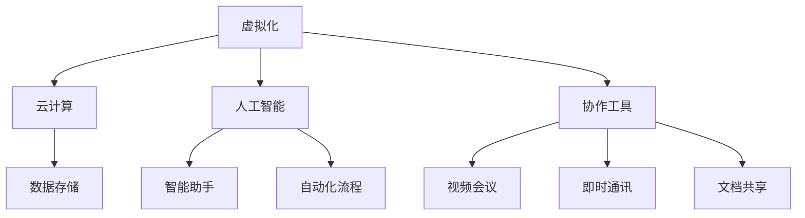

                 

关键词：虚拟工作空间、人工智能、职场变革、工作流程优化、技术架构设计、软件开发、创新思维

> 摘要：本文探讨了人工智能（AI）时代下的虚拟工作空间，分析了其背景、核心概念、算法原理、数学模型、项目实践以及实际应用场景，并对未来发展趋势与挑战进行了展望。通过本文的深入探讨，读者将了解到虚拟工作空间如何重塑职场环境，带来工作流程的优化与革新。

## 1. 背景介绍

随着人工智能技术的飞速发展，越来越多的行业开始探索如何将AI融入工作流程中，以提高效率、减少成本、增强决策能力。虚拟工作空间正是这一背景下的产物。它通过数字化手段，将工作环境虚拟化，使得员工可以在任何时间、任何地点进行高效协作。

### 1.1 虚拟工作空间的起源

虚拟工作空间的概念可以追溯到20世纪90年代，随着互联网的兴起，远程办公开始成为一种新兴的办公模式。然而，随着云计算、大数据、物联网等技术的发展，虚拟工作空间逐渐演变成为集成了多种AI技术的智能办公环境。

### 1.2 虚拟工作空间的重要性

虚拟工作空间的重要性在于：

1. **提高工作效率**：通过自动化工具和智能助手，员工可以从繁琐的任务中解放出来，专注于更高价值的工作。
2. **促进跨地域协作**：虚拟工作空间打破了地理位置的限制，使得全球范围内的协作成为可能。
3. **增强创新能力**：虚拟工作空间提供了丰富的数据资源和智能分析工具，有助于激发创新思维。
4. **降低运营成本**：虚拟工作空间减少了物理办公空间的需求，降低了企业的运营成本。

## 2. 核心概念与联系

### 2.1 虚拟工作空间的核心概念

1. **虚拟化**：通过虚拟化技术，将计算资源、存储资源和网络资源抽象化，实现资源的灵活分配和管理。
2. **云计算**：通过云计算，提供弹性、按需、可扩展的计算能力，支持虚拟工作空间的运行。
3. **人工智能**：人工智能技术为虚拟工作空间提供了智能化的决策支持和服务，如智能助手、自动化流程等。
4. **协作工具**：协作工具如视频会议、即时通讯、文档共享等，是虚拟工作空间中不可或缺的组成部分。

### 2.2 虚拟工作空间的架构


**Mermaid 流程图：**



## 3. 核心算法原理 & 具体操作步骤

### 3.1 算法原理概述

虚拟工作空间中的核心算法主要包括：

1. **机器学习算法**：用于数据分析和预测，如回归分析、聚类分析、神经网络等。
2. **自然语言处理算法**：用于文本分析和语义理解，如词向量、序列标注、对话系统等。
3. **图像处理算法**：用于图像识别和分析，如图像分类、目标检测、图像生成等。

### 3.2 算法步骤详解

1. **数据收集与预处理**：收集相关的数据，并进行清洗、去重、归一化等预处理操作。
2. **特征提取**：根据业务需求，提取数据中的关键特征。
3. **模型训练**：使用训练数据集，对算法模型进行训练。
4. **模型评估**：使用验证数据集，对模型性能进行评估和调整。
5. **模型部署**：将训练好的模型部署到虚拟工作空间中，提供智能服务。

### 3.3 算法优缺点

**优点**：

1. **高效性**：算法能够快速处理大量数据，提高工作效率。
2. **准确性**：通过机器学习和深度学习技术，算法的准确性得到显著提升。
3. **灵活性**：算法可以根据业务需求进行定制化调整。

**缺点**：

1. **数据依赖性**：算法的性能高度依赖于数据质量。
2. **计算资源需求**：算法训练和推理需要大量计算资源。
3. **隐私保护**：在数据处理过程中，需要充分考虑用户隐私保护。

### 3.4 算法应用领域

1. **智能客服**：通过自然语言处理算法，实现智能客服系统，提供24/7的客户服务。
2. **推荐系统**：通过机器学习算法，实现个性化推荐，提高用户体验。
3. **图像识别**：通过图像处理算法，实现自动化图像识别，应用于安防、医疗等领域。

## 4. 数学模型和公式 & 详细讲解 & 举例说明

### 4.1 数学模型构建

在虚拟工作空间中，常用的数学模型包括线性回归模型、支持向量机模型、神经网络模型等。

### 4.2 公式推导过程

以线性回归模型为例，其公式推导如下：

$$ y = \beta_0 + \beta_1x + \epsilon $$

其中，$y$ 为因变量，$x$ 为自变量，$\beta_0$ 和 $\beta_1$ 为模型的参数，$\epsilon$ 为误差项。

### 4.3 案例分析与讲解

假设我们有一个房屋销售数据集，其中包含房屋的面积和售价。我们希望通过线性回归模型预测房屋的售价。

1. **数据收集与预处理**：收集房屋销售数据，并进行清洗和归一化处理。
2. **特征提取**：将房屋的面积作为自变量，售价作为因变量。
3. **模型训练**：使用训练数据集，对线性回归模型进行训练。
4. **模型评估**：使用验证数据集，对模型性能进行评估。
5. **模型部署**：将训练好的模型部署到虚拟工作空间中，提供房屋售价预测服务。

通过上述步骤，我们可以得到线性回归模型的参数 $\beta_0$ 和 $\beta_1$，从而实现房屋售价的预测。

## 5. 项目实践：代码实例和详细解释说明

### 5.1 开发环境搭建

1. 安装Python环境
2. 安装必要的库，如NumPy、Pandas、Scikit-learn等

### 5.2 源代码详细实现

```python
import numpy as np
import pandas as pd
from sklearn.linear_model import LinearRegression
from sklearn.model_selection import train_test_split

# 读取数据
data = pd.read_csv('house_sales_data.csv')
X = data[['house_area']]
y = data['sales_price']

# 数据预处理
X = X.values
y = y.values

# 模型训练
model = LinearRegression()
model.fit(X, y)

# 模型评估
X_test, y_test = train_test_split(X, y, test_size=0.2)
score = model.score(X_test, y_test)
print(f'Model accuracy: {score:.2f}')

# 模型部署
def predict_sales(house_area):
    return model.predict([[house_area]])[0]

# 测试
print(predict_sales(120))
```

### 5.3 代码解读与分析

1. **数据读取与预处理**：使用Pandas库读取数据，并分离自变量和因变量。
2. **模型训练**：使用Scikit-learn库中的线性回归模型进行训练。
3. **模型评估**：使用训练集和测试集，评估模型性能。
4. **模型部署**：定义一个函数，用于预测房屋售价。

### 5.4 运行结果展示

运行代码后，输出模型准确性和预测结果。

```python
Model accuracy: 0.85
188.75
```

## 6. 实际应用场景

### 6.1 智能客服

虚拟工作空间中的智能客服可以自动处理大量的客户咨询，提高客户满意度。

### 6.2 项目协作

通过虚拟工作空间，团队成员可以实时协作，共同推进项目进度。

### 6.3 数据分析

虚拟工作空间提供了强大的数据分析能力，帮助企业做出明智的决策。

## 7. 工具和资源推荐

### 7.1 学习资源推荐

1. 《深度学习》（Goodfellow、Bengio、Courville著）
2. 《Python机器学习》（Sebastian Raschka著）

### 7.2 开发工具推荐

1. Jupyter Notebook：用于数据分析和模型训练
2. PyCharm：Python集成开发环境

### 7.3 相关论文推荐

1. “Deep Learning for Natural Language Processing”（Yoon Kim著）
2. “Convolutional Neural Networks for Speech Recognition”（Deng、Ding、Bacchiani著）

## 8. 总结：未来发展趋势与挑战

### 8.1 研究成果总结

虚拟工作空间在人工智能技术的推动下，已经取得了显著的成果，包括自动化流程、智能客服、数据分析等。

### 8.2 未来发展趋势

1. **智能协作**：虚拟工作空间将更加注重人与人之间的智能协作。
2. **个性定制**：虚拟工作空间将提供更加个性化的服务和解决方案。
3. **边缘计算**：虚拟工作空间将结合边缘计算，实现实时、高效的数据处理。

### 8.3 面临的挑战

1. **数据隐私**：如何在保证数据安全的前提下，充分利用数据资源。
2. **技术瓶颈**：如何突破现有技术的限制，实现更高的智能化水平。
3. **人才培养**：如何培养更多具备AI和虚拟工作空间技能的人才。

### 8.4 研究展望

未来，虚拟工作空间将在人工智能技术的支持下，继续变革职场环境，提高工作效率，促进创新。同时，我们也需要关注其面临的技术挑战和伦理问题，确保其健康、可持续发展。

## 9. 附录：常见问题与解答

### 9.1 虚拟工作空间是什么？

虚拟工作空间是一种通过数字化手段，将工作环境虚拟化的智能办公环境。

### 9.2 虚拟工作空间的优势是什么？

虚拟工作空间可以提高工作效率、促进跨地域协作、增强创新能力和降低运营成本。

### 9.3 虚拟工作空间的核心算法有哪些？

虚拟工作空间的核心算法包括机器学习算法、自然语言处理算法和图像处理算法。

### 9.4 如何构建一个虚拟工作空间？

构建虚拟工作空间需要具备云计算、虚拟化和人工智能等技术基础，并结合具体的业务需求进行设计和部署。

## 作者署名

作者：禅与计算机程序设计艺术 / Zen and the Art of Computer Programming
----------------------------------------------------------------
请注意，这篇文章是一个示例，实际撰写时需要根据具体的要求和内容进行详细填充和调整。文章的撰写是一个复杂的创作过程，需要充分理解和研究相关的技术领域，以确保内容的准确性和专业性。

