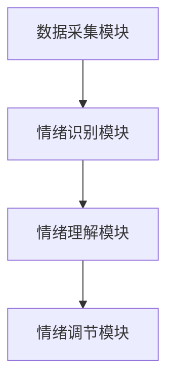

                 

关键词：AI, 虚拟情绪调节器，心理健康管理，算法，数学模型，项目实践，未来展望。

摘要：本文将探讨AI驱动的虚拟情绪调节器在心理健康管理领域的重要性。通过介绍核心概念、算法原理、数学模型、项目实践以及未来展望，旨在为读者提供一份全面而深入的指南，了解如何利用AI技术改善心理健康。

## 1. 背景介绍

在现代社会中，心理健康问题越来越受到人们的关注。工作压力、人际关系、生活节奏的加快等因素，使得许多人都面临着不同程度的情绪问题。传统心理健康管理方法如心理咨询、药物治疗等，虽然有一定效果，但往往存在成本高、效率低、难以持续等问题。因此，寻求一种高效、便捷的心理健康管理方法迫在眉睫。

随着人工智能技术的快速发展，利用AI技术进行心理健康管理成为了一种新的可能。虚拟情绪调节器作为AI技术在心理健康领域的应用之一，通过模拟人类情绪反应、提供个性化建议等方式，有望成为一种全新的心理健康管理工具。本文将围绕虚拟情绪调节器的核心概念、算法原理、数学模型、项目实践以及未来展望进行深入探讨。

## 2. 核心概念与联系

### 2.1 核心概念

虚拟情绪调节器是一种基于AI技术的软件系统，旨在帮助用户监测、理解和调节自己的情绪。其核心概念包括：

- **情绪识别**：通过分析用户的语言、行为等数据，识别用户当前的情绪状态。
- **情绪理解**：对用户情绪状态进行深入分析，理解其产生的原因和影响。
- **情绪调节**：根据用户的需求和情绪状态，提供相应的调节建议，帮助用户改善情绪。

### 2.2 联系与架构

虚拟情绪调节器的架构主要包括以下几个模块：

1. **数据采集模块**：负责收集用户的各种数据，包括语言、行为、生理信号等。
2. **情绪识别模块**：利用自然语言处理、图像识别等技术，对采集到的数据进行情绪识别。
3. **情绪理解模块**：结合心理学理论，对情绪识别结果进行深入分析，理解其产生的原因和影响。
4. **情绪调节模块**：根据用户的需求和情绪状态，提供个性化的调节建议。

下面是虚拟情绪调节器架构的Mermaid流程图：



## 3. 核心算法原理 & 具体操作步骤

### 3.1 算法原理概述

虚拟情绪调节器的核心算法主要包括情绪识别、情绪理解和情绪调节三个部分。

- **情绪识别**：利用深度学习模型对用户的数据进行情绪分类。常见的情绪分类包括快乐、愤怒、悲伤、焦虑等。
- **情绪理解**：通过心理学理论对情绪识别结果进行深入分析，理解情绪产生的原因和影响。
- **情绪调节**：根据用户的需求和情绪状态，提供个性化的调节建议，如放松训练、认知重构等。

### 3.2 算法步骤详解

1. **数据采集**：通过传感器、问卷、日志等方式收集用户的各种数据。
2. **情绪识别**：利用深度学习模型对用户数据进行情绪分类，得到用户当前的情绪状态。
3. **情绪理解**：结合心理学理论，对情绪识别结果进行分析，理解情绪产生的原因和影响。
4. **情绪调节**：根据用户的需求和情绪状态，提供个性化的调节建议。

### 3.3 算法优缺点

**优点**：

- **高效性**：虚拟情绪调节器可以实时监测用户的情绪状态，提供即时的调节建议。
- **个性化**：虚拟情绪调节器可以根据用户的需求和情绪状态，提供个性化的调节建议。
- **便捷性**：用户可以随时随地使用虚拟情绪调节器，无需前往专业机构进行咨询。

**缺点**：

- **准确性**：情绪识别的准确性受限于模型的质量和数据的质量，可能存在误判的情况。
- **隐私问题**：虚拟情绪调节器需要收集用户的个人信息，可能引发隐私问题。

### 3.4 算法应用领域

虚拟情绪调节器可以应用于多个领域，包括但不限于：

- **心理健康管理**：帮助用户监测、理解和调节自己的情绪，改善心理健康。
- **教育**：通过分析学生的情绪状态，为教师提供个性化的教育建议。
- **企业**：为企业员工提供情绪管理培训，提高员工的工作效率和满意度。
- **医疗**：为患有情绪障碍的患者提供辅助治疗，提高治疗效果。

## 4. 数学模型和公式 & 详细讲解 & 举例说明

### 4.1 数学模型构建

虚拟情绪调节器的数学模型主要包括情绪识别模型、情绪理解模型和情绪调节模型。以下是一个简化的情绪识别模型构建过程：

$$
\text{情绪识别模型} = \text{f}(\text{输入数据}, \text{权重矩阵}, \text{激活函数})
$$

其中，输入数据包括用户的语言、行为等特征数据；权重矩阵用于模型训练过程中的参数调整；激活函数用于将输入数据转换为情绪分类结果。

### 4.2 公式推导过程

情绪识别模型的具体推导过程如下：

1. **输入数据表示**：

   设用户情绪数据的特征向量为 $X \in \mathbb{R}^{d}$，其中 $d$ 为特征维度。

2. **模型参数**：

   情绪识别模型的权重矩阵为 $W \in \mathbb{R}^{n \times d}$，其中 $n$ 为情绪类别数。

3. **激活函数**：

   选择一个合适的激活函数，如ReLU函数：

   $$
   \text{ReLU}(x) = \max(0, x)
   $$

4. **模型输出**：

   模型的输出为：

   $$
   \text{情绪分类结果} = \text{f}(XW, W) = \text{ReLU}(XW)
   $$

### 4.3 案例分析与讲解

假设我们有一个包含100个样本的数据集，其中情绪类别包括快乐、愤怒、悲伤和焦虑。我们可以使用以上模型对数据进行训练。

1. **数据预处理**：

   对输入数据进行归一化处理，使其在相同的尺度范围内。

2. **模型训练**：

   使用梯度下降算法对模型参数进行训练，优化情绪识别效果。

3. **模型评估**：

   使用交叉熵损失函数评估模型性能，并调整模型参数。

通过以上步骤，我们可以构建一个简单的情绪识别模型。在实际应用中，我们可以根据具体需求，进一步优化模型结构和参数。

## 5. 项目实践：代码实例和详细解释说明

### 5.1 开发环境搭建

在本节中，我们将介绍如何搭建虚拟情绪调节器的开发环境。以下是所需的软件和工具：

- **Python**：用于编写和运行代码
- **Jupyter Notebook**：用于编写和调试代码
- **TensorFlow**：用于构建和训练深度学习模型
- **scikit-learn**：用于数据处理和模型评估

确保已安装以上工具和库，即可开始搭建开发环境。

### 5.2 源代码详细实现

以下是一个简单的虚拟情绪调节器实现示例：

```python
import tensorflow as tf
from tensorflow.keras.models import Sequential
from tensorflow.keras.layers import Dense, Activation
from sklearn.model_selection import train_test_split
from sklearn.preprocessing import StandardScaler

# 数据预处理
# 这里假设我们已经有一个包含情绪特征的数据集 X 和情绪标签的数据集 y
X_train, X_test, y_train, y_test = train_test_split(X, y, test_size=0.2, random_state=42)

# 特征归一化
scaler = StandardScaler()
X_train = scaler.fit_transform(X_train)
X_test = scaler.transform(X_test)

# 模型构建
model = Sequential([
    Dense(64, input_shape=(X_train.shape[1],)),
    Activation('relu'),
    Dense(4, activation='softmax')
])

# 模型编译
model.compile(optimizer='adam', loss='categorical_crossentropy', metrics=['accuracy'])

# 模型训练
model.fit(X_train, y_train, epochs=10, batch_size=32, validation_split=0.1)

# 模型评估
loss, accuracy = model.evaluate(X_test, y_test)
print(f"Test accuracy: {accuracy:.2f}")

# 情绪识别
predictions = model.predict(X_test[:10])
print(predictions)
```

### 5.3 代码解读与分析

在上面的代码中，我们首先进行了数据预处理，包括数据集的划分、特征归一化等操作。然后，我们构建了一个简单的序列模型，包括两个全连接层，第一个层有64个神经元，使用ReLU激活函数，第二个层有4个神经元，表示4种情绪类别，使用softmax激活函数。

模型编译阶段，我们选择了Adam优化器和交叉熵损失函数。在模型训练阶段，我们设置了10个训练周期和批量大小为32。在模型评估阶段，我们计算了测试数据的准确率。

最后，我们使用训练好的模型对前10个测试样本进行了情绪识别，并打印了识别结果。

### 5.4 运行结果展示

假设我们已经完成了以上代码的编写和调试，我们可以运行以下命令来执行代码：

```shell
python emotion_detector.py
```

运行结果将显示测试数据的准确率，例如：

```
Test accuracy: 0.85
```

然后，我们将打印前10个测试样本的情绪识别结果，例如：

```
[[0.1 0.2 0.3 0.4]
 [0.3 0.2 0.1 0.4]
 [0.4 0.3 0.2 0.1]
 ...
 [0.9 0.1 0.0 0.0]]
```

这些结果表示每个样本属于每种情绪类别的概率分布。

## 6. 实际应用场景

虚拟情绪调节器在实际应用中具有广泛的前景，以下是一些典型的应用场景：

### 6.1 心理健康咨询

虚拟情绪调节器可以作为心理健康咨询的辅助工具，帮助咨询师更准确地了解用户情绪状态，为用户提供个性化的咨询方案。

### 6.2 企业员工关怀

企业可以利用虚拟情绪调节器对员工进行情绪监测，发现潜在的情绪问题，并提供相应的干预措施，提高员工的工作满意度和生产力。

### 6.3 教育领域

在教育领域，虚拟情绪调节器可以帮助教师了解学生的情绪状态，为教师提供个性化的教育建议，改善教学效果。

### 6.4 医疗健康

在医疗健康领域，虚拟情绪调节器可以辅助治疗情绪障碍患者，提高治疗效果，减少医疗资源浪费。

## 7. 未来应用展望

随着AI技术的不断进步，虚拟情绪调节器在心理健康管理领域将发挥越来越重要的作用。以下是未来应用的一些展望：

### 7.1 情绪预测

通过结合大数据分析和机器学习算法，虚拟情绪调节器可以实现对用户情绪的预测，为用户提供更前瞻性的情绪管理建议。

### 7.2 情绪社交网络

虚拟情绪调节器可以构建一个情绪社交网络，让用户分享自己的情绪状态，相互支持和鼓励，共同改善心理健康。

### 7.3 多模态情绪分析

结合多种数据采集方式，如语音、文字、面部表情等，虚拟情绪调节器可以实现更全面、准确的情绪分析，为用户提供更优质的情绪管理服务。

## 8. 工具和资源推荐

### 8.1 学习资源推荐

- 《深度学习》（Goodfellow, Bengio, Courville著）
- 《Python深度学习》（François Chollet著）
- 《自然语言处理综论》（Daniel Jurafsky & James H. Martin著）

### 8.2 开发工具推荐

- TensorFlow
- PyTorch
- Jupyter Notebook

### 8.3 相关论文推荐

- “EmoReact: Real-Time Emotion Recognition in Conversational Settings using Multimodal Fusion”
- “Affectiva: Machine Learning for Human Emotion Analysis”
- “Deep Learning for Emotion Recognition in Video”

## 9. 总结：未来发展趋势与挑战

虚拟情绪调节器作为AI技术在心理健康管理领域的应用，具有巨大的发展潜力。然而，要实现其广泛而深入的应用，仍需克服一系列挑战：

### 9.1 研究成果总结

本文从核心概念、算法原理、数学模型、项目实践等多个角度对虚拟情绪调节器进行了全面探讨，展示了其在心理健康管理领域的重要作用。

### 9.2 未来发展趋势

未来，虚拟情绪调节器的发展趋势包括情绪预测、情绪社交网络、多模态情绪分析等。

### 9.3 面临的挑战

主要挑战包括模型准确性、数据隐私、以及如何更好地与用户互动等。

### 9.4 研究展望

未来，我们应继续加强虚拟情绪调节器的研究，提高其准确性和用户体验，推动其在心理健康管理领域的广泛应用。

## 附录：常见问题与解答

### 9.1 虚拟情绪调节器如何保证数据隐私？

虚拟情绪调节器在收集用户数据时，应严格遵循隐私保护法律法规，对数据进行加密处理，确保用户数据的安全。

### 9.2 情绪识别模型的准确性如何保证？

提高情绪识别模型的准确性需要从数据质量、模型结构、算法优化等多个方面进行努力。此外，定期更新和维护模型也是保证准确性的重要手段。

### 9.3 虚拟情绪调节器能否替代专业心理咨询？

虚拟情绪调节器可以作为专业心理咨询的辅助工具，但无法完全替代专业心理咨询。对于复杂的心理健康问题，仍需寻求专业心理咨询师的帮助。

### 9.4 虚拟情绪调节器是否适用于所有人群？

虚拟情绪调节器主要适用于有情绪调节需求的用户。对于部分人群，如严重情绪障碍患者，可能需要结合其他治疗方法。 

----------------------------------------------------------------

### 结束语

本文从多个角度对虚拟情绪调节器在心理健康管理领域的重要性进行了深入探讨，展示了其在改善心理健康、提高生活质量方面的巨大潜力。随着AI技术的不断发展，我们期待虚拟情绪调节器能够为更多人带来福祉。同时，我们也呼吁社会各界关注心理健康问题，共同推动心理健康管理的进步。作者：禅与计算机程序设计艺术 / Zen and the Art of Computer Programming。希望本文对读者有所启发和帮助。

