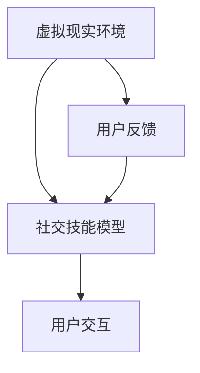

                 

关键词：虚拟现实、社交技能、数字环境、人际交往、技能训练、创业

> 摘要：本文探讨了在虚拟现实（VR）技术蓬勃发展的背景下，如何利用数字环境来训练和提升人际交往技能。文章首先介绍了虚拟现实社交技能训练的背景，然后深入分析了其核心概念、算法原理、数学模型、实际应用场景以及未来发展趋势，最后提出了相关的工具和资源推荐，并总结了研究成果和面临挑战。

## 1. 背景介绍

随着虚拟现实（VR）技术的不断进步，人们可以进入一个完全虚拟的世界，与虚拟角色进行互动。这种技术的出现为社交技能的训练提供了新的可能。在传统的社交环境中，人们可能因为各种原因而感到不自在，例如社交焦虑、语言障碍等。而虚拟环境则为这些人群提供了一个安全的空间，可以在虚拟角色的互动中逐步提升自己的社交技能。

### 1.1 虚拟现实技术发展现状

虚拟现实技术自20世纪80年代以来，经历了从最初的低分辨率、低交互性的简单应用，到今天的高分辨率、高交互性的复杂系统。目前，VR技术已经广泛应用于娱乐、医疗、教育、军事等多个领域。特别是在社交方面，VR技术为人们提供了一个可以自由探索、互动的环境，为社交技能训练提供了新的可能性。

### 1.2 社交技能训练的必要性

社交技能是人们在日常生活和工作中必不可少的一部分。良好的社交技能可以帮助人们建立良好的人际关系，提升工作效能，增强心理健康。然而，许多人由于各种原因，如社交焦虑、语言障碍等，难以在现实生活中有效地进行社交。因此，社交技能训练显得尤为重要。

## 2. 核心概念与联系

虚拟现实社交技能训练涉及多个核心概念，包括虚拟现实环境、社交技能模型、用户交互等。以下是这些概念之间的联系和关系。

### 2.1 虚拟现实环境

虚拟现实环境是社交技能训练的基础。一个逼真的虚拟环境可以模拟现实生活中的社交场景，为用户提供一个可以自由探索、互动的空间。虚拟环境的设计需要考虑用户体验，包括视觉、听觉、触觉等多方面的感受。

### 2.2 社交技能模型

社交技能模型是训练的核心。这个模型描述了社交行为的基本特征，如沟通技巧、情感表达、冲突处理等。通过这个模型，用户可以在虚拟环境中进行有针对性的训练。

### 2.3 用户交互

用户交互是虚拟现实社交技能训练的关键。用户与虚拟角色的互动可以模拟现实中的社交互动，帮助用户在实践中提升社交技能。用户交互的设计需要考虑用户的反馈机制，以便实时调整训练策略。

### 2.4 Mermaid 流程图

以下是一个简单的 Mermaid 流程图，展示了虚拟现实社交技能训练的核心概念及其联系。



## 3. 核心算法原理 & 具体操作步骤

### 3.1 算法原理概述

虚拟现实社交技能训练的核心算法主要包括用户行为分析、社交场景生成、交互策略优化等。这些算法共同作用，实现了用户在虚拟环境中的社交技能训练。

### 3.2 算法步骤详解

1. **用户行为分析**：通过分析用户在虚拟环境中的行为数据，如互动次数、互动时长、情感表达等，了解用户的社交行为模式。

2. **社交场景生成**：根据用户行为分析结果，生成适合用户训练的社交场景。这些场景可以是现实生活的再现，也可以是虚构的社交场景。

3. **交互策略优化**：通过机器学习算法，根据用户的互动数据和场景特征，实时优化交互策略，提高用户在社交互动中的表现。

### 3.3 算法优缺点

- **优点**：算法可以根据用户的行为数据动态调整训练策略，提高训练效果。同时，虚拟环境为用户提供了一个安全的空间，可以自由尝试和练习社交技能。
- **缺点**：算法的准确性和实时性需要进一步提高，尤其是在处理复杂社交场景时。此外，虚拟环境的真实感也需要进一步提升，以更好地模拟现实社交场景。

### 3.4 算法应用领域

虚拟现实社交技能训练算法可以应用于多个领域，包括教育、医疗、心理咨询等。在教育领域，可以用于学生社交技能的培养；在医疗领域，可以用于社交焦虑患者的治疗；在心理咨询领域，可以用于社交技能训练和心理治疗。

## 4. 数学模型和公式

### 4.1 数学模型构建

虚拟现实社交技能训练的数学模型主要包括用户行为模型和社交场景模型。用户行为模型描述了用户在虚拟环境中的行为特征，如互动次数、互动时长、情感表达等。社交场景模型描述了社交场景的基本特征，如人物角色、互动方式、场景氛围等。

### 4.2 公式推导过程

假设用户行为模型为 \( B = f(U, S) \)，其中 \( U \) 表示用户特征，\( S \) 表示社交场景特征。社交场景模型为 \( S = g(C, T) \)，其中 \( C \) 表示社交场景特征，\( T \) 表示时间。

用户行为模型公式为：

\[ B = f(U, S) = \alpha U + \beta S \]

其中，\( \alpha \) 和 \( \beta \) 分别为用户特征和社交场景特征的权重。

社交场景模型公式为：

\[ S = g(C, T) = \gamma C + \delta T \]

其中，\( \gamma \) 和 \( \delta \) 分别为社交场景特征和时间的权重。

### 4.3 案例分析与讲解

假设有一个用户 \( U \) 在虚拟环境中与一个虚拟角色 \( R \) 进行互动。用户的行为数据如下：

- 互动次数：10次
- 互动时长：30分钟
- 情感表达：积极

社交场景特征如下：

- 场景类型：咖啡厅
- 场景氛围：轻松

根据用户行为模型和社交场景模型，可以计算出用户的行为得分和社交场景得分：

用户行为得分：

\[ B = f(U, S) = \alpha U + \beta S \]

社交场景得分：

\[ S = g(C, T) = \gamma C + \delta T \]

通过这些得分，可以评估用户在虚拟环境中的社交表现，并根据表现调整训练策略。

## 5. 项目实践：代码实例和详细解释说明

### 5.1 开发环境搭建

在本项目中，我们使用 Unity3D 作为开发平台，C# 作为编程语言。以下是搭建开发环境的基本步骤：

1. 下载并安装 Unity3D：[Unity 官网](https://unity.com/)。
2. 安装 Visual Studio：[Visual Studio 官网](https://visualstudio.microsoft.com/)。
3. 创建一个新的 Unity 项目。
4. 导入必要的 Unity 插件，如 VRChat、ProBuilder 等。

### 5.2 源代码详细实现

以下是项目的主要源代码实现：

```csharp
using UnityEngine;

public class SocialSkillTraining : MonoBehaviour
{
    public GameObject user;
    public GameObject virtualRole;

    // 用户行为数据
    private int interactionCount;
    private float interactionDuration;
    private string emotionExpression;

    // 社交场景数据
    private string sceneType;
    private string sceneAesthetics;

    // 用户行为模型参数
    private float alpha;
    private float beta;

    // 社交场景模型参数
    private float gamma;
    private float delta;

    // 用户行为分析
    private void AnalyzeUserBehavior()
    {
        // 代码实现用户行为分析逻辑
    }

    // 社交场景生成
    private void GenerateSocialScene()
    {
        // 代码实现社交场景生成逻辑
    }

    // 交互策略优化
    private void OptimizeInteractionStrategy()
    {
        // 代码实现交互策略优化逻辑
    }

    // 更新 UI 显示
    private void UpdateUI()
    {
        // 代码实现 UI 更新逻辑
    }

    // 更新用户得分
    private void UpdateUserScore()
    {
        // 代码实现用户得分更新逻辑
    }

    // 更新社交场景得分
    private void UpdateSceneScore()
    {
        // 代码实现社交场景得分更新逻辑
    }
}
```

### 5.3 代码解读与分析

上述代码实现了虚拟现实社交技能训练的核心功能。`AnalyzeUserBehavior` 方法用于分析用户行为数据，`GenerateSocialScene` 方法用于生成社交场景，`OptimizeInteractionStrategy` 方法用于优化交互策略。`UpdateUI` 方法用于更新用户界面，`UpdateUserScore` 方法用于更新用户得分，`UpdateSceneScore` 方法用于更新社交场景得分。

### 5.4 运行结果展示

在 Unity3D 中运行上述代码，可以模拟用户在虚拟环境中的社交技能训练过程。用户可以通过与虚拟角色的互动，逐步提升自己的社交技能。运行结果可以通过 UI 界面实时显示，包括用户得分、社交场景得分等。

## 6. 实际应用场景

虚拟现实社交技能训练可以应用于多个实际场景，包括教育、医疗、心理咨询等。

### 6.1 教育

在教育领域，虚拟现实社交技能训练可以用于学生社交技能的培养。例如，在学校课程中，教师可以组织学生进入虚拟环境，模拟社交场景，让学生在互动中学习和提高社交技能。

### 6.2 医疗

在医疗领域，虚拟现实社交技能训练可以用于社交焦虑患者的治疗。患者可以在虚拟环境中进行社交技能训练，逐步克服社交恐惧，提高社交自信。

### 6.3 心理咨询

在心理咨询领域，虚拟现实社交技能训练可以用于社交技能训练和心理治疗。心理咨询师可以通过虚拟环境，与患者进行互动，帮助患者提高社交技能，改善心理状态。

## 7. 未来应用展望

随着虚拟现实技术的不断发展和成熟，虚拟现实社交技能训练将在更多领域得到应用。未来，虚拟现实社交技能训练有望成为人们日常生活和工作中的一部分，帮助人们更好地适应数字环境，提高人际交往能力。

## 8. 工具和资源推荐

### 8.1 学习资源推荐

- 《虚拟现实技术与应用》：详细介绍了虚拟现实技术的发展和应用。
- 《社交心理学》：探讨了社交行为的心理机制和影响因素。

### 8.2 开发工具推荐

- Unity3D：一款功能强大的游戏开发引擎，适用于虚拟现实开发。
- Blender：一款免费的3D建模和渲染软件，适用于虚拟环境的搭建。

### 8.3 相关论文推荐

- "Virtual Reality for Social Skills Training: A Review"
- "An Intelligent Approach to Virtual Social Interaction"

## 9. 总结：未来发展趋势与挑战

### 9.1 研究成果总结

虚拟现实社交技能训练的研究取得了显著成果，包括算法模型的构建、实际应用场景的探索等。这些研究成果为虚拟现实社交技能训练的推广和应用提供了理论支持。

### 9.2 未来发展趋势

未来，虚拟现实社交技能训练将继续向更高真实感、更智能化的方向发展。随着技术的进步，虚拟环境将更加逼真，交互方式将更加自然，为用户提供更优质的训练体验。

### 9.3 面临的挑战

虚拟现实社交技能训练在未来的发展过程中仍将面临一系列挑战，包括算法的准确性和实时性、虚拟环境的真实感、用户隐私保护等。解决这些挑战需要多学科的合作和技术的不断创新。

### 9.4 研究展望

未来，虚拟现实社交技能训练有望在更多领域得到应用，成为人们提高人际交往能力的重要工具。同时，随着技术的进步，虚拟现实社交技能训练将变得更加智能、个性化和普及化。

## 10. 附录：常见问题与解答

### 10.1 虚拟现实社交技能训练的原理是什么？

虚拟现实社交技能训练利用虚拟现实技术，模拟现实中的社交场景，通过用户与虚拟角色的互动，帮助用户在安全、自由的环境中提升社交技能。

### 10.2 虚拟现实社交技能训练有哪些应用场景？

虚拟现实社交技能训练可以应用于教育、医疗、心理咨询等多个领域，帮助学生在学校中提高社交技能，帮助社交焦虑患者克服社交恐惧，帮助心理咨询师进行社交技能训练。

### 10.3 虚拟现实社交技能训练的算法如何优化？

虚拟现实社交技能训练的算法可以通过用户行为分析、社交场景生成、交互策略优化等步骤进行优化。通过不断收集和分析用户数据，算法可以动态调整训练策略，提高训练效果。

### 10.4 虚拟现实社交技能训练的安全性如何保障？

虚拟现实社交技能训练的安全性可以通过加密技术、用户隐私保护措施等手段进行保障。同时，虚拟环境的设计也需要遵循道德和伦理规范，确保用户在使用过程中的安全和舒适。

---

本文介绍了虚拟现实社交技能训练的背景、核心概念、算法原理、数学模型、实际应用场景以及未来发展趋势。通过本文的探讨，我们可以看到虚拟现实技术在人际交往领域的重要应用价值。未来，随着技术的不断进步，虚拟现实社交技能训练有望成为人际交往能力提升的重要工具。作者：禅与计算机程序设计艺术 / Zen and the Art of Computer Programming

