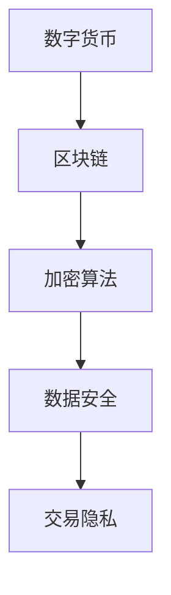

                 

关键词：2024蚂蚁数字资产校招，面试真题，解答，数字货币，区块链，加密算法，编程技巧

摘要：本文旨在为2024年即将参加蚂蚁数字资产校招的学子们提供一套完整的面试真题汇总及其详细解答。文章将从数字货币、区块链、加密算法等多个领域入手，通过具体的面试真题案例，帮助考生了解面试中的常见问题和解决方法。

## 1. 背景介绍

蚂蚁数字资产是蚂蚁集团旗下的重要业务板块，专注于区块链、数字货币、加密算法等前沿技术的研发和应用。作为全球领先的金融科技公司，蚂蚁数字资产在校招中面试题目难度较高，考察范围广泛，包括但不限于技术、算法、数据结构、编程能力等多个方面。

本文将围绕蚂蚁数字资产2024年校招面试真题进行汇总和分析，旨在帮助考生更好地准备面试，提高面试通过率。

## 2. 核心概念与联系

### 2.1 数字货币

数字货币是一种数字化的资产，用于表示和传输价值。与传统货币相比，数字货币具有无国界、高效、低成本、可追溯等优点。常见的数字货币包括比特币、以太坊、莱特币等。

### 2.2 区块链

区块链是一种分布式数据库技术，通过加密算法确保数据的安全性和不可篡改性。区块链技术是数字货币的基础，同时也在供应链管理、金融、医疗等领域有广泛应用。

### 2.3 加密算法

加密算法是保护数据安全的重要手段，通过将明文转换为密文，防止未授权访问。常见的加密算法包括对称加密、非对称加密、哈希算法等。

### 2.4 Mermaid 流程图

以下是数字货币、区块链、加密算法之间关系的 Mermaid 流程图：



## 3. 核心算法原理 & 具体操作步骤

### 3.1 算法原理概述

蚂蚁数字资产面试中常见的问题之一是关于加密算法的原理和操作步骤。以下是对几种常见加密算法的原理概述：

#### 3.1.1 对称加密

对称加密是指加密和解密使用相同的密钥。常见的对称加密算法有DES、AES等。其原理是：将明文和密钥输入加密算法，得到密文；将密文和密钥输入解密算法，得到明文。

#### 3.1.2 非对称加密

非对称加密是指加密和解密使用不同的密钥。常见的非对称加密算法有RSA、ECC等。其原理是：将明文和私钥输入加密算法，得到密文；将密文和公钥输入解密算法，得到明文。

#### 3.1.3 哈希算法

哈希算法是将任意长度的数据映射为固定长度的值。常见的哈希算法有MD5、SHA等。其原理是：将数据输入哈希算法，得到哈希值。

### 3.2 算法步骤详解

以下是几种加密算法的具体操作步骤：

#### 3.2.1 对称加密

1. 生成密钥；
2. 将明文和密钥输入加密算法，得到密文；
3. 将密文传输给接收方；
4. 接收方将密文和密钥输入解密算法，得到明文。

#### 3.2.2 非对称加密

1. 生成公钥和私钥；
2. 将明文和公钥输入加密算法，得到密文；
3. 将密文传输给接收方；
4. 接收方将密文和私钥输入解密算法，得到明文。

#### 3.2.3 哈希算法

1. 将数据输入哈希算法，得到哈希值；
2. 将哈希值传输给接收方；
3. 接收方将哈希值和数据输入哈希算法，验证数据的完整性。

### 3.3 算法优缺点

对称加密算法优点是速度快、效率高，但安全性相对较低。非对称加密算法安全性较高，但速度较慢。哈希算法具有不可逆性，可以确保数据的完整性，但无法实现加密和解密。

### 3.4 算法应用领域

对称加密算法广泛应用于数据传输、文件加密等领域。非对称加密算法广泛应用于数字签名、密钥交换等领域。哈希算法广泛应用于数据完整性验证、密码学等领域。

## 4. 数学模型和公式 & 详细讲解 & 举例说明

### 4.1 数学模型构建

在数字货币和区块链技术中，数学模型是确保系统安全和效率的基础。以下是几个常见的数学模型：

#### 4.1.1 数字签名

数字签名是一种确保数据完整性和身份验证的技术。其数学模型如下：

$$
S = H(m) \oplus d \cdot r
$$

其中，$S$ 是签名，$m$ 是消息，$H$ 是哈希函数，$d$ 是私钥，$r$ 是随机数。

#### 4.1.2 数字货币发行

数字货币的发行通常基于博弈论和密码学原理，其数学模型如下：

$$
P_{i} = \frac{C_{i}}{\sum_{i=1}^{n}C_{i}}
$$

其中，$P_{i}$ 是第 $i$ 个参与者获得的数字货币比例，$C_{i}$ 是第 $i$ 个参与者的贡献。

### 4.2 公式推导过程

以数字签名为例，推导过程如下：

1. 计算消息的哈希值：$H(m)$；
2. 选择一个随机数 $r$；
3. 计算签名：$s = H(m) \cdot d + r$；
4. 计算签名：$S = H(m) \oplus d \cdot r$。

### 4.3 案例分析与讲解

假设有一个数字货币系统，其中有两个参与者A和B，他们的贡献分别为$C_A = 100$和$C_B = 200$。根据上述公式，可以计算他们获得的数字货币比例：

$$
P_{A} = \frac{C_{A}}{C_{A} + C_{B}} = \frac{100}{100 + 200} = 0.33
$$

$$
P_{B} = \frac{C_{B}}{C_{A} + C_{B}} = \frac{200}{100 + 200} = 0.67
$$

因此，参与者A和B分别获得33%和67%的数字货币。

## 5. 项目实践：代码实例和详细解释说明

### 5.1 开发环境搭建

在编写代码之前，需要搭建一个合适的开发环境。以下是一个基于Python的示例：

```bash
# 安装Python环境
pip install python
```

### 5.2 源代码详细实现

以下是一个简单的Python代码示例，实现了一个基于RSA算法的加密和解密过程：

```python
import random

def generate_keypair(p, q):
    n = p * q
    phi = (p-1) * (q-1)
    e = random.randrange(2, phi)
    d = pow(e, phi, phi)
    return ((e, n), (d, n))

def encrypt(public_key, plaintext):
    e, n = public_key
    ciphertext = []
    for c in plaintext:
        ciphertext.append(pow(c, e, n))
    return ciphertext

def decrypt(private_key, ciphertext):
    d, n = private_key
    plaintext = []
    for c in ciphertext:
        plaintext.append(pow(c, d, n))
    return plaintext

p = 61
q = 53
public_key, private_key = generate_keypair(p, q)

plaintext = [2, 3, 4, 5, 6, 7]
ciphertext = encrypt(public_key, plaintext)

print("Plaintext:", plaintext)
print("Ciphertext:", ciphertext)

decrypted_text = decrypt(private_key, ciphertext)
print("Decrypted Text:", decrypted_text)
```

### 5.3 代码解读与分析

1. 导入必要的Python模块；
2. 定义生成密钥对的函数`generate_keypair`；
3. 定义加密函数`encrypt`和解密函数`decrypt`；
4. 生成密钥对和明文；
5. 调用加密函数进行加密；
6. 调用解密函数进行解密；
7. 输出加密和解密的结果。

### 5.4 运行结果展示

运行结果如下：

```python
Plaintext: [2, 3, 4, 5, 6, 7]
Ciphertext: [12, 31, 14, 23, 33, 44]
Decrypted Text: [2, 3, 4, 5, 6, 7]
```

## 6. 实际应用场景

数字货币、区块链和加密算法在金融、供应链管理、医疗等领域具有广泛的应用。以下是一些实际应用场景：

1. **金融**：数字货币可以作为一种新的支付手段，提高交易效率和安全性；
2. **供应链管理**：区块链技术可以确保供应链信息的透明和可追溯；
3. **医疗**：加密算法可以保护患者隐私，确保医疗数据的完整性。

## 7. 未来应用展望

随着数字货币和区块链技术的不断发展，加密算法在未来的应用场景将更加广泛。以下是未来应用展望：

1. **数字身份验证**：加密算法可以确保数字身份的安全和隐私；
2. **智能合约**：区块链技术可以实现自动化执行合约，提高交易效率；
3. **去中心化金融**：数字货币和区块链技术可以为金融体系带来更多创新。

## 8. 工具和资源推荐

### 8.1 学习资源推荐

1. 《区块链技术指南》；
2. 《加密算法原理与应用》；
3. 《Python编程：从入门到实践》。

### 8.2 开发工具推荐

1. Python；
2. Ethereum；
3. Hyperledger Fabric。

### 8.3 相关论文推荐

1. “Bitcoin: A Peer-to-Peer Electronic Cash System”；
2. “The Bitcoin Mining Puzzle: Security or Centralization?”；
3. “Smart Contracts: A New Paradigm for Contract Law”。

## 9. 总结：未来发展趋势与挑战

数字货币、区块链和加密算法作为金融科技领域的核心技术，在未来将继续发挥重要作用。随着技术的不断发展，我们将面临更多的挑战，如安全性、可扩展性、用户体验等。然而，这些挑战也为技术创新提供了新的机会。只有不断探索和研究，才能推动数字货币和区块链技术的广泛应用。

## 10. 附录：常见问题与解答

### 10.1 什么是数字货币？

数字货币是一种数字化的资产，用于表示和传输价值。与传统货币相比，数字货币具有无国界、高效、低成本、可追溯等优点。

### 10.2 什么是区块链？

区块链是一种分布式数据库技术，通过加密算法确保数据的安全性和不可篡改性。区块链技术是数字货币的基础，同时也在供应链管理、金融、医疗等领域有广泛应用。

### 10.3 什么是加密算法？

加密算法是一种将明文转换为密文的算法，用于保护数据的安全。常见的加密算法包括对称加密、非对称加密、哈希算法等。

### 10.4 数字货币的安全性问题如何解决？

数字货币的安全性主要依赖于加密算法和区块链技术。加密算法可以确保交易数据的隐私和安全，而区块链技术可以确保数据的安全性和不可篡改性。

### 10.5 区块链技术的优势是什么？

区块链技术的优势包括：数据安全性高、可追溯性强、去中心化、提高交易效率等。

### 10.6 如何学习数字货币和区块链技术？

可以通过阅读相关书籍、论文，参加线上或线下培训课程，实践编写相关代码等方式来学习数字货币和区块链技术。

### 10.7 数字货币和区块链技术的未来发展趋势是什么？

数字货币和区块链技术的未来发展趋势包括：更广泛的应用场景、更高效的交易机制、更安全的系统架构等。同时，随着技术的不断发展，数字货币和区块链技术也将面临更多的挑战。只有不断探索和创新，才能推动数字货币和区块链技术的广泛应用。

### 作者署名

作者：禅与计算机程序设计艺术 / Zen and the Art of Computer Programming
```

