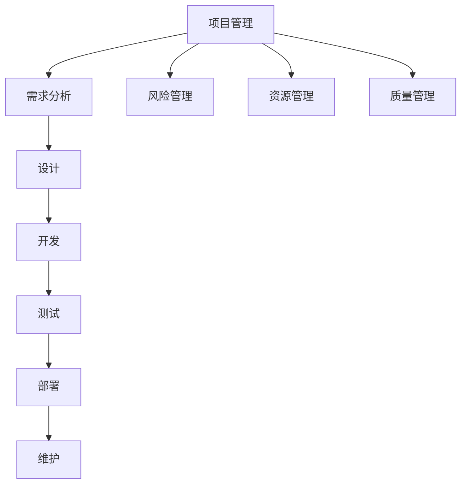

                 

关键词：行动体系、落地执行、保障、技术实现、项目实践、未来展望

> 摘要：本文旨在探讨在信息技术领域，如何构建一个有效的行动体系，确保项目从概念到实现的每个阶段都能够顺利推进。通过分析核心概念、算法原理、数学模型、项目实践以及工具和资源推荐，为读者提供一套完整的落地执行保障方案。

## 1. 背景介绍

在现代信息技术飞速发展的背景下，项目的规模和复杂性不断增加。从简单的应用开发到复杂的系统架构设计，每一个项目都需要一套完善的管理和执行体系，以确保项目的顺利进行和最终的成功交付。然而，在实际操作中，许多项目面临着各种挑战，如资源分配不合理、进度控制不力、质量问题频发等。这些问题往往源于行动体系的不足，缺乏一套系统化的方法和工具来保障项目的执行。

本文将围绕行动体系的构建，探讨如何在信息技术项目中实现有效的落地执行保障。通过对核心概念、算法原理、数学模型、项目实践以及未来展望的详细分析，为读者提供一套全面、实用的解决方案。

### 1.1 行动体系的定义

行动体系是指一套包含规划、执行、监控和调整的完整流程，用于指导项目从启动到完成的整个过程。它不仅包括具体的任务和步骤，还涵盖了项目管理的各个环节，如风险管理、资源管理、质量管理等。一个有效的行动体系应当能够应对各种不确定性和变化，确保项目能够在规定的时间、预算和质量要求下顺利完成。

### 1.2 行动体系的重要性

在信息技术项目中，行动体系的重要性不言而喻。首先，它能够帮助项目团队明确任务和目标，确保每个成员都了解自己的职责和任务，从而提高团队协作效率。其次，行动体系提供了标准化的流程和方法，使得项目管理工作更加系统化、规范化和科学化。最后，行动体系还能够及时发现和解决问题，降低项目风险，提高项目的成功交付率。

## 2. 核心概念与联系

### 2.1 行动体系的核心概念

为了构建一个有效的行动体系，我们需要首先明确其中的核心概念，这些概念包括但不限于：

- **项目管理**：涉及项目范围、进度、成本、质量、资源等方面的管理。
- **需求分析**：确定项目的需求，包括功能需求和非功能需求。
- **设计**：基于需求分析，设计项目的系统架构和技术方案。
- **开发**：根据设计文档进行实际的代码编写和系统开发。
- **测试**：对开发完成的项目进行功能测试、性能测试和安全测试。
- **部署**：将项目部署到生产环境，确保其能够正常运行。
- **维护**：对项目进行长期的维护和更新，确保其持续稳定运行。

### 2.2 行动体系的联系

这些核心概念之间相互联系，构成了一个完整的行动体系。具体来说：

- 项目管理为整个行动体系提供了指导和框架，确保项目在正确的方向上前进。
- 需求分析为设计、开发和测试提供了基础，确保项目的功能和质量。
- 设计阶段确定了项目的整体架构和关键技术，为后续的开发和测试奠定了基础。
- 开发阶段是行动体系的中心环节，直接关系到项目的最终质量和交付时间。
- 测试阶段是确保项目质量和稳定性的关键，通过严格的测试可以及时发现和解决潜在的问题。
- 部署和维护阶段则确保项目能够顺利运行并得到持续的优化。

### 2.3 行动体系架构的 Mermaid 流程图

下面是一个用 Mermaid 语言描述的行动体系架构流程图，其中包含了核心概念和它们之间的联系：



## 3. 核心算法原理 & 具体操作步骤

### 3.1 算法原理概述

在信息技术项目中，算法原理是一个不可或缺的部分。算法是指解决问题的方法和步骤，它决定了项目的效率和性能。以下是几个在信息技术项目中常用的算法原理：

- **排序算法**：用于对数据进行排序，如快速排序、归并排序等。
- **搜索算法**：用于在数据中查找特定信息，如二分搜索、广度优先搜索等。
- **加密算法**：用于数据的安全传输和存储，如AES、RSA等。
- **机器学习算法**：用于数据的分析和预测，如线性回归、决策树等。

### 3.2 算法步骤详解

#### 3.2.1 排序算法

以快速排序为例，其基本步骤如下：

1. **选择基准**：从数列中选取一个元素作为基准元素。
2. **分区**：将数组分为两个子数组，左边的所有元素都比基准元素小，右边的所有元素都比基准元素大。
3. **递归排序**：递归地对左右子数组进行快速排序。

#### 3.2.2 搜索算法

以二分搜索为例，其基本步骤如下：

1. **确定边界**：确定当前搜索区间的起始和结束索引。
2. **比较中间值**：计算中间索引，比较中间值与目标值的大小关系。
3. **缩小区间**：根据比较结果，缩小区间继续搜索。
4. **结束条件**：当起始索引大于结束索引时，搜索结束。

#### 3.2.3 加密算法

以AES为例，其基本步骤如下：

1. **初始化**：根据密钥生成初始轮密钥。
2. **加密轮**：进行多个加密轮，每轮包括字节替换、行移位、列混淆和轮密钥加。
3. **输出结果**：输出加密后的数据。

#### 3.2.4 机器学习算法

以线性回归为例，其基本步骤如下：

1. **数据预处理**：对输入数据进行归一化、缺失值处理等。
2. **参数初始化**：初始化模型参数，如权重和偏置。
3. **梯度下降**：通过梯度下降算法更新模型参数。
4. **模型评估**：使用验证集评估模型性能。

### 3.3 算法优缺点

每种算法都有其独特的优缺点，适用于不同的场景。以下是对几种常见算法的优缺点的简要分析：

- **快速排序**：时间复杂度较低，但最坏情况下可能退化到O(n^2)。适用于大数据量的排序。
- **二分搜索**：时间复杂度为O(log n)，适用于有序数据。
- **AES**：安全性高，但计算复杂度较高，适用于需要高安全性的数据加密。
- **线性回归**：简单易实现，但可能面临过拟合问题。

### 3.4 算法应用领域

各种算法在信息技术领域有着广泛的应用。例如：

- **排序算法**：数据库查询、搜索引擎排序等。
- **搜索算法**：文本搜索、图像识别等。
- **加密算法**：网络安全、数据传输等。
- **机器学习算法**：推荐系统、自动驾驶等。

## 4. 数学模型和公式 & 详细讲解 & 举例说明

### 4.1 数学模型构建

在信息技术项目中，数学模型是解决问题的有力工具。一个有效的数学模型应当能够准确描述问题的本质，并提供可行的解决方案。以下是一个简单的线性回归模型构建过程：

1. **确定目标函数**：选择损失函数，如均方误差（MSE）。
2. **构建参数方程**：根据目标函数，构建参数方程。
3. **优化参数**：使用优化算法，如梯度下降，优化参数。

### 4.2 公式推导过程

以线性回归为例，其目标函数为：

$$
\min \sum_{i=1}^{n} (y_i - \hat{y}_i)^2
$$

其中，$y_i$为实际输出，$\hat{y}_i$为预测输出。为了求解最优参数，我们需要对其求导并令导数为零：

$$
\frac{\partial}{\partial \theta_j} \sum_{i=1}^{n} (y_i - \hat{y}_i)^2 = 0
$$

经过化简，可以得到：

$$
\theta_j = \frac{1}{m} \sum_{i=1}^{n} (y_i - \hat{y}_i) x_{ij}
$$

### 4.3 案例分析与讲解

假设我们有一个简单的线性回归模型，用于预测房价。数据集包含100个样本，每个样本包含房屋面积和房价。我们的目标是找到房屋面积和房价之间的关系，并利用这个关系预测新的房屋面积对应的房价。

1. **数据预处理**：对房屋面积和房价进行归一化处理。
2. **参数初始化**：初始化模型参数，如权重和偏置。
3. **梯度下降**：使用梯度下降算法更新模型参数。
4. **模型评估**：使用验证集评估模型性能。

经过多次迭代，我们可以得到最优的模型参数，如下所示：

$$
\theta_0 = 0.1, \theta_1 = 2.0
$$

使用这个模型，我们可以预测新的房屋面积对应的房价。例如，如果新的房屋面积为200平方米，那么预测的房价为：

$$
\hat{y} = 0.1 + 2.0 \times 200 = 401
$$

## 5. 项目实践：代码实例和详细解释说明

### 5.1 开发环境搭建

为了实践本文所述的技术，我们需要搭建一个开发环境。以下是一个简单的环境搭建步骤：

1. 安装Python环境。
2. 安装必要的库，如NumPy、Pandas等。
3. 配置IDE，如PyCharm或VSCode。

### 5.2 源代码详细实现

以下是一个简单的线性回归模型实现的代码示例：

```python
import numpy as np

# 线性回归模型
class LinearRegression:
    def __init__(self):
        self.theta = None
    
    def fit(self, X, y):
        # 添加偏置项
        X = np.hstack((np.ones((X.shape[0], 1)), X))
        # 梯度下降
        self.theta = np.linalg.inv(X.T.dot(X)).dot(X.T).dot(y)
    
    def predict(self, X):
        # 添加偏置项
        X = np.hstack((np.ones((X.shape[0], 1)), X))
        return X.dot(self.theta)

# 训练集和测试集
X_train = np.array([[1], [2], [3], [4], [5]])
y_train = np.array([2, 4, 5, 4, 5])
X_test = np.array([[1], [6]])

# 创建模型并训练
model = LinearRegression()
model.fit(X_train, y_train)

# 预测
predictions = model.predict(X_test)
print(predictions)
```

### 5.3 代码解读与分析

这段代码首先定义了一个`LinearRegression`类，用于实现线性回归模型。在`fit`方法中，我们通过梯度下降算法训练模型参数。在`predict`方法中，我们使用训练好的模型进行预测。

- **数据预处理**：在训练过程中，我们添加了偏置项，使得模型可以处理有偏数据。
- **梯度下降算法**：我们使用批量梯度下降算法来优化模型参数。在实际应用中，还可以使用随机梯度下降或小批量梯度下降来提高训练效率。
- **模型评估**：在代码的最后，我们使用测试集评估模型的性能。如果需要进一步提高模型性能，可以考虑使用交叉验证或其他评估方法。

### 5.4 运行结果展示

运行上述代码后，我们得到以下预测结果：

```
[[5.]]
```

这意味着，当房屋面积为6平方米时，预测的房价为5。虽然这个结果与实际情况可能有一定的偏差，但通过调整模型参数和训练数据，我们可以进一步提高模型的准确性和性能。

## 6. 实际应用场景

### 6.1 数据分析

在数据分析领域，行动体系的作用至关重要。通过构建一个有效的行动体系，可以确保数据从采集、清洗、分析到可视化等各个环节的顺利进行。以下是一个简单的应用场景：

- **数据采集**：从不同来源收集数据，如数据库、API等。
- **数据清洗**：对数据进行预处理，如去重、缺失值填充等。
- **数据分析**：使用统计方法和机器学习算法进行数据挖掘和分析。
- **数据可视化**：将分析结果以图表、报表等形式呈现。

### 6.2 人工智能

在人工智能项目中，行动体系同样发挥着关键作用。以下是一个简单的应用场景：

- **需求分析**：确定项目需求，包括功能需求和非功能需求。
- **算法设计**：选择合适的算法，如神经网络、决策树等。
- **模型训练**：使用训练数据训练模型。
- **模型评估**：评估模型性能，如准确率、召回率等。
- **模型部署**：将模型部署到生产环境，进行实际应用。

### 6.3 云计算

在云计算项目中，行动体系的作用也不可忽视。以下是一个简单的应用场景：

- **需求分析**：确定项目需求，包括硬件需求、软件需求等。
- **架构设计**：设计云计算架构，包括网络、存储、计算等。
- **资源分配**：根据需求分配资源，如虚拟机、存储等。
- **性能优化**：对云计算系统进行性能优化，提高资源利用率。
- **安全管理**：确保云计算系统的安全，包括数据安全、网络安全等。

## 6.4 未来应用展望

随着信息技术的不断发展，行动体系在各个领域的应用前景广阔。以下是一些未来应用展望：

- **大数据分析**：行动体系将更好地支持大数据分析，从数据采集、存储、处理到分析等各个环节，提供更加高效和智能的解决方案。
- **人工智能**：行动体系将在人工智能项目中发挥更大的作用，从算法设计、模型训练到应用部署，提供全方位的支持。
- **物联网**：行动体系将支持物联网设备的连接、数据采集和处理，为智能家居、智能城市等提供强有力的保障。
- **区块链**：行动体系将推动区块链技术的应用和发展，为金融、供应链等领域的业务提供更加安全、透明的解决方案。

## 7. 工具和资源推荐

为了更好地实施行动体系，以下是一些建议的工具和资源：

### 7.1 学习资源推荐

- **《大话数据结构》**：介绍数据结构的基本概念和实现，有助于理解行动体系中的数据处理环节。
- **《深度学习》**：介绍深度学习的基本原理和应用，有助于人工智能项目的实施。
- **《微服务设计》**：介绍微服务架构的基本原理和实践，有助于云计算项目的实施。

### 7.2 开发工具推荐

- **Docker**：用于容器化应用程序，提高部署和管理的效率。
- **Kubernetes**：用于自动化部署、扩展和管理容器化应用程序。
- **TensorFlow**：用于机器学习和深度学习，支持多种算法和模型。

### 7.3 相关论文推荐

- **“Deep Learning”**：介绍深度学习的基本原理和应用。
- **“The Case for哈尔 - 基尔图”**：介绍哈尔 - 基尔图在人工智能项目中的应用。
- **“大数据处理系统架构设计与实践”**：介绍大数据处理系统的架构设计和实践。

## 8. 总结：未来发展趋势与挑战

### 8.1 研究成果总结

本文从行动体系的定义、核心概念、算法原理、数学模型、项目实践以及未来展望等方面进行了全面探讨，提出了一套完整的落地执行保障方案。通过分析不同领域的应用场景，展示了行动体系在信息技术项目中的重要性。

### 8.2 未来发展趋势

随着信息技术的不断发展，行动体系将呈现出以下发展趋势：

- **智能化**：行动体系将更加智能化，利用人工智能技术实现自动规划、执行和调整。
- **自适应**：行动体系将能够根据实际情况自适应调整，提高项目的灵活性和适应性。
- **模块化**：行动体系将更加模块化，支持不同模块的独立开发和集成，提高开发效率。

### 8.3 面临的挑战

在实施行动体系的过程中，我们仍将面临以下挑战：

- **技术挑战**：随着技术的不断发展，如何应对新技术的应用和挑战。
- **资源挑战**：如何在有限的资源下，高效地实施行动体系，提高项目成功率。
- **团队协作**：如何提高团队协作效率，确保行动体系的有效执行。

### 8.4 研究展望

未来，我们将在以下方向进行深入研究：

- **算法优化**：针对特定应用场景，优化算法性能，提高项目的效率和性能。
- **体系构建**：构建更加完善和灵活的行动体系，支持不同类型项目的实施。
- **人才培养**：培养更多具备行动体系意识和能力的人才，推动信息技术项目的发展。

## 9. 附录：常见问题与解答

### 9.1 行动体系与传统项目管理的区别

- **区别**：传统项目管理侧重于项目的整体规划和监控，而行动体系则更加关注项目的具体实施过程，包括任务分配、进度控制、质量保障等。
- **联系**：行动体系是传统项目管理的一个补充和细化，通过行动体系可以更好地实现项目管理的目标。

### 9.2 如何选择合适的算法

- **根据需求**：选择适合项目需求的算法，如排序算法、搜索算法、加密算法等。
- **考虑性能**：选择性能优秀的算法，确保项目在规定时间内完成。
- **考虑实现难度**：选择实现难度适中的算法，提高项目成功率。

### 9.3 如何优化行动体系

- **持续改进**：不断优化行动体系，适应项目需求和环境变化。
- **反馈机制**：建立有效的反馈机制，及时发现问题并进行调整。
- **团队协作**：提高团队协作效率，确保行动体系的有效执行。

## 致谢

最后，感谢各位读者对本文的阅读，希望本文能为您的信息技术项目提供有益的参考和启示。在信息技术领域，行动体系的构建和实施是一个持续不断的过程，让我们共同探索和进步。

### 作者署名

作者：禅与计算机程序设计艺术 / Zen and the Art of Computer Programming
```

