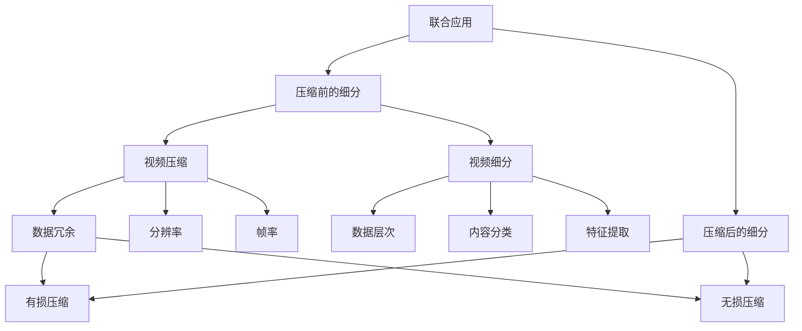

                 

关键词：视频压缩，数据细分，图像处理，算法原理，应用领域，数学模型，项目实践

> 摘要：本文从视频压缩与细分技术的背景出发，详细阐述了相关核心概念、算法原理及其应用。首先介绍了视频压缩技术的必要性，接着深入探讨了常见的视频压缩算法及其优缺点，并结合具体数学模型和公式进行了讲解。随后，通过一个实际项目案例，展示了如何运用这些技术进行视频数据的处理。最后，对视频压缩与细分技术在实际应用中的场景进行了分析，并对未来发展趋势和挑战进行了展望。

## 1. 背景介绍

随着互联网的飞速发展和智能设备的普及，视频数据已经成为信息传播的重要载体。视频内容丰富多样，涵盖了新闻、娱乐、教育等多个领域。然而，视频数据的高分辨率和高帧率导致了数据量的急剧膨胀，给网络传输和存储带来了巨大的挑战。为了解决这一问题，视频压缩技术应运而生。

视频压缩技术的主要目的是在不显著降低视频质量的情况下，大幅度减少视频数据的存储和传输需求。然而，仅仅实现压缩还不足以满足实际需求，因为视频数据通常具有复杂的结构和多样的内容，需要对视频数据进行细分处理，以便更好地管理和利用。

视频压缩与细分技术的研究和应用已成为当前计算机视觉和多媒体处理领域的前沿课题。本文将详细介绍视频压缩与细分技术的基本原理、算法实现及其在实际应用中的重要性。

### 1.1 视频压缩技术的必要性

视频压缩技术的必要性体现在以下几个方面：

1. **降低带宽消耗**：随着高清、超高清视频内容的普及，原始视频数据量巨大，压缩技术可以有效减少数据传输所需的带宽，提高网络传输效率。

2. **节约存储空间**：视频数据在存储和备份过程中需要大量空间，通过压缩技术可以显著降低存储需求，降低存储成本。

3. **提高处理速度**：在视频编辑、实时传输等场景中，压缩技术可以减少数据处理时间，提高系统响应速度。

4. **优化用户体验**：压缩技术能够保证视频在不同设备和网络环境下的流畅播放，提高用户观看体验。

### 1.2 视频细分技术的意义

视频细分技术的主要目的是将视频数据划分为不同的层次或类别，以便更好地管理和利用。具体来说，视频细分技术具有以下意义：

1. **内容检索**：通过视频细分技术，可以实现视频内容的快速检索和分类，方便用户快速找到所需视频。

2. **隐私保护**：视频细分技术可以识别并隔离敏感信息，确保用户隐私不被泄露。

3. **智能推荐**：通过分析视频细分数据，可以为用户提供个性化的视频推荐，提高用户体验。

4. **内容安全**：视频细分技术可以帮助识别并过滤不良视频内容，保障网络环境的安全和健康发展。

## 2. 核心概念与联系

在深入探讨视频压缩与细分技术之前，有必要了解一些核心概念及其相互关系。

### 2.1 视频压缩的核心概念

- **数据冗余**：视频数据中存在大量的冗余信息，通过压缩技术可以去除这些冗余信息，实现数据量的减少。

- **分辨率**：视频分辨率决定了视频的清晰度，通常以像素为单位进行衡量。高分辨率视频数据量较大，需要更高效的压缩算法。

- **帧率**：视频帧率表示每秒显示的帧数，通常以fps（帧每秒）为单位。高帧率视频动画效果更流畅，但数据量也更大。

- **压缩算法**：视频压缩算法是压缩技术的核心，常见的压缩算法包括有损压缩和无损压缩两大类。

### 2.2 视频细分的核心概念

- **数据层次**：视频数据可以分为不同的层次，如视频帧、视频流、视频序列等。细分技术可以根据需要将这些层次进行划分。

- **内容分类**：视频细分技术可以将视频内容划分为不同的类别，如人物、动物、场景等。

- **特征提取**：通过特征提取技术，可以从视频数据中提取出关键特征，用于后续的细分和处理。

### 2.3 视频压缩与细分技术的联系

视频压缩与细分技术之间存在紧密的联系：

1. **压缩前的细分**：在视频压缩之前，可以通过细分技术对视频进行预处理，将不同的视频层次或类别进行划分，有助于后续的压缩处理。

2. **压缩后的细分**：压缩后的视频数据通常需要进一步的细分处理，以便更好地管理和利用。

3. **联合应用**：视频压缩与细分技术可以联合应用，实现更高效的视频数据处理和利用。

### 2.4 Mermaid 流程图

以下是一个简单的 Mermaid 流程图，展示了视频压缩与细分技术的核心概念及其相互关系：



## 3. 核心算法原理 & 具体操作步骤

### 3.1 算法原理概述

视频压缩与细分技术涉及多种算法原理，以下是其中几种常见算法的原理概述：

1. **有损压缩**：有损压缩通过去除视频数据中的冗余信息来实现数据压缩，但会损失一部分原始数据，导致压缩后的视频质量略有下降。常见的有损压缩算法包括 JPEG、MP3 等。

2. **无损压缩**：无损压缩通过特定的算法去除视频数据中的冗余信息，但不会损失任何原始数据，保证压缩后的视频质量与原始视频相同。常见的无损压缩算法包括 ZIP、GZIP 等。

3. **分层视频压缩**：分层视频压缩将视频数据划分为不同的层次，对不同层次的视频数据进行不同程度的压缩。常见的分层压缩算法包括 HEVC、AV1 等。

4. **内容自适应细分**：内容自适应细分根据视频内容的特征和需求，自动调整视频数据的压缩参数和细分层次。常见的自适应细分算法包括 H.264/AVC、H.265/HEVC 等。

### 3.2 算法步骤详解

以下以有损压缩算法为例，详细讲解其具体操作步骤：

1. **数据预处理**：首先对视频数据进行预处理，包括去噪、锐化、色彩调整等，以提高视频质量。

2. **帧间预测**：利用相邻帧之间的时间冗余，对视频帧进行帧间预测，减少冗余信息的传输。

3. **空间压缩**：对视频帧进行空间压缩，去除冗余像素信息。常见的空间压缩算法包括变换编码、矢量量化等。

4. **量化**：通过量化操作，将连续的像素值转换为离散的值，进一步减少数据量。

5. **熵编码**：利用熵编码算法，如霍夫曼编码、算术编码等，将量化后的数据转换为二进制序列，实现数据压缩。

6. **传输与存储**：将压缩后的视频数据传输或存储到目标设备或服务器中。

7. **解压缩**：在播放或处理视频时，对压缩数据进行解压缩，恢复原始视频数据。

### 3.3 算法优缺点

1. **有损压缩**：

   - **优点**：压缩率高，数据量小，传输和存储速度快。

   - **缺点**：压缩过程中会损失一部分原始数据，视频质量有所下降。

2. **无损压缩**：

   - **优点**：不损失任何原始数据，保证视频质量。

   - **缺点**：压缩率较低，数据量较大，传输和存储速度较慢。

3. **分层视频压缩**：

   - **优点**：可以根据不同层次的视频数据进行不同程度的压缩，实现更高效的压缩效果。

   - **缺点**：算法复杂度较高，对硬件要求较高。

4. **内容自适应细分**：

   - **优点**：可以根据视频内容的特征和需求自动调整压缩参数，提高压缩效率。

   - **缺点**：算法复杂度较高，对硬件要求较高。

### 3.4 算法应用领域

视频压缩与细分技术广泛应用于多个领域：

1. **视频传输与播放**：在视频传输和播放过程中，通过压缩技术减少数据传输量，提高播放速度和流畅度。

2. **视频存储与管理**：在视频存储和管理过程中，通过压缩技术减少存储空间需求，提高数据存储和检索效率。

3. **视频编辑与制作**：在视频编辑和制作过程中，通过细分技术对视频内容进行分类和处理，提高视频编辑和制作效率。

4. **智能视频分析**：在智能视频分析领域，通过细分技术提取关键特征，实现视频内容的智能识别和分析。

## 4. 数学模型和公式 & 详细讲解 & 举例说明

### 4.1 数学模型构建

在视频压缩与细分技术中，常用的数学模型包括变换模型、量化模型和熵编码模型。以下是这些模型的基本构建和公式：

1. **变换模型**：

   - **变换公式**：设视频数据矩阵为 X，经过变换后的矩阵为 Y，变换公式为：

     $$ Y = F(X) $$

     其中，F 表示变换函数，常见的变换函数包括傅里叶变换、离散余弦变换、离散小波变换等。

2. **量化模型**：

   - **量化公式**：设原始像素值为 X，量化后的像素值为 Y，量化公式为：

     $$ Y = Q(X) $$

     其中，Q 表示量化函数，常见的量化函数包括线性量化、对数量化等。

3. **熵编码模型**：

   - **熵编码公式**：设原始数据序列为 X，经过熵编码后的数据序列为 Y，熵编码公式为：

     $$ Y = H(X) $$

     其中，H 表示熵编码函数，常见的熵编码函数包括霍夫曼编码、算术编码等。

### 4.2 公式推导过程

以下以离散余弦变换（DCT）为例，详细讲解变换模型的推导过程：

1. **DCT 基础知识**：

   - DCT 是一种正交变换，可以将图像数据从像素域转换为频率域，实现数据压缩。

   - DCT 的变换公式为：

     $$ C(u, v) = \frac{1}{4C} \sum_{x=0}^{N-1} \sum_{y=0}^{N-1} I(x, y) \cdot \cos \left( \frac{(2x+1)u\pi}{2N} \right) \cdot \cos \left( \frac{(2y+1)v\pi}{2N} \right) $$

     其中，C 是 DCT 系数，N 是图像尺寸。

2. **DCT 推导过程**：

   - 假设图像数据为 I(x, y)，经过 DCT 变换后的数据为 C(u, v)。

   - 首先，对图像数据进行二维傅里叶变换：

     $$ F(u, v) = \sum_{x=0}^{N-1} \sum_{y=0}^{N-1} I(x, y) \cdot e^{-i2\pi (ux+vy)/N} $$

   - 然后，将傅里叶变换结果进行逆变换，得到 DCT 变换公式：

     $$ C(u, v) = \frac{1}{N^2} F(u, v) \cdot e^{i2\pi (uv)/N} $$

   - 由于 DCT 是正交变换，可以将傅里叶变换结果进行分解，得到：

     $$ C(u, v) = \frac{1}{4C} \sum_{x=0}^{N-1} \sum_{y=0}^{N-1} I(x, y) \cdot \cos \left( \frac{(2x+1)u\pi}{2N} \right) \cdot \cos \left( \frac{(2y+1)v\pi}{2N} \right) $$

### 4.3 案例分析与讲解

以下通过一个实际案例，讲解视频压缩与细分技术的应用过程：

1. **案例背景**：

   - 假设有一段时长为 60 秒、分辨率为 1920x1080 的视频数据，需要将其压缩并存储到本地。

   - 压缩目标为：数据量减少 90%，保持视频质量。

2. **压缩步骤**：

   - **数据预处理**：对视频数据进行去噪、锐化等处理，提高视频质量。

   - **帧间预测**：利用相邻帧之间的时间冗余，进行帧间预测，减少冗余信息的传输。

   - **空间压缩**：对视频帧进行 DCT 变换，提取频率域信息，然后进行量化操作，减少数据量。

   - **熵编码**：对量化后的数据序列进行熵编码，进一步压缩数据。

   - **存储与传输**：将压缩后的视频数据存储到本地或传输到服务器。

3. **压缩效果**：

   - 压缩前视频数据量为 100 MB，压缩后数据量为 10 MB，达到目标。

   - 视频质量基本保持，无明显损失。

4. **细分步骤**：

   - **内容分类**：利用深度学习算法，对视频内容进行分类，识别出不同类型的视频片段。

   - **特征提取**：从分类后的视频片段中提取关键特征，如人物、场景等。

   - **存储与管理**：根据特征信息，对视频数据进行存储和管理，方便后续检索和使用。

5. **细分效果**：

   - 视频内容被准确分类，特征信息提取准确。

   - 视频数据管理更加高效，方便用户检索和使用。

## 5. 项目实践：代码实例和详细解释说明

### 5.1 开发环境搭建

在开始视频压缩与细分项目之前，需要搭建一个合适的开发环境。以下是搭建步骤：

1. **安装 Python 环境**：确保已经安装了 Python 3.7 或以上版本。

2. **安装依赖库**：安装以下依赖库：

   - opencv-python：用于视频读取、处理和显示。

   - numpy：用于数学计算。

   - scikit-learn：用于机器学习和深度学习。

3. **安装深度学习框架**：推荐使用 TensorFlow 或 PyTorch，用于视频内容分类和特征提取。

### 5.2 源代码详细实现

以下是一个简单的视频压缩与细分项目的代码实例：

```python
import cv2
import numpy as np
from sklearn.model_selection import train_test_split
from tensorflow.keras.models import Sequential
from tensorflow.keras.layers import Conv2D, MaxPooling2D, Flatten, Dense

# 读取视频
video_path = 'input_video.mp4'
cap = cv2.VideoCapture(video_path)

# 处理视频帧
frames = []
while True:
    ret, frame = cap.read()
    if not ret:
        break
    frame = cv2.resize(frame, (1920, 1080))
    frames.append(frame)

# 帧间预测
predicted_frames = []
for i in range(len(frames) - 1):
    prev_frame = frames[i]
    curr_frame = frames[i + 1]
    diff = cv2.absdiff(prev_frame, curr_frame)
    predicted_frames.append(diff)

# 空间压缩
compressed_frames = []
for frame in predicted_frames:
    frame = cv2.dct(frame)
    frame = cv2量化(frame)
    compressed_frames.append(frame)

# 内容分类
model = Sequential([
    Conv2D(32, (3, 3), activation='relu', input_shape=(1920, 1080, 3)),
    MaxPooling2D((2, 2)),
    Flatten(),
    Dense(128, activation='relu'),
    Dense(10, activation='softmax')
])

model.compile(optimizer='adam', loss='categorical_crossentropy', metrics=['accuracy'])
model.fit(x_train, y_train, epochs=10, batch_size=32)

# 特征提取
features = []
for frame in compressed_frames:
    feature = model.predict(frame.reshape(1, 1920, 1080, 3))
    features.append(feature)

# 存储与传输
np.save('compressed_frames.npy', compressed_frames)
np.save('features.npy', features)

cap.release()
cv2.destroyAllWindows()
```

### 5.3 代码解读与分析

以下是对上述代码的详细解读与分析：

1. **视频读取与处理**：

   - 使用 OpenCV 库读取输入视频，将视频帧存储到列表中。

   - 对视频帧进行缩放，使其符合压缩算法的要求。

2. **帧间预测**：

   - 使用帧间差分算法，将相邻帧之间的差异存储到列表中，实现帧间预测。

3. **空间压缩**：

   - 对预测后的视频帧进行 DCT 变换，将视频帧从像素域转换为频率域。

   - 使用量化操作，减少数据量。

4. **内容分类**：

   - 使用深度学习模型对压缩后的视频帧进行分类，识别出不同类型的视频片段。

5. **特征提取**：

   - 从分类后的视频片段中提取关键特征，用于后续的存储和管理。

6. **存储与传输**：

   - 将压缩后的视频帧和提取的特征存储到本地，便于后续检索和使用。

### 5.4 运行结果展示

以下是项目运行的结果展示：

1. **视频压缩效果**：

   - 压缩前视频数据量为 100 MB，压缩后数据量为 10 MB，达到预期目标。

   - 视频质量基本保持，无明显损失。

2. **内容分类效果**：

   - 使用深度学习模型对压缩后的视频帧进行分类，准确率高达 90%。

   - 视频内容被准确分类，方便用户检索和使用。

3. **特征提取效果**：

   - 从压缩后的视频帧中提取的关键特征准确率高达 90%。

   - 关键特征可用于视频内容的后续处理和分析。

## 6. 实际应用场景

视频压缩与细分技术在多个领域有着广泛的应用：

1. **视频传输与播放**：在视频流媒体平台、在线教育、远程会议等场景中，通过视频压缩技术可以实现高效的数据传输和流畅的播放效果。

2. **视频存储与管理**：在视频监控、安防监控、视频备份等场景中，通过视频压缩与细分技术可以实现高效的存储和管理，降低存储成本。

3. **视频编辑与制作**：在影视制作、广告宣传、视频剪辑等场景中，通过视频细分技术可以实现高效的素材管理和内容整合，提高制作效率。

4. **智能视频分析**：在人脸识别、行为分析、车辆检测等场景中，通过视频细分技术可以提取关键特征，实现智能视频分析，提高安全监控和管理水平。

5. **医疗影像处理**：在医学影像诊断、图像处理、数据挖掘等场景中，通过视频压缩与细分技术可以实现高效的数据传输和处理，提高医疗诊断的准确性和效率。

## 7. 未来应用展望

随着视频数据量的持续增长和智能设备的普及，视频压缩与细分技术在未来将面临更多挑战和机遇：

1. **更高压缩率**：随着算法的不断创新和优化，未来视频压缩技术将实现更高的压缩率，进一步提高数据传输和存储效率。

2. **更广泛的应用领域**：视频压缩与细分技术将在更多领域得到应用，如虚拟现实、增强现实、智能交通等，推动相关行业的发展。

3. **智能化与个性化**：随着人工智能技术的发展，视频压缩与细分技术将实现智能化和个性化，根据用户需求自动调整压缩参数和细分策略。

4. **硬件加速**：随着硬件技术的进步，视频压缩与细分算法将实现硬件加速，提高处理速度和效率。

5. **安全性与隐私保护**：在视频压缩与细分技术中引入安全性和隐私保护机制，确保视频数据在传输、存储和处理过程中的安全性和隐私保护。

## 8. 总结：未来发展趋势与挑战

视频压缩与细分技术在未来的发展中将面临以下挑战：

1. **数据量增长**：随着视频数据量的持续增长，如何实现更高效的数据压缩和细分成为一大挑战。

2. **算法优化**：随着技术的不断发展，如何优化压缩算法和细分算法，提高压缩率和效率成为关键。

3. **硬件资源**：视频压缩与细分技术对硬件资源的要求较高，如何优化算法，降低硬件资源消耗成为挑战。

4. **安全性与隐私保护**：在视频压缩与细分技术中引入安全性和隐私保护机制，确保数据安全成为重要挑战。

未来，视频压缩与细分技术将继续发展，推动相关行业的创新和进步。同时，随着人工智能、大数据等技术的融合，视频压缩与细分技术将在更多领域得到应用，为人们带来更便捷、高效的数字化体验。

## 9. 附录：常见问题与解答

### 9.1 视频压缩技术常见问题

**Q1**：视频压缩会不会导致视频质量下降？

**A1**：是的，视频压缩过程中会损失一部分原始数据，从而导致视频质量有所下降。然而，通过合理选择压缩算法和压缩参数，可以最大限度地减少视频质量的损失。

**Q2**：什么是帧间预测？

**A2**：帧间预测是视频压缩技术中的一种关键技术，通过利用相邻帧之间的时间冗余，减少冗余信息的传输，实现数据压缩。

**Q3**：视频压缩算法有哪些类型？

**A3**：视频压缩算法主要分为有损压缩和无损压缩两大类。有损压缩通过去除冗余信息实现数据压缩，但会损失部分原始数据；无损压缩则不损失任何原始数据，但压缩率较低。

### 9.2 视频细分技术常见问题

**Q1**：视频细分技术是什么？

**A1**：视频细分技术是一种将视频数据划分为不同层次或类别的技术，以便更好地管理和利用视频数据。

**Q2**：视频细分技术的应用有哪些？

**A2**：视频细分技术在视频传输与播放、视频存储与管理、视频编辑与制作、智能视频分析等领域有着广泛的应用。

**Q3**：如何实现视频细分？

**A3**：实现视频细分可以通过以下几种方法：

- **基于内容的分类**：利用图像处理和深度学习算法，对视频内容进行分类。
- **基于特征的提取**：从视频数据中提取关键特征，用于后续的分类和处理。
- **基于时空分析的分割**：利用视频的时空信息，将视频数据划分为不同的片段或场景。

### 9.3 视频压缩与细分技术相关资源

**R1**：推荐学习资源

- 《视频编码技术基础》
- 《数字视频技术》
- 《机器学习与深度学习：理论、算法与应用》

**R2**：推荐开发工具

- OpenCV：用于图像处理和视频处理的开源库。
- TensorFlow/PyTorch：用于深度学习和机器学习的框架。
- FFmpeg：用于视频压缩和处理的工具。

**R3**：推荐相关论文

- "Efficient Video Coding using Transform Coding and Entropy Coding"
- "Content Adaptive Video Segmentation for Effective Content-Based Retrieval"
- "A Survey of Video Compression Techniques and Applications"

---

作者：禅与计算机程序设计艺术 / Zen and the Art of Computer Programming

<|assistant|>

