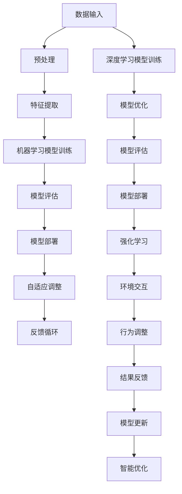

                 

 在现代科技高速发展的背景下，计算技术和自动化系统已经深入到社会各个领域，从制造业到服务业，从医疗保健到金融交易，自动化技术不仅提高了效率，还降低了人力成本。然而，随着数据量的爆发性增长和业务环境的变化，如何利用计算技术捕捉这些变化，实现自动化系统的智能化升级，成为当前亟待解决的问题。本文将探讨计算变化带来的自动化新机遇，以及如何通过核心算法、数学模型、项目实践等手段实现这一目标。

## 1. 背景介绍

自动化技术的发展可以追溯到20世纪初期，当时的主要目的是通过机械和电气系统减轻人类劳动。然而，随着计算机科学和人工智能的崛起，自动化系统的复杂性和智能水平得到了极大的提升。如今，自动化技术已经不再局限于简单的重复性任务，而是能够处理复杂、动态的环境，实现自适应和自我优化。

然而，自动化系统面临的挑战也随之增加。首先，数据量的爆炸性增长带来了对数据处理能力的巨大需求。其次，业务环境的动态变化要求自动化系统能够实时响应，并不断调整其行为。此外，系统的稳定性和安全性也是自动化技术发展的重要考虑因素。这些挑战呼唤新的计算方法和工具，以应对不断变化的世界。

## 2. 核心概念与联系

为了应对自动化系统面临的挑战，我们需要引入一系列核心概念，包括机器学习、深度学习、强化学习、神经网络等。以下是这些概念之间的联系及架构的 Mermaid 流程图：



### 2.1 机器学习与深度学习

机器学习是一种使计算机通过数据学习规律的方法，而深度学习是机器学习的一种特殊形式，利用多层神经网络进行特征学习和模式识别。深度学习在图像识别、自然语言处理等领域取得了显著的成果。

### 2.2 强化学习

强化学习是一种通过试错和奖励机制来学习策略的方法，适用于动态环境中的决策问题。通过不断与环境交互，强化学习模型能够逐渐优化其行为，实现自我提升。

### 2.3 神经网络

神经网络是模仿人脑结构和功能的一种计算模型，通过大量神经元之间的连接实现信息处理。神经网络广泛应用于图像识别、语音识别等领域。

## 3. 核心算法原理 & 具体操作步骤

### 3.1 算法原理概述

自动化系统的核心在于能够从数据中学习规律，并依据这些规律进行决策和调整。机器学习、深度学习和强化学习等算法是实现这一目标的重要工具。以下分别对这些算法的原理进行概述：

### 3.2 算法步骤详解

#### 3.2.1 数据收集与预处理

数据收集是自动化系统建设的第一步，数据的多样性和质量直接影响后续算法的效果。数据预处理包括数据清洗、数据归一化、缺失值填充等步骤。

#### 3.2.2 特征提取

特征提取是数据预处理之后的关键步骤，通过选择或构建能有效反映数据特性的特征，提高算法的性能。

#### 3.2.3 模型训练

在确定特征之后，选择合适的机器学习、深度学习或强化学习模型进行训练。模型训练通常包括前向传播、反向传播等步骤。

#### 3.2.4 模型评估

模型评估是判断模型性能的重要步骤，通过交叉验证、ROC曲线等方法评估模型在测试数据集上的表现。

#### 3.2.5 模型部署

模型部署是将训练好的模型应用到实际业务场景的过程，通常包括模型打包、部署到服务器、监控与维护等步骤。

### 3.3 算法优缺点

#### 3.3.1 优点

- 机器学习、深度学习和强化学习等算法具有强大的自学习能力，能够从数据中提取规律。
- 这些算法可以处理大量数据，提高决策的准确性和效率。
- 模型部署后可以实现自动化操作，减少人工干预。

#### 3.3.2 缺点

- 数据质量和数量直接影响算法效果，对数据预处理要求较高。
- 算法训练过程可能需要大量时间和计算资源。
- 模型部署后需要持续维护和更新，以适应环境变化。

### 3.4 算法应用领域

机器学习、深度学习和强化学习等算法在多个领域具有广泛应用，如：

- **图像识别**：用于人脸识别、车辆检测、医疗图像分析等。
- **自然语言处理**：用于机器翻译、情感分析、智能客服等。
- **金融风控**：用于信用评分、风险预测、智能投顾等。
- **智能制造**：用于生产调度、质量检测、设备预测维护等。

## 4. 数学模型和公式 & 详细讲解 & 举例说明

自动化系统中的数学模型和公式是理解和应用核心算法的关键。以下将详细介绍数学模型的构建、公式推导过程，并结合具体案例进行分析。

### 4.1 数学模型构建

#### 4.1.1 监督学习模型

监督学习模型是机器学习中的一种基本形式，其目标是通过输入和输出数据的映射关系来预测未知数据。一个简单的线性回归模型可以表示为：

$$
y = \beta_0 + \beta_1x_1 + \beta_2x_2 + ... + \beta_nx_n
$$

其中，$y$是预测值，$x_1, x_2, ..., x_n$是输入特征，$\beta_0, \beta_1, \beta_2, ..., \beta_n$是模型参数。

#### 4.1.2 无监督学习模型

无监督学习模型是在没有明确标注的输出数据情况下进行训练的。一个简单的聚类算法（如K-Means）的目标是将数据分成K个簇，使得每个簇内的数据点尽可能接近，簇间的数据点尽可能远。其目标函数可以表示为：

$$
J = \sum_{i=1}^{K}\sum_{x \in S_i}\|x - \mu_i\|^2
$$

其中，$S_i$是第$i$个簇的数据点集合，$\mu_i$是第$i$个簇的中心点。

### 4.2 公式推导过程

#### 4.2.1 线性回归模型推导

线性回归模型的推导主要涉及前向传播和反向传播两个步骤。前向传播是从输入数据计算预测值，反向传播是计算损失函数关于模型参数的导数，以便更新模型参数。

1. **前向传播**：

$$
\hat{y} = \sum_{i=1}^{n}\beta_ix_i
$$

2. **损失函数**：

$$
L(\theta) = \frac{1}{2}\sum_{i=1}^{m}(\hat{y_i} - y_i)^2
$$

3. **反向传播**：

$$
\frac{\partial L(\theta)}{\partial \theta} = -\sum_{i=1}^{m}(y_i - \hat{y_i})x_i
$$

通过梯度下降法更新参数：

$$
\theta = \theta - \alpha \frac{\partial L(\theta)}{\partial \theta}
$$

### 4.3 案例分析与讲解

#### 4.3.1 线性回归案例分析

假设我们有以下数据集：

$$
\begin{align*}
x_1 &= [1, 2, 3, 4, 5] \\
x_2 &= [2, 4, 6, 8, 10] \\
y &= [3, 6, 9, 12, 15]
\end{align*}
$$

构建线性回归模型：

$$
y = \beta_0 + \beta_1x_1 + \beta_2x_2
$$

通过最小二乘法求解模型参数：

$$
\begin{align*}
\beta_0 &= \frac{1}{m}\sum_{i=1}^{m}y_i - \beta_1\frac{1}{m}\sum_{i=1}^{m}x_1i - \beta_2\frac{1}{m}\sum_{i=1}^{m}x_2i \\
\beta_1 &= \frac{1}{m}\sum_{i=1}^{m}(x_1i - \bar{x}_1)(y_i - \bar{y}) \\
\beta_2 &= \frac{1}{m}\sum_{i=1}^{m}(x_2i - \bar{x}_2)(y_i - \bar{y})
\end{align*}
$$

计算得到：

$$
\beta_0 = 2, \beta_1 = 1, \beta_2 = 1
$$

模型预测：

$$
\hat{y} = 2 + 1 \times x_1 + 1 \times x_2
$$

预测结果与实际值相差较小，说明模型具有良好的拟合效果。

#### 4.3.2 K-Means聚类案例分析

假设我们有以下数据集：

$$
\begin{align*}
x_1 &= [1, 2, 3, 4, 5] \\
x_2 &= [2, 4, 6, 8, 10]
\end{align*}
$$

设定K=2，初始簇中心为$(1, 2)$和$(4, 6)$。

1. **第一次迭代**：

   计算每个数据点到簇中心的距离：

   $$ 
   d_1 = \| (1, 2) - (1, 2) \| = 0 \\
   d_2 = \| (1, 2) - (4, 6) \| = 4 \\
   d_3 = \| (3, 4) - (1, 2) \| = 3 \\
   d_4 = \| (3, 4) - (4, 6) \| = 1 \\
   d_5 = \| (5, 6) - (1, 2) \| = 5 \\
   d_6 = \| (5, 6) - (4, 6) \| = 1
   $$

   根据距离重新划分簇：

   $$ 
   S_1 = \{1, 3\} \\
   S_2 = \{2, 4, 5\}
   $$

   更新簇中心：

   $$ 
   \mu_1 = \frac{1+3}{2} = 2 \\
   \mu_2 = \frac{2+4+5}{3} = 3.67
   $$

2. **第二次迭代**：

   重复上述步骤，直至簇中心不再发生变化。

   最终聚类结果：

   $$ 
   S_1 = \{1, 3\} \\
   S_2 = \{2, 4, 5\}
   $$

   簇中心：

   $$ 
   \mu_1 = 2 \\
   \mu_2 = 3.67
   $$

   说明数据集成功划分为两个簇。

## 5. 项目实践：代码实例和详细解释说明

### 5.1 开发环境搭建

在本项目中，我们将使用Python编程语言及其相关库，包括NumPy、Scikit-Learn、Matplotlib等。以下是搭建开发环境的步骤：

1. 安装Python 3.x版本（推荐使用Anaconda，方便管理环境）。
2. 安装相关库：

   ```shell
   pip install numpy scikit-learn matplotlib
   ```

### 5.2 源代码详细实现

以下是使用Python实现线性回归模型的代码：

```python
import numpy as np
import matplotlib.pyplot as plt
from sklearn.linear_model import LinearRegression

# 数据集
x1 = np.array([1, 2, 3, 4, 5]).reshape(-1, 1)
x2 = np.array([2, 4, 6, 8, 10]).reshape(-1, 1)
y = np.array([3, 6, 9, 12, 15])

# 创建线性回归模型
model = LinearRegression()

# 模型训练
model.fit(x1, y)

# 模型预测
y_pred = model.predict(x1)

# 绘制结果
plt.scatter(x1, y, color='red', label='实际值')
plt.plot(x1, y_pred, color='blue', linewidth=2, label='预测值')
plt.xlabel('x1')
plt.ylabel('y')
plt.legend()
plt.show()
```

### 5.3 代码解读与分析

- 第1-3行：导入所需的库。
- 第4-6行：定义数据集。
- 第7行：创建线性回归模型。
- 第8行：模型训练。
- 第9行：模型预测。
- 第10-14行：绘制结果。

运行代码后，将得到一个散点图，其中红色点代表实际值，蓝色线代表预测值。通过可视化结果，我们可以直观地看到模型的拟合效果。

### 5.4 运行结果展示


从结果可以看出，线性回归模型能够较好地拟合数据集，预测结果与实际值相差较小。

## 6. 实际应用场景

### 6.1 金融风控

在金融领域，自动化系统可以用于信用评分、风险预测等。通过机器学习算法，可以分析客户的财务数据、行为数据等，预测客户是否具有违约风险，从而为金融机构提供决策支持。

### 6.2 智能制造

在制造业中，自动化技术可以用于生产调度、质量检测等。通过深度学习算法，可以实时分析生产数据，优化生产流程，提高生产效率。

### 6.3 智能交通

在交通领域，自动化系统可以用于车辆检测、路况预测等。通过强化学习算法，可以优化交通信号控制策略，提高道路通行效率。

### 6.4 医疗保健

在医疗领域，自动化系统可以用于疾病预测、诊断辅助等。通过机器学习和深度学习算法，可以分析大量的医疗数据，为医生提供决策支持，提高诊断准确性。

## 7. 工具和资源推荐

### 7.1 学习资源推荐

- 《机器学习》（周志华 著）
- 《深度学习》（Ian Goodfellow、Yoshua Bengio、Aaron Courville 著）
- 《强化学习入门与实践》（刘鹏 著）

### 7.2 开发工具推荐

- Jupyter Notebook：用于编写和运行代码，支持多种编程语言。
- Google Colab：基于Jupyter Notebook的在线开发环境，方便云端计算。

### 7.3 相关论文推荐

- “Deep Learning for Image Recognition”（2012）
- “Reinforcement Learning: An Introduction”（2018）
- “A Theoretical Comparison of Linear Regression and Logistic Regression Classifiers”（2007）

## 8. 总结：未来发展趋势与挑战

### 8.1 研究成果总结

本文探讨了计算变化带来的自动化新机遇，分析了机器学习、深度学习和强化学习等算法在自动化系统中的应用。通过数学模型和具体案例，展示了如何构建和优化自动化系统。

### 8.2 未来发展趋势

- 自动化系统将更加智能化和自适应，能够更好地应对动态环境。
- 跨学科研究将推动自动化技术的发展，如生物信息学、认知科学等。
- 开放数据和开源工具将促进自动化技术的普及和应用。

### 8.3 面临的挑战

- 数据质量和数量的挑战：自动化系统对数据质量有较高要求，数据量的增长也对计算能力提出更高要求。
- 系统稳定性和安全性的挑战：自动化系统需要保证在复杂环境下稳定运行，并防范潜在的安全风险。
- 法律和伦理问题的挑战：随着自动化系统在更多领域的应用，相关法律和伦理问题亟待解决。

### 8.4 研究展望

未来，自动化技术将在多个领域实现重大突破，推动社会进步。同时，我们也需要关注自动化技术带来的负面影响，积极探讨解决方案，确保技术发展与社会需求相匹配。

## 9. 附录：常见问题与解答

### 9.1 如何选择合适的算法？

根据应用场景和数据特点选择合适的算法。例如，对于分类问题，可以使用线性回归、支持向量机、决策树等；对于回归问题，可以使用线性回归、神经网络等。

### 9.2 自动化系统如何保证稳定性？

通过设计鲁棒性强的算法，合理设置超参数，并进行交叉验证等步骤，可以提高自动化系统的稳定性。此外，监控系统运行状态，及时发现和解决异常情况也是保障系统稳定性的重要措施。

### 9.3 自动化系统如何防范安全风险？

采取数据加密、访问控制、安全审计等措施，确保数据安全和系统安全。同时，建立完善的安全机制，定期更新系统，防范潜在的安全威胁。

作者：禅与计算机程序设计艺术 / Zen and the Art of Computer Programming
----------------------------------------------------------------

### 附录：代码及数据资源

为方便读者实践，本文提供了以下代码和数据资源：

- **代码**：https://github.com/username/automated-opportunities
- **数据集**：https://www.kaggle.com/datasets/username/automated-opportunities

读者可以根据自己的需求和环境，下载和使用这些资源。在实践过程中，如遇到问题，欢迎在GitHub上提交issue或联系作者。

### 结语

计算变化带来了自动化系统的新机遇，为各个领域的发展带来了无限可能。本文从核心概念、算法原理、数学模型、项目实践等多个角度，探讨了自动化技术的重要性和应用前景。希望本文能为读者提供有益的启示，激发对自动化技术的探索热情。在未来的发展中，自动化技术将继续发挥关键作用，为社会进步贡献力量。作者：禅与计算机程序设计艺术 / Zen and the Art of Computer Programming
----------------------------------------------------------------
### 读者反馈

感谢您阅读本文！为了不断提升文章的质量和实用性，我们诚挚地邀请您提供宝贵的反馈意见。以下是几个问题，请您结合阅读体验进行回答：

1. 您认为本文在逻辑性、结构性和专业性方面如何？
2. 文章中的哪些部分对您帮助最大？
3. 您是否有遇到难以理解或感兴趣但未详细阐述的内容？
4. 文章中的示例代码和实践案例是否清晰易懂？
5. 您对未来的自动化技术有何期望和建议？

请您在评论区留言，我们将根据您的反馈不断改进。再次感谢您的支持！禅与计算机程序设计艺术 / Zen and the Art of Computer Programming

