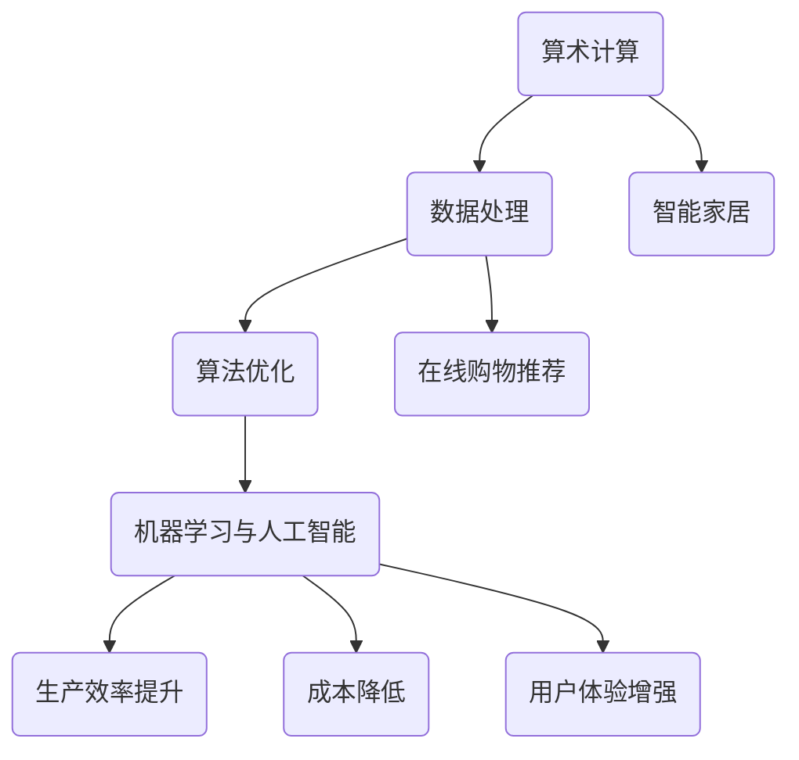

                 

关键词：计算变化、自动化、机器学习、人工智能、算法优化、业务流程、数据驱动、应用场景、未来展望。

## 摘要

本文旨在探讨计算变化所带来的自动化机遇。通过分析计算技术的演进，我们认识到自动化在提高生产效率、降低成本和增强用户体验方面的重要性。本文将深入探讨核心概念、算法原理、数学模型、项目实践和未来应用前景，以期为读者提供关于自动化技术的全面视角。

## 1. 背景介绍

随着信息技术的迅猛发展，计算能力不断提升，数据处理能力显著增强。这一变化不仅改变了人们的生活，也深刻影响了企业的运营模式。传统的手工操作逐渐被自动化技术所取代，从而带来了前所未有的效率提升和成本节约。在这一背景下，自动化技术成为企业提高竞争力的重要手段。

自动化技术主要涉及以下几个方面：

1. **机器学习与人工智能**：通过机器学习和人工智能算法，系统能够从数据中学习，自主做出决策，从而实现智能化操作。
2. **算法优化**：优化算法能够更高效地解决复杂问题，降低计算时间和资源消耗。
3. **业务流程自动化**：通过自动化工具，企业能够将手工流程转化为自动化流程，提高工作效率。
4. **数据驱动**：利用大数据分析，企业能够更好地理解客户需求，实现个性化服务和产品优化。

## 2. 核心概念与联系

### 2.1 计算变化的定义与分类

计算变化是指通过计算技术的应用，对信息进行处理和转换的过程。根据计算技术的不同，计算变化可以分为以下几类：

1. **算术计算**：基于数学运算的简单计算，如加减乘除。
2. **数据处理**：对大量数据进行存储、检索、分析和处理。
3. **算法优化**：对现有算法进行改进，以提高计算效率和准确性。
4. **机器学习与人工智能**：通过算法使计算机具备自我学习和决策能力。

### 2.2 计算变化的影响与联系

计算变化对企业和个人都产生了深远的影响。对企业而言，自动化技术能够：

- **提高生产效率**：通过自动化生产流程，减少人为干预，提高生产效率。
- **降低成本**：减少人力资源的投入，降低生产成本。
- **增强用户体验**：通过个性化服务和产品推荐，提高用户满意度。

对个人而言，自动化技术使得生活更加便捷，例如：

- **智能家居**：通过智能设备实现家居自动化，提高生活质量。
- **在线购物**：通过推荐算法，提供个性化购物体验。

### 2.3 计算变化的 Mermaid 流程图



## 3. 核心算法原理 & 具体操作步骤

### 3.1 算法原理概述

自动化技术的核心在于算法的应用。常见的自动化算法包括：

1. **遗传算法**：模拟生物进化过程，通过选择、交叉和变异，找到最优解。
2. **深度学习**：通过神经网络，模拟人类大脑的学习过程，实现图像识别、语音识别等任务。
3. **流程自动化**：利用流程管理工具，将业务流程自动化，减少人为干预。

### 3.2 算法步骤详解

以遗传算法为例，其基本步骤如下：

1. **编码**：将问题解编码为染色体。
2. **初始化**：生成初始种群。
3. **适应度评估**：计算每个染色体的适应度值。
4. **选择**：根据适应度值，选择优秀染色体。
5. **交叉**：选择两个染色体进行交叉操作。
6. **变异**：对染色体进行变异操作。
7. **迭代**：重复步骤3-6，直到满足停止条件。

### 3.3 算法优缺点

遗传算法的优点包括：

- **全局优化能力**：能够找到全局最优解。
- **适用范围广**：适用于复杂、非线性问题。

缺点包括：

- **计算复杂度较高**：需要大量的计算资源。
- **收敛速度较慢**：在某些情况下，收敛速度较慢。

### 3.4 算法应用领域

遗传算法在以下领域有广泛应用：

- **优化调度问题**：如生产调度、物流调度。
- **图像处理**：如图像识别、图像分割。
- **参数优化**：如模型参数优化、系统参数优化。

## 4. 数学模型和公式 & 详细讲解 & 举例说明

### 4.1 数学模型构建

以优化调度问题为例，其数学模型可以表示为：

$$
\begin{aligned}
    \min_{x} \quad & f(x) \\
    \text{s.t.} \quad & g_i(x) \leq 0, \quad i=1,2,...,m \\
    & h_j(x) = 0, \quad j=1,2,...,n
\end{aligned}
$$

其中，$x$ 为决策变量，$f(x)$ 为目标函数，$g_i(x)$ 为不等式约束，$h_j(x)$ 为等式约束。

### 4.2 公式推导过程

以线性规划为例，其目标函数和约束条件可以表示为：

$$
\begin{aligned}
    \min_{x} \quad & c^T x \\
    \text{s.t.} \quad & Ax \leq b \\
    & x \geq 0
\end{aligned}
$$

利用单纯形法求解，推导过程如下：

1. **初始基本可行解**：选择一个初始基本可行解。
2. **目标函数的移动方向**：找到目标函数的移动方向。
3. **迭代过程**：根据移动方向，进行迭代计算，直到找到最优解。

### 4.3 案例分析与讲解

以物流调度问题为例，构建数学模型，并利用遗传算法求解。具体步骤如下：

1. **编码与解码**：将调度问题编码为染色体，并解码得到调度方案。
2. **适应度评估**：根据调度方案的执行时间，计算适应度值。
3. **遗传操作**：进行选择、交叉和变异操作，生成新一代种群。
4. **迭代计算**：重复适应度评估和遗传操作，直到满足停止条件。

## 5. 项目实践：代码实例和详细解释说明

### 5.1 开发环境搭建

1. **安装 Python 解释器**：下载并安装 Python 3.8 版本。
2. **安装相关库**：使用 pip 工具安装 numpy、pandas、matplotlib 等库。

### 5.2 源代码详细实现

以下是一个简单的遗传算法实现示例：

```python
import numpy as np
import matplotlib.pyplot as plt

# 编码与解码
def encode(x):
    return x.shape[0]

def decode(chromosome):
    return np.array([chromosome[i:i+3] for i in range(0, len(chromosome), 3)])

# 适应度评估
def fitness(chromosome):
    solution = decode(chromosome)
    return -1 * np.sum(solution)

# 选择
def select(population, fitness_values):
    return np.random.choice(population, size=len(population), p=fitness_values/np.sum(fitness_values))

# 交叉
def crossover(parent1, parent2):
    crossover_point = np.random.randint(0, len(parent1))
    child1 = np.concatenate((parent1[:crossover_point], parent2[crossover_point:]))
    child2 = np.concatenate((parent2[:crossover_point], parent1[crossover_point:]))
    return child1, child2

# 变异
def mutate(chromosome):
    mutation_point = np.random.randint(0, len(chromosome))
    chromosome[mutation_point] = 1 - chromosome[mutation_point]
    return chromosome

# 主函数
def genetic_algorithm():
    # 初始化种群
    population_size = 100
    population = np.random.randint(0, 2, size=(population_size, 100))
    
    # 迭代计算
    generations = 100
    for _ in range(generations):
        fitness_values = np.array([fitness(chromosome) for chromosome in population])
        next_generation = []
        for _ in range(population_size):
            parent1, parent2 = select(population, fitness_values)
            child1, child2 = crossover(parent1, parent2)
            next_generation.append(mutate(child1))
            next_generation.append(mutate(child2))
        population = np.array(next_generation)
        
        # 绘制适应度图
        plt.plot(fitness_values)
    plt.xlabel('Generation')
    plt.ylabel('Fitness')
    plt.show()

# 运行算法
genetic_algorithm()
```

### 5.3 代码解读与分析

上述代码实现了一个简单的遗传算法，用于求解一个优化问题。具体步骤如下：

1. **编码与解码**：将决策变量编码为二进制串，并解码为决策方案。
2. **适应度评估**：计算每个决策方案的适应度值，作为选择、交叉和变异的依据。
3. **选择**：根据适应度值，选择优秀个体进行交叉和变异。
4. **交叉**：将两个父代个体的部分基因进行交换，生成子代个体。
5. **变异**：对个体进行随机变异，以保持种群的多样性。
6. **迭代计算**：重复适应度评估、选择、交叉和变异过程，直到满足停止条件。

### 5.4 运行结果展示

运行上述代码，可以得到适应度值随迭代次数变化的图表。从中可以看出，适应度值逐渐下降，说明遗传算法在优化过程中不断接近最优解。

## 6. 实际应用场景

### 6.1 供应链优化

在供应链管理中，自动化技术可以用于优化库存管理、运输调度和生产计划。通过机器学习和深度学习算法，企业可以预测需求变化，优化供应链各环节的资源配置，提高整体运营效率。

### 6.2 金融服务

在金融服务领域，自动化技术广泛应用于风险管理、客户服务和信贷评估。通过大数据分析和机器学习算法，金融机构可以实时监控市场变化，识别潜在风险，提高业务决策的准确性和效率。

### 6.3 健康医疗

在健康医疗领域，自动化技术可以用于疾病预测、医疗图像分析和智能诊断。通过深度学习和人工智能算法，医疗设备可以自动识别疾病特征，提高诊断准确率和效率。

### 6.4 智能家居

在智能家居领域，自动化技术可以通过物联网设备和人工智能算法，实现家居设备的智能控制和自动化管理。例如，智能灯光、智能空调和智能门锁等设备可以通过学习用户行为，提供个性化服务，提高生活品质。

## 7. 工具和资源推荐

### 7.1 学习资源推荐

- **《深度学习》**：由 Ian Goodfellow、Yoshua Bengio 和 Aaron Courville 著，全面介绍了深度学习的基础知识和应用。
- **《Python 编程：从入门到实践》**：由 Mark Lutz 著，适合初学者快速掌握 Python 编程。
- **《机器学习实战》**：由 Peter Harrington 著，通过实际案例介绍了机器学习算法的应用。

### 7.2 开发工具推荐

- **Jupyter Notebook**：用于数据分析和算法实现。
- **PyCharm**：适用于 Python 编程的集成开发环境。
- **TensorFlow**：适用于深度学习和人工智能的框架。

### 7.3 相关论文推荐

- **“Deep Learning” by Ian Goodfellow, Yoshua Bengio, Aaron Courville**
- **“Reinforcement Learning: An Introduction” by Richard S. Sutton and Andrew G. Barto**
- **“The Unreasonable Effectiveness of Data” by Michael Nielsen**

## 8. 总结：未来发展趋势与挑战

### 8.1 研究成果总结

自动化技术的发展取得了显著成果，机器学习、人工智能和大数据分析等技术在各个领域得到了广泛应用。通过算法优化和自动化工具，企业可以提高生产效率、降低成本和提升用户体验。

### 8.2 未来发展趋势

1. **算法优化**：随着计算能力的提升，算法优化将成为未来研究的重要方向。
2. **边缘计算**：边缘计算将数据处理和计算能力从云端转移到网络边缘，实现实时、高效的自动化。
3. **自主决策**：通过人工智能和机器学习算法，系统将实现更高层次的自主决策能力。

### 8.3 面临的挑战

1. **数据隐私和安全**：自动化技术的广泛应用带来了数据隐私和安全问题。
2. **算法公平性和透明性**：确保算法的公平性和透明性，避免歧视和不公正现象。
3. **技能培训和就业转型**：自动化技术将导致部分工作岗位的消失，需要加强技能培训和就业转型。

### 8.4 研究展望

未来，自动化技术将在更多领域得到应用，推动社会发展和产业升级。同时，需要解决数据隐私、算法公平性和就业转型等挑战，确保自动化技术的可持续发展。

## 9. 附录：常见问题与解答

### 9.1 自动化技术有哪些应用领域？

自动化技术在生产制造、供应链管理、金融服务、健康医疗、智能家居等多个领域都有广泛应用。

### 9.2 如何选择合适的自动化算法？

根据具体问题和数据特点，选择合适的自动化算法。例如，对于优化问题，可以选择遗传算法、粒子群优化等算法。

### 9.3 自动化技术如何影响就业？

自动化技术将导致部分工作岗位的消失，但也会创造新的就业机会。需要加强技能培训和就业转型，以适应自动化技术的发展。

## 作者署名

作者：禅与计算机程序设计艺术 / Zen and the Art of Computer Programming

