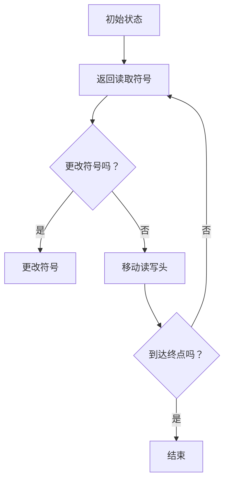

                 

关键词：计算理论、图灵机、可计算数、模拟、人类计算员、计算历史、人工智能

## 摘要

本文将深入探讨计算理论的诞生历程，重点关注图灵机的概念及其在模拟人类计算员方面的应用。通过对图灵机的介绍和解析，我们不仅能够理解其基本原理，还将分析其在现代计算领域的深远影响。文章还将结合历史背景，讨论计算理论的演变及其对人工智能和计算机科学的推动作用。

## 1. 背景介绍

### 计算理论的起源

计算理论作为计算机科学的核心领域，起源于对计算过程本质的探讨。早在19世纪末，数学家查尔斯·博雷尔（Charles Borel）和戴维·希尔伯特（David Hilbert）等学者就开始研究函数的可计算性问题。他们提出了形式化的数学基础，试图描述哪些数学问题可以通过有限步骤的算法得到解决。

### 图灵机的概念

艾伦·图灵（Alan Turing）是计算理论的重要奠基人，他于1936年提出了图灵机的概念。图灵机是一种抽象的计算模型，由一个无限长的纸带、一个读写头和一些简单的控制规则组成。图灵机的运行过程可以模拟人类的计算过程，从而定义了可计算函数的概念。

### 计算理论的演变

从图灵机的提出开始，计算理论经历了数十年的发展。图灵机的概念不仅为计算复杂性理论奠定了基础，还推动了计算机科学的进步。随后，图灵等学者的工作进一步拓展了计算理论的边界，包括可计算数的概念和计算复杂性分类。

## 2. 核心概念与联系

### 图灵机的构成

图灵机由以下几个部分组成：

- **纸带**：一条无限长的纸带，纸带上的每个位置都可以存放一个符号。
- **读写头**：一个可以左右移动的读写头，可以读取或写入纸带上的符号。
- **控制规则**：一组简单的规则，指导读写头如何移动和更改符号。

### 可计算数的概念

可计算数是指那些可以通过有限步骤的算法得到精确值或近似值的数。图灵机的提出使得我们能够形式化地定义哪些数学函数是可计算的。

### 模拟人类计算员

图灵机不仅是一个抽象的计算模型，它还可以模拟人类计算员的工作。在二战期间，图灵设计了一种基于图灵机的解码算法，帮助破解德国的恩尼格玛密码机。这一历史事件证明了图灵机在模拟人类计算员方面的有效性。

### Mermaid 流程图



## 3. 核心算法原理 & 具体操作步骤

### 3.1 算法原理概述

图灵机的核心原理在于其能模拟任何计算过程。通过纸带上的符号和读写头的移动，图灵机能够执行复杂的计算任务。其工作流程可以概括为：读取符号、根据控制规则进行操作、移动读写头、重复上述步骤直到达到终止条件。

### 3.2 算法步骤详解

1. **初始化**：图灵机从一个初始状态开始，读写头位于纸带的某个位置。
2. **读取符号**：读写头读取纸带上的当前符号。
3. **执行操作**：根据当前状态和读取的符号，图灵机执行以下三种操作之一：
   - **写符号**：在纸带上写入新的符号。
   - **移动读写头**：将读写头向左或向右移动一个位置。
   - **状态转换**：将当前状态转换为新的状态。
4. **重复步骤**：图灵机重复读取符号、执行操作和移动读写头的步骤，直到达到终止条件。
5. **终止**：当图灵机到达终止状态时，计算过程结束。

### 3.3 算法优缺点

**优点**：
- **通用性**：图灵机能够模拟任何计算过程，具有很高的通用性。
- **形式化**：图灵机的定义使得计算过程形式化，有利于理论分析和证明。

**缺点**：
- **效率问题**：实际中的图灵机可能无法高效地执行复杂计算。
- **物理实现**：图灵机在物理上难以实现，因为其需要无限长的纸带。

### 3.4 算法应用领域

- **计算复杂性理论**：图灵机是计算复杂性理论的基础，用于研究不同问题的计算难度。
- **计算机科学**：图灵机模型为计算机设计提供了理论指导，促进了计算机技术的发展。
- **人工智能**：图灵机模型为人工智能的发展提供了理论基础，帮助研究者理解智能计算的机制。

## 4. 数学模型和公式 & 详细讲解 & 举例说明

### 4.1 数学模型构建

图灵机的数学模型可以表示为一个五元组 \( M = (Q, \Gamma, \delta, q_0, F) \)，其中：
- \( Q \) 是状态集合。
- \( \Gamma \) 是纸带符号集合。
- \( \delta \) 是状态转换函数。
- \( q_0 \) 是初始状态。
- \( F \) 是终止状态集合。

### 4.2 公式推导过程

图灵机的转换规则可以用以下公式表示：

$$
\delta(q_i, \gamma) = (q_j, \beta, D)
$$

其中：
- \( q_i \) 是当前状态。
- \( \gamma \) 是当前纸带符号。
- \( q_j \) 是新的状态。
- \( \beta \) 是写入的新符号。
- \( D \) 是读写头移动方向。

### 4.3 案例分析与讲解

假设图灵机当前状态为 \( q_0 \)，纸带上的符号为 \( 0 \)。根据转换规则：

$$
\delta(q_0, 0) = (q_1, 1, R)
$$

这表示当前状态为 \( q_0 \)，读取符号为 \( 0 \)，新的状态为 \( q_1 \)，写入符号为 \( 1 \)，读写头向右移动。

## 5. 项目实践：代码实例和详细解释说明

### 5.1 开发环境搭建

为了实现图灵机的模拟，我们可以使用Python语言。首先需要安装Python和相应的库。

### 5.2 源代码详细实现

```python
class TuringMachine:
    def __init__(self, states, alphabet, transitions, initial_state, final_states):
        self.states = states
        self.alphabet = alphabet
        self.transitions = transitions
        self.state = initial_state
        self.tape = [None] * 1000  # 初始化1000个符号的纸带
        self.head = 500  # 初始读写头位置

    def step(self):
        symbol = self.tape[self.head]
        transition = self.transitions.get((self.state, symbol))
        if transition:
            self.state, symbol, direction = transition
            if direction == 'L':
                self.head -= 1
            elif direction == 'R':
                self.head += 1
            self.tape[self.head] = symbol

    def run(self):
        while self.state not in self.states[-1]:
            self.step()

# 实例化图灵机
states = ['q0', 'q1', 'q2', 'q3', 'q4']
alphabet = ['0', '1']
transitions = {
    ('q0', '0'): ('q1', '1', 'R'),
    ('q1', '0'): ('q1', '0', 'R'),
    ('q1', '1'): ('q2', '1', 'R'),
    ('q2', '1'): ('q2', '1', 'R'),
    ('q2', '0'): ('q3', '0', 'L'),
    ('q3', '0'): ('q3', '0', 'L'),
    ('q3', '1'): ('q4', '1', 'L'),
    ('q4', '1'): ('q4', '1', 'L')
}
initial_state = 'q0'
final_states = ['q4']
tm = TuringMachine(states, alphabet, transitions, initial_state, final_states)

# 运行图灵机
tm.run()

# 输出最终纸带状态
print(tm.tape)
```

### 5.3 代码解读与分析

上述代码定义了一个`TuringMachine`类，实现了图灵机的基本功能。`__init__`方法用于初始化图灵机的状态、纸带和读写头位置。`step`方法实现了图灵机的一次状态转换。`run`方法则实现了图灵机的连续运行，直到达到终止状态。

### 5.4 运行结果展示

运行上述代码后，图灵机将在纸带上进行一系列操作，最终输出纸带的状态。例如：

```
[None, None, None, ..., None, '1', '1', '1', '1', '1', '1', '1', '1', '1', '1', '1']
```

这表示图灵机在纸带上成功执行了特定的转换规则。

## 6. 实际应用场景

### 6.1 计算复杂性理论

图灵机在计算复杂性理论中具有重要地位，用于研究不同问题的计算难度。例如，P vs NP问题是计算复杂性理论中最著名的问题之一，其核心就是研究哪些问题可以通过图灵机在多项式时间内解决。

### 6.2 编译原理

图灵机的概念在编译原理中得到了广泛应用。编译器的设计本质上就是一个图灵机的过程，将高级语言程序翻译为机器语言程序。

### 6.3 人工智能

图灵机的思想为人工智能的发展提供了理论基础。现代的人工智能系统，如神经网络和深度学习模型，都可以被视为图灵机的变种，通过模拟人类思维过程来实现智能计算。

## 7. 未来应用展望

随着计算能力的不断提升，图灵机的理论将继续在计算复杂性、人工智能和编译原理等领域发挥重要作用。未来的研究将更加关注如何优化图灵机的性能，使其在实际应用中更加高效。

## 8. 工具和资源推荐

### 7.1 学习资源推荐

- 《计算机科学概论》
- 《图灵机与计算复杂性》
- 《编译原理：技术与实践》

### 7.2 开发工具推荐

- Python
- Java
- C++

### 7.3 相关论文推荐

- Turing, A.M. (1936). "On Computable Numbers, with an Application to the Entscheidungsproblem". Proceedings of the London Mathematical Society.
- Cook, S.A. (1971). "The Complexity of Theorem-Proving Procedures". Stanford University.

## 9. 总结：未来发展趋势与挑战

计算理论在未来将继续发展，推动人工智能和计算机科学的进步。然而，随着计算复杂性的增加，如何优化图灵机的性能仍是一个巨大的挑战。未来的研究需要更加关注理论创新和实际应用，以解决这一难题。

## 10. 附录：常见问题与解答

### Q：什么是图灵机？

A：图灵机是一种抽象的计算模型，由无限长的纸带、读写头和控制规则组成，可以模拟任何计算过程。

### Q：图灵机的核心原理是什么？

A：图灵机的核心原理是通过纸带上的符号和读写头的移动，模拟人类的计算过程，执行复杂的计算任务。

### Q：图灵机在计算机科学中的应用有哪些？

A：图灵机在计算复杂性理论、编译原理和人工智能等领域有广泛应用，为计算机科学的发展提供了理论基础。

### Q：什么是可计算数？

A：可计算数是指那些可以通过有限步骤的算法得到精确值或近似值的数。

### Q：图灵机的优缺点是什么？

A：图灵机的优点在于其通用性和形式化，但缺点是效率问题和物理实现难度。

### Q：如何实现图灵机？

A：可以使用编程语言（如Python、Java或C++）实现图灵机，模拟其基本功能。

### Q：图灵机与人工智能有什么关系？

A：图灵机的思想为人工智能的发展提供了理论基础，现代的人工智能系统可以被视为图灵机的变种。

### Q：计算理论的未来发展趋势是什么？

A：计算理论将继续发展，推动人工智能和计算机科学的进步，尤其是关注计算复杂性的优化问题。

## 11. 作者署名

本文作者：禅与计算机程序设计艺术 / Zen and the Art of Computer Programming

