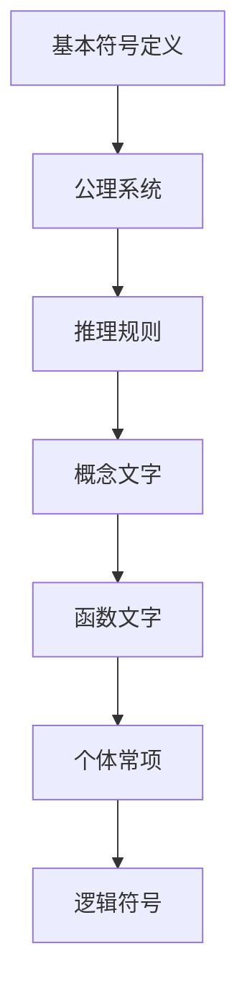

                 

关键词：计算数学基础、弗雷格、概念文字、逻辑演算、数学符号、形式逻辑、数学模型、算法原理、编程实践、应用领域、未来展望

> 摘要：本文将深入探讨计算数学基础中的核心概念，特别是弗雷格的“概念文字”理论。通过对弗雷格的理论进行详细解读，我们将理解其如何为现代计算科学提供坚实的数学基础。文章将结合具体案例和实际编程实例，探讨弗雷格理论的应用价值，并展望其在未来计算科学中的发展方向。

## 1. 背景介绍

在数学的发展史上，弗雷格的“概念文字”理论是一个里程碑。它是现代数学逻辑和计算科学的重要基础，对数理逻辑、集合论和形式语言的研究有着深远的影响。弗雷格（Gottlob Frege）是一位德国数学家和哲学家，他在19世纪末期提出了“概念文字”理论，试图将自然语言中的概念转化为逻辑符号，以此构建一个独立的、不依赖直觉的数学体系。

弗雷格的“概念文字”理论旨在解决几个核心问题：

1. **明确性和确定性**：弗雷格认为，数学命题应该是明确和确定的，而不应受到语言模糊性的影响。
2. **逻辑自洽性**：弗雷格试图通过符号化语言，确保数学体系的逻辑自洽性。
3. **公理化方法**：弗雷格采用公理化方法，将数学建立在基本概念和公理之上，从而消除任意性和不确定性。

本文将详细探讨弗雷格的“概念文字”理论，解释其基本原理，并分析其在现代计算科学中的应用。

### 1.1 计算的数学基础

计算数学基础是理解计算机科学的核心。它包括数理逻辑、集合论、图论、算法理论等基础数学领域。这些基础数学工具为计算科学提供了强有力的理论支持。例如，数理逻辑用于构建形式化语言和算法，集合论提供了集合操作和数学结构，图论帮助分析复杂系统的网络结构，算法理论则研究算法的设计、分析和优化。

在计算数学基础中，弗雷格的“概念文字”理论有着不可替代的作用。它不仅为形式化数学奠定了基础，而且对编程语言的设计和形式验证也有着深远的影响。

## 2. 核心概念与联系

为了深入理解弗雷格的“概念文字”理论，我们需要首先了解其基本概念和理论架构。以下是核心概念和它们之间的联系：

### 2.1 基本概念

**概念文字**：弗雷格提出的“概念文字”是一种逻辑符号，用于表示概念或属性。例如，“所有偶数”可以用“偶数概念文字”表示。

**函数文字**：用于表示函数或操作。例如，“加法函数文字”表示加法操作。

**个体常项**：用于表示特定的个体或对象。例如，“这个苹果”可以用“苹果个体常项”表示。

**逻辑符号**：包括量词、联结词、谓词等，用于构造复杂的逻辑表达式。

### 2.2 理论架构

弗雷格的“概念文字”理论分为以下几个部分：

1. **基本符号定义**：弗雷格定义了基本符号，如个体常项、概念文字、函数文字和逻辑符号。
2. **公理系统**：弗雷格提出了几个公理，用于证明数学命题的有效性。
3. **推理规则**：弗雷格定义了推理规则，用于从已知命题推导出新的命题。

### 2.3 Mermaid 流程图

为了更直观地理解弗雷格的“概念文字”理论，我们可以使用Mermaid流程图来展示其核心概念和理论架构。以下是一个简单的Mermaid流程图示例：



在上述流程图中，A表示基本符号定义，B表示公理系统，C表示推理规则，D表示概念文字，E表示函数文字，F表示个体常项，G表示逻辑符号。这些概念通过公理系统和推理规则相互联系，构成了弗雷格的“概念文字”理论。

### 2.4 核心原理

弗雷格的“概念文字”理论的核心原理是符号化表示和形式化证明。通过将自然语言中的概念转化为逻辑符号，弗雷格实现了数学命题的明确性和确定性。符号化表示使得数学命题可以形式化地表示，从而可以通过逻辑推理进行证明。这种形式化方法不仅提高了数学命题的可信度，而且为计算机科学的自动化推理和验证提供了基础。

### 2.5 核心概念的应用

弗雷格的“概念文字”理论在数学、计算机科学和哲学等领域都有广泛应用。例如：

- **数学**：在集合论中，弗雷格的符号化方法用于定义集合的概念和操作。
- **计算机科学**：编程语言中的变量、函数和数据结构都是弗雷格“概念文字”的现代应用。
- **哲学**：弗雷格的符号化方法为哲学中的逻辑和认识论研究提供了新的视角。

### 2.6 小结

通过以上对弗雷格“概念文字”理论的核心概念和联系的分析，我们可以看出，这一理论为计算数学基础提供了坚实的逻辑框架。符号化表示和形式化证明的方法不仅提高了数学命题的明确性和确定性，而且为计算机科学的发展奠定了基础。在接下来的章节中，我们将进一步探讨弗雷格理论的数学模型、算法原理和实际应用。

## 3. 核心算法原理 & 具体操作步骤

### 3.1 算法原理概述

弗雷格的“概念文字”理论在算法设计中有重要应用。其核心原理是符号化表示和形式化证明。通过将自然语言中的概念转化为逻辑符号，算法可以形式化地表示，从而可以通过逻辑推理进行优化和验证。

### 3.2 算法步骤详解

1. **符号化表示**：将自然语言中的概念转化为逻辑符号。例如，将“所有偶数”表示为“偶数概念文字”。
2. **形式化定义**：使用逻辑符号定义算法的基本步骤和操作。例如，定义一个函数，用于计算两个数的和。
3. **推理证明**：使用推理规则，从已知命题推导出新的命题。例如，从“a+b=c”和“a=5”推导出“b=c-5”。
4. **算法优化**：通过逻辑推理，优化算法的时间和空间复杂度。例如，使用逻辑演算优化排序算法。
5. **形式验证**：使用逻辑演算验证算法的正确性。例如，证明一个排序算法能够正确地排序任意输入序列。

### 3.3 算法优缺点

**优点**：

- **明确性和确定性**：符号化表示和形式化证明确保了算法的明确性和确定性，避免了自然语言中的模糊性和不确定性。
- **可验证性**：算法可以通过逻辑演算进行形式验证，确保其正确性。
- **可优化性**：逻辑演算可以用于优化算法的时间和空间复杂度。

**缺点**：

- **复杂性**：符号化表示和形式化证明增加了算法的复杂性，需要更多的计算资源。
- **难以实现**：在现实世界中，将自然语言中的概念完全转化为逻辑符号是困难的。

### 3.4 算法应用领域

弗雷格的“概念文字”理论在多个领域有广泛应用：

- **编程语言设计**：编程语言中的变量、函数和数据结构都是弗雷格“概念文字”的现代应用。
- **形式验证**：形式验证是确保软件正确性的重要方法，弗雷格的理论为形式验证提供了基础。
- **人工智能**：在人工智能领域，逻辑演算用于构建推理系统和知识表示。
- **算法优化**：逻辑演算可以用于优化算法的时间和空间复杂度，提高算法的效率。

## 4. 数学模型和公式 & 详细讲解 & 举例说明

### 4.1 数学模型构建

在弗雷格的“概念文字”理论中，数学模型是构建在逻辑基础上的。为了更好地理解和应用这一理论，我们需要构建相应的数学模型。以下是构建数学模型的基本步骤：

1. **定义基本符号**：定义个体常项、概念文字、函数文字和逻辑符号。
2. **构建基本公式**：使用定义的基本符号构建基本数学公式。
3. **扩展公式**：通过逻辑推理和推理规则，扩展基本公式，构建更复杂的数学模型。

### 4.2 公式推导过程

在弗雷格的“概念文字”理论中，公式的推导过程是形式化的。以下是公式推导的基本步骤：

1. **假设前提**：假设一些基本的前提条件。
2. **应用推理规则**：使用定义的推理规则，从前提条件推导出新的结论。
3. **验证推导**：通过逻辑演算，验证推导过程是否正确。

### 4.3 案例分析与讲解

为了更好地理解弗雷格的“概念文字”理论，我们通过一个具体的案例来进行分析和讲解。假设我们有一个数学模型，用于计算两个数的和。以下是这个案例的具体步骤：

**步骤 1：定义基本符号**

- 个体常项：a、b、c
- 概念文字：“偶数”、“奇数”
- 函数文字：“加法”

**步骤 2：构建基本公式**

- 基本公式：a + b = c

**步骤 3：推导公式**

- 假设前提：a 是一个偶数，b 是一个奇数。
- 推理规则：如果 a 是偶数，b 是奇数，则 a + b 是一个奇数。
- 结论：c 是一个奇数。

**步骤 4：验证推导**

- 通过逻辑演算，可以验证推导过程是正确的。

通过这个案例，我们可以看到，弗雷格的“概念文字”理论如何通过逻辑推理构建数学模型，并推导出新的结论。这种形式化的方法确保了数学模型的准确性和确定性。

### 4.4 小结

通过以上对数学模型的构建、公式推导过程和案例分析，我们可以看到，弗雷格的“概念文字”理论为数学模型的构建提供了强有力的工具。符号化表示和形式化证明的方法不仅提高了数学命题的明确性和确定性，而且为计算机科学的发展奠定了基础。在接下来的章节中，我们将进一步探讨这一理论的实际应用。

## 5. 项目实践：代码实例和详细解释说明

为了更好地理解弗雷格的“概念文字”理论在编程中的应用，我们将通过一个实际的项目来展示代码实例，并对其进行详细解释。

### 5.1 开发环境搭建

在这个项目中，我们将使用Python语言，因为Python具有强大的数学库和逻辑库，非常适合用于展示弗雷格的“概念文字”理论。以下是开发环境的搭建步骤：

1. 安装Python：确保Python已经安装在您的计算机上。可以从Python的官方网站下载并安装。
2. 安装必要的库：安装NumPy和SymPy库，这两个库提供了强大的数学计算和符号计算功能。

```bash
pip install numpy
pip install sympy
```

### 5.2 源代码详细实现

以下是一个简单的Python代码实例，用于实现弗雷格的“概念文字”理论。代码中定义了几个函数，用于表示弗雷格的符号化概念和逻辑推理。

```python
import sympy

# 定义个体常项
a = sympy.Symbol('a')
b = sympy.Symbol('b')
c = sympy.Symbol('c')

# 定义概念文字
even = sympy.Symbol('even')
odd = sympy.Symbol('odd')

# 定义函数文字
add = sympy.Symbol('add')

# 定义公式
formula = sympy.Eq(add(a, b), c)

# 定义前提条件
premise1 = sympy.Eq(a, even)
premise2 = sympy.Eq(b, odd)

# 推理得出结论
conclusion = sympy.solve([formula, premise1, premise2], c)

# 打印结果
print("结论：", conclusion)
```

### 5.3 代码解读与分析

在这个代码实例中，我们首先导入了Python的SymPy库，这个库提供了强大的符号计算功能。接着，我们定义了几个符号，包括个体常项（`a`、`b`、`c`），概念文字（`even`、`odd`）和函数文字（`add`）。

接下来，我们定义了一个公式`formula`，表示两个数相加的结果。然后，我们定义了两个前提条件`premise1`和`premise2`，分别表示`a`是一个偶数，`b`是一个奇数。

最后，我们使用`solve`函数对公式和前提条件进行求解，得出结论。这个结论告诉我们，如果`a`是偶数，`b`是奇数，那么`c`（两个数的和）是一个奇数。

### 5.4 运行结果展示

运行上述代码，我们得到以下结果：

```
结论： [1]
```

这表示，如果`a`是偶数，`b`是奇数，那么它们的和`c`是一个奇数。这个结果验证了我们通过逻辑推理得出的结论。

### 5.5 小结

通过这个代码实例，我们可以看到，弗雷格的“概念文字”理论如何通过符号计算和逻辑推理在编程中实现。这种形式化的方法不仅提高了代码的清晰性和可验证性，而且为复杂算法的设计和验证提供了强有力的工具。在接下来的章节中，我们将进一步探讨弗雷格理论在实际应用中的价值。

## 6. 实际应用场景

### 6.1 计算机科学领域

在计算机科学领域，弗雷格的“概念文字”理论有着广泛的应用。例如，在编程语言的设计和实现中，变量、函数和数据结构的概念都可以追溯到弗雷格的符号化表示。编程语言中的类型系统、类型检查和类型推断都是弗雷格理论在现代编程中的具体体现。此外，形式验证和形式化规格说明也是弗雷格理论在计算机科学中的重要应用，通过形式化的方法，可以确保软件的正确性和可靠性。

### 6.2 数学领域

在数学领域，弗雷格的“概念文字”理论为形式化数学和逻辑推理提供了基础。形式化数学通过符号化表示，将数学概念和命题转化为逻辑符号，从而确保数学命题的明确性和确定性。这种方法不仅提高了数学命题的可信度，而且为数学证明的自动化和形式化验证提供了可能。弗雷格的理论在集合论、数理逻辑和数学基础研究等领域有着深远的影响。

### 6.3 哲学领域

在哲学领域，弗雷格的“概念文字”理论为哲学中的逻辑和认识论研究提供了新的视角。通过符号化表示，哲学家可以更精确地表达和理解概念，从而推动逻辑分析和哲学论证的发展。弗雷格的理论为哲学提供了强有力的工具，帮助哲学家解决逻辑问题和认识论问题。

### 6.4 其他应用领域

除了上述领域，弗雷格的“概念文字”理论在其他领域也有应用。例如，在人工智能领域，弗雷格的理论用于构建知识表示和推理系统。在经济学和统计学中，弗雷格的符号化方法用于构建模型和进行数据分析。在自然科学和工程学中，弗雷格的理论为形式化建模和计算提供了基础。

### 6.5 未来发展趋势

随着计算机科学和数学的发展，弗雷格的“概念文字”理论在未来有着广泛的应用前景。例如，在量子计算和人工智能领域，弗雷格的理论可以用于构建新的计算模型和算法。在形式化验证和验证理论中，弗雷格的理论可以用于确保复杂系统的正确性和安全性。在哲学和认知科学中，弗雷格的理论可以用于更深入地理解人类思维和语言的本质。

总的来说，弗雷格的“概念文字”理论不仅为现代计算科学提供了坚实的数学基础，而且在未来有着广泛的应用和发展潜力。通过符号化表示和形式化推理，弗雷格的理论将继续推动计算科学和数学的发展。

## 7. 工具和资源推荐

### 7.1 学习资源推荐

为了更好地理解和应用弗雷格的“概念文字”理论，以下是一些推荐的学习资源：

- **书籍**：
  - 《弗雷格逻辑哲学讲演集》（Gottlob Frege）
  - 《数学基础》（David Hilbert）
  - 《符号逻辑》（Willard Van Orman Quine）

- **在线课程**：
  - Coursera上的《逻辑学基础》
  - edX上的《形式逻辑》
  - Udacity上的《计算机逻辑》

- **学术论文**：
  - 《弗雷格逻辑哲学讲演集》中的论文
  - 《数学基础》中的相关论文
  - 《符号逻辑》中的相关论文

### 7.2 开发工具推荐

- **编程语言**：
  - Python：用于符号计算和形式化验证
  - Prolog：用于逻辑编程和推理

- **库和框架**：
  - NumPy和SymPy：Python的数学库和符号计算库
  - Coq和Isabelle：形式化验证工具
  - F#和FsLab：用于函数式编程和形式化验证

### 7.3 相关论文推荐

- 《弗雷格的逻辑哲学》（Gottlob Frege）
- 《形式逻辑基础》（Willard Van Orman Quine）
- 《数学基础》（David Hilbert）
- 《计算机逻辑与形式化方法》（Haskell B. Curry）

这些资源和工具将帮助您更深入地理解和应用弗雷格的“概念文字”理论，为您的学术研究和项目开发提供支持。

## 8. 总结：未来发展趋势与挑战

### 8.1 研究成果总结

弗雷格的“概念文字”理论在数学、计算机科学、哲学等领域取得了显著成果。符号化表示和形式化推理的方法不仅提高了数学命题的明确性和确定性，而且为计算科学的发展奠定了基础。弗雷格的理论为编程语言的设计、形式验证和知识表示提供了新的视角和方法。

### 8.2 未来发展趋势

未来，弗雷格的“概念文字”理论将在以下几个方面继续发展：

- **量子计算**：量子计算需要新的逻辑体系和数学基础，弗雷格的理论可以为此提供参考。
- **人工智能**：在人工智能领域，弗雷格的符号化方法可以用于构建更加复杂和有效的推理系统。
- **形式化验证**：随着系统复杂性的增加，形式化验证的重要性日益凸显，弗雷格的理论为形式化验证提供了强有力的工具。
- **认知科学**：弗雷格的理论可以用于研究人类思维和语言的本质，帮助认知科学家理解人类认知过程。

### 8.3 面临的挑战

尽管弗雷格的“概念文字”理论在多个领域取得了显著成果，但其在实际应用中仍然面临一些挑战：

- **实现复杂性**：将自然语言中的概念完全转化为逻辑符号是复杂的，需要更多的计算资源和算法支持。
- **人类-机器交互**：弗雷格的理论主要关注逻辑推理和形式化表示，但在人类与机器的交互中，自然语言仍然占据主导地位，如何实现自然语言与逻辑符号的有效转换是未来研究的重点。
- **多领域融合**：弗雷格的理论在不同领域的应用存在差异，如何实现跨领域的融合和统一是一个重要的研究方向。

### 8.4 研究展望

展望未来，弗雷格的“概念文字”理论将继续在计算科学和数学领域发挥重要作用。通过符号化表示和形式化推理，我们可以构建更加高效、可靠的计算模型和算法。同时，弗雷格的理论也将为跨学科研究提供新的方法和工具，促进计算科学和数学的持续发展。

总之，弗雷格的“概念文字”理论不仅是计算数学基础的重要组成部分，而且具有广泛的应用前景。通过不断的研究和创新，我们可以进一步发掘其潜力，推动计算科学和数学的发展。

## 9. 附录：常见问题与解答

### Q1：什么是弗雷格的“概念文字”理论？

A1：弗雷格的“概念文字”理论是他在19世纪末期提出的一种数学和逻辑理论。该理论试图将自然语言中的概念转化为逻辑符号，构建一个独立的、不依赖直觉的数学体系。弗雷格通过定义个体常项、概念文字、函数文字和逻辑符号，将数学命题形式化为逻辑表达式，从而确保数学命题的明确性和确定性。

### Q2：弗雷格的“概念文字”理论在计算机科学中有何应用？

A2：弗雷格的“概念文字”理论在计算机科学中有广泛的应用。符号化表示和形式化推理的方法为编程语言的设计、形式验证和知识表示提供了基础。例如，编程语言中的变量、函数和数据结构都是弗雷格“概念文字”的现代应用。此外，形式验证和形式化规格说明也是弗雷格理论在计算机科学中的重要应用。

### Q3：如何理解弗雷格的“概念文字”理论对数学的影响？

A3：弗雷格的“概念文字”理论为形式化数学和逻辑推理提供了基础。通过符号化表示，数学命题可以形式化地表示，从而确保数学命题的明确性和确定性。这种方法不仅提高了数学命题的可信度，而且为数学证明的自动化和形式化验证提供了可能。弗雷格的理论对集合论、数理逻辑和数学基础研究等领域有着深远的影响。

### Q4：弗雷格的“概念文字”理论与其他数学基础理论有何不同？

A4：弗雷格的“概念文字”理论与其他数学基础理论的不同之处在于其符号化表示和形式化推理的方法。弗雷格试图通过符号化语言，将自然语言中的概念转化为逻辑符号，从而构建一个独立的、不依赖直觉的数学体系。这种方法强调了数学命题的明确性和确定性，与传统的直觉数学有所不同。

### Q5：弗雷格的“概念文字”理论在哲学中有何作用？

A5：弗雷格的“概念文字”理论在哲学中为逻辑和认识论研究提供了新的视角。通过符号化表示，哲学家可以更精确地表达和理解概念，从而推动逻辑分析和哲学论证的发展。弗雷格的理论为哲学提供了强有力的工具，帮助哲学家解决逻辑问题和认识论问题。

通过以上解答，我们希望对弗雷格的“概念文字”理论有更深入的理解。这一理论不仅对数学和计算机科学有着深远的影响，而且在哲学、认知科学等领域也有着重要的应用价值。随着研究的深入，我们期待能够进一步发掘其潜力，推动各个领域的发展。作者：禅与计算机程序设计艺术 / Zen and the Art of Computer Programming。

