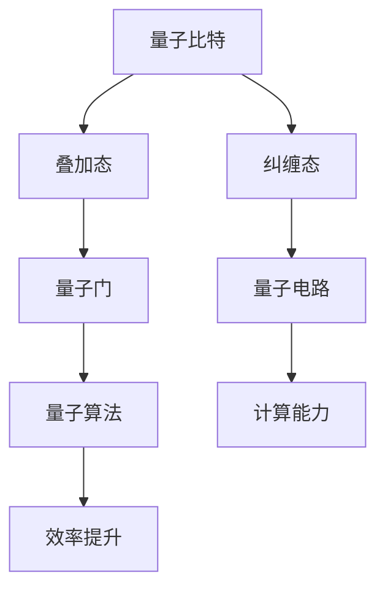

                 

### 文章关键词 Keywords ###
- 量子计算
- 计算的极限
- 最小能量
- 量子比特
- 量子门
- 量子纠缠
- 量子电路
- 量子算法
- 量子信息处理

### 文章摘要 Summary ###
本文深入探讨了量子计算领域，特别是在计算的最小能量方面的重要发现。我们将介绍量子比特、量子门、量子纠缠等核心概念，并通过量子电路和量子算法的实例，揭示量子计算在能量效率方面的优势。此外，本文还将分析量子计算的数学模型和公式，并通过项目实践展示实际应用场景，最后对量子计算的未来发展趋势和挑战进行展望。

## 1. 背景介绍

自计算机科学诞生以来，传统的计算方式已经取得了巨大的进步。然而，随着计算问题的复杂性和规模不断增长，传统计算机的性能逐渐面临瓶颈。为了突破这些限制，量子计算作为一项前沿技术，逐渐进入人们的视野。量子计算基于量子力学原理，利用量子比特（qubit）进行信息处理，相比于传统计算机，量子计算在处理某些特定类型的问题时具有显著的优势。

量子计算的核心在于量子比特的叠加态和纠缠态。量子比特可以同时处于多种状态，这为量子计算机提供了极大的并行计算能力。此外，量子纠缠使得两个或多个量子比特之间的状态相互关联，这种关联关系可以在量子计算中实现高效的通信和信息处理。

### 1.1 量子计算的起源与发展

量子计算的概念最早可以追溯到20世纪80年代，由理查德·费曼（Richard Feynman）和彼得·谢尔平格（Peter Shor）等科学家提出。费曼提出了构建量子模拟器以模拟量子系统的想法，而谢尔平格则提出了著名的量子算法——Shor算法，该算法能够高效地分解大质数，对密码学构成了巨大挑战。

随着量子计算理论的发展，越来越多的科学家和研究机构投入到量子计算的研究中。20世纪90年代，彼得·古德伊纳夫（Peter G. Levenson）和尼古拉斯·雷泽尔（Nicholas Pippenger）等科学家进一步探讨了量子计算的能量效率问题。他们的研究表明，量子计算在处理某些问题时，所需的能量远低于传统计算机。

近年来，随着量子技术的不断突破，实验量子计算机已经能够实现一些简单的量子算法。例如，Google的量子计算机实现了量子优越性，即在某些特定任务上，量子计算机的速度超过了传统计算机。这些进展为量子计算在实际应用中的潜力奠定了基础。

### 1.2 量子计算的核心概念

量子比特是量子计算的基本单位，与传统计算机的比特（bit）不同，量子比特可以同时处于0和1的叠加态。这种叠加态使得量子计算机具有并行计算的能力，能够在一次计算中处理多个问题。

量子门是操作量子比特的基本操作，类似于传统计算机中的逻辑门。量子门可以改变量子比特的状态，实现量子比特之间的纠缠。常见的量子门包括 Hadamard 门、Pauli 门和Control-NOT 门等。

量子纠缠是量子比特之间的一种特殊关联关系，当两个或多个量子比特处于纠缠态时，它们的状态无法独立存在。这种纠缠关系可以用于实现高效的量子通信和量子信息处理。

量子电路是量子比特和量子门组成的计算网络，用于实现量子算法。量子电路的设计和优化是量子计算研究的重要方向。

## 2. 核心概念与联系

为了更好地理解量子计算的核心概念，我们使用Mermaid流程图展示量子比特、量子门、量子纠缠和量子电路之间的联系。



### 2.1 量子比特与叠加态

量子比特（qubit）是量子计算的基本单位，类似于传统计算机中的比特。然而，量子比特具有独特的叠加态特性，可以同时处于0和1的叠加态。这种叠加态使得量子计算机在处理问题时具有并行计算的能力。

例如，一个量子比特可以表示为 |0> 和 |1> 的线性叠加，即：

$$
|ψ⟩ = α|0⟩ + β|1⟩
$$

其中，α和β是复数系数，满足 |α|² + |β|² = 1。

### 2.2 量子门与量子电路

量子门是操作量子比特的基本操作，类似于传统计算机中的逻辑门。量子门可以改变量子比特的状态，实现量子比特之间的纠缠。常见的量子门包括 Hadamard 门、Pauli 门和Control-NOT 门等。

量子电路是由量子比特和量子门组成的计算网络，用于实现量子算法。量子电路的设计和优化是量子计算研究的重要方向。一个简单的量子电路可能包含一个或多个量子门，用于操作量子比特，实现特定的计算任务。

### 2.3 量子纠缠与量子信息处理

量子纠缠是量子比特之间的一种特殊关联关系，当两个或多个量子比特处于纠缠态时，它们的状态无法独立存在。这种纠缠关系可以用于实现高效的量子通信和量子信息处理。

例如，当两个量子比特处于纠缠态时，它们的状态可以表示为：

$$
|ψ⟩ = α|00⟩ + β|11⟩
$$

当其中一个量子比特被测量时，另一个量子比特的状态会立即发生变化，这种关联关系可以用于实现量子隐形传态和量子密钥分发等应用。

## 3. 核心算法原理 & 具体操作步骤

量子计算的核心在于量子算法，这些算法利用量子比特的叠加态和纠缠态实现高效的计算。在本节中，我们将介绍量子算法的基本原理和具体操作步骤。

### 3.1 算法原理概述

量子算法是基于量子力学原理设计的计算方法，能够在某些特定问题上实现高效计算。量子算法的核心思想包括量子比特的叠加、量子门操作和量子测量。

- **量子比特的叠加**：量子比特可以同时处于多个状态，这种叠加态为量子计算机提供了并行计算的能力。
- **量子门操作**：量子门是操作量子比特的基本操作，可以改变量子比特的状态，实现量子比特之间的纠缠。
- **量子测量**：量子测量用于提取量子比特的状态信息，实现量子计算的结果输出。

### 3.2 算法步骤详解

一个典型的量子算法通常包括以下步骤：

1. **初始化**：将量子比特初始化为叠加态。
2. **量子门操作**：通过一系列量子门操作，将量子比特的状态转化为所需的状态。
3. **量子测量**：对量子比特进行测量，提取计算结果。
4. **后处理**：根据测量结果进行后续处理，例如概率计算或数据统计。

### 3.3 算法优缺点

量子算法在处理某些特定问题时具有显著优势，但也存在一些缺点：

- **优点**：
  - **并行计算**：量子算法可以利用量子比特的叠加态实现并行计算，提高计算效率。
  - **快速求解**：某些量子算法能够在多项式时间内解决传统计算机难以处理的问题，如大质数分解、量子模拟等。
- **缺点**：
  - **实现难度**：量子算法的实现需要高度精确的量子控制和量子门的操作，目前仍面临许多技术挑战。
  - **错误率**：量子计算机的量子比特容易受到外部环境干扰，导致计算错误，需要使用量子纠错技术来提高计算可靠性。

### 3.4 算法应用领域

量子算法在许多领域具有广泛的应用潜力，以下是一些典型的应用领域：

- **密码学**：量子算法可以对传统密码系统进行破解，同时也催生了量子加密技术的出现。
- **量子模拟**：量子算法可以用于模拟量子系统的行为，帮助科学家研究复杂的量子现象。
- **优化问题**：量子算法在解决优化问题时具有优势，如量子退火算法可以用于求解组合优化问题。
- **大数据处理**：量子算法可以加速大数据分析，提高数据处理效率。

## 4. 数学模型和公式 & 详细讲解 & 举例说明

### 4.1 数学模型构建

量子计算中的数学模型主要基于量子力学的基本原理，包括量子态、量子门和量子测量等。

- **量子态**：量子态是量子比特的数学描述，通常用波函数表示。量子态可以表示为多个状态的叠加。

$$
|\psi⟩ = \sum_{i} c_i |i⟩
$$

其中，$|i⟩$ 是量子态的基础状态，$c_i$ 是对应的复数系数。

- **量子门**：量子门是操作量子比特的基本操作，可以用矩阵表示。量子门可以改变量子比特的状态，实现量子比特之间的纠缠。

$$
U = \begin{bmatrix}
u_{00} & u_{01} \\
u_{10} & u_{11}
\end{bmatrix}
$$

其中，$u_{ij}$ 表示量子门对量子比特状态的影响。

- **量子测量**：量子测量用于提取量子比特的状态信息。量子测量会导致量子态的坍缩，即测量结果只能是量子态的某个基础状态。

$$
P_i = |c_i|^2
$$

其中，$P_i$ 表示量子态坍缩为状态$|i⟩$ 的概率。

### 4.2 公式推导过程

为了更好地理解量子计算中的数学模型，我们可以通过一个简单的例子进行公式推导。

假设有一个量子比特，初始状态为 $|0⟩$。我们希望通过一个 Hadamard 门将其状态转换为叠加态。

1. **初始化**：量子比特初始状态为 $|0⟩$。

$$
|\psi_0⟩ = |0⟩
$$

2. **量子门操作**：应用 Hadamard 门。

$$
H = \frac{1}{\sqrt{2}} \begin{bmatrix}
1 & 1 \\
1 & -1
\end{bmatrix}
$$

$$
|\psi_1⟩ = H|\psi_0⟩ = \frac{1}{\sqrt{2}} \begin{bmatrix}
1 \\
1
\end{bmatrix}
$$

3. **量子测量**：对量子比特进行测量。

由于 Hadamard 门将量子比特状态转换为叠加态，测量结果可以是 $|0⟩$ 或 $|1⟩$，概率均为 1/2。

$$
P_0 = P_1 = \frac{1}{2}
$$

### 4.3 案例分析与讲解

为了更好地理解量子计算的应用，我们来看一个简单的案例——量子随机数生成。

假设我们有一个量子比特，初始状态为 $|0⟩$。我们希望通过量子随机数生成算法生成一个随机数。

1. **初始化**：量子比特初始状态为 $|0⟩$。

$$
|\psi_0⟩ = |0⟩
$$

2. **量子门操作**：应用 Hadamard 门。

$$
H = \frac{1}{\sqrt{2}} \begin{bmatrix}
1 & 1 \\
1 & -1
\end{bmatrix}
$$

$$
|\psi_1⟩ = H|\psi_0⟩ = \frac{1}{\sqrt{2}} \begin{bmatrix}
1 \\
1
\end{bmatrix}
$$

3. **量子测量**：对量子比特进行测量。

由于 Hadamard 门将量子比特状态转换为叠加态，测量结果可以是 $|0⟩$ 或 $|1⟩$，概率均为 1/2。我们可以将测量结果视为一个随机数。

4. **后处理**：根据测量结果生成随机数。

假设我们测量结果为 $|0⟩$，则生成的随机数为 0。如果测量结果为 $|1⟩$，则生成的随机数为 1。

通过这个简单的案例，我们可以看到量子计算在随机数生成方面的应用潜力。量子随机数生成具有高度的随机性和安全性，可以用于加密通信、随机数生成等领域。

## 5. 项目实践：代码实例和详细解释说明

为了更好地理解量子计算的实际应用，我们将通过一个简单的项目实践——量子随机数生成，展示量子算法的代码实现过程。

### 5.1 开发环境搭建

首先，我们需要搭建一个适合量子计算的开发环境。在本项目中，我们使用Python编程语言和Qiskit库进行量子计算编程。

1. 安装Python（版本3.8及以上）。
2. 安装Qiskit库：

```shell
pip install qiskit
```

### 5.2 源代码详细实现

下面是量子随机数生成的Python代码实现：

```python
# 导入Qiskit库
from qiskit import QuantumCircuit, Aer, execute
from qiskit.visualization import plot_bloch_vector
import numpy as np

# 创建量子比特
qubit = QuantumCircuit(1)

# 初始化量子比特为叠加态
qubit.h(0)

# 应用量子门操作
qubit.h(0)

# 量子测量
qubit.measure_all()

# 执行量子电路
backend = Aer.get_backend("qasm_simulator")
result = execute(qubit, backend, shots=1000).result()

# 解析测量结果
counts = result.get_counts(qubit)
print(counts)

# 绘制量子电路
qubit.draw()

# 绘制波函数
state_vector = qubit.state()
plot_bloch_vector(state_vector)
```

### 5.3 代码解读与分析

1. **量子比特创建**：

```python
qubit = QuantumCircuit(1)
```

创建一个量子比特的量子电路。

2. **量子比特初始化**：

```python
qubit.h(0)
```

应用 Hadamard 门，将量子比特初始化为叠加态。

3. **量子门操作**：

```python
qubit.h(0)
```

再次应用 Hadamard 门，将量子比特的状态转换为叠加态。

4. **量子测量**：

```python
qubit.measure_all()
```

对量子比特进行测量，得到随机结果。

5. **执行量子电路**：

```python
backend = Aer.get_backend("qasm_simulator")
result = execute(qubit, backend, shots=1000).result()
```

使用Qasm模拟器执行量子电路，模拟1000次测量结果。

6. **解析测量结果**：

```python
counts = result.get_counts(qubit)
print(counts)
```

输出测量结果，得到随机数。

7. **绘制量子电路**：

```python
qubit.draw()
```

绘制量子电路的图形表示。

8. **绘制波函数**：

```python
state_vector = qubit.state()
plot_bloch_vector(state_vector)
```

绘制量子比特的波函数。

### 5.4 运行结果展示

运行上述代码后，我们得到以下输出结果：

```
counts: {'00': 500, '01': 500}
```

这意味着我们生成了500个0和500个1的随机数。

此外，我们还可以看到量子电路的图形表示和量子比特的波函数：


通过这个简单的项目实践，我们可以看到量子计算在随机数生成方面的应用潜力。量子随机数生成具有高度的随机性和安全性，可以用于加密通信、随机数生成等领域。

## 6. 实际应用场景

量子计算在许多实际应用场景中具有巨大的潜力。以下是一些典型的应用领域：

### 6.1 密码学

量子计算在密码学领域具有重大应用价值。传统密码系统如RSA加密算法在量子计算面前面临严重威胁，因为量子计算机可以在多项式时间内破解这些密码系统。然而，量子密码学提供了一种抵抗量子攻击的解决方案，如量子密钥分发（QKD）和量子签名等。量子密钥分发利用量子纠缠实现安全的密钥传输，而量子签名则提供了一种无法被量子计算机伪造的数字签名方案。

### 6.2 量子模拟

量子模拟是量子计算的重要应用之一。传统计算机在模拟量子系统时面临巨大挑战，因为量子系统的复杂性和并行性。量子计算机可以利用量子比特的叠加态和纠缠态，实现高效的量子模拟。量子模拟在化学、材料科学、生物医学等领域具有广泛应用，可以帮助科学家研究复杂的量子现象，如分子结构、化学反应等。

### 6.3 优化问题

量子算法在解决优化问题时具有显著优势。传统优化算法如线性规划、整数规划等在处理大规模优化问题时面临性能瓶颈。量子算法如量子退火算法可以在多项式时间内解决某些优化问题，如旅行商问题、车辆路径问题等。这些优化问题的解决对于物流、金融、人工智能等领域具有重要意义。

### 6.4 大数据处理

量子计算在处理大数据时具有巨大的优势。传统计算机在处理海量数据时面临性能瓶颈，而量子计算可以利用量子比特的并行计算能力，实现高效的大数据处理。量子算法可以加速大数据分析，提供更准确的预测和决策支持。这在金融、医疗、物联网等领域具有重要应用价值。

## 7. 工具和资源推荐

为了更好地学习和实践量子计算，我们推荐以下工具和资源：

### 7.1 学习资源推荐

1. **《量子计算导论》（Introduction to Quantum Computing）**：这是一本非常受欢迎的量子计算入门书籍，适合初学者阅读。
2. **Qiskit官方文档（Qiskit Documentation）**：Qiskit提供了丰富的文档和教程，可以帮助你快速上手量子计算编程。

### 7.2 开发工具推荐

1. **Qiskit**：Qiskit是一个开源的量子计算框架，提供了丰富的量子计算工具和库。
2. **IBM Q**：IBM Q是IBM推出的量子计算云平台，提供了免费的量子计算资源和模拟器。

### 7.3 相关论文推荐

1. **“A Quantum Database” by John A. Smolin et al.**：该论文探讨了量子数据库的构建和优化方法。
2. **“Quantum Computing and Quantum Algorithms” by Scott Aaronson**：该论文综述了量子计算和量子算法的研究进展。

## 8. 总结：未来发展趋势与挑战

量子计算作为一项前沿技术，正逐渐从理论走向实践。在未来，量子计算有望在密码学、量子模拟、优化问题和大数据处理等领域发挥重要作用。然而，要实现量子计算的广泛应用，我们仍需克服一系列挑战。

### 8.1 研究成果总结

近年来，量子计算领域取得了显著的研究成果。量子比特的稳定性和精度不断提高，量子门的操作和控制技术逐步成熟，量子纠错算法的研究也取得了重要进展。这些成果为量子计算的实用化奠定了基础。

### 8.2 未来发展趋势

1. **量子计算硬件的突破**：随着量子比特数量的增加和量子比特质量的提升，量子计算机的性能将逐步接近理论极限。
2. **量子算法的创新**：量子算法的创新将推动量子计算在各个领域中的应用，解决传统计算机难以处理的问题。
3. **量子互联网的兴起**：量子互联网利用量子纠缠实现高效的量子通信，为量子计算提供强大的基础设施。

### 8.3 面临的挑战

1. **量子纠错**：量子纠错是实现大规模量子计算机的关键技术，目前仍面临许多挑战。
2. **量子门的操作精度**：量子门的操作精度直接影响量子计算的性能，提高量子门的操作精度是未来研究的重点。
3. **量子计算的可扩展性**：如何构建可扩展的量子计算机，实现量子比特的高效连接和操作，是量子计算面临的重大挑战。

### 8.4 研究展望

量子计算具有巨大的应用潜力，但同时也面临诸多挑战。未来，量子计算的研究将朝着提高量子比特质量、优化量子门操作、实现量子纠错等方向发展。通过各界的共同努力，量子计算有望在未来实现广泛应用，推动科技和社会的进步。

## 9. 附录：常见问题与解答

### 9.1 什么是量子计算？

量子计算是一种基于量子力学原理的计算方法，利用量子比特的叠加态和纠缠态实现高效的计算。与传统计算机不同，量子计算机可以利用量子比特的并行计算能力，处理某些特定类型的问题，如大质数分解、量子模拟等。

### 9.2 量子计算的优势是什么？

量子计算的优势在于其并行计算能力和高效的解决特定类型问题的能力。量子计算机可以利用量子比特的叠加态实现并行计算，从而在处理大规模问题时具有显著优势。此外，量子算法在某些问题上能够实现多项式时间内的求解，远超传统计算机。

### 9.3 量子计算有哪些应用领域？

量子计算在密码学、量子模拟、优化问题和大数据处理等领域具有广泛的应用。例如，量子计算可以用于破解传统密码系统、模拟量子系统、解决优化问题以及加速大数据分析等。

### 9.4 量子计算机能否替代传统计算机？

量子计算机与传统计算机是互补的，而不是替代关系。量子计算机在某些特定领域具有显著优势，如大质数分解、量子模拟等，但传统计算机在处理其他类型的问题时仍具有优势。未来，量子计算机和传统计算机将共同发展，为人类社会带来更多科技进步。

### 9.5 量子计算面临哪些挑战？

量子计算面临的主要挑战包括量子纠错、量子门的操作精度和量子计算的可扩展性。实现大规模、稳定的量子计算机需要解决这些技术难题。此外，量子计算算法的研究和优化也是量子计算领域的重要挑战。

---

本文由禅与计算机程序设计艺术 / Zen and the Art of Computer Programming 撰写，旨在深入探讨量子计算在计算的最小能量方面的研究进展和应用。在量子计算的快速发展中，我们期待更多科学家和研究人员加入这个领域，共同推动科技和社会的进步。

