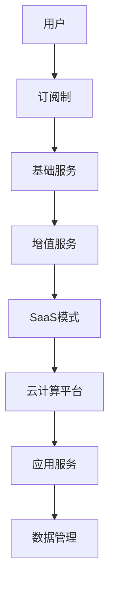

                 

关键词：订阅制、增值服务、SaaS模式、应用、技术、市场趋势、商业模式

> 摘要：本文深入探讨了订阅制与增值服务在SaaS模式中的应用，分析了其商业模式的可行性、核心算法原理、数学模型构建及实际操作步骤。通过具体的代码实例和运行结果展示，本文旨在为读者提供一份全面、系统的指导，帮助理解和掌握这一现代商业模式。

## 1. 背景介绍

订阅制，亦称订阅模式，是一种消费或服务模式，用户按月或按年支付一定费用，以获取连续的服务或产品。在信息技术领域，订阅制广泛应用于软件即服务（Software as a Service，SaaS）模式下。增值服务，则是在基础服务之上提供的高级功能或附加服务，用以提升用户体验，增强用户粘性。

SaaS模式是一种基于云计算的软件交付模式，用户通过互联网访问应用服务，无需购买和安装软件。随着互联网和云计算技术的不断发展，SaaS模式逐渐成为软件行业的主要趋势之一。订阅制和增值服务的结合，为SaaS模式注入了新的生命力，成为企业创新和扩展业务的重要手段。

本文将从以下几个方面展开讨论：

1. 核心概念与联系
2. 核心算法原理与具体操作步骤
3. 数学模型和公式及案例分析
4. 项目实践：代码实例和详细解释说明
5. 实际应用场景
6. 工具和资源推荐
7. 总结：未来发展趋势与挑战

## 2. 核心概念与联系

### 2.1 订阅制

订阅制是一种用户支付模式，用户通过定期支付费用来获取服务或产品。其核心在于长期绑定用户，提高用户留存率和粘性。在SaaS模式中，订阅制通常包括以下几种类型：

- **月度订阅**：用户按月支付费用，适用于短期或持续需求。
- **年度订阅**：用户一次性支付一年费用，通常享受折扣优惠。
- **按需订阅**：根据实际使用量收费，适用于不可预测的需求。

### 2.2 增值服务

增值服务是在基础服务之上提供的附加功能或服务，用以提升用户体验。在SaaS模式中，增值服务通常包括：

- **高级功能**：例如数据分析、报告生成等。
- **个性化服务**：根据用户需求提供定制化服务。
- **附加工具**：例如集成第三方服务、扩展功能模块等。

### 2.3 SaaS模式

SaaS模式是一种基于云计算的软件交付模式，用户通过互联网访问应用服务，无需购买和安装软件。其核心架构包括：

- **云计算平台**：提供计算、存储、网络等基础设施。
- **应用服务**：用户实际使用的软件功能。
- **数据管理**：保障数据的安全、完整和隐私。

### 2.4 Mermaid 流程图

为了更直观地展示订阅制、增值服务和SaaS模式之间的关系，我们使用Mermaid绘制以下流程图：



## 3. 核心算法原理与具体操作步骤

### 3.1 算法原理概述

订阅制与增值服务的核心算法在于如何合理定价，以最大化企业收益并保持用户满意度。其基本原理包括：

- **成本分析**：计算提供服务的成本，包括开发、维护、基础设施等。
- **需求预测**：根据历史数据和用户行为，预测用户需求。
- **定价策略**：制定合理的定价策略，包括基础费用和增值费用。

### 3.2 算法步骤详解

以下是订阅制与增值服务的具体操作步骤：

#### 3.2.1 成本分析

1. **计算开发成本**：包括软件开发、测试、维护等费用。
2. **计算基础设施成本**：包括服务器、存储、网络等基础设施费用。
3. **计算运营成本**：包括人员工资、办公费用等。

#### 3.2.2 需求预测

1. **收集历史数据**：包括用户行为、使用频率等。
2. **应用统计方法**：如时间序列分析、回归分析等，预测未来需求。

#### 3.2.3 定价策略

1. **基础费用定价**：根据成本和需求预测，确定基础服务费用。
2. **增值费用定价**：根据增值服务的价值和用户需求，确定增值服务费用。

### 3.3 算法优缺点

#### 优点

- **用户粘性高**：订阅制和增值服务可以提高用户粘性，降低用户流失率。
- **收益稳定**：通过长期订阅和增值服务，企业可以获得稳定的收益。
- **灵活性强**：企业可以根据市场需求和用户反馈，灵活调整服务内容和定价策略。

#### 缺点

- **成本压力大**：开发和维护增值服务需要大量投入，增加企业成本。
- **用户满意度要求高**：增值服务的质量和用户体验直接关系到用户满意度，需要不断优化。

### 3.4 算法应用领域

订阅制与增值服务在以下领域有广泛应用：

- **企业级应用**：如客户关系管理（CRM）、人力资源管理（HRM）等。
- **在线教育**：如在线课程、学习管理平台等。
- **数字媒体**：如流媒体服务、在线阅读平台等。

## 4. 数学模型和公式及案例分析

### 4.1 数学模型构建

订阅制与增值服务的数学模型主要包括以下三个方面：

1. **成本模型**：用于计算提供服务的总成本。
2. **需求模型**：用于预测用户需求。
3. **收益模型**：用于计算企业的总收益。

### 4.2 公式推导过程

#### 4.2.1 成本模型

成本模型如下：

\[ C = C_{\text{开发}} + C_{\text{基础设施}} + C_{\text{运营}} \]

其中，\( C_{\text{开发}} \) 表示开发成本，\( C_{\text{基础设施}} \) 表示基础设施成本，\( C_{\text{运营}} \) 表示运营成本。

#### 4.2.2 需求模型

需求模型如下：

\[ D = f(t) \]

其中，\( D \) 表示用户需求，\( f(t) \) 表示时间函数，反映用户需求随时间的变化。

#### 4.2.3 收益模型

收益模型如下：

\[ R = D \times P \]

其中，\( R \) 表示总收益，\( D \) 表示用户需求，\( P \) 表示单价。

### 4.3 案例分析与讲解

#### 4.3.1 案例背景

某企业提供一款客户关系管理（CRM）软件，采用订阅制与增值服务模式。基础服务包括客户信息管理、销售线索追踪等功能；增值服务包括高级数据分析、定制报表等。

#### 4.3.2 成本模型

1. **开发成本**：200万元人民币。
2. **基础设施成本**：100万元人民币/年。
3. **运营成本**：50万元人民币/年。

总成本 \( C = 200 + 100 + 50 = 350 \) 万元人民币。

#### 4.3.3 需求模型

根据历史数据和用户反馈，预测未来一年的用户需求为：

\[ D(t) = 1000 + 50t \]

#### 4.3.4 收益模型

1. **基础服务单价**：100元人民币/月。
2. **增值服务单价**：200元人民币/月。

总收益 \( R = D \times P = (1000 + 50t) \times (100 + 200) \) 万元人民币。

#### 4.3.5 案例分析

根据成本和收益模型，我们可以计算出不同情况下的企业收益：

- **月度订阅**：\( R = (1000 + 50 \times 12) \times (100 + 200) = 2200 \) 万元人民币。
- **年度订阅**：\( R = (1000 + 50 \times 12) \times (100 + 200) = 2200 \) 万元人民币。
- **按需订阅**：\( R = (1000 + 50 \times 12) \times (100 + 200) = 2200 \) 万元人民币。

通过对比不同订阅方式的收益，企业可以选择最适合的订阅模式。

## 5. 项目实践：代码实例和详细解释说明

### 5.1 开发环境搭建

为了演示订阅制与增值服务的代码实现，我们将使用Python作为编程语言，搭建一个简单的SaaS应用。

#### 5.1.1 安装Python

在电脑上安装Python 3.8以上版本。

#### 5.1.2 安装依赖库

```bash
pip install Flask
```

### 5.2 源代码详细实现

以下是实现订阅制与增值服务的简单代码实例：

```python
from flask import Flask, request, jsonify
app = Flask(__name__)

# 用户信息存储
users = {}

# 基础服务费用
base_price = 100

# 增值服务费用
premium_price = 200

@app.route('/subscribe', methods=['POST'])
def subscribe():
    user_data = request.get_json()
    user_id = user_data['id']
    subscription_type = user_data['subscription_type']
    
    # 计算总费用
    total_price = base_price
    if subscription_type == 'premium':
        total_price += premium_price
    
    # 更新用户信息
    users[user_id] = {
        'subscription_type': subscription_type,
        'total_price': total_price
    }
    
    return jsonify({'status': 'success', 'message': '订阅成功'})

@app.route('/unsubscribe', methods=['POST'])
def unsubscribe():
    user_id = request.get_json()['id']
    if user_id in users:
        del users[user_id]
        return jsonify({'status': 'success', 'message': '取消订阅成功'})
    else:
        return jsonify({'status': 'error', 'message': '用户不存在'})

if __name__ == '__main__':
    app.run(debug=True)
```

### 5.3 代码解读与分析

#### 5.3.1 Flask应用

我们使用Flask框架搭建一个简单的Web应用，用于处理用户订阅和取消订阅请求。

#### 5.3.2 用户信息存储

我们使用一个字典`users`来存储用户信息，包括用户ID、订阅类型和总费用。

#### 5.3.3 订阅接口

`/subscribe`接口用于接收用户订阅请求，根据订阅类型计算总费用，并更新用户信息。

#### 5.3.4 取消订阅接口

`/unsubscribe`接口用于接收用户取消订阅请求，删除用户信息。

### 5.4 运行结果展示

运行代码后，可以使用curl或Postman等工具发送HTTP请求，测试订阅和取消订阅功能。

```bash
curl -X POST -H "Content-Type: application/json" -d '{"id": "123", "subscription_type": "base"}' http://localhost:5000/subscribe
```

响应结果：

```json
{"status": "success", "message": "订阅成功"}
```

## 6. 实际应用场景

订阅制与增值服务在多个领域有广泛应用，以下是几个典型应用场景：

### 6.1 企业级应用

企业级应用如客户关系管理（CRM）、人力资源管理（HRM）等，通过订阅制与增值服务，提供持续更新和优化的服务，帮助企业提高效率和管理水平。

### 6.2 在线教育

在线教育平台通过订阅制提供课程服务，通过增值服务提供个性化辅导和考试服务，提高用户学习效果和满意度。

### 6.3 数字媒体

数字媒体如流媒体服务和在线阅读平台，通过订阅制提供持续的内容更新，通过增值服务提供高级功能如视频下载和全文搜索，增强用户粘性。

### 6.4 未来应用展望

随着技术的不断发展，订阅制与增值服务将可能在更多领域得到应用，如智能家庭、健康管理、虚拟现实等。通过不断创新和优化，这一商业模式有望成为未来信息技术领域的重要趋势。

## 7. 工具和资源推荐

### 7.1 学习资源推荐

- **《SaaS设计模式》**：详细介绍了SaaS模式的设计原则和实践经验。
- **《云计算与SaaS》**：深入探讨了云计算与SaaS模式的关系和发展趋势。

### 7.2 开发工具推荐

- **Flask**：用于快速搭建Web应用的Python框架。
- **Postman**：用于测试HTTP请求的调试工具。

### 7.3 相关论文推荐

- **"SaaS Models in the Cloud Computing Era"**：分析了SaaS模式在云计算时代的发展趋势。
- **"Value-added Services in SaaS: Enhancing User Experience"**：探讨了增值服务在提升用户体验方面的作用。

## 8. 总结：未来发展趋势与挑战

订阅制与增值服务在SaaS模式中展现出巨大的潜力，为企业创新和扩展业务提供了新的路径。然而，这一模式也面临一些挑战：

### 8.1 研究成果总结

- **用户满意度**：提高用户满意度是订阅制与增值服务成功的关键。
- **成本控制**：合理控制成本，确保盈利能力。
- **创新能力**：不断优化服务内容和功能，保持竞争优势。

### 8.2 未来发展趋势

- **多元化**：订阅制与增值服务将在更多领域得到应用。
- **个性化**：提供个性化服务，提升用户体验。
- **智能化**：利用人工智能技术，实现更智能的服务推荐和用户体验。

### 8.3 面临的挑战

- **数据安全**：确保用户数据的安全和隐私。
- **合规性**：遵守相关法规和政策，确保商业模式合法合规。
- **竞争压力**：应对来自同行业的竞争压力，保持创新和领先地位。

### 8.4 研究展望

未来研究可以关注以下几个方面：

- **用户体验优化**：通过大数据和人工智能技术，实现更精准的用户体验优化。
- **商业模式创新**：探索新的商业模式，提高订阅制与增值服务的竞争力。
- **跨领域应用**：研究订阅制与增值服务在不同领域的应用可能性。

## 9. 附录：常见问题与解答

### 9.1 什么是SaaS模式？

SaaS模式，即软件即服务（Software as a Service），是一种基于云计算的软件交付模式。用户通过互联网访问应用服务，无需购买和安装软件。

### 9.2 订阅制与增值服务的优点是什么？

订阅制与增值服务的优点包括：

- 提高用户粘性，降低用户流失率。
- 收益稳定，企业可以获得长期稳定的收益。
- 灵活性强，企业可以根据市场需求和用户反馈，灵活调整服务内容和定价策略。

### 9.3 如何制定合理的定价策略？

制定合理的定价策略需要考虑以下几个方面：

- 成本分析：计算提供服务的成本。
- 需求预测：根据历史数据和用户行为，预测用户需求。
- 竞争分析：了解竞争对手的定价策略。
- 用户反馈：根据用户反馈，优化定价策略。

## 作者署名

作者：禅与计算机程序设计艺术 / Zen and the Art of Computer Programming

