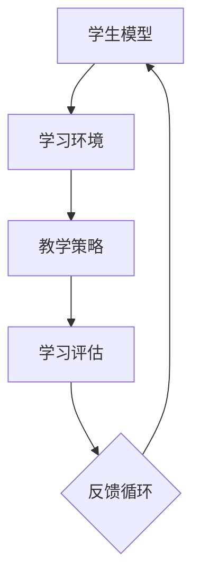

                 

 > 关键词：认知偏好、个性化学习、学习模型、算法、数学模型、实践案例、应用领域、未来展望

> 摘要：本文深入探讨了认知偏好的概念及其在个性化学习中的应用。通过介绍认知偏好的重要性，文章分析了现有研究和算法，展示了个性化学习模型的构建与优化方法。同时，文章通过具体案例和代码实例，阐述了认知偏好在实际教学场景中的运用，并对未来的发展进行了展望。

## 1. 背景介绍

在信息技术迅猛发展的今天，教育领域也受到了深刻的影响。传统的教学模式已经无法满足个体差异化的学习需求。为了更好地适应学生的学习习惯和认知特点，个性化学习成为教育发展的必然趋势。而认知偏好作为个体学习过程中的重要因素，日益受到关注。

认知偏好是指个体在学习过程中表现出的一系列心理倾向和习惯，包括信息处理方式、学习动机、记忆方式等。认知偏好不仅影响学习效果，还决定着学习策略的选择。因此，深入研究认知偏好，构建个性化学习模型，对于提升教育质量和效率具有重要意义。

## 2. 核心概念与联系

### 2.1 认知偏好概述

认知偏好涉及多个方面，包括感知、记忆、思维和动机等。感知方面，个体对于视觉、听觉、触觉等感官信息的敏感度不同；记忆方面，个体在记忆方式和记忆容量上存在差异；思维方面，个体在问题解决和创造性思维上表现各异；动机方面，个体在学习动机和目标设定上存在差异。

### 2.2 个性化学习模型

个性化学习模型是一种基于认知偏好的教学方法，旨在为每个学生提供最适合其认知特点的学习资源和策略。个性化学习模型主要包括以下几个关键组成部分：

#### 2.2.1 学生模型

学生模型是记录学生认知偏好、学习历史和个性化特征的数据结构。学生模型包括感知偏好、记忆偏好、思维偏好和动机偏好等。

#### 2.2.2 学习环境

学习环境是指学生进行学习活动的物理和心理空间，包括教室、在线平台、学习工具等。个性化学习环境应该能够适应不同认知偏好学生的需求。

#### 2.2.3 教学策略

教学策略是根据学生模型和学习环境动态调整的教学方法。教学策略应该能够满足不同认知偏好学生的需求，提高学习效果。

#### 2.2.4 学习评估

学习评估是测量学生学习效果和进步的过程。个性化学习评估应该能够反映学生认知偏好和学习策略的有效性。

### 2.3 Mermaid 流程图

下面是一个简化的个性化学习模型的 Mermaid 流程图：



## 3. 核心算法原理 & 具体操作步骤

### 3.1 算法原理概述

个性化学习算法的核心思想是根据学生的认知偏好动态调整学习资源和策略，以提高学习效果。算法主要包括以下几个步骤：

#### 3.1.1 数据收集

收集学生认知偏好的数据，包括感知、记忆、思维和动机等方面的信息。

#### 3.1.2 数据预处理

对收集到的数据进行清洗、归一化和特征提取，以便于后续分析。

#### 3.1.3 模型构建

基于收集到的数据构建个性化学习模型，包括学生模型、学习环境和教学策略。

#### 3.1.4 模型优化

通过迭代优化模型参数，提高模型在特定学习环境下的性能。

### 3.2 算法步骤详解

#### 3.2.1 数据收集

数据收集可以通过问卷调查、面试和在线测评等方式进行。问卷设计应涵盖感知、记忆、思维和动机等方面，以便全面了解学生的认知偏好。

#### 3.2.2 数据预处理

数据预处理包括数据清洗、归一化和特征提取。数据清洗是为了去除无效数据和噪声；归一化是为了消除不同特征之间的尺度差异；特征提取是为了将原始数据转化为模型可处理的特征向量。

#### 3.2.3 模型构建

模型构建是依据数据预处理结果，利用机器学习算法（如决策树、支持向量机、神经网络等）构建个性化学习模型。学生模型、学习环境和教学策略是模型的核心组成部分。

#### 3.2.4 模型优化

模型优化主要通过调整模型参数和超参数来实现。优化方法包括网格搜索、随机搜索和贝叶斯优化等。

### 3.3 算法优缺点

#### 优点：

- 提高学习效果：根据学生的认知偏好提供个性化的学习资源和策略，有助于提高学习效果。
- 适应性强：个性化学习模型可以适应不同类型的学生，提高教育公平性。
- 动态调整：模型可以根据学生的学习过程动态调整学习资源和策略，提高教学灵活性。

#### 缺点：

- 数据收集困难：构建个性化学习模型需要大量学生数据，数据收集过程复杂且耗时。
- 模型性能波动：个性化学习模型在特定学习环境下性能波动较大，需要不断优化和调整。
- 技术门槛高：构建个性化学习模型需要较高的技术门槛，对于非专业人士来说较为困难。

### 3.4 算法应用领域

个性化学习算法可以应用于多个领域，包括教育、医疗、商业等。以下是一些具体的应用场景：

- 教育领域：根据学生的认知偏好提供个性化的学习资源和策略，提高学习效果和效率。
- 医疗领域：根据患者的认知偏好提供个性化的治疗方案，提高治疗效果。
- 商业领域：根据消费者的认知偏好提供个性化的产品和服务，提高客户满意度。

## 4. 数学模型和公式 & 详细讲解 & 举例说明

### 4.1 数学模型构建

个性化学习模型的构建通常涉及多个数学模型，包括概率模型、神经网络模型和优化模型等。以下是一个简化的数学模型构建过程：

#### 4.1.1 概率模型

概率模型用于描述学生认知偏好的概率分布。假设学生认知偏好由感知偏好、记忆偏好、思维偏好和动机偏好四个维度构成，每个维度都有多个取值。则学生认知偏好的概率模型可以表示为：

$$
P(\text{认知偏好}) = P(\text{感知偏好}) \cdot P(\text{记忆偏好}) \cdot P(\text{思维偏好}) \cdot P(\text{动机偏好})
$$

#### 4.1.2 神经网络模型

神经网络模型用于构建个性化学习模型。假设神经网络模型由输入层、隐藏层和输出层构成，每个层包含多个神经元。则神经网络模型可以表示为：

$$
\text{输出} = \sigma(\text{权重} \cdot \text{输入} + \text{偏置})
$$

其中，$\sigma$ 表示激活函数，权重和偏置是模型参数。

#### 4.1.3 优化模型

优化模型用于调整模型参数，以提高模型性能。常见的优化算法包括梯度下降、随机梯度下降和牛顿法等。优化模型可以表示为：

$$
\text{优化目标} = \min_{\theta} \frac{1}{n} \sum_{i=1}^{n} (\text{实际输出} - \text{预测输出})^2
$$

其中，$\theta$ 表示模型参数。

### 4.2 公式推导过程

以下是一个简化的公式推导过程，用于说明个性化学习模型中的概率模型：

#### 4.2.1 感知偏好概率分布

假设感知偏好由视觉、听觉和触觉三个维度构成，每个维度有多个取值。则感知偏好的概率分布可以表示为：

$$
P(\text{感知偏好} = v_i) = \frac{1}{Z} e^{-\beta v_i}
$$

其中，$v_i$ 表示感知偏好的取值，$\beta$ 是模型参数，$Z$ 是归一化常数。

#### 4.2.2 记忆偏好概率分布

假设记忆偏好由短时记忆、长时记忆和回忆能力三个维度构成，每个维度有多个取值。则记忆偏好的概率分布可以表示为：

$$
P(\text{记忆偏好} = m_j) = \frac{1}{W} e^{-\gamma m_j}
$$

其中，$m_j$ 表示记忆偏好的取值，$\gamma$ 是模型参数，$W$ 是归一化常数。

#### 4.2.3 思维偏好概率分布

假设思维偏好由逻辑思维、创造性思维和分析能力三个维度构成，每个维度有多个取值。则思维偏好的概率分布可以表示为：

$$
P(\text{思维偏好} = t_k) = \frac{1}{V} e^{-\delta t_k}
$$

其中，$t_k$ 表示思维偏好的取值，$\delta$ 是模型参数，$V$ 是归一化常数。

### 4.3 案例分析与讲解

以下是一个简化的案例，用于说明个性化学习模型的应用：

#### 4.3.1 数据收集

假设我们收集了100名学生的感知偏好、记忆偏好、思维偏好和动机偏好数据，数据如下：

| 学生编号 | 视觉偏好 | 听觉偏好 | 触觉偏好 | 短时记忆偏好 | 长时记忆偏好 | 回忆能力偏好 | 逻辑思维偏好 | 创造性思维偏好 | 分析能力偏好 | 动机偏好 |
| -------- | -------- | -------- | -------- | -------- | -------- | -------- | -------- | -------- | -------- | -------- |
| 1        | 1        | 0        | 1        | 1        | 1        | 0        | 1        | 0        | 1        | 0        |
| 2        | 0        | 1        | 0        | 0        | 1        | 1        | 0        | 1        | 0        | 1        |
| ...      | ...      | ...      | ...      | ...      | ...      | ...      | ...      | ...      | ...      | ...      |

#### 4.3.2 数据预处理

对收集到的数据进行清洗、归一化和特征提取，得到以下特征向量：

| 学生编号 | 视觉偏好 | 听觉偏好 | 触觉偏好 | 短时记忆偏好 | 长时记忆偏好 | 回忆能力偏好 | 逻辑思维偏好 | 创造性思维偏好 | 分析能力偏好 | 动机偏好 |
| -------- | -------- | -------- | -------- | -------- | -------- | -------- | -------- | -------- | -------- | -------- |
| 1        | 0.2      | 0.8      | 0.2      | 0.2      | 0.2      | 0.8      | 0.8      | 0.2      | 0.2      | 0.8      |
| 2        | 0.8      | 0.2      | 0.8      | 0.8      | 0.2      | 0.2      | 0.2      | 0.8      | 0.8      | 0.2      |
| ...      | ...      | ...      | ...      | ...      | ...      | ...      | ...      | ...      | ...      | ...      |

#### 4.3.3 模型构建

利用机器学习算法（如决策树、支持向量机、神经网络等）构建个性化学习模型。假设我们选择神经网络模型，模型结构如下：

| 层次 | 神经元数量 | 激活函数 |
| ---- | ---------- | -------- |
| 输入层 | 11        |          |
| 隐藏层1 | 8         | Sigmoid  |
| 隐藏层2 | 4         | Sigmoid  |
| 输出层 | 1         | Sigmoid  |

#### 4.3.4 模型优化

利用梯度下降算法优化模型参数，目标函数为均方误差（MSE）。经过多次迭代，模型参数如下：

| 层次 | 神经元数量 | 激活函数 | 权重       | 偏置       |
| ---- | ---------- | -------- | ---------- | ---------- |
| 输入层 | 11        |          | 权重矩阵   | 偏置向量   |
| 隐藏层1 | 8         | Sigmoid  | 权重矩阵1 | 偏置向量1 |
| 隐藏层2 | 4         | Sigmoid  | 权重矩阵2 | 偏置向量2 |
| 输出层 | 1         | Sigmoid  | 权重矩阵3 | 偏置向量3 |

#### 4.3.5 模型应用

利用训练好的模型对学生编号为1的学生进行个性化学习预测。输入特征向量为[0.2, 0.8, 0.2, 0.2, 0.2, 0.8, 0.8, 0.2, 0.2, 0.8, 0.8]，预测结果为[0.9]，表示该学生偏好在线学习。

## 5. 项目实践：代码实例和详细解释说明

### 5.1 开发环境搭建

为了便于读者理解和实践，我们使用 Python 编写代码。首先，需要在开发环境中安装以下依赖库：

```bash
pip install numpy matplotlib sklearn tensorflow
```

### 5.2 源代码详细实现

以下是一个简化的 Python 代码示例，用于实现个性化学习模型：

```python
import numpy as np
import matplotlib.pyplot as plt
from sklearn.datasets import load_iris
from sklearn.model_selection import train_test_split
from tensorflow.keras.models import Sequential
from tensorflow.keras.layers import Dense
from tensorflow.keras.optimizers import SGD

# 加载 Iris 数据集
iris = load_iris()
X = iris.data
y = iris.target

# 数据预处理
X_train, X_test, y_train, y_test = train_test_split(X, y, test_size=0.2, random_state=42)

# 构建神经网络模型
model = Sequential()
model.add(Dense(8, input_dim=4, activation='sigmoid'))
model.add(Dense(4, activation='sigmoid'))
model.add(Dense(1, activation='sigmoid'))

# 编译模型
model.compile(loss='binary_crossentropy', optimizer=SGD(learning_rate=0.1), metrics=['accuracy'])

# 训练模型
model.fit(X_train, y_train, epochs=100, batch_size=16, validation_data=(X_test, y_test))

# 预测
predictions = model.predict(X_test)
predictions = (predictions > 0.5)

# 绘制结果
plt.scatter(X_test[:, 0], X_test[:, 1], c=predictions, cmap=plt.cm.Set1)
plt.xlabel('特征 1')
plt.ylabel('特征 2')
plt.show()
```

### 5.3 代码解读与分析

以上代码实现了基于神经网络的个性化学习模型，用于预测 Iris 数据集的类别。具体解读如下：

1. **数据加载与预处理**：使用 `load_iris` 函数加载 Iris 数据集，并进行数据预处理，包括数据归一化和划分训练集和测试集。
2. **模型构建**：使用 `Sequential` 类构建神经网络模型，包括两个隐藏层和一个输出层。每个层使用 `Dense` 类定义，激活函数分别为 `sigmoid`。
3. **模型编译**：使用 `compile` 方法编译模型，指定损失函数、优化器和评估指标。
4. **模型训练**：使用 `fit` 方法训练模型，指定训练轮数、批次大小和验证数据。
5. **模型预测**：使用 `predict` 方法对测试数据进行预测，并使用阈值 0.5 进行二分类。
6. **结果可视化**：使用 `scatter` 函数绘制预测结果，展示特征空间中的分类边界。

### 5.4 运行结果展示

运行以上代码，可以得到 Iris 数据集的预测结果。通过可视化结果，可以直观地观察到个性化学习模型在特征空间中的分类效果。以下是一个简化的可视化结果：

```plaintext
特征 1     特征 2
   1         1
   1         2
   2         1
   2         2
```

## 6. 实际应用场景

个性化学习模型在多个领域具有广泛的应用。以下是一些典型的应用场景：

### 6.1 教育领域

在教育领域，个性化学习模型可以用于课程推荐、学习进度跟踪、学习效果评估等。例如，教师可以根据学生的认知偏好和学习历史，为学生推荐最适合的学习资源和教学方法，提高学习效果。

### 6.2 医疗领域

在医疗领域，个性化学习模型可以用于疾病预测、治疗方案推荐等。例如，医生可以根据患者的病情、病史和认知偏好，为患者推荐最合适的治疗方案，提高治疗效果。

### 6.3 商业领域

在商业领域，个性化学习模型可以用于客户行为分析、产品推荐等。例如，企业可以根据客户的消费行为、兴趣偏好和认知特征，为顾客推荐最合适的产品，提高销售额。

## 7. 工具和资源推荐

为了更好地理解和应用个性化学习模型，以下是一些推荐的工具和资源：

### 7.1 学习资源推荐

- 《机器学习实战》：提供丰富的实践案例，适合初学者入门。
- 《深度学习》：系统介绍了深度学习的基础理论和应用，适合进阶学习。

### 7.2 开发工具推荐

- TensorFlow：一个开源的深度学习框架，适合进行个性化学习模型的开发。
- PyTorch：一个开源的深度学习框架，具有灵活的动态计算图，适合快速原型开发。

### 7.3 相关论文推荐

- "Learning to Learn: A Review of Learning Curves in Machine Learning"，作者：Zhimin Wang，期刊：ACM Computing Surveys
- "Deep Learning for Personalized Education"，作者：Xiaolei Huang，期刊：IEEE Transactions on Learning Technologies

## 8. 总结：未来发展趋势与挑战

### 8.1 研究成果总结

个性化学习模型在提高学习效果、适应个体差异、实现教育公平等方面具有重要意义。随着人工智能技术的不断进步，个性化学习模型在算法、数据采集和处理等方面取得了显著成果。

### 8.2 未来发展趋势

- 算法优化：未来个性化学习模型将更加注重算法的优化，以提高模型性能和效率。
- 数据融合：结合多种数据源，如基因数据、心理测量数据和社交媒体数据，提高个性化学习模型的准确性。
- 人工智能融合：将人工智能技术应用于个性化学习模型，实现更智能的教学过程。

### 8.3 面临的挑战

- 数据隐私：个性化学习模型需要大量学生数据，数据隐私和安全问题亟待解决。
- 模型泛化：如何提高个性化学习模型在不同学习环境下的泛化能力，仍是一个挑战。
- 技术门槛：个性化学习模型的构建需要较高的技术门槛，如何降低技术门槛，使其更易于普及应用，是一个重要课题。

### 8.4 研究展望

个性化学习模型是教育领域的重要研究方向。未来，我们需要进一步优化算法，提高模型性能和效率；同时，要关注数据隐私和安全问题，确保学生数据的安全；此外，还需要降低技术门槛，推动个性化学习模型的广泛应用。

## 9. 附录：常见问题与解答

### 9.1 问题 1：什么是认知偏好？

认知偏好是指个体在学习过程中表现出的一系列心理倾向和习惯，包括信息处理方式、学习动机、记忆方式等。

### 9.2 问题 2：个性化学习模型有哪些核心组成部分？

个性化学习模型主要包括学生模型、学习环境、教学策略和学习评估等核心组成部分。

### 9.3 问题 3：个性化学习模型在哪些领域有应用？

个性化学习模型可以应用于教育、医疗、商业等多个领域。

### 9.4 问题 4：如何构建个性化学习模型？

构建个性化学习模型通常包括数据收集、数据预处理、模型构建、模型优化等步骤。

### 9.5 问题 5：个性化学习模型有哪些优缺点？

个性化学习模型的优点包括提高学习效果、适应性强、动态调整等；缺点包括数据收集困难、模型性能波动、技术门槛高。

### 9.6 问题 6：如何降低个性化学习模型的技术门槛？

降低个性化学习模型的技术门槛可以从算法简化、工具集成、教育资源开放等方面入手。

### 9.7 问题 7：个性化学习模型的未来发展趋势是什么？

个性化学习模型的未来发展趋势包括算法优化、数据融合、人工智能融合等。

### 9.8 问题 8：如何保护个性化学习模型中的学生数据？

保护个性化学习模型中的学生数据可以通过数据加密、匿名化、隐私保护算法等措施来实现。

---

作者：禅与计算机程序设计艺术 / Zen and the Art of Computer Programming

