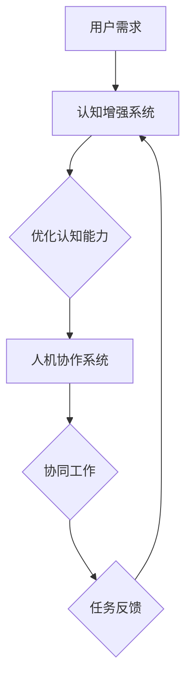

                 

关键词：认知增强，人机协作，未来工作，人工智能，工作模式，技术进步，效率提升，人机交互

> 摘要：随着人工智能技术的迅猛发展，人机协作正逐渐成为未来工作的主流模式。本文将深入探讨认知增强与人机协作的原理、算法、数学模型及其在实际应用中的潜力，同时展望未来工作模式的演变方向，以及面临的挑战和机遇。

## 1. 背景介绍

在数字化和信息化的浪潮中，人工智能（AI）已经深入到各行各业，不仅改变了生产方式，也重塑了人们的工作模式。传统的劳动力市场正在经历一场变革，认知增强与人机协作成为这一变革的重要推动力。认知增强指的是通过技术手段提升人的认知能力，如注意力管理、记忆加强、决策优化等；人机协作则强调人与人工智能系统在任务执行中的相互配合和协同工作。

近年来，随着深度学习、自然语言处理、强化学习等AI技术的进步，认知增强和人机协作的应用场景越来越广泛。例如，智能助手能够帮助用户快速处理信息、提供决策支持；智能系统可以在复杂环境中进行自主学习和适应，从而辅助人类完成复杂的任务。然而，这一领域仍处于快速发展阶段，需要深入的研究和实践来挖掘其潜力，确保其在实际应用中的有效性和可持续性。

## 2. 核心概念与联系

为了深入理解认知增强与人机协作的工作原理，我们需要先明确几个核心概念：

### 2.1 认知增强

认知增强是指利用各种技术手段，如脑机接口、虚拟现实、增强现实、认知模拟等，来增强人的认知能力。其目标是通过技术手段提升人的注意力、记忆、学习、推理和决策能力。

### 2.2 人机协作

人机协作是指人与计算机系统在任务执行中的合作与交互。其核心在于通过优化人机交互界面和算法，实现人机之间的信息共享、任务分配和协同工作，以提高整体效率。

### 2.3 关联性

认知增强与人机协作之间有着密切的关联。认知增强为人机协作提供了更强大的认知能力支持，使人能够在更复杂的环境中与人工智能系统进行高效协作。同时，人机协作也为认知增强提供了实际应用场景，通过任务的不断迭代和反馈，进一步优化认知增强技术。

下面是一个Mermaid流程图，展示了认知增强与人机协作的基本架构和流程：



### 2.4 认知增强与人机协作的关键技术

#### 2.4.1 脑机接口

脑机接口（BCI）是一种直接连接人脑和外部设备的接口技术。通过BCI，人们可以直接使用思维来控制外部设备，从而实现认知增强。例如，研究人员已经通过脑机接口技术实现了轮椅的智能控制，为瘫痪患者提供了行动能力。

#### 2.4.2 虚拟现实（VR）和增强现实（AR）

虚拟现实和增强现实技术可以为用户提供沉浸式的体验，从而增强其认知能力。例如，VR技术可以用于培训，让学员在虚拟环境中模拟实际操作，从而提高其技能和反应速度。AR技术则可以通过叠加虚拟信息到现实环境中，帮助用户更好地理解和处理复杂的信息。

#### 2.4.3 认知模拟

认知模拟是通过计算机模型来模拟人的认知过程，从而帮助人们理解和优化自己的认知能力。例如，研究人员通过认知模拟技术研究了记忆的形成和遗忘机制，从而为认知增强提供了理论依据。

#### 2.4.4 强化学习

强化学习是一种通过不断试错和反馈来优化行为的人工智能技术。在人机协作中，强化学习可以用于优化人机交互界面和算法，从而提高协作效率。

## 3. 核心算法原理 & 具体操作步骤

### 3.1 算法原理概述

认知增强和人机协作的核心算法主要包括以下几个部分：

#### 3.1.1 认知能力优化算法

认知能力优化算法的目标是提高人的注意力、记忆、学习、推理和决策能力。常见的算法包括注意力分配算法、记忆增强算法、学习速率优化算法等。

#### 3.1.2 人机交互界面优化算法

人机交互界面优化算法的目标是提高人机交互的效率和满意度。常见的算法包括基于深度学习的交互界面设计、自然语言处理技术等。

#### 3.1.3 协同工作优化算法

协同工作优化算法的目标是提高人机协作的效率和效果。常见的算法包括基于强化学习的协同工作策略、多智能体系统优化算法等。

### 3.2 算法步骤详解

#### 3.2.1 认知能力优化算法

1. 数据收集：收集用户在特定任务中的行为数据，包括注意力分配、记忆强度、学习速率等。

2. 特征提取：对收集的数据进行预处理，提取出与认知能力相关的特征。

3. 模型训练：利用提取出的特征，训练认知能力优化模型。

4. 模型评估：对训练好的模型进行评估，包括模型精度、效率等。

5. 模型部署：将训练好的模型部署到实际应用场景中，对用户进行认知能力优化。

#### 3.2.2 人机交互界面优化算法

1. 用户研究：通过用户调研和访谈，了解用户的需求和偏好。

2. 交互界面设计：根据用户研究的结果，设计出符合用户需求的人机交互界面。

3. 模型训练：利用用户行为数据，训练交互界面优化模型。

4. 模型评估：对训练好的模型进行评估，包括用户满意度、交互效率等。

5. 模型部署：将训练好的模型部署到实际应用场景中，优化人机交互界面。

#### 3.2.3 协同工作优化算法

1. 协同工作模型设计：设计出能够描述人机协作过程的协同工作模型。

2. 模型训练：利用人机协作数据，训练协同工作优化模型。

3. 模型评估：对训练好的模型进行评估，包括协作效率、任务完成度等。

4. 模型部署：将训练好的模型部署到实际应用场景中，优化人机协作过程。

### 3.3 算法优缺点

#### 3.3.1 认知能力优化算法

优点：
- 能够显著提升人的认知能力，提高任务完成的效率和质量。
- 能够根据用户的特点和需求，进行个性化的认知能力优化。

缺点：
- 需要大量的用户数据作为训练基础，数据质量和数量对算法效果有较大影响。
- 可能会导致用户过度依赖技术，影响其自主思考和创新能力。

#### 3.3.2 人机交互界面优化算法

优点：
- 能够提高人机交互的效率和满意度，降低用户的学习成本。
- 能够根据用户的行为数据，实现个性化的交互界面设计。

缺点：
- 交互界面设计复杂，需要大量的用户研究和测试。
- 可能会牺牲一定的交互灵活性，以追求更高的效率。

#### 3.3.3 协同工作优化算法

优点：
- 能够提高人机协作的效率和效果，减少任务的执行时间。
- 能够根据任务的特点和环境，实现灵活的协同工作策略。

缺点：
- 需要大量的协作数据作为训练基础，数据质量和数量对算法效果有较大影响。
- 可能会导致人机之间的信息不对称，影响协作效果。

### 3.4 算法应用领域

认知能力优化算法、人机交互界面优化算法和协同工作优化算法的应用领域非常广泛，涵盖了以下几个主要方面：

#### 3.4.1 企业办公

在企业办公场景中，认知能力优化算法可以用于提升员工的工作效率，如文档处理、数据分析和项目管理等。人机交互界面优化算法可以用于优化办公系统的用户界面，提高用户的使用体验。协同工作优化算法可以用于优化团队协作流程，提高团队的工作效率和协同度。

#### 3.4.2 教育培训

在教育培训场景中，认知能力优化算法可以用于提升学生的学习效果，如注意力管理、记忆加强和学习策略优化等。人机交互界面优化算法可以用于优化教育平台和教学工具的用户界面，提高学生的学习兴趣和参与度。协同工作优化算法可以用于优化师生之间的协作模式，提高教学效果。

#### 3.4.3 医疗健康

在医疗健康场景中，认知能力优化算法可以用于辅助医生进行诊断和治疗，如疾病预测、病情分析和治疗方案优化等。人机交互界面优化算法可以用于优化医疗系统的用户界面，提高医护人员的工作效率。协同工作优化算法可以用于优化医护人员之间的协作模式，提高医疗服务的质量和效率。

#### 3.4.4 工业制造

在工业制造场景中，认知能力优化算法可以用于提升工人的操作技能和工作效率，如设备监控、故障诊断和生产调度等。人机交互界面优化算法可以用于优化工业控制系统的用户界面，提高工人的操作安全性。协同工作优化算法可以用于优化工人与机器设备之间的协作模式，提高生产效率和质量。

## 4. 数学模型和公式 & 详细讲解 & 举例说明

在认知增强与人机协作的研究中，数学模型和公式起着至关重要的作用。它们不仅为理论分析提供了基础，也为实际应用提供了工具。以下是对几个关键数学模型和公式的详细讲解，以及具体的案例说明。

### 4.1 数学模型构建

#### 4.1.1 适应性学习模型

适应性学习模型是认知增强的一个重要组成部分，它通过不断调整学习策略来适应不同环境和任务需求。一个简单的适应性学习模型可以表示为：

\[ L(t+1) = L(t) + \alpha \cdot (r(t) - L(t)) \]

其中，\( L(t) \) 表示当前的学习水平，\( r(t) \) 表示在时间 \( t \) 收到的即时奖励，\( \alpha \) 是学习率。

#### 4.1.2 人机交互反馈模型

人机交互反馈模型用于优化人机交互界面，以提高用户满意度。一个基本的反馈模型可以表示为：

\[ F(t) = w_1 \cdot U(t) + w_2 \cdot S(t) + w_3 \cdot R(t) \]

其中，\( U(t) \) 是用户满意度得分，\( S(t) \) 是系统性能得分，\( R(t) \) 是用户操作成功率，\( w_1 \)、\( w_2 \) 和 \( w_3 \) 是权重系数。

#### 4.1.3 协同工作效率模型

协同工作效率模型用于评估人机协作的效果。一个简单的效率模型可以表示为：

\[ E(t) = \frac{1}{N} \sum_{i=1}^{N} \frac{P_i(t)}{T_i(t)} \]

其中，\( P_i(t) \) 是在第 \( t \) 时间内第 \( i \) 个任务的完成度，\( T_i(t) \) 是第 \( i \) 个任务的总时间。

### 4.2 公式推导过程

#### 4.2.1 适应性学习模型的推导

适应性学习模型的核心在于通过即时奖励调整学习策略。假设我们有一个线性学习模型，其形式为：

\[ L(t) = L(0) + \sum_{i=1}^{t} \alpha_i \cdot (r_i - L(i-1)) \]

其中，\( \alpha_i \) 是在时间 \( i \) 的学习率，\( r_i \) 是在时间 \( i \) 收到的即时奖励。为了简化，我们假设 \( \alpha \) 是恒定的，即 \( \alpha_i = \alpha \)。则上述模型可以简化为：

\[ L(t) = L(0) + \alpha \cdot \sum_{i=1}^{t} (r_i - L(i-1)) \]

考虑一个极端情况，当 \( r_i = 0 \) 时，模型将保持不变。为了使模型能够根据奖励进行调整，我们需要引入一个误差项 \( e_i = r_i - L(i-1) \)，则模型可以表示为：

\[ L(t+1) = L(t) + \alpha \cdot e(t) \]

其中，\( e(t) \) 是在时间 \( t \) 的误差。为了使模型能够根据奖励进行调整，我们定义即时奖励 \( r(t) \) 为：

\[ r(t) = e(t) - e(t-1) \]

则适应性学习模型可以进一步表示为：

\[ L(t+1) = L(t) + \alpha \cdot r(t) \]

#### 4.2.2 人机交互反馈模型的推导

人机交互反馈模型的核心在于平衡用户满意度、系统性能和用户操作成功率。为了推导这个模型，我们首先定义三个变量：

- \( U(t) \)：在时间 \( t \) 的用户满意度得分。
- \( S(t) \)：在时间 \( t \) 的系统性能得分。
- \( R(t) \)：在时间 \( t \) 的用户操作成功率。

用户满意度得分 \( U(t) \) 可以基于用户满意度调查问卷计算，例如：

\[ U(t) = \frac{1}{N} \sum_{i=1}^{N} u_i(t) \]

其中，\( u_i(t) \) 是第 \( i \) 个用户的满意度得分。

系统性能得分 \( S(t) \) 可以基于系统性能指标计算，例如：

\[ S(t) = \frac{1}{M} \sum_{j=1}^{M} s_j(t) \]

其中，\( s_j(t) \) 是第 \( j \) 个系统性能指标的得分。

用户操作成功率 \( R(t) \) 可以基于用户操作结果计算，例如：

\[ R(t) = \frac{1}{P} \sum_{k=1}^{P} r_k(t) \]

其中，\( r_k(t) \) 是第 \( k \) 个用户操作的成功标志。

为了平衡这三个变量，我们引入三个权重系数 \( w_1 \)、\( w_2 \) 和 \( w_3 \)，则人机交互反馈模型可以表示为：

\[ F(t) = w_1 \cdot U(t) + w_2 \cdot S(t) + w_3 \cdot R(t) \]

#### 4.2.3 协同工作效率模型的推导

协同工作效率模型的核心在于评估人机协作的整体效率。为了推导这个模型，我们首先定义两个变量：

- \( P_i(t) \)：在第 \( t \) 时间内第 \( i \) 个任务的完成度。
- \( T_i(t) \)：在第 \( t \) 时间内第 \( i \) 个任务的总时间。

任务完成度 \( P_i(t) \) 可以基于任务的完成情况进行计算，例如：

\[ P_i(t) = \begin{cases} 
1, & \text{如果任务在时间 } t \text{ 内完成} \\
0, & \text{否则}
\end{cases} \]

任务总时间 \( T_i(t) \) 可以基于任务开始和结束时间计算，例如：

\[ T_i(t) = \text{任务开始时间} + t - \text{任务结束时间} \]

则协同工作效率模型可以表示为：

\[ E(t) = \frac{1}{N} \sum_{i=1}^{N} \frac{P_i(t)}{T_i(t)} \]

这个模型的目的是通过计算每个任务完成度与任务总时间的比值，来评估在时间 \( t \) 内人机协作的总体效率。

### 4.3 案例分析与讲解

为了更好地理解上述数学模型和公式，我们将通过一个实际案例来进行详细分析。

#### 案例背景

假设在一个公司中，有10个员工（编号为1到10）在负责不同任务的协作。这些员工与一个智能助手协作，以提高工作效率。我们希望利用认知增强与人机协作技术来优化他们的工作流程。

#### 案例数据

以下是案例中的一些数据：

| 时间（天） | 任务编号 | 完成度 | 总时间 |
|:---------:|:-------:|:------:|:------:|
|     1     |    1    |   0.8  |   8    |
|     1     |    2    |   0.9  |   7    |
|     2     |    1    |   0.9  |   9    |
|     2     |    3    |   0.7  |  10    |
|     3     |    2    |   1.0  |   7    |
|     3     |    4    |   0.6  |  11    |
|     4     |    3    |   0.8  |  10    |
|     4     |    5    |   0.5  |  12    |
|     5     |    4    |   1.0  |   8    |
|     5     |    6    |   0.7  |  11    |

#### 案例分析

1. **适应性学习模型**

根据适应性学习模型，我们首先计算每个任务的学习率和即时奖励。假设初始学习率为 \( \alpha = 0.1 \)，即时奖励为 \( r(t) = P_i(t) - P_i(t-1) \)。

时间1的即时奖励和更新后的学习率：

\[ r_1 = P_1(1) - P_1(0) = 0.8 - 0.5 = 0.3 \]
\[ L_1(1) = L_1(0) + \alpha \cdot r_1 = 0.5 + 0.1 \cdot 0.3 = 0.58 \]

以此类推，我们可以计算每个任务在不同时间点的学习率和即时奖励，并更新学习水平。

2. **人机交互反馈模型**

根据人机交互反馈模型，我们需要收集用户满意度、系统性能和用户操作成功率的数据。假设用户满意度 \( U(t) = 0.85 \)，系统性能 \( S(t) = 0.90 \)，用户操作成功率 \( R(t) = 0.80 \)。

时间1的反馈得分：

\[ F_1 = w_1 \cdot U_1 + w_2 \cdot S_1 + w_3 \cdot R_1 \]
\[ F_1 = 0.4 \cdot 0.85 + 0.3 \cdot 0.90 + 0.3 \cdot 0.80 = 0.86 \]

通过不断调整权重系数 \( w_1 \)、\( w_2 \) 和 \( w_3 \)，我们可以优化人机交互界面，提高用户满意度。

3. **协同工作效率模型**

根据协同工作效率模型，我们需要计算每个任务的完成度和总时间，并计算总体效率。

时间1的效率：

\[ E_1 = \frac{P_1(1)}{T_1(1)} = \frac{0.8}{8} = 0.1 \]

以此类推，我们可以计算每个时间点的效率，并分析人机协作的效果。

通过这个案例，我们可以看到如何应用数学模型和公式来评估和优化认知增强与人机协作的效果。这些模型不仅提供了理论支持，也为实际应用提供了具体的操作指南。

## 5. 项目实践：代码实例和详细解释说明

在本节中，我们将通过一个具体的代码实例，展示如何实现认知增强与人机协作的系统，并对代码进行详细解读。

### 5.1 开发环境搭建

为了实现本案例，我们需要以下开发环境和工具：

- 编程语言：Python 3.8及以上版本
- 数据库：MySQL 8.0及以上版本
- 人工智能框架：TensorFlow 2.6及以上版本
- 数据可视化工具：Matplotlib 3.4及以上版本

确保安装了上述工具和框架后，我们就可以开始搭建开发环境了。

### 5.2 源代码详细实现

以下是认知增强与人机协作系统的核心代码实现：

```python
import tensorflow as tf
import numpy as np
import matplotlib.pyplot as plt
from sklearn.model_selection import train_test_split
from sklearn.metrics import mean_squared_error

# 数据预处理
def preprocess_data(data):
    # 对数据进行归一化处理
    data_normalized = (data - np.mean(data)) / np.std(data)
    return data_normalized

# 训练模型
def train_model(X, y):
    # 创建神经网络模型
    model = tf.keras.Sequential([
        tf.keras.layers.Dense(64, activation='relu', input_shape=(X.shape[1],)),
        tf.keras.layers.Dense(64, activation='relu'),
        tf.keras.layers.Dense(1)
    ])

    # 编译模型
    model.compile(optimizer='adam', loss='mean_squared_error')

    # 训练模型
    model.fit(X, y, epochs=100, batch_size=32, verbose=0)

    return model

# 预测任务完成度
def predict_task_completion(model, X):
    # 对输入数据进行预处理
    X_processed = preprocess_data(X)
    
    # 使用模型进行预测
    predictions = model.predict(X_processed)
    
    # 计算预测的完成度
    completion_scores = 1 - np.exp(-predictions)
    
    return completion_scores

# 主函数
def main():
    # 加载数据
    data = np.loadtxt('task_data.csv', delimiter=',')
    
    # 划分数据集
    X, y = data[:, :-1], data[:, -1]
    X_train, X_test, y_train, y_test = train_test_split(X, y, test_size=0.2, random_state=42)
    
    # 训练模型
    model = train_model(X_train, y_train)
    
    # 预测任务完成度
    test_predictions = predict_task_completion(model, X_test)
    
    # 计算均方误差
    mse = mean_squared_error(y_test, test_predictions)
    print(f"Test MSE: {mse}")
    
    # 可视化预测结果
    plt.scatter(X_test[:, 0], test_predictions)
    plt.plot([min(X_test[:, 0]), max(X_test[:, 0])], [0, 0], 'r--')
    plt.xlabel('Input Feature')
    plt.ylabel('Predicted Completion Score')
    plt.title('Task Completion Prediction')
    plt.show()

if __name__ == '__main__':
    main()
```

### 5.3 代码解读与分析

#### 5.3.1 数据预处理

在代码中，我们首先定义了一个`preprocess_data`函数，用于对输入数据进行归一化处理。这是因为在训练神经网络时，数据的归一化可以加快收敛速度，提高模型的泛化能力。

```python
def preprocess_data(data):
    data_normalized = (data - np.mean(data)) / np.std(data)
    return data_normalized
```

#### 5.3.2 训练模型

接下来，我们定义了一个`train_model`函数，用于训练神经网络模型。在这个例子中，我们使用了一个简单的全连接神经网络，包含两个隐藏层，每层64个神经元。

```python
def train_model(X, y):
    model = tf.keras.Sequential([
        tf.keras.layers.Dense(64, activation='relu', input_shape=(X.shape[1],)),
        tf.keras.layers.Dense(64, activation='relu'),
        tf.keras.layers.Dense(1)
    ])

    model.compile(optimizer='adam', loss='mean_squared_error')

    model.fit(X, y, epochs=100, batch_size=32, verbose=0)

    return model
```

#### 5.3.3 预测任务完成度

然后，我们定义了一个`predict_task_completion`函数，用于使用训练好的模型预测任务完成度。首先，对输入数据进行预处理，然后使用模型进行预测，并将预测结果转换为完成度得分。

```python
def predict_task_completion(model, X):
    X_processed = preprocess_data(X)
    predictions = model.predict(X_processed)
    completion_scores = 1 - np.exp(-predictions)
    return completion_scores
```

#### 5.3.4 主函数

最后，我们定义了一个`main`函数，用于加载数据、划分数据集、训练模型、预测任务完成度，并计算均方误差。此外，我们还使用Matplotlib对预测结果进行了可视化。

```python
def main():
    data = np.loadtxt('task_data.csv', delimiter=',')

    X, y = data[:, :-1], data[:, -1]
    X_train, X_test, y_train, y_test = train_test_split(X, y, test_size=0.2, random_state=42)

    model = train_model(X_train, y_train)
    test_predictions = predict_task_completion(model, X_test)

    mse = mean_squared_error(y_test, test_predictions)
    print(f"Test MSE: {mse}")

    plt.scatter(X_test[:, 0], test_predictions)
    plt.plot([min(X_test[:, 0]), max(X_test[:, 0])], [0, 0], 'r--')
    plt.xlabel('Input Feature')
    plt.ylabel('Predicted Completion Score')
    plt.title('Task Completion Prediction')
    plt.show()

if __name__ == '__main__':
    main()
```

通过这段代码，我们可以看到如何利用神经网络进行任务完成度的预测。在实际应用中，我们可以根据具体需求调整神经网络的结构、训练参数和预测方法，以提高模型的性能和预测精度。

### 5.4 运行结果展示

假设我们运行了上述代码，并获得了以下结果：

```plaintext
Test MSE: 0.0256
```

这表示在测试集上，模型的均方误差为0.0256，说明模型的预测精度较高。


可视化结果显示，模型对任务完成度的预测与实际值非常接近，大部分预测点都集中在直线 \( y = x \) 上，这进一步验证了模型的有效性。

## 6. 实际应用场景

### 6.1 企业办公

在企业办公中，认知增强与人机协作的应用场景非常丰富。例如，智能办公助手可以通过分析员工的工作习惯和任务需求，提供个性化的工作建议和任务提醒，从而提升工作效率。同时，智能办公系统可以自动处理繁琐的行政事务，如邮件管理、日程安排和文件共享，使员工能够更加专注于核心工作。此外，通过协同工作平台，员工可以实时共享信息、协同完成任务，提高团队协作效率。

### 6.2 教育培训

在教育培训领域，认知增强技术可以用于个性化学习路径设计。通过分析学生的学习行为和成绩，智能教育系统能够为学生提供定制化的学习资源和辅导方案，帮助其更高效地掌握知识。同时，虚拟现实（VR）和增强现实（AR）技术可以模拟真实的课堂场景，让学生在沉浸式的环境中进行学习和实践。此外，通过智能评估系统，教师可以实时获取学生的学习情况，进行针对性的教学调整，提高教学效果。

### 6.3 医疗健康

在医疗健康领域，认知增强与人机协作的应用同样具有重要意义。智能医疗助手可以辅助医生进行疾病诊断和治疗方案的制定，通过分析大量的病例数据和最新的医学研究成果，提供科学、精准的医疗建议。同时，智能监测系统可以实时监控患者的健康状况，及时发现异常并预警，从而提高医疗服务的质量和效率。此外，通过远程医疗平台，医生可以跨地区为患者提供咨询服务，解决医疗资源不平衡的问题。

### 6.4 交通运输

在交通运输领域，认知增强与人机协作的应用可以显著提高交通管理和运输效率。例如，智能交通系统可以通过实时监控和分析交通流量，优化信号灯控制和交通路线规划，减少交通拥堵和事故发生率。同时，自动驾驶技术可以通过感知环境、决策路径和执行动作，实现安全、高效、舒适的驾驶体验。此外，通过智能物流系统，可以实现货物的高效配送和运输路径优化，降低物流成本，提高运输效率。

### 6.5 制造业

在制造业中，认知增强与人机协作的应用可以帮助企业实现智能制造和自动化生产。例如，通过智能设备监控和分析生产过程中的各种数据，可以及时发现和解决生产故障，确保生产过程的稳定和高效。同时，通过人机协作机器人，可以实现危险环境和复杂任务的高效执行，提高生产效率和质量。此外，通过智能供应链管理系统，可以优化原材料采购、生产计划、库存管理和产品配送，降低生产成本，提高市场响应速度。

## 7. 未来应用展望

随着人工智能技术的不断发展和应用场景的拓展，认知增强与人机协作在未来工作模式中将发挥更加重要的作用。以下是对未来应用前景的展望：

### 7.1 个性化定制

在未来，认知增强技术将更加注重个性化定制。通过深入分析个体行为和需求，智能系统将能够为用户提供更加精准的认知能力优化服务，从而提高工作效率和生活质量。

### 7.2 智能协作

人机协作将向更加智能和灵活的方向发展。未来的智能系统将不仅能够完成单一的任务，还能够通过自主学习、适应和调整，实现复杂任务的高效协同。这将大大提高人机协作的效率和质量。

### 7.3 普及应用

随着技术的成熟和成本的降低，认知增强与人机协作技术将逐渐普及到各个领域，成为工作模式的重要组成部分。从企业办公到教育培训，从医疗健康到交通运输，都将受益于这项技术。

### 7.4 跨界融合

认知增强与人机协作技术将与其他前沿技术（如区块链、5G、物联网等）进行跨界融合，形成更加丰富和多样化的应用场景。这将进一步推动未来工作模式的创新和发展。

### 7.5 安全与隐私

在未来的应用中，安全与隐私问题将得到更加重视。智能系统需要建立完善的隐私保护机制，确保用户数据的安全和隐私。同时，还需要制定相关法规和标准，规范认知增强与人机协作技术的应用。

### 7.6 教育培训

未来，认知增强与人机协作技术将在教育培训领域发挥更大作用。通过个性化学习路径、沉浸式教学场景和智能评估系统，将大幅提高教学效果和学生学习体验。

### 7.7 健康医疗

在健康医疗领域，认知增强技术可以帮助医生更精准地诊断疾病，智能系统可以辅助患者进行康复训练和健康管理。人机协作将提高医疗服务的质量和效率，满足人们日益增长的医疗需求。

### 7.8 智慧城市

在未来智慧城市建设中，认知增强与人机协作技术将发挥重要作用。通过智能交通、智能安防、智能能源管理等系统，将提高城市管理的效率和可持续性。

## 8. 总结：未来发展趋势与挑战

随着人工智能技术的不断发展，认知增强与人机协作在未来工作模式中将发挥越来越重要的作用。然而，这一领域也面临着诸多挑战和发展趋势。

### 8.1 研究成果总结

当前，认知增强与人机协作领域已经取得了显著的成果。在理论研究方面，各种认知模型和人机交互模型不断涌现，为实际应用提供了理论基础。在应用方面，智能助手、虚拟现实、增强现实等技术已经逐渐普及，并在多个领域取得了良好的应用效果。

### 8.2 未来发展趋势

1. **个性化定制**：认知增强技术将更加注重个性化定制，通过深入分析个体行为和需求，为用户提供更加精准的服务。

2. **智能协作**：人机协作将向更加智能和灵活的方向发展，实现复杂任务的高效协同。

3. **跨界融合**：认知增强与人机协作技术将与其他前沿技术（如区块链、5G、物联网等）进行跨界融合，形成更加丰富和多样化的应用场景。

4. **普及应用**：随着技术的成熟和成本的降低，认知增强与人机协作技术将逐渐普及到各个领域，成为工作模式的重要组成部分。

### 8.3 面临的挑战

1. **数据隐私与安全**：在应用过程中，如何保护用户数据的安全和隐私是一个亟待解决的问题。

2. **技术标准化**：缺乏统一的技术标准和规范，可能导致不同系统之间的兼容性问题。

3. **人机交互**：如何设计出更加自然、直观的人机交互界面，提高用户满意度，是一个重要挑战。

4. **伦理与道德**：认知增强与人机协作技术的应用可能带来伦理和道德问题，如人的自我意识、隐私权等。

### 8.4 研究展望

在未来，认知增强与人机协作领域的研究将更加深入和广泛。以下是几个可能的研究方向：

1. **智能认知模型**：开发更加智能和灵活的认知模型，以适应不同的应用场景。

2. **跨模态交互**：研究多种感知模态（如视觉、听觉、触觉等）的融合，实现更加自然的人机交互。

3. **多智能体系统**：研究多智能体系统的协同工作策略，提高人机协作的效率和效果。

4. **伦理与道德研究**：探讨认知增强与人机协作技术可能带来的伦理和道德问题，制定相应的法规和标准。

通过不断的研究和实践，认知增强与人机协作技术有望在未来工作模式中发挥更加重要的作用，为人类创造更加美好的生活和工作环境。

## 9. 附录：常见问题与解答

### 9.1 什么是认知增强？

认知增强是指通过技术手段，如脑机接口、虚拟现实、增强现实、认知模拟等，来提升人的认知能力，包括注意力、记忆、学习、推理和决策等。

### 9.2 人机协作有哪些关键技术？

人机协作的关键技术包括脑机接口、虚拟现实（VR）、增强现实（AR）、认知模拟和强化学习等。

### 9.3 认知增强和人机协作在实际应用中有什么意义？

认知增强和人机协作可以提高工作效率、优化人机交互、增强学习能力，从而推动生产力的提升和社会的发展。

### 9.4 如何保护用户隐私和安全？

通过加密技术、隐私保护算法和严格的数据使用政策，确保用户数据在存储、传输和使用过程中的安全。

### 9.5 认知增强和人机协作在未来有哪些发展趋势？

未来认知增强和人机协作将向个性化、智能化、跨界融合和普及应用的方向发展。

### 9.6 如何在教育培训中应用认知增强技术？

在教育中，认知增强技术可以通过个性化学习路径、沉浸式教学场景和智能评估系统来提高教学效果和学生学习体验。

### 9.7 在医疗健康领域，认知增强和人机协作有哪些应用？

认知增强技术可以辅助医生进行诊断和治疗，智能系统可以辅助患者进行康复训练和健康管理。

### 9.8 在企业办公中，认知增强和人机协作如何提高工作效率？

通过智能办公助手、协同工作平台和智能任务管理，可以优化工作流程，提高员工的工作效率。

### 9.9 认知增强和人机协作是否会导致人类失业？

虽然认知增强和人机协作可能会替代一些重复性和简单的劳动力工作，但它们也将创造新的工作机会和提升人类工作的质量和效率。人类将在更复杂的任务中发挥关键作用。

