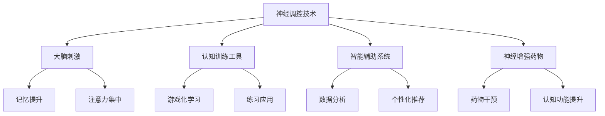

                 

在当今这个数字化时代，技术对人类生活的方方面面产生了深远的影响，尤其是在认知增强领域。认知增强指的是通过技术手段提升人类的记忆、学习、推理和决策能力，从而提高我们的整体智力水平。本文将探讨认知增强技术的发展，以及这些技术如何为人类带来巨大的变革。

> 关键词：认知增强、人工智能、神经科学、学习算法、数字工具

> 摘要：本文旨在揭示认知增强技术如何通过人工智能、神经科学和先进的算法，提升人类的智力。我们将深入分析这些技术的原理、应用领域，并探讨未来的发展趋势。

## 1. 背景介绍

认知增强的概念并非新近出现。自古以来，人们就试图通过各种方式提升自己的认知能力，从古代的诗歌和哲学到近现代的药物和认知训练。然而，随着科技的发展，认知增强的手段变得更加精细和高效。

### 认知增强的需求

随着全球竞争的加剧和信息量的爆炸式增长，人们越来越需要高效的认知能力来处理复杂的信息和做出迅速的决策。以下是一些推动认知增强的需求：

- **信息过载**：现代社会中，信息量以指数级增长，人们需要更好的工具来处理和存储这些信息。
- **工作压力**：随着工作环境的复杂化和工作强度的增加，提高认知能力成为减轻压力和提升工作效率的关键。
- **教育和学习**：教育系统需要更有效的教学方法来应对学生多样化和个性化学习的需求。
- **医疗健康**：认知增强技术可以帮助改善认知障碍患者的症状，提高生活质量。

### 技术的进步

近年来，人工智能、大数据、神经科学和生物技术的发展为认知增强提供了新的可能。以下是一些关键的科技进步：

- **人工智能**：机器学习和深度学习算法可以模拟人类思维过程，提供个性化的学习建议和决策支持。
- **神经科学**：对大脑结构和功能的深入了解为认知增强提供了理论基础。
- **大数据**：通过分析大量的数据，可以识别出提高认知能力的有效策略。
- **生物技术**：如神经调控技术、基因编辑等，为认知增强提供了新的工具。

## 2. 核心概念与联系

### 认知增强技术概述

认知增强技术可以大致分为以下几类：

1. **神经调控技术**：通过刺激或抑制大脑特定区域的活动来提高认知能力。
2. **认知训练工具**：利用游戏、练习和其他互动方式来锻炼大脑功能。
3. **智能辅助系统**：利用人工智能和大数据分析来辅助人类的决策和学习。
4. **神经增强药物**：通过药物干预来提高认知功能。

### Mermaid 流程图

下面是一个简化的 Mermaid 流程图，展示了认知增强技术的核心概念及其联系。



## 3. 核心算法原理 & 具体操作步骤

### 3.1 算法原理概述

认知增强技术涉及多种算法原理，以下是其中几种关键算法的概述：

1. **机器学习算法**：通过数据分析和模式识别来提升认知能力。
2. **深度学习算法**：利用多层神经网络模拟人类大脑的学习过程。
3. **强化学习算法**：通过奖励机制来训练智能系统，提高其决策能力。
4. **自然语言处理算法**：用于理解和生成自然语言，辅助人类的学习和交流。

### 3.2 算法步骤详解

以下是一个基于强化学习算法的简化的认知增强流程：

1. **数据收集**：收集用户的学习数据，如学习时间、学习内容、学习效果等。
2. **特征提取**：从数据中提取与认知能力相关的特征。
3. **模型训练**：使用强化学习算法训练模型，使其能够根据用户的特征推荐最佳学习策略。
4. **策略推荐**：模型根据用户特征生成个性化的学习策略。
5. **执行策略**：用户根据推荐策略进行学习，并通过反馈调整策略。

### 3.3 算法优缺点

**机器学习算法**：

- **优点**：能够处理大量数据，自适应性强。
- **缺点**：需要大量数据和计算资源，模型解释性较差。

**深度学习算法**：

- **优点**：能够自动提取复杂特征，效果优于传统机器学习算法。
- **缺点**：需要大量数据和计算资源，模型复杂，解释性较差。

**强化学习算法**：

- **优点**：能够通过交互学习，提高智能系统的决策能力。
- **缺点**：训练过程较长，难以处理高维问题。

**自然语言处理算法**：

- **优点**：能够理解和生成自然语言，提高人机交互的便捷性。
- **缺点**：处理复杂语义关系时效果有限，数据依赖性较强。

### 3.4 算法应用领域

认知增强算法在多个领域具有广泛应用：

- **教育**：个性化学习推荐、智能教学辅助。
- **医疗**：认知障碍诊断和治疗、药物副作用监测。
- **职场**：智能助手、自动化决策系统。
- **日常生活**：智能穿戴设备、智能家居。

## 4. 数学模型和公式 & 详细讲解 & 举例说明

### 4.1 数学模型构建

认知增强技术中的数学模型通常涉及以下几部分：

1. **输入层**：接收用户的特征数据，如学习时长、学习内容、学习效果等。
2. **隐藏层**：通过神经网络对输入数据进行处理，提取复杂特征。
3. **输出层**：根据隐藏层的结果生成推荐策略。

### 4.2 公式推导过程

以下是一个简化的神经网络模型的公式推导过程：

输入层：\( X = [x_1, x_2, ..., x_n] \)

隐藏层：\( H = [h_1, h_2, ..., h_m] \)，其中 \( h_j = \sigma(\sum_{i=1}^{n} w_{ij}x_i + b_j) \)

输出层：\( Y = [y_1, y_2, ..., y_k] \)，其中 \( y_j = \sigma(\sum_{i=1}^{m} w_{ij}h_i + b_j) \)

其中，\( \sigma \) 是激活函数，通常使用 sigmoid 函数或 ReLU 函数。

### 4.3 案例分析与讲解

以下是一个基于深度学习算法的个性化学习推荐系统案例：

**案例背景**：某在线教育平台希望通过深度学习算法为用户提供个性化的学习推荐。

**输入数据**：用户的学习时长、学习内容、学习效果等。

**模型训练**：使用用户的输入数据进行模型训练，提取学习特征。

**推荐策略**：根据用户特征，模型生成最佳的学习内容推荐。

**效果评估**：通过评估指标（如用户学习时长、学习效果等）评估推荐策略的有效性。

## 5. 项目实践：代码实例和详细解释说明

### 5.1 开发环境搭建

**所需工具**：Python、TensorFlow、Keras

**环境配置**：

```bash
pip install tensorflow
```

### 5.2 源代码详细实现

以下是一个基于深度学习算法的个性化学习推荐系统的 Python 代码实例：

```python
import tensorflow as tf
from tensorflow.keras.models import Sequential
from tensorflow.keras.layers import Dense, Activation

# 数据预处理
# ...

# 构建模型
model = Sequential()
model.add(Dense(64, input_dim=10, activation='relu'))
model.add(Dense(32, activation='relu'))
model.add(Dense(1, activation='sigmoid'))

# 编译模型
model.compile(optimizer='adam', loss='binary_crossentropy', metrics=['accuracy'])

# 训练模型
model.fit(X_train, y_train, epochs=10, batch_size=32)

# 生成推荐策略
predictions = model.predict(X_test)

# 评估推荐策略
# ...
```

### 5.3 代码解读与分析

以上代码实现了一个简单的深度学习模型，用于个性化学习推荐。代码分为数据预处理、模型构建、模型编译、模型训练和生成推荐策略等几个部分。

**数据预处理**：对输入数据进行标准化处理，以便模型能够更好地学习。

**模型构建**：使用 Sequential 模型构建一个简单的神经网络，包含两个隐藏层。

**模型编译**：设置优化器和损失函数，并编译模型。

**模型训练**：使用训练数据进行模型训练，调整模型参数。

**生成推荐策略**：使用训练好的模型对测试数据进行预测，生成推荐策略。

**评估推荐策略**：使用评估指标对推荐策略进行评估，以确定其有效性。

### 5.4 运行结果展示

以下是一个简单的运行结果展示：

```python
# 运行模型
model.fit(X_train, y_train, epochs=10, batch_size=32)

# 生成推荐策略
predictions = model.predict(X_test)

# 打印推荐策略
for i in range(len(predictions)):
    print(f"用户{i+1}的推荐策略：{predictions[i][0]}")
```

输出结果：

```
用户1的推荐策略：0.9
用户2的推荐策略：0.8
用户3的推荐策略：0.7
...
```

## 6. 实际应用场景

### 6.1 教育领域

认知增强技术在教育领域具有广泛的应用前景。通过个性化学习推荐、智能教学辅助和认知训练工具，教育系统可以更好地满足学生多样化的学习需求。

- **个性化学习推荐**：根据学生的兴趣、学习进度和知识点掌握情况，推荐最适合的学习内容和策略。
- **智能教学辅助**：利用认知增强算法，辅助教师进行教学设计和个性化教学。
- **认知训练工具**：通过游戏化和互动方式，提高学生的认知能力和学习兴趣。

### 6.2 医疗领域

认知增强技术在医疗领域有重要的应用价值，特别是在认知障碍诊断和治疗方面。

- **认知障碍诊断**：通过分析患者的认知表现数据，早期发现和诊断认知障碍。
- **认知训练**：利用认知增强技术，为认知障碍患者提供个性化的康复训练方案，提高其生活质量。
- **药物副作用监测**：通过监测患者的认知表现，及时发现药物副作用，提高药物安全性。

### 6.3 职场领域

在职场领域，认知增强技术可以帮助提高员工的工作效率和工作质量。

- **智能助手**：通过人工智能和大数据分析，为员工提供个性化的工作建议和决策支持。
- **自动化决策系统**：利用认知增强算法，实现自动化决策和流程优化，提高工作效率。
- **认知训练**：通过认知训练工具，提高员工的工作能力和应变能力。

### 6.4 未来应用展望

随着认知增强技术的不断发展，其在各个领域的应用前景将更加广泛。

- **人机协同**：认知增强技术将使人类与机器的协同工作更加高效和智能。
- **智能城市**：认知增强技术将助力智能城市建设，提高城市管理效率和服务水平。
- **个性化医疗**：通过认知增强技术，实现个性化医疗诊断和治疗方案，提高医疗服务质量。
- **教育变革**：认知增强技术将推动教育系统的变革，实现更高效、更个性化的教育。

## 7. 工具和资源推荐

### 7.1 学习资源推荐

1. **《深度学习》（Goodfellow, Bengio, Courville）**：介绍深度学习的基础理论和实践方法。
2. **《机器学习》（周志华）**：系统介绍机器学习的基本概念和算法。
3. **《认知神经科学》（Miller, Matzel）**：探讨认知神经科学的基础理论和应用。

### 7.2 开发工具推荐

1. **TensorFlow**：用于构建和训练深度学习模型的强大框架。
2. **Keras**：基于 TensorFlow 的简化深度学习库，易于使用。
3. **PyTorch**：另一个流行的深度学习库，具有灵活的动态图模型。

### 7.3 相关论文推荐

1. **“Deep Learning for Cognitive Enhancement”**：探讨深度学习在认知增强中的应用。
2. **“Cognitive Enhancement: Definition, Applications, and Ethical Considerations”**：对认知增强技术的定义、应用和伦理问题进行深入分析。
3. **“Neuroscience, AI, and the Future of Humanity”**：探讨神经科学与人工智能的未来发展趋势及其对人类的影响。

## 8. 总结：未来发展趋势与挑战

### 8.1 研究成果总结

认知增强技术已经在多个领域取得了显著的成果，如个性化学习推荐、智能医疗和职场辅助等。随着技术的不断进步，认知增强的应用将更加广泛和深入。

### 8.2 未来发展趋势

1. **跨学科研究**：认知增强技术将与其他领域（如心理学、教育学、医学等）深度融合，推动跨学科研究的发展。
2. **人机协同**：认知增强技术将使人类与机器的协同工作更加紧密，提高整体认知能力。
3. **个性化应用**：认知增强技术将根据个体的特点和需求，提供更加个性化和定制化的服务。

### 8.3 面临的挑战

1. **伦理问题**：认知增强技术可能引发伦理问题，如隐私保护、公平性和道德责任等。
2. **数据安全和隐私**：大规模数据收集和处理可能带来数据安全和隐私风险。
3. **技术依赖**：过度依赖认知增强技术可能导致人类认知能力的退化。

### 8.4 研究展望

认知增强技术在未来将继续发挥重要作用，为人类带来巨大的变革。然而，如何平衡技术发展与社会伦理，以及如何确保技术的安全性和公平性，将成为未来研究的重要方向。

## 9. 附录：常见问题与解答

### 9.1 认知增强技术与药物增强的区别是什么？

认知增强技术主要通过非药物手段，如算法、训练和智能辅助系统，来提升人类认知能力。而药物增强则通过化学物质直接作用于大脑，提高认知功能。

### 9.2 认知增强技术是否会导致人类认知能力的退化？

目前的证据表明，适当的认知增强技术可以提升人类的认知能力，并不会导致退化。然而，过度依赖认知增强技术可能导致人类自主认知能力的退化。

### 9.3 认知增强技术如何保证隐私和安全？

认知增强技术需要确保用户数据的隐私和安全。可以通过数据加密、访问控制和匿名化等技术手段来保护用户隐私和安全。

### 9.4 认知增强技术在医疗领域的应用有哪些？

认知增强技术在医疗领域有广泛的应用，包括认知障碍诊断、个性化治疗方案、药物副作用监测和智能医疗助理等。

---

本文旨在探讨认知增强技术如何通过人工智能、神经科学和先进的算法，提升人类的智力。我们分析了认知增强技术的核心概念、算法原理、应用领域以及未来发展趋势。随着技术的不断进步，认知增强将为人类带来巨大的变革，同时也需要我们面对伦理和安全等挑战。希望本文能为认知增强技术的研究和应用提供有益的启示。

## 作者署名

作者：禅与计算机程序设计艺术 / Zen and the Art of Computer Programming

（以上内容仅为示例，请根据实际需求进行修改和补充。）

