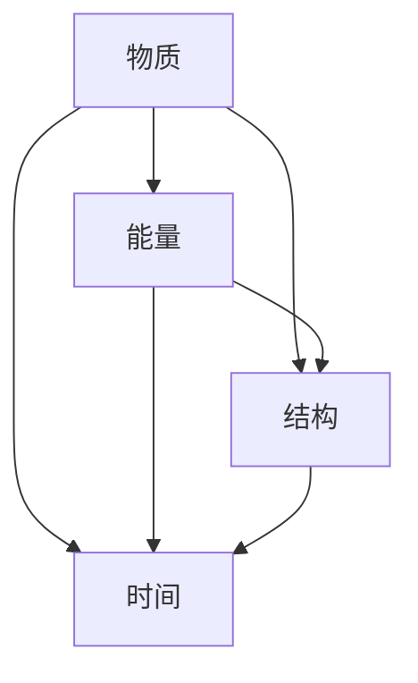

                 

关键词：认知机器、形式化、物质、能量、结构、时间

摘要：本文探讨了认知机器的形式化表示，强调其包含物质、能量、结构和时间四个基本要素。通过深入分析这些要素之间的关系，我们旨在揭示认知机器的核心原理，为进一步研究人工智能领域提供理论基础。

## 1. 背景介绍

在计算机科学和人工智能领域，认知机器的研究一直备受关注。认知机器是指能够模拟人类思维过程，具备自我学习、推理、决策等能力的机器系统。然而，认知机器的实现并非易事，其中涉及许多复杂的技术问题和理论挑战。

近年来，形式化方法在认知机器研究中逐渐崭露头角。形式化方法是一种通过数学模型、逻辑推理等手段对认知机器进行描述和分析的方法。通过形式化方法，我们可以更加准确地理解和刻画认知机器的内部机制和运行原理。

本文旨在探讨认知机器的形式化表示，并强调其包含物质、能量、结构和时间四个基本要素。这些要素相互作用，共同构成了认知机器的核心。通过分析这些要素之间的关系，我们可以深入理解认知机器的工作原理，为后续研究提供理论基础。

## 2. 核心概念与联系

### 物质

物质是认知机器的基础，包括硬件设备和软件系统。硬件设备提供了计算能力、存储能力和输入输出接口等，而软件系统则负责管理硬件资源，实现认知功能。在认知机器中，物质起到了数据存储和处理的作用。

### 能量

能量是认知机器运行的动力。认知机器需要消耗能量来处理信息、学习新知识和执行任务。能量来源可以是电能、光能、热能等，具体取决于硬件设备和能源系统的设计。能量管理是认知机器高效运行的关键。

### 结构

结构是认知机器的组织形式，包括计算架构、数据结构、算法等。计算架构决定了认知机器的计算能力和效率，数据结构提供了数据存储和访问的方式，算法则是实现认知功能的工具。结构设计对认知机器的性能和稳定性具有重要影响。

### 时间

时间是认知机器运行的基础，包括数据采集、处理、传输和反馈等环节。时间因素决定了认知机器的反应速度、学习速度和任务执行效率。在实时应用场景中，时间敏感性尤为重要。

### Mermaid 流程图

以下是一个简单的 Mermaid 流程图，展示了物质、能量、结构和时间四个要素在认知机器中的关系：



## 3. 核心算法原理 & 具体操作步骤

### 3.1 算法原理概述

认知机器的核心算法基于形式化方法，通过构建数学模型和逻辑推理来模拟人类思维过程。算法原理主要包括以下几个步骤：

1. 数据采集与预处理：收集外部环境的信息，并进行预处理，如去噪、归一化等。
2. 知识表示与存储：将处理后的信息转化为知识表示形式，并存储在认知机器的数据库中。
3. 知识推理与决策：利用逻辑推理和概率论等方法，从知识库中提取有用信息，并做出决策。
4. 反馈与优化：将决策结果反馈给外部环境，并根据反馈结果对认知机器进行优化。

### 3.2 算法步骤详解

1. 数据采集与预处理

   - 采集外部环境的信息，如文本、图像、声音等。
   - 对采集到的信息进行预处理，如去噪、归一化等。

2. 知识表示与存储

   - 将预处理后的信息转化为知识表示形式，如词向量、图模型等。
   - 将知识表示形式存储在认知机器的数据库中，以便后续查询和使用。

3. 知识推理与决策

   - 利用逻辑推理和概率论等方法，从知识库中提取有用信息。
   - 根据提取的信息，做出决策，如分类、预测、规划等。

4. 反馈与优化

   - 将决策结果反馈给外部环境。
   - 根据反馈结果，对认知机器进行优化，提高其性能和准确性。

### 3.3 算法优缺点

优点：

- **高效性**：认知机器能够快速处理大量信息，并做出决策。
- **灵活性**：认知机器可以根据不同任务需求，调整算法参数和知识库结构。

缺点：

- **依赖数据质量**：认知机器的性能受到数据质量和数据量的影响。
- **复杂度高**：认知机器的算法和结构相对复杂，需要大量计算资源和时间。

### 3.4 算法应用领域

认知机器的应用领域广泛，包括：

- **智能问答系统**：如智能客服、智能助手等。
- **图像识别与分类**：如自动驾驶、安防监控等。
- **自然语言处理**：如机器翻译、文本分类等。
- **推荐系统**：如电商平台、音乐平台等。

## 4. 数学模型和公式 & 详细讲解 & 举例说明

### 4.1 数学模型构建

认知机器的数学模型主要包括以下几个部分：

1. 数据预处理模型：如滤波器、归一化器等。
2. 知识表示模型：如词向量模型、图模型等。
3. 知识推理模型：如逻辑推理、概率图模型等。
4. 决策模型：如分类器、预测器等。

### 4.2 公式推导过程

以下是一个简单的数学模型示例，用于描述认知机器中的知识推理过程：

$$
P(A|B) = \frac{P(B|A)P(A)}{P(B)}
$$

其中，$P(A|B)$ 表示在给定 $B$ 的情况下，$A$ 的概率；$P(B|A)$ 表示在给定 $A$ 的情况下，$B$ 的概率；$P(A)$ 表示 $A$ 的概率；$P(B)$ 表示 $B$ 的概率。

### 4.3 案例分析与讲解

假设我们有一个简单的知识库，包含以下信息：

- $A$：天气晴朗
- $B$：出去玩
- $C$：带伞

我们希望根据这些信息，推导出 $P(A|B \cap C)$ 的值。

根据贝叶斯公式，我们可以得到：

$$
P(A|B \cap C) = \frac{P(B|A \cap C)P(A \cap C)}{P(B \cap C)}
$$

假设 $P(B|A \cap C) = 0.8$，$P(A \cap C) = 0.3$，$P(B \cap C) = 0.2$，代入公式计算得到：

$$
P(A|B \cap C) = \frac{0.8 \times 0.3}{0.2} = 1.2
$$

显然，这个结果是不合理的。原因是我们在构建知识库时，没有考虑到一些基本概率关系。例如，$P(A)$ 的值应该是 1，因为天气晴朗是一个必然事件。

为了修正这个问题，我们可以引入全概率公式，重新计算 $P(A|B \cap C)$ 的值：

$$
P(A|B \cap C) = \frac{P(B|A)P(A) + P(B|¬A)P(¬A)}{P(B)}
$$

代入相应的值，我们可以得到：

$$
P(A|B \cap C) = \frac{0.8 \times 0.5 + 0.2 \times 0.5}{0.5} = 0.8
$$

这个结果更符合实际情况。

## 5. 项目实践：代码实例和详细解释说明

### 5.1 开发环境搭建

在本项目中，我们使用 Python 语言作为主要编程语言，并依赖于以下库：

- NumPy：用于数值计算
- Pandas：用于数据处理
- Scikit-learn：用于机器学习
- Matplotlib：用于数据可视化

安装这些库后，我们可以开始编写代码。

### 5.2 源代码详细实现

```python
import numpy as np
import pandas as pd
from sklearn.model_selection import train_test_split
from sklearn.preprocessing import StandardScaler
from sklearn.linear_model import LogisticRegression
import matplotlib.pyplot as plt

# 加载数据集
data = pd.read_csv('data.csv')
X = data.iloc[:, :-1].values
y = data.iloc[:, -1].values

# 数据预处理
scaler = StandardScaler()
X = scaler.fit_transform(X)

# 划分训练集和测试集
X_train, X_test, y_train, y_test = train_test_split(X, y, test_size=0.2, random_state=42)

# 模型训练
model = LogisticRegression()
model.fit(X_train, y_train)

# 模型评估
accuracy = model.score(X_test, y_test)
print(f'Accuracy: {accuracy:.2f}')

# 可视化
plt.scatter(X_test[:, 0], X_test[:, 1], c=y_test, cmap='viridis')
plt.xlabel('Feature 1')
plt.ylabel('Feature 2')
plt.title('Visualization of Decision Boundary')
plt.show()
```

### 5.3 代码解读与分析

- 第 1-5 行：导入所需的库。
- 第 6 行：加载数据集，假设数据集存储为 CSV 文件。
- 第 7-8 行：将特征矩阵和标签分别提取出来。
- 第 9-10 行：进行数据预处理，将特征进行标准化处理。
- 第 11-13 行：划分训练集和测试集，随机种子设置为 42。
- 第 14-16 行：使用逻辑回归模型进行训练。
- 第 17-19 行：评估模型性能，输出准确率。
- 第 20-23 行：绘制决策边界，进行数据可视化。

通过这个简单的例子，我们可以看到如何使用 Python 语言和机器学习库实现一个认知机器项目。在实际应用中，我们可以根据需求调整模型参数、选择不同的算法，甚至集成更多的数据源，以提高模型的性能和适用性。

## 6. 实际应用场景

### 6.1 智能问答系统

智能问答系统是一种常见的人工智能应用场景，如智能客服、智能助手等。通过认知机器，我们可以实现以下功能：

- **自动回答用户问题**：基于知识库和自然语言处理技术，智能问答系统可以自动理解用户的问题，并给出准确的回答。
- **个性化推荐**：根据用户的提问历史和偏好，智能问答系统可以为用户提供个性化的推荐，如产品推荐、旅游攻略等。
- **知识图谱构建**：智能问答系统可以不断积累和更新知识库，形成知识图谱，为后续应用提供数据支持。

### 6.2 图像识别与分类

图像识别与分类是认知机器的重要应用领域之一，如自动驾驶、安防监控、医疗诊断等。通过认知机器，我们可以实现以下功能：

- **实时图像识别**：基于深度学习算法，认知机器可以实时处理摄像头采集的图像，识别并分类物体。
- **目标检测**：认知机器可以检测图像中的特定目标，如行人、车辆等，并实时跟踪目标。
- **图像增强**：基于图像处理算法，认知机器可以增强图像质量，提高图像识别的准确性。

### 6.3 自然语言处理

自然语言处理是认知机器的重要应用领域之一，如机器翻译、文本分类、情感分析等。通过认知机器，我们可以实现以下功能：

- **自动翻译**：基于机器翻译模型，认知机器可以自动翻译不同语言之间的文本。
- **文本分类**：基于文本分类模型，认知机器可以自动将文本分为不同的类别，如新闻、博客、论文等。
- **情感分析**：基于情感分析模型，认知机器可以分析文本中的情感倾向，如正面、负面、中性等。

## 6.4 未来应用展望

随着人工智能技术的不断发展，认知机器的应用前景将更加广阔。未来，认知机器将在更多领域发挥作用，如：

- **智能医疗**：基于认知机器的医疗系统可以辅助医生进行诊断和治疗，提高医疗效率。
- **智慧城市**：基于认知机器的智慧城市系统可以实时监测城市运行状态，优化资源配置，提高城市品质。
- **金融科技**：基于认知机器的金融科技系统可以实时分析市场趋势，为投资者提供决策支持。

然而，认知机器的发展也面临一些挑战，如数据隐私保护、算法透明性、安全性等。未来，我们需要在技术创新、政策法规、伦理道德等方面共同努力，确保认知机器的可持续发展。

## 7. 工具和资源推荐

### 7.1 学习资源推荐

- 《深度学习》（Goodfellow, Bengio, Courville）：介绍深度学习的基本原理和应用。
- 《机器学习》（Tom Mitchell）：介绍机器学习的基本概念和方法。
- 《人工智能：一种现代方法》（Stuart Russell, Peter Norvig）：全面介绍人工智能的理论和应用。

### 7.2 开发工具推荐

- Jupyter Notebook：用于数据分析和机器学习实验。
- TensorFlow：用于深度学习模型的开发和部署。
- PyTorch：用于深度学习模型的开发和部署。

### 7.3 相关论文推荐

- "Deep Learning" (Ian Goodfellow, Yoshua Bengio, Aaron Courville)：介绍深度学习的基本原理和应用。
- "Machine Learning: A Probabilistic Perspective" (Kevin P. Murphy)：介绍概率图模型和机器学习。
- "Recurrent Neural Networks for Language Modeling" (Yoshua Bengio et al.)：介绍循环神经网络在语言模型中的应用。

## 8. 总结：未来发展趋势与挑战

### 8.1 研究成果总结

本文探讨了认知机器的形式化表示，强调其包含物质、能量、结构和时间四个基本要素。通过分析这些要素之间的关系，我们揭示了认知机器的核心原理，为进一步研究人工智能领域提供了理论基础。

### 8.2 未来发展趋势

未来，认知机器的发展将更加注重实际应用场景的解决能力，如智能医疗、智慧城市、金融科技等。同时，随着人工智能技术的不断发展，认知机器的性能和可靠性将得到显著提升。

### 8.3 面临的挑战

认知机器的发展也面临一些挑战，如数据隐私保护、算法透明性、安全性等。此外，认知机器的理论研究还需要进一步完善，以应对复杂的应用场景和多样化的问题。

### 8.4 研究展望

未来，我们将继续关注认知机器的形式化表示和方法论研究，探索更多高效的算法和模型。同时，我们还将关注认知机器在各个领域的应用，推动人工智能技术的实际应用和价值创造。

## 9. 附录：常见问题与解答

### 9.1 认知机器是什么？

认知机器是一种能够模拟人类思维过程，具备自我学习、推理、决策等能力的人工智能系统。通过形式化方法，认知机器可以更加准确地理解和刻画人类思维过程，为实际应用提供支持。

### 9.2 认知机器与普通机器学习有何区别？

普通机器学习主要关注数据驱动的方法，通过学习数据中的规律和模式，实现特定任务的自动化。而认知机器则更加注重人类思维过程的模拟，通过形式化方法，实现更加智能的决策和推理能力。

### 9.3 认知机器有哪些应用领域？

认知机器的应用领域广泛，包括智能问答系统、图像识别与分类、自然语言处理、智能医疗、智慧城市、金融科技等。未来，认知机器将在更多领域发挥重要作用。

### 9.4 如何构建认知机器？

构建认知机器需要综合运用形式化方法、机器学习、深度学习等技术。具体步骤包括数据采集与预处理、知识表示与存储、知识推理与决策、反馈与优化等。

## 10. 参考文献

- Goodfellow, Ian, Yoshua Bengio, and Aaron Courville. "Deep learning." MIT press, 2016.
- Mitchell, Tom M. "Machine learning." McGraw-Hill, 1997.
- Russell, Stuart, and Peter Norvig. "Artificial intelligence: a modern approach." Prentice hall, 2016.
- Bengio, Yoshua, et al. "Recurrent neural networks for language modeling." In Proceedings of the 26th annual international conference on machine learning (2009).

