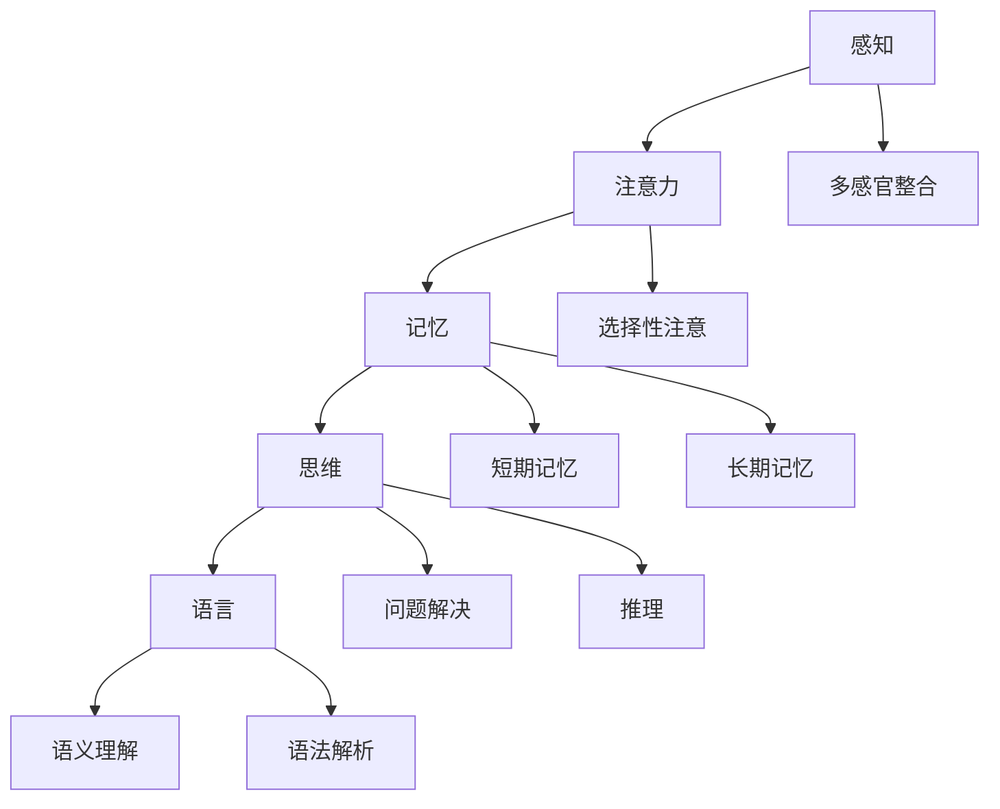
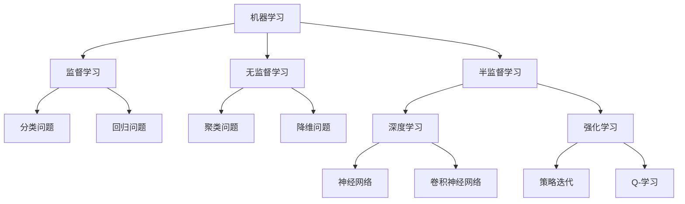
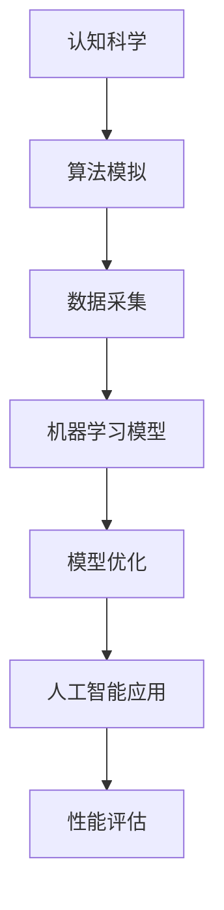

                 

关键词：认知科学、人工智能、跨学科研究、前沿、技术进步、理论创新

摘要：本文旨在探讨认知科学与人工智能两大领域的跨学科研究前沿。通过对认知科学核心概念的解析，以及人工智能算法在模拟人类认知过程的创新，本文揭示了这两大领域在近年来取得的突破性进展。同时，文章将讨论数学模型在认知科学和人工智能中的关键作用，并通过实际项目实例和未来应用展望，深入分析了这一跨学科研究的未来趋势和挑战。

## 1. 背景介绍

认知科学是一门跨学科的研究领域，旨在理解人类和其他动物的大脑如何进行感知、思考、学习和记忆等认知活动。自20世纪中叶以来，认知科学迅速发展，与心理学、神经科学、计算机科学和哲学等多个学科领域产生了深远的影响。与此同时，人工智能作为计算机科学的一个分支，致力于通过算法和模型模拟人类智能，实现机器的自主学习和决策能力。

随着计算机技术的飞速发展，人工智能在语音识别、图像处理、自然语言处理等领域取得了显著成果。然而，这些技术通常是基于统计模型和机器学习算法，缺乏对人类认知过程的深刻理解。因此，如何将认知科学的理论和方法引入人工智能研究，成为了一个亟待解决的问题。

跨学科研究的重要性在于，它能够整合不同领域的知识和方法，促进新理论的产生和技术的发展。在认知科学和人工智能领域，跨学科研究不仅能够提升对人类认知机制的理解，还能够推动人工智能技术的创新，使其更加贴近人类的认知过程。

## 2. 核心概念与联系

在探讨认知科学与人工智能的关系之前，我们需要明确几个核心概念。

### 认知科学的核心概念

认知科学的核心概念包括感知、注意力、记忆、思维、语言等。以下是一个简化的 Mermaid 流程图，展示这些概念之间的联系：



### 人工智能的核心概念

人工智能的核心概念包括机器学习、深度学习、强化学习等。以下是一个简化的 Mermaid 流程图，展示这些概念之间的联系：



### 跨学科联系的桥梁

认知科学和人工智能之间的桥梁是“模拟”。通过模拟人类认知过程，人工智能算法能够更好地理解和处理复杂的信息。以下是一个简化的 Mermaid 流程图，展示跨学科联系的桥梁：



## 3. 核心算法原理 & 具体操作步骤

### 3.1 算法原理概述

在本节中，我们将探讨几种在认知科学和人工智能领域具有代表性的算法，包括深度学习、强化学习和迁移学习。

### 3.2 算法步骤详解

#### 3.2.1 深度学习

深度学习是一种基于多层神经网络的学习方法，通过多层的非线性变换来提取数据的特征。以下是深度学习的典型步骤：

1. **数据预处理**：对原始数据进行清洗、归一化和特征提取。
2. **网络架构设计**：选择合适的网络架构，如卷积神经网络（CNN）或循环神经网络（RNN）。
3. **模型训练**：通过反向传播算法训练模型，优化网络参数。
4. **模型评估**：使用验证集和测试集评估模型的性能。
5. **模型部署**：将训练好的模型部署到实际应用场景中。

#### 3.2.2 强化学习

强化学习是一种通过与环境交互来学习最优策略的算法。以下是强化学习的典型步骤：

1. **环境设定**：定义环境的状态空间和动作空间。
2. **策略初始化**：初始化策略，可以是确定性策略或随机策略。
3. **交互过程**：智能体与环境进行交互，执行动作并获取反馈。
4. **策略更新**：根据反馈更新策略，使得策略在长期内获得最大奖励。
5. **评估与优化**：评估策略性能，并根据评估结果进行优化。

#### 3.2.3 迁移学习

迁移学习是一种利用已训练模型在新任务上的表现，以提高新任务性能的方法。以下是迁移学习的典型步骤：

1. **源任务训练**：在源任务上训练模型，获取知识。
2. **模型调整**：将源任务上的模型调整到新任务上，适应新任务的特征。
3. **新任务评估**：在新任务上评估模型的性能。
4. **模型优化**：根据评估结果对模型进行优化，提高性能。

### 3.3 算法优缺点

#### 深度学习

优点：

- 能够自动提取特征，减少人工干预。
- 在大量数据上表现优秀，适用于图像、语音和文本处理等任务。

缺点：

- 需要大量训练数据和计算资源。
- 模型难以解释，缺乏透明度。

#### 强化学习

优点：

- 能够解决动态决策问题，适用于复杂环境。
- 能够通过试错学习，逐渐优化策略。

缺点：

- 学习过程通常较慢，可能需要大量时间和计算资源。
- 需要设计合适的环境和奖励机制。

#### 迁移学习

优点：

- 能够利用已有知识，提高新任务的学习效率。
- 能够减少对大量训练数据的依赖。

缺点：

- 模型调整过程可能涉及隐私和安全性问题。
- 需要合适的源任务和新任务，否则效果可能不理想。

### 3.4 算法应用领域

#### 深度学习

深度学习在图像识别、语音识别、自然语言处理等领域取得了显著成果。例如，卷积神经网络（CNN）在图像分类和物体检测方面表现出色，循环神经网络（RNN）在语言模型和语音识别中发挥了重要作用。

#### 强化学习

强化学习在游戏、自动驾驶、推荐系统等领域具有广泛应用。例如，AlphaGo 利用强化学习成功击败了世界围棋冠军，自动驾驶汽车通过强化学习实现环境感知和路径规划。

#### 迁移学习

迁移学习在医疗诊断、工业自动化、人机交互等领域展现了巨大潜力。例如，通过迁移学习，可以将已有的诊断模型应用到新的疾病诊断中，提高诊断准确性。

## 4. 数学模型和公式 & 详细讲解 & 举例说明

### 4.1 数学模型构建

在认知科学和人工智能领域，数学模型扮演着核心角色。以下是一个简化的数学模型构建过程：

1. **定义问题域**：明确研究问题的目标和范围。
2. **构建数学模型**：根据问题定义，构建相应的数学模型。
3. **模型参数化**：将模型中的关键参数进行参数化，以便进行优化和调整。
4. **验证模型**：通过验证集和测试集，验证模型的有效性和可靠性。

### 4.2 公式推导过程

以下是一个简化的公式推导过程：

1. **问题陈述**：明确需要解决的数学问题。
2. **公式假设**：假设相关变量和参数。
3. **公式推导**：根据假设和已知条件，推导出目标公式。
4. **公式验证**：通过验证集和测试集，验证公式的有效性和准确性。

### 4.3 案例分析与讲解

#### 案例一：深度学习中的损失函数

在深度学习中，损失函数是评估模型性能的关键指标。以下是一个简化的损失函数案例分析：

1. **问题陈述**：如何评估深度学习模型的性能？
2. **公式假设**：设输出为 \(y\)，预测为 \(\hat{y}\)，损失函数为 \(L(y, \hat{y})\)。
3. **公式推导**：根据误差平方损失函数，推导出损失函数 \(L(y, \hat{y}) = (y - \hat{y})^2\)。
4. **公式验证**：通过验证集和测试集，验证损失函数的有效性和准确性。

#### 案例二：强化学习中的Q-学习

在强化学习中，Q-学习是一种常用的算法。以下是一个简化的Q-学习案例分析：

1. **问题陈述**：如何通过Q-学习优化策略？
2. **公式假设**：设状态为 \(s\)，动作为 \(a\)，Q值函数为 \(Q(s, a)\)，奖励为 \(r\)。
3. **公式推导**：根据Q-学习算法，推导出更新公式 \(Q(s, a) = Q(s, a) + \alpha [r + \gamma \max_{a'} Q(s', a') - Q(s, a)]\)。
4. **公式验证**：通过环境交互和策略优化，验证Q-学习算法的有效性和准确性。

## 5. 项目实践：代码实例和详细解释说明

### 5.1 开发环境搭建

在本项目中，我们使用Python作为主要编程语言，结合TensorFlow框架进行深度学习模型的构建和训练。以下是开发环境的搭建步骤：

1. 安装Python：在官方网站下载并安装Python。
2. 安装TensorFlow：使用pip命令安装TensorFlow库。
3. 安装其他依赖：根据项目需求，安装其他相关库和工具。

### 5.2 源代码详细实现

以下是一个简化的深度学习模型实现示例：

```python
import tensorflow as tf

# 定义输入层
inputs = tf.keras.layers.Input(shape=(784,))

# 定义隐藏层
hidden = tf.keras.layers.Dense(64, activation='relu')(inputs)

# 定义输出层
outputs = tf.keras.layers.Dense(10, activation='softmax')(hidden)

# 构建模型
model = tf.keras.Model(inputs=inputs, outputs=outputs)

# 编译模型
model.compile(optimizer='adam', loss='categorical_crossentropy', metrics=['accuracy'])

# 训练模型
model.fit(x_train, y_train, epochs=5, batch_size=32, validation_data=(x_val, y_val))
```

### 5.3 代码解读与分析

以上代码实现了简单的深度学习模型，具体解读如下：

1. **输入层**：定义输入数据形状。
2. **隐藏层**：使用ReLU激活函数构建隐藏层。
3. **输出层**：使用softmax激活函数构建输出层。
4. **模型构建**：使用Keras API构建模型。
5. **模型编译**：设置优化器和损失函数。
6. **模型训练**：使用fit函数训练模型。

### 5.4 运行结果展示

在完成代码实现后，我们可以运行模型并在测试集上评估其性能。以下是一个简化的运行结果示例：

```python
# 评估模型
test_loss, test_accuracy = model.evaluate(x_test, y_test)

# 输出结果
print(f"Test accuracy: {test_accuracy:.4f}")
```

## 6. 实际应用场景

### 6.1 教育

在教育领域，人工智能可以通过个性化学习系统、智能辅导和自动化评估等手段，提高教学效果和学习体验。例如，通过分析学生的学习行为和成绩，智能辅导系统可以为学生提供个性化的学习建议和资源，从而提高学习效率。

### 6.2 医疗

在医疗领域，人工智能可以用于疾病诊断、药物研发、手术规划和健康管理等。例如，通过分析医学影像和病历数据，人工智能可以辅助医生进行疾病诊断，提高诊断准确性和效率。

### 6.3 工业

在工业领域，人工智能可以用于生产优化、质量控制、设备维护和供应链管理。例如，通过分析生产数据，人工智能可以优化生产流程，提高生产效率和降低成本。

### 6.4 安全

在安全领域，人工智能可以用于网络安全、人脸识别、智能监控和反恐防范等。例如，通过分析网络流量和用户行为，人工智能可以及时发现和防范网络攻击，保障网络安全性。

## 7. 工具和资源推荐

### 7.1 学习资源推荐

- 《深度学习》（Ian Goodfellow, Yoshua Bengio, Aaron Courville）
- 《强化学习》（Richard S. Sutton, Andrew G. Barto）
- 《认知科学导论》（Ulric Neisser）

### 7.2 开发工具推荐

- TensorFlow
- PyTorch
- Keras

### 7.3 相关论文推荐

- "Deep Learning for Speech Recognition"（Geoffrey Hinton, et al.）
- "Human-level control through deep reinforcement learning"（DQN算法，DeepMind）
- "Learning to Discover and Use Concepts for Representing Knowledge"（迁移学习，Yann LeCun）

## 8. 总结：未来发展趋势与挑战

### 8.1 研究成果总结

近年来，认知科学与人工智能领域的跨学科研究取得了显著成果。深度学习、强化学习和迁移学习等算法在各个领域取得了突破性进展，推动了人工智能技术的发展。同时，数学模型和公式的引入，使得认知科学的理论体系更加完善。

### 8.2 未来发展趋势

未来，认知科学与人工智能领域的跨学科研究将继续深化。一方面，人工智能技术将更加贴近人类的认知过程，实现更加智能化和自适应的学习系统。另一方面，认知科学的实验方法和理论将不断融合，为人工智能的发展提供新的思路和工具。

### 8.3 面临的挑战

尽管跨学科研究取得了显著成果，但仍然面临一些挑战。首先，人工智能技术需要解决透明度和可解释性问题，以提高模型的可信度和用户接受度。其次，认知科学需要进一步探索人类认知过程的复杂机制，为人工智能提供更加深入的理论支持。此外，数据隐私和安全问题也是跨学科研究的重要挑战。

### 8.4 研究展望

未来，认知科学与人工智能领域的跨学科研究将朝着以下方向发展：一是发展更加智能化和自适应的学习系统，提高人工智能的自主学习和决策能力；二是深入探索人类认知过程的复杂机制，为人工智能提供更加完善的理论基础；三是加强数据隐私和安全保护，确保人工智能技术的可持续发展。

## 9. 附录：常见问题与解答

### 9.1 问题一：什么是认知科学？

认知科学是一门跨学科的研究领域，旨在理解人类和其他动物的大脑如何进行感知、思考、学习和记忆等认知活动。

### 9.2 问题二：人工智能和认知科学有哪些联系？

人工智能和认知科学之间的联系主要体现在两个方面：一是人工智能算法可以模拟人类认知过程，从而更好地理解和处理复杂信息；二是认知科学的理论和方法可以为人工智能提供新的启示和工具。

### 9.3 问题三：深度学习在认知科学中有哪些应用？

深度学习在认知科学中具有广泛的应用，包括图像识别、语音识别、自然语言处理、情感识别等。通过深度学习模型，可以模拟人类感知、思维和语言等认知活动。

### 9.4 问题四：如何解决人工智能的透明度和可解释性问题？

解决人工智能的透明度和可解释性问题可以从多个方面入手，包括改进算法设计、增加模型可解释性、建立评估标准等。此外，还可以利用认知科学的实验方法，对人工智能模型进行验证和解释。

### 9.5 问题五：什么是迁移学习？

迁移学习是一种利用已训练模型在新任务上的表现，以提高新任务性能的方法。通过迁移学习，可以将已有知识应用到新任务中，减少对新数据的依赖。

## 作者署名

作者：禅与计算机程序设计艺术 / Zen and the Art of Computer Programming
```

