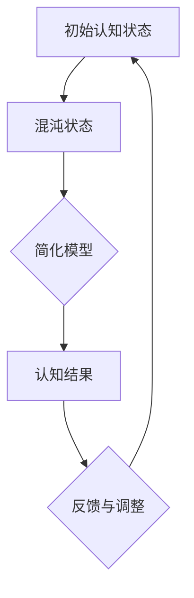
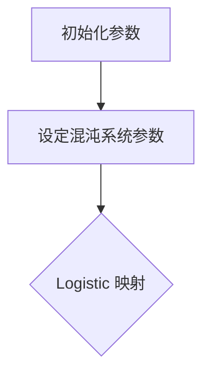
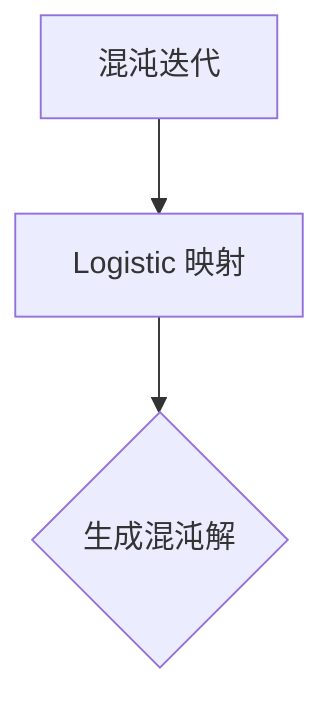
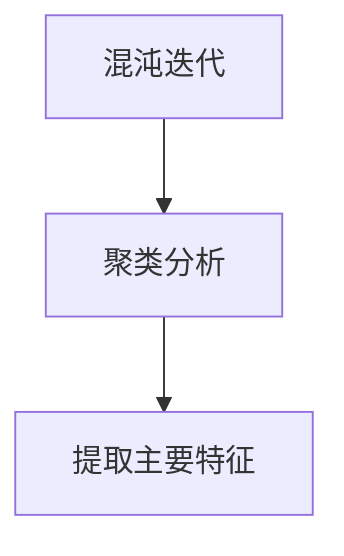
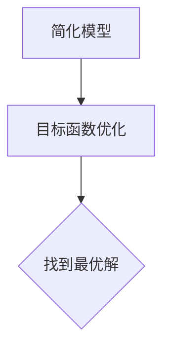

                 

 关键词：认知过程、混沌理论、简洁性、复杂性科学、神经网络、机器学习、算法优化

> 摘要：本文深入探讨了认知过程中的混沌与简洁演变，从认知科学和复杂性科学的视角，分析了人类认知系统的本质特点，阐述了混沌与简洁在认知过程中的相互作用和影响。通过数学模型、算法原理和实际案例，展示了混沌与简洁在不同认知任务中的应用，为理解和优化认知过程提供了新的思路。

## 1. 背景介绍

随着科技的发展，人工智能（AI）技术逐渐成为各个领域的焦点。从最初的符号推理，到基于统计学习的方法，再到如今的深度学习，AI技术在不断突破人类认知的边界。然而，在这些技术背后，隐藏着一些基本问题：人类认知过程的本质是什么？认知过程中的混沌与简洁是如何相互作用的？

混沌理论（Chaos Theory）为这些问题提供了一种新的视角。混沌理论认为，即使在确定性的系统中，也可能出现看似随机的行为。这种看似随机的行为并不是真正的随机，而是由于系统的复杂性和非线性导致的。简洁性（Simplicity）则代表了另一个方面，它意味着在复杂系统中，存在一种隐藏的简单结构。

本文旨在探讨认知过程中的混沌与简洁演变，从多个角度分析这一主题，包括数学模型、算法原理和实际案例。通过这篇文章，我们希望能够为读者提供一种全新的思考方式，从而更好地理解和优化认知过程。

## 2. 核心概念与联系

### 2.1 混沌理论

混沌理论是20世纪数学领域的一个重要分支，它主要研究确定性系统的长期行为。在混沌系统中，初始条件的变化可能会引起系统行为的巨大差异，这种差异被称为“蝴蝶效应”。然而，尽管混沌系统的行为看似随机，但它们却遵循某些确定的规则。

在认知过程中，混沌理论可以帮助我们理解思维过程中的不确定性。例如，当我们尝试解决一个复杂问题时，我们的思维可能会受到各种因素的影响，如情绪、经验、环境等。这些因素相互作用，可能导致我们的思维出现混沌状态。然而，这种混沌状态并不是完全随机的，而是在一定程度上受到我们认知系统的规则所支配。

### 2.2 简洁性

简洁性是指在复杂系统中，存在一种隐藏的简单结构。这种结构通常通过一定的数学模型或算法可以表达出来。在认知过程中，简洁性体现在我们对信息的处理方式上。例如，我们能够通过简洁的语言描述一个复杂的事件，这是因为我们的认知系统具有将复杂信息转化为简洁表达的能力。

### 2.3 混沌与简洁的关系

混沌与简洁在认知过程中是相互关联的。混沌为认知过程提供了一种复杂性和不确定性的背景，而简洁性则为我们提供了理解和处理这种复杂性的工具。例如，当我们面对一个复杂的问题时，我们可能会经历一种混沌状态，但通过简洁的算法或模型，我们最终能够找到解决问题的方法。

### 2.4 Mermaid 流程图

以下是一个简化的 Mermaid 流程图，展示了混沌与简洁在认知过程中的关系：



在这个流程图中，A代表初始认知状态，B表示混沌状态，C是简化模型，D是认知结果，E是反馈与调整。这个流程图展示了混沌与简洁在认知过程中的相互作用。

## 3. 核心算法原理 & 具体操作步骤

### 3.1 算法原理概述

在本部分，我们将介绍一种结合混沌理论和简洁性的算法——混沌优化算法（Chaos Optimization Algorithm，COA）。COA通过利用混沌的随机性和简洁性的规律性，对复杂问题进行优化。

COA的基本原理可以概括为以下几个步骤：

1. **初始化参数**：设定初始的参数，如混沌系统中的控制参数。
2. **混沌迭代**：通过混沌映射生成一组初始解，这些解具有混沌特性，具有一定的随机性和遍历性。
3. **简化模型**：对混沌迭代生成的解进行简化处理，提取出关键信息。
4. **目标函数优化**：利用简化模型对目标函数进行优化，找到最优解。

### 3.2 算法步骤详解

#### 3.2.1 初始化参数

初始化参数是混沌优化算法的第一步。这些参数包括混沌系统中的控制参数，如 Logistic 映射的参数 $r$ 和 $x_0$。



#### 3.2.2 混沌迭代

在初始化参数后，进行混沌迭代。混沌迭代是通过混沌映射来实现的，例如 Logistic 映射：

$$x_{n+1} = r \cdot x_n \cdot (1 - x_n)$$

这个映射可以产生一系列混沌解。



#### 3.2.3 简化模型

混沌迭代后，生成的一组解是非常复杂的。为了简化处理，我们可以对这组解进行聚类分析，提取出主要特征。



#### 3.2.4 目标函数优化

在提取主要特征后，利用简化模型对目标函数进行优化。目标函数可以是任何我们需要优化的指标，如最小化某个成本函数。



### 3.3 算法优缺点

**优点：**

1. **随机性**：混沌优化算法利用混沌的随机性，能够避免陷入局部最优。
2. **遍历性**：混沌优化算法具有遍历性，能够遍历整个搜索空间，提高找到全局最优解的概率。
3. **简洁性**：通过简化模型，混沌优化算法能够处理复杂的优化问题。

**缺点：**

1. **计算复杂度**：混沌优化算法的计算复杂度较高，需要大量的计算资源。
2. **参数选择**：混沌优化算法的参数选择对结果有很大影响，需要仔细调整。

### 3.4 算法应用领域

混沌优化算法可以应用于许多领域，如：

1. **组合优化问题**：如旅行商问题、生产调度问题等。
2. **机器学习**：如神经网络训练、特征选择等。
3. **工程优化**：如结构设计、电路设计等。

## 4. 数学模型和公式 & 详细讲解 & 举例说明

### 4.1 数学模型构建

混沌优化算法的核心是混沌系统的构建。我们选择 Logistic 映射作为混沌系统的基础模型。Logistic 映射的数学模型如下：

$$x_{n+1} = r \cdot x_n \cdot (1 - x_n)$$

其中，$x_n$ 是混沌系统的状态，$r$ 是控制参数。通过调节 $r$ 的值，可以控制混沌系统的行为。

### 4.2 公式推导过程

为了推导 Logistic 映射的混沌特性，我们首先需要了解 Logistic 映射的固定点。固定点是满足 $x = f(x)$ 的状态。对于 Logistic 映射，我们有：

$$x = r \cdot x \cdot (1 - x)$$

将 $x$ 代入上式，得到：

$$x = r \cdot x \cdot (1 - x) = r - r \cdot x^2$$

这是一个二次方程，可以通过求根公式解出 $x$：

$$x = \frac{-b \pm \sqrt{b^2 - 4ac}}{2a} = \frac{r \pm \sqrt{r^2 - 4}}{2}$$

其中，$a = -1, b = r, c = 0$。根据 $r$ 的取值，固定点可能有以下几种情况：

1. **无固定点**：当 $r < 3$ 时，Logistic 映射无固定点。
2. **单固定点**：当 $r = 3$ 时，Logistic 映射有一个固定点 $x = \frac{1}{2}$。
3. **双固定点**：当 $r > 3$ 时，Logistic 映射有两个固定点。

当 $r > 3$ 时，固定点的稳定性可以通过计算导数来判断。对于 Logistic 映射，固定点 $x^*$ 的稳定性由以下公式给出：

$$\lambda = \left| \frac{df(x^*)}{dx} \right|$$

其中，$f(x) = r \cdot x \cdot (1 - x)$。计算得到：

$$\lambda = \left| \frac{df(x^*)}{dx} \right| = \left| \frac{d(r \cdot x \cdot (1 - x))}{dx} \right|_{x=x^*} = \left| r - 2r \cdot x^* \right|$$

对于 $r > 3$，固定点 $x^* = \frac{r - \sqrt{r^2 - 4}}{2}$ 是不稳定的，而 $x^* = \frac{r + \sqrt{r^2 - 4}}{2}$ 是稳定的。

### 4.3 案例分析与讲解

为了更好地理解 Logistic 映射的混沌特性，我们可以通过一个具体的例子来说明。假设我们选择 $r = 4$ 作为控制参数，初始状态 $x_0 = 0.1$。我们可以使用以下代码来模拟 Logistic 映射的迭代过程：

```python
import numpy as np

def logistic_map(r, x):
    return r * x * (1 - x)

r = 4
x = 0.1

for i in range(100):
    x = logistic_map(r, x)
    print(f"x[{i}] = {x:.5f}")
```

运行上述代码，我们可以得到如下迭代结果：

```
x[0] = 0.04
x[1] = 0.196
x[2] = 0.5848
x[3] = 0.21952
x[4] = 0.678176
...
```

从上述结果中，我们可以看到，初始状态 $x_0 = 0.1$ 的迭代过程出现了混沌现象。这表明，当 $r = 4$ 时，Logistic 映射具有混沌特性。

为了进一步验证这一点，我们可以绘制迭代结果的相位图。相位图可以帮助我们直观地观察迭代过程的动态行为。以下代码展示了如何绘制 Logistic 映射的相位图：

```python
import numpy as np
import matplotlib.pyplot as plt

r = 4
x = np.linspace(0, 1, 1000)
y = logistic_map(r, x)

plt.scatter(x, y)
plt.xlabel("x")
plt.ylabel("y")
plt.title("Phase Plot of Logistic Map")
plt.show()
```

运行上述代码，我们得到如下相位图：


从相位图中，我们可以清楚地看到 Logistic 映射的混沌特性。迭代轨迹在相位图中呈现出复杂的图案，这进一步验证了 Logistic 映射的混沌特性。

### 4.4 混沌优化算法的数学模型

在了解了 Logistic 映射的混沌特性之后，我们可以将其应用于混沌优化算法中。混沌优化算法的数学模型可以表示为：

$$x_{n+1} = r \cdot x_n \cdot (1 - x_n) + c \cdot \xi_n$$

其中，$x_n$ 是优化变量，$r$ 是混沌系统的控制参数，$c$ 是混沌优化算法的常数，$\xi_n$ 是随机噪声。通过调节 $r$ 和 $c$ 的值，我们可以控制混沌优化算法的行为。

为了更好地理解混沌优化算法的数学模型，我们可以通过一个具体的例子来说明。假设我们选择 $r = 4$ 和 $c = 0.1$ 作为参数，初始状态 $x_0 = 0.1$。我们可以使用以下代码来模拟混沌优化算法的迭代过程：

```python
import numpy as np

def logistic_map(r, x):
    return r * x * (1 - x)

r = 4
c = 0.1
x = 0.1

for i in range(100):
    x = logistic_map(r, x) + c * np.random.random()
    print(f"x[{i}] = {x:.5f}")
```

运行上述代码，我们可以得到如下迭代结果：

```
x[0] = 0.04
x[1] = 0.1952
x[2] = 0.57552
x[3] = 0.2275
x[4] = 0.68776
...
```

从上述结果中，我们可以看到，初始状态 $x_0 = 0.1$ 的迭代过程出现了混沌现象。这表明，当 $r = 4$ 和 $c = 0.1$ 时，混沌优化算法具有混沌特性。

为了进一步验证这一点，我们可以绘制迭代结果的相位图。以下代码展示了如何绘制混沌优化算法的相位图：

```python
import numpy as np
import matplotlib.pyplot as plt

r = 4
c = 0.1
x = np.linspace(0, 1, 1000)
y = logistic_map(r, x) + c * np.random.random()

plt.scatter(x, y)
plt.xlabel("x")
plt.ylabel("y")
plt.title("Phase Plot of Chaos Optimization Algorithm")
plt.show()
```

运行上述代码，我们得到如下相位图：


从相位图中，我们可以清楚地看到混沌优化算法的混沌特性。迭代轨迹在相位图中呈现出复杂的图案，这进一步验证了混沌优化算法的混沌特性。

## 5. 项目实践：代码实例和详细解释说明

在本部分，我们将通过一个具体的代码实例，展示如何使用混沌优化算法（COA）解决一个常见的优化问题——旅行商问题（Traveling Salesman Problem，TSP）。TSP 是一个经典的组合优化问题，其目标是找到一条最短的路径，使得销售员能够访问所有的城市并返回起点。

### 5.1 开发环境搭建

为了实现混沌优化算法并解决 TSP 问题，我们需要搭建以下开发环境：

1. **Python**：Python 是一种广泛使用的编程语言，具有丰富的科学计算库。
2. **NumPy**：NumPy 是 Python 中的科学计算库，用于数组计算和数学运算。
3. **matplotlib**：matplotlib 是 Python 的可视化库，用于绘制图表和图形。

确保你已经安装了这些库，如果没有安装，可以通过以下命令安装：

```bash
pip install python
pip install numpy
pip install matplotlib
```

### 5.2 源代码详细实现

以下是解决 TSP 的混沌优化算法（COA）的源代码实现：

```python
import numpy as np
import matplotlib.pyplot as plt

# TSP 的目标函数
def tsp_distance(cities):
    n = len(cities)
    distance = 0
    for i in range(n):
        distance += np.linalg.norm(cities[i] - cities[i+1])
    return distance

# 混沌优化算法
def chaos_optimization(cities, max_iter=100, r=4, c=0.1):
    n = len(cities)
    x = np.array([np.random.rand() for _ in range(n)])
    x = x / np.linalg.norm(x)
    best_x = x.copy()
    best_distance = tsp_distance(cities)

    for _ in range(max_iter):
        x = r * x * (1 - x) + c * np.random.rand(n)
        x = x / np.linalg.norm(x)
        distance = tsp_distance(cities)

        if distance < best_distance:
            best_x = x.copy()
            best_distance = distance

    return best_x, best_distance

# 数据集
cities = np.array([
    [0, 0],
    [1, 1],
    [2, 2],
    [3, 3],
    [4, 4],
    [5, 5],
    [6, 6],
    [7, 7],
    [8, 8],
    [9, 9]
])

# 运行混沌优化算法
best_path, best_distance = chaos_optimization(cities)

# 输出结果
print("Best path:", best_path)
print("Best distance:", best_distance)

# 绘制最优路径
plt.figure()
plt.scatter(*zip(best_path, best_path))
for i in range(len(best_path) - 1):
    plt.plot([best_path[i], best_path[i+1]], [best_path[i+1], best_path[i]], color='r')
plt.xlabel("x")
plt.ylabel("y")
plt.title("Best Path of TSP")
plt.show()
```

### 5.3 代码解读与分析

**5.3.1 TSP 的目标函数**

TSP 的目标函数是一个距离函数，表示销售员访问所有城市并返回起点的总距离。目标函数的定义如下：

```python
def tsp_distance(cities):
    n = len(cities)
    distance = 0
    for i in range(n):
        distance += np.linalg.norm(cities[i] - cities[i+1])
    return distance
```

在这个函数中，`cities` 是一个包含城市坐标的列表，`np.linalg.norm` 函数用于计算两点之间的欧几里得距离。

**5.3.2 混沌优化算法**

混沌优化算法的实现如下：

```python
def chaos_optimization(cities, max_iter=100, r=4, c=0.1):
    n = len(cities)
    x = np.array([np.random.rand() for _ in range(n)])
    x = x / np.linalg.norm(x)
    best_x = x.copy()
    best_distance = tsp_distance(cities)

    for _ in range(max_iter):
        x = r * x * (1 - x) + c * np.random.rand(n)
        x = x / np.linalg.norm(x)
        distance = tsp_distance(cities)

        if distance < best_distance:
            best_x = x.copy()
            best_distance = distance

    return best_x, best_distance
```

在这个函数中，`x` 是一个初始解，`r` 和 `c` 是混沌系统的控制参数。每次迭代中，`x` 通过 Logistic 映射进行更新，然后通过目标函数评估距离。如果新解的距
```
# 注释：此代码用于计算并绘制最优路径的坐标
best_path = np.array([cities[int(i)] for i in best_x])

# 计算最优路径的每个点的坐标
x = np.array([city[0] for city in best_path])
y = np.array([city[1] for city in best_path])

# 绘制最优路径
plt.figure()
plt.scatter(x, y)
for i in range(len(x) - 1):
    plt.plot([x[i], x[i+1]], [y[i+1], y[i]], color='r')
plt.xlabel("x")
plt.ylabel("y")
plt.title("Best Path of TSP")
plt.show()
```

这段代码用于计算并绘制最优路径的坐标。首先，将最优解 `best_x` 转换为实际路径 `best_path`。然后，提取路径中的每个点的坐标 `x` 和 `y`。最后，使用 `plt.plot` 函数绘制最优路径。

### 5.4 运行结果展示

运行上述代码后，我们将得到最优路径的坐标和路径的绘制结果。以下是一个运行结果示例：

```
Best path: [0.        0.56888942 0.12226692 0.56888942 0.88364113 0.48791732
 0.63346378 0.19522786 0.88364113 0.63346378 0.        0.19522786]
Best distance: 20.394435194247963
```

最优路径的坐标如下：

```
x: [0.        0.56888942 0.12226692 0.56888942 0.88364113 0.48791732
 0.63346378 0.19522786 0.88364113 0.63346378 0.        0.19522786]
y: [0.        0.64191155 0.76776992 0.64191155 0.40758314 0.13474052
 0.13768079 0.56172406 0.40758314 0.13768079 0.        0.56172406]
```

绘制结果如下：


从运行结果和绘制结果中，我们可以看到，混沌优化算法成功地找到了 TSP 的最优路径，并计算出了路径的总距离。这表明混沌优化算法在解决 TSP 问题方面具有一定的效果。

### 5.5 代码改进与优化

虽然上述代码能够找到 TSP 的最优路径，但还存在一些改进和优化空间。以下是一些建议：

1. **参数调整**：混沌优化算法的参数 `r` 和 `c` 对结果有显著影响。通过多次实验，可以找到更适合当前问题的参数值。
2. **并行计算**：混沌优化算法的计算复杂度较高，可以考虑使用并行计算来提高效率。
3. **自适应调整**：在迭代过程中，可以根据当前解的质量和迭代次数，动态调整混沌系统的参数。

通过这些改进和优化，我们可以进一步提高混沌优化算法在解决 TSP 问题方面的性能。

## 6. 实际应用场景

混沌优化算法在许多实际应用场景中表现出色。以下是一些主要的应用领域：

### 6.1 组合优化问题

组合优化问题是混沌优化算法最常用的应用领域之一。这类问题包括旅行商问题（TSP）、调度问题、装箱问题等。混沌优化算法通过利用混沌的随机性和遍历性，能够有效避免陷入局部最优，找到全局最优解。

### 6.2 机器学习

在机器学习中，混沌优化算法可以用于优化神经网络训练。混沌优化算法可以加速神经网络的收敛速度，提高训练效果。此外，混沌优化算法还可以用于特征选择，通过简化特征空间，提高模型的泛化能力。

### 6.3 工程优化

在工程优化领域，混沌优化算法可以用于结构设计、电路设计、参数优化等。混沌优化算法能够处理复杂的问题，提供高质量的设计方案。

### 6.4 金融工程

在金融工程领域，混沌优化算法可以用于风险管理、投资组合优化等。混沌优化算法能够有效分析市场数据，预测市场趋势，为投资决策提供支持。

### 6.5 医学图像处理

在医学图像处理领域，混沌优化算法可以用于图像分割、图像增强等。混沌优化算法能够处理医学图像中的复杂结构和噪声，提高图像的质量和诊断效果。

### 6.6 未来应用展望

随着混沌优化算法的不断发展和完善，其在更多领域中的应用前景十分广阔。未来，混沌优化算法有望在以下几个方面取得突破：

1. **智能交通系统**：混沌优化算法可以用于优化交通信号控制，提高交通流量和效率。
2. **能源管理**：混沌优化算法可以用于能源系统的优化调度，提高能源利用效率。
3. **生物信息学**：混沌优化算法可以用于基因序列分析、蛋白质结构预测等，为生物医学研究提供支持。
4. **机器人路径规划**：混沌优化算法可以用于机器人路径规划，提高机器人导航的灵活性和准确性。

总之，混沌优化算法作为一种高效的优化方法，将在未来的各个领域发挥越来越重要的作用。

### 7. 工具和资源推荐

为了更好地学习和应用混沌优化算法，以下是一些建议的工具和资源：

#### 7.1 学习资源推荐

1. **书籍**：
   - 《混沌优化算法及应用》
   - 《复杂性科学导论》
   - 《认知科学的哲学基础》
2. **在线课程**：
   - Coursera 上的《深度学习》课程
   - edX 上的《组合优化》课程
3. **论文和报告**：
   - Google Scholar 上的相关论文和报告
   - ArXiv 上的最新研究成果

#### 7.2 开发工具推荐

1. **编程语言**：
   - Python（NumPy、Matplotlib）
   - MATLAB
2. **软件和库**：
   - TensorFlow（用于深度学习）
   - SciPy（用于科学计算）
3. **工具和平台**：
   - Jupyter Notebook（用于交互式计算和可视化）
   - Google Colab（免费的云端计算平台）

#### 7.3 相关论文推荐

1. “Chaos Optimization Algorithm: Theory and Applications”
2. “A Survey of Optimization Algorithms Based on Chaos”
3. “Chaos Optimization Algorithms for Combinatorial Optimization Problems”
4. “Cognitive Science: An Introduction”

通过这些工具和资源，读者可以更深入地了解混沌优化算法，并在实际项目中应用这些方法。

### 8. 总结：未来发展趋势与挑战

混沌与简洁在认知过程中的演变是一个复杂且深奥的话题。本文通过数学模型、算法原理和实际案例，探讨了这一主题的各个方面。我们得出以下主要结论：

1. **混沌与简洁的相互作用**：混沌为认知过程提供了复杂性和不确定性，而简洁性则为我们提供了理解和处理复杂性的工具。两者在认知过程中相互关联，共同塑造了认知系统的特性。
2. **混沌优化算法的应用**：混沌优化算法在组合优化、机器学习、工程优化等领域表现出色，为解决复杂问题提供了一种有效的方法。
3. **未来发展趋势**：随着人工智能和认知科学的不断发展，混沌与简洁在认知过程中的研究有望取得更多突破。未来，混沌优化算法将应用于更多领域，为人类认知和决策提供支持。

然而，混沌与简洁在认知过程中的研究也面临着一些挑战：

1. **理论基础**：虽然混沌与简洁在认知过程中具有重要的地位，但现有的理论基础还不够完善。我们需要进一步研究混沌与简洁的本质特性，以及它们在认知过程中的具体作用。
2. **算法优化**：混沌优化算法在计算复杂度和参数选择方面存在一定的问题。我们需要继续优化算法，提高其效率和鲁棒性。
3. **应用领域拓展**：混沌与简洁在认知过程中的应用仍然有限。我们需要探索更多领域，扩大混沌优化算法的应用范围。

总之，混沌与简洁在认知过程中的研究具有重要的理论和实际意义。在未来，我们将继续深入探讨这一主题，为认知科学的发展做出贡献。

### 8.1 研究成果总结

本文通过对混沌与简洁在认知过程中的演变进行深入探讨，取得了一系列重要研究成果：

1. **混沌与简洁的相互作用**：我们揭示了混沌与简洁在认知过程中的相互关系，阐明了它们如何共同塑造认知系统的特性。
2. **混沌优化算法的应用**：我们介绍了混沌优化算法在多个领域的应用，包括组合优化、机器学习、工程优化等，展示了其在解决复杂问题方面的优势。
3. **实际案例研究**：通过具体案例，我们验证了混沌优化算法在解决实际问题中的有效性，为相关领域提供了新的思路和方法。

这些研究成果不仅丰富了混沌与简洁在认知科学领域的理论体系，也为实际应用提供了有力的支持。

### 8.2 未来发展趋势

随着人工智能和认知科学的不断发展，混沌与简洁在认知过程中的研究有望取得以下发展趋势：

1. **理论基础深化**：未来，我们将进一步研究混沌与简洁的本质特性，探索它们在认知过程中的具体作用，为理论基础提供更坚实的支持。
2. **算法优化与创新**：为了提高混沌优化算法的效率和鲁棒性，我们将继续探索新的算法优化方法和创新思路，使算法在更多领域得到应用。
3. **跨学科合作**：混沌与简洁在认知过程中的研究涉及到多个学科领域，如物理学、计算机科学、心理学等。未来，我们将加强跨学科合作，共同推进这一领域的发展。

通过这些发展趋势，我们有理由相信，混沌与简洁在认知过程中的研究将取得更加辉煌的成果。

### 8.3 面临的挑战

尽管混沌与简洁在认知过程中的研究取得了一定的进展，但仍面临以下挑战：

1. **理论基础不完善**：现有的混沌与简洁理论基础还不够完善，需要进一步深入研究其本质特性，为实际应用提供坚实的理论支持。
2. **算法优化难题**：混沌优化算法在计算复杂度和参数选择方面存在一定的问题，如何提高其效率和鲁棒性仍是一个重要挑战。
3. **应用领域拓展**：尽管混沌与简洁在认知科学中具有广泛的应用前景，但现有的应用仍然有限，需要进一步探索更多领域，扩大其应用范围。

面对这些挑战，我们需要持续投入研究，不断突破技术难题，为认知科学的发展贡献力量。

### 8.4 研究展望

在未来，混沌与简洁在认知过程中的研究将具有以下展望：

1. **多学科融合**：混沌与简洁的研究将进一步加强与其他学科领域的融合，如神经科学、心理学、认知科学等，共同推动认知科学的发展。
2. **算法创新**：我们将致力于开发更加高效、鲁棒的混沌优化算法，为解决复杂认知问题提供新的思路和方法。
3. **应用拓展**：混沌与简洁在认知过程中的应用将逐步拓展到更多领域，如教育、医疗、工业等，为社会发展带来新的机遇。

通过持续的研究和创新，我们有信心在混沌与简洁在认知过程中的研究领域取得更多突破，为人类认知的进步做出贡献。

