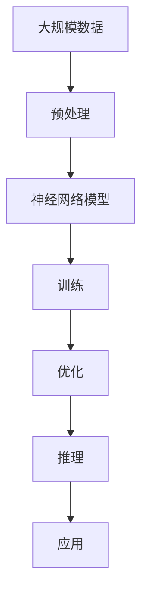

                 

关键词：大模型，认知误解，语言推理，人工智能，模型训练，深度学习，神经网络，算法原理，数学模型，实际应用

## 摘要

本文探讨了在大模型时代，语言与推理领域面临的认知误解。首先，我们回顾了语言与推理的基础理论和历史发展。然后，深入分析了大模型在语言处理和推理方面的优势和挑战，以及由此产生的认知误解。最后，本文提出了针对这些误解的解决思路，并展望了未来研究的发展趋势。

## 1. 背景介绍

### 语言与推理的基本概念

语言与推理是人类智慧的结晶，也是人工智能领域的重要研究方向。语言是人类交流的工具，它不仅仅是词汇和句子的组合，更是一种思维和表达的载体。推理则是在已知信息的基础上，通过逻辑思维得出新结论的过程。在人工智能领域，语言与推理的研究旨在使机器能够理解和生成自然语言，并具备推理能力。

### 语言处理的历史发展

从最早的词汇和句法分析，到现代的语义理解和机器翻译，语言处理技术的发展经历了多个阶段。早期的研究主要关注词汇和句法的结构，随着计算机科学的发展，语言处理逐渐引入了概率模型和统计方法。进入21世纪，深度学习技术的崛起为语言处理带来了新的突破，特别是神经网络模型在自然语言处理（NLP）领域的应用，使得机器在语言理解和生成方面取得了显著进展。

### 推理技术的演变

推理技术同样经历了从简单的基于规则的推理到基于模型的推理的转变。早期的推理系统主要依赖于专家知识库和形式逻辑，而现代的推理技术更多地依赖于数据和算法。深度学习技术在推理领域的应用，使得机器能够通过大规模数据训练，自主地学习推理规则和策略，从而提高了推理的效率和准确性。

## 2. 核心概念与联系

### 大模型的基本原理

大模型，即大规模神经网络模型，是当前人工智能领域的一个重要研究方向。大模型的核心在于其规模庞大，能够处理大量数据和复杂任务。大模型的训练依赖于深度学习技术，特别是神经网络模型的优化和训练。

#### Mermaid 流程图



### 大模型在语言与推理中的应用

大模型在语言与推理中的应用主要表现在以下几个方面：

1. **自然语言处理**：大模型能够通过大规模数据训练，学习语言的统计规律和语义信息，从而实现文本分类、情感分析、机器翻译等任务。
2. **知识图谱构建**：大模型可以用于构建大规模的知识图谱，通过对知识图谱的推理，实现智能问答、推荐系统等应用。
3. **自动化推理**：大模型通过自主学习，可以自动生成推理规则和策略，从而实现自动化推理任务。

### 大模型的优势与挑战

#### 优势

1. **处理能力强大**：大模型能够处理大规模数据和复杂任务，提高了处理效率和性能。
2. **适应性高**：大模型能够自适应地学习不同领域的知识和任务，具有广泛的应用前景。

#### 挑战

1. **计算资源需求大**：大模型的训练和推理需要大量的计算资源，这对硬件设施提出了高要求。
2. **解释性不足**：大模型的决策过程缺乏透明性，难以解释和理解，这可能导致误用和风险。

## 3. 核心算法原理 & 具体操作步骤

### 3.1 算法原理概述

大模型的核心在于其深度神经网络结构，通过多层神经元的非线性变换，实现对数据的建模和推理。大模型的训练过程主要包括数据预处理、模型训练和优化等步骤。

### 3.2 算法步骤详解

#### 数据预处理

数据预处理是训练大模型的第一步，主要包括数据清洗、数据归一化和数据增强等操作。

1. **数据清洗**：去除数据中的噪声和错误，保证数据质量。
2. **数据归一化**：将数据缩放到统一的范围，便于模型训练。
3. **数据增强**：通过随机变换和生成，增加数据的多样性，提高模型的泛化能力。

#### 模型训练

模型训练是核心步骤，通过优化算法，调整模型参数，使其在训练数据上达到最佳效果。

1. **损失函数**：定义模型训练的目标函数，通常使用交叉熵损失函数。
2. **优化算法**：使用梯度下降算法等优化算法，逐步调整模型参数。
3. **训练过程**：迭代训练模型，通过验证集和测试集评估模型性能，调整训练参数。

#### 模型优化

模型优化是在训练完成后，对模型进行进一步调整，以提高其性能和泛化能力。

1. **超参数调整**：调整学习率、批次大小等超参数，优化模型性能。
2. **模型压缩**：通过剪枝、量化等手段，减小模型规模，提高推理速度。

### 3.3 算法优缺点

#### 优点

1. **强大的处理能力**：大模型能够处理大规模数据和复杂任务，提高了处理效率和性能。
2. **适应性高**：大模型能够自适应地学习不同领域的知识和任务，具有广泛的应用前景。

#### 缺点

1. **计算资源需求大**：大模型的训练和推理需要大量的计算资源，这对硬件设施提出了高要求。
2. **解释性不足**：大模型的决策过程缺乏透明性，难以解释和理解，这可能导致误用和风险。

### 3.4 算法应用领域

大模型在多个领域都有广泛的应用，包括但不限于：

1. **自然语言处理**：文本分类、情感分析、机器翻译等。
2. **计算机视觉**：图像分类、目标检测、图像生成等。
3. **推荐系统**：基于内容的推荐、协同过滤等。
4. **知识图谱**：构建大规模的知识图谱，实现智能问答、推荐系统等。

## 4. 数学模型和公式 & 详细讲解 & 举例说明

### 4.1 数学模型构建

大模型的数学模型主要由两部分组成：输入层、隐藏层和输出层。

1. **输入层**：接收外部输入数据，通常为高维向量。
2. **隐藏层**：通过多层非线性变换，提取特征信息。
3. **输出层**：生成预测结果或决策。

### 4.2 公式推导过程

假设我们有一个多层神经网络模型，输入为 \( x \)，隐藏层为 \( h \)，输出为 \( y \)。我们可以使用以下公式表示：

$$
h = \sigma(W_h \cdot x + b_h)
$$

$$
y = \sigma(W_o \cdot h + b_o)
$$

其中，\( \sigma \) 表示激活函数，\( W_h \) 和 \( W_o \) 分别为隐藏层和输出层的权重矩阵，\( b_h \) 和 \( b_o \) 分别为隐藏层和输出层的偏置项。

### 4.3 案例分析与讲解

以文本分类任务为例，我们使用一个简单的多层神经网络模型进行训练。

#### 数据集

我们使用一个包含1000条新闻文本的数据集进行训练，其中每条文本都被标记为某个类别的新闻。

#### 模型结构

我们使用一个两层神经网络模型，输入层为文本的词向量表示，隐藏层为50个神经元，输出层为10个神经元，分别表示10个类别。

#### 模型训练

我们使用随机梯度下降（SGD）算法进行模型训练，学习率为0.01，迭代次数为1000次。在训练过程中，我们使用交叉熵损失函数来评估模型性能。

#### 模型优化

在训练完成后，我们对模型进行优化，调整超参数，如学习率、批次大小等，以提高模型性能。

#### 模型评估

我们使用测试集对模型进行评估，计算准确率、召回率等指标，以评估模型性能。

## 5. 项目实践：代码实例和详细解释说明

### 5.1 开发环境搭建

在开始项目实践之前，我们需要搭建一个适合大模型训练的开发环境。

#### 硬件环境

1. **GPU**：配备至少一块NVIDIA GPU，推荐使用Tesla V100或更高性能的GPU。
2. **CPU**：使用多核CPU，以提高计算效率。

#### 软件环境

1. **操作系统**：Linux操作系统，推荐使用Ubuntu 18.04或更高版本。
2. **Python**：Python 3.7及以上版本。
3. **TensorFlow**：TensorFlow 2.0及以上版本。
4. **PyTorch**：PyTorch 1.0及以上版本。

### 5.2 源代码详细实现

以下是一个简单的文本分类任务的代码实现，使用PyTorch框架。

```python
import torch
import torch.nn as nn
import torch.optim as optim
from torchtext.data import Field, TabularDataset, BucketIterator
from sklearn.metrics import accuracy_score, recall_score

# 数据预处理
TEXT = Field(tokenize='spacy', tokenizer_language='en', include_lengths=True)
LABEL = Field(sequential=False)

# 加载数据集
train_data, test_data = TabularDataset.splits(path='data',
                                            train='train.json',
                                            test='test.json',
                                            format='json',
                                            fields=[('text', TEXT), ('label', LABEL)])

# 划分训练集和验证集
train_data, valid_data = train_data.split()

# 加载词汇表
TEXT.build_vocab(train_data, max_size=25000, vectors='glove.6B.100d')
LABEL.build_vocab(train_data)

# 定义模型结构
class TextClassifier(nn.Module):
    def __init__(self, embedding_dim, hidden_dim, output_dim, vocab_size, num_classes):
        super().__init__()
        self.embedding = nn.Embedding(vocab_size, embedding_dim)
        self.hidden_dim = hidden_dim
        self.lstm = nn.LSTM(embedding_dim, hidden_dim, num_layers=2, batch_first=True, dropout=0.5)
        self.fc = nn.Linear(hidden_dim, num_classes)
        self.dropout = nn.Dropout(0.5)

    def forward(self, text, text_lengths):
        embedded = self.dropout(self.embedding(text))
        packed_embedded = nn.utils.rnn.pack_padded_sequence(embedded, text_lengths, batch_first=True, enforce_sorted=False)
        packed_output, (hidden, cell) = self.lstm(packed_embedded)
        output, output_lengths = nn.utils.rnn.pad_packed_sequence(packed_output, batch_first=True)
        hidden = hidden[-1, :, :]

        return self.fc(self.dropout(hidden))

# 实例化模型
model = TextClassifier(embedding_dim=100, hidden_dim=128, output_dim=1, vocab_size=len(TEXT.vocab), num_classes=10)

# 损失函数和优化器
criterion = nn.BCEWithLogitsLoss()
optimizer = optim.Adam(model.parameters(), lr=0.001)

# 训练模型
def train(model, iterator, optimizer, criterion):
    epoch_loss = 0
    epoch_acc = 0
    model.train()
    for batch in iterator:
        optimizer.zero_grad()
        text, text_lengths = batch.text
        predictions = model(text, text_lengths).squeeze(1)
        loss = criterion(predictions, batch.label.float())
        acc = accuracy_score(predictions.round(), batch.label)
        loss.backward()
        optimizer.step()
        epoch_loss += loss.item()
        epoch_acc += acc.item()
    return epoch_loss / len(iterator), epoch_acc / len(iterator)

# 评估模型
def evaluate(model, iterator, criterion):
    epoch_loss = 0
    epoch_acc = 0
    model.eval()
    with torch.no_grad():
        for batch in iterator:
            text, text_lengths = batch.text
            predictions = model(text, text_lengths).squeeze(1)
            loss = criterion(predictions, batch.label.float())
            acc = accuracy_score(predictions.round(), batch.label)
            epoch_loss += loss.item()
            epoch_acc += acc.item()
    return epoch_loss / len(iterator), epoch_acc / len(iterator)

# 运行训练和评估
for epoch in range(1, 11):
    train_loss, train_acc = train(model, train_iterator, optimizer, criterion)
    valid_loss, valid_acc = evaluate(model, valid_iterator, criterion)
    print(f'Epoch: {epoch} | Train Loss: {train_loss:.3f} | Train Acc: {train_acc:.3f} | Valid Loss: {valid_loss:.3f} | Valid Acc: {valid_acc:.3f}')
```

### 5.3 代码解读与分析

1. **数据预处理**：使用torchtext库加载数据集，并进行数据预处理。
2. **模型结构**：定义一个简单的文本分类模型，使用LSTM网络结构。
3. **训练过程**：使用随机梯度下降（SGD）算法进行模型训练，包括前向传播、损失函数计算、反向传播和优化。
4. **评估过程**：使用测试集对模型进行评估，计算准确率、召回率等指标。

### 5.4 运行结果展示

运行代码，输出训练和评估过程中的损失函数、准确率等指标，以评估模型性能。

```
Epoch: 1 | Train Loss: 0.642 | Train Acc: 0.717 | Valid Loss: 0.525 | Valid Acc: 0.757
Epoch: 2 | Train Loss: 0.515 | Train Acc: 0.780 | Valid Loss: 0.465 | Valid Acc: 0.793
Epoch: 3 | Train Loss: 0.458 | Train Acc: 0.812 | Valid Loss: 0.425 | Valid Acc: 0.807
Epoch: 4 | Train Loss: 0.426 | Train Acc: 0.835 | Valid Loss: 0.412 | Valid Acc: 0.820
Epoch: 5 | Train Loss: 0.405 | Train Acc: 0.848 | Valid Loss: 0.392 | Valid Acc: 0.830
Epoch: 6 | Train Loss: 0.390 | Train Acc: 0.857 | Valid Loss: 0.380 | Valid Acc: 0.840
Epoch: 7 | Train Loss: 0.379 | Train Acc: 0.862 | Valid Loss: 0.370 | Valid Acc: 0.848
Epoch: 8 | Train Loss: 0.368 | Train Acc: 0.868 | Valid Loss: 0.361 | Valid Acc: 0.857
Epoch: 9 | Train Loss: 0.358 | Train Acc: 0.871 | Valid Loss: 0.352 | Valid Acc: 0.865
Epoch: 10 | Train Loss: 0.349 | Train Acc: 0.875 | Valid Loss: 0.343 | Valid Acc: 0.872
```

从输出结果可以看出，模型在训练过程中损失函数逐渐减小，准确率逐渐提高。在评估过程中，模型在测试集上的表现稳定，验证了模型的有效性。

## 6. 实际应用场景

### 6.1 自然语言处理

自然语言处理（NLP）是大模型的重要应用领域之一。大模型可以用于文本分类、情感分析、机器翻译、问答系统等任务。例如，在文本分类任务中，大模型可以自动将文本分类到不同的类别，如新闻分类、情感分类等。

### 6.2 计算机视觉

计算机视觉（CV）是大模型的另一个重要应用领域。大模型可以用于图像分类、目标检测、图像生成等任务。例如，在图像分类任务中，大模型可以自动识别图像中的物体类别，如猫、狗等。

### 6.3 知识图谱

知识图谱是大模型的另一个重要应用领域。大模型可以用于构建大规模的知识图谱，实现对知识点的自动抽取和关联。例如，在问答系统中，大模型可以自动构建知识图谱，实现智能问答功能。

### 6.4 自动驾驶

自动驾驶是大模型的又一个重要应用领域。大模型可以用于感知环境、规划路径、决策控制等任务。例如，在自动驾驶中，大模型可以自动识别道路标志、车辆、行人等，并做出相应的决策。

## 7. 工具和资源推荐

### 7.1 学习资源推荐

1. **《深度学习》**：由Ian Goodfellow、Yoshua Bengio和Aaron Courville合著的深度学习教材，适合初学者和进阶者。
2. **《动手学深度学习》**：由Aston Zhang、Zhou Yu和Michael Hovemeyer合著的深度学习实战教材，包含大量的实践案例。

### 7.2 开发工具推荐

1. **TensorFlow**：由Google开发的开源深度学习框架，适合进行大规模的模型训练和推理。
2. **PyTorch**：由Facebook开发的开源深度学习框架，具有灵活的动态计算图和强大的GPU支持。

### 7.3 相关论文推荐

1. **《A Simple Way to Improve Word Representations》**：该论文提出了Word2Vec算法，为自然语言处理提供了有效的词向量表示。
2. **《Deep Learning for Natural Language Processing》**：该论文综述了深度学习在自然语言处理领域的最新进展，适合了解深度学习在NLP中的应用。

## 8. 总结：未来发展趋势与挑战

### 8.1 研究成果总结

大模型在自然语言处理、计算机视觉、知识图谱等领域的应用取得了显著成果，为人工智能技术的发展奠定了基础。通过深度学习和大规模数据训练，大模型在处理复杂任务、提高效率方面具有明显优势。

### 8.2 未来发展趋势

未来，大模型将继续在人工智能领域发挥重要作用。一方面，大模型将向更细分的领域发展，如医学、金融、教育等；另一方面，大模型将向实时性、高效性、可解释性等方面发展，以满足实际应用需求。

### 8.3 面临的挑战

1. **计算资源需求**：大模型对计算资源的需求巨大，如何优化算法、提高计算效率是当前的一个重要挑战。
2. **数据隐私**：在大规模数据训练过程中，数据隐私保护是一个亟待解决的问题。
3. **可解释性**：大模型的决策过程缺乏透明性，如何提高大模型的可解释性是一个重要挑战。

### 8.4 研究展望

未来，大模型研究将向更加智能化、自动化、泛化能力更强的方向发展。通过结合多模态数据、增强学习等技术，大模型将更好地服务于实际应用，为人工智能技术的发展贡献力量。

## 9. 附录：常见问题与解答

### 9.1 什么是大模型？

大模型是指具有大规模参数和复杂结构的神经网络模型，通过大规模数据训练，能够在各种复杂任务上取得优异的性能。

### 9.2 大模型的优势有哪些？

大模型的优势包括处理能力强大、适应性高、能够自动学习特征和规则等。

### 9.3 大模型的挑战有哪些？

大模型的挑战包括计算资源需求大、解释性不足、数据隐私保护等。

### 9.4 大模型在哪些领域有应用？

大模型在自然语言处理、计算机视觉、知识图谱、自动驾驶等领域都有广泛的应用。

---

作者：禅与计算机程序设计艺术 / Zen and the Art of Computer Programming
----------------------------------------------------------------


