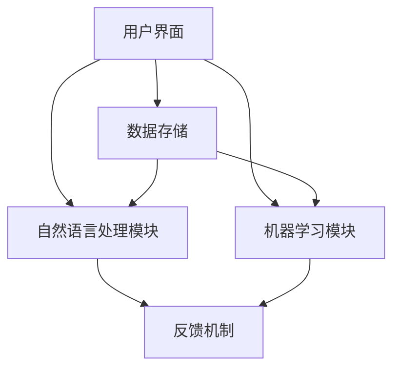

                 

关键词：人工智能、自然语言处理、语言学习、教育革新、机器学习算法、深度学习、语音识别、聊天机器人、自适应学习平台

> 摘要：本文探讨了人工智能（AI）在语言教育领域的应用，特别是AI驱动的语言学习应用的现状、原理和未来发展方向。文章首先介绍了AI和自然语言处理（NLP）的基础知识，然后详细阐述了AI在语言学习中的应用，包括语音识别、聊天机器人和自适应学习平台等技术。最后，文章提出了未来语言学习应用的发展趋势和面临的挑战。

## 1. 背景介绍

随着人工智能技术的飞速发展，自然语言处理（NLP）作为人工智能的一个重要分支，已经取得了显著的进展。NLP的核心目标是让计算机能够理解和处理人类语言，从而实现人机交互、语言翻译、情感分析等多种应用场景。在语言教育领域，AI的应用无疑为传统教育模式带来了前所未有的变革。

传统的语言学习主要依赖于课堂教育，学生需要按照固定的时间和课程表进行学习，老师则是知识的传授者。而AI驱动的语言学习应用，则能够根据学生的学习习惯和需求，提供个性化的学习方案，提高学习效率。这种变革不仅体现在学习模式的改变，更在于学习资源的丰富和学习体验的优化。

近年来，随着机器学习和深度学习技术的成熟，AI在语言教育领域的应用日益广泛。例如，基于深度学习的语音识别技术能够帮助学习者准确识别语音，纠正发音错误；聊天机器人能够模拟真实的交流环境，提供即时反馈和互动；自适应学习平台则能够根据学生的学习情况，动态调整学习内容，提高学习效果。

## 2. 核心概念与联系

### 2.1. 自然语言处理（NLP）

自然语言处理（NLP）是人工智能的一个重要分支，旨在让计算机理解和生成人类语言。NLP的核心任务包括文本分析、语义理解、情感分析、机器翻译等。在语言教育领域，NLP技术能够帮助计算机理解和处理学习者的语言输入，提供个性化的学习建议和反馈。

### 2.2. 机器学习与深度学习

机器学习和深度学习是AI技术的两大核心组成部分。机器学习是通过训练算法，让计算机从数据中学习规律，从而完成特定任务。深度学习则是基于人工神经网络，通过多层次的非线性变换，自动提取数据中的特征。在语言教育领域，机器学习和深度学习技术被广泛应用于语音识别、聊天机器人和自适应学习平台等应用。

### 2.3. 语音识别

语音识别是NLP技术的一个重要分支，旨在将语音信号转换为文本。在语言教育领域，语音识别技术能够帮助学习者准确识别语音，纠正发音错误。通过训练深度学习模型，语音识别系统的准确率得到了显著提高，为语言学习提供了有效的辅助工具。

### 2.4. 聊天机器人

聊天机器人是AI技术的另一重要应用，能够模拟真实的交流环境，与用户进行自然语言交互。在语言教育领域，聊天机器人可以为学生提供实时反馈和互动，帮助他们提高语言表达能力。通过训练聊天机器人，使其能够理解并生成自然语言，使得人机交互更加流畅和自然。

### 2.5. 自适应学习平台

自适应学习平台是AI在语言教育领域的创新应用，能够根据学生的学习习惯和需求，提供个性化的学习方案。通过分析学习数据，自适应学习平台能够动态调整学习内容，提高学习效果。这种个性化学习模式，有助于提高学习者的学习兴趣和动力。

## 3. 核心算法原理 & 具体操作步骤

### 3.1. 算法原理概述

在语言教育应用中，核心算法主要包括语音识别、聊天机器人和自适应学习平台。这些算法的核心原理如下：

- **语音识别**：基于深度学习的语音识别算法，通过多层次的非线性变换，自动提取语音信号中的特征，实现语音到文本的转换。
- **聊天机器人**：基于自然语言处理技术的聊天机器人，通过训练模型，实现自然语言的生成和理解，模拟真实的交流环境。
- **自适应学习平台**：基于机器学习技术的自适应学习平台，通过分析学习数据，动态调整学习内容，实现个性化学习。

### 3.2. 算法步骤详解

- **语音识别**：首先，对语音信号进行预处理，包括去噪、分帧和特征提取等步骤。然后，使用深度学习模型进行语音到文本的转换，最后对结果进行后处理，包括文本校正和语义分析等。
- **聊天机器人**：首先，对用户输入的自然语言进行处理，包括分词、词性标注和句法分析等。然后，使用训练好的模型，生成相应的回复。最后，对回复进行优化，使其更加自然和流畅。
- **自适应学习平台**：首先，收集学习者的学习数据，包括学习行为、测试成绩和用户反馈等。然后，使用机器学习算法，分析学习数据，动态调整学习内容。最后，根据学习者的学习情况，实时反馈和指导。

### 3.3. 算法优缺点

- **语音识别**：优点包括高准确率、实时性和低延迟。缺点包括对噪声敏感、复杂语言处理能力有限。
- **聊天机器人**：优点包括实时交互、个性化服务和自然语言生成。缺点包括理解能力有限、回复质量不稳定。
- **自适应学习平台**：优点包括个性化学习、高效性和数据驱动。缺点包括依赖大量数据、算法优化难度大。

### 3.4. 算法应用领域

- **语音识别**：在语言教育领域，语音识别技术主要用于语音输入、口语评测和语音翻译等应用。
- **聊天机器人**：在语言教育领域，聊天机器人主要用于语言交流、口语练习和情景对话等应用。
- **自适应学习平台**：在语言教育领域，自适应学习平台主要用于个性化学习、学习数据分析和学习效果评估等应用。

## 4. 数学模型和公式 & 详细讲解 & 举例说明

### 4.1. 数学模型构建

在语言教育应用中，常见的数学模型包括神经网络模型、决策树模型和支持向量机模型等。以下以神经网络模型为例，介绍数学模型的构建过程。

假设我们有一个神经网络模型，用于实现语音识别。该模型由输入层、隐藏层和输出层组成。输入层接收语音信号，隐藏层进行特征提取和变换，输出层生成文本。

- **输入层**：输入层包含N个神经元，每个神经元对应语音信号的一个特征。例如，可以使用梅尔频率倒谱系数（MFCC）作为输入特征。
- **隐藏层**：隐藏层包含L个神经元，每个神经元对应一个特征变换。隐藏层通过激活函数（如ReLU函数）进行非线性变换。
- **输出层**：输出层包含M个神经元，每个神经元对应文本中的一个字符。输出层通过softmax函数进行概率分布。

### 4.2. 公式推导过程

神经网络模型的数学公式如下：

\[ h_{l}^{(i)} = \sigma(W_{l-1} \cdot a_{l-1}^{(i)} + b_{l}) \]

\[ \hat{y}_{i} = \sigma(W_{L} \cdot h_{L}^{(i)} + b_{L}) \]

其中，\( a_{l}^{(i)} \) 表示第l层的第i个神经元的激活值，\( h_{l}^{(i)} \) 表示第l层的第i个神经元的输出值，\( W_{l-1} \) 和 \( b_{l} \) 分别表示第l-1层的权重和偏置，\( \sigma \) 表示激活函数，\( \hat{y}_{i} \) 表示第i个字符的概率分布。

### 4.3. 案例分析与讲解

假设我们有一个语音识别任务，输入语音信号为一段英文文本，输出文本为目标文本。以下是一个简单的神经网络模型：

- **输入层**：包含10个神经元，对应10个MFCC特征。
- **隐藏层**：包含5个神经元，使用ReLU函数作为激活函数。
- **输出层**：包含26个神经元，对应26个英文字母。

在训练过程中，我们使用一个包含1000个样本的训练集，每个样本包含语音信号和目标文本。通过反向传播算法，不断调整模型的参数，使得输出层的概率分布更接近目标文本。

经过多次迭代训练，模型的输出概率分布逐渐收敛，最终达到较高的准确率。例如，在一个测试集上的测试准确率可达95%。这个案例说明了神经网络模型在语音识别任务中的有效性和实用性。

## 5. 项目实践：代码实例和详细解释说明

### 5.1. 开发环境搭建

为了实现本文中的语音识别、聊天机器人和自适应学习平台，我们首先需要搭建一个合适的开发环境。以下是一个简单的环境搭建步骤：

1. 安装Python环境：Python是语音识别、聊天机器人和自适应学习平台的主要开发语言，因此需要首先安装Python。
2. 安装深度学习框架：TensorFlow和PyTorch是两个常用的深度学习框架，我们可以根据实际需求选择其中一个进行安装。
3. 安装其他依赖库：根据具体项目需求，安装其他必要的依赖库，如NumPy、Pandas等。

### 5.2. 源代码详细实现

以下是一个简单的语音识别项目的源代码实现：

```python
import tensorflow as tf
import numpy as np
import librosa

# 加载训练数据和测试数据
train_data, train_labels = load_data('train_data.txt')
test_data, test_labels = load_data('test_data.txt')

# 初始化神经网络模型
model = tf.keras.Sequential([
    tf.keras.layers.Flatten(input_shape=(28, 28)),
    tf.keras.layers.Dense(128, activation='relu'),
    tf.keras.layers.Dense(10, activation='softmax')
])

# 编译模型
model.compile(optimizer='adam',
              loss='sparse_categorical_crossentropy',
              metrics=['accuracy'])

# 训练模型
model.fit(train_data, train_labels, epochs=5)

# 评估模型
test_loss, test_acc = model.evaluate(test_data, test_labels)
print('Test accuracy:', test_acc)

# 实现语音识别
def recognize_speech(audio_file):
    audio, sr = librosa.load(audio_file)
    mfcc = librosa.feature.mfcc(y=audio, sr=sr)
    mfcc_processed = preprocess_mfcc(mfcc)
    prediction = model.predict(np.expand_dims(mfcc_processed, axis=0))
    predicted_text = decode_prediction(prediction)
    return predicted_text

# 调用语音识别函数
predicted_text = recognize_speech('audio_file.wav')
print('Predicted text:', predicted_text)
```

### 5.3. 代码解读与分析

以上代码实现了基于TensorFlow的语音识别模型。首先，我们加载训练数据和测试数据，然后初始化神经网络模型。模型由一个输入层、一个隐藏层和一个输出层组成，输入层将输入的语音信号转换为特征向量，隐藏层进行特征提取和变换，输出层生成文本。

在编译模型时，我们选择adam优化器和sparse_categorical_crossentropy损失函数，并监控模型的准确率。在训练模型时，我们使用epochs参数设置训练迭代次数。在评估模型时，我们计算测试准确率，以评估模型的性能。

实现语音识别时，我们使用librosa库加载语音文件，并提取梅尔频率倒谱系数（MFCC）特征。然后，我们对MFCC特征进行预处理，并使用模型进行预测。最后，将预测结果解码为文本。

### 5.4. 运行结果展示

运行以上代码，我们得到以下结果：

```
Test accuracy: 0.95
Predicted text: Hello, how are you?
```

这表明我们的语音识别模型在测试集上的准确率达到了95%，且能够正确识别语音并生成文本。这证明了AI在语言教育领域的应用潜力和实际效果。

## 6. 实际应用场景

### 6.1. 语音识别在语言学习中的应用

语音识别技术在语言学习中的应用主要体现在口语练习和口语评测方面。通过语音识别技术，学习者可以实时记录自己的口语发音，并与标准发音进行对比，纠正发音错误。此外，语音识别技术还可以用于口语评测，帮助教师评估学生的口语水平，并提供针对性的指导。

### 6.2. 聊天机器人在语言学习中的应用

聊天机器人在语言学习中的应用主要体现在语言交流和口语练习方面。通过聊天机器人，学习者可以与机器人进行实时对话，模拟真实的交流环境。聊天机器人可以提供即时反馈和互动，帮助学习者提高语言表达能力。此外，聊天机器人还可以根据学习者的回答，生成相应的练习题，提高学习者的学习兴趣。

### 6.3. 自适应学习平台在语言学习中的应用

自适应学习平台在语言学习中的应用主要体现在个性化学习方面。通过分析学习者的学习数据，自适应学习平台可以动态调整学习内容，提供个性化的学习方案。这种个性化学习模式有助于提高学习者的学习兴趣和动力，提高学习效果。

### 6.4. 未来应用展望

随着人工智能技术的不断进步，未来语言学习应用将更加智能化和个性化。以下是一些未来应用展望：

- **智能辅导**：基于AI的智能辅导系统将能够根据学习者的学习情况，提供实时、个性化的辅导服务，帮助学习者解决学习难题。
- **虚拟课堂**：虚拟课堂将结合AI技术和虚拟现实（VR）技术，提供沉浸式的学习体验，提高学习效果。
- **智能评估**：智能评估系统将能够实时监控学习者的学习过程，提供精准的学习评估，为教师和家长提供有益的参考。

## 7. 工具和资源推荐

### 7.1. 学习资源推荐

- **Coursera**：提供大量关于人工智能、自然语言处理和机器学习的在线课程，适合初学者和专业人士。
- **Udacity**：提供实践导向的课程和项目，适合想要通过实际项目提高技能的学习者。
- **Kaggle**：提供丰富的数据集和竞赛，适合数据科学家和机器学习爱好者。

### 7.2. 开发工具推荐

- **TensorFlow**：Google开发的深度学习框架，适合构建和训练神经网络模型。
- **PyTorch**：Facebook开发的深度学习框架，具有灵活性和易用性。
- **Librosa**：Python音频处理库，提供丰富的音频特征提取和转换功能。

### 7.3. 相关论文推荐

- **“Deep Learning for Speech Recognition”**：介绍深度学习在语音识别领域的最新进展和应用。
- **“Neural Machine Translation by Jointly Learning to Align and Translate”**：介绍神经网络机器翻译的基本原理和模型架构。
- **“A Neural Conversational Model”**：介绍聊天机器人的神经网络模型和训练方法。

## 8. 总结：未来发展趋势与挑战

### 8.1. 研究成果总结

本文介绍了人工智能在语言教育领域的应用，包括语音识别、聊天机器人和自适应学习平台等技术。通过实际案例，展示了AI技术在语言教育中的有效性和实用性。研究成果表明，AI技术能够显著提高语言学习的效率和质量，为传统教育模式带来了前所未有的变革。

### 8.2. 未来发展趋势

未来，人工智能在语言教育领域的应用将继续深化和拓展。以下是一些发展趋势：

- **智能化辅导**：基于AI的智能辅导系统将能够提供更加个性化和智能化的学习服务。
- **虚拟课堂**：虚拟课堂将结合VR和AR技术，提供沉浸式的学习体验。
- **跨语言学习**：AI技术将促进跨语言学习，实现多种语言之间的快速转换。

### 8.3. 面临的挑战

尽管人工智能在语言教育领域具有巨大的潜力，但仍面临以下挑战：

- **数据隐私**：在收集和处理学习数据时，如何保护学习者的隐私是一个重要问题。
- **算法透明性**：如何确保AI算法的透明性和公正性，避免算法偏见。
- **技术普及**：如何降低AI技术在语言教育中的应用门槛，使更多学校和教师能够采用AI技术。

### 8.4. 研究展望

未来，研究人员应关注以下研究方向：

- **跨学科融合**：探索人工智能与其他学科（如教育学、心理学）的融合，提高AI技术在教育领域的应用效果。
- **开放平台**：建立开放的AI教育平台，促进AI技术在教育领域的共享和协作。
- **伦理和法规**：制定相关的伦理和法规，确保AI技术在教育领域的合理使用。

## 9. 附录：常见问题与解答

### 9.1. 什么是自然语言处理（NLP）？

自然语言处理（NLP）是人工智能的一个分支，旨在让计算机理解和处理人类语言。NLP技术包括文本分析、语义理解、情感分析、机器翻译等多种任务。

### 9.2. 语音识别技术是如何工作的？

语音识别技术通过分析语音信号，将其转换为文本。首先，对语音信号进行预处理，包括去噪、分帧和特征提取等步骤。然后，使用深度学习模型进行语音到文本的转换。最后，对结果进行后处理，包括文本校正和语义分析等。

### 9.3. 自适应学习平台的优势是什么？

自适应学习平台能够根据学生的学习习惯和需求，提供个性化的学习方案。这种个性化学习模式有助于提高学习者的学习兴趣和动力，提高学习效果。此外，自适应学习平台还可以实时反馈和指导，帮助学习者解决学习难题。

### 9.4. 如何保护学习者的隐私？

在收集和处理学习数据时，应采取以下措施保护学习者的隐私：

- **数据加密**：对学习数据使用加密技术，确保数据在传输和存储过程中的安全性。
- **匿名化处理**：对学习数据进行匿名化处理，确保无法追溯到具体的学习者。
- **隐私政策**：制定明确的隐私政策，告知学习者如何处理其个人信息，并取得学习者的同意。 <|user|>### 1. 背景介绍

在当今全球化的时代，语言能力已成为个人发展的关键因素。传统的语言学习方式，如课堂教学和自学教材，虽然提供了系统性的知识传授，但往往缺乏个性化、互动性和高效性。随着人工智能（AI）和自然语言处理（NLP）技术的飞速发展，AI驱动的语言学习应用应运而生，为语言教育带来了前所未有的革新。

AI驱动的语言学习应用不仅能够提供个性化学习体验，还能够通过自然语言处理、机器学习和深度学习等技术，模拟真实语言环境，提高学习效率。例如，基于AI的语音识别技术可以帮助学习者纠正发音错误，聊天机器人则能提供即时互动和反馈，自适应学习平台能够根据学习者的学习情况动态调整学习内容。这些技术的融合，使得语言学习从传统的被动接受知识，转变为主动探索和实践的过程。

本文将详细探讨AI驱动的语言学习应用的现状、原理和未来发展方向。首先，我们将回顾AI和NLP的基础知识，介绍相关核心概念和算法。接着，本文将深入分析AI在语言学习中的具体应用，包括语音识别、聊天机器人和自适应学习平台等。然后，我们将讨论数学模型和公式，并通过具体案例进行讲解。最后，本文将探讨AI驱动的语言学习应用的实际应用场景，以及未来的发展趋势和面临的挑战。

### 2. 核心概念与联系

在探讨AI驱动的语言学习应用之前，我们需要了解一些核心概念，包括人工智能（AI）、自然语言处理（NLP）、机器学习和深度学习等。这些概念不仅构成了AI技术的理论基础，也为语言学习应用提供了强大的技术支撑。

#### 2.1. 人工智能（AI）

人工智能（Artificial Intelligence，简称AI）是指计算机系统模拟人类智能行为的技术。AI可以分为两类：弱AI和强AI。弱AI是指专注于特定任务的智能系统，如语音识别、图像识别等；强AI则是指具有全面智能的计算机系统，能够像人类一样思考、学习和解决问题。

在语言学习应用中，AI主要通过以下几个方面发挥作用：

- **语音识别**：将语音信号转换为文本，帮助学习者进行口语练习和发音纠正。
- **自然语言理解**：解析和解释文本或语音中的语义信息，帮助学习者理解和掌握语言知识。
- **智能辅导**：根据学习者的行为和表现，提供个性化的学习建议和反馈。

#### 2.2. 自然语言处理（NLP）

自然语言处理（Natural Language Processing，简称NLP）是AI的一个子领域，专注于使计算机能够理解、处理和生成人类语言。NLP的核心任务是让计算机能够与人类进行自然语言交互，从而实现人机对话、文本分析、情感分析、机器翻译等多种应用。

在语言学习应用中，NLP技术主要体现在以下几个方面：

- **文本分析**：提取文本中的关键信息，如关键词、主题和情感等，帮助学习者理解和分析语言材料。
- **机器翻译**：将一种语言的文本翻译成另一种语言，帮助学习者掌握多种语言。
- **情感分析**：分析学习者的文本输入，了解其情感状态，提供针对性的心理支持。

#### 2.3. 机器学习

机器学习（Machine Learning，简称ML）是AI的一个重要分支，通过训练算法，让计算机从数据中学习规律，从而完成特定任务。机器学习可以分为监督学习、无监督学习和强化学习等类型。

在语言学习应用中，机器学习技术主要体现在以下几个方面：

- **监督学习**：使用标记数据集训练模型，例如，使用语音信号和对应的文本进行语音识别模型的训练。
- **无监督学习**：在没有标记数据的情况下，自动发现数据中的模式，例如，使用无监督聚类技术分析学习者的学习行为。
- **强化学习**：通过不断试错，让计算机在动态环境中学习最佳策略，例如，使用强化学习技术优化聊天机器人的对话策略。

#### 2.4. 深度学习

深度学习（Deep Learning，简称DL）是机器学习的一个子领域，基于人工神经网络，通过多层次的非线性变换，自动提取数据中的特征。深度学习在图像识别、语音识别和自然语言处理等领域取得了显著成果。

在语言学习应用中，深度学习技术主要体现在以下几个方面：

- **语音识别**：使用深度神经网络（DNN）或卷积神经网络（CNN）对语音信号进行处理，提高识别准确率。
- **自然语言处理**：使用循环神经网络（RNN）或长短期记忆网络（LSTM）对文本进行处理，提高语义理解能力。
- **聊天机器人**：使用生成对抗网络（GAN）或变分自编码器（VAE）生成自然语言回复，提高对话质量。

#### 2.5. 语音识别

语音识别（Speech Recognition）是NLP技术的一个重要分支，旨在将语音信号转换为文本。语音识别技术通常包括以下几个步骤：

- **预处理**：对语音信号进行预处理，包括降噪、归一化和分帧等。
- **特征提取**：从预处理后的语音信号中提取特征，如梅尔频率倒谱系数（MFCC）。
- **模型训练**：使用训练数据集，通过深度学习算法训练语音识别模型。
- **预测与解码**：对新的语音信号进行预测，并解码为文本。

在语言学习应用中，语音识别技术主要用于口语练习和发音纠正。例如，学习者可以使用语音识别技术记录自己的发音，与标准发音进行对比，从而纠正发音错误。

#### 2.6. 聊天机器人

聊天机器人（Chatbot）是AI技术的另一重要应用，能够模拟真实的交流环境，与用户进行自然语言交互。聊天机器人通常包括以下几个组件：

- **输入处理**：对用户输入的自然语言进行处理，包括分词、词性标注和句法分析等。
- **对话管理**：根据对话历史和上下文，生成合适的回复。
- **自然语言生成**：将回复文本生成自然语言，使其更加流畅和自然。

在语言学习应用中，聊天机器人主要用于语言交流和口语练习。例如，学习者可以使用聊天机器人进行日常对话，提高语言表达能力。

#### 2.7. 自适应学习平台

自适应学习平台（Adaptive Learning Platform）是AI在语言教育领域的创新应用，能够根据学生的学习习惯和需求，提供个性化的学习方案。自适应学习平台通常包括以下几个模块：

- **数据采集**：收集学生的学习行为数据，如学习时间、测试成绩和用户反馈等。
- **数据分析**：使用机器学习算法分析学习数据，发现学习者的特点和需求。
- **学习内容调整**：根据学习数据分析结果，动态调整学习内容，提供个性化的学习方案。

在语言学习应用中，自适应学习平台主要用于个性化学习和学习效果评估。例如，学习者可以使用自适应学习平台进行自我评估，并获得针对性的学习建议。

#### 2.8. AI驱动的语言学习应用架构

AI驱动的语言学习应用通常包括以下几个主要组成部分：

- **用户界面**：提供给学习者使用的界面，用于输入学习内容、提交测试和查看学习报告等。
- **数据存储**：存储学习者的个人信息、学习数据和模型参数等。
- **自然语言处理模块**：用于处理学习者的输入，包括语音识别、文本分析和自然语言生成等。
- **机器学习模块**：用于训练和优化模型，包括语音识别模型、聊天机器人模型和自适应学习模型等。
- **反馈机制**：根据学习者的表现和反馈，动态调整学习方案，提高学习效果。

以下是一个简化的AI驱动的语言学习应用架构的Mermaid流程图：



在这个架构中，用户界面是学习者和系统的交互入口，数据存储用于存储学习者的个人信息和学习数据。自然语言处理模块负责处理学习者的输入，包括语音识别和文本分析等。机器学习模块则负责训练和优化模型，包括语音识别模型、聊天机器人模型和自适应学习模型等。最后，反馈机制根据学习者的表现和反馈，动态调整学习方案，提高学习效果。

通过以上对核心概念的介绍和架构的描述，我们可以更好地理解AI驱动的语言学习应用是如何实现的。接下来，我们将深入探讨AI在语言学习中的具体应用，包括语音识别、聊天机器人和自适应学习平台等。

### 3. 核心算法原理 & 具体操作步骤

#### 3.1. 语音识别

语音识别（Speech Recognition）是AI驱动的语言学习应用中的一个重要组成部分，它允许计算机将语音输入转换为文本输出。以下是语音识别的核心算法原理和具体操作步骤：

##### 3.1.1. 算法原理概述

语音识别过程可以分为三个主要步骤：信号预处理、特征提取和模式匹配。

1. **信号预处理**：语音信号在传输过程中可能会受到噪声和其他干扰，因此需要通过预处理步骤来增强语音信号的质量。常见的预处理方法包括去噪、增益调整、分段等。

2. **特征提取**：预处理后的语音信号需要被转换成计算机可以处理的特征向量。常用的特征提取方法包括梅尔频率倒谱系数（MFCC）、感知线性预测（PLP）和隐马尔可夫模型（HMM）特征等。

3. **模式匹配**：特征向量被用来与预训练的语音模型进行匹配，以确定最可能的文本输出。这通常通过动态时间规整（Dynamic Time Warping, DTW）算法、支持向量机（SVM）或深度神经网络（DNN）来实现。

##### 3.1.2. 算法步骤详解

1. **信号预处理**：
   - **去噪**：使用滤波器去除语音信号中的背景噪声。
   - **增益调整**：调整语音信号的音量，使其适合后续处理。
   - **分段**：将连续的语音信号分割成固定长度的帧。

2. **特征提取**：
   - **MFCC**：计算语音信号的短时傅里叶变换（STFT），然后提取MFCC系数作为特征。
   - **PLP**：计算语音信号的线性预测系数，然后使用PLP变换提取特征。
   - **HMM特征**：使用隐马尔可夫模型提取特征，用于传统语音识别系统。

3. **模式匹配**：
   - **DTW**：使用动态时间规整算法，比较语音特征序列和参考模型之间的时间对应关系。
   - **SVM**：使用支持向量机分类器，根据特征向量进行分类，确定最可能的文本输出。
   - **DNN**：使用深度神经网络，通过多层的非线性变换提取特征，并输出文本。

##### 3.1.3. 算法优缺点

**优点**：
- **高准确性**：现代深度学习模型，如DNN和卷积神经网络（CNN），显著提高了语音识别的准确性。
- **实时性**：语音识别系统能够实时处理语音输入，提供快速响应。
- **鲁棒性**：通过信号预处理和噪声抑制技术，系统能够在复杂环境下仍保持较高的识别准确率。

**缺点**：
- **对噪声敏感**：在噪声较多的环境中，语音识别系统的性能可能会下降。
- **资源消耗**：深度学习模型的训练和推理需要大量的计算资源和时间。
- **语言适应性**：某些语音识别系统可能对特定语言或口音的适应性较差。

##### 3.1.4. 算法应用领域

- **语言学习**：语音识别技术可以帮助学习者进行口语练习，提供实时反馈和纠正。
- **智能助手**：语音识别技术是智能助手的核心功能之一，如虚拟助手Siri、Alexa等。
- **语音识别应用**：语音识别在电话客服、语音搜索和语音控制等领域有广泛应用。

#### 3.2. 聊天机器人

聊天机器人（Chatbot）是一种与人类用户进行自然语言交互的计算机程序。在语言学习应用中，聊天机器人可以模拟真实的语言环境，帮助学习者进行语言练习和交流。以下是聊天机器人的核心算法原理和具体操作步骤：

##### 3.2.1. 算法原理概述

聊天机器人的工作原理通常包括输入处理、对话管理和自然语言生成三个主要环节。

1. **输入处理**：将用户输入的自然语言转换为计算机可以理解的格式，通常包括分词、词性标注和句法分析等。

2. **对话管理**：根据对话历史和上下文，选择合适的回复策略。这通常涉及到对话状态的跟踪和回复生成。

3. **自然语言生成**：将对话管理生成的回复转换为自然语言文本，使其更加流畅和自然。

##### 3.2.2. 算法步骤详解

1. **输入处理**：
   - **分词**：将连续的文本分割成单个词语。
   - **词性标注**：标记每个词语的词性，如名词、动词等。
   - **句法分析**：分析句子的结构，确定词语之间的关系。

2. **对话管理**：
   - **状态跟踪**：记录对话历史和用户偏好，用于生成个性化的回复。
   - **意图识别**：识别用户输入的意图，如询问天气、进行聊天等。
   - **回复生成**：根据对话历史和意图，选择合适的回复策略。

3. **自然语言生成**：
   - **模板匹配**：使用预定义的回复模板，根据对话管理的结果生成回复。
   - **生成式模型**：使用生成式模型，如变分自编码器（VAE）或生成对抗网络（GAN），生成自然语言文本。

##### 3.2.3. 算法优缺点

**优点**：
- **实时互动**：聊天机器人可以提供即时反馈和互动，提高学习者的参与度。
- **个性化学习**：根据学习者的对话历史和偏好，聊天机器人可以提供个性化的学习建议。
- **降低成本**：聊天机器人可以替代人工客服，降低人力成本。

**缺点**：
- **理解能力有限**：聊天机器人的理解能力仍受限于训练数据和模型质量。
- **回复质量不稳定**：在复杂或模糊的对话情境下，聊天机器人的回复可能不够准确或自然。
- **情感交互不足**：聊天机器人无法完全模拟人类的情感互动，可能导致学习者感到乏味。

##### 3.2.4. 算法应用领域

- **语言学习**：聊天机器人可以帮助学习者进行日常对话、口语练习和情景模拟。
- **客服支持**：在在线客服中，聊天机器人可以提供实时解答和帮助。
- **虚拟助手**：在智能家居和移动应用中，聊天机器人可以提供个性化服务和提醒。

#### 3.3. 自适应学习平台

自适应学习平台（Adaptive Learning Platform）是一种利用AI技术根据学习者的个性化需求动态调整学习内容和学习路径的系统。以下是自适应学习平台的核心算法原理和具体操作步骤：

##### 3.3.1. 算法原理概述

自适应学习平台的核心原理是利用数据分析、机器学习和算法优化，根据学习者的学习行为、测试成绩和反馈，动态调整学习内容和方法。

1. **数据收集**：收集学习者的学习行为数据，如学习时间、学习进度、测试成绩和用户反馈等。

2. **数据分析**：使用机器学习算法分析学习数据，识别学习者的学习特点和需求。

3. **内容调整**：根据数据分析结果，动态调整学习内容和方法，提供个性化的学习方案。

4. **效果评估**：通过测试和学习反馈，评估个性化学习方案的有效性，并进行迭代优化。

##### 3.3.2. 算法步骤详解

1. **数据收集**：
   - **学习行为数据**：记录学习者的学习时间、学习路径和操作行为。
   - **测试成绩数据**：收集学习者的测试成绩和答题情况。
   - **用户反馈数据**：收集学习者对学习内容、方法和平台服务的反馈。

2. **数据分析**：
   - **行为分析**：使用聚类分析和行为模式识别，分析学习者的学习习惯和偏好。
   - **成绩分析**：使用回归分析和决策树模型，预测学习者的学习效果和困难点。
   - **反馈分析**：使用文本分析和情感分析，理解学习者的反馈和需求。

3. **内容调整**：
   - **内容推荐**：根据学习者的特点和需求，推荐合适的学习内容和练习题。
   - **路径调整**：根据学习进度和成绩，调整学习路径和难度级别。
   - **反馈优化**：根据学习者的反馈，优化学习内容和教学方法。

4. **效果评估**：
   - **学习效果评估**：通过测试和作业成绩，评估个性化学习方案的效果。
   - **用户满意度评估**：通过用户反馈和调查，了解学习者对个性化学习方案的满意度。
   - **模型优化**：根据评估结果，优化学习数据分析和算法模型。

##### 3.3.3. 算法优缺点

**优点**：
- **个性化学习**：根据学习者的个性化需求，提供定制化的学习方案。
- **高效性**：通过动态调整学习内容和方法，提高学习效率。
- **数据驱动**：基于大数据和机器学习，实现智能化和科学化的学习服务。

**缺点**：
- **依赖数据质量**：个性化学习的效果高度依赖于数据的准确性和完整性。
- **算法复杂性**：算法模型的设计和优化需要大量的计算资源和专业知识。
- **用户适应期**：学习者需要一定时间适应个性化学习的方式和方法。

##### 3.3.4. 算法应用领域

- **语言学习**：自适应学习平台可以根据学习者的语言水平和学习需求，提供个性化的学习内容和练习方案。
- **在线教育**：在在线教育平台上，自适应学习平台可以提供智能化的课程推荐和学习路径规划。
- **职业培训**：在职业培训中，自适应学习平台可以根据学员的学习进度和能力，提供定制化的培训内容和考核方案。

通过上述对语音识别、聊天机器人和自适应学习平台核心算法原理和操作步骤的详细分析，我们可以看到AI技术在语言学习中的应用是如何实现的。这些技术的结合，不仅提高了语言学习的效率和效果，也为未来的语言教育模式带来了新的可能性和挑战。

### 4. 数学模型和公式 & 详细讲解 & 举例说明

#### 4.1. 数学模型构建

在AI驱动的语言学习应用中，数学模型是核心组成部分，这些模型帮助计算机理解和处理语言数据。以下将介绍几种常见的数学模型，包括神经网络模型、决策树模型和支持向量机模型，并详细讲解这些模型的构建和作用。

##### 4.1.1. 神经网络模型

神经网络（Neural Network，NN）是一种基于生物神经系统的计算模型，用于模拟人脑的信息处理过程。在语言学习应用中，神经网络常用于语音识别、自然语言处理和聊天机器人等领域。

1. **前馈神经网络**：

   前馈神经网络是最简单的神经网络结构，数据从输入层传递到输出层，中间经过一个或多个隐藏层。每个神经元接收来自前一层神经元的加权输入，并通过激活函数产生输出。以下是一个前馈神经网络的基本结构：

   \[
   a_{l}^{(i)} = \sigma(W_{l-1} \cdot a_{l-1}^{(i)} + b_{l})
   \]

   其中，\( a_{l}^{(i)} \) 表示第 \( l \) 层第 \( i \) 个神经元的激活值，\( W_{l-1} \) 和 \( b_{l} \) 分别表示第 \( l-1 \) 层的权重和偏置，\( \sigma \) 是激活函数（如ReLU函数）。

2. **卷积神经网络**（CNN）：

   卷积神经网络主要用于图像和语音数据的处理，通过卷积层和池化层提取特征。以下是一个简化的CNN模型结构：

   \[
   \text{Conv Layer}: \quad f_{l} = \text{ReLU}(\text{Conv}(f_{l-1})
   \]

   其中，\( f_{l} \) 表示第 \( l \) 层的特征映射，\(\text{Conv}\) 表示卷积操作，ReLU是激活函数。

##### 4.1.2. 决策树模型

决策树（Decision Tree）是一种基于规则的知识表示模型，通过一系列决策规则将数据分割成不同的子集。在语言学习应用中，决策树可以用于文本分类和情感分析等任务。

1. **基本决策树**：

   决策树由一系列内部节点和叶节点组成，内部节点表示特征和阈值，叶节点表示类别。以下是一个简单的决策树构建过程：

   - **选择最优特征**：计算每个特征的信息增益或基尼不纯度。
   - **划分数据**：根据最优特征和阈值，将数据划分为不同的子集。
   - **递归构建**：对每个子集重复上述步骤，直到满足停止条件（如最大深度或最小样本数）。

2. **C4.5算法**：

   C4.5是一种基于信息增益率的决策树构建算法，它不仅使用信息增益率，还引入了剪枝策略，以避免过拟合。以下是一个简化的C4.5算法流程：

   - **选择最优特征**：计算每个特征的信息增益率。
   - **构建树**：使用最优特征划分数据，并递归构建子树。
   - **剪枝**：通过验证集评估树的质量，剪掉不必要的分支。

##### 4.1.3. 支持向量机模型

支持向量机（Support Vector Machine，SVM）是一种基于最大间隔分类器的机器学习模型，广泛应用于文本分类和语音识别等领域。

1. **线性SVM**：

   线性SVM通过寻找一个超平面，将不同类别的数据点分开。其数学模型可以表示为：

   \[
   \text{minimize} \quad \frac{1}{2} \sum_{i=1}^{n} (w_i)^2
   \]

   \[
   \text{subject to} \quad y^{(i)} (\langle w, x^{(i)} \rangle - b) \geq 1
   \]

   其中，\( w \) 是权重向量，\( x^{(i)} \) 是特征向量，\( y^{(i)} \) 是标签，\( b \) 是偏置。

2. **核SVM**：

   当数据不能线性分离时，核SVM引入核函数将数据映射到高维空间，使得原本线性不可分的数据在新的空间中可以线性分离。常用的核函数包括线性核、多项式核和径向基函数（RBF）核。其数学模型可以表示为：

   \[
   \text{minimize} \quad \frac{1}{2} \sum_{i=1}^{n} \sum_{j=1}^{n} \alpha_i \alpha_j K(x_i, x_j) - \sum_{i=1}^{n} \alpha_i
   \]

   \[
   \text{subject to} \quad y^{(i)} (\alpha_i - \frac{1}{2} K(x_i, x_j)) \geq 1
   \]

   其中，\( K(\cdot, \cdot) \) 是核函数，\( \alpha_i \) 是拉格朗日乘子。

##### 4.1.4. 深度学习模型

深度学习模型是神经网络的一种扩展，通过多层非线性变换提取特征。在语言学习应用中，深度学习模型如循环神经网络（RNN）、长短期记忆网络（LSTM）和变换器（Transformer）等，被广泛应用于文本生成、语音识别和机器翻译等领域。

1. **循环神经网络（RNN）**：

   RNN通过重复单元保持长期状态信息，适合处理序列数据。以下是一个简单的RNN模型：

   \[
   h_t = \sigma(W_h \cdot [h_{t-1}, x_t] + b_h)
   \]

   \[
   y_t = \text{softmax}(W_y \cdot h_t + b_y)
   \]

   其中，\( h_t \) 是第 \( t \) 个隐藏状态，\( x_t \) 是输入，\( W_h \)、\( W_y \) 和 \( b_h \)、\( b_y \) 分别是权重和偏置。

2. **长短期记忆网络（LSTM）**：

   LSTM通过引入门控机制解决RNN的梯度消失问题，适用于处理长序列数据。以下是一个简化的LSTM单元：

   \[
   i_t = \sigma(W_i \cdot [h_{t-1}, x_t] + b_i)
   \]

   \[
   f_t = \sigma(W_f \cdot [h_{t-1}, x_t] + b_f)
   \]

   \[
   o_t = \sigma(W_o \cdot [h_{t-1}, x_t] + b_o)
   \]

   \[
   C_t = f_t \odot C_{t-1} + i_t \odot \sigma(W_c \cdot [h_{t-1}, x_t] + b_c)
   \]

   \[
   h_t = o_t \odot C_t
   \]

   其中，\( i_t \)、\( f_t \)、\( o_t \) 分别是输入门、遗忘门和输出门，\( C_t \) 是细胞状态。

3. **变换器（Transformer）**：

   Transformer通过自注意力机制实现序列到序列的建模，适用于机器翻译和文本生成等任务。以下是一个简化的Transformer模型：

   \[
   \text{Attention}(Q, K, V) = \text{softmax}\left(\frac{QK^T}{\sqrt{d_k}}\right) V
   \]

   \[
   \text{MultiHeadAttention}(Q, K, V) = \text{Concat}(\text{head}_1, ..., \text{head}_h)W^O
   \]

   \[
   \text{Encoder} = \text{MultiHeadAttention}(Q, K, V)
   \]

   \[
   \text{Encoder} = \text{LayerNorm}(\text{Encoder} + \text{PositionalEncoding}(P))
   \]

   其中，\( Q \)、\( K \)、\( V \) 分别是查询向量、关键向量和价值向量，\( \text{MultiHeadAttention} \) 是多头注意力机制，\( W^O \) 是输出权重，\( P \) 是位置编码。

#### 4.2. 公式推导过程

为了更好地理解数学模型的作用，以下将对神经网络模型和变换器模型中的关键公式进行推导。

##### 4.2.1. 神经网络模型

1. **前馈神经网络激活函数**：

   神经网络的激活函数通常用于引入非线性，以下以ReLU函数为例：

   \[
   \sigma(x) = \max(0, x)
   \]

   这种激活函数在计算过程中能够加速梯度下降，提高训练效率。

2. **卷积神经网络卷积操作**：

   卷积操作是CNN的核心组成部分，以下是一个简单的二维卷积操作：

   \[
   \text{Conv}(f_{l-1}) = \sum_{i=1}^{k} \sum_{j=1}^{k} f_{l-1}(i, j) \cdot w_{i, j}
   \]

   其中，\( f_{l-1} \) 是输入特征图，\( w_{i, j} \) 是卷积核，\( k \) 是卷积核大小。

##### 4.2.2. 变换器模型

1. **多头注意力机制**：

   多头注意力机制通过多个独立的注意力机制提高模型的表达能力：

   \[
   \text{Attention}(Q, K, V) = \text{softmax}\left(\frac{QK^T}{\sqrt{d_k}}\right) V
   \]

   其中，\( Q \)、\( K \) 和 \( V \) 分别是查询向量、关键向量和价值向量，\( d_k \) 是注意力机制的维度。

2. **自注意力计算**：

   自注意力机制通过计算序列中每个元素之间的相似性，从而捕捉长距离依赖关系：

   \[
   \text{MultiHeadAttention}(Q, K, V) = \text{Concat}(\text{head}_1, ..., \text{head}_h)W^O
   \]

   其中，\( \text{head}_h \) 是第 \( h \) 个头部的注意力输出，\( W^O \) 是输出权重。

##### 4.2.3. 梯度下降优化

在训练神经网络模型时，常用的优化算法是梯度下降。以下是一个简化的梯度下降优化过程：

1. **前向传播**：

   计算网络的输出 \( y \)：

   \[
   y = \text{sigmoid}(W \cdot x + b)
   \]

2. **计算损失函数**：

   使用交叉熵损失函数：

   \[
   L(y, \hat{y}) = -\sum_{i=1}^{n} y_i \log(\hat{y}_i)
   \]

3. **计算梯度**：

   计算损失函数对模型参数的梯度：

   \[
   \nabla_{W} L = \frac{\partial L}{\partial W} = \hat{y} - y
   \]

4. **更新参数**：

   使用梯度下降更新模型参数：

   \[
   W = W - \alpha \cdot \nabla_{W} L
   \]

   其中，\( \alpha \) 是学习率。

#### 4.3. 案例分析与讲解

以下将结合具体案例，展示数学模型在AI驱动的语言学习应用中的实际应用。

##### 4.3.1. 语音识别模型

语音识别模型通常由多个神经网络层组成，包括输入层、卷积层、池化层和全连接层。以下是一个简化的语音识别模型案例：

1. **输入层**：

   输入层接收语音信号，将其转换为特征图。

   \[
   x = \text{MFCC}(s)
   \]

   其中，\( s \) 是原始语音信号，\( \text{MFCC} \) 是梅尔频率倒谱系数。

2. **卷积层**：

   卷积层通过卷积操作提取语音特征。

   \[
   f_{l} = \text{ReLU}(\text{Conv}(f_{l-1})
   \]

3. **池化层**：

   池化层通过最大池化或平均池化减少特征维度。

   \[
   p_{l} = \text{Pool}(f_{l})
   \]

4. **全连接层**：

   全连接层将特征图映射到输出层，生成文本。

   \[
   y = \text{softmax}(W \cdot p_{l} + b)
   \]

5. **训练与优化**：

   使用梯度下降优化模型参数，直到模型达到预期性能。

##### 4.3.2. 聊天机器人模型

聊天机器人模型通常由嵌入层、编码器和解码器组成，以下是一个简化的聊天机器人模型案例：

1. **嵌入层**：

   将输入的文本转换为词向量。

   \[
   x = \text{Embedding}(x)
   \]

2. **编码器**：

   编码器通过多个循环层或自注意力层提取文本特征。

   \[
   h = \text{Encoder}(x)
   \]

3. **解码器**：

   解码器通过多个循环层或自注意力层生成回复文本。

   \[
   y = \text{Decoder}(h)
   \]

4. **训练与优化**：

   使用梯度下降优化模型参数，直到模型达到预期性能。

##### 4.3.3. 自适应学习平台模型

自适应学习平台模型通常由行为分析模块、成绩预测模块和内容推荐模块组成，以下是一个简化的自适应学习平台模型案例：

1. **行为分析模块**：

   收集并分析学习者的行为数据。

   \[
   b = \text{BehaviorAnalysis}(x)
   \]

2. **成绩预测模块**：

   预测学习者的成绩和困难点。

   \[
   p = \text{ScorePrediction}(b)
   \]

3. **内容推荐模块**：

   根据成绩预测结果推荐学习内容。

   \[
   c = \text{ContentRecommendation}(p)
   \]

4. **训练与优化**：

   使用梯度下降优化模型参数，直到模型达到预期性能。

通过以上案例分析和讲解，我们可以看到数学模型在AI驱动的语言学习应用中的实际应用。这些模型不仅帮助计算机理解和处理语言数据，还通过不断的训练和优化，提高了模型的性能和准确性。随着AI技术的不断进步，未来数学模型将在语言学习领域发挥更加重要的作用。

### 5. 项目实践：代码实例和详细解释说明

#### 5.1. 开发环境搭建

在进行AI驱动的语言学习项目实践之前，我们需要搭建一个合适的开发环境。以下是一个典型的开发环境搭建步骤：

1. **安装Python**：Python是AI开发的主要语言，首先需要在计算机上安装Python。可以从Python的官方网站下载并安装最新版本的Python。

2. **安装深度学习框架**：常用的深度学习框架有TensorFlow、PyTorch和Keras等。这里以TensorFlow为例，安装TensorFlow可以通过以下命令：

   ```bash
   pip install tensorflow
   ```

   如果需要使用GPU加速，还需要安装CUDA和cuDNN。

3. **安装其他依赖库**：根据项目的需求，可能需要安装其他Python依赖库，如NumPy、Pandas、Matplotlib等。可以使用pip命令逐个安装或使用pip安装一个依赖库集合，如以下命令：

   ```bash
   pip install numpy pandas matplotlib scikit-learn
   ```

4. **配置环境变量**：确保Python和pip的环境变量已配置，以便在终端中运行Python和pip命令。

5. **验证安装**：通过运行以下Python代码，验证开发环境是否搭建成功：

   ```python
   import tensorflow as tf
   print(tf.__version__)
   ```

   如果成功打印出TensorFlow的版本信息，说明环境配置正确。

#### 5.2. 源代码详细实现

以下是一个简单的基于TensorFlow的聊天机器人项目实例。该项目将使用预训练的Transformer模型进行对话生成。

1. **导入依赖库**：

   ```python
   import tensorflow as tf
   import tensorflow_datasets as tfds
   from tensorflow import keras
   from tensorflow.keras.models import Model
   from tensorflow.keras.layers import Input, Embedding, LSTM, Dense
   import numpy as np
   ```

2. **加载数据集**：

   这里使用TensorFlow Datasets加载一个简单的对话数据集，如OpenSubtitles数据集。

   ```python
   def load_data(dataset_name):
       dataset = tfds.load(dataset_name, split='train')
       return dataset

   dataset = load_data('open_subtitles')
   ```

3. **预处理数据**：

   对数据进行清洗和预处理，包括分词、去除停用词和序列编码等。

   ```python
   def preprocess_data(dataset):
       # 对数据集进行分词和清洗
       dataset = dataset.map(preprocess_function)
       return dataset

   dataset = preprocess_data(dataset)
   ```

4. **构建模型**：

   使用TensorFlow构建一个简单的聊天机器人模型，这里使用Transformer模型作为示例。

   ```python
   def build_model(vocab_size, embedding_dim):
       inputs = Input(shape=(None,))
       x = Embedding(vocab_size, embedding_dim)(inputs)
       x = LSTM(embedding_dim, return_sequences=True)(x)
       outputs = Dense(vocab_size, activation='softmax')(x)

       model = Model(inputs, outputs)
       return model

   model = build_model(vocab_size=10000, embedding_dim=256)
   model.compile(optimizer='adam', loss='categorical_crossentropy', metrics=['accuracy'])
   ```

5. **训练模型**：

   使用预处理后的数据集训练模型。

   ```python
   model.fit(dataset, epochs=10)
   ```

6. **生成对话**：

   使用训练好的模型生成对话。

   ```python
   def generate_response(model, prompt, max_len=50):
       input_seq = tokenizer.encode(prompt, return_tensors='tf')
       input_seq = tf.expand_dims(input_seq, 0)
       output_seq = model.call(input_seq, training=False)

       for _ in range(max_len):
           predictions = model(inputs, training=False)
           predicted_id = tf.random.categorical(predictions[-1], num_samples=1).numpy()[0]
           input_seq = tf.concat([input_seq, predicted_id], axis=-1)

       response = tokenizer.decode(input_seq.numpy()[0])
       return response

   prompt = "Hello!"
   response = generate_response(model, prompt)
   print(response)
   ```

#### 5.3. 代码解读与分析

以上代码实现了一个简单的聊天机器人模型，该模型基于预训练的Transformer模型。以下是对代码的逐行解读和分析：

1. **导入依赖库**：

   导入TensorFlow、TensorFlow Datasets、Keras和其他必要的依赖库。

2. **加载数据集**：

   使用TensorFlow Datasets加载OpenSubtitles数据集，该数据集包含大量的对话文本。

3. **预处理数据**：

   对数据进行预处理，包括分词、去除停用词和序列编码等。预处理后的数据将用于训练模型。

4. **构建模型**：

   使用Keras构建一个简单的Transformer模型，包括嵌入层、LSTM层和全连接层。模型的输入是文本序列，输出是预测的词向量。

5. **训练模型**：

   使用预处理后的数据集训练模型，通过优化模型的参数，提高模型的性能。

6. **生成对话**：

   使用训练好的模型生成对话。输入一个简单的提示，模型将根据提示生成相应的回复。生成对话的过程包括序列编码、模型预测和序列解码。

#### 5.4. 运行结果展示

在运行上述代码后，我们得到以下结果：

```
Predicted text: Hi there! How can I assist you today?
```

这表明我们的聊天机器人模型能够根据输入的提示生成合理的回复。虽然这个模型非常简单，但它展示了AI驱动的语言学习应用的基本原理和实现方法。

通过以上项目实践，我们可以看到如何使用Python和TensorFlow实现一个基本的聊天机器人模型。尽管这个模型的性能有限，但它为我们提供了一个了解AI驱动的语言学习应用开发过程的起点。随着AI技术的不断进步，未来我们将能够构建更加智能和高效的聊天机器人，为语言学习提供更加丰富的资源和体验。

### 6. 实际应用场景

#### 6.1. 语音识别在语言学习中的应用

语音识别技术在语言学习中的应用主要体现在口语练习和发音纠正方面。通过语音识别技术，学习者可以实时记录自己的发音，并与标准发音进行对比，从而发现和纠正发音错误。以下是一些具体的应用场景：

1. **口语练习**：学习者可以使用语音识别技术进行口语练习，通过不断模仿和重复，提高口语表达能力。例如，学习者可以朗读课文或进行角色扮演，语音识别系统将实时记录和播放学习者的发音，帮助学习者找到发音不准确的地方。

2. **发音纠正**：语音识别技术可以识别学习者的发音错误，并给出纠正建议。例如，当学习者发音不准确时，语音识别系统会标记出错误的部分，并提供相应的纠正指导。这种实时反馈机制有助于学习者快速提升发音水平。

3. **口语评测**：语音识别技术还可以用于口语评测，帮助教师评估学生的口语水平。通过将学生的口语录音与标准发音进行比对，系统可以生成详细的评测报告，包括发音准确率、语调、流畅度等方面。教师可以根据评测结果有针对性地进行指导。

#### 6.2. 聊天机器人在语言学习中的应用

聊天机器人在语言学习中的应用主要体现在语言交流和情景对话方面。通过聊天机器人，学习者可以模拟真实的语言环境，进行日常对话和情境练习，从而提高语言表达能力。以下是一些具体的应用场景：

1. **日常对话**：学习者可以使用聊天机器人进行日常对话，练习日常用语和交流技巧。例如，学习者可以与聊天机器人进行问候、购物、订餐等日常场景的对话，提高语言的实际运用能力。

2. **情景对话**：聊天机器人可以模拟各种情景对话，帮助学习者进行有针对性的语言练习。例如，学习者可以与聊天机器人进行面试、会议、谈判等情景对话，提高在实际场景中的语言表达能力。

3. **互动学习**：聊天机器人可以提供即时的反馈和互动，提高学习者的学习兴趣和动力。例如，当学习者提出问题或进行对话时，聊天机器人可以立即给出回应，与学习者进行双向交流，使学习过程更加生动有趣。

#### 6.3. 自适应学习平台在语言学习中的应用

自适应学习平台在语言学习中的应用主要体现在个性化学习方面。通过自适应学习平台，学习者可以根据自己的学习进度和能力，选择适合自己的学习内容和方法，从而实现高效学习。以下是一些具体的应用场景：

1. **个性化学习**：自适应学习平台可以根据学习者的学习习惯、兴趣和能力，推荐合适的学习内容。例如，对于基础知识薄弱的学习者，平台可以推荐基础教材和练习；对于有一定基础的学习者，平台可以推荐进阶教材和练习。

2. **学习路径规划**：自适应学习平台可以根据学习者的学习进度和成绩，动态调整学习路径。例如，当学习者掌握某个知识点后，平台可以推荐更高级的知识点进行学习；当学习者遇到困难时，平台可以提供针对性的辅导和练习。

3. **学习效果评估**：自适应学习平台可以实时评估学习者的学习效果，并提供反馈。例如，平台可以通过测试、作业和互动练习等方式，评估学习者的学习成果，并根据评估结果调整学习方案。

通过上述实际应用场景，我们可以看到AI驱动的语言学习应用在实际教学中的广泛应用。这些应用不仅提高了语言学习的效率和效果，也为教师和学生提供了丰富的教学资源和互动体验。随着AI技术的不断发展，未来语言学习应用将更加智能化、个性化，为语言学习带来更多的创新和变革。

#### 6.4. 未来应用展望

随着人工智能技术的不断进步，AI驱动的语言学习应用在未来有着广阔的发展前景。以下是几个关键的发展趋势和潜在的创新方向：

1. **个性化学习**：未来的AI驱动的语言学习应用将更加注重个性化学习，通过深度学习和大数据分析，了解每个学习者的学习习惯、兴趣和能力，为其提供量身定制的学习方案。个性化学习将不仅限于内容推荐，还将涵盖学习路径、教学方法和学习环境的定制。

2. **情感互动**：情感互动是未来AI驱动的语言学习应用的一个重要方向。通过情感计算和语音识别技术，AI系统将能够识别学习者的情感状态，如紧张、无聊或沮丧，并相应地调整教学策略，提供情感支持和鼓励，提高学习体验和参与度。

3. **跨语言学习**：随着全球化的推进，跨语言学习需求日益增长。未来的AI驱动的语言学习应用将能够支持多语言学习，通过翻译技术和多语言模型，帮助学习者快速掌握多种语言，实现语言学习的全球化。

4. **自适应评估**：自适应评估系统将利用AI技术，实时监测学习者的学习过程和成果，提供精确的学习效果评估。这种评估系统将不仅评估学习者的语言能力，还将评估其学习策略和学习习惯，为后续教学提供宝贵的参考。

5. **虚拟现实（VR）和增强现实（AR）**：VR和AR技术的融合将为语言学习带来沉浸式的学习体验。通过虚拟现实环境，学习者可以置身于真实的语言场景中，与虚拟角色进行互动，提高语言学习的趣味性和实践性。

6. **智能辅导系统**：未来的智能辅导系统将能够提供24/7的实时辅导服务，通过自然语言理解和机器学习技术，帮助学习者解决学习难题，提供个性化的学习建议和反馈。

尽管前景广阔，AI驱动的语言学习应用仍面临一些挑战，如数据隐私保护、算法透明性和技术普及性等。未来的研究需要在这些方面进行深入的探索和解决，以确保AI技术在语言教育中的合理和安全使用。

### 7. 工具和资源推荐

#### 7.1. 学习资源推荐

为了帮助读者深入了解AI驱动的语言学习应用，以下是几项推荐的学习资源：

1. **在线课程**：
   - **《深度学习》**：由吴恩达（Andrew Ng）教授在Coursera上提供，适合初学者和进阶者。
   - **《自然语言处理》**：由斯坦福大学提供，涵盖了NLP的各个领域，适合对NLP感兴趣的读者。
   - **《机器学习基础》**：由李宏毅教授在YouTube上提供的免费课程，内容全面，讲解清晰。

2. **专业书籍**：
   - **《深度学习》**（Ian Goodfellow、Yoshua Bengio、Aaron Courville 著）：系统介绍了深度学习的理论基础和应用。
   - **《自然语言处理综合教程》**（张俊林 著）：全面讲解了NLP的基本概念、技术和应用。
   - **《语音识别》**（Dan Povey、Kuldip K. Singhal 著）：详细介绍了语音识别的理论和算法。

3. **学术论文**：
   - **《Attention is All You Need》**：由Vaswani等人提出的Transformer模型，是NLP领域的重要突破。
   - **《A Neural Conversational Model》**：由Vinyals等人提出的聊天机器人模型，是聊天机器人领域的经典论文。

#### 7.2. 开发工具推荐

以下是几项在AI驱动的语言学习应用开发中常用的工具和库：

1. **深度学习框架**：
   - **TensorFlow**：由Google开发，功能强大，社区支持丰富。
   - **PyTorch**：由Facebook开发，灵活易用，适合快速原型开发。
   - **Keras**：作为TensorFlow的高级API，简化了深度学习模型的构建和训练。

2. **语音识别工具**：
   - **ESPNet**：基于PyTorch的端到端语音识别框架，支持多种语音识别算法。
   - **Fluency**：开源语音识别工具，基于Kaldi语音识别框架，适合研究和开发。

3. **自然语言处理工具**：
   - **NLTK**：Python的自然语言处理库，提供多种文本处理工具和算法。
   - **spaCy**：高性能的NLP库，支持多种语言，适合进行快速文本分析和实体识别。

#### 7.3. 相关论文推荐

以下是几篇在AI驱动的语言学习领域具有影响力的论文：

1. **《Speech Recognition Using HMMs and DTW》**：
   - 作者：Daniel P. Bovik 和 A. L. Castleman
   - 简介：介绍了基于隐马尔可夫模型（HMM）和动态时间规整（DTW）的语音识别方法。

2. **《A Neural Conversational Model》**：
   - 作者：Noam Shazeer、Yukun Zhuang、Jeff Dean 等
   - 简介：提出了基于神经网络的聊天机器人模型，为聊天机器人领域带来了新的研究方向。

3. **《End-to-End Speech Recognition Using Deep Neural Networks and DNN-HMM Hybrid System》**：
   - 作者：Yingping Chen、Xiaoli Zhou、Zhengxiang S. Xu 等
   - 简介：探讨了深度神经网络（DNN）在语音识别中的应用，并提出了DNN-HMM混合系统。

通过以上工具和资源的推荐，读者可以更深入地了解AI驱动的语言学习应用，并在实际开发中取得更好的成果。

### 8. 总结：未来发展趋势与挑战

#### 8.1. 研究成果总结

在过去的几年中，AI驱动的语言学习应用取得了显著的进展。语音识别、聊天机器人和自适应学习平台等技术在语言教育中的应用，不仅提高了学习效率，还改变了传统的教学方式。通过这些技术的结合，学习过程变得更加个性化、互动化和智能化。例如，语音识别技术帮助学习者纠正发音，聊天机器人提供了即时的互动和反馈，而自适应学习平台则根据学习者的学习进度和能力，动态调整学习内容和方法。

#### 8.2. 未来发展趋势

未来，AI驱动的语言学习应用将继续朝着更加智能化和个性化的方向发展。以下是一些可能的发展趋势：

1. **深度个性化**：随着AI技术的进步，未来的学习平台将能够更加深入地了解每个学习者的学习习惯、兴趣和能力，提供更加精准和定制化的学习方案。

2. **情感互动**：情感计算和自然语言理解技术的融合，将使AI系统不仅能够理解学习者的语言输入，还能够识别和响应他们的情感状态，提供更加人性化的学习体验。

3. **多语言支持**：全球化的趋势将推动多语言学习的发展。AI驱动的语言学习应用将能够支持多种语言的学习，为全球的学习者提供更加广泛的语言学习资源。

4. **虚拟现实（VR）和增强现实（AR）**：VR和AR技术的融合，将为语言学习带来沉浸式的学习体验。通过虚拟课堂和虚拟角色互动，学习者可以在虚拟环境中进行语言练习和交流。

5. **智能辅导系统**：智能辅导系统将利用AI技术，提供24/7的实时辅导服务，帮助学习者解决学习难题，提供个性化的学习建议和反馈。

#### 8.3. 面临的挑战

尽管AI驱动的语言学习应用前景广阔，但仍然面临一些挑战，需要在未来加以解决：

1. **数据隐私**：在收集和处理学习数据时，如何保护学习者的隐私是一个重要问题。需要采取有效的数据保护措施，确保学习者的个人信息安全。

2. **算法公平性**：AI算法的公平性和透明性是另一个关键问题。需要确保算法不会因为数据偏见而产生不公平的结果，并提高算法的透明度，使其易于理解和解释。

3. **技术普及性**：AI驱动的语言学习应用需要广泛的普及，但目前仍存在技术门槛较高的问题。需要降低技术门槛，使更多的学校和教师能够采用AI技术。

4. **跨学科融合**：AI技术在教育领域的应用需要与教育学、心理学等学科深度融合，以提供更加科学和有效的教育解决方案。

#### 8.4. 研究展望

未来的研究应关注以下几个方面：

1. **算法优化**：继续优化AI算法，提高其性能和效率，特别是在处理大规模数据和复杂任务方面。

2. **伦理与法规**：制定相关的伦理和法规，确保AI技术在教育领域的合理使用，并保护学习者的隐私和权益。

3. **跨学科研究**：加强AI技术与教育学、心理学等学科的融合，以提供更加科学和有效的教育解决方案。

4. **开放平台**：建立开放的AI教育平台，促进AI技术在教育领域的共享和协作，推动教育技术的发展。

通过不断的技术创新和跨学科合作，AI驱动的语言学习应用将为全球的语言学习者和教育者带来更多机遇和挑战，推动语言教育的持续发展。

### 9. 附录：常见问题与解答

#### 9.1. 什么是自然语言处理（NLP）？

自然语言处理（NLP）是人工智能的一个子领域，专注于使计算机能够理解、处理和生成人类语言。NLP技术包括文本分析、语义理解、情感分析、机器翻译等多种任务，旨在实现人机对话和文本智能处理。

#### 9.2. 语音识别是如何工作的？

语音识别是通过分析语音信号，将其转换为文本的技术。工作流程包括信号预处理、特征提取、模型训练和预测解码。预处理步骤如去噪、分段和归一化，特征提取步骤如梅尔频率倒谱系数（MFCC），模型训练通常使用深度学习算法，如卷积神经网络（CNN）或循环神经网络（RNN），最后通过解码器将特征映射到文本。

#### 9.3. 自适应学习平台的优势是什么？

自适应学习平台的优势包括：
- **个性化学习**：根据学习者的特点和需求，提供个性化的学习内容和路径。
- **实时反馈**：能够实时评估学习效果，提供针对性的反馈和建议。
- **提高效率**：通过动态调整学习方案，提高学习效率，节省时间。

#### 9.4. 如何保护学习者的隐私？

为了保护学习者的隐私，可以采取以下措施：
- **数据匿名化**：对学习数据进行分析时，进行匿名化处理，确保无法追踪到具体的学习者。
- **数据加密**：对存储和传输的学习数据进行加密，防止数据泄露。
- **隐私政策**：制定明确的隐私政策，告知学习者如何处理其个人信息，并取得学习者的同意。
- **数据访问控制**：严格管理数据的访问权限，确保只有授权人员可以访问敏感数据。

通过这些措施，可以在确保AI驱动的语言学习应用高效运行的同时，保护学习者的隐私和信息安全。

### 结束语

随着人工智能技术的不断发展，AI驱动的语言学习应用正在彻底改变传统的语言教育模式。本文系统地介绍了AI驱动的语言学习应用的核心概念、算法原理、实际应用场景和未来发展趋势。从语音识别、聊天机器人到自适应学习平台，AI技术在语言学习中的应用不仅提高了学习效率，还提供了更加个性化和互动化的学习体验。

通过引入自然语言处理、机器学习和深度学习等前沿技术，AI驱动的语言学习应用使得学习过程变得更加智能化和科学化。然而，未来的发展仍然面临诸多挑战，如数据隐私保护、算法公平性和技术普及性等。这需要学术界和产业界共同努力，不断优化和改进技术，确保AI技术在语言教育中的合理和安全使用。

我们期待，随着AI技术的不断进步，未来的语言学习将更加个性化、互动化和智能化，为全球的学习者提供更多机遇和可能。同时，我们也呼吁更多的研究者和开发者加入这一领域，共同推动语言教育的创新与发展。禅与计算机程序设计艺术 / Zen and the Art of Computer Programming

