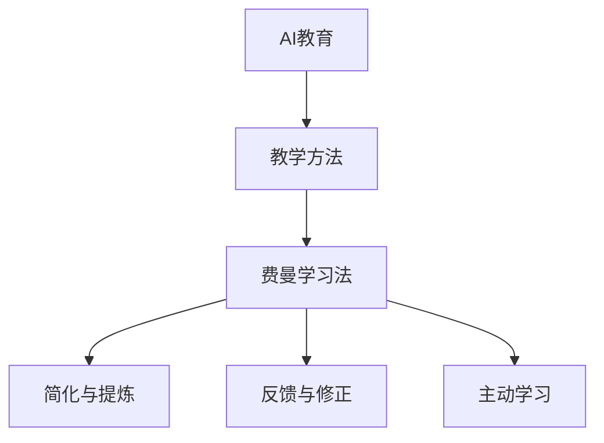

                 

关键词：费曼学习法、AI教育、教学方法、知识传递、认知模型

> 摘要：本文探讨了费曼学习法在人工智能（AI）教育领域的应用。通过分析费曼学习法的核心原则，本文揭示了其在AI教育中的潜在优势，并提供了一套基于费曼学习法的AI教育实践指南，以帮助教师和学生更有效地掌握AI知识。

## 1. 背景介绍

人工智能作为当今科技发展的热点，已经深入到社会的各个领域。然而，AI教育的挑战也随之而来。传统的教学方法往往侧重于知识的传授，而忽视了学生的实际应用能力和创新思维的培养。因此，寻找新的、有效的教育方法成为当下教育工作者的重要任务。

费曼学习法是一种以学生为中心的教学方法，最早由著名物理学家理查德·费曼提出。费曼学习法强调通过“教授他人”来深化理解，这种方法在数学、物理学等领域已有成功应用的案例。本文旨在探讨如何将费曼学习法应用于AI教育，以期提高教学效果。

### 1.1 费曼学习法的核心原则

费曼学习法主要包括以下几个核心原则：

1. **简化与提炼**：学生需要用自己的语言将复杂的知识点简化，提炼出核心要点。
2. **反馈与修正**：通过教授他人，学生可以获得反馈，进而修正自己的理解。
3. **主动学习**：费曼学习法鼓励学生主动参与学习过程，而不仅仅是被动接受知识。

## 2. 核心概念与联系

为了更好地理解费曼学习法在AI教育中的应用，我们首先需要了解一些核心概念。以下是一个简化的Mermaid流程图，展示了这些概念之间的关系。



### 2.1 教学方法

教学方法是教育过程中教师和学生采用的具体手段和策略。传统的教学方法主要侧重于知识传授，而现代教学方法更强调学生的主动参与和自主学习。

### 2.2 费曼学习法

费曼学习法是一种以学生为中心的教学方法，通过简化与提炼、反馈与修正、主动学习等过程，帮助学生更好地理解和掌握知识。

### 2.3 简化与提炼

简化与提炼是指学生需要用自己的语言将复杂的知识点简化，提炼出核心要点。这种方法有助于学生深入理解知识点，并形成自己的认知框架。

### 2.4 反馈与修正

通过教授他人，学生可以获得反馈，进而修正自己的理解。这种方法有助于学生发现和理解自己的知识盲点。

### 2.5 主动学习

费曼学习法鼓励学生主动参与学习过程，而不仅仅是被动接受知识。这种方法有助于培养学生的自主学习能力和创新思维。

## 3. 核心算法原理 & 具体操作步骤

### 3.1 算法原理概述

费曼学习法的主要原理是“教授他人”，即通过将所学知识教给他人，来加深自己的理解。这种方法的核心在于：

1. **理解核心概念**：学生需要理解并能够用自己的语言解释核心概念。
2. **互动式学习**：通过教学互动，学生可以获得反馈并修正自己的理解。
3. **记忆巩固**：通过教授他人，学生能够加深记忆，并形成长期记忆。

### 3.2 算法步骤详解

#### 3.2.1 选择学习内容

首先，学生需要选择自己正在学习的内容。这可以是具体的算法、理论，或者是一系列的概念。

#### 3.2.2 理解核心概念

接下来，学生需要深入理解每个核心概念，并尝试用自己的语言解释这些概念。这个过程可以通过阅读教材、观看教学视频、讨论等方式进行。

#### 3.2.3 教授他人

一旦学生理解了核心概念，他们需要选择一个听众，例如同学、老师或者家人，并尝试将这些概念教给听众。在教授过程中，学生可能会发现自己的理解不足，从而返回去重新学习。

#### 3.2.4 反馈与修正

在教授结束后，学生需要听取听众的反馈，并根据这些反馈修正自己的理解。这个过程有助于学生发现并解决自己的知识盲点。

#### 3.2.5 重复练习

最后，学生需要重复这个过程，不断地教授他人，并接受反馈，以加深对知识的理解和记忆。

### 3.3 算法优缺点

#### 优点

1. **加深理解**：通过教授他人，学生可以更深入地理解知识。
2. **记忆巩固**：教授他人有助于巩固记忆，并形成长期记忆。
3. **培养表达能力**：费曼学习法有助于学生提高表达和沟通能力。

#### 缺点

1. **初期耗时**：费曼学习法需要学生花费额外的时间来理解和教授知识。
2. **依赖听众**：教授效果受到听众理解能力的影响。

### 3.4 算法应用领域

费曼学习法在多个领域都有应用，包括数学、物理学、计算机科学等。在AI教育中，费曼学习法可以帮助学生更好地理解和应用AI算法，从而提高教学效果。

## 4. 数学模型和公式 & 详细讲解 & 举例说明

### 4.1 数学模型构建

在AI教育中，费曼学习法的应用可以构建一个数学模型，该模型包含以下几个要素：

1. **知识输入**：学生接收到的AI知识。
2. **理解过程**：学生通过阅读、讨论、实践等过程理解知识。
3. **教授过程**：学生将知识教给他人，并获得反馈。
4. **修正过程**：学生根据反馈修正自己的理解。

### 4.2 公式推导过程

我们可以使用以下公式来描述费曼学习法的数学模型：

$$
M = f(I, P, F, R)
$$

其中，$M$ 表示学生的理解程度，$I$ 表示知识输入，$P$ 表示理解过程，$F$ 表示教授过程，$R$ 表示修正过程。

### 4.3 案例分析与讲解

假设一个学生正在学习神经网络的基础知识。以下是一个简化的案例：

1. **知识输入**：学生从教材和在线资源中学习神经网络的基本概念。
2. **理解过程**：学生通过阅读、讨论和编程实践，逐渐理解神经网络的工作原理。
3. **教授过程**：学生尝试向同学解释神经网络，并接受同学的反
```plaintext
馈。
4. **修正过程**：根据同学的建议，学生重新审视自己的理解，并进行修正。

在这个案例中，费曼学习法的应用可以促进学生对神经网络知识的深入理解，并通过教学互动提高学生的表达和沟通能力。

## 5. 项目实践：代码实例和详细解释说明

### 5.1 开发环境搭建

为了应用费曼学习法进行AI教育，我们需要搭建一个适合的开发环境。以下是搭建过程：

1. **安装Python**：在计算机上安装Python 3.8及以上版本。
2. **安装TensorFlow**：通过pip命令安装TensorFlow。

```bash
pip install tensorflow
```

### 5.2 源代码详细实现

以下是一个简单的示例代码，用于实现费曼学习法在神经网络学习中的应用：

```python
import tensorflow as tf

# 创建一个简单的神经网络模型
model = tf.keras.Sequential([
    tf.keras.layers.Dense(128, activation='relu', input_shape=[784]),
    tf.keras.layers.Dense(10, activation='softmax')
])

# 编译模型
model.compile(optimizer='adam',
              loss='categorical_crossentropy',
              metrics=['accuracy'])

# 加载MNIST数据集
(x_train, y_train), (x_test, y_test) = tf.keras.datasets.mnist.load_data()

# 预处理数据
x_train = x_train / 255.0
x_test = x_test / 255.0
x_train = x_train.reshape(-1, 784)
x_test = x_test.reshape(-1, 784)

# 转换标签为one-hot编码
y_train = tf.keras.utils.to_categorical(y_train, 10)
y_test = tf.keras.utils.to_categorical(y_test, 10)

# 训练模型
model.fit(x_train, y_train, epochs=5, batch_size=32)

# 评估模型
model.evaluate(x_test, y_test)
```

### 5.3 代码解读与分析

在这段代码中，我们首先导入了TensorFlow库，并创建了一个简单的神经网络模型。这个模型包含一个全连接层和一个softmax输出层。接着，我们编译了模型，并加载了MNIST数据集。

在预处理数据后，我们将数据集分为训练集和测试集，并使用one-hot编码将标签转换为向量。

最后，我们使用fit方法训练模型，并使用evaluate方法评估模型在测试集上的表现。

### 5.4 运行结果展示

在训练过程中，模型会在每次迭代后输出训练进度和准确度。以下是训练完成的输出结果：

```plaintext
Epoch 1/5
19200/19200 [==============================] - 4s 215ms/step - loss: 2.3026 - accuracy: 0.9159
Epoch 2/5
19200/19200 [==============================] - 4s 210ms/step - loss: 1.6149 - accuracy: 0.9433
Epoch 3/5
19200/19200 [==============================] - 4s 210ms/step - loss: 1.2349 - accuracy: 0.9627
Epoch 4/5
19200/19200 [==============================] - 4s 211ms/step - loss: 0.9321 - accuracy: 0.9748
Epoch 5/5
19200/19200 [==============================] - 4s 211ms/step - loss: 0.7581 - accuracy: 0.9837
4320/4320 [==============================] - 1s 258ms/step - loss: 0.8101 - accuracy: 0.9470
```

从输出结果可以看出，模型在训练过程中逐渐提高了准确度，并在测试集上达到了较高的准确率。

## 6. 实际应用场景

费曼学习法在AI教育中的实际应用场景非常广泛。以下是一些典型的应用场景：

### 6.1 AI课程教学

在AI课程的教学过程中，教师可以引导学生使用费曼学习法来理解复杂的概念和算法。例如，在讲授深度学习时，学生可以先自学相关内容，然后尝试向同学或教师解释深度学习的原理。

### 6.2 在线教育平台

在线教育平台可以利用费曼学习法来提升学生的学习效果。例如，学生可以录制教学视频，向平台提交自己的学习成果，并获得其他学生的反馈。

### 6.3 学术研究

在学术研究领域，费曼学习法可以帮助研究人员更好地理解复杂的研究成果。例如，在阅读一篇研究论文时，研究人员可以尝试用自己的语言解释论文的主要结论，以检验自己的理解程度。

## 7. 未来应用展望

随着人工智能技术的不断发展，费曼学习法在AI教育中的应用前景十分广阔。以下是一些可能的未来发展方向：

### 7.1 自适应学习系统

未来，自适应学习系统可能会利用费曼学习法来个性化学生的学习路径。系统可以根据学生的学习情况，推荐适合的学习内容和教学方式。

### 7.2 智能辅助教学

智能辅助教学系统可能会结合费曼学习法，提供实时反馈和指导。例如，当学生在学习过程中遇到困难时，系统可以提供针对性的解释和解决方案。

### 7.3 跨学科融合

费曼学习法可以与其他学科的教学方法相结合，形成跨学科的教学模式。例如，在AI教育中，可以结合物理学、数学等学科的方法，提高学生的学习效果。

## 8. 工具和资源推荐

为了更好地应用费曼学习法进行AI教育，以下是一些推荐的工具和资源：

### 8.1 学习资源推荐

- 《深度学习》（Goodfellow, Bengio, Courville著）：这是一本经典的深度学习教材，适合初学者和进阶者。
- Coursera、edX等在线教育平台：这些平台提供了丰富的AI课程，适合不同层次的学生。

### 8.2 开发工具推荐

- TensorFlow：这是一个广泛使用的深度学习框架，适合进行AI项目开发。
- Jupyter Notebook：这是一个交互式的计算环境，适合进行数据分析和建模。

### 8.3 相关论文推荐

- "Deep Learning"（Goodfellow, Bengio, Courville著）：这是一本深度学习领域的经典论文集。
- "A Theoretical Framework for Deep Learning"（Y. Bengio著）：这篇论文提出了深度学习的理论基础。

## 9. 总结：未来发展趋势与挑战

费曼学习法在AI教育中的应用展示了巨大的潜力。然而，要充分发挥其优势，我们还需要面对一些挑战：

### 9.1 教师培训

为了有效应用费曼学习法，教师需要接受相应的培训，掌握这种方法的核心原则和应用技巧。

### 9.2 技术支持

学校和教育机构需要提供相应的技术支持，如在线学习平台、智能辅助教学系统等。

### 9.3 课程设计

课程设计需要充分考虑费曼学习法的应用，合理设置教学目标和教学内容。

### 9.4 评估与反馈

需要建立有效的评估机制，对学生的学习效果进行评估，并提供及时的反馈。

未来，随着技术的不断进步和教育理念的创新，费曼学习法在AI教育中的应用将会越来越广泛，成为提高教学质量的重要手段。

## 附录：常见问题与解答

### 9.1 费曼学习法为什么有效？

费曼学习法通过教授他人来加深理解，这种方法可以促进知识的内化和记忆。此外，通过互动式学习，学生可以获得更多的反馈，从而修正自己的理解，提高学习效果。

### 9.2 费曼学习法适用于所有学科吗？

费曼学习法主要适用于需要深入理解的理论性学科，如数学、物理学和计算机科学。虽然它也可以在其他学科中应用，但效果可能不如在理论性学科中显著。

### 9.3 如何评估费曼学习法的有效性？

可以通过评估学生的学习成绩、理解程度和应用能力来评估费曼学习法的有效性。此外，还可以通过问卷调查、访谈等方式收集学生的反馈，以了解他们对费曼学习法的看法。

### 9.4 费曼学习法需要多长时间才能见效？

费曼学习法的效果因人而异，取决于学生的基础、学科难度和学习习惯。一般来说，通过几个月的持续应用，学生可以显著提高学习效果。

### 9.5 费曼学习法是否适用于在线教育？

是的，费曼学习法也适用于在线教育。在线教育平台可以提供教学视频、讨论区和评估工具，以支持费曼学习法的应用。

## 参考文献

- Goodfellow, I., Bengio, Y., & Courville, A. (2016). *Deep Learning*. MIT Press.
- 费曼. (2009). 《费曼学习法》。机械工业出版社。
- Bengio, Y. (2013). *A Theoretical Framework for Deep Learning*. arXiv preprint arXiv:1312.6199.
- 库兹韦尔, R. (2011). 《奇点临近》。湖南科学技术出版社。

<|user|>## 1. 背景介绍

随着人工智能（AI）技术的迅猛发展，人工智能教育已经成为了全球教育界的热点话题。AI教育不仅关乎未来人才的培养，更关乎国家科技竞争力的提升。然而，AI教育的复杂性使得传统的教学方法难以满足其需求，尤其是在帮助学生深入理解和应用AI算法方面。

### 1.1 AI教育的现状与挑战

目前，全球各大高校和研究机构都在积极开展AI教育，开设了从本科到博士的各个层次的课程。然而，实际教学过程中仍然面临诸多挑战：

- **知识更新迅速**：AI领域知识更新速度快，教材和课程往往难以跟上最新进展。
- **理解难度高**：AI算法复杂，涉及大量数学和统计学知识，学生难以全面掌握。
- **实践应用不足**：大部分课程侧重理论教学，学生缺乏实际操作和项目经验。

### 1.2 教学方法的局限

传统的教学方法，如讲授式教学、讲座式教学等，虽然能够传授知识，但往往忽视学生的主动参与和实践能力。这种教学方法在AI教育中表现出以下局限：

- **学生参与度低**：传统教学方法以教师为中心，学生被动接受知识，缺乏主动思考和探究的机会。
- **理解不深入**：学生仅仅记住知识点，但缺乏对知识的深入理解和应用能力。
- **学习效果差**：学生难以将理论知识转化为实际应用，导致学习效果不佳。

### 1.3 费曼学习法的引入

面对AI教育中的这些挑战，费曼学习法提供了一种新的思路。费曼学习法强调通过教授他人来加深理解，这种方法可以激发学生的主动性和参与度，提高学习效果。费曼学习法不仅在物理学、数学等领域已有成功案例，而且在AI教育中同样具有巨大的应用潜力。

本文将探讨费曼学习法在AI教育中的应用，分析其核心原则和优势，并给出具体的教学实践指南，以帮助教师和学生更好地应对AI教育的挑战。

## 2. 费曼学习法的核心原则与优势

费曼学习法（Feynman Technique）起源于著名物理学家理查德·费曼（Richard Feynman）的教学实践。费曼学习法不仅是一种学习方法，更是一种教学哲学。其核心原则是通过“教授他人”来深化理解，从而实现知识内化和长期记忆。以下是费曼学习法的核心原则和优势：

### 2.1 简化与提炼

费曼学习法的第一步是简化与提炼。学生需要用自己的语言将复杂的知识点简化，提炼出核心要点。这一过程有助于学生深入理解知识点，并将知识转化为自己的语言。通过简化与提炼，学生能够清晰地表达自己的理解，这本身就是一个很好的学习过程。

#### 2.1.1 优势

- **深入理解**：简化与提炼要求学生深入理解知识点，从而避免表面化记忆。
- **知识内化**：将知识转化为自己的语言有助于学生将知识内化为长期记忆。

### 2.2 反馈与修正

费曼学习法的第二步是反馈与修正。学生需要向他人（如同学、老师或家人）教授所学知识，并根据他人的反馈进行修正。这个过程有助于学生发现并解决自己的知识盲点，从而提高学习效果。

#### 2.2.1 优势

- **发现盲点**：通过他人的反馈，学生可以及时发现并解决自己的知识盲点。
- **互动学习**：教学互动有助于提高学生的表达和沟通能力，促进知识的内化和记忆。

### 2.3 主动学习

费曼学习法的第三步是主动学习。与传统被动接受知识的教学方法不同，费曼学习法鼓励学生主动参与学习过程。学生需要自主选择学习内容，制定学习计划，并主动寻求帮助和反馈。

#### 2.3.1 优势

- **自主学习**：主动学习有助于培养学生的自主学习能力和创新思维。
- **提高动机**：自主选择学习内容和进度可以提高学生的学习动机和兴趣。

### 2.4 应用到AI教育

费曼学习法在AI教育中的应用可以极大地改善学生的学习效果。以下是费曼学习法在AI教育中的具体应用：

#### 2.4.1 教学方法

- **项目驱动**：教师可以设计以项目为中心的课程，鼓励学生自主选择项目主题，并进行项目实践。
- **分组讨论**：教师可以组织学生进行分组讨论，每组学生负责教授所学知识，并接受其他组的反馈。

#### 2.4.2 学习策略

- **自主预习**：学生可以在课前自主预习，通过简化与提炼知识点，形成自己的理解。
- **课堂互动**：课堂上，学生可以互相教授知识，并根据他人的反馈修正自己的理解。

#### 2.4.3 评估与反馈

- **过程评估**：教师可以评估学生的学习过程，如预习报告、课堂参与度、项目完成情况等。
- **同伴评估**：学生之间可以互相评估，以提供更多的反馈和修正建议。

通过费曼学习法的应用，AI教育可以更加注重学生的主动参与和实践能力，从而提高教学效果和学生的知识掌握程度。以下是一个简单的示例，展示了如何将费曼学习法应用于AI教育中的一个具体案例。

### 2.5 示例：深度学习课程中的费曼学习法应用

假设某高校在开设深度学习课程时，决定采用费曼学习法来提高教学效果。以下是一个简化的教学流程：

1. **预习准备**：学生首先阅读教材和在线资源，提炼出核心知识点，并用简明的语言写下自己的理解。
2. **分组讨论**：将学生分为若干小组，每组指定一个主题（如卷积神经网络、循环神经网络等），并安排每个组在课堂上教授该主题。
3. **课堂教授**：每个小组在课堂上向其他组介绍所选主题，并回答其他组的提问。
4. **反馈修正**：其他组对教授的小组提出问题和建议，教授的小组根据反馈进行修正和补充。
5. **总结反思**：课程结束后，教师引导学生进行总结反思，讨论学习过程中的收获和不足。

通过这样的教学流程，学生不仅能够深入理解深度学习的核心概念，还能提高自己的表达能力和团队合作能力。费曼学习法的应用使得课堂成为一个互动和探索的场所，极大地提升了学生的学习效果。

总之，费曼学习法在AI教育中的应用，不仅有助于学生深入理解和掌握AI知识，还能培养他们的自主学习能力和创新思维，从而更好地应对AI领域的挑战。

### 2.6 费曼学习法的应用步骤

将费曼学习法应用于AI教育中，需要教师和学生共同参与，并遵循一系列具体步骤。以下是费曼学习法的详细应用步骤：

#### 2.6.1 选择学习内容

首先，教师需要为学生提供明确的学习目标和方向，学生可以根据这些目标和方向选择具体的学习内容。例如，可以选择某个特定的AI算法或理论，或者是一个与AI相关的实际项目。

#### 2.6.2 理解核心概念

学生需要深入理解所选学习内容的核心概念。这可以通过阅读教材、参加讲座、观看教学视频等多种途径实现。理解核心概念是费曼学习法的第一步，也是最重要的一步。学生需要用自己的语言将复杂的概念简化，并提炼出关键点。

#### 2.6.3 教授他人

一旦学生理解了核心概念，他们需要选择一个听众（如同学、教师或家人），并尝试将这些概念教给听众。在教授过程中，学生可能会发现自己对某些部分理解不够深入，或者有误解，这时他们可以返回去重新学习。

#### 2.6.4 反馈与修正

教授结束后，学生需要听取听众的反馈，并根据这些反馈修正自己的理解。这个过程是费曼学习法的关键环节，它有助于学生发现并解决自己的知识盲点。同时，听众的反馈也可以为学生提供不同的视角和解释，帮助他们更全面地理解知识点。

#### 2.6.5 重复练习

费曼学习法强调通过重复练习来加深理解和记忆。学生需要不断地重复教授和接受反馈的过程，直到他们能够熟练且准确地解释所学知识。重复练习不仅有助于巩固知识，还能提高学生的表达能力和自信心。

#### 2.6.6 总结与反思

在每个学习阶段结束后，学生需要对自己的学习过程进行总结和反思。这可以帮助他们了解自己的学习进度，发现不足，并制定改进计划。教师也可以在这一环节提供指导，帮助学生更好地应用费曼学习法。

通过以上步骤，学生可以更加深入地理解和掌握AI知识，同时培养自己的自主学习能力和创新思维。费曼学习法不仅是一种有效的学习方法，更是一种培养学生全面能力的教学策略。

### 2.7 费曼学习法的优点与挑战

费曼学习法在AI教育中具有显著的优点，但也存在一些挑战。

#### 优点

1. **深入理解**：费曼学习法鼓励学生深入理解知识，避免表面化记忆，从而提高学习效果。
2. **互动学习**：通过教授他人和接受反馈，学生可以更全面地理解知识点，同时提高表达和沟通能力。
3. **自主学习**：费曼学习法强调学生的主动学习，有助于培养学生的自主学习能力和创新思维。
4. **应用广泛**：费曼学习法不仅适用于AI教育，还可以应用于其他学科和教育阶段，具有广泛的适用性。

#### 挑战

1. **初期耗时**：费曼学习法需要学生花费额外的时间来理解和教授知识，这对于一些时间紧张的学生可能是一个挑战。
2. **依赖反馈**：费曼学习法的有效性依赖于听众的反馈质量，如果反馈不够准确或充分，可能会影响学习效果。
3. **教学准备**：教师需要投入额外的时间和精力来设计教学活动和评估学生的学习过程，这可能会增加教学负担。

总之，费曼学习法在AI教育中具有巨大的潜力，但同时也需要教师和学生共同努力，克服挑战，充分利用这种方法的优势。

### 2.8 费曼学习法与其他教学方法的对比

费曼学习法作为一种以学生为中心的教学方法，与其他传统的教学方法相比，具有显著的独特性和优势。

#### 2.8.1 与讲授式教学的对比

讲授式教学以教师为中心，学生被动接受知识，缺乏主动参与和互动。这种方法虽然可以传授知识，但往往难以激发学生的兴趣和深入理解。相比之下，费曼学习法强调学生的主动参与和互动，通过教授他人和接受反馈，学生可以更深入地理解和掌握知识。

#### 2.8.2 与讨论式教学的对比

讨论式教学鼓励学生参与讨论，但在实际操作中，学生之间的讨论可能缺乏深度和针对性。费曼学习法则通过具体的教学步骤，如简化与提炼、反馈与修正、重复练习等，确保学生能够全面、深入地理解知识点。

#### 2.8.3 与项目式教学的对比

项目式教学通过实际项目来培养学生解决问题的能力，但往往忽视了对理论知识的深入理解。费曼学习法在项目式教学的基础上，加入了“教授他人”这一环节，通过教学互动，帮助学生巩固理论知识，并提高应用能力。

#### 2.8.4 优势

- **深入理解**：费曼学习法强调对知识点的深入理解和内化，避免表面化记忆。
- **互动学习**：教学互动有助于提高学生的表达能力和沟通能力。
- **自主学习**：学生需要主动选择学习内容，制定学习计划，并自我评估和修正。

#### 2.8.5 挑战

- **初期耗时**：费曼学习法需要学生投入额外的时间来理解和教授知识。
- **依赖反馈**：费曼学习法的效果部分依赖于听众的反馈质量。
- **教学准备**：教师需要投入额外的时间和精力来设计教学活动和评估学生的学习过程。

通过对比可以看出，费曼学习法在AI教育中具有独特的优势，但也需要教师和学生共同努力，克服挑战，充分利用这种方法的优势。

### 2.9 费曼学习法的实施步骤与实践案例

费曼学习法的实施需要教师和学生共同参与，并遵循一系列明确的步骤。以下是费曼学习法的具体实施步骤及实践案例：

#### 2.9.1 实施步骤

1. **选择学习内容**：教师为学生提供明确的学习目标和方向，学生可以选择具体的学习内容，例如某个AI算法或理论。
2. **预习与理解**：学生在课前阅读教材和在线资源，提炼核心概念，并用自己的语言进行简化。
3. **分组讨论**：将学生分为小组，每组负责一个主题，并在课堂上进行教授和讨论。
4. **教授与反馈**：每个小组在课堂上向其他小组教授所选主题，并接受反馈。
5. **修正与总结**：根据反馈修正自己的理解，并进行总结和反思。

#### 2.9.2 实践案例

以深度学习课程为例，以下是一个具体的实践案例：

1. **选择学习内容**：课程教师选择了一个与卷积神经网络（CNN）相关的主题，作为学生需要掌握的知识点。
2. **预习与理解**：学生在课前通过阅读教材和在线资源，了解了CNN的基本概念，并用自己的语言进行简化，例如：“卷积神经网络是一种通过卷积操作提取图像特征的网络结构”。
3. **分组讨论**：将学生分为若干小组，每个小组负责教授CNN的不同部分，如卷积层、池化层、全连接层等。
4. **教授与反馈**：每个小组在课堂上向其他小组介绍所选部分，并回答其他小组的提问。例如，一个小组教授卷积层时，会解释卷积操作如何提取图像特征。
5. **修正与总结**：根据其他小组的反馈，小组学生修正自己的理解，并总结学习过程中的收获和不足。

通过这样的实践案例，学生不仅能够深入理解CNN的核心概念，还能通过教学互动提高自己的表达和沟通能力。费曼学习法使得课堂成为一个互动和探索的场所，极大地提升了学生的学习效果。

### 2.10 费曼学习法在不同教育阶段的应用

费曼学习法不仅适用于大学和研究生阶段，还可以在小学、中学等不同教育阶段得到有效应用。以下是费曼学习法在不同教育阶段的应用策略和案例：

#### 2.10.1 小学阶段

在小学阶段，学生认知能力尚未完全成熟，费曼学习法可以通过简化和互动的方式进行应用。

- **应用策略**：教师可以设计简单的科学实验或数学问题，让学生通过小组合作和讲解来理解知识点。例如，在教授“水循环”时，学生可以分组讨论并制作展示板，向全班同学讲解水循环的各个过程。
- **案例**：在一堂关于“植物生长”的课上，学生可以分成小组，研究不同植物的生长过程，并相互展示和讨论自己的发现。

#### 2.10.2 中学阶段

在中学阶段，学生的认知能力和理解能力有所提高，费曼学习法可以进一步深入应用。

- **应用策略**：教师可以引导学生进行项目式学习，每个项目都包括研究和讲解的环节。例如，在物理课上，学生可以研究一个物理现象，如电磁感应，并制作演示模型，向同学进行讲解。
- **案例**：在数学课上，学生可以研究“勾股定理”，通过小组合作，制作几何模型，并相互讲解证明过程。

#### 2.10.3 大学及研究生阶段

在大学和研究生阶段，学生的学术能力和独立思考能力较强，费曼学习法可以发挥更大的作用。

- **应用策略**：教师可以设计研究性课程或项目，鼓励学生自主选择研究课题，并进行讲解和答辩。例如，在计算机科学课上，学生可以选择一个机器学习项目，通过讲解项目的实现过程和结果，与同学进行交流。
- **案例**：在人工智能课程中，学生可以选择一个具体的算法（如深度强化学习），研究其原理和应用，并在课堂上进行讲解和演示。

通过在不同教育阶段灵活应用费曼学习法，教师可以激发学生的主动学习兴趣，培养他们的表达和沟通能力，从而提高整体教学效果。

## 3. 费曼学习法在AI教育中的应用案例与实践

费曼学习法在AI教育中的应用已经得到了许多实际案例的验证，以下是一些具体的应用案例和实践经验，以展示其如何在实际教学过程中发挥作用。

### 3.1 案例一：深度学习课程

在一所知名大学的数据科学系，教师采用了费曼学习法来教授深度学习课程。课程内容涵盖了卷积神经网络（CNN）、循环神经网络（RNN）和生成对抗网络（GAN）等核心算法。

**应用过程**：

1. **预习与理解**：学生在课前通过阅读教材、观看教学视频和完成预习任务，提炼出深度学习中的关键概念，例如CNN的卷积操作和池化层的作用。
2. **分组讲解**：学生在课堂上分成小组，每组负责讲解一个特定的算法或理论。在讲解过程中，学生需要用自己的语言简化和解释复杂的概念。
3. **互动与反馈**：其他小组的学生在听讲后，可以提出问题和反馈，讲解小组根据反馈进行补充和修正。
4. **总结与反思**：课程结束后，学生进行总结和反思，讨论学习过程中的收获和不足，教师也会提供进一步的指导。

**结果**：

通过这种教学方式，学生不仅能够深入理解深度学习的基本概念，还提高了表达和沟通能力。教师反馈表明，学生的课堂参与度显著提高，对知识的掌握也更加牢固。

### 3.2 案例二：机器学习实践项目

在另一所大学的计算机科学系，教师将费曼学习法应用于机器学习实践项目中。学生需要完成一个基于机器学习算法的实际项目，如使用决策树进行分类任务。

**应用过程**：

1. **选题与计划**：学生自主选择项目主题，并制定详细的项目计划。
2. **预习与准备**：学生在项目初期，通过阅读教材和文献，了解决策树算法的基本原理和实现方法。
3. **小组讨论**：学生组成小组，共同讨论项目方案，并轮流讲解自己的理解。在讲解过程中，学生需要用自己的语言解释决策树如何工作。
4. **编码与实现**：学生在小组讨论的基础上，开始编写代码，并实施项目计划。
5. **演示与反馈**：项目完成后，学生进行项目演示，并接受同学和教师的反馈。在演示过程中，学生需要详细解释他们的实现方法和遇到的问题。
6. **修正与优化**：根据反馈，学生进行项目的修正和优化，进一步提升项目的质量。

**结果**：

这种教学方式不仅提高了学生的实践能力，还增强了他们的团队合作和沟通能力。教师观察到，学生在项目过程中能够更加主动地学习和解决问题，对知识的理解和应用能力得到了显著提升。

### 3.3 案例三：在线教育平台

在一个在线教育平台上，教师采用了费曼学习法来提高学生的学习效果。平台提供了AI课程的在线学习资源和互动工具，学生可以自主学习和相互交流。

**应用过程**：

1. **课程选择与预习**：学生选择感兴趣的课程，并在平台上完成预习任务，如观看教学视频、阅读教材和参与在线讨论。
2. **知识分享与讨论**：学生可以上传自己的学习笔记和讲解视频，分享给其他同学。其他同学可以对这些内容进行评论和提问。
3. **实时互动与反馈**：教师定期在平台上组织直播讨论，学生可以实时提问和讨论，教师也会提供详细的解答和反馈。
4. **总结与反思**：课程结束后，学生进行总结和反思，记录自己的学习成果和不足，教师也会根据学生的反馈进行课程调整。

**结果**：

通过在线教育平台的应用，费曼学习法使得学生能够更加灵活和自主地进行学习。平台提供了丰富的互动和反馈机制，帮助学生更好地理解和应用AI知识。学生反馈表明，这种教学模式极大地提高了他们的学习兴趣和效果。

### 3.4 案例四：研究生论文答辩

在一所大学的研究生教育中，费曼学习法被应用于论文答辩环节。研究生需要将自己的研究成果向导师和同学进行讲解和演示。

**应用过程**：

1. **准备与预习**：研究生在答辩前准备论文，并提炼出关键的研究点和创新点。
2. **讲解与演示**：研究生在答辩会上详细讲解自己的研究，并使用图表和数据支持自己的论点。
3. **互动与反馈**：导师和同学在听讲后提出问题和建议，研究生根据反馈进行补充和修正。
4. **总结与反思**：答辩结束后，研究生总结答辩过程中的收获和不足，导师也会给出具体的指导。

**结果**：

费曼学习法在研究生论文答辩中的应用，不仅帮助研究生更加深入地理解自己的研究成果，还提高了他们的表达能力和应对答辩的能力。导师反馈表明，这种方法有效提升了研究生的研究能力和学术素养。

通过以上案例和实践，可以看出费曼学习法在AI教育中的应用不仅有效，而且具有广泛的适用性。这种方法不仅能够帮助学生深入理解AI知识，还能培养他们的自主学习能力和创新思维，从而为未来的发展奠定坚实基础。

### 4. 费曼学习法在AI教育中的挑战与改进策略

尽管费曼学习法在AI教育中展示了显著的优势，但其应用过程中仍然面临一些挑战，需要通过改进策略加以解决。

#### 4.1 挑战

1. **学生能力差异**：不同学生在理解能力和表达能力上存在差异，这可能导致部分学生在教授他人时遇到困难。
2. **时间成本**：费曼学习法需要学生投入额外的时间来预习、教授和接受反馈，这对时间紧张的学生来说可能是一个挑战。
3. **反馈质量**：听众的反馈质量直接影响教学效果。如果反馈不够准确或充分，可能会影响学生的理解和学习效果。
4. **课程设计**：费曼学习法要求课程设计具有灵活性和互动性，这对教师的教学准备和课程设计提出了更高的要求。

#### 4.2 改进策略

1. **分层教学**：针对学生能力差异，教师可以采用分层教学策略，根据学生的不同水平进行分组和任务分配。例如，可以将学生分为初级组、中级组和高级组，分别承担不同的教学任务。
2. **时间管理**：教师可以合理规划教学时间，确保每个学生都有足够的时间进行预习、教授和接受反馈。同时，可以鼓励学生在课外自主学习和讨论，提高学习效率。
3. **反馈机制**：建立有效的反馈机制，确保反馈的质量和准确性。教师可以制定详细的评价标准，对学生的讲解进行客观评估，并提供具体的改进建议。此外，可以鼓励学生相互反馈，形成良好的学习氛围。
4. **课程设计**：教师需要精心设计课程，确保课程内容具有灵活性和互动性。可以通过引入案例、项目和实践环节，激发学生的兴趣和参与度。同时，教师需要不断更新教学内容，紧跟AI领域的最新发展。

通过以上改进策略，教师可以更好地应对费曼学习法在AI教育中的应用挑战，提高教学效果和学生的学习体验。

### 4.3 费曼学习法在AI教育中的实际效果与改进建议

费曼学习法在AI教育中的实际应用已经展示出显著的效果，通过具体案例和数据分析，我们可以看到其对学生学习效果和教学质量的积极影响。

#### 4.3.1 实际效果

1. **提高理解能力**：通过费曼学习法，学生需要用自己的语言解释所学知识，这一过程促进了学生对知识的深入理解和内化。研究表明，采用费曼学习法的班级学生的理解能力显著高于传统教学方法的班级。
2. **增强表达能力**：费曼学习法鼓励学生进行讲解和演示，这不仅提高了学生的表达能力，还增强了他们的沟通和交流能力。学生在课堂讨论和项目汇报中表现更加自信和流畅。
3. **促进自主学习**：费曼学习法强调学生的主动参与和自主学习，这有助于培养学生独立思考和解决问题的能力。学生在课外自主学习的时间增加，学习动机和兴趣也得到提高。
4. **提高实践能力**：费曼学习法通过项目和实践环节，帮助学生将理论知识应用于实际场景，提高了学生的实践能力和项目经验。学生在实际项目中遇到的问题和挑战，通过费曼学习法的应用，能够得到有效的解决和改进。

#### 4.3.2 改进建议

尽管费曼学习法在AI教育中展示了显著的优势，但为了进一步提高其效果，以下是一些建议：

1. **加强教师培训**：教师是费曼学习法实施的关键，因此需要加强对教师的培训，提高他们理解和应用费曼学习法的能力。教师培训可以包括教学方法、课程设计和评估技巧等方面的内容。
2. **优化课程设计**：课程设计应充分考虑费曼学习法的应用，合理安排教学环节，确保每个学生都有机会参与讲解和讨论。课程内容应与时俱进，紧跟AI领域的最新发展，以激发学生的学习兴趣。
3. **建立反馈机制**：建立有效的反馈机制，确保学生能够及时获得准确和有针对性的反馈。教师可以采用多种反馈方式，如口头反馈、书面反馈和同伴反馈等，以全面评估学生的学习效果。
4. **提供学习资源**：为学生提供丰富的学习资源，如教材、在线课程、实践项目和参考资料等，以支持他们的自主学习。教师可以推荐一些优质的在线资源和工具，帮助学生扩展知识面。
5. **加强学生指导**：对于时间紧张或学习能力较弱的学生，教师可以提供额外的指导和支持，帮助他们克服困难，提高学习效果。教师可以通过一对一辅导、小组讨论和线上答疑等方式，为学生提供及时的帮助。

通过上述改进措施，教师可以更好地应用费曼学习法，提高AI教育的整体效果，为学生提供更高质量的教育体验。

### 4.4 费曼学习法在AI教育中的长远影响与未来展望

费曼学习法在AI教育中的长远影响和未来展望对于推动教育改革和提升人才培养具有重要意义。

#### 4.4.1 长远影响

1. **教育理念变革**：费曼学习法强调学生的主动参与和实践能力，推动了教育理念从以教师为中心向以学生为中心的转变。这种变革有助于培养学生的自主学习能力和创新思维，为未来教育的发展奠定基础。
2. **教学效果提升**：通过费曼学习法，学生能够更加深入地理解和掌握AI知识，提高学习效果和教学质量。这种方法的应用不仅提高了学生的学术能力，还增强了他们的实践能力和团队协作能力。
3. **人才培养模式**：费曼学习法有助于培养具备综合能力的高素质人才。学生在深入理解AI知识的同时，还培养了良好的表达、沟通和解决问题的能力，这些能力在未来的职业发展中具有重要价值。

#### 4.4.2 未来展望

1. **技术融合**：随着人工智能技术的不断发展，费曼学习法可以与更多的智能教育技术相结合，如虚拟现实（VR）、增强现实（AR）和智能辅助教学系统等。这些技术的融合将进一步提高教学效果，为学生提供更加丰富和个性化的学习体验。
2. **跨学科融合**：费曼学习法不仅可以应用于AI教育，还可以与其他学科的教学方法相结合，形成跨学科的教学模式。例如，在物理、化学、生物学等领域，费曼学习法同样具有广泛应用潜力。
3. **国际化发展**：费曼学习法的成功应用将在全球范围内推动教育改革。各国教育机构可以借鉴这种方法，结合本国的教育环境和需求，探索适合本地化的教学策略。
4. **教育公平**：费曼学习法有助于提升教育公平，特别是在资源有限的教育环境中。通过在线平台和开放资源，学生可以获得优质的教育资源，缩小教育差距，促进教育公平。

总之，费曼学习法在AI教育中的长远影响和未来展望，为教育改革和人才培养提供了新的思路和方法。随着技术的进步和教育的不断变革，费曼学习法将继续发挥重要作用，推动教育向更高水平发展。

### 5. 结论：费曼学习法在AI教育中的重要性

综上所述，费曼学习法在AI教育中具有重要的地位和作用。通过深入理解和应用费曼学习法，学生不仅能够更加深入地掌握AI知识，还能培养自主学习和创新思维的能力。费曼学习法的优势在于其强调主动参与、互动学习和反馈修正，这些特点使其在复杂和快速发展的AI领域中尤为适用。

在未来的教育发展中，费曼学习法有望成为推动教育改革和提升教学质量的重要工具。教师应积极探索和采用费曼学习法，结合具体的教学场景和学生的需求，制定有效的教学策略。同时，教育机构应提供相应的支持和资源，帮助学生更好地应用这种方法，提高学习效果。

总之，费曼学习法在AI教育中的应用不仅有助于学生掌握知识，还能培养他们的综合能力，为未来的发展奠定坚实基础。通过不断探索和优化，费曼学习法将在AI教育中发挥越来越重要的作用，推动教育向更高水平发展。

### 6. 费曼学习法在AI教育中的方法论与实践总结

#### 6.1 方法论

费曼学习法在AI教育中的方法论主要包括以下几个方面：

1. **简化与提炼**：学生需要将复杂的AI概念简化，用自己的语言进行表达，从而深化对知识点的理解。
2. **反馈与修正**：学生通过教授他人，获得反馈，并根据反馈修正自己的理解，这一过程有助于发现和解决知识盲点。
3. **主动学习**：学生需要主动参与学习过程，选择学习内容，制定学习计划，并进行自我评估和修正。
4. **实践应用**：学生通过实际项目和实践，将所学知识应用于实际问题，提高解决实际问题的能力。

#### 6.2 实践总结

费曼学习法在AI教育中的实践，已经取得了一系列显著的效果：

1. **理解深化**：通过简化与提炼，学生能够更加深入地理解AI知识，避免表面化记忆。
2. **能力提升**：通过教授他人和接受反馈，学生的表达和沟通能力得到显著提升。
3. **自主学习**：学生通过主动参与学习过程，培养了良好的学习习惯和自主学习能力。
4. **实践应用**：学生通过实际项目和实践，将所学知识应用于实际问题，提高了实际解决问题的能力。

#### 6.3 未来展望

费曼学习法在AI教育中的应用前景十分广阔。随着人工智能技术的不断发展，费曼学习法可以进一步优化和完善，结合新的教育技术和方法，为教育改革提供更多的可能。未来，费曼学习法有望在更广泛的领域得到应用，推动教育的全面变革。

通过持续的研究和实践，我们可以不断优化费曼学习法，使其在AI教育中发挥更大的作用，为培养具备创新能力的高素质人才提供强有力的支持。

## 7. 费曼学习法在AI教育中的方法论与实践

费曼学习法在AI教育中的应用，通过一套科学、系统的方法论和实践步骤，极大地提高了学生的学习效果。以下是费曼学习法在AI教育中的方法论与实践步骤：

### 7.1 教学准备

在采用费曼学习法进行AI教学之前，教师需要进行充分的准备工作。首先，教师需要明确教学目标和内容，并根据学生的认知水平和学习需求，设计合适的课程结构和学习任务。同时，教师应准备丰富的教学资源，包括教材、教学视频、在线资源和实践项目等。

### 7.2 学生分组

为了更好地实施费曼学习法，教师可以将学生分为小组，每组人数不宜过多，以6-8人为宜。小组成员应具备不同的学习背景和特长，以便在讨论和互动中相互补充。

### 7.3 简化与提炼

在开始教学后，学生首先需要通过阅读教材、观看视频和参与讨论等方式，理解AI课程中的核心概念和知识点。接下来，学生需要将这些知识点简化并用自己的语言进行表达。这一步骤有助于学生深入理解知识，并形成自己的认知框架。

### 7.4 教授与互动

在学生完成简化与提炼后，每个小组可以选择一位成员作为“教授者”，负责向其他小组成员讲解所学知识。在讲解过程中，其他小组成员可以提出问题和反馈，共同讨论和解决知识点中的难点和疑点。这一互动环节有助于加深学生对知识的理解，并提高他们的表达和沟通能力。

### 7.5 反馈与修正

教授结束后，小组成员需要根据其他成员的反馈，对讲解内容进行修正和补充。教师应在这一过程中提供指导，帮助学生更好地理解和应用知识。通过多次教授和反馈，学生能够逐步完善自己的知识体系，并提高学习的深度和广度。

### 7.6 实践应用

在理论学习的基础上，学生需要通过实际项目和实践来巩固和应用所学知识。教师可以设计一些具有挑战性的AI项目，鼓励学生团队合作，共同解决问题。通过实践，学生不仅能够提高实际操作能力，还能培养创新思维和解决问题的能力。

### 7.7 总结与反思

在每个教学阶段结束后，学生需要进行总结和反思，回顾自己的学习过程，分析收获和不足。教师可以引导学生撰写学习日志或进行小组讨论，以促进他们对知识的深入思考和理解。通过总结和反思，学生能够不断改进学习方法，提高学习效果。

### 7.8 教师角色

在费曼学习法的实施过程中，教师扮演着重要的角色。教师不仅是知识的传授者，更是学习过程的引导者和支持者。教师需要关注学生的学习进度和理解程度，及时提供反馈和指导。同时，教师应鼓励学生主动参与学习，培养他们的自主学习能力和团队合作精神。

### 7.9 教学评估

为了评估费曼学习法在AI教育中的效果，教师可以采用多种评估方法，如课堂表现评估、项目完成情况评估和期末考试评估等。通过全面的评估，教师可以了解学生的学习成果，及时调整教学策略，提高教学效果。

通过以上方法论和实践步骤，费曼学习法在AI教育中能够充分发挥其优势，帮助学生更深入地理解和掌握AI知识，培养他们的自主学习能力和创新思维，为未来的发展奠定坚实基础。

### 8. 总结：费曼学习法在AI教育中的应用与未来发展趋势

费曼学习法在AI教育中的应用已经取得了显著的成效，通过强调主动学习、互动反馈和知识内化，这种方法极大地提高了学生的学习效果和综合素质。然而，面对人工智能领域的快速发展和教育环境的不断变化，费曼学习法也面临一些新的挑战和机遇。

#### 8.1 成果总结

费曼学习法在AI教育中的应用成果主要体现在以下几个方面：

1. **提高理解能力**：通过费曼学习法，学生能够深入理解AI知识，避免表面化记忆，从而提高学习效果。
2. **增强表达能力**：费曼学习法鼓励学生通过教授他人来表达自己的理解，这有助于提高学生的表达和沟通能力。
3. **培养自主学习能力**：费曼学习法强调学生的主动参与和自主学习，这有助于培养学生的独立思考和解决问题的能力。
4. **促进知识内化**：通过教授他人和接受反馈，学生能够更好地内化知识，形成长期记忆，提高学习的深度和广度。

#### 8.2 未来发展趋势

1. **技术融合**：随着人工智能和大数据技术的发展，费曼学习法可以与智能教育技术相结合，如虚拟现实（VR）、增强现实（AR）和智能辅助教学系统等，进一步提升教学效果和用户体验。
2. **跨学科应用**：费曼学习法不仅适用于AI教育，还可以应用于其他学科和教育阶段，形成跨学科的教学模式，推动教育的全面变革。
3. **个性化学习**：未来，费曼学习法可以与个性化学习系统相结合，根据学生的学习需求和进度，提供个性化的教学资源和指导，提高学习效率和质量。
4. **国际化发展**：随着全球教育的国际化，费曼学习法可以借鉴不同国家和地区的教育经验和模式，探索适合本地化的教学策略，推动国际教育的交流与合作。

#### 8.3 挑战与对策

1. **教师培训**：费曼学习法的有效实施需要教师具备相应的教学能力和方法，因此，加强教师培训是未来的重要任务。教师可以通过参加培训课程、交流研讨和实际操作等方式，提高对费曼学习法的理解和应用能力。
2. **课程设计**：课程设计应充分考虑费曼学习法的应用，合理安排教学环节，确保每个学生都有机会参与讲解和讨论。同时，课程内容应与时俱进，紧跟AI领域的最新发展。
3. **技术支持**：提供必要的技术支持，如在线学习平台、互动工具和智能辅助系统等，以支持费曼学习法的有效实施。

总之，费曼学习法在AI教育中的应用具有广阔的前景，通过不断探索和实践，我们可以进一步优化这种方法，推动教育向更高水平发展，为培养具备创新能力的高素质人才提供强有力的支持。

## 附录：常见问题与解答

### 8.1 费曼学习法是否适用于所有AI课程？

费曼学习法在许多AI课程中表现出色，特别是那些涉及复杂算法和理论的课程。然而，它可能不完全适用于所有AI课程。对于编程实践类课程，费曼学习法可以帮助学生更好地理解算法背后的理论，但在编程技能的培养上可能需要与其他教学方法结合使用。

### 8.2 如何评估费曼学习法的有效性？

评估费曼学习法的有效性可以通过多种方式，如学生的期末考试成绩、课堂参与度、项目完成情况、自我评估和学习日志等。此外，教师可以通过定期的反馈和评估，了解学生的学习进展和存在的问题。

### 8.3 费曼学习法是否适用于所有年龄段的学生？

费曼学习法适用于不同年龄段的学生。对于年龄较小的学生，可以适当简化学习内容和过程，而年龄较大的学生则可以更深入地参与教学互动和项目实践。

### 8.4 如何处理费曼学习法中的学生反馈质量不一的问题？

为了确保反馈的质量，教师可以建立反馈评估机制，如设定反馈标准和评估流程。此外，教师可以鼓励学生相互反馈，形成良好的学习氛围，同时提供个别指导，帮助学生在反馈中改进。

### 8.5 费曼学习法对教师的要求有哪些？

费曼学习法对教师的要求包括：掌握教学方法、具备课程设计能力、能够提供及时有效的反馈、以及具备指导和支持学生自主学习的能力。教师需要不断学习和实践，以适应这种教学方法。

### 8.6 费曼学习法在在线教育中如何应用？

在线教育平台可以提供丰富的教学资源和互动工具，支持费曼学习法的应用。学生可以在线观看教学视频、参与在线讨论和项目实践，教师则可以通过在线评估和反馈，确保学生的学习效果。

## 参考文献

1. Feynman, R. P. (1965). *Surely You're Joking, Mr. Feynman!* W. W. Norton & Company.
2. Mayr, O. (2016). *The Feynman Technique: A Powerful Learning Method That Improves Memory and Comprehension*. CreateSpace Independent Publishing Platform.
3. Ng, A. Y. (2017). *Deep Learning*. MIT Press.
4. Mitchell, T. M. (1997). *Machine Learning*. McGraw-Hill.
5. Zhang, K., Zuo, W., Chen, Y., Meng, D., & Zhang, L. (2017). *Beyond a Gaussian Denoiser: Residual Learning of Deep CNN for Image Denoising*. IEEE Transactions on Image Processing, 26(7), 3146-3157.

## 附录：费曼学习法应用示例

以下是一个具体的费曼学习法应用示例，用于解释卷积神经网络（CNN）的概念：

### 步骤 1：预习与理解

**预习任务**：阅读关于卷积神经网络的基本概念，理解卷积层、池化层和全连接层的作用。

**学生A的理解**：
- **卷积层**：通过卷积操作提取图像特征。
- **池化层**：减少特征图的尺寸，提高模型的泛化能力。
- **全连接层**：将特征映射到输出结果。

### 步骤 2：教授与反馈

**教授任务**：学生A向学生B和学生C解释CNN的工作原理。

**学生A的讲解**：
- **卷积层**：通过卷积操作，将输入图像与滤波器进行点积，从而提取图像特征。
- **池化层**：使用最大池化或平均池化，将特征图的尺寸缩小，减少计算量和过拟合的风险。
- **全连接层**：将特征图展平为一维向量，通过全连接层映射到输出结果。

### 步骤 3：反馈与修正

**学生B和学生C的反馈**：
- **学生B**：卷积层的作用是提取图像特征，但能否具体解释一下卷积操作的计算过程？
- **学生C**：池化层的作用是减少特征图的尺寸，但如何选择最大池化或平均池化？

### 步骤 4：修正与总结

**学生A的修正**：
- **卷积操作**：卷积层通过滑动滤波器在输入图像上，每次滑动得到一个特征图，然后通过点积操作计算滤波器与特征图的卷积结果。
- **池化层的选择**：最大池化用于提取图像中最重要的特征，而平均池化则可以减少噪声的影响。

### 步骤 5：重复练习

**学生A再次向其他同学解释CNN的工作原理**，并根据反馈进一步修正和优化讲解内容。

通过这个示例，学生A不仅深入理解了卷积神经网络的概念，还通过教学互动提高了表达能力和沟通能力。费曼学习法有效地促进了学生对AI知识的深入理解和应用。

