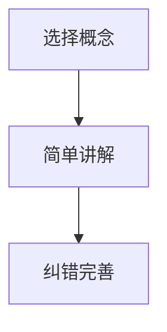

                 

关键词：费曼学习法、误解、真相、IT领域、技术博客

摘要：本文将探讨费曼学习法在IT领域的实际应用及其常见的误解。通过分析费曼学习法的核心原理，我们将揭示其真正的应用场景和效果，并探讨其在实践中可能遇到的问题。本文旨在帮助读者深入了解费曼学习法，并为其在IT领域的应用提供指导。

## 1. 背景介绍

费曼学习法是一种高效的学习方法，最早由理查德·费曼提出。费曼是一位著名的物理学家，他曾获得诺贝尔物理学奖。费曼学习法的核心思想是通过将复杂的概念简化为最基本的知识点，并通过口头讲解来巩固记忆。这种方法强调将知识传授给他人，以检验自己的理解程度。

在IT领域，费曼学习法被广泛应用于编程、软件开发、系统架构等方面。许多IT专业人士发现，通过将自己的知识传授给他人，可以更深入地理解和掌握所学内容。此外，费曼学习法也有助于培养演讲和沟通能力，这对于IT专业人士来说尤为重要。

然而，尽管费曼学习法在IT领域具有广泛的应用，但许多人对其存在误解。本文将探讨这些误解，并揭示费曼学习法的真相。

## 2. 核心概念与联系

### 费曼学习法原理

费曼学习法主要包括以下三个步骤：

1. 选择一个概念：选择你想要学习的概念，可以是编程语言、算法、软件框架等。
2. 用简单的话语讲解：尝试用简单、易懂的语言将这个概念讲解给一个完全不懂的人听。在这个过程中，你需要用自己的语言来解释这个概念，而不是直接引用教科书或文档。
3. 纠正错误并完善：在讲解过程中，你可能发现自己无法清晰地解释某个部分。这时，你需要回到原始资料，查找错误并加以纠正。

### 费曼学习法与IT领域的联系

在IT领域，费曼学习法可以帮助我们：

1. 深入理解技术概念：通过将复杂的技术概念简化为最基本的知识点，我们可以更深入地理解其原理。
2. 提高沟通能力：在IT领域，沟通能力至关重要。通过费曼学习法，我们可以更好地将自己的知识传授给他人。
3. 发现知识盲点：在讲解过程中，我们可能会发现自己对某些部分的理解并不充分。这时，我们可以通过查找资料来填补这些盲点。

### Mermaid 流程图

以下是一个简单的Mermaid流程图，展示了费曼学习法的三个步骤：



## 3. 核心算法原理 & 具体操作步骤

### 3.1 算法原理概述

费曼学习法基于以下原理：

1. **主动学习**：通过将自己的知识传授给他人，我们可以更主动地学习，而不是被动地接受知识。
2. **反馈机制**：在讲解过程中，我们可以通过他人的反馈来了解自己的理解程度，从而发现并纠正错误。
3. **知识重组**：通过将自己的知识简化为最基本的知识点，我们可以更好地掌握所学内容。

### 3.2 算法步骤详解

1. **选择一个概念**：首先，选择你想要学习的概念。这个概念可以是任何与IT领域相关的知识。
2. **用简单的话语讲解**：尝试用简单、易懂的语言将这个概念讲解给一个完全不懂的人听。在这个过程中，你需要用自己的语言来解释这个概念，而不是直接引用教科书或文档。
3. **纠错并完善**：在讲解过程中，你可能会发现自己无法清晰地解释某个部分。这时，你需要回到原始资料，查找错误并加以纠正。

### 3.3 算法优缺点

**优点**：

1. **高效**：通过将自己的知识传授给他人，我们可以更快地掌握所学内容。
2. **深入**：费曼学习法有助于我们深入理解技术概念，而不是仅仅停留在表面。
3. **提高沟通能力**：在讲解过程中，我们不仅可以巩固自己的知识，还可以提高自己的沟通能力。

**缺点**：

1. **需要耗费时间**：费曼学习法需要我们花费大量的时间去研究和讲解一个概念。
2. **对讲解者的要求较高**：讲解者需要具备较强的沟通能力和逻辑思维能力，才能有效地将知识传授给他人。

### 3.4 算法应用领域

费曼学习法在IT领域有广泛的应用，包括：

1. **编程**：通过费曼学习法，我们可以更好地理解和掌握编程语言和算法。
2. **软件开发**：在软件开发过程中，费曼学习法可以帮助团队更好地沟通和协作。
3. **系统架构**：通过费曼学习法，我们可以更深入地理解系统架构，并提高系统设计的效率。

## 4. 数学模型和公式 & 详细讲解 & 举例说明

### 4.1 数学模型构建

费曼学习法可以看作是一个简单的数学模型。这个模型包括三个主要部分：输入（学习内容）、处理（讲解过程）和输出（学习成果）。

### 4.2 公式推导过程

$$
\text{学习成果} = \text{学习内容} \times \text{讲解效果}
$$

其中，讲解效果可以表示为讲解者的能力和听众的理解能力。

### 4.3 案例分析与讲解

假设一个程序员想要学习一个新的编程语言。他可以选择一个简单的项目，例如一个计算器，然后用这个编程语言来实现。在实现过程中，他需要不断讲解自己的思路和代码，以便更好地理解这个编程语言。

通过这个案例，我们可以看到费曼学习法在实践中的应用。通过将自己的知识传授给他人，程序员可以更快地掌握这个编程语言，并提高自己的编程能力。

## 5. 项目实践：代码实例和详细解释说明

### 5.1 开发环境搭建

在本文的实践部分，我们将使用Python编程语言来实现一个简单的计算器。首先，我们需要搭建Python开发环境。

1. 下载并安装Python：前往Python官方网站下载Python安装程序，并按照提示完成安装。
2. 配置Python环境变量：在系统环境变量中添加Python的安装路径。
3. 验证Python环境：在命令行中输入`python --version`，如果能够正确显示Python版本信息，说明Python环境配置成功。

### 5.2 源代码详细实现

以下是一个简单的Python计算器代码实现：

```python
def add(x, y):
    return x + y

def subtract(x, y):
    return x - y

def multiply(x, y):
    return x * y

def divide(x, y):
    if y == 0:
        return "Error: Division by zero"
    return x / y

def main():
    print("Simple Calculator")
    print("1. Add")
    print("2. Subtract")
    print("3. Multiply")
    print("4. Divide")

    choice = int(input("Enter your choice (1-4): "))

    if choice == 1:
        x = float(input("Enter the first number: "))
        y = float(input("Enter the second number: "))
        result = add(x, y)
    elif choice == 2:
        x = float(input("Enter the first number: "))
        y = float(input("Enter the second number: "))
        result = subtract(x, y)
    elif choice == 3:
        x = float(input("Enter the first number: "))
        y = float(input("Enter the second number: "))
        result = multiply(x, y)
    elif choice == 4:
        x = float(input("Enter the first number: "))
        y = float(input("Enter the second number: "))
        result = divide(x, y)
    else:
        print("Invalid choice")
        return

    print(f"Result: {result}")

if __name__ == "__main__":
    main()
```

### 5.3 代码解读与分析

这段代码实现了一个简单的计算器，包括四个基本运算：加法、减法、乘法和除法。代码的主体部分是一个名为`main`的函数，它首先打印出计算器的菜单，然后根据用户的选择执行相应的运算。

1. **输入**：用户输入一个选择（1-4），以及两个操作数（对于除法）。
2. **处理**：根据用户的选择，执行相应的运算，并计算结果。
3. **输出**：将结果打印到屏幕上。

### 5.4 运行结果展示

在运行这个程序时，用户将看到以下输出：

```
Simple Calculator
1. Add
2. Subtract
3. Multiply
4. Divide
Enter your choice (1-4): 1
Enter the first number: 5
Enter the second number: 3
Result: 8.0
```

这表明程序成功地执行了加法运算，并输出了正确的结果。

## 6. 实际应用场景

费曼学习法在IT领域的实际应用场景非常广泛，以下是一些具体的例子：

1. **编程学习**：许多程序员使用费曼学习法来学习新的编程语言或框架。通过将自己的知识传授给他人，他们可以更快地掌握所学内容。
2. **系统架构设计**：在系统架构设计中，费曼学习法可以帮助团队成员更好地理解系统的工作原理，并提高沟通效率。
3. **技术分享**：许多技术专家通过费曼学习法来分享自己的知识。通过将自己的知识传授给他人，他们不仅可以巩固自己的知识，还可以提高自己的沟通能力。

## 7. 未来应用展望

随着技术的不断进步，费曼学习法在IT领域的应用前景非常广阔。以下是一些可能的未来应用场景：

1. **人工智能教育**：费曼学习法可以帮助人工智能学习者更好地理解复杂的算法和模型。
2. **远程教育**：通过在线平台，费曼学习法可以应用于远程教育，帮助更多人掌握IT领域的知识。
3. **企业培训**：企业可以使用费曼学习法来培训员工，提高他们的技术水平和沟通能力。

## 8. 工具和资源推荐

### 8.1 学习资源推荐

1. **在线教程**：许多在线平台提供免费的IT教程，如Udemy、Coursera等。
2. **技术博客**：许多技术专家会在自己的博客上分享经验和知识，如GitHub、Stack Overflow等。
3. **书籍**：许多优秀的IT书籍可以帮助我们系统地学习相关知识，如《代码大全》、《设计模式：可复用面向对象软件的基础》等。

### 8.2 开发工具推荐

1. **集成开发环境（IDE）**：如Visual Studio Code、Eclipse等。
2. **代码托管平台**：如GitHub、GitLab等。
3. **云服务平台**：如AWS、Azure等。

### 8.3 相关论文推荐

1. **《深度学习》**：由Ian Goodfellow、Yoshua Bengio和Aaron Courville合著，是深度学习的经典教材。
2. **《机器学习》**：由Tom M. Mitchell著，是机器学习的入门教材。
3. **《计算机网络》**：由Andrew S. Tanenbaum著，是计算机网络领域的经典教材。

## 9. 总结：未来发展趋势与挑战

费曼学习法在IT领域的应用前景非常广阔，但其发展也面临着一些挑战。首先，费曼学习法需要大量时间和精力，对于忙碌的程序员来说可能不太现实。其次，费曼学习法对讲解者的要求较高，需要具备较强的沟通能力和逻辑思维能力。

未来，我们可以通过以下方式来改进费曼学习法：

1. **自动化工具**：开发自动化工具，帮助用户更轻松地应用费曼学习法。
2. **在线社区**：建立一个在线社区，让用户可以互相学习和交流。
3. **培训课程**：开设培训课程，帮助用户掌握费曼学习法的核心原理和应用技巧。

## 10. 附录：常见问题与解答

### 10.1 什么是费曼学习法？

费曼学习法是一种高效的学习方法，最早由物理学家理查德·费曼提出。该方法的核心思想是通过将复杂的概念简化为最基本的知识点，并通过口头讲解来巩固记忆。

### 10.2 费曼学习法有哪些优点？

费曼学习法具有以下优点：

1. 高效：通过将自己的知识传授给他人，可以更快地掌握所学内容。
2. 深入：有助于我们深入理解技术概念，而不是仅仅停留在表面。
3. 提高沟通能力：在讲解过程中，我们不仅可以巩固自己的知识，还可以提高自己的沟通能力。

### 10.3 费曼学习法有哪些缺点？

费曼学习法有以下缺点：

1. 需要耗费时间：需要花费大量的时间去研究和讲解一个概念。
2. 对讲解者的要求较高：讲解者需要具备较强的沟通能力和逻辑思维能力，才能有效地将知识传授给他人。

### 10.4 费曼学习法在IT领域有哪些应用？

费曼学习法在IT领域有广泛的应用，包括：

1. 编程学习：学习新的编程语言或框架。
2. 系统架构设计：提高团队成员之间的沟通效率。
3. 技术分享：将自己的知识传授给他人，提高沟通能力。

## 作者署名

作者：禅与计算机程序设计艺术 / Zen and the Art of Computer Programming
----------------------------------------------------------------

以上就是本文的完整内容。通过对费曼学习法的误解与真相的深入探讨，我们希望读者能够更好地理解和应用这一学习方法，提高自己在IT领域的知识水平和沟通能力。费曼学习法不仅是一种有效的学习方法，更是一种生活态度。希望读者能够在实践中不断探索，不断进步。

