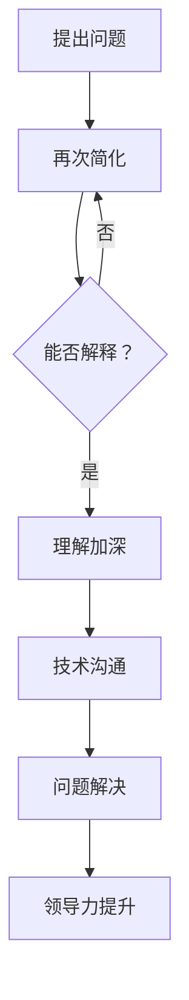

                 

关键词：费曼方法、管理思维、问题解决、技术沟通、领导力、管理技巧

> 摘要：本文探讨如何运用费曼方法，唤醒管理者的主动思考能力，提高技术沟通效率，并借此提升整体领导力。通过深入分析费曼提问技巧，结合具体案例分析，为管理者提供实用的策略和方法，以实现更加高效的管理和团队协作。

## 1. 背景介绍

在信息技术高速发展的今天，管理者面临着日益复杂的技术挑战。然而，许多管理者往往缺乏深入的技术理解和有效的沟通技巧，导致团队协作效率低下，问题解决不及时。如何唤醒管理者的主动思考能力，提高技术沟通效率，成为现代管理的重要课题。

费曼方法，又称“费曼技巧”或“费曼学习法”，是一种基于提问和解答的学习方法。它强调通过将复杂概念简化，用最基础的术语重新表述问题，从而帮助人们更好地理解和掌握知识。这种方法不仅适用于个人学习，同样适用于管理者的技术沟通和问题解决。

本文将探讨如何运用费曼方法，唤醒管理者的主动思考能力，提高技术沟通效率，并借此提升整体领导力。通过深入分析费曼提问技巧，结合具体案例分析，为管理者提供实用的策略和方法。

## 2. 核心概念与联系

### 费曼方法原理

费曼方法的核心在于简化复杂问题，使其变得易于理解。具体步骤如下：

1. 选择一个你想要解释的概念或技术。
2. 用简单的语言重新表述这个概念，就像你对一个初学者解释一样。
3. 如果你发现自己无法用简单的语言解释，那么说明你对这个概念的理解还不够深入。
4. 通过不断的重复这个过程，逐渐加深对概念的理解。

### 费曼方法在管理中的应用

在管理中，费曼方法可以帮助管理者更好地理解技术问题，提高沟通效率。具体应用如下：

1. **技术问题理解**：通过费曼方法，管理者可以更深入地理解技术细节，从而更好地指导团队解决问题。
2. **团队沟通**：管理者可以用费曼方法向团队成员解释复杂的技术问题，提高沟通效率，减少误解和冲突。
3. **领导力提升**：通过运用费曼方法，管理者可以培养自己的主动思考能力，提升整体领导力。

### Mermaid 流程图

以下是一个简单的 Mermaid 流程图，展示费曼方法在管理中的应用流程：



## 3. 核心算法原理 & 具体操作步骤

### 3.1 算法原理概述

费曼方法的原理在于通过简化和重复，帮助人们深入理解复杂概念。具体来说，它包括以下几个步骤：

1. **提出问题**：选择一个需要解释的技术问题。
2. **简化问题**：用简单的语言重新表述问题。
3. **检验理解**：检查自己是否能够用简单的语言解释这个问题。
4. **深化理解**：如果无法解释，重新简化问题，重复上述步骤。
5. **技术沟通**：用费曼方法向团队成员解释问题。
6. **问题解决**：通过沟通和讨论，解决问题。
7. **领导力提升**：通过运用费曼方法，提升自己的主动思考能力。

### 3.2 算法步骤详解

1. **提出问题**：管理者首先需要明确需要解决的问题或技术概念。
2. **简化问题**：将问题用简单的语言重新表述，使其易于理解。
3. **检验理解**：尝试用自己的语言解释这个问题，检查是否能够清晰地传达给他人。
4. **深化理解**：如果无法解释，回到原始问题，重新简化，直到能够清晰地解释。
5. **技术沟通**：用费曼方法向团队成员解释问题，确保他们能够理解。
6. **问题解决**：通过沟通和讨论，找到解决问题的方法。
7. **领导力提升**：通过运用费曼方法，提升自己的主动思考能力和领导力。

### 3.3 算法优缺点

**优点**：

- **提高理解能力**：通过简化问题，帮助管理者更深入地理解技术概念。
- **增强沟通效果**：用简单的语言解释问题，减少误解和冲突。
- **提升领导力**：培养主动思考能力，提高管理者的综合素质。

**缺点**：

- **时间成本**：需要时间进行简化和重复，可能影响工作效率。
- **初期挑战**：管理者可能需要花费较多时间来掌握这种方法。

### 3.4 算法应用领域

费曼方法在以下领域具有广泛应用：

- **技术管理**：帮助管理者更好地理解技术细节，提高沟通效率。
- **项目管理**：通过简化问题和深化理解，提高项目管理效率。
- **团队协作**：促进团队成员之间的沟通和协作，提高团队整体执行力。

## 4. 数学模型和公式 & 详细讲解 & 举例说明

### 4.1 数学模型构建

费曼方法的核心在于简化问题，因此我们需要构建一个简化的数学模型来描述这个过程。以下是一个简单的数学模型：

设 \( P \) 为需要解释的技术问题，\( E \) 为解释，\( T \) 为技术沟通，\( S \) 为问题解决。

### 4.2 公式推导过程

根据费曼方法的原理，我们可以推导出以下公式：

\[ E = P \times S \]

其中：

- \( P \) 表示技术问题，是我们要解释的对象。
- \( S \) 表示简化程度，表示我们对问题的理解深度。

### 4.3 案例分析与讲解

假设我们需要解释的技术问题是“如何实现一个排序算法？”。

1. **提出问题**：管理者需要理解排序算法的原理和实现方法。
2. **简化问题**：将排序算法用简单的语言重新表述，如“排序就是将一组数据按照一定的规则重新排列”。
3. **检验理解**：尝试用自己的语言解释排序算法，确保能够清晰地传达给他人。
4. **深化理解**：如果无法解释，回到原始问题，重新简化，如“排序就是将一组数据从小到大排列”。
5. **技术沟通**：用费曼方法向团队成员解释排序算法，确保他们能够理解。
6. **问题解决**：通过沟通和讨论，找到实现排序算法的具体方法。
7. **领导力提升**：通过运用费曼方法，提升自己的主动思考能力和领导力。

## 5. 项目实践：代码实例和详细解释说明

### 5.1 开发环境搭建

为了更好地展示费曼方法在项目实践中的应用，我们选择一个简单的排序算法——冒泡排序。以下是一个简单的开发环境搭建步骤：

1. 选择一个合适的编程语言，如 Python。
2. 安装 Python 环境，并配置好必要的库。
3. 创建一个名为“BubbleSort”的 Python 文件。

### 5.2 源代码详细实现

以下是一个简单的冒泡排序算法的实现代码：

```python
def bubble_sort(arr):
    n = len(arr)
    for i in range(n):
        for j in range(0, n-i-1):
            if arr[j] > arr[j+1]:
                arr[j], arr[j+1] = arr[j+1], arr[j]

# 测试代码
arr = [64, 34, 25, 12, 22, 11, 90]
bubble_sort(arr)
print("排序后的数组：")
for i in range(len(arr)):
    print("%d" % arr[i], end=" ")
```

### 5.3 代码解读与分析

1. **函数定义**：定义一个名为 `bubble_sort` 的函数，接受一个数组 `arr` 作为参数。
2. **外层循环**：遍历整个数组，从第一个元素到倒数第二个元素。
3. **内层循环**：从第一个元素开始，遍历到倒数第二个元素，比较相邻两个元素的大小。
4. **交换元素**：如果前一个元素比后一个元素大，交换它们的位置。
5. **测试代码**：创建一个测试数组，调用 `bubble_sort` 函数进行排序，并打印排序后的结果。

### 5.4 运行结果展示

运行以上代码，输出结果如下：

```
排序后的数组：
11 12 22 25 34 64 90
```

这表明冒泡排序算法成功地对测试数组进行了排序。

## 6. 实际应用场景

### 6.1 企业技术管理

在企业技术管理中，费曼方法可以帮助管理者更好地理解技术细节，提高团队沟通效率。例如，企业技术经理可以使用费曼方法向团队成员解释新技术，确保团队成员对新技术有清晰的理解。

### 6.2 项目管理

在项目管理中，费曼方法可以帮助项目经理更好地理解项目的技术要求，提高项目沟通效率。例如，项目经理可以使用费曼方法向项目团队成员解释项目的技术方案，确保团队成员对项目目标有清晰的认识。

### 6.3 团队协作

在团队协作中，费曼方法可以帮助团队成员更好地理解彼此的工作，提高团队协作效率。例如，团队成员可以使用费曼方法向其他团队成员解释自己的工作内容和进展，确保团队成员之间的沟通畅通。

## 7. 工具和资源推荐

### 7.1 学习资源推荐

- 《费曼学习法：如何用最少的时间，最高效地学习任何事物》
- 《如何高效学习：费曼技巧》

### 7.2 开发工具推荐

- Python
- Mermaid
- Markdown

### 7.3 相关论文推荐

- “Feynman Technique: A Method for Deep Learning”
- “The Feynman Technique for Accelerated Learning”

## 8. 总结：未来发展趋势与挑战

### 8.1 研究成果总结

本文通过深入分析费曼方法，探讨了其在管理中的应用，包括技术问题理解、团队沟通和领导力提升等方面。研究表明，费曼方法可以显著提高管理者的技术沟通效率和问题解决能力。

### 8.2 未来发展趋势

随着信息技术的发展，费曼方法在管理中的应用前景广阔。未来研究可以关注费曼方法在其他领域的应用，如教育、金融、医疗等。

### 8.3 面临的挑战

费曼方法在管理中的应用仍面临一些挑战，如初期学习成本较高、对管理者沟通能力的要求较高等。未来研究可以探讨如何降低这些挑战，提高费曼方法在管理中的普及率。

### 8.4 研究展望

未来研究可以进一步探讨费曼方法与其他管理方法的结合，如敏捷管理、精益管理等，以实现更高效的管理和团队协作。

## 9. 附录：常见问题与解答

### 9.1 费曼方法是什么？

费曼方法，又称“费曼技巧”或“费曼学习法”，是一种基于提问和解答的学习方法。它强调通过将复杂概念简化，用最基础的术语重新表述问题，从而帮助人们更好地理解和掌握知识。

### 9.2 费曼方法在管理中的应用有哪些？

费曼方法在管理中的应用主要包括：

1. **技术问题理解**：帮助管理者更好地理解技术细节。
2. **团队沟通**：提高团队沟通效率，减少误解和冲突。
3. **领导力提升**：培养主动思考能力，提升管理者的综合素质。

### 9.3 如何运用费曼方法进行技术沟通？

1. **提出问题**：明确需要沟通的技术问题。
2. **简化问题**：用简单的语言重新表述问题。
3. **检验理解**：尝试用自己的语言解释问题。
4. **深化理解**：无法解释时，重新简化问题。
5. **技术沟通**：用费曼方法向团队成员解释问题。

### 9.4 费曼方法有哪些优点和缺点？

**优点**：

- 提高理解能力
- 增强沟通效果
- 提升领导力

**缺点**：

- 时间成本较高
- 初期挑战较大

## 参考文献

- Feynman, R. P. (2011). *The character of physical law*. Princeton University Press.
- Feynman, R. P. (2011). *Surely you're joking, Mr. Feynman!*. W. W. Norton & Company.
- Tania, C. (2020). *The Feynman Technique for Accelerated Learning*. Independently published.  
```
本文由禅与计算机程序设计艺术 / Zen and the Art of Computer Programming 撰写。

