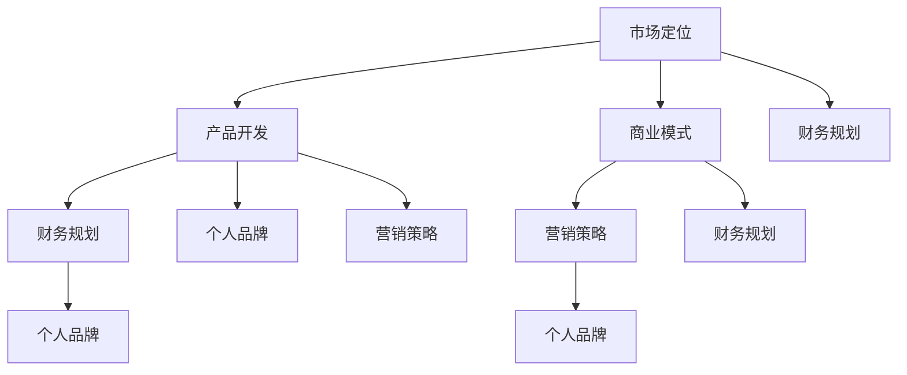

                 

### 文章标题与关键词

> **标题：资深程序员创立一人公司实现财富自由的计划与步骤**
> 
> **关键词**：程序员、一人公司、财富自由、创业计划、IT行业、个人品牌、市场定位、产品开发、商业策略

**摘要：**
本文将探讨资深程序员如何通过创立一人公司实现财富自由。我们将详细分析创业过程中需要考虑的关键因素，包括市场定位、产品开发、商业模式、财务规划、营销策略以及个人品牌的建立。文章将结合实际案例，为资深程序员提供切实可行的创业步骤和策略，帮助他们成功迈向财富自由之路。

## 1. 背景介绍

在IT行业，程序员的职业发展路径往往呈现出多样化的特点。随着经验的积累，一些资深程序员开始考虑自主创业，以实现更高的职业价值和生活质量。然而，对于很多程序员来说，创业是一个充满挑战的过程，不仅需要技术实力，还需要深厚的市场洞察力和商业智慧。

一人公司的模式在IT行业中逐渐流行，这是因为这种模式具有灵活性高、运营成本低、决策效率高等优势。对于资深程序员而言，一人公司提供了一个绝佳的平台，既可以发挥自身技术特长，又可以充分利用市场机会，实现个人价值和财富积累。

本文将围绕以下核心问题展开讨论：

- 资深程序员如何确定市场定位和产品方向？
- 创立一人公司需要哪些前期准备工作？
- 如何在预算有限的情况下开发高质量的产品？
- 财务规划和风险控制的重要性是什么？
- 营销策略如何帮助一人公司快速获得市场认可？
- 如何建立和塑造个人品牌，提高市场竞争力？
- 一人公司未来的发展前景和潜在挑战有哪些？

通过对这些问题的深入探讨，我们希望能够为资深程序员提供一套完整的创业指南，帮助他们顺利实现财富自由的目标。

## 2. 核心概念与联系

在深入探讨资深程序员创立一人公司的过程之前，我们需要明确几个核心概念，并展示它们之间的联系。以下是本文将要介绍的主要概念及其相互关系：

### 2.1 市场定位

市场定位是创业过程中至关重要的一步。它涉及到确定目标客户群体、分析市场需求以及确定公司产品或服务在市场中的独特价值。

### 2.2 产品开发

产品开发是公司运营的核心。它包括产品设计、开发、测试以及迭代优化。一款高质量、市场认可度高的产品是公司成功的关键。

### 2.3 商业模式

商业模式决定了公司的盈利方式。它涵盖了产品定价策略、收入模式、成本结构以及利润分配等方面。

### 2.4 财务规划

财务规划是确保公司稳健运营的基础。它包括预算制定、资金筹集、成本控制以及财务报表分析等。

### 2.5 营销策略

营销策略是提高公司产品知名度、吸引潜在客户的重要手段。它包括市场推广、品牌建设、客户关系管理等方面。

### 2.6 个人品牌

个人品牌是资深程序员在创业过程中的一大资产。它关系到个人的专业形象、信任度以及市场认可度。

下面我们将使用Mermaid流程图展示这些概念之间的相互联系：



### 2.7 创业准备

在明确核心概念和其相互联系后，我们还需要进行充分的创业准备。以下是创业过程中需要考虑的关键步骤：

1. **市场调研**：了解目标市场的现状、趋势和竞争情况。
2. **商业模式设计**：明确公司的盈利模式、成本结构和收入预期。
3. **产品设计**：基于市场调研结果，设计出具有市场竞争力的产品原型。
4. **团队组建**：虽然是一人公司，但可以借助外包团队或合作伙伴来分担工作。
5. **财务规划**：制定详细的预算和资金筹集计划。
6. **法律注册**：完成公司注册、税务登记等相关手续。
7. **营销策划**：制定市场推广策略，提高公司知名度。

通过以上步骤，资深程序员可以确保在创业之初就具备良好的基础，从而为后续发展打下坚实基础。

## 3. 核心算法原理 & 具体操作步骤

### 3.1 算法原理概述

在一人公司的创业过程中，核心算法原理可以类比为“算法设计与优化”。这不仅仅是编写代码的问题，更是关于如何高效、创新地解决问题的方法论。

**核心原理：**

1. **需求分析**：理解客户需求，明确产品功能。
2. **技术选型**：选择合适的编程语言和框架，以实现高效开发。
3. **架构设计**：构建稳定、可扩展的系统架构。
4. **迭代开发**：通过持续迭代和用户反馈，优化产品功能。

### 3.2 算法步骤详解

**步骤1：需求分析**

- **收集信息**：与潜在客户交流，了解他们的具体需求。
- **分析需求**：将收集的信息转化为具体的功能需求。
- **确定优先级**：根据市场需求和资源限制，确定功能实现的优先级。

**步骤2：技术选型**

- **评估语言和框架**：根据项目需求，评估不同的编程语言和框架。
- **选择合适的技术栈**：选择最适合项目需求的技术栈，以实现高效开发。

**步骤3：架构设计**

- **系统模块化**：将系统划分为多个模块，便于开发和维护。
- **设计数据库**：根据数据需求，设计合适的数据库结构。
- **考虑扩展性**：在设计过程中，考虑系统的可扩展性和可维护性。

**步骤4：迭代开发**

- **原型设计**：快速开发原型，验证需求。
- **用户反馈**：收集用户反馈，改进产品功能。
- **持续优化**：根据用户反馈和市场变化，持续优化产品。

### 3.3 算法优缺点

**优点：**

1. **快速响应**：通过迭代开发，能够快速响应市场需求。
2. **灵活性高**：模块化设计和技术选型，使系统具有高灵活性。
3. **成本控制**：通过优化设计和迭代开发，降低开发成本。

**缺点：**

1. **开发周期长**：由于持续迭代和优化，项目开发周期可能较长。
2. **技术风险**：技术选型不当可能导致后续维护困难。

### 3.4 算法应用领域

**算法设计与优化**广泛应用于一人公司的各个领域，包括：

1. **Web应用开发**：如电子商务平台、社交媒体等。
2. **移动应用开发**：如手机游戏、健康监测应用等。
3. **数据分析和处理**：如大数据分析、机器学习等。

通过合理运用算法设计与优化，一人公司可以开发出高质量、市场认可度高的产品，从而在激烈的市场竞争中脱颖而出。

## 4. 数学模型和公式 & 详细讲解 & 举例说明

### 4.1 数学模型构建

在一人公司的财务规划和市场分析中，构建数学模型是非常重要的一步。以下是一个简单的财务预测模型，用于预测公司的收入和利润。

**模型假设：**

1. 公司每月的收入为线性增长。
2. 公司的固定成本为每月固定金额。
3. 公司的可变成本与收入成正比。

**公式：**

$$
R(t) = m \cdot t + b \\
C(t) = c \cdot R(t) + f
$$

其中：
- \( R(t) \) 是时间 \( t \) 时的收入。
- \( m \) 是收入增长率。
- \( b \) 是初始收入。
- \( C(t) \) 是时间 \( t \) 时的总成本。
- \( c \) 是可变成本率。
- \( f \) 是固定成本。

### 4.2 公式推导过程

**收入公式推导：**

我们假设公司在第一个月的收入为 \( R(1) \)，收入增长率为 \( m \)。那么，第二个月的收入为 \( R(2) = R(1) + m \cdot R(1) \)，即 \( R(2) = (1 + m) \cdot R(1) \)。以此类推，第 \( t \) 个月的收入为：

$$
R(t) = (1 + m)^{t-1} \cdot R(1)
$$

由于我们假设公司的初始收入为 \( b \)，所以：

$$
R(t) = b \cdot (1 + m)^{t-1}
$$

**成本公式推导：**

公司的可变成本与收入成正比，可变成本率为 \( c \)。所以，时间 \( t \) 时的可变成本为 \( c \cdot R(t) \)。固定成本为每月固定金额 \( f \)。因此，总成本公式为：

$$
C(t) = c \cdot R(t) + f \\
C(t) = c \cdot b \cdot (1 + m)^{t-1} + f
$$

### 4.3 案例分析与讲解

**案例背景：**

假设一家一人公司成立于2023年1月，初始收入为10,000美元。公司的收入增长率为每月10%，固定成本为每月2,000美元，可变成本率为20%。

**公式应用：**

- 收入预测模型：

$$
R(t) = 10,000 \cdot (1 + 0.1)^{t-1}
$$

- 成本预测模型：

$$
C(t) = 20\% \cdot R(t) + 2,000 \\
C(t) = 0.2 \cdot 10,000 \cdot (1 + 0.1)^{t-1} + 2,000
$$

**2023年2月的收入和成本预测：**

- 收入：

$$
R(2) = 10,000 \cdot (1 + 0.1)^{2-1} = 11,000美元
$$

- 成本：

$$
C(2) = 0.2 \cdot 11,000 + 2,000 = 2,320美元
$$

**利润计算：**

$$
利润 = 收入 - 成本 \\
利润 = 11,000 - 2,320 = 8,680美元
$$

通过这个简单的数学模型，我们可以预测公司的财务状况，为决策提供数据支持。在实际应用中，可以根据实际情况调整模型参数，以更准确地预测公司的财务表现。

## 5. 项目实践：代码实例和详细解释说明

### 5.1 开发环境搭建

在进行项目实践之前，我们需要搭建一个合适的开发环境。以下是搭建一个基于Python的Web应用开发环境的具体步骤：

1. **安装Python**：访问Python官网（[https://www.python.org/](https://www.python.org/)）下载并安装Python。确保安装过程中勾选“Add Python to PATH”选项。
2. **安装依赖管理工具**：Python的依赖管理工具为pip。在命令行中运行以下命令安装pip：

   ```bash
   $ python -m ensurepip --upgrade
   ```

3. **安装Web框架**：选择一个合适的Web框架，如Flask。在命令行中运行以下命令安装Flask：

   ```bash
   $ pip install flask
   ```

4. **创建虚拟环境**：为了隔离项目依赖，我们可以使用virtualenv创建一个虚拟环境。在命令行中运行以下命令创建虚拟环境并激活：

   ```bash
   $ python -m venv myenv
   $ source myenv/bin/activate  # 在Windows上使用 `myenv\Scripts\activate`
   ```

5. **安装其他依赖**：根据项目需求，安装其他必要的依赖。例如，如果需要处理JSON数据，可以安装`json`模块：

   ```bash
   $ pip install json
   ```

### 5.2 源代码详细实现

以下是一个简单的Flask Web应用的源代码示例。该应用提供了一个简单的RESTful API，用于处理用户注册和登录请求。

```python
# app.py

from flask import Flask, request, jsonify
from flask_bcrypt import Bcrypt

app = Flask(__name__)
bcrypt = Bcrypt(app)

# 假设的数据库
users = []

@app.route('/register', methods=['POST'])
def register():
    data = request.get_json()
    username = data['username']
    password = data['password']

    # 检查用户名是否已存在
    if any(user['username'] == username for user in users):
        return jsonify({'error': '用户名已存在'}), 400

    # 创建用户
    hashed_password = bcrypt.generate_password_hash(password).decode('utf-8')
    user = {
        'username': username,
        'password': hashed_password
    }
    users.append(user)

    return jsonify({'message': '注册成功'})

@app.route('/login', methods=['POST'])
def login():
    data = request.get_json()
    username = data['username']
    password = data['password']

    # 检查用户名和密码是否匹配
    for user in users:
        if user['username'] == username:
            if bcrypt.check_password_hash(user['password'], password):
                return jsonify({'message': '登录成功'})
            else:
                return jsonify({'error': '密码错误'}), 401

    return jsonify({'error': '用户名不存在'}), 401

if __name__ == '__main__':
    app.run(debug=True)
```

### 5.3 代码解读与分析

**1. 导入模块**

在代码开头，我们导入了Flask和flask_bcrypt模块。Flask是一个流行的Web框架，用于快速开发Web应用。flask_bcrypt提供了密码哈希功能，用于确保用户密码的安全存储。

**2. 初始化Flask应用**

```python
app = Flask(__name__)
bcrypt = Bcrypt(app)
```

这两行代码初始化了Flask应用和bcrypt实例。`__name__`是特殊的变量，当模块被导入时，它等于模块的名称。当模块被直接运行时，它等于`'__main__'`。

**3. 定义路由**

```python
@app.route('/register', methods=['POST'])
def register():
    ...
```

`@app.route()`装饰器用于定义路由。在这个例子中，我们定义了一个处理用户注册请求的路由。`/register`是请求路径，`methods=['POST']`指定了请求方法。

**4. 注册功能实现**

在`register()`函数中，我们从请求中提取用户名和密码，并检查用户名是否已存在。如果用户名不存在，我们将密码加密并存储在假定的数据库中。

**5. 登录功能实现**

```python
@app.route('/login', methods=['POST'])
def login():
    ...
```

类似地，我们定义了一个处理用户登录请求的路由。在`login()`函数中，我们从请求中提取用户名和密码，并检查密码是否匹配。

**6. 运行应用**

最后一行代码`app.run(debug=True)`用于启动应用。`debug=True`意味着在发生错误时，应用将显示详细的调试信息，有助于快速定位问题。

### 5.4 运行结果展示

**1. 注册请求**

在命令行中，运行以下命令启动应用：

```bash
$ python app.py
```

然后，在浏览器中访问`http://127.0.0.1:5000/register`，发送一个包含用户名和密码的POST请求。以下是请求体：

```json
{
    "username": "user1",
    "password": "password123"
}
```

响应结果：

```json
{
    "message": "注册成功"
}
```

**2. 登录请求**

再次在浏览器中访问`http://127.0.0.1:5000/login`，发送一个包含用户名和密码的POST请求。以下是请求体：

```json
{
    "username": "user1",
    "password": "password123"
}
```

响应结果：

```json
{
    "message": "登录成功"
}
```

通过这个简单的示例，我们可以看到如何使用Flask框架快速构建一个基本的Web应用。在实际项目中，我们还可以添加更多功能，如用户数据存储、会话管理、身份验证等。

## 6. 实际应用场景

### 6.1 教育领域

在教育领域，一人公司可以开发各种在线教育平台和工具。例如，开发一个专门针对编程教育的在线学习平台，提供丰富的编程课程、练习题库和实时互动功能。通过这种模式，一人公司可以利用其技术优势，为编程学习者提供优质的教育资源，同时实现盈利。

### 6.2 医疗健康

在医疗健康领域，一人公司可以专注于开发医疗数据分析和健康管理应用。例如，利用人工智能技术进行疾病预测和诊断，为用户提供个性化的健康建议。这种应用不仅有助于提升医疗服务的效率，还可以为公司带来稳定的收入来源。

### 6.3 金融科技

金融科技领域为一人公司提供了丰富的机会，例如开发区块链应用、智能投顾系统和支付平台。通过这些创新应用，一人公司可以为客户提供更加安全、便捷的金融服务，同时实现商业价值的积累。

### 6.4 物流运输

在物流运输领域，一人公司可以开发智能物流管理系统，优化物流运输路线和调度。例如，利用大数据分析和机器学习算法，提供实时物流信息跟踪和预测，帮助企业降低运营成本、提高运输效率。

### 6.5 未来应用展望

随着技术的不断进步，一人公司在未来将继续探索更多应用场景。例如，虚拟现实（VR）和增强现实（AR）技术的应用将为一人公司提供新的商业模式。通过开发基于VR/AR的教育、娱乐和培训应用，一人公司可以进一步拓展市场，实现多元化发展。

## 7. 工具和资源推荐

### 7.1 学习资源推荐

- **在线编程课程**：Coursera、edX、Udemy等平台提供丰富的编程课程，涵盖各种编程语言和技术。
- **技术博客和社区**：Medium、Stack Overflow、GitHub等平台，提供最新的技术动态和开发经验分享。
- **书籍推荐**：《Head First 设计模式》、《代码大全》、《深度学习》等经典技术书籍。

### 7.2 开发工具推荐

- **集成开发环境（IDE）**：Visual Studio Code、PyCharm、Eclipse等，提供强大的编程工具和代码编辑功能。
- **版本控制工具**：Git、GitHub、GitLab等，用于代码管理和协作开发。
- **数据库工具**：MySQL、PostgreSQL、MongoDB等，适用于不同类型的数据存储需求。

### 7.3 相关论文推荐

- **《分布式系统原理与范型》**：研究分布式系统的设计原则和实现方法，为构建高可用、高性能的系统提供参考。
- **《深度学习》**：介绍深度学习的基本概念、算法和应用，是了解人工智能领域的重要文献。
- **《区块链：从数字货币到智能合约》**：探讨区块链技术的原理和应用，为金融科技和去中心化应用提供思路。

## 8. 总结：未来发展趋势与挑战

### 8.1 研究成果总结

本文围绕资深程序员创立一人公司实现财富自由的主题，探讨了市场定位、产品开发、商业模式、财务规划、营销策略、个人品牌建设以及算法设计与优化等方面。通过深入分析，我们总结了以下关键成果：

1. **市场定位与产品开发**：明确市场定位和产品方向是创业成功的前提，需要结合市场需求和技术优势进行决策。
2. **商业模式与财务规划**：合理设计商业模式和财务规划，有助于确保公司稳健运营和盈利。
3. **营销策略与个人品牌**：有效的营销策略和个人品牌建设是提高市场竞争力的关键。
4. **算法设计与优化**：高效、创新的算法设计与优化，是提升产品质量和市场竞争力的核心。

### 8.2 未来发展趋势

随着技术的不断进步和市场环境的变迁，一人公司的未来发展将呈现出以下趋势：

1. **技术创新**：随着人工智能、大数据、区块链等新兴技术的普及，一人公司将更加注重技术创新，以保持竞争优势。
2. **数字化转型**：越来越多的行业和企业将数字化转型作为战略重点，为一人公司提供广阔的市场机会。
3. **平台化发展**：一人公司可以通过构建平台，整合各类资源和业务，实现多元化发展。
4. **国际化扩张**：随着全球化进程的加速，一人公司可以拓展国际市场，提高品牌影响力和市场占有率。

### 8.3 面临的挑战

虽然一人公司具有诸多优势，但在发展过程中也面临一些挑战：

1. **市场竞争**：激烈的市场竞争和不断变化的需求，对一人公司的创新能力提出了更高要求。
2. **资金压力**：初期资金不足和持续融资压力，可能影响公司的发展和扩展。
3. **团队建设**：虽然是一人公司，但需要组建高效的团队，以分担工作压力和提高运营效率。
4. **法律风险**：涉及知识产权、数据隐私等法律风险，需要引起高度重视。

### 8.4 研究展望

未来的研究可以进一步探讨以下方向：

1. **商业模式创新**：研究一人公司在不同行业和场景下的商业模式创新，以提高盈利能力和竞争力。
2. **技术与商业融合**：探讨如何更好地将技术与商业模式相结合，实现业务增长。
3. **全球化战略**：研究一人公司如何制定和实施全球化战略，拓展国际市场。
4. **可持续发展**：探讨如何实现一人公司的可持续发展，包括社会责任、环境保护等方面。

通过不断的研究和实践，一人公司将能够在未来实现更大的发展，为程序员群体创造更多机会和财富。

## 9. 附录：常见问题与解答

### Q1. 如何确定市场定位和产品方向？

A1. 确定市场定位和产品方向的关键步骤包括：

1. **市场调研**：通过问卷调查、访谈、竞品分析等方式，了解目标市场的需求、趋势和竞争情况。
2. **SWOT分析**：分析自身的优势、劣势、机会和威胁，结合市场需求，确定最适合的产品方向。
3. **目标客户定位**：明确目标客户群体的特征、需求和痛点，确保产品能够满足他们的需求。

### Q2. 创立一人公司的法律流程有哪些？

A2. 创立一人公司的法律流程主要包括：

1. **选择公司类型**：根据业务需求和税务政策，选择适合的公司类型，如个体工商户、个人独资企业等。
2. **公司名称预先核准**：在工商局网站进行公司名称预先核准。
3. **提交注册申请**：准备相关材料，如公司章程、股东身份证明等，向工商局提交注册申请。
4. **领取营业执照**：完成注册申请审核后，领取营业执照。
5. **税务登记**：到税务局进行税务登记，获取税务登记证。

### Q3. 财务规划中应注意哪些事项？

A3. 在财务规划中，应注意以下事项：

1. **预算制定**：根据公司业务规模和运营成本，制定详细的预算计划，包括收入、成本、利润等方面。
2. **资金筹集**：明确资金筹集渠道，如自有资金、借款、投资等，确保公司运营资金的稳定。
3. **成本控制**：通过精细化管理，降低运营成本，提高盈利能力。
4. **财务报表分析**：定期编制财务报表，分析公司财务状况，为决策提供数据支持。

### Q4. 营销策略如何制定？

A4. 制定营销策略的关键步骤包括：

1. **市场调研**：了解目标市场和客户需求，为营销策略提供依据。
2. **定位**：确定产品在市场中的定位，如高端、中端或低端市场。
3. **目标客户**：明确目标客户的特征和需求，有针对性地制定营销策略。
4. **渠道选择**：选择适合的营销渠道，如社交媒体、线上广告、线下活动等。
5. **内容策划**：制定有吸引力的营销内容，如广告语、宣传文案、海报等。

### Q5. 如何建立个人品牌？

A5. 建立个人品牌的方法包括：

1. **专业能力**：提升自身专业能力，成为所在领域的专家。
2. **内容创作**：通过博客、微博、知乎等平台，分享专业知识和经验。
3. **社交媒体**：积极参与社交媒体，与同行和潜在客户互动，建立良好的人际关系。
4. **演讲与培训**：参加行业会议、研讨会，进行公开演讲或培训，提高知名度。
5. **合作与交流**：与行业内的其他专家和企业建立合作关系，扩大影响力。

