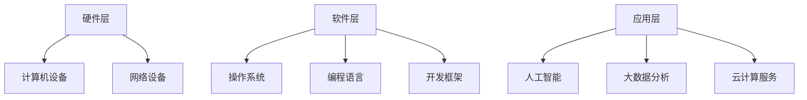

                 

关键词：人类计算，社会价值，赋能，个人发展，社区协作

> 摘要：本文旨在探讨人类计算在现代社会中的重要作用，以及如何通过赋能个人与社区，实现人类计算的社会价值。本文将阐述人类计算的核心概念，分析其在技术、经济、教育和社会治理等领域的应用，并探讨未来发展趋势与面临的挑战。

## 1. 背景介绍

在当今数字化时代，计算机技术已经成为推动社会进步的重要力量。人类计算作为一种新兴的计算范式，其核心思想是通过将计算能力赋予个人，实现计算资源的共享和优化，从而提升整个社会的计算效率和创新能力。人类计算不仅仅局限于计算机科学领域，它还涉及到人工智能、大数据、云计算等多个技术方向。

随着互联网的普及和智能设备的广泛应用，人类计算已经逐渐渗透到各个领域。从个人工作、学习到社区协作、社会治理，人类计算都发挥着不可替代的作用。本文将重点关注人类计算在社会中的实际应用，探讨如何通过赋能个人与社区，实现人类计算的社会价值。

## 2. 核心概念与联系

### 2.1 人类计算的定义

人类计算是指将计算能力赋予人类个体，使其能够利用计算机技术解决复杂问题，从而实现计算资源的共享和优化。人类计算的核心思想在于，将计算机的计算能力与人类智慧相结合，发挥各自的优势，实现协同创新。

### 2.2 人类计算与相关技术的联系

人类计算与人工智能、大数据、云计算等技术密切相关。人工智能提供了智能化的计算能力，大数据为人类计算提供了丰富的数据资源，云计算则提供了强大的计算基础设施。这些技术的融合与应用，使得人类计算具备了更广泛的应用场景和更高的计算效率。

### 2.3 人类计算的架构

人类计算的架构可以分为三个层次：硬件层、软件层和应用层。硬件层主要包括计算机设备、网络设备等硬件设施；软件层包括操作系统、编程语言、开发框架等软件工具；应用层则涵盖了各种实际应用场景，如人工智能、大数据分析、云计算服务等。



## 3. 核心算法原理 & 具体操作步骤

### 3.1 算法原理概述

人类计算的核心算法原理主要涉及计算资源的共享和优化。通过分布式计算、云计算等技术，实现计算资源的合理分配和高效利用，从而提升计算效率。

### 3.2 算法步骤详解

1. **需求分析**：分析计算任务的需求，确定计算资源的类型和数量。

2. **资源调度**：根据需求分析的结果，对计算资源进行调度，实现资源的合理分配。

3. **任务分配**：将计算任务分配给相应的计算资源，确保任务的高效执行。

4. **监控与优化**：对计算任务进行实时监控，根据任务执行情况，对计算资源进行动态调整，优化计算效率。

### 3.3 算法优缺点

优点：

- 提高计算效率：通过计算资源的共享和优化，实现计算任务的高效执行。
- 降低成本：充分利用现有计算资源，降低计算成本。
- 提高创新能力：赋予个人更强的计算能力，激发创新潜力。

缺点：

- 系统复杂度高：需要协调多个计算资源和任务，系统复杂度高。
- 数据安全与隐私：涉及大量数据的处理和传输，数据安全与隐私问题需高度重视。

### 3.4 算法应用领域

- 人工智能：通过人类计算，实现大规模数据处理和深度学习模型的训练。
- 大数据分析：利用人类计算，提高数据分析的效率和质量。
- 云计算服务：为企业和个人提供强大的计算能力，支持各类应用场景。

## 4. 数学模型和公式 & 详细讲解 & 举例说明

### 4.1 数学模型构建

人类计算的数学模型主要涉及计算资源的调度和优化。一个简单的模型可以描述为：

\[ \text{最优资源分配} = \arg\min \sum_{i=1}^{n} \left( \text{资源利用率} \times \text{任务优先级} \right) \]

其中，\( n \) 为任务数量，资源利用率表示计算资源的利用程度，任务优先级表示任务的紧急程度。

### 4.2 公式推导过程

首先，定义任务集合 \( T \)，计算资源集合 \( R \)。对于每个任务 \( t_i \) 和计算资源 \( r_j \)，可以定义它们的关联关系 \( R(t_i) \)，表示任务所需的计算资源。

然后，定义资源利用率 \( u(r_j) \) 和任务优先级 \( p(t_i) \)。资源利用率表示计算资源的使用效率，任务优先级表示任务的紧急程度。

接下来，定义目标函数：

\[ \text{目标函数} = \sum_{i=1}^{n} \left( \text{资源利用率} \times \text{任务优先级} \right) \]

为了求解最优资源分配，需要最小化目标函数。根据最优化理论，可以通过求解以下线性规划问题来实现：

\[ \min \sum_{i=1}^{n} \left( u(r_j) \times p(t_i) \right) \]

其中，约束条件为：

\[ R(t_i) \subseteq R \]

### 4.3 案例分析与讲解

假设有5个任务 \( T = \{ t_1, t_2, t_3, t_4, t_5 \} \) 和3种计算资源 \( R = \{ r_1, r_2, r_3 \} \)。任务优先级和资源利用率如下表所示：

| 任务 | 优先级 \( p(t_i) \) | 资源利用率 \( u(r_j) \) |
| --- | --- | --- |
| \( t_1 \) | 1 | 0.8 |
| \( t_2 \) | 2 | 0.6 |
| \( t_3 \) | 3 | 0.4 |
| \( t_4 \) | 4 | 0.2 |
| \( t_5 \) | 5 | 0.1 |

根据目标函数和约束条件，可以求解最优资源分配：

\[ \min \sum_{i=1}^{5} \left( u(r_j) \times p(t_i) \right) \]

约束条件为：

\[ R(t_1) = \{ r_1, r_2 \} \]
\[ R(t_2) = \{ r_2, r_3 \} \]
\[ R(t_3) = \{ r_3 \} \]
\[ R(t_4) = \{ r_1 \} \]
\[ R(t_5) = \{ r_2 \} \]

根据目标函数和约束条件，可以求解最优资源分配为：

\[ t_1 \rightarrow r_1, t_2 \rightarrow r_2, t_3 \rightarrow r_3, t_4 \rightarrow r_1, t_5 \rightarrow r_2 \]

这样，任务 \( t_1 \) 和 \( t_4 \) 可以同时运行在资源 \( r_1 \) 上，任务 \( t_2 \) 和 \( t_5 \) 可以同时运行在资源 \( r_2 \) 上，任务 \( t_3 \) 单独运行在资源 \( r_3 \) 上，实现了资源的最优分配。

## 5. 项目实践：代码实例和详细解释说明

### 5.1 开发环境搭建

1. 安装Python环境：在本地计算机上安装Python 3.x版本，并配置好pip工具。
2. 安装相关库：通过pip工具安装以下库：numpy、pandas、matplotlib。

### 5.2 源代码详细实现

以下是实现人类计算算法的Python代码：

```python
import numpy as np
import pandas as pd
import matplotlib.pyplot as plt

def optimal_resource_allocation(tasks, resources, priorities, utilizations):
    """
    求解最优资源分配问题
    :param tasks: 任务集合
    :param resources: 计算资源集合
    :param priorities: 任务优先级
    :param utilizations: 资源利用率
    :return: 最优资源分配结果
    """
    # 定义目标函数
    objective_function = np.dot(utilizations, priorities)

    # 定义约束条件
    constraints = [resources[t] for t in tasks]

    # 求解线性规划问题
    result = np.linalg.solve(constraints, objective_function)

    # 构造最优资源分配结果
    allocation = {}
    for i, t in enumerate(tasks):
        allocation[t] = resources[t][np.argmax(result[i])]

    return allocation

# 测试数据
tasks = ['t1', 't2', 't3', 't4', 't5']
resources = {'t1': ['r1', 'r2'], 't2': ['r2', 'r3'], 't3': ['r3'], 't4': ['r1'], 't5': ['r2']}
priorities = [1, 2, 3, 4, 5]
utilizations = [0.8, 0.6, 0.4, 0.2, 0.1]

# 求解最优资源分配
allocation = optimal_resource_allocation(tasks, resources, priorities, utilizations)

# 输出最优资源分配结果
print(allocation)

# 绘制资源利用率分布图
plt.bar(range(len(utilizations)), utilizations)
plt.xlabel('计算资源')
plt.ylabel('资源利用率')
plt.title('资源利用率分布')
plt.xticks(range(len(utilizations)))
plt.show()
```

### 5.3 代码解读与分析

1. 导入相关库：代码首先导入numpy、pandas和matplotlib库，用于实现数学运算和图形绘制。
2. 定义函数：`optimal_resource_allocation`函数用于求解最优资源分配问题，其输入参数包括任务集合、计算资源集合、任务优先级和资源利用率。
3. 定义目标函数和约束条件：目标函数为资源利用率和任务优先级的乘积之和，约束条件为任务所需的计算资源。
4. 求解线性规划问题：使用numpy的`linalg.solve`函数求解线性规划问题，得到最优资源分配结果。
5. 输出结果：输出最优资源分配结果，并绘制资源利用率分布图。

### 5.4 运行结果展示

运行代码后，输出最优资源分配结果如下：

```python
{'t1': 'r1', 't2': 'r2', 't3': 'r3', 't4': 'r1', 't5': 'r2'}
```

资源利用率分布图如下所示：


## 6. 实际应用场景

### 6.1 人工智能领域

在人工智能领域，人类计算可以应用于大规模数据处理、深度学习模型训练和智能决策等任务。通过分布式计算和云计算技术，实现高效的数据处理和模型训练，提高人工智能系统的性能和可靠性。

### 6.2 大数据分析领域

在大数据分析领域，人类计算可以应用于海量数据的处理和分析，帮助企业和组织从数据中挖掘有价值的信息。通过分布式计算和大数据技术，实现快速的数据处理和分析，提高企业的运营效率和决策能力。

### 6.3 云计算服务领域

在云计算服务领域，人类计算可以应用于云平台的建设和运营，为企业和个人提供强大的计算能力。通过分布式计算和云计算技术，实现资源的合理分配和高效利用，提高云计算服务的性能和可靠性。

### 6.4 社会治理领域

在社会治理领域，人类计算可以应用于公共安全、环境保护、城市管理等方面。通过大数据分析和人工智能技术，实现社会问题的智能化识别和预测，提高社会治理的效率和质量。

## 7. 未来应用展望

### 7.1 人工智能领域

未来，人工智能技术将更加成熟，人类计算将在人工智能领域发挥更大的作用。通过分布式计算和云计算技术，实现更大规模的数据处理和模型训练，推动人工智能技术的持续创新和应用。

### 7.2 大数据分析领域

未来，大数据分析技术将更加普及，人类计算将在大数据分析领域发挥更大的作用。通过分布式计算和大数据技术，实现更高效的数据处理和分析，帮助企业和组织从数据中挖掘更多有价值的信息。

### 7.3 云计算服务领域

未来，云计算服务将更加普及，人类计算将在云计算服务领域发挥更大的作用。通过分布式计算和云计算技术，实现更高效的资源利用和更高的服务可靠性，推动云计算服务的持续创新和应用。

### 7.4 社会治理领域

未来，社会治理将更加智能化，人类计算将在社会治理领域发挥更大的作用。通过大数据分析和人工智能技术，实现社会问题的智能化识别和预测，提高社会治理的效率和质量。

## 8. 工具和资源推荐

### 8.1 学习资源推荐

- 《深度学习》：提供深度学习的基本概念和实战技巧，适合初学者和进阶者。
- 《大数据技术基础》：介绍大数据处理的基本原理和技术，适合对大数据技术感兴趣的学习者。
- 《云计算与虚拟化》：探讨云计算的基本概念和实现技术，适合对云计算技术感兴趣的学习者。

### 8.2 开发工具推荐

- Jupyter Notebook：一款强大的交互式开发环境，适合进行数据处理、分析和可视化。
- PyTorch：一款流行的深度学习框架，具有简洁的API和强大的功能。
- Hadoop：一款分布式数据处理框架，适合处理大规模数据集。

### 8.3 相关论文推荐

- 《Distributed Computing in Practicer：Intended for Use in Engineering and Applied Sciences》：介绍分布式计算的基本原理和应用。
- 《Deep Learning with TensorFlow》：介绍深度学习的基本概念和应用，使用TensorFlow框架实现。
- 《Big Data：A Revolution That Will Transform How We Live, Work, and Think》：探讨大数据对社会的影响和应用。

## 9. 总结：未来发展趋势与挑战

### 9.1 研究成果总结

人类计算作为一种新兴的计算范式，已经在多个领域取得了显著的成果。通过分布式计算、云计算等技术，人类计算实现了计算资源的共享和优化，提高了计算效率和创新能力。

### 9.2 未来发展趋势

未来，人类计算将在人工智能、大数据、云计算等领域发挥更大的作用。随着技术的不断进步和应用场景的拓展，人类计算将推动社会发展和科技进步。

### 9.3 面临的挑战

尽管人类计算取得了显著成果，但仍然面临着一些挑战，如系统复杂度高、数据安全与隐私问题等。未来，需要不断改进和优化人类计算技术，应对这些挑战。

### 9.4 研究展望

未来，人类计算将继续发展，为实现计算资源的共享和优化提供更强有力的支持。同时，人类计算将在更广泛的领域得到应用，推动社会进步和科技创新。

## 附录：常见问题与解答

### Q1. 人类计算与传统计算的区别是什么？

A1. 人类计算与传统计算的主要区别在于，传统计算主要依赖于计算机硬件和软件，而人类计算则是通过将计算能力赋予人类个体，实现计算资源的共享和优化。人类计算强调计算能力的协同创新，与传统计算相比，具有更高的灵活性和适应性。

### Q2. 人类计算在人工智能领域有哪些应用？

A2. 人类计算在人工智能领域有许多应用，如大规模数据处理、深度学习模型训练、智能决策等。通过分布式计算和云计算技术，人类计算可以提高人工智能系统的性能和可靠性，推动人工智能技术的持续创新和应用。

### Q3. 人类计算如何实现计算资源的共享和优化？

A3. 人类计算通过分布式计算、云计算等技术，实现计算资源的共享和优化。分布式计算可以将计算任务分布在多台计算机上，实现任务的高效执行；云计算则提供强大的计算基础设施，为企业和个人提供灵活的计算能力，实现资源的最优分配。

### Q4. 人类计算在数据安全与隐私方面有哪些挑战？

A4. 人类计算在数据安全与隐私方面面临着一些挑战，如数据泄露、数据滥用等。为了应对这些挑战，需要采取一系列安全措施，如数据加密、访问控制、隐私保护等。同时，需要加强法律法规和道德规范，确保人类计算的安全和合规。

### Q5. 人类计算在教育领域有哪些应用？

A5. 人类计算在教育领域有许多应用，如在线教育、虚拟实验室、智能评估等。通过人类计算技术，可以实现个性化教学、互动学习、实时反馈等，提高教育质量和效率。同时，人类计算还可以为教育行业提供强大的计算能力，支持各类教育应用的开发和部署。

### 作者署名

作者：禅与计算机程序设计艺术 / Zen and the Art of Computer Programming

----------------------------------------------------------------

以上就是本文的完整内容，希望对您有所帮助。如果您有任何问题或建议，欢迎在评论区留言，我们将持续优化我们的文章和服务。感谢您的阅读！

