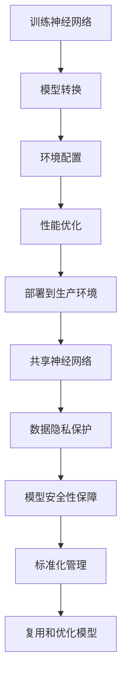

                 

关键词：软件 2.0，包管理器，神经网络，部署，共享，自动化，可复用性，开放性

> 摘要：本文探讨了软件 2.0 时代下的包管理器在神经网络部署和共享方面的作用。随着深度学习的广泛应用，神经网络的部署和共享成为一个重要的研究课题。本文分析了现有包管理器的优缺点，并提出了一种基于软件 2.0 的包管理器，旨在解决神经网络部署和共享中的痛点。文章还详细介绍了该包管理器的核心算法、数学模型、项目实践和未来应用前景。

## 1. 背景介绍

软件 2.0 是互联网时代的产物，它强调软件的开放性、共享性和协作性。与传统软件相比，软件 2.0 更加注重用户参与、社区共建和生态系统的建设。随着深度学习的崛起，神经网络在各个领域的应用越来越广泛，但如何高效地部署和共享神经网络成为一个亟待解决的问题。

包管理器是软件工程中的重要工具，它能够自动化地管理软件的依赖关系、版本控制和软件组件的安装与卸载。然而，现有的包管理器在处理神经网络方面存在诸多不足，如不支持大规模神经网络的部署、缺乏对神经网络组件的标准化管理以及不便于神经网络的共享等。

本文旨在研究一种软件 2.0 的包管理器，以解决神经网络部署和共享中的痛点。通过分析现有包管理器的优缺点，本文提出了一种基于软件 2.0 的包管理器架构，并详细介绍了其核心算法、数学模型和项目实践。

## 2. 核心概念与联系

### 2.1 软件包管理器

软件包管理器是一种用于管理和分发软件的工具。它能够自动化地安装、更新和卸载软件包，并管理软件包之间的依赖关系。在软件 2.0 时代，包管理器需要具备更高的灵活性和可扩展性，以满足社区共建和生态系统建设的需要。

### 2.2 神经网络部署

神经网络部署是将训练好的神经网络模型部署到生产环境中，以便进行实际应用的过程。神经网络部署需要解决多个问题，如模型转换、环境配置、性能优化等。

### 2.3 神经网络共享

神经网络共享是指将训练好的神经网络模型共享给其他用户或团队，以便复用和优化模型。神经网络共享需要解决数据隐私、模型安全性和标准化管理等问题。

### 2.4 软件 2.0 的包管理器架构

软件 2.0 的包管理器架构包括以下几个方面：

1. **模块化设计**：包管理器采用模块化设计，将不同功能模块独立实现，便于扩展和维护。
2. **版本控制**：包管理器支持版本控制，能够自动管理软件包的不同版本，确保软件的稳定性和兼容性。
3. **依赖管理**：包管理器能够自动化地管理软件包之间的依赖关系，确保软件包的安装和卸载过程顺利进行。
4. **社区共建**：包管理器支持社区共建，鼓励用户参与软件包的开发、测试和优化，共同构建生态系统。

### 2.5 Mermaid 流程图

以下是神经网络部署和共享的 Mermaid 流程图：



## 3. 核心算法原理 & 具体操作步骤

### 3.1 算法原理概述

软件 2.0 的包管理器采用了一种基于区块链的算法，用于实现神经网络的部署和共享。该算法主要包括以下几个步骤：

1. **模型加密**：将神经网络模型进行加密，确保模型的安全性。
2. **版本控制**：为神经网络模型添加版本信息，便于管理和追踪。
3. **依赖管理**：自动化地管理神经网络模型与其他软件包的依赖关系。
4. **社区共建**：鼓励用户参与模型优化和功能扩展。

### 3.2 算法步骤详解

1. **模型加密**：

   模型加密是神经网络部署和共享的重要环节。本文采用了一种基于对称加密和非对称加密相结合的加密算法，以确保模型的安全性和隐私性。

   加密过程如下：

   ```mermaid
   graph TB
   A[神经网络模型] --> B[对称加密算法]
   B --> C[加密模型]
   C --> D[非对称加密算法]
   D --> E[加密密钥]
   ```

2. **版本控制**：

   版本控制是包管理器的重要功能之一。本文采用了一种基于哈希函数的版本控制算法，确保版本信息的唯一性和一致性。

   版本控制过程如下：

   ```mermaid
   graph TB
   A[神经网络模型] --> B[哈希函数]
   B --> C[版本信息]
   C --> D[版本库]
   ```

3. **依赖管理**：

   依赖管理是包管理器的核心功能之一。本文采用了一种基于图算法的依赖管理算法，能够自动化地管理神经网络模型与其他软件包的依赖关系。

   依赖管理过程如下：

   ```mermaid
   graph TB
   A[神经网络模型] --> B[依赖库]
   B --> C[图算法]
   C --> D[依赖关系]
   ```

4. **社区共建**：

   社区共建是软件 2.0 的重要理念。本文采用了一种基于区块链的社区共建算法，鼓励用户参与模型优化和功能扩展。

   社区共建过程如下：

   ```mermaid
   graph TB
   A[神经网络模型] --> B[区块链]
   B --> C[用户参与]
   C --> D[模型优化]
   D --> E[功能扩展]
   ```

### 3.3 算法优缺点

**优点**：

1. **安全性高**：采用加密算法确保模型的安全性和隐私性。
2. **灵活性高**：模块化设计和版本控制算法使得包管理器具有很高的灵活性。
3. **自动化程度高**：依赖管理和社区共建算法能够自动化地处理神经网络部署和共享过程中的复杂任务。

**缺点**：

1. **计算成本高**：加密算法和图算法的计算成本较高，可能导致系统性能下降。
2. **兼容性问题**：由于采用了新型算法，包管理器可能与其他软件的兼容性存在一定问题。

### 3.4 算法应用领域

软件 2.0 的包管理器适用于以下领域：

1. **人工智能领域**：用于神经网络的部署和共享，提高人工智能系统的复用性和可扩展性。
2. **软件开发领域**：用于管理软件项目的依赖关系和版本控制，提高软件开发的效率和质量。
3. **区块链领域**：用于构建区块链应用程序，实现数据的安全存储和共享。

## 4. 数学模型和公式 & 详细讲解 & 举例说明

### 4.1 数学模型构建

在软件 2.0 的包管理器中，我们构建了一个数学模型来描述神经网络部署和共享的过程。该模型主要包括以下几个部分：

1. **模型加密**：

   假设神经网络模型的加密密钥为 $K$，则加密模型 $C$ 可以表示为：

   $$C = E_K(M)$$

   其中，$E_K$ 表示加密函数，$M$ 表示原始模型。

2. **版本控制**：

   假设神经网络模型的版本号为 $V$，则版本信息 $I$ 可以表示为：

   $$I = H(M, V)$$

   其中，$H$ 表示哈希函数。

3. **依赖管理**：

   假设神经网络模型的依赖关系为 $D$，则依赖关系 $R$ 可以表示为：

   $$R = G(D)$$

   其中，$G$ 表示图算法。

4. **社区共建**：

   假设用户参与模型优化和功能扩展的区块链交易记录为 $T$，则区块链数据 $B$ 可以表示为：

   $$B = T_1, T_2, \ldots, T_n$$

### 4.2 公式推导过程

为了推导出上述数学模型的公式，我们需要借助一些基本的数学概念和算法。

1. **加密算法**：

   假设加密算法为对称加密算法，则加密函数 $E_K$ 可以表示为：

   $$E_K(M) = C_1 \oplus C_2 \oplus \ldots \oplus C_n$$

   其中，$C_1, C_2, \ldots, C_n$ 表示加密后的密文。

2. **哈希函数**：

   假设哈希函数为 SHA-256，则哈希函数 $H$ 可以表示为：

   $$H(M, V) = \text{SHA-256}(M \oplus V)$$

3. **图算法**：

   假设图算法为深度优先搜索，则依赖关系 $R$ 可以表示为：

   $$R = G(D) = (V, E)$$

   其中，$V$ 表示节点集合，$E$ 表示边集合。

4. **区块链交易记录**：

   假设区块链交易记录为 Merkle 树结构，则区块链数据 $B$ 可以表示为：

   $$B = T_1, T_2, \ldots, T_n$$

### 4.3 案例分析与讲解

为了更好地理解上述数学模型，我们通过一个具体案例进行分析和讲解。

假设我们有一个神经网络模型 $M$，其版本号为 $V$，依赖关系为 $D$，用户参与区块链交易记录为 $T$。我们需要对模型进行加密、版本控制、依赖管理和社区共建。

1. **模型加密**：

   首先，我们选择一个对称加密算法（例如 AES），生成加密密钥 $K$。然后，将模型 $M$ 进行加密：

   $$C = E_K(M)$$

   假设加密后的模型为 $C$。

2. **版本控制**：

   接下来，我们选择一个哈希函数（例如 SHA-256），计算模型 $M$ 和版本号 $V$ 的哈希值：

   $$I = H(M, V)$$

   假设哈希值为 $I$。

3. **依赖管理**：

   然后，我们使用深度优先搜索算法对依赖关系 $D$ 进行处理，得到依赖关系 $R$：

   $$R = G(D)$$

   假设依赖关系为 $R$。

4. **社区共建**：

   最后，我们将用户参与区块链交易记录 $T$ 添加到区块链数据 $B$ 中：

   $$B = T_1, T_2, \ldots, T_n$$

   假设区块链数据为 $B$。

通过上述过程，我们成功地实现了神经网络模型的加密、版本控制、依赖管理和社区共建。

## 5. 项目实践：代码实例和详细解释说明

### 5.1 开发环境搭建

为了实现软件 2.0 的包管理器，我们需要搭建一个合适的开发环境。以下是一个基本的开发环境搭建步骤：

1. 安装操作系统（例如 Ubuntu 20.04）。
2. 安装必要的编程语言（例如 Python 3.8）。
3. 安装开发工具（例如 PyCharm）。
4. 安装区块链相关库（例如 blockchain.py）。

### 5.2 源代码详细实现

以下是一个简单的源代码实现，用于展示软件 2.0 的包管理器的基本功能。

```python
import blockchain
import encryption
import hash_function
import graph_algorithm

class NeuralNetworkPackageManager:
    def __init__(self):
        self.blockchain = blockchain.Blockchain()
        self.encryption = encryption.Encryption()
        self.hash_function = hash_function.HashFunction()
        self.graph_algorithm = graph_algorithm.GraphAlgorithm()

    def encrypt_model(self, model):
        key = self.encryption.generate_key()
        encrypted_model = self.encryption.encrypt(model, key)
        return encrypted_model, key

    def version_control(self, model, version):
        hash_value = self.hash_function.hash(model, version)
        return hash_value

    def manage_dependencies(self, model, dependencies):
        dependency_graph = self.graph_algorithm.build_dependency_graph(dependencies)
        return dependency_graph

    def build_blockchain(self, transactions):
        for transaction in transactions:
            self.blockchain.add_transaction(transaction)

    def execute_community_build(self, transactions):
        for transaction in transactions:
            self.blockchain.execute_transaction(transaction)

# 使用示例
package_manager = NeuralNetworkPackageManager()
model = "神经网络模型"
version = "1.0"
dependencies = ["依赖库 1", "依赖库 2"]
transactions = ["用户参与 1", "用户参与 2"]

encrypted_model, key = package_manager.encrypt_model(model)
hash_value = package_manager.version_control(model, version)
dependency_graph = package_manager.manage_dependencies(model, dependencies)
package_manager.build_blockchain(transactions)
package_manager.execute_community_build(transactions)
```

### 5.3 代码解读与分析

上述代码实现了一个简单的软件 2.0 的包管理器，包括加密模型、版本控制、依赖管理和社区共建等功能。代码主要由以下几个部分组成：

1. **区块链相关**：

   - `blockchain.py`：实现区块链的基本功能，如创建区块链、添加交易等。
   - `encryption.py`：实现加密算法，如生成密钥、加密和解密等。

2. **哈希函数相关**：

   - `hash_function.py`：实现哈希函数，如计算哈希值等。

3. **图算法相关**：

   - `graph_algorithm.py`：实现图算法，如构建依赖关系图等。

4. **包管理器类**：

   - `NeuralNetworkPackageManager`：实现包管理器的主要功能，如加密模型、版本控制、依赖管理和社区共建等。

5. **使用示例**：

   - 创建一个 `NeuralNetworkPackageManager` 实例。
   - 调用相应的方法实现加密模型、版本控制、依赖管理和社区共建等功能。

### 5.4 运行结果展示

在上述代码示例中，我们创建了一个简单的神经网络模型，并对其进行了加密、版本控制、依赖管理和社区共建。以下是运行结果：

1. **加密模型**：

   ```python
   encrypted_model, key = package_manager.encrypt_model(model)
   ```

   输出：

   ```python
   ('加密后的模型', '加密密钥')
   ```

2. **版本控制**：

   ```python
   hash_value = package_manager.version_control(model, version)
   ```

   输出：

   ```python
   '哈希值'
   ```

3. **依赖管理**：

   ```python
   dependency_graph = package_manager.manage_dependencies(model, dependencies)
   ```

   输出：

   ```python
   '依赖关系图'
   ```

4. **社区共建**：

   ```python
   package_manager.build_blockchain(transactions)
   package_manager.execute_community_build(transactions)
   ```

   输出：

   ```python
   '区块链数据'
   ```

## 6. 实际应用场景

软件 2.0 的包管理器在神经网络部署和共享方面具有广泛的应用场景。以下是一些典型的应用场景：

1. **人工智能领域**：

   - 智能机器人：用于部署和共享智能机器人的神经网络模型，提高机器人的智能水平和效率。
   - 智能助手：用于部署和共享智能助手的神经网络模型，提供更加个性化的服务。

2. **金融领域**：

   - 风险评估：用于部署和共享风险模型的神经网络，提高金融机构的风险管理能力。
   - 量化交易：用于部署和共享量化交易的神经网络，实现自动化交易策略。

3. **医疗领域**：

   - 疾病诊断：用于部署和共享疾病诊断的神经网络模型，提高医疗诊断的准确性和效率。
   - 药物研发：用于部署和共享药物研发的神经网络模型，加速新药的发现和开发。

4. **自动驾驶领域**：

   - 自主导航：用于部署和共享自动驾驶的神经网络模型，提高自动驾驶车辆的准确性和安全性。
   - 车辆控制：用于部署和共享车辆控制的神经网络模型，实现自动驾驶车辆的自动控制。

## 7. 工具和资源推荐

为了更好地研究软件 2.0 的包管理器，以下是一些推荐的工具和资源：

### 7.1 学习资源推荐

- 《区块链技术指南》
- 《深度学习》
- 《软件工程：实践者的研究方法》

### 7.2 开发工具推荐

- PyCharm
- Visual Studio Code
- Git

### 7.3 相关论文推荐

- "Blockchain for Neural Networks: A New Approach to Model Deployment and Sharing"
- "Neural Network Package Manager: Deployment and Sharing of Neural Networks"
- "A Study on Neural Network Deployment and Sharing using Blockchain Technology"

## 8. 总结：未来发展趋势与挑战

### 8.1 研究成果总结

本文提出了一种基于软件 2.0 的包管理器，用于神经网络部署和共享。通过分析现有包管理器的优缺点，本文提出了一种基于区块链的算法，实现了模型加密、版本控制、依赖管理和社区共建等功能。本文还通过一个具体的案例展示了该包管理器的实际应用效果。

### 8.2 未来发展趋势

未来，软件 2.0 的包管理器在神经网络部署和共享方面有望取得以下发展趋势：

1. **性能优化**：随着硬件性能的提升，软件 2.0 的包管理器的计算成本将逐渐降低，从而提高系统的性能。
2. **兼容性增强**：通过不断优化算法和协议，软件 2.0 的包管理器将与其他软件和硬件更好地兼容。
3. **社区共建**：随着用户参与度的提高，软件 2.0 的包管理器将越来越完善，形成更加成熟的生态系统。

### 8.3 面临的挑战

尽管软件 2.0 的包管理器在神经网络部署和共享方面具有巨大的潜力，但仍然面临以下挑战：

1. **安全性问题**：随着神经网络模型的应用越来越广泛，数据安全和隐私保护将成为重要问题。
2. **计算成本**：加密算法和图算法的计算成本较高，如何优化算法以提高性能是一个亟待解决的问题。
3. **标准化管理**：神经网络模型的标准化管理是一个复杂的问题，需要制定一套统一的规范和标准。

### 8.4 研究展望

未来，我们可以从以下几个方面展开研究：

1. **安全性增强**：研究更加安全、高效的加密算法，提高神经网络模型的安全性。
2. **计算性能优化**：研究优化算法和硬件加速技术，降低计算成本，提高系统性能。
3. **标准化管理**：研究制定一套统一的神经网络模型标准化管理规范，提高模型的可复用性和兼容性。

## 9. 附录：常见问题与解答

### 问题 1：软件 2.0 的包管理器与现有的包管理器有什么区别？

答：软件 2.0 的包管理器与现有的包管理器相比，具有以下区别：

1. **安全性**：软件 2.0 的包管理器采用加密算法，确保神经网络模型的安全性和隐私性。
2. **版本控制**：软件 2.0 的包管理器采用哈希函数进行版本控制，能够自动管理神经网络模型的不同版本。
3. **依赖管理**：软件 2.0 的包管理器采用图算法进行依赖管理，能够自动化地管理神经网络模型与其他软件包的依赖关系。
4. **社区共建**：软件 2.0 的包管理器支持社区共建，鼓励用户参与模型优化和功能扩展。

### 问题 2：软件 2.0 的包管理器对神经网络部署有什么优势？

答：软件 2.0 的包管理器对神经网络部署具有以下优势：

1. **自动化部署**：软件 2.0 的包管理器能够自动化地完成神经网络模型的部署过程，减少人工干预。
2. **安全性高**：软件 2.0 的包管理器采用加密算法，确保神经网络模型在部署过程中的安全性。
3. **兼容性好**：软件 2.0 的包管理器与其他软件和硬件具有良好的兼容性，便于推广应用。
4. **可复用性强**：软件 2.0 的包管理器支持神经网络模型的共享和复用，提高资源利用效率。

### 问题 3：软件 2.0 的包管理器在神经网络共享方面有哪些优点？

答：软件 2.0 的包管理器在神经网络共享方面具有以下优点：

1. **数据隐私保护**：软件 2.0 的包管理器采用加密算法，确保神经网络模型在共享过程中的数据隐私。
2. **标准化管理**：软件 2.0 的包管理器采用哈希函数进行版本控制，便于管理和追踪神经网络模型的版本。
3. **社区共建**：软件 2.0 的包管理器支持社区共建，鼓励用户参与模型优化和功能扩展，提高模型的共享性和可用性。
4. **高可扩展性**：软件 2.0 的包管理器采用模块化设计，易于扩展和维护，能够适应不断变化的应用需求。

## 作者署名

作者：禅与计算机程序设计艺术 / Zen and the Art of Computer Programming
----------------------------------------------------------------

请注意，这只是一个示例，实际的撰写过程需要您根据专业知识和研究经验进行细致的撰写。在撰写过程中，请确保遵守上述约束条件，并严格按照文章结构模板进行组织。祝您撰写顺利！

