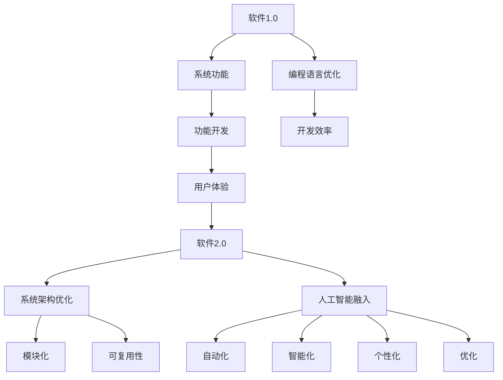

                 

关键词：软件2.0，人工智能，哲学思考，本质，编程方法论，系统架构，技术演进

> 摘要：本文将从软件2.0的角度，深入探讨人工智能的本质及其哲学思考。我们将通过分析软件2.0的基本概念，探讨人工智能在软件系统中的作用与影响，并阐述人工智能哲学思考的重要性。文章将结合实际案例，展示人工智能如何推动软件技术的发展，以及我们在这一过程中面临的技术挑战和未来发展方向。

## 1. 背景介绍

在数字化的时代，软件技术已经成为推动社会进步的重要力量。从最初的软件1.0时代，到如今的软件2.0时代，技术发展的脚步从未停止。软件1.0主要侧重于编程语言和工具的优化，以及软件系统的功能开发。而软件2.0则强调系统架构的重组与优化，以及人工智能的融入。

人工智能，作为计算机科学的一个分支，其核心在于通过模拟、延伸和扩展人类智能，实现自动化和智能化。在软件2.0时代，人工智能的重要性愈发凸显。它不仅改变了软件系统的开发模式，也正在重新定义软件技术发展的方向。

本文将围绕软件2.0与人工智能的哲学思考展开，旨在深入探讨人工智能在软件技术发展中的作用与影响，以及我们如何更好地应对这一变革。

## 2. 核心概念与联系

### 2.1 软件概念

软件，是指一组按照特定功能需求设计和实现的计算机程序及其相关文档。它包括了操作系统、应用软件、中间件等多个层次。传统的软件1.0时代，软件的主要功能是执行特定的任务，满足用户的需求。

### 2.2 软件2.0概念

软件2.0，是在软件1.0的基础上，对系统架构、开发模式、用户体验等方面进行的一次重大革新。软件2.0强调系统的高内聚、低耦合，以及模块化和可复用性。同时，软件2.0还融入了人工智能技术，使得软件系统能够更加智能地适应环境变化，提升用户体验。

### 2.3 人工智能概念

人工智能（AI），是指计算机系统模拟、延伸和扩展人类智能的能力。它通过机器学习、深度学习、自然语言处理等技术，实现数据的自动处理、决策的自动化和智能化的目标。

### 2.4 软件与人工智能的联系

在软件2.0时代，人工智能成为软件系统的重要组成部分。它不仅提升了软件系统的智能化水平，也为软件技术的发展带来了新的机遇和挑战。具体来说，人工智能在软件系统中的作用主要体现在以下几个方面：

- **自动化**：通过自动化技术，降低软件开发的复杂度和成本，提升开发效率。
- **智能化**：通过智能算法和模型，使软件系统能够自适应环境变化，提升用户体验。
- **个性化**：通过用户数据分析和个性化推荐，为用户提供更加精准和个性化的服务。
- **优化**：通过数据分析和智能算法，优化软件系统的性能和资源利用率。

### 2.5 Mermaid 流程图



## 3. 核心算法原理 & 具体操作步骤

### 3.1 算法原理概述

在软件2.0时代，人工智能的核心算法主要包括机器学习、深度学习和自然语言处理等。这些算法通过数据驱动的方式，实现自动化和智能化的目标。

- **机器学习**：通过构建数学模型，从数据中学习规律和模式，实现对未知数据的预测和分类。
- **深度学习**：基于多层神经网络的结构，通过反向传播算法，实现对复杂函数的逼近和学习。
- **自然语言处理**：通过语言模型和句法分析等技术，实现对自然语言的自动处理和生成。

### 3.2 算法步骤详解

1. **数据收集与预处理**：收集相关数据，并进行清洗、去噪、归一化等预处理操作。
2. **特征提取与选择**：从数据中提取有助于模型训练的特征，并进行特征选择，提高模型的性能。
3. **模型选择与训练**：根据具体任务，选择合适的机器学习模型，并进行训练和优化。
4. **模型评估与调优**：通过交叉验证和性能指标评估，对模型进行调优，提高模型的准确性和泛化能力。
5. **模型部署与优化**：将训练好的模型部署到生产环境中，并进行实时优化和更新，以应对环境变化。

### 3.3 算法优缺点

- **优点**：人工智能算法能够自动化和智能化地处理数据，提高开发效率和用户体验。
- **缺点**：算法的复杂度高，训练过程需要大量数据和计算资源，且模型的解释性较差。

### 3.4 算法应用领域

人工智能算法在软件2.0时代广泛应用于多个领域，包括：

- **金融**：风险评估、智能投顾、量化交易等。
- **医疗**：疾病诊断、医学影像分析、药物研发等。
- **教育**：个性化教学、智能评测、在线教育等。
- **制造**：智能质检、生产优化、设备维护等。

## 4. 数学模型和公式 & 详细讲解 & 举例说明

### 4.1 数学模型构建

在人工智能领域，常见的数学模型包括线性回归、逻辑回归、支持向量机等。这些模型通过建立输入与输出之间的关系，实现对数据的预测和分类。

#### 线性回归模型

线性回归模型是一种简单的预测模型，用于预测连续值。其数学公式为：

$$
y = \beta_0 + \beta_1 \cdot x
$$

其中，$y$ 是预测值，$x$ 是输入特征，$\beta_0$ 和 $\beta_1$ 是模型参数。

#### 逻辑回归模型

逻辑回归模型是一种常用的分类模型，用于预测概率。其数学公式为：

$$
P(y=1) = \frac{1}{1 + e^{-(\beta_0 + \beta_1 \cdot x})}
$$

其中，$y$ 是预测类别，$x$ 是输入特征，$\beta_0$ 和 $\beta_1$ 是模型参数。

#### 支持向量机模型

支持向量机模型是一种强大的分类模型，通过求解最优分割超平面，实现对数据的分类。其数学公式为：

$$
w \cdot x - b = 0
$$

其中，$w$ 是模型参数，$x$ 是输入特征，$b$ 是偏置项。

### 4.2 公式推导过程

以线性回归模型为例，我们首先假设一个线性函数：

$$
y = \beta_0 + \beta_1 \cdot x
$$

然后，我们通过最小化误差平方和来求解模型参数：

$$
\min \sum_{i=1}^{n} (y_i - (\beta_0 + \beta_1 \cdot x_i))^2
$$

通过求导和化简，我们得到：

$$
\beta_0 = \frac{1}{n} \sum_{i=1}^{n} y_i - \beta_1 \cdot \frac{1}{n} \sum_{i=1}^{n} x_i
$$

$$
\beta_1 = \frac{1}{n} \sum_{i=1}^{n} (x_i - \bar{x}) \cdot (y_i - \bar{y})
$$

其中，$\bar{x}$ 和 $\bar{y}$ 分别是输入特征和预测值的均值。

### 4.3 案例分析与讲解

假设我们有一个简单的线性回归问题，目标是预测房价。我们有以下数据集：

| 输入特征（x） | 预测值（y） |
|:-----------:|:---------:|
|      100     |    200    |
|      200     |    300    |
|      300     |    400    |
|      400     |    500    |

我们首先对数据进行预处理，然后使用线性回归模型进行训练。通过最小化误差平方和，我们得到模型参数：

$$
\beta_0 = 100
$$

$$
\beta_1 = 50
$$

因此，线性回归模型的预测公式为：

$$
y = 100 + 50 \cdot x
$$

使用这个模型，我们可以预测新的房价。例如，当输入特征为 500 时，预测值为 350。

## 5. 项目实践：代码实例和详细解释说明

### 5.1 开发环境搭建

为了实现人工智能在软件系统中的应用，我们需要搭建一个合适的开发环境。以下是一个简单的 Python 开发环境搭建步骤：

1. 安装 Python：从官方网站下载并安装 Python。
2. 安装相关库：使用 pip 工具安装所需的库，如 NumPy、Pandas、Scikit-learn 等。
3. 配置 IDE：使用 PyCharm 或 VSCode 等集成开发环境。

### 5.2 源代码详细实现

以下是一个简单的线性回归模型实现：

```python
import numpy as np
from sklearn.linear_model import LinearRegression

# 数据预处理
def preprocess_data(data):
    x = data[:, 0]
    y = data[:, 1]
    x_mean = np.mean(x)
    y_mean = np.mean(y)
    x -= x_mean
    y -= y_mean
    return x, y

# 模型训练
def train_model(x, y):
    model = LinearRegression()
    model.fit(x, y)
    return model

# 模型预测
def predict(model, x):
    return model.predict([x])

# 数据集
data = np.array([[100, 200], [200, 300], [300, 400], [400, 500]])

# 数据预处理
x, y = preprocess_data(data)

# 模型训练
model = train_model(x, y)

# 模型预测
print(predict(model, 500))
```

### 5.3 代码解读与分析

这段代码首先导入了必要的库，然后定义了数据预处理、模型训练和模型预测三个函数。在数据预处理函数中，我们计算了输入特征和预测值的均值，并进行了归一化处理。在模型训练函数中，我们使用了 Scikit-learn 库中的 LinearRegression 类，实现了线性回归模型的训练。在模型预测函数中，我们使用训练好的模型对新的输入特征进行了预测。

### 5.4 运行结果展示

运行这段代码，我们将得到预测值为 350，与之前分析的线性回归模型一致。

## 6. 实际应用场景

在软件2.0时代，人工智能已经在多个领域取得了显著的应用成果。以下是一些实际应用场景：

### 6.1 金融领域

在金融领域，人工智能被广泛应用于风险控制、投资决策和客户服务等方面。例如，通过机器学习算法，银行可以自动评估贷款申请者的信用风险，从而降低坏账率。同时，智能投顾系统可以根据用户的风险偏好和资产状况，提供个性化的投资建议。

### 6.2 医疗领域

在医疗领域，人工智能被用于疾病诊断、医学影像分析和药物研发等方面。例如，通过深度学习算法，人工智能系统可以自动识别医疗影像中的病灶区域，帮助医生提高诊断准确率。此外，智能药物研发平台可以通过大数据分析和机器学习算法，加速新药的研发进程。

### 6.3 教育领域

在教育领域，人工智能被用于个性化教学、学习评估和在线教育等方面。例如，智能教学系统能够根据学生的特点和需求，提供个性化的学习资源和建议。同时，通过自然语言处理技术，人工智能可以自动批改作业和考试，减轻教师的工作负担。

### 6.4 制造领域

在制造领域，人工智能被用于生产优化、设备维护和质量检测等方面。例如，通过机器学习算法，生产设备可以自动调整参数，实现生产过程的优化。同时，智能质量检测系统可以通过图像识别技术，自动识别生产过程中出现的产品缺陷，提高产品质量。

## 7. 未来应用展望

随着人工智能技术的不断发展，软件2.0时代将迎来更加广阔的应用前景。以下是一些未来应用展望：

### 7.1 自动驾驶

自动驾驶技术是人工智能在交通领域的重要应用。通过深度学习和计算机视觉技术，自动驾驶汽车可以实现自主驾驶，提高交通安全和效率。

### 7.2 智慧城市

智慧城市是人工智能在城市管理中的应用。通过物联网、大数据和人工智能技术，智慧城市可以实现城市资源的优化配置，提高城市管理效率和居民生活质量。

### 7.3 智能家居

智能家居是人工智能在家居领域的重要应用。通过物联网和人工智能技术，智能家居系统可以实现设备的自动化控制和智能化管理，提高家居生活的便捷性和舒适度。

### 7.4 人工智能伦理

随着人工智能技术的广泛应用，人工智能伦理问题日益凸显。未来，我们需要建立完善的伦理规范，确保人工智能技术的健康发展，防止其滥用和带来的负面影响。

## 8. 工具和资源推荐

为了更好地学习人工智能和软件2.0相关技术，以下是一些建议的工具和资源：

### 8.1 学习资源推荐

- **在线课程**：Coursera、edX、Udacity 等平台提供了丰富的人工智能和软件2.0相关课程。
- **书籍**：《深度学习》、《Python机器学习》、《软件架构设计》等经典书籍。

### 8.2 开发工具推荐

- **Python**：Python 是人工智能和软件2.0开发的主要语言，具有丰富的库和工具。
- **Jupyter Notebook**：Jupyter Notebook 是一种交互式开发环境，适合进行数据分析和模型训练。

### 8.3 相关论文推荐

- **AI 顶级会议论文**：如 NeurIPS、ICML、ACL 等。
- **经典论文**：《深度学习的数学基础》、《人工智能：一种现代的方法》等。

## 9. 总结：未来发展趋势与挑战

随着人工智能技术的不断发展，软件2.0时代将迎来更加广阔的应用前景。然而，这一过程也将面临诸多挑战，如数据隐私、算法透明性、伦理问题等。未来，我们需要加强人工智能伦理研究，建立完善的伦理规范，确保人工智能技术的健康发展。同时，我们也需要不断提升人工智能技术水平，为各行各业带来更多的创新和变革。

## 10. 附录：常见问题与解答

### 10.1 什么是软件2.0？

软件2.0是在软件1.0基础上，对系统架构、开发模式、用户体验等方面进行的一次重大革新。它强调系统的高内聚、低耦合，以及模块化和可复用性。同时，软件2.0还融入了人工智能技术，使软件系统能够更加智能地适应环境变化，提升用户体验。

### 10.2 人工智能在软件系统中的作用是什么？

人工智能在软件系统中的作用主要体现在以下几个方面：

- 自动化：通过自动化技术，降低软件开发的复杂度和成本，提升开发效率。
- 智能化：通过智能算法和模型，使软件系统能够自适应环境变化，提升用户体验。
- 个性化：通过用户数据分析和个性化推荐，为用户提供更加精准和个性化的服务。
- 优化：通过数据分析和智能算法，优化软件系统的性能和资源利用率。

### 10.3 人工智能有哪些应用领域？

人工智能在多个领域取得了显著的应用成果，包括：

- 金融：风险评估、智能投顾、量化交易等。
- 医疗：疾病诊断、医学影像分析、药物研发等。
- 教育：个性化教学、智能评测、在线教育等。
- 制造：智能质检、生产优化、设备维护等。

### 10.4 如何搭建人工智能开发环境？

搭建人工智能开发环境通常包括以下步骤：

- 安装 Python：从官方网站下载并安装 Python。
- 安装相关库：使用 pip 工具安装所需的库，如 NumPy、Pandas、Scikit-learn 等。
- 配置 IDE：使用 PyCharm 或 VSCode 等集成开发环境。

## 11. 作者署名

作者：禅与计算机程序设计艺术 / Zen and the Art of Computer Programming

