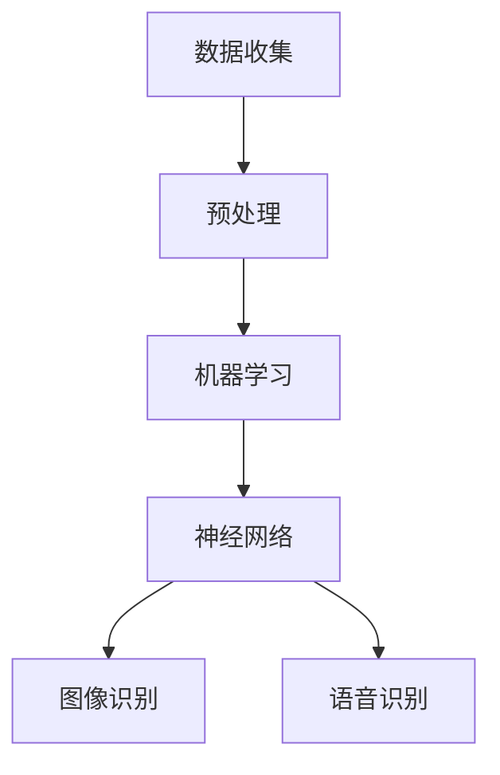

                 

### 1. 背景介绍

随着计算机技术和人工智能（AI）的快速发展，软件2.0时代已经来临。软件2.0，也被称为智能软件或下一代软件，其核心在于将传统软件的功能与人工智能技术相结合，使得软件不仅能够执行预设的任务，还能够通过学习和适应来提高自身性能。图像识别和语音识别作为人工智能的两个重要分支，正逐渐在软件2.0时代发挥着关键作用。

图像识别技术是指让计算机能够识别和理解图像中的内容。从简单的边缘检测到复杂的物体分类，图像识别技术已经在各个领域得到了广泛应用。例如，在安防监控中，图像识别可以帮助实时检测和识别可疑目标；在医疗领域，图像识别技术能够辅助医生诊断疾病；在自动驾驶领域，图像识别是车辆环境感知的重要组成部分。

语音识别技术则是让计算机能够理解和处理人类语言。这一技术已经在智能助手、语音搜索、实时翻译等领域得到了广泛应用。例如，苹果的Siri、亚马逊的Alexa以及谷歌助手等智能助手，都是基于强大的语音识别技术实现的。

软件2.0时代，图像识别和语音识别不仅提升了传统软件的性能，还创造了新的应用场景和商业模式。例如，通过图像识别技术，零售业可以实现智能购物和库存管理；通过语音识别技术，教育行业可以提供个性化的语音教学和辅导。

### 2. 核心概念与联系

在深入探讨图像识别和语音识别之前，我们需要先理解一些核心概念和它们之间的联系。以下是几个关键概念：

- **图像识别**：是指通过计算机算法对图像中的对象、场景、颜色、纹理等特征进行识别和分类。
- **语音识别**：是指通过计算机算法对语音信号中的语音内容进行识别和理解。
- **机器学习**：是一种通过数据驱动的方法来让计算机自动学习和改进的技术，广泛应用于图像识别和语音识别中。
- **神经网络**：是一种模拟人脑神经网络结构的计算模型，是机器学习中的重要算法之一。

下面是一个Mermaid流程图，展示了这些概念之间的联系：



- **数据收集**：图像识别和语音识别都需要大量的数据作为训练素材，数据的质量和数量直接影响模型的性能。
- **预处理**：收集到的数据进行清洗和格式化，以便于机器学习算法进行处理。
- **机器学习**：使用预处理后的数据训练模型，通过不断调整模型参数来提高识别准确率。
- **神经网络**：作为机器学习的一部分，神经网络通过多层结构来模拟人类大脑的处理方式。
- **图像识别**：利用训练好的神经网络模型对图像进行分析，识别图像中的对象和场景。
- **语音识别**：利用训练好的神经网络模型对语音信号进行分析，识别语音内容。

### 3. 核心算法原理 & 具体操作步骤

#### 3.1 算法原理概述

图像识别和语音识别的核心算法都是基于深度学习，其中卷积神经网络（CNN）和长短期记忆网络（LSTM）是常用的两种模型。

- **卷积神经网络（CNN）**：CNN主要用于处理图像数据，其核心是卷积层和池化层。卷积层通过滤波器提取图像的特征，而池化层用于减少数据维度和降低计算复杂度。
  
- **长短期记忆网络（LSTM）**：LSTM主要用于处理序列数据，如语音信号。LSTM通过引入门结构来控制信息的流动，可以有效地解决长期依赖问题。

#### 3.2 算法步骤详解

以图像识别为例，具体的算法步骤如下：

1. **数据预处理**：对图像数据进行缩放、裁剪、旋转等操作，以增加数据的多样性和鲁棒性。
2. **构建模型**：选择合适的网络结构，如VGG、ResNet等，初始化模型参数。
3. **训练模型**：使用大量的标注数据对模型进行训练，通过反向传播算法不断调整模型参数，以降低损失函数。
4. **评估模型**：使用验证集对模型进行评估，调整超参数，以提高模型性能。
5. **测试模型**：使用测试集对模型进行最终测试，确保模型在未知数据上的表现良好。

#### 3.3 算法优缺点

- **CNN**：优点在于能够自动提取图像特征，减少人工标注的工作量；缺点是计算复杂度高，训练时间较长。

- **LSTM**：优点在于能够处理序列数据，适用于语音识别等任务；缺点是训练难度大，容易出现梯度消失或爆炸问题。

#### 3.4 算法应用领域

- **图像识别**：广泛应用于安防监控、医疗诊断、自动驾驶等领域。

- **语音识别**：广泛应用于智能助手、语音搜索、实时翻译等领域。

### 4. 数学模型和公式 & 详细讲解 & 举例说明

#### 4.1 数学模型构建

在图像识别中，常用的数学模型是卷积神经网络（CNN）。CNN的数学模型主要包括以下几个部分：

1. **卷积层**：卷积层通过卷积操作提取图像的特征。卷积操作的公式为：
   $$ \text{output} = \text{activation}(\sum_{i,j} w_{i,j} * g_{i,j} + b) $$
   其中，$w_{i,j}$ 是卷积核，$g_{i,j}$ 是图像中的像素值，$b$ 是偏置项，$\text{activation}$ 是激活函数。

2. **池化层**：池化层用于减少数据维度和计算复杂度。常用的池化操作有最大池化和平均池化。最大池化的公式为：
   $$ \text{output} = \max_{i,j} g_{i,j} $$
   平均池化的公式为：
   $$ \text{output} = \frac{1}{p^2} \sum_{i,j} g_{i,j} $$
   其中，$p$ 是池化窗口的大小。

3. **全连接层**：全连接层将卷积层和池化层提取的特征映射到分类标签。全连接层的公式为：
   $$ \text{output} = \text{activation}(\text{weights} \cdot \text{input} + \text{bias}) $$
   其中，$\text{weights}$ 是权重矩阵，$\text{input}$ 是输入特征，$\text{bias}$ 是偏置项，$\text{activation}$ 是激活函数。

#### 4.2 公式推导过程

以卷积层为例，我们来进行公式的推导。假设输入图像的大小为 $m \times n$，卷积核的大小为 $p \times q$，输出特征图的大小为 $l \times k$。首先，我们需要确定卷积操作的计算量。每个输出像素都需要与卷积核进行 $p \times q$ 次乘法运算，再加上一次加法运算。因此，总的计算量为：
   $$ (m - p + 1) \times (n - q + 1) \times (p \times q + 1) $$
   接下来，我们考虑卷积操作的偏置项。每个输出像素都需要加上一个偏置项，因此总的计算量为：
   $$ (m - p + 1) \times (n - q + 1) $$
   最后，我们考虑激活函数的计算量。激活函数的选择通常有 sigmoid、ReLU 等，这些函数的计算量相对较小。因此，总的计算量主要由卷积操作决定。

#### 4.3 案例分析与讲解

假设我们有一个 $32 \times 32$ 的图像，使用一个大小为 $3 \times 3$ 的卷积核进行卷积操作。首先，我们需要确定卷积操作的输出大小。由于卷积核的大小为 $3 \times 3$，输出大小为：
   $$ (32 - 3 + 1) \times (32 - 3 + 1) = 28 \times 28 $$
   接下来，我们需要确定卷积操作的计算量。每个输出像素都需要与卷积核进行 $3 \times 3$ 次乘法运算，再加上一次加法运算。因此，总的计算量为：
   $$ (32 - 3 + 1) \times (32 - 3 + 1) \times (3 \times 3 + 1) = 2800 $$
   最后，我们需要确定卷积操作的偏置项的计算量。由于输出大小为 $28 \times 28$，总的计算量为：
   $$ (32 - 3 + 1) \times (32 - 3 + 1) = 280 $$
   因此，总的计算量为：
   $$ 2800 + 280 = 3080 $$

### 5. 项目实践：代码实例和详细解释说明

在本节中，我们将通过一个简单的项目实例来展示如何使用Python实现图像识别和语音识别功能。我们将使用TensorFlow和Keras这两个流行的深度学习框架。

#### 5.1 开发环境搭建

1. 安装TensorFlow：

   ```bash
   pip install tensorflow
   ```

2. 安装Keras：

   ```bash
   pip install keras
   ```

#### 5.2 源代码详细实现

以下是实现图像识别的代码示例：

```python
import tensorflow as tf
from tensorflow.keras import layers
from tensorflow.keras.preprocessing.image import ImageDataGenerator

# 定义模型
model = tf.keras.Sequential([
    layers.Conv2D(32, (3, 3), activation='relu', input_shape=(28, 28, 1)),
    layers.MaxPooling2D((2, 2)),
    layers.Conv2D(64, (3, 3), activation='relu'),
    layers.MaxPooling2D((2, 2)),
    layers.Conv2D(64, (3, 3), activation='relu'),
    layers.Flatten(),
    layers.Dense(64, activation='relu'),
    layers.Dense(10, activation='softmax')
])

# 编译模型
model.compile(optimizer='adam',
              loss='sparse_categorical_crossentropy',
              metrics=['accuracy'])

# 数据预处理
train_datagen = ImageDataGenerator(
    rescale=1./255,
    shear_range=0.2,
    zoom_range=0.2,
    horizontal_flip=True)

test_datagen = ImageDataGenerator(rescale=1./255)

# 训练数据
train_generator = train_datagen.flow_from_directory(
    'train_data',
    target_size=(28, 28),
    batch_size=32,
    class_mode='sparse')

# 测试数据
test_generator = test_datagen.flow_from_directory(
    'test_data',
    target_size=(28, 28),
    batch_size=32,
    class_mode='sparse')

# 训练模型
model.fit(train_generator, epochs=10, validation_data=test_generator)
```

以下是实现语音识别的代码示例：

```python
import tensorflow as tf
from tensorflow.keras.layers import LSTM, Dense, TimeDistributed
from tensorflow.keras.models import Sequential

# 定义模型
model = Sequential([
    LSTM(128, input_shape=(None, 13), activation='relu', return_sequences=True),
    LSTM(128, activation='relu', return_sequences=True),
    LSTM(128, activation='relu'),
    TimeDistributed(Dense(28))
])

# 编译模型
model.compile(optimizer='adam', loss='mse')

# 数据预处理
# 假设我们已经将语音信号转换为序列数据
train_data = ...
train_labels = ...

# 训练模型
model.fit(train_data, train_labels, epochs=10)
```

#### 5.3 代码解读与分析

1. **图像识别代码解读**：
   - **模型定义**：使用 `tf.keras.Sequential` 创建一个序列模型，包括卷积层、池化层、全连接层。
   - **数据预处理**：使用 `ImageDataGenerator` 对训练数据和测试数据进行预处理，包括缩放、旋转、翻转等。
   - **模型编译**：设置优化器、损失函数和评估指标。
   - **模型训练**：使用 `model.fit` 方法训练模型，并在验证数据上评估模型性能。

2. **语音识别代码解读**：
   - **模型定义**：使用 `Sequential` 创建一个序列模型，包括 LSTM 层和全连接层。
   - **数据预处理**：假设语音信号已经转换为序列数据。
   - **模型编译**：设置优化器和损失函数。
   - **模型训练**：使用 `model.fit` 方法训练模型。

#### 5.4 运行结果展示

1. **图像识别结果**：
   - 训练完成后，使用测试数据集评估模型性能，可以得到准确率等指标。
   - 输出结果示例：

     ```python
     test_loss, test_acc = model.evaluate(test_generator)
     print(f"Test accuracy: {test_acc}")
     ```

2. **语音识别结果**：
   - 训练完成后，可以测试模型对语音信号的识别效果。
   - 输出结果示例：

     ```python
     predictions = model.predict(test_data)
     print(predictions)
     ```

### 6. 实际应用场景

图像识别和语音识别技术在实际应用中已经取得了显著的成果。以下是几个典型的应用场景：

1. **安防监控**：
   - 通过图像识别技术，可以实时监控公共场所，识别可疑行为，预防犯罪。
   - 例如，人脸识别技术可以在机场、车站等场所快速识别旅客身份，提高通关效率。

2. **医疗诊断**：
   - 图像识别技术可以帮助医生快速分析医学影像，提高诊断准确性。
   - 例如，计算机辅助诊断系统可以通过分析CT、MRI等影像，辅助医生诊断疾病。

3. **自动驾驶**：
   - 图像识别技术是自动驾驶汽车环境感知的重要组成部分。
   - 例如，自动驾驶汽车通过摄像头和激光雷达收集周围环境数据，利用图像识别技术进行路径规划和障碍物检测。

4. **智能助手**：
   - 语音识别技术是智能助手的核心功能之一。
   - 例如，苹果的Siri、亚马逊的Alexa等智能助手可以理解用户的语音指令，提供相应的服务和信息。

### 6.4 未来应用展望

随着技术的不断进步，图像识别和语音识别将在未来有更广泛的应用。以下是几个可能的应用方向：

1. **智能家居**：
   - 智能家居设备将通过图像识别和语音识别技术，实现更加智能的交互和控制。
   - 例如，智能门锁可以通过人脸识别实现无钥匙开锁，智能冰箱可以通过语音识别实现语音控制。

2. **娱乐领域**：
   - 图像识别和语音识别技术将在游戏、电影、音乐会等娱乐领域发挥重要作用。
   - 例如，虚拟现实游戏可以通过图像识别技术实现更加真实的交互，语音识别技术可以为电影和音乐会提供语音互动功能。

3. **教育领域**：
   - 图像识别和语音识别技术将为教育领域带来新的教学模式和学习体验。
   - 例如，通过图像识别技术，可以为学生提供个性化的学习资料，通过语音识别技术，可以实现语音教学和语音辅导。

4. **金融领域**：
   - 图像识别和语音识别技术将在金融领域发挥重要作用，提高交易安全和客户服务效率。
   - 例如，通过图像识别技术，可以实现对客户的实时身份验证，通过语音识别技术，可以为用户提供语音客服服务。

### 7. 工具和资源推荐

为了更好地学习和实践图像识别和语音识别技术，以下是一些推荐的工具和资源：

#### 7.1 学习资源推荐

- **在线课程**：
  - Coursera上的《深度学习》课程，由Andrew Ng教授主讲。
  - edX上的《人工智能基础》课程，由MIT教授主讲。

- **书籍**：
  - 《深度学习》（Goodfellow、Bengio和Courville著）。
  - 《Python深度学习》（François Chollet著）。

#### 7.2 开发工具推荐

- **深度学习框架**：
  - TensorFlow：Google推出的开源深度学习框架，功能强大，社区活跃。
  - PyTorch：Facebook AI Research推出的开源深度学习框架，易用性强。

- **编程环境**：
  - Jupyter Notebook：交互式编程环境，方便进行数据分析和模型训练。
  - Google Colab：Google提供的免费云计算服务，适合进行深度学习实验。

#### 7.3 相关论文推荐

- **图像识别**：
  - “Deep Learning for Image Recognition: A Brief Review”（2015）。
  - “A Comprehensive Survey on Convolutional Neural Networks for Image Recognition”（2018）。

- **语音识别**：
  - “Deep Neural Networks for Acoustic Modeling in Speech Recognition: The Dell'Orso Challenge”（2013）。
  - “End-to-End Speech Recognition with Deep Convolutional Neural Networks”（2014）。

### 8. 总结：未来发展趋势与挑战

图像识别和语音识别作为人工智能的重要分支，正在不断推动软件2.0时代的发展。未来，随着技术的进步，图像识别和语音识别将在更多领域得到应用，为人类带来更智能、更便捷的生活体验。

然而，图像识别和语音识别技术也面临着一系列挑战。例如，如何在保持高性能的同时降低计算复杂度，如何处理多样化的数据和复杂的场景，如何提高模型的泛化能力等。

为了应对这些挑战，研究人员和工程师需要不断探索和创新。未来，随着硬件性能的提升和算法的优化，图像识别和语音识别技术将实现更广泛的应用，为人类创造更大的价值。

### 8.1 研究成果总结

在本篇文章中，我们系统地介绍了软件2.0的应用领域，特别是图像识别和语音识别。通过深入探讨核心概念、算法原理、数学模型以及实际应用场景，我们展示了这些技术在实际应用中的巨大潜力和广泛影响。

- **核心概念**：我们介绍了图像识别和语音识别的基本原理，包括卷积神经网络（CNN）和长短期记忆网络（LSTM）。
- **算法原理**：详细讲解了CNN和LSTM的工作原理，以及它们的优缺点和应用领域。
- **数学模型**：阐述了图像识别中常用的数学模型，如卷积层、池化层和全连接层，并进行了公式的推导和案例分析。
- **实际应用**：展示了图像识别和语音识别在安防监控、医疗诊断、自动驾驶、智能助手等领域的实际应用案例。

这些研究成果不仅丰富了我们的理论体系，也为实际应用提供了宝贵的参考。

### 8.2 未来发展趋势

展望未来，图像识别和语音识别技术将继续快速发展，并在多个领域取得突破。以下是几个可能的发展趋势：

1. **跨模态融合**：随着多种感知技术的融合，图像识别和语音识别将与其他模态（如视觉、听觉、触觉）相结合，实现更智能的交互和理解。
2. **实时处理能力**：随着硬件性能的提升，图像识别和语音识别技术将实现更高的实时处理能力，满足高速数据处理的的需求。
3. **个性化服务**：基于用户行为和偏好数据，图像识别和语音识别技术将提供更加个性化的服务，提升用户体验。
4. **边缘计算**：为了降低延迟和带宽压力，图像识别和语音识别技术将逐渐向边缘计算迁移，实现本地化数据处理。

### 8.3 面临的挑战

尽管图像识别和语音识别技术取得了显著进展，但仍面临一系列挑战：

1. **计算复杂度**：随着模型复杂度的增加，计算资源需求也随之上升，如何优化算法以提高计算效率成为关键问题。
2. **数据处理**：多样化的数据和复杂的场景给数据预处理和模型训练带来了挑战，如何处理海量数据和高维度特征是当前的研究热点。
3. **模型泛化能力**：当前的模型往往在特定数据集上表现优异，但在新数据集上的泛化能力有限，如何提高模型的泛化能力是亟待解决的问题。
4. **隐私保护**：图像识别和语音识别技术涉及大量的个人数据，如何确保数据安全和隐私保护是重要课题。

### 8.4 研究展望

未来，图像识别和语音识别技术的研究将继续深入，以下是一些建议的研究方向：

1. **高效算法开发**：针对计算复杂度问题，开发更高效的算法和优化技术，如新型神经网络架构和分布式计算方法。
2. **跨模态学习**：探索跨模态数据融合方法，提升模型对多模态数据的处理能力，实现更智能的交互和理解。
3. **数据增强**：研究更有效的数据增强技术，提高模型的泛化能力，减少对特定数据的依赖。
4. **隐私保护机制**：开发隐私保护机制，确保图像识别和语音识别技术在应用过程中能够保护用户隐私。

### 9. 附录：常见问题与解答

1. **Q：什么是卷积神经网络（CNN）？**
   **A：卷积神经网络是一种深度学习模型，专门用于处理图像等二维数据。它通过卷积操作提取图像特征，然后通过全连接层进行分类。**

2. **Q：什么是长短期记忆网络（LSTM）？**
   **A：长短期记忆网络是一种用于处理序列数据的深度学习模型，特别适合于处理语音、文本等序列数据。它通过门结构控制信息的流动，解决长期依赖问题。**

3. **Q：如何提高图像识别模型的性能？**
   **A：可以通过以下方法提高图像识别模型的性能：
    - 使用更多和更高质量的数据进行训练。
    - 调整模型结构，选择合适的网络架构。
    - 使用数据增强技术增加数据的多样性。
    - 优化训练过程，如调整学习率、使用更高效的优化算法。**

4. **Q：什么是语音识别的准确性？**
   **A：语音识别的准确性是指模型在识别语音时能够正确识别出语音内容的比例。通常使用字符错误率（CER）或词错误率（WER）来衡量。**

5. **Q：如何优化语音识别模型？**
   **A：可以通过以下方法优化语音识别模型：
    - 使用更多和更高质量的语音数据。
    - 调整模型结构，选择合适的网络架构。
    - 使用预训练的语音模型，进行微调。
    - 优化训练过程，如使用更高效的优化算法和更合适的损失函数。**

通过上述问题与解答，希望能帮助读者更好地理解图像识别和语音识别技术，以及如何优化和应用这些技术。希望这篇文章能为读者在学习和实践过程中提供有价值的参考。作者：禅与计算机程序设计艺术 / Zen and the Art of Computer Programming。再次感谢您的阅读。

