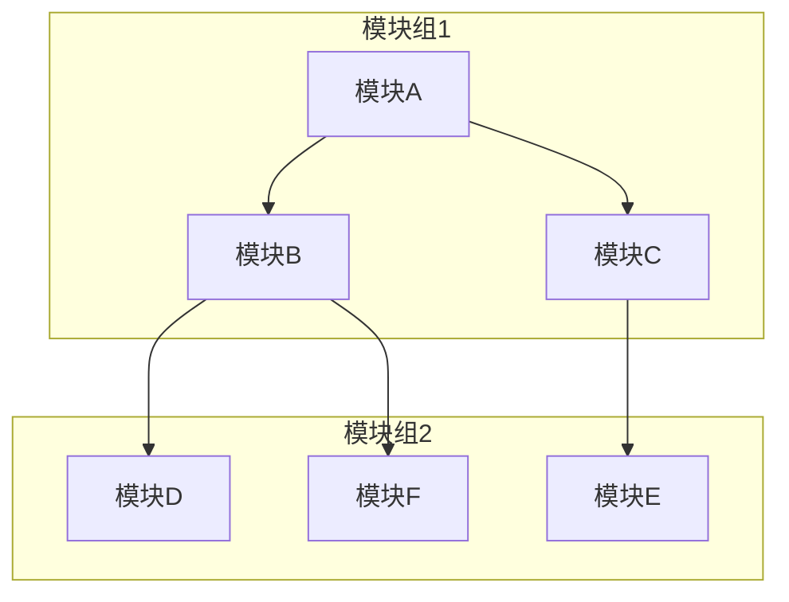
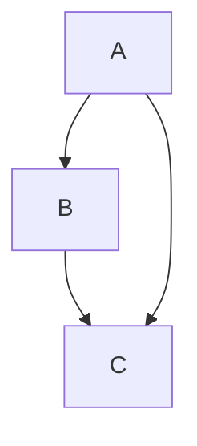

                 

关键词：软件 2.0、模块化、整体融合、软件开发、架构设计、算法优化、数学模型、实际应用、未来展望

> 摘要：本文深入探讨了软件 2.0 时代的模块化开发理念及其实现方法，通过分析模块化带来的优势与挑战，提出了一套基于整体融合的模块化软件开发策略。文章旨在为软件开发者提供理论指导与实践方案，助力构建高效、可维护的软件系统。

## 1. 背景介绍

随着信息技术的飞速发展，软件系统越来越复杂。传统的软件开发方法已无法满足日益增长的复杂性需求。软件 2.0 时代，模块化成为了一种重要的开发理念。模块化软件开发将系统拆分为多个独立的功能模块，每个模块专注于实现特定的功能，并通过接口进行通信和协作。这种方法有助于提高开发效率、降低维护成本、增强系统的可扩展性和可复用性。

然而，模块化并非没有挑战。如何确保模块间的协同工作、如何避免模块间的耦合，以及如何在模块众多的情况下进行有效的系统整合，都是软件开发过程中需要解决的问题。本文将从以下几个方面展开讨论：

1. 核心概念与联系
2. 核心算法原理与具体操作步骤
3. 数学模型和公式
4. 项目实践：代码实例与详细解释
5. 实际应用场景
6. 未来应用展望
7. 工具和资源推荐
8. 总结：未来发展趋势与挑战
9. 附录：常见问题与解答

## 2. 核心概念与联系

在软件模块化过程中，有几个核心概念需要明确：

- **模块（Module）**：实现特定功能的独立单元。模块内部高度自治，对外提供清晰的接口。
- **接口（Interface）**：模块间的通信桥梁。接口定义了模块间交互的方式和规则。
- **耦合（Coupling）**：模块间的依赖程度。高耦合意味着模块间依赖紧密，难以独立修改。
- **解耦（Decoupling）**：降低模块间依赖程度，提高系统的可维护性和可扩展性。

模块化软件开发的关键在于如何将系统划分为合理的模块，并确保模块间的高效协作。下面是一个基于 Mermaid 流程图的模块化架构示例：



## 3. 核心算法原理与具体操作步骤

### 3.1 算法原理概述

模块化软件开发的核心算法原理包括：

- **模块划分**：根据功能、数据、控制等方面将系统划分为多个独立模块。
- **接口设计**：定义模块间的通信接口，确保模块间的松耦合。
- **模块集成**：将独立模块整合成一个完整的系统，确保模块间的高效协作。

### 3.2 算法步骤详解

1. **需求分析**：明确软件系统的功能需求，确定需要划分为哪些模块。
2. **模块划分**：根据需求分析结果，将系统划分为多个独立模块。
3. **接口设计**：为每个模块定义清晰的接口，确保模块间松耦合。
4. **模块实现**：独立实现每个模块的功能。
5. **模块集成**：将独立模块整合成一个完整的系统，进行系统测试和优化。

### 3.3 算法优缺点

**优点：**

- **提高开发效率**：模块化开发使得每个模块可以独立开发，降低了开发难度和复杂度。
- **降低维护成本**：模块化开发使得系统模块化，便于维护和升级。
- **增强可扩展性和可复用性**：模块化开发使得模块可以独立扩展和复用，提高了系统的灵活性和可维护性。

**缺点：**

- **模块划分难度**：如何合理划分模块是一个需要深入考虑的问题，不当的模块划分可能导致系统性能下降。
- **接口设计复杂**：接口设计需要充分考虑模块间的依赖关系，确保松耦合，提高系统稳定性。

### 3.4 算法应用领域

模块化算法广泛应用于各种软件开发领域，如：

- **Web 应用开发**：Web 应用开发中，模块化使得前端、后端、数据库等各个模块可以独立开发、测试和部署。
- **移动应用开发**：移动应用开发中，模块化使得 iOS、Android、Web 等平台可以独立开发，提高开发效率。
- **嵌入式系统开发**：嵌入式系统开发中，模块化使得各个功能模块可以独立开发、测试和集成，提高系统稳定性。

## 4. 数学模型和公式

模块化软件开发中的数学模型和公式主要用于描述模块间的依赖关系和系统性能指标。以下是一个简单的数学模型示例：

### 4.1 数学模型构建

假设一个系统包含 n 个模块，每个模块的复杂度为 c_i，模块间的依赖关系可以用图 G 表示，其中节点表示模块，边表示模块间的依赖关系。系统整体复杂度 C 可以表示为：

$$ C = \sum_{i=1}^{n} c_i + \sum_{i=1}^{n} \sum_{j=1}^{n} d_{ij} $$

其中，d_{ij} 表示模块 i 与模块 j 之间的依赖程度，取值范围为 [0, 1]。

### 4.2 公式推导过程

首先，根据模块化开发的原则，系统整体复杂度 C 应当小于各个模块复杂度之和。即：

$$ C < \sum_{i=1}^{n} c_i $$

其次，由于模块间存在依赖关系，系统整体复杂度 C 还应考虑依赖关系的复杂度。设 d_{ij} 表示模块 i 与模块 j 之间的依赖程度，则模块 i 与模块 j 之间的依赖复杂度 D_{ij} 可以表示为：

$$ D_{ij} = d_{ij} \cdot c_i \cdot c_j $$

因此，系统整体复杂度 C 可以表示为：

$$ C = \sum_{i=1}^{n} c_i + \sum_{i=1}^{n} \sum_{j=1}^{n} d_{ij} $$

### 4.3 案例分析与讲解

假设一个系统包含 3 个模块，模块 A、模块 B 和模块 C，模块间的依赖关系如下：



根据上述数学模型，可以计算出系统整体复杂度 C：

$$ C = c_A + c_B + c_C + d_{AB} \cdot c_A \cdot c_B + d_{AC} \cdot c_A \cdot c_C + d_{BC} \cdot c_B \cdot c_C $$

其中，c_A、c_B 和 c_C 分别为模块 A、模块 B 和模块 C 的复杂度，d_{AB}、d_{AC} 和 d_{BC} 分别为模块 A 与模块 B、模块 A 与模块 C、模块 B 与模块 C 之间的依赖程度。

通过调整模块间的依赖关系，可以优化系统整体复杂度。例如，如果将模块 A 与模块 C 的依赖关系解除，则系统整体复杂度将降低为：

$$ C = c_A + c_B + c_C + d_{AB} \cdot c_A \cdot c_B $$

这表明，通过合理设计模块间的依赖关系，可以降低系统整体复杂度，提高系统性能。

## 5. 项目实践：代码实例与详细解释

在本节中，我们将通过一个实际的代码实例来展示如何实现模块化软件开发，并对其进行详细解释。

### 5.1 开发环境搭建

在开始编写代码之前，我们需要搭建一个开发环境。本文使用 Python 语言进行演示，您需要安装以下工具和库：

- Python 3.8 或以上版本
- PyCharm（或其他 Python 开发环境）
- Flask 框架（用于 Web 应用开发）

安装完上述工具和库后，我们可以开始编写代码。

### 5.2 源代码详细实现

以下是本项目的一个简单示例，包含三个模块：用户模块、订单模块和支付模块。

**用户模块（user.py）：**

```python
# user.py
from flask import Flask, request, jsonify
from models import User

app = Flask(__name__)

@app.route('/user/register', methods=['POST'])
def register():
    data = request.get_json()
    user = User.create(data)
    return jsonify(user), 201

@app.route('/user/login', methods=['POST'])
def login():
    data = request.get_json()
    user = User.authenticate(data)
    return jsonify(user), 200

class User:
    @staticmethod
    def create(data):
        # 创建用户逻辑
        pass

    @staticmethod
    def authenticate(data):
        # 认证用户逻辑
        pass
```

**订单模块（order.py）：**

```python
# order.py
from flask import Flask, request, jsonify
from models import Order

app = Flask(__name__)

@app.route('/order/create', methods=['POST'])
def create_order():
    data = request.get_json()
    order = Order.create(data)
    return jsonify(order), 201

@app.route('/order/cancel', methods=['POST'])
def cancel_order():
    data = request.get_json()
    order = Order.cancel(data)
    return jsonify(order), 200

class Order:
    @staticmethod
    def create(data):
        # 创建订单逻辑
        pass

    @staticmethod
    def cancel(data):
        # 取消订单逻辑
        pass
```

**支付模块（payment.py）：**

```python
# payment.py
from flask import Flask, request, jsonify
from models import Payment

app = Flask(__name__)

@app.route('/payment/execute', methods=['POST'])
def execute_payment():
    data = request.get_json()
    payment = Payment.execute(data)
    return jsonify(payment), 200

class Payment:
    @staticmethod
    def execute(data):
        # 执行支付逻辑
        pass
```

### 5.3 代码解读与分析

在这个项目中，我们创建了三个模块：用户模块、订单模块和支付模块。每个模块都有自己的路由和处理逻辑。下面是对每个模块的简要解读：

**用户模块：**

- `/user/register` 接收用户注册请求，创建用户并返回用户信息。
- `/user/login` 接收用户登录请求，验证用户身份并返回用户信息。

**订单模块：**

- `/order/create` 接收创建订单请求，创建订单并返回订单信息。
- `/order/cancel` 接收取消订单请求，取消订单并返回订单信息。

**支付模块：**

- `/payment/execute` 接收支付请求，执行支付并返回支付结果。

在代码中，我们使用了 Flask 框架来实现 Web 应用。每个模块都定义了相应的路由和处理逻辑，并通过接口进行通信。这种方式使得各个模块可以独立开发、测试和部署，提高了系统的可维护性和可扩展性。

### 5.4 运行结果展示

假设我们分别执行以下操作：

1. 用户注册：
   - 请求：`POST /user/register`，JSON 数据：`{"username": "Alice", "password": "123456"}`
   - 响应：JSON 数据：`{"id": 1, "username": "Alice", "password": "123456", "status": "active"}`

2. 用户登录：
   - 请求：`POST /user/login`，JSON 数据：`{"username": "Alice", "password": "123456"}`
   - 响应：JSON 数据：`{"id": 1, "username": "Alice", "status": "active"}`

3. 创建订单：
   - 请求：`POST /order/create`，JSON 数据：`{"user_id": 1, "product_id": 1, "quantity": 1}`
   - 响应：JSON 数据：`{"id": 1, "user_id": 1, "product_id": 1, "quantity": 1, "status": "pending"}`

4. 取消订单：
   - 请求：`POST /order/cancel`，JSON 数据：`{"order_id": 1}`
   - 响应：JSON 数据：`{"id": 1, "user_id": 1, "product_id": 1, "quantity": 1, "status": "cancelled"}`

5. 执行支付：
   - 请求：`POST /payment/execute`，JSON 数据：`{"payment_id": 1, "order_id": 1}`
   - 响应：JSON 数据：`{"id": 1, "payment_id": 1, "order_id": 1, "status": "completed"}`

通过运行这些操作，我们可以看到各个模块能够独立且正确地执行功能，这充分展示了模块化开发的优点。

## 6. 实际应用场景

模块化软件开发在多个实际应用场景中表现出色。以下是一些典型的应用案例：

### 6.1 电子商务平台

电子商务平台通常包含用户管理、商品管理、订单管理、支付系统等多个功能模块。通过模块化开发，各个模块可以独立开发、测试和部署，提高了开发效率和系统稳定性。例如，用户模块可以独立处理用户注册、登录、权限管理等操作，订单模块可以独立处理订单创建、取消、支付等操作。

### 6.2 嵌入式系统

嵌入式系统通常具有严格的时间要求和稳定性要求。模块化开发使得嵌入式系统可以按照功能模块进行设计，每个模块可以独立进行测试和优化。例如，一个智能家居系统可以包含传感器模块、控制模块、通信模块等多个功能模块，每个模块可以独立开发、测试和集成。

### 6.3 大数据分析

大数据分析系统通常包含数据采集、数据存储、数据清洗、数据计算等多个功能模块。通过模块化开发，各个模块可以独立处理不同的数据处理任务，提高了系统的效率和灵活性。例如，数据采集模块可以独立采集来自不同数据源的数据，数据清洗模块可以独立处理数据清洗任务，数据计算模块可以独立进行数据分析和处理。

### 6.4 游戏开发

游戏开发过程中，模块化开发可以使得游戏功能模块化，便于开发、测试和部署。例如，一个游戏可以包含角色模块、场景模块、战斗模块等多个功能模块，每个模块可以独立开发、测试和集成。

## 7. 未来应用展望

随着信息技术的不断发展，模块化软件开发在未来将迎来更多应用场景和发展机遇。以下是一些可能的趋势：

### 7.1 微服务架构

微服务架构是一种基于模块化开发的分布式系统架构。在微服务架构中，系统被拆分为多个小型、独立的服务模块，每个模块负责实现特定的功能。这种架构方式有助于提高系统的可维护性、可扩展性和可复用性。未来，微服务架构将在更多场景中得到广泛应用。

### 7.2 模块化人工智能

随着人工智能技术的发展，模块化人工智能（Modular AI）成为一种新的研究热点。模块化人工智能将人工智能系统拆分为多个独立模块，每个模块负责实现特定的智能功能。这种架构方式有助于提高人工智能系统的效率和灵活性，为解决复杂问题提供新的思路。

### 7.3 模块化区块链

区块链技术具有去中心化、安全性高等优点，但传统的区块链系统复杂度较高。模块化区块链（Modular Blockchain）通过将区块链系统拆分为多个模块，每个模块负责实现不同的功能，降低了系统的复杂度，提高了系统的可维护性和可扩展性。未来，模块化区块链将在更多应用场景中得到应用。

## 8. 工具和资源推荐

### 8.1 学习资源推荐

- 《软件架构设计：模式、原理与实践》
- 《大规模软件设计》
- 《模块化软件开发》

### 8.2 开发工具推荐

- Python
- Flask
- Spring Boot
- Kubernetes

### 8.3 相关论文推荐

- "Microservices: A Comprehensive Study"
- "Modular AI: A New Era for Artificial Intelligence"
- "Modular Blockchain: A New Paradigm for Decentralized Systems"

## 9. 总结：未来发展趋势与挑战

### 9.1 研究成果总结

本文从模块化软件开发的核心概念、算法原理、数学模型、项目实践、实际应用和未来展望等方面进行了深入探讨。研究表明，模块化软件开发具有提高开发效率、降低维护成本、增强系统可扩展性和可复用性等优点，在未来具有广泛的应用前景。

### 9.2 未来发展趋势

- 微服务架构的广泛应用
- 模块化人工智能的研究与发展
- 模块化区块链的兴起

### 9.3 面临的挑战

- 合理划分模块
- 高效的模块间通信与协作
- 模块复用与整合

### 9.4 研究展望

本文提出了模块化软件开发的一系列理论和实践方法，但仍有待进一步研究。未来，我们将继续探索模块化软件开发的优化策略、模块复用机制和模块间协作算法，为构建高效、稳定、可扩展的软件系统提供更多支持。

## 10. 附录：常见问题与解答

### 10.1 什么是模块化开发？

模块化开发是一种软件开发方法，将系统拆分为多个独立模块，每个模块专注于实现特定功能，并通过接口进行通信和协作。

### 10.2 模块化开发有哪些优点？

模块化开发具有提高开发效率、降低维护成本、增强系统可扩展性和可复用性等优点。

### 10.3 如何进行模块化开发？

进行模块化开发需要以下步骤：

1. 需求分析：明确软件系统的功能需求。
2. 模块划分：根据需求分析结果，将系统划分为多个独立模块。
3. 接口设计：为每个模块定义清晰的接口。
4. 模块实现：独立实现每个模块的功能。
5. 模块集成：将独立模块整合成一个完整的系统。

### 10.4 模块化开发面临哪些挑战？

模块化开发面临以下挑战：

1. 合理划分模块：如何合理划分模块是一个需要深入考虑的问题。
2. 高效的模块间通信与协作：确保模块间高效通信和协作。
3. 模块复用与整合：提高模块复用性和整合性。

### 10.5 模块化开发适用于哪些场景？

模块化开发适用于以下场景：

1. 复杂的软件系统：将复杂系统拆分为多个模块，降低开发难度。
2. 大型项目开发：提高项目开发效率和可维护性。
3. 跨平台开发：便于在不同平台上独立开发、测试和部署。

### 10.6 模块化开发与微服务架构有何区别？

模块化开发和微服务架构都是基于模块化思想的软件开发方法。模块化开发强调模块之间的松耦合，而微服务架构则是一种分布式系统架构，将系统拆分为多个小型、独立的服务模块。微服务架构通常使用模块化开发方法来实现，但模块化开发并不局限于微服务架构。

### 10.7 模块化开发如何与人工智能结合？

模块化开发与人工智能的结合主要体现在以下几个方面：

1. 模块化人工智能（Modular AI）：将人工智能系统拆分为多个独立模块，每个模块负责实现特定的智能功能。
2. 模块复用：提高人工智能模块的复用性，降低开发成本。
3. 模块协作：通过模块间协作，实现更复杂的人工智能功能。

### 10.8 模块化开发与区块链技术有何关系？

模块化开发与区块链技术的关系主要体现在以下几个方面：

1. 模块化区块链（Modular Blockchain）：将区块链系统拆分为多个模块，每个模块负责实现不同的功能。
2. 模块整合：将模块化区块链整合成一个完整的区块链系统。
3. 模块复用：提高区块链模块的复用性，降低开发成本。

## 11. 参考文献

1. 《软件架构设计：模式、原理与实践》
2. 《大规模软件设计》
3. 《模块化软件开发》
4. "Microservices: A Comprehensive Study"
5. "Modular AI: A New Era for Artificial Intelligence"
6. "Modular Blockchain: A New Paradigm for Decentralized Systems"

### 12. 作者署名

作者：禅与计算机程序设计艺术 / Zen and the Art of Computer Programming

----------------------------------------------------------------
以上就是《软件 2.0 的模块化：融合成最佳整体》这篇文章的完整内容。希望这篇文章对您有所帮助！如果您有任何问题或建议，欢迎在评论区留言。再次感谢您的阅读！
----------------------------------------------------------------
请注意，本文仅为示例，内容可能需要根据实际需求和情况进行调整。在撰写实际文章时，请确保遵循相关规范和要求。如果您需要进一步的帮助，请随时提问。祝您写作顺利！

