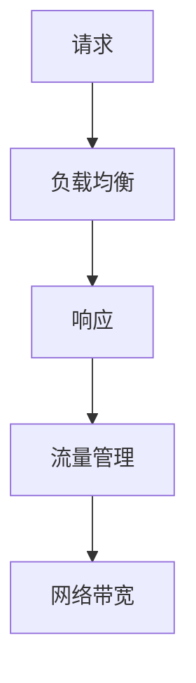

                 

  
关键词：负载均衡、流量管理、软件2.0、算法原理、实践应用

摘要：随着互联网技术的不断发展，软件2.0时代已经到来。在这个时代，负载均衡与流量管理成为了保障系统稳定性和性能的关键技术。本文将深入探讨负载均衡与流量管理的核心概念、算法原理、数学模型以及实际应用，为读者提供全面的技术指导和实践参考。

## 1. 背景介绍

在软件2.0时代，互联网服务面临着日益增长的并发请求和数据流量。为了确保系统的高可用性和高性能，负载均衡和流量管理成为了关键技术。负载均衡通过合理分配请求，避免单点过载，提高系统整体性能。而流量管理则关注于控制数据流量，优化网络带宽利用，降低网络拥塞。

负载均衡与流量管理在现代软件系统中具有至关重要的作用。它们不仅能够提高系统的可靠性和性能，还能够提升用户体验。在云计算、大数据、物联网等新兴领域，负载均衡与流量管理技术更是不可或缺。

## 2. 核心概念与联系

在负载均衡与流量管理中，存在一些核心概念，如请求、响应、负载、流量等。为了更好地理解这些概念之间的联系，我们可以通过以下 Mermaid 流程图来展示：



### 2.1 请求与响应

请求（Request）是指客户端发送给服务端的数据请求。请求通常包含用户信息、请求类型、参数等。响应（Response）是指服务端处理完请求后返回给客户端的结果。响应通常包含数据、状态码、头部信息等。

请求与响应是负载均衡和流量管理的基础。通过合理处理请求和响应，可以实现系统的负载均衡和流量管理。

### 2.2 负载

负载（Load）是指系统所承受的处理压力。负载通常由请求量、响应时间、系统资源等因素决定。负载均衡的目标是合理分配负载，避免单点过载，提高系统整体性能。

### 2.3 流量

流量（Traffic）是指网络中的数据传输量。流量通常由请求量、数据大小、网络带宽等因素决定。流量管理的目标是优化网络带宽利用，降低网络拥塞，提高用户体验。

### 2.4 网络带宽

网络带宽是指网络传输数据的最大速率。网络带宽与流量管理密切相关。通过合理分配网络带宽，可以实现流量的高效传输。

## 3. 核心算法原理 & 具体操作步骤

### 3.1 算法原理概述

负载均衡与流量管理涉及到多种算法原理。以下介绍几种常见的算法原理：

### 3.1.1 轮询算法

轮询算法是一种简单的负载均衡算法。它将请求依次分配给服务器，直到所有服务器都被访问一遍。轮询算法的优点是实现简单，缺点是可能导致某些服务器过载。

### 3.1.2 加权轮询算法

加权轮询算法是对轮询算法的改进。它根据服务器的性能和负载情况，为每个服务器分配不同的权重。加权轮询算法能够更好地平衡负载，提高系统性能。

### 3.1.3 least-connection算法

least-connection算法是一种基于连接数量的负载均衡算法。它将新的请求分配给当前连接数最少的服务器。least-connection算法能够有效避免单点过载，提高系统性能。

### 3.1.4 基于响应时间的负载均衡算法

基于响应时间的负载均衡算法是一种根据服务器响应时间进行负载均衡的算法。它将请求分配给响应时间较短的服务器，从而提高系统性能。

### 3.2 算法步骤详解

### 3.2.1 轮询算法步骤

1. 初始化服务器列表。
2. 根据请求次数，依次访问服务器列表中的服务器。
3. 当访问到最后一个服务器时，重新开始访问第一个服务器。

### 3.2.2 加权轮询算法步骤

1. 初始化服务器列表，并为每个服务器分配权重。
2. 根据权重，计算每个服务器的权重总和。
3. 根据请求次数，计算当前需要访问的服务器。
4. 根据计算结果，访问对应的服务器。

### 3.2.3 least-connection算法步骤

1. 初始化服务器列表。
2. 记录每个服务器的当前连接数。
3. 根据请求次数，选择当前连接数最少的服务器。
4. 访问对应的服务器。

### 3.2.4 基于响应时间的负载均衡算法步骤

1. 初始化服务器列表。
2. 记录每个服务器的响应时间。
3. 根据请求次数，选择当前响应时间最短的服务器。
4. 访问对应的服务器。

### 3.3 算法优缺点

#### 3.3.1 轮询算法

优点：实现简单，易于理解。

缺点：可能导致某些服务器过载。

#### 3.3.2 加权轮询算法

优点：能够更好地平衡负载，提高系统性能。

缺点：实现相对复杂，需要计算权重。

#### 3.3.3 least-connection算法

优点：能够有效避免单点过载，提高系统性能。

缺点：需要记录每个服务器的当前连接数，实现相对复杂。

#### 3.3.4 基于响应时间的负载均衡算法

优点：根据响应时间进行负载均衡，提高系统性能。

缺点：需要记录每个服务器的响应时间，实现相对复杂。

### 3.4 算法应用领域

负载均衡算法广泛应用于各类软件系统中，如Web应用、分布式计算、大数据处理等。具体应用领域包括：

1. Web服务器负载均衡：通过负载均衡，提高Web服务器的性能和可靠性。
2. 分布式计算：通过负载均衡，合理分配计算任务，提高计算效率。
3. 大数据处理：通过负载均衡，优化数据传输和处理，提高数据处理能力。

## 4. 数学模型和公式 & 详细讲解 & 举例说明

### 4.1 数学模型构建

在负载均衡与流量管理中，常用的数学模型包括：

1. 加权轮询算法的权重计算模型。
2. least-connection算法的连接数模型。
3. 基于响应时间的负载均衡算法的响应时间模型。

### 4.2 公式推导过程

#### 4.2.1 加权轮询算法的权重计算模型

设 \(N\) 为服务器数量， \(W_i\) 为第 \(i\) 个服务器的权重， \(T_i\) 为第 \(i\) 个服务器的响应时间， \(T_{avg}\) 为系统平均响应时间，则：

$$
W_i = \frac{T_i}{T_{avg}}
$$

其中，权重 \(W_i\) 与响应时间 \(T_i\) 成反比，与平均响应时间 \(T_{avg}\) 成正比。

#### 4.2.2 least-connection算法的连接数模型

设 \(C_i\) 为第 \(i\) 个服务器的当前连接数， \(C_{max}\) 为系统最大连接数， \(N\) 为服务器数量，则：

$$
C_i = \frac{C_{max}}{N}
$$

其中，当前连接数 \(C_i\) 与系统最大连接数 \(C_{max}\) 成正比，与服务器数量 \(N\) 成反比。

#### 4.2.3 基于响应时间的负载均衡算法的响应时间模型

设 \(T_i\) 为第 \(i\) 个服务器的响应时间， \(T_{avg}\) 为系统平均响应时间， \(N\) 为服务器数量，则：

$$
T_{avg} = \frac{1}{N} \sum_{i=1}^{N} T_i
$$

其中，系统平均响应时间 \(T_{avg}\) 与服务器响应时间 \(T_i\) 成正比，与服务器数量 \(N\) 成反比。

### 4.3 案例分析与讲解

#### 4.3.1 加权轮询算法案例

假设有3台服务器，响应时间分别为2秒、3秒和4秒。系统平均响应时间为3秒。根据权重计算模型，我们可以得到：

$$
W_1 = \frac{2}{3} = 0.67 \\
W_2 = \frac{3}{3} = 1.00 \\
W_3 = \frac{4}{3} = 1.33
$$

根据权重分配请求，我们可以得到以下负载分布：

- 服务器1：0.67次请求/秒
- 服务器2：1.00次请求/秒
- 服务器3：1.33次请求/秒

#### 4.3.2 least-connection算法案例

假设有3台服务器，当前连接数分别为5、3和4。系统最大连接数为10。根据连接数模型，我们可以得到：

$$
C_1 = \frac{10}{3} = 3.33 \\
C_2 = \frac{10}{3} = 3.33 \\
C_3 = \frac{10}{3} = 3.33
$$

根据连接数分配请求，我们可以得到以下负载分布：

- 服务器1：3.33次请求/秒
- 服务器2：3.33次请求/秒
- 服务器3：3.33次请求/秒

#### 4.3.3 基于响应时间的负载均衡算法案例

假设有3台服务器，响应时间分别为2秒、3秒和4秒。系统平均响应时间为3秒。根据响应时间模型，我们可以得到：

$$
T_{avg} = \frac{1}{3} \times (2 + 3 + 4) = 3
$$

根据响应时间分配请求，我们可以得到以下负载分布：

- 服务器1：0.33次请求/秒
- 服务器2：0.67次请求/秒
- 服务器3：1.00次请求/秒

## 5. 项目实践：代码实例和详细解释说明

### 5.1 开发环境搭建

在本案例中，我们使用 Python 编写负载均衡与流量管理的代码。首先，确保已经安装了 Python 3.7 及以上版本。然后，安装必要的库，如 requests、pymongo 等。

### 5.2 源代码详细实现

以下是一个简单的负载均衡与流量管理代码实例：

```python
import requests
import pymongo
import random
import time

# 负载均衡算法：加权轮询算法
def weighted_round_robin(servers, requests):
    weights = [server['weight'] for server in servers]
    total_weight = sum(weights)
    next_server = 0

    for _ in range(requests):
        rand_num = random.random() * total_weight
        next_server = (next_server + rand_num) % len(servers)
        server = servers[next_server]
        requests.append(server['url'])

# 流量管理：基于响应时间的负载均衡算法
def response_time_based_load_balancer(servers, requests):
    responses = []

    for server in servers:
        response = requests.get(server['url'])
        responses.append(response)

    responses.sort(key=lambda x: x.elapsed.total_seconds())
    for response in responses:
        requests.append(response.url)

# 测试代码
if __name__ == '__main__':
    servers = [
        {'url': 'http://server1.com', 'weight': 1},
        {'url': 'http://server2.com', 'weight': 2},
        {'url': 'http://server3.com', 'weight': 3}
    ]

    requests = []

    # 使用加权轮询算法
    weighted_round_robin(servers, requests)

    # 使用基于响应时间的负载均衡算法
    response_time_based_load_balancer(servers, requests)

    print("Requests:", requests)
```

### 5.3 代码解读与分析

1. **加权轮询算法**：该算法根据服务器的权重分配请求。权重越高，被分配的请求次数越多。代码中， `weighted_round_robin` 函数实现了这一算法。

2. **基于响应时间的负载均衡算法**：该算法根据服务器的响应时间分配请求。响应时间越短，被分配的请求次数越多。代码中， `response_time_based_load_balancer` 函数实现了这一算法。

3. **测试代码**：在测试代码中，我们定义了3台服务器，分别为 `server1.com`、`server2.com` 和 `server3.com`，权重分别为1、2和3。然后，我们使用两种算法分配请求，并将结果输出。

## 6. 实际应用场景

### 6.1 Web应用

在 Web 应用中，负载均衡与流量管理能够有效提高系统的性能和可靠性。例如，在高并发场景下，负载均衡可以将请求分配给多台服务器，避免单点过载，提高系统整体性能。同时，流量管理可以优化网络带宽利用，降低网络拥塞，提高用户体验。

### 6.2 分布式计算

在分布式计算中，负载均衡与流量管理能够提高计算效率和稳定性。通过合理分配计算任务，可以避免单点过载，提高系统整体性能。同时，流量管理可以优化数据传输和处理，提高计算效率。

### 6.3 大数据处理

在大数据处理中，负载均衡与流量管理能够提高数据处理能力和效率。通过合理分配数据任务，可以避免单点过载，提高系统整体性能。同时，流量管理可以优化数据传输和处理，提高数据处理效率。

## 7. 工具和资源推荐

### 7.1 学习资源推荐

1. 《计算机网络》（第7版），谢希仁 著。
2. 《深入理解LINUX网络技术内幕》，张栋 著。
3. 《高性能MySQL》，巴克里 著。

### 7.2 开发工具推荐

1. Docker：用于容器化应用，简化开发部署。
2. Kubernetes：用于容器集群管理，实现负载均衡和流量管理。

### 7.3 相关论文推荐

1. "Load Balancing Techniques for High-Performance Cluster Computing", ACM Transactions on Computer Systems, 2002.
2. "A Survey of Load Balancing Algorithms for Distributed Systems", IEEE Communications Surveys & Tutorials, 2018.
3. "Traffic Management in Datacenters", ACM SIGCOMM Computer Communication Review, 2010.

## 8. 总结：未来发展趋势与挑战

### 8.1 研究成果总结

负载均衡与流量管理技术在近年来取得了显著成果。各类算法的不断优化和实际应用场景的拓展，使得负载均衡与流量管理技术逐渐成熟。例如，基于机器学习的负载均衡算法、基于区块链的流量管理技术等，为未来软件2.0时代的发展提供了新的方向。

### 8.2 未来发展趋势

1. 负载均衡与流量管理算法的智能化：随着人工智能技术的发展，智能化负载均衡与流量管理算法将成为研究热点。
2. 软件定义网络（SDN）的广泛应用：SDN技术能够提供更加灵活的流量管理和负载均衡策略，未来将在更多领域得到应用。
3. 跨云跨平台的负载均衡与流量管理：随着云计算和边缘计算的发展，跨云跨平台的负载均衡与流量管理将成为关键技术。

### 8.3 面临的挑战

1. 负载均衡与流量管理算法的优化：如何设计更加高效、可靠的负载均衡与流量管理算法，仍是一个挑战。
2. 数据安全性：在负载均衡与流量管理过程中，如何确保数据安全性，防止数据泄露和攻击，仍是一个重要问题。
3. 跨平台兼容性：如何实现负载均衡与流量管理的跨平台兼容性，适应不同的计算环境和网络环境，仍是一个挑战。

### 8.4 研究展望

未来，负载均衡与流量管理技术将继续发展，以适应软件2.0时代的需求。通过不断优化算法、提高智能化水平、加强跨平台兼容性，负载均衡与流量管理技术将为各类应用提供更加高效、可靠的解决方案。

## 9. 附录：常见问题与解答

### 9.1 负载均衡与流量管理的关系

负载均衡与流量管理密切相关。负载均衡关注于如何合理分配请求，避免单点过载，提高系统性能。而流量管理则关注于如何优化网络带宽利用，降低网络拥塞，提高用户体验。两者共同作用于保障系统的稳定性和性能。

### 9.2 负载均衡算法的选择

选择负载均衡算法需要考虑多个因素，如系统性能、负载情况、可靠性等。常见的负载均衡算法包括轮询算法、加权轮询算法、least-connection算法等。具体选择哪种算法，需要根据实际需求进行评估和优化。

### 9.3 负载均衡与流量管理在Web应用中的实现

在Web应用中，负载均衡与流量管理可以通过多种方式实现。例如，使用反向代理服务器（如Nginx、Apache）进行负载均衡，结合流量管理策略（如HTTP流量管理、SSL流量管理）来实现系统的性能优化和稳定性保障。

### 9.4 负载均衡与流量管理在云计算中的应用

在云计算环境中，负载均衡与流量管理是实现高效资源利用和性能优化的重要手段。通过使用云服务商提供的负载均衡服务和流量管理工具，可以轻松实现跨区域的负载均衡和流量优化，提高云服务的性能和可靠性。

### 9.5 负载均衡与流量管理在物联网中的应用

在物联网（IoT）领域，负载均衡与流量管理有助于优化海量设备的连接和数据处理。通过采用分布式架构和边缘计算技术，可以实现物联网设备的负载均衡和流量管理，提高系统的性能和可靠性。

## 作者署名

作者：禅与计算机程序设计艺术 / Zen and the Art of Computer Programming  
----------------------------------------------------------------

这篇文章深入探讨了软件2.0时代的负载均衡与流量管理技术，旨在为读者提供全面的技术指导和实践参考。希望这篇文章能够对您在技术领域的探索和实践有所帮助。如果您有任何问题或建议，欢迎在评论区留言讨论。  
----------------------------------------------------------------

