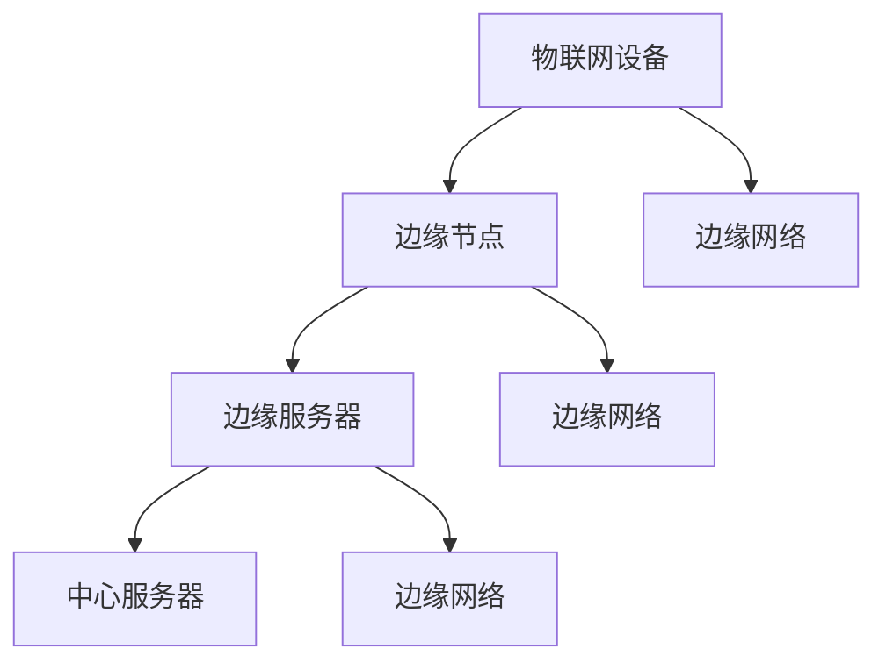

                 

关键词：边缘计算、物联网、创业、新技术前沿、AI应用

摘要：本文将深入探讨边缘计算在物联网创业领域的重要性。随着物联网技术的飞速发展，边缘计算作为一项关键技术，正在成为推动创业创新的新动力。本文将详细解析边缘计算的核心概念、架构、算法原理及其在实际应用中的价值，旨在为物联网创业者提供有益的参考。

## 1. 背景介绍

边缘计算（Edge Computing）是一种分布式计算架构，旨在将数据处理和分析推向网络的边缘，即靠近数据源或用户的地理位置。这种架构可以显著降低数据传输延迟，提高数据处理效率，并减轻中心服务器的负担。

物联网（Internet of Things，IoT）则是指通过各种传感器和设备将物理世界连接到互联网。物联网技术的快速发展，使得海量设备生成的大量数据亟需高效的处理和分析。边缘计算恰好能够满足这一需求，从而为物联网应用提供强大的技术支撑。

近年来，边缘计算和物联网技术的结合，已经在智能城市、智能制造、智能交通等多个领域展现出了巨大的潜力。同时，这也为创业者提供了广阔的舞台，使得他们能够通过技术创新，推动物联网领域的发展。

## 2. 核心概念与联系

### 2.1 边缘计算的核心概念

边缘计算的核心概念包括以下几个方面：

- **边缘节点（Edge Node）**：指在网络边缘运行的设备，如智能路由器、智能终端等。
- **边缘服务器（Edge Server）**：位于网络边缘的数据中心，负责处理和分析来自边缘节点的数据。
- **边缘网络（Edge Network）**：连接边缘节点和边缘服务器的网络，可以是无线网络、光纤网络等。
- **边缘应用（Edge Application）**：在边缘节点或边缘服务器上运行的应用程序，用于处理和分析数据。

### 2.2 边缘计算与物联网的联系

边缘计算与物联网之间存在着紧密的联系。物联网设备生成的大量数据，需要通过边缘计算进行实时处理和分析。这种处理和分析可以是在边缘节点上完成的，也可以在边缘服务器上完成。通过边缘计算，物联网应用可以实现更快的响应速度和更高的数据处理效率。

### 2.3 边缘计算架构的 Mermaid 流程图



在这个架构中，物联网设备通过边缘网络连接到边缘节点，边缘节点负责初步处理数据，然后将处理后的数据发送到边缘服务器。边缘服务器进一步处理数据，并将最终结果发送到中心服务器或直接反馈给用户。

## 3. 核心算法原理 & 具体操作步骤

### 3.1 算法原理概述

边缘计算的核心算法包括数据采集、数据预处理、数据分析和决策生成等步骤。以下将详细介绍这些算法原理。

#### 3.1.1 数据采集

数据采集是边缘计算的第一步，通过物联网设备收集环境数据、设备状态数据等。这些数据可以是实时的，也可以是历史的。

#### 3.1.2 数据预处理

数据预处理包括数据清洗、数据去重、数据格式转换等步骤。这一步骤的目的是确保数据的质量，为后续分析提供可靠的数据基础。

#### 3.1.3 数据分析

数据分析是边缘计算的核心步骤，通过对采集到的数据进行分析，可以提取出有价值的信息，为决策提供支持。

#### 3.1.4 决策生成

基于数据分析的结果，边缘计算可以生成相应的决策。例如，在智能交通领域，通过分析交通流量数据，可以生成交通拥堵预警和路线推荐决策。

### 3.2 算法步骤详解

#### 3.2.1 数据采集

1. 通过物联网设备实时采集环境数据。
2. 将采集到的数据发送到边缘节点。

#### 3.2.2 数据预处理

1. 对采集到的数据进行检查，去除异常值。
2. 对数据进行去重，确保数据的一致性。
3. 将数据格式转换为统一的格式，如JSON或CSV。

#### 3.2.3 数据分析

1. 使用统计分析方法，对数据进行分析，提取出有价值的信息。
2. 使用机器学习方法，对数据进行建模，预测未来的趋势。

#### 3.2.4 决策生成

1. 根据分析结果，生成相应的决策。
2. 将决策发送到边缘服务器或直接反馈给用户。

### 3.3 算法优缺点

#### 3.3.1 优点

- **降低延迟**：通过在边缘节点进行数据处理，可以显著降低数据传输的延迟。
- **提高效率**：边缘计算可以实时处理和分析数据，提高数据处理效率。
- **减轻中心服务器负担**：边缘计算可以分担中心服务器的数据处理压力，减轻其负担。

#### 3.3.2 缺点

- **边缘设备计算能力有限**：边缘设备的计算能力相对较弱，可能无法处理复杂的数据分析任务。
- **数据安全性问题**：边缘设备的安全性问题不容忽视，可能面临数据泄露等风险。

### 3.4 算法应用领域

边缘计算的应用领域非常广泛，包括但不限于以下领域：

- **智能城市**：通过边缘计算，实现智能交通、智能照明、智能安防等应用。
- **智能制造**：通过边缘计算，实现智能生产、智能检测、智能维护等应用。
- **智能医疗**：通过边缘计算，实现远程医疗、智能诊断、实时监控等应用。

## 4. 数学模型和公式 & 详细讲解 & 举例说明

### 4.1 数学模型构建

边缘计算中的数学模型通常涉及以下几个部分：

- **数据采集模型**：描述物联网设备采集数据的方式和频率。
- **数据处理模型**：描述边缘节点对数据进行处理的方法。
- **数据传输模型**：描述边缘节点和边缘服务器之间的数据传输方式。

### 4.2 公式推导过程

以数据采集模型为例，其公式推导如下：

$$
C(t) = C_0 + \alpha t
$$

其中，$C(t)$ 表示时间 $t$ 时的数据采集量，$C_0$ 表示初始数据采集量，$\alpha$ 表示数据采集速率。

### 4.3 案例分析与讲解

#### 4.3.1 案例背景

某智能交通系统，通过边缘计算实现交通流量监控和拥堵预警。

#### 4.3.2 数据采集

系统通过安装在道路上的传感器，实时采集交通流量数据。

#### 4.3.3 数据处理

边缘节点对采集到的交通流量数据进行预处理，包括数据清洗和格式转换。

#### 4.3.4 数据分析

通过对预处理后的数据进行统计分析，提取出交通流量信息。

#### 4.3.5 决策生成

根据分析结果，系统生成交通拥堵预警，并将预警信息发送给交通管理部门。

## 5. 项目实践：代码实例和详细解释说明

### 5.1 开发环境搭建

在开发边缘计算项目时，首先需要搭建相应的开发环境。以下是一个基于 Python 的开发环境搭建步骤：

1. 安装 Python 解释器。
2. 安装必要的 Python 库，如 NumPy、Pandas、Scikit-learn 等。

### 5.2 源代码详细实现

以下是一个简单的边缘计算代码示例：

```python
import numpy as np
import pandas as pd
from sklearn.linear_model import LinearRegression

# 5.2.1 数据采集
def collect_data():
    # 此处模拟传感器采集交通流量数据
    return np.random.rand(100)

# 5.2.2 数据预处理
def preprocess_data(data):
    # 此处进行数据清洗和格式转换
    df = pd.DataFrame(data, columns=['traffic'])
    df['traffic'] = df['traffic'].apply(lambda x: x if x > 0 else 0)
    return df

# 5.2.3 数据分析
def analyze_data(df):
    # 此处进行数据分析，建立线性回归模型
    X = df[['traffic']]
    y = df[['traffic']]
    model = LinearRegression()
    model.fit(X, y)
    return model

# 5.2.4 决策生成
def generate_decision(model):
    # 此处生成决策，预测交通流量
    prediction = model.predict([[1]])
    if prediction > 0.5:
        return "拥堵预警"
    else:
        return "正常"

# 主程序
if __name__ == "__main__":
    data = collect_data()
    df = preprocess_data(data)
    model = analyze_data(df)
    decision = generate_decision(model)
    print(decision)
```

### 5.3 代码解读与分析

这段代码实现了边缘计算的一个基本流程，包括数据采集、预处理、分析以及决策生成。

- **数据采集**：通过模拟传感器采集交通流量数据。
- **数据预处理**：对采集到的数据进行清洗和格式转换，确保数据质量。
- **数据分析**：使用线性回归模型对交通流量数据进行建模，提取出有价值的信息。
- **决策生成**：根据分析结果，生成交通拥堵预警决策。

### 5.4 运行结果展示

当运行这段代码时，程序会根据模拟的交通流量数据生成交通拥堵预警决策。例如，当交通流量超过一定阈值时，会输出“拥堵预警”。

## 6. 实际应用场景

### 6.1 智能城市

在智能城市领域，边缘计算可以用于实时监控城市交通、环境质量、公共安全等。例如，通过安装在交通灯上的边缘设备，实时分析交通流量数据，优化交通信号灯的切换策略，减少交通拥堵。

### 6.2 智能制造

在智能制造领域，边缘计算可以用于实时监控设备状态、生产数据等。例如，通过安装在生产线上的边缘设备，实时分析设备运行数据，预测设备故障，实现智能维护。

### 6.3 智能医疗

在智能医疗领域，边缘计算可以用于实时监控患者健康数据、医疗设备状态等。例如，通过安装在病房的边缘设备，实时分析患者生命体征数据，实现智能诊断和远程医疗。

## 7. 工具和资源推荐

### 7.1 学习资源推荐

- **《边缘计算：理论与实践》**：一本全面介绍边缘计算理论的经典著作。
- **《边缘计算实践指南》**：一本针对边缘计算实践操作的手册。

### 7.2 开发工具推荐

- **Kubernetes**：一款用于容器化应用的边缘计算平台。
- **TensorFlow**：一款用于机器学习的开源框架，适用于边缘计算场景。

### 7.3 相关论文推荐

- **《边缘计算：架构、挑战与应用》**：一篇关于边缘计算架构和应用的综述论文。
- **《边缘计算与物联网的融合研究》**：一篇关于边缘计算和物联网融合的论文。

## 8. 总结：未来发展趋势与挑战

### 8.1 研究成果总结

边缘计算作为物联网创业的新前沿，已经取得了显著的成果。其核心算法原理和实际应用场景得到了广泛研究，并在智能城市、智能制造、智能医疗等多个领域取得了成功应用。

### 8.2 未来发展趋势

随着技术的不断进步，边缘计算在物联网创业领域将展现出更广阔的发展前景。未来，边缘计算将朝着更高效、更智能、更安全的方向发展。

### 8.3 面临的挑战

尽管边缘计算有着广阔的应用前景，但同时也面临着一些挑战。如边缘设备的计算能力有限、数据安全性问题等。这些问题需要通过技术创新和标准化来解决。

### 8.4 研究展望

未来，边缘计算将在物联网创业领域发挥更加重要的作用。通过深入研究边缘计算的核心技术，开发出更加高效、智能、安全的边缘计算系统，有望推动物联网创业的进一步发展。

## 9. 附录：常见问题与解答

### 9.1 什么是边缘计算？

边缘计算是一种分布式计算架构，旨在将数据处理和分析推向网络的边缘，即靠近数据源或用户的地理位置。

### 9.2 边缘计算有哪些应用领域？

边缘计算的应用领域非常广泛，包括智能城市、智能制造、智能医疗等。

### 9.3 边缘计算的核心算法是什么？

边缘计算的核心算法包括数据采集、数据预处理、数据分析和决策生成等。

### 9.4 边缘计算有哪些优势？

边缘计算的优势包括降低延迟、提高效率、减轻中心服务器负担等。

### 9.5 边缘计算有哪些挑战？

边缘计算面临的挑战包括边缘设备的计算能力有限、数据安全性问题等。

---

作者：禅与计算机程序设计艺术 / Zen and the Art of Computer Programming
----------------------------------------------------------------


