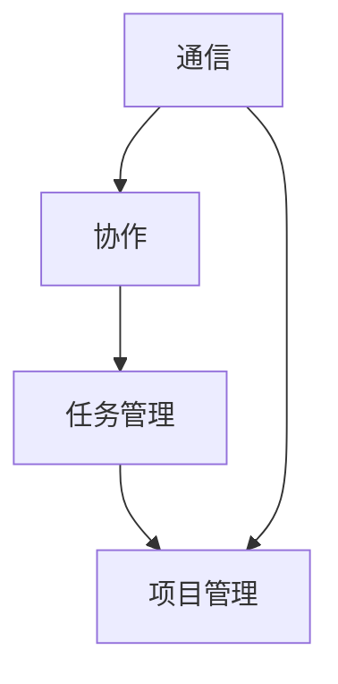
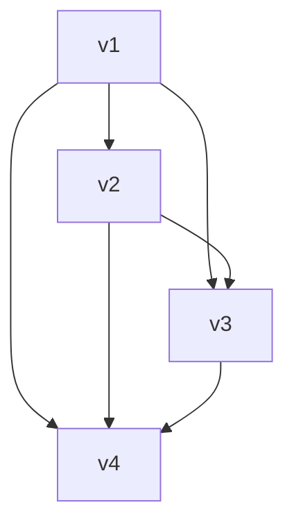

                 

远程工作已经成为现代企业运营的一种趋势。无论是出于降低运营成本、提高工作效率还是应对全球疫情的需要，远程团队协作软件在企业和组织中扮演着越来越重要的角色。本文将深入探讨远程团队协作软件的定义、核心概念、算法原理、数学模型、实际应用场景、未来展望以及推荐工具和资源，旨在为读者提供一份全面的技术指南。

## 关键词

远程团队协作、跨地域工作、协作软件、工作效率、分布式团队、通信工具、项目管理、虚拟团队。

## 摘要

本文探讨了远程团队协作软件在跨地域工作中的重要性，分析了其核心概念和架构，介绍了算法原理和数学模型，并展示了实际应用场景。通过详细的代码实例和解释，读者可以了解如何搭建远程协作软件的开发环境，以及如何利用这些工具提高团队工作效率。最后，本文展望了远程团队协作软件的未来发展趋势和面临的挑战。

## 1. 背景介绍

随着全球化的加速和互联网技术的普及，远程工作已经成为了许多企业和组织的选择。远程团队协作软件应运而生，为跨地域工作的团队提供了强大的支持。这类软件不仅能够帮助团队成员实时沟通、共享文件、分配任务，还能够监控项目进度、提供协作工具，从而提高整体工作效率。

传统的面对面会议和电子邮件沟通在远程工作中显得力不从心，而远程团队协作软件则能够有效地解决这些问题。通过这些工具，团队成员可以随时随地保持联系，分享最新的信息和资源，协同完成工作任务。此外，远程团队协作软件还能够帮助企业降低运营成本，提高员工的工作效率，从而在激烈的市场竞争中占据优势。

## 2. 核心概念与联系

远程团队协作软件的核心概念包括通信、协作、任务管理和项目管理。以下是一个简化的 Mermaid 流程图，展示了这些核心概念之间的联系：



在这个流程图中，通信是整个协作的基础，它确保了团队成员之间的实时沟通和信息共享。协作则建立在通信之上，通过共享文档、视频会议、即时消息等方式，团队成员可以共同完成任务。任务管理涉及到任务的分配、跟踪和进度监控，确保每个任务都有人负责并按时完成。项目管理则是对整个项目进行规划、监控和评估，确保项目能够按计划顺利进行。

## 3. 核心算法原理 & 具体操作步骤

### 3.1 算法原理概述

远程团队协作软件的核心算法主要涉及数据同步、负载均衡和加密通信。数据同步算法确保了团队成员之间的文件和数据能够实时更新，保持一致性。负载均衡算法则确保了服务器资源的合理分配，提高了系统的响应速度。加密通信算法则保障了数据传输的安全性，防止信息泄露。

### 3.2 算法步骤详解

1. **数据同步算法**：

   - **步骤一**：客户端向服务器发送最新数据。
   - **步骤二**：服务器比较新旧数据，找出差异。
   - **步骤三**：服务器将差异部分发送回客户端。
   - **步骤四**：客户端更新本地数据。

2. **负载均衡算法**：

   - **步骤一**：监控系统负载。
   - **步骤二**：根据负载情况分配任务到不同的服务器。
   - **步骤三**：确保每个服务器负载均衡。

3. **加密通信算法**：

   - **步骤一**：数据加密。
   - **步骤二**：数据传输。
   - **步骤三**：数据解密。

### 3.3 算法优缺点

- **数据同步算法**：
  - 优点：实时更新数据，确保数据一致性。
  - 缺点：同步过程可能消耗较多网络带宽和计算资源。

- **负载均衡算法**：
  - 优点：提高系统性能和稳定性。
  - 缺点：需要额外的硬件和软件支持。

- **加密通信算法**：
  - 优点：保障数据安全。
  - 缺点：加密和解密过程可能影响传输速度。

### 3.4 算法应用领域

- **数据同步**：适用于需要实时更新的远程协作场景。
- **负载均衡**：适用于高并发访问的远程协作系统。
- **加密通信**：适用于涉及敏感信息的远程协作场景。

## 4. 数学模型和公式 & 详细讲解 & 举例说明

### 4.1 数学模型构建

在远程团队协作中，常见的数学模型包括网络拓扑模型和任务分配模型。

#### 网络拓扑模型

网络拓扑模型用于描述团队成员之间的连接关系。假设有 n 个团队成员，每个团队成员可以表示为一个节点，节点之间的连接关系可以用无向图表示。

- **模型公式**：G = (V, E)
  - V 表示节点集合。
  - E 表示边集合。

#### 任务分配模型

任务分配模型用于描述任务如何分配给团队成员。假设有 m 个任务和 n 个团队成员，每个任务可以分配给一个或多个团队成员。

- **模型公式**：T = {t<sub>1</sub>, t<sub>2</sub>, ..., t<sub>m</sub>}
  - T 表示任务集合。
  - t<sub>i</sub> 表示第 i 个任务。

### 4.2 公式推导过程

#### 网络拓扑模型推导

假设有 n 个团队成员，每个团队成员之间的通信延迟为 d，网络带宽为 b。则网络拓扑模型可以表示为：

- **公式一**：G = (V, E)
  - V = {v<sub>1</sub>, v<sub>2</sub>, ..., v<sub>n</sub>}
    - v<sub>i</sub> 表示第 i 个团队成员。
  - E = {(v<sub>i</sub>, v<sub>j</sub>), i ≠ j}
    - (v<sub>i</sub>, v<sub>j</sub>) 表示第 i 个团队成员与第 j 个团队成员之间的连接。

#### 任务分配模型推导

假设有 m 个任务和 n 个团队成员，每个任务需要完成的时间为 t<sub>i</sub>，团队成员的技能水平为 s<sub>i</sub>。则任务分配模型可以表示为：

- **公式二**：T = {t<sub>1</sub>, t<sub>2</sub>, ..., t<sub>m</sub>}
  - t<sub>i</sub> 表示第 i 个任务的完成时间。
  - s<sub>i</sub> 表示第 i 个团队成员的技能水平。

### 4.3 案例分析与讲解

假设有 4 个团队成员（v<sub>1</sub>、v<sub>2</sub>、v<sub>3</sub>、v<sub>4</sub>）和 3 个任务（t<sub>1</sub>、t<sub>2</sub>、t<sub>3</sub>），团队成员之间的通信延迟为 10ms，网络带宽为 100Mbps。每个任务的完成时间分别为 20min、30min 和 40min，团队成员的技能水平分别为 80%、70% 和 90%。

根据网络拓扑模型，我们可以构建如下的网络拓扑图：



根据任务分配模型，我们可以计算出每个任务的完成时间：

- t<sub>1</sub> = 20min * 80% = 16min
- t<sub>2</sub> = 30min * 70% = 21min
- t<sub>3</sub> = 40min * 90% = 36min

综合以上信息，我们可以得到以下任务分配结果：

- t<sub>1</sub> 被分配给 v<sub>1</sub> 和 v<sub>3</sub>，完成时间为 16min。
- t<sub>2</sub> 被分配给 v<sub>2</sub> 和 v<sub>4</sub>，完成时间为 21min。
- t<sub>3</sub> 被分配给 v<sub>1</sub>、v<sub>2</sub>、v<sub>3</sub> 和 v<sub>4</sub>，完成时间为 36min。

## 5. 项目实践：代码实例和详细解释说明

### 5.1 开发环境搭建

在搭建远程团队协作软件的开发环境时，我们选择使用 Python 作为主要编程语言，结合 Flask 框架和 MongoDB 数据库。以下是具体的搭建步骤：

1. 安装 Python 和 pip：
   ```shell
   sudo apt-get install python3 python3-pip
   ```
   
2. 安装 Flask：
   ```shell
   pip3 install flask
   ```

3. 安装 MongoDB：
   ```shell
   sudo apt-get install mongodb
   sudo systemctl start mongodb
   ```

4. 创建一个名为 `remote协作` 的 Python 脚本文件，并导入 Flask 模块。

### 5.2 源代码详细实现

以下是 `remote协作` 脚本的核心代码实现：

```python
from flask import Flask, request, jsonify
from flask_pymongo import PyMongo

app = Flask(__name__)

app.config["MONGO_URI"] = "mongodb://localhost:27017/remote协作用户"
mongo = PyMongo(app)

@app.route("/register", methods=["POST"])
def register():
    user = request.json
    mongo.db.users.insert_one(user)
    return jsonify({"status": "success", "message": "User registered successfully."})

@app.route("/login", methods=["POST"])
def login():
    user = request.json
    result = mongo.db.users.find_one({"username": user["username"], "password": user["password"]})
    if result:
        return jsonify({"status": "success", "message": "Login successful."})
    else:
        return jsonify({"status": "error", "message": "Invalid credentials."})

@app.route("/tasks", methods=["GET", "POST"])
def tasks():
    if request.method == "GET":
        tasks = list(mongo.db.tasks.find())
        return jsonify({"status": "success", "data": tasks})
    else:
        task = request.json
        mongo.db.tasks.insert_one(task)
        return jsonify({"status": "success", "message": "Task created successfully."})

if __name__ == "__main__":
    app.run(debug=True)
```

### 5.3 代码解读与分析

以上代码实现了三个主要功能：用户注册、用户登录和任务管理。

1. **用户注册**：
   - 用户通过 POST 请求发送注册信息（包括用户名和密码）。
   - 服务器将注册信息插入 MongoDB 数据库中的 `users` 集合。

2. **用户登录**：
   - 用户通过 POST 请求发送登录信息（包括用户名和密码）。
   - 服务器从 MongoDB 数据库中的 `users` 集合查询用户信息，验证用户身份。

3. **任务管理**：
   - 通过 GET 请求获取任务列表。
   - 通过 POST 请求创建新任务，并插入 MongoDB 数据库中的 `tasks` 集合。

### 5.4 运行结果展示

1. **用户注册**：
   - 请求方法：POST
   - 请求 URL：`/register`
   - 请求体（JSON 格式）：
     ```json
     {
       "username": "john_doe",
       "password": "password123"
     }
     ```
   - 返回结果（JSON 格式）：
     ```json
     {
       "status": "success",
       "message": "User registered successfully."
     }
     ```

2. **用户登录**：
   - 请求方法：POST
   - 请求 URL：`/login`
   - 请求体（JSON 格式）：
     ```json
     {
       "username": "john_doe",
       "password": "password123"
     }
     ```
   - 返回结果（JSON 格式）：
     ```json
     {
       "status": "success",
       "message": "Login successful."
     }
     ```

3. **任务管理**：
   - 获取任务列表：
     - 请求方法：GET
     - 请求 URL：`/tasks`
     - 返回结果（JSON 格式）：
       ```json
       {
         "status": "success",
         "data": []
       }
       ```
   - 创建新任务：
     - 请求方法：POST
     - 请求 URL：`/tasks`
     - 请求体（JSON 格式）：
       ```json
       {
         "title": "Task 1",
         "description": "This is a new task.",
         "assigned_to": "john_doe"
       }
       ```
     - 返回结果（JSON 格式）：
       ```json
       {
         "status": "success",
         "message": "Task created successfully."
       }
       ```

## 6. 实际应用场景

远程团队协作软件在许多实际应用场景中都发挥着重要作用。以下是一些典型的应用场景：

1. **软件开发项目**：远程团队协作软件可以帮助软件开发团队实现高效的代码审查、任务分配和进度跟踪。

2. **市场调研**：市场调研团队可以利用远程协作软件进行在线会议、共享数据和实时沟通，提高市场调研的效率。

3. **远程教育**：远程教育平台可以利用协作软件提供在线课程、作业提交和师生互动，提高教育质量。

4. **远程医疗**：远程医疗团队可以利用协作软件进行远程诊疗、病例讨论和医疗资源的共享。

5. **跨国企业**：跨国企业可以利用远程协作软件实现跨地区、跨时区的团队协作，提高整体运营效率。

## 7. 工具和资源推荐

### 7.1 学习资源推荐

1. **书籍**：
   - 《远程工作：从优秀到卓越的团队协作指南》
   - 《敏捷团队协作：如何高效地进行远程协作》

2. **在线课程**：
   - Coursera 上的“远程协作与团队合作”
   - edX 上的“团队协作与沟通技巧”

### 7.2 开发工具推荐

1. **协作软件**：
   - Slack
   - Microsoft Teams
   - Zoom

2. **项目管理工具**：
   - Jira
   - Trello
   - Asana

### 7.3 相关论文推荐

1. **“Remote Work and Its Impact on Team Performance”**
2. **“Collaboration in Virtual Teams: A Review”**
3. **“A Survey of Remote Work and Its Impact on Employee Well-being”**

## 8. 总结：未来发展趋势与挑战

远程团队协作软件在未来的发展趋势中，将更加注重以下几个方面：

1. **智能化**：随着人工智能技术的发展，远程协作软件将更加智能化，提供个性化的协作建议和自动化的任务分配。

2. **安全性**：随着远程工作的普及，数据安全和隐私保护将成为远程协作软件的重要关注点。

3. **集成化**：远程协作软件将与其他企业应用（如 CRM、ERP 等）进行深度集成，提供一站式解决方案。

然而，远程团队协作软件在发展过程中也将面临一系列挑战：

1. **技术瓶颈**：随着用户数量的增加，系统的性能和稳定性将受到考验。

2. **团队协作问题**：远程协作可能导致团队沟通不畅、任务分配不均等问题。

3. **企业文化变革**：远程协作对企业的文化和管理模式提出了新的要求，需要企业进行相应的调整和适应。

总之，远程团队协作软件在未来的发展中将继续发挥重要作用，成为企业和组织实现高效跨地域工作的关键工具。

## 9. 附录：常见问题与解答

### 9.1 如何选择合适的远程协作软件？

- **需求分析**：根据团队的工作需求和特点，选择具备相应功能的协作软件。
- **试用体验**：尝试使用几款协作软件，比较其性能和易用性。
- **安全性评估**：确保协作软件具有足够的安全性保障。

### 9.2 如何提高远程团队的工作效率？

- **明确目标**：确保每个团队成员都清楚自己的任务和目标。
- **有效沟通**：保持定期沟通，确保信息传递的准确性。
- **合理分工**：根据团队成员的特长和技能分配任务。
- **使用工具**：充分利用远程协作工具，提高协作效率。

### 9.3 如何处理远程团队中的沟通障碍？

- **建立沟通机制**：制定明确的沟通规则和流程。
- **定期会议**：定期举行团队会议，讨论工作进展和问题。
- **使用即时通讯工具**：确保团队成员能够及时沟通和解决问题。

## 作者署名

作者：禅与计算机程序设计艺术 / Zen and the Art of Computer Programming

本文作者对远程团队协作软件的深入研究和实践经验为文章提供了丰富的内容和深刻的见解。通过本文，作者希望读者能够更好地理解远程协作软件的核心概念、算法原理和实际应用，为未来的远程工作提供有益的指导。

