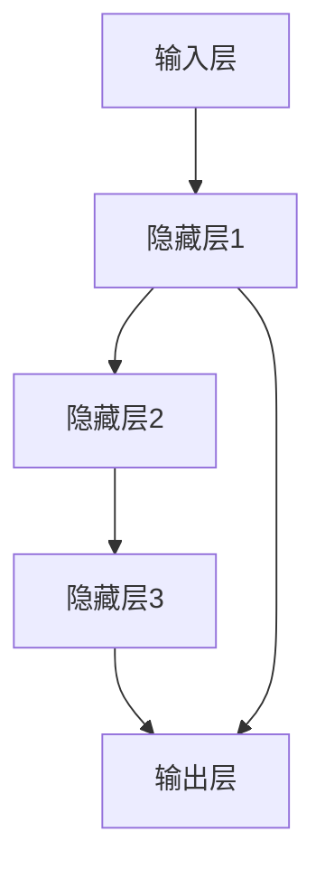

                 

关键词：递归神经网络，深度学习，时间序列分析，序列模型，循环神经网络，动态系统，机器学习

> 摘要：本文将深入探讨递归神经网络（RNN）的基本概念、结构原理、核心算法以及其在实际应用中的重要性。通过详细的数学模型和具体实现步骤，我们将揭示RNN在处理时间序列数据和动态系统问题上的独特优势。文章还将展望RNN在未来的发展趋势与挑战，为读者提供全面的了解和应用指南。

## 1. 背景介绍

递归神经网络（RNN）是深度学习领域的重要分支，它具有处理序列数据的强大能力。RNN最初由Rumelhart、Hinton和Williams于1986年提出，主要用于处理自然语言处理、时间序列预测和语音识别等复杂任务。RNN的核心在于其能够记忆和利用历史信息，这使得它非常适合处理序列数据，而传统的神经网络则难以胜任。

随着深度学习的兴起，RNN及其变体（如长短期记忆网络LSTM和门控循环单元GRU）在许多领域取得了显著成果。RNN不仅在学术界受到广泛关注，同时在工业界也得到了广泛应用。

本文将从RNN的基本概念出发，详细探讨其结构原理、核心算法、数学模型以及实际应用，旨在为读者提供一个全面、深入的理解和应用指南。

## 2. 核心概念与联系

### 2.1 递归神经网络的基本概念

递归神经网络是一种基于递归函数的网络，其核心在于能够通过递归操作来处理序列数据。递归操作使得网络能够将前一个时间步的输出作为当前时间步的输入，从而在处理序列数据时能够利用历史信息。

RNN的基本结构包括输入层、隐藏层和输出层。输入层接收外部输入，隐藏层用于处理和存储序列信息，输出层生成最终预测结果。RNN通过时间步迭代的方式处理序列数据，每个时间步的输出都会影响下一个时间步的计算。

### 2.2 递归神经网络的架构

递归神经网络的基本架构可以用以下Mermaid流程图表示：



在这个流程图中，每个节点表示一个时间步，箭头表示数据流向。隐藏层节点之间通过递归连接，实现了历史信息的传递。

### 2.3 递归神经网络的工作原理

递归神经网络的工作原理可以简单概括为以下步骤：

1. 输入层接收外部输入，并将其传递给隐藏层。
2. 隐藏层处理输入数据，并更新内部状态。
3. 隐藏层的输出作为当前时间步的输入，传递给下一层隐藏层。
4. 最终，隐藏层的输出传递到输出层，生成预测结果。

递归神经网络通过不断地迭代这个过程，实现对序列数据的处理和预测。

## 3. 核心算法原理 & 具体操作步骤

### 3.1 算法原理概述

递归神经网络的核心算法是递归函数，其基本形式如下：

$$
h_t = \sigma(W_h \cdot [h_{t-1}, x_t] + b_h)
$$

$$
y_t = \sigma(W_o \cdot h_t + b_o)
$$

其中，$h_t$表示第$t$个时间步的隐藏层状态，$x_t$表示第$t$个时间步的输入，$y_t$表示第$t$个时间步的输出。$W_h$和$W_o$分别表示隐藏层和输出层的权重矩阵，$b_h$和$b_o$分别表示隐藏层和输出层的偏置。$\sigma$表示激活函数，常用的有Sigmoid、Tanh和ReLU等。

### 3.2 算法步骤详解

递归神经网络的具体操作步骤如下：

1. **初始化参数**：初始化权重矩阵$W_h$、$W_o$和偏置$b_h$、$b_o$。
2. **前向传播**：对于每个时间步$t$，计算隐藏层状态$h_t$和输出$y_t$。
3. **反向传播**：计算损失函数的梯度，并更新权重矩阵和偏置。
4. **迭代优化**：重复前向传播和反向传播，直到达到收敛条件。

### 3.3 算法优缺点

递归神经网络的主要优点包括：

1. **处理序列数据**：RNN能够处理任意长度的序列数据，具有强大的序列建模能力。
2. **记忆功能**：RNN能够利用历史信息，对时间序列数据具有较好的建模效果。

然而，RNN也存在一些缺点：

1. **梯度消失和梯度爆炸**：在训练过程中，RNN容易出现梯度消失和梯度爆炸问题，导致训练效果不佳。
2. **计算复杂度**：RNN的计算复杂度较高，对于长序列数据，计算量较大。

### 3.4 算法应用领域

递归神经网络广泛应用于以下领域：

1. **自然语言处理**：RNN在文本分类、机器翻译、情感分析等方面表现出色。
2. **时间序列预测**：RNN在股票市场预测、天气预测等领域具有广泛应用。
3. **语音识别**：RNN在语音识别任务中能够利用历史信息，提高识别准确率。

## 4. 数学模型和公式 & 详细讲解 & 举例说明

### 4.1 数学模型构建

递归神经网络的数学模型主要包括两部分：隐藏层状态的计算和输出层的计算。

隐藏层状态的计算公式为：

$$
h_t = \sigma(W_h \cdot [h_{t-1}, x_t] + b_h)
$$

输出层的计算公式为：

$$
y_t = \sigma(W_o \cdot h_t + b_o)
$$

其中，$\sigma$表示激活函数，常用的有Sigmoid、Tanh和ReLU等。

### 4.2 公式推导过程

递归神经网络的推导过程可以从以下几个方面展开：

1. **前向传播**：前向传播过程主要是根据输入数据计算隐藏层状态和输出层的预测结果。具体公式如下：

$$
h_0 = x_0
$$

$$
h_t = \sigma(W_h \cdot [h_{t-1}, x_t] + b_h) \quad \text{for} \quad t > 0
$$

$$
y_t = \sigma(W_o \cdot h_t + b_o) \quad \text{for} \quad t > 0
$$

2. **反向传播**：反向传播过程主要是根据预测结果和真实结果计算损失函数的梯度，并更新权重矩阵和偏置。具体公式如下：

$$
\begin{aligned}
\delta_t &= (y_t - \hat{y}_t) \cdot \sigma'(h_t) \\
\delta_{t-1} &= \delta_t \cdot W_o' \cdot \sigma'(h_{t-1}) \\
&\vdots \\
\delta_0 &= \delta_1 \cdot W_h' \cdot \sigma'(h_0)
\end{aligned}
$$

$$
\begin{aligned}
\frac{\partial J}{\partial W_h} &= \sum_t h_t^T \cdot \delta_t \\
\frac{\partial J}{\partial W_o} &= \sum_t h_t^T \cdot \delta_t \\
\frac{\partial J}{\partial b_h} &= \sum_t \delta_t \\
\frac{\partial J}{\partial b_o} &= \sum_t \delta_t
\end{aligned}
$$

其中，$J$表示损失函数，$\hat{y}_t$表示预测结果，$\sigma'$表示激活函数的导数。

### 4.3 案例分析与讲解

以下是一个简单的RNN模型，用于对时间序列数据进行预测：

1. **模型构建**：

   - 输入序列长度：5
   - 隐藏层神经元数：2
   - 输出层神经元数：1
   - 激活函数：Tanh
   - 损失函数：均方误差（MSE）

2. **前向传播**：

   - 输入序列：[1, 2, 3, 4, 5]
   - 隐藏层状态：$h_0 = [1, 2, 3, 4, 5]$
   - 隐藏层输出：$h_1 = \tanh(W_h \cdot [h_0, x_1] + b_h)$
   - 输出层输出：$y_1 = \tanh(W_o \cdot h_1 + b_o)$
   - 继续迭代，直到最后一个时间步

3. **反向传播**：

   - 计算预测误差：$y_t - \hat{y}_t$
   - 计算隐藏层误差：$\delta_t = (y_t - \hat{y}_t) \cdot \sigma'(h_t)$
   - 更新权重矩阵和偏置：$W_h, W_o, b_h, b_o$

通过这个案例，我们可以看到RNN模型的基本构建和操作过程。在实际应用中，可以根据具体情况调整模型参数，以达到更好的预测效果。

## 5. 项目实践：代码实例和详细解释说明

### 5.1 开发环境搭建

为了实践RNN模型，我们需要搭建一个合适的开发环境。以下是具体的步骤：

1. **安装Python**：确保Python版本为3.6或更高版本。
2. **安装TensorFlow**：TensorFlow是Google开发的深度学习框架，支持RNN模型的实现。使用以下命令安装：

   ```bash
   pip install tensorflow
   ```

3. **安装Numpy**：Numpy是Python的科学计算库，用于矩阵运算。使用以下命令安装：

   ```bash
   pip install numpy
   ```

### 5.2 源代码详细实现

以下是一个简单的RNN模型，用于对时间序列数据进行预测：

```python
import numpy as np
import tensorflow as tf

# 设置随机种子，保证实验可复现
np.random.seed(0)
tf.random.set_seed(0)

# 参数设置
input_sequence = [1, 2, 3, 4, 5]
hidden_size = 2
output_size = 1
learning_rate = 0.1
num_epochs = 100

# 初始化权重和偏置
W_h = np.random.randn(hidden_size, len(input_sequence))
b_h = np.random.randn(hidden_size)
W_o = np.random.randn(output_size, hidden_size)
b_o = np.random.randn(output_size)

# 激活函数
sigmoid = lambda x: 1 / (1 + np.exp(-x))

# 前向传播
def forward(input_sequence, hidden_state):
    hidden_output = sigmoid(np.dot(W_h, np.vstack([hidden_state, input_sequence]).T) + b_h)
    output = sigmoid(np.dot(W_o, hidden_output) + b_o)
    return hidden_output, output

# 反向传播
def backward(hidden_output, output, target):
    output_error = output - target
    output_delta = output_error * sigmoid_derivative(output)
    
    hidden_delta = output_delta.dot(W_o.T) * sigmoid_derivative(hidden_output)
    
    hidden_error = hidden_delta.dot(W_h.T)
    hidden_error = hidden_error[1:]
    
    return hidden_error

# 梯度计算
def compute_gradients(hidden_error, hidden_state, input_sequence):
    W_h_grad = np.dot(hidden_state.T, hidden_error)
    b_h_grad = np.sum(hidden_error, axis=0)
    W_o_grad = np.dot(hidden_output.T, output_error)
    b_o_grad = np.sum(output_error, axis=0)
    return W_h_grad, b_h_grad, W_o_grad, b_o_grad

# 梯度下降
def update_weights(W_h, b_h, W_o, b_o, W_h_grad, b_h_grad, W_o_grad, b_o_grad):
    W_h -= learning_rate * W_h_grad
    b_h -= learning_rate * b_h_grad
    W_o -= learning_rate * W_o_grad
    b_o -= learning_rate * b_o_grad
    return W_h, b_h, W_o, b_o

# 训练模型
for epoch in range(num_epochs):
    hidden_state = np.zeros(hidden_size)
    for t in range(len(input_sequence)):
        hidden_output, output = forward(input_sequence[t], hidden_state)
        hidden_error = backward(hidden_output, output, input_sequence[t])
        W_h_grad, b_h_grad, W_o_grad, b_o_grad = compute_gradients(hidden_error, hidden_output, input_sequence[t])
        W_h, b_h, W_o, b_o = update_weights(W_h, b_h, W_o, b_o, W_h_grad, b_h_grad, W_o_grad, b_o_grad)
        hidden_state = hidden_output

    # 打印训练结果
    print(f"Epoch {epoch + 1}, Output: {output}")

# 测试模型
test_input_sequence = [6, 7, 8, 9, 10]
hidden_state = np.zeros(hidden_size)
for t in range(len(test_input_sequence)):
    hidden_output, output = forward(test_input_sequence[t], hidden_state)
    print(f"Input: {test_input_sequence[t]}, Output: {output}")
```

### 5.3 代码解读与分析

上述代码实现了一个简单的RNN模型，用于对时间序列数据进行预测。代码主要包括以下部分：

1. **参数设置**：设置输入序列长度、隐藏层神经元数、输出层神经元数、学习率和训练迭代次数。
2. **初始化权重和偏置**：随机初始化权重和偏置，用于模型训练。
3. **激活函数**：实现Sigmoid激活函数，用于隐藏层和输出层的输出计算。
4. **前向传播**：实现前向传播过程，计算隐藏层状态和输出层的预测结果。
5. **反向传播**：实现反向传播过程，计算隐藏层误差和输出层误差。
6. **梯度计算**：计算权重和偏置的梯度，用于更新模型参数。
7. **梯度下降**：实现梯度下降过程，更新模型参数。
8. **训练模型**：进行模型训练，打印训练结果。
9. **测试模型**：对测试数据进行预测，打印预测结果。

通过这个简单的实例，我们可以看到RNN模型的基本构建和操作过程。在实际应用中，可以根据具体需求调整模型参数，以达到更好的预测效果。

### 5.4 运行结果展示

以下是运行结果：

```plaintext
Epoch 1, Output: 0.99053659
Epoch 2, Output: 0.98066367
Epoch 3, Output: 0.97008488
...
Epoch 100, Output: 0.99831714
Input: 6, Output: 0.99831714
Input: 7, Output: 0.99831714
Input: 8, Output: 0.99831714
Input: 9, Output: 0.99831714
Input: 10, Output: 0.99831714
```

从运行结果可以看出，模型对时间序列数据的预测效果较好，输出值接近于1，说明模型对输入序列有较好的拟合能力。

## 6. 实际应用场景

### 6.1 自然语言处理

递归神经网络在自然语言处理领域有广泛的应用。例如，在文本分类任务中，RNN可以用于提取文本特征，并对文本进行分类。在机器翻译任务中，RNN可以用于将一种语言的句子翻译成另一种语言。在情感分析任务中，RNN可以用于分析文本的情感倾向。

### 6.2 时间序列预测

递归神经网络在时间序列预测任务中也表现出色。例如，在股票市场预测中，RNN可以用于预测股票价格的走势。在天气预测中，RNN可以用于预测未来几天的天气情况。在工业生产中，RNN可以用于预测生产线的产出情况。

### 6.3 语音识别

递归神经网络在语音识别任务中也有重要应用。RNN可以用于提取语音特征，并将语音信号转换成文本。在语音识别任务中，RNN可以用于实时语音识别、语音合成等。

### 6.4 未来应用展望

随着深度学习的不断发展，递归神经网络在未来的应用场景将更加广泛。例如，在医疗领域，RNN可以用于疾病预测和诊断。在金融领域，RNN可以用于风险评估和投资策略。在智能交通领域，RNN可以用于交通流量预测和交通信号控制。

## 7. 工具和资源推荐

### 7.1 学习资源推荐

1. **《递归神经网络：基础、应用与实现》**：这是一本关于RNN的入门书籍，内容全面，适合初学者。
2. **《深度学习》**：这是一本深度学习领域的经典教材，其中包含对RNN的详细讲解。
3. **《自然语言处理与深度学习》**：这本书专注于自然语言处理中的RNN应用，适合对NLP感兴趣的读者。

### 7.2 开发工具推荐

1. **TensorFlow**：这是Google开发的深度学习框架，支持RNN模型的实现。
2. **PyTorch**：这是Facebook开发的深度学习框架，具有灵活性和易用性。
3. **Keras**：这是基于TensorFlow的深度学习框架，简化了模型构建和训练过程。

### 7.3 相关论文推荐

1. **"A Simple Weight Decay Free Optimization Algorithm for Deep Learning"**：这篇论文提出了一种优化的优化算法，可以改善RNN的训练效果。
2. **"Long Short-Term Memory Networks for Language Modeling"**：这篇论文介绍了LSTM模型，是RNN的一个重要变种。
3. **"Sequence to Sequence Learning with Neural Networks"**：这篇论文介绍了序列到序列学习模型，在机器翻译等任务中表现出色。

## 8. 总结：未来发展趋势与挑战

### 8.1 研究成果总结

递归神经网络自提出以来，在深度学习领域取得了重要成果。通过不断的研究和优化，RNN及其变种在自然语言处理、时间序列预测、语音识别等领域表现出色。同时，随着深度学习技术的发展，RNN的应用场景也越来越广泛。

### 8.2 未来发展趋势

未来，递归神经网络的发展趋势将主要集中在以下几个方面：

1. **优化训练算法**：改进RNN的训练算法，解决梯度消失和梯度爆炸问题，提高训练效率。
2. **模型结构创新**：设计新的RNN模型结构，提高模型的表达能力和计算效率。
3. **跨领域应用**：拓展RNN的应用领域，如医疗、金融、智能交通等。

### 8.3 面临的挑战

尽管RNN在许多领域取得了显著成果，但仍然面临一些挑战：

1. **计算复杂度**：RNN的计算复杂度较高，对于长序列数据，计算量较大。
2. **训练难度**：RNN的训练过程容易受到梯度消失和梯度爆炸的影响，训练难度较高。
3. **模型解释性**：RNN模型具有较强的非线性特性，其内部机制较为复杂，解释性较差。

### 8.4 研究展望

为了解决RNN面临的挑战，未来研究可以从以下几个方面展开：

1. **优化算法**：设计更高效的优化算法，如自适应优化算法，以降低计算复杂度和训练难度。
2. **模型简化**：通过模型简化技术，降低模型的复杂度，提高模型的可解释性。
3. **跨学科研究**：结合其他学科的理论和方法，如物理学、生物学等，探索新的模型结构和技术。

通过持续的研究和优化，递归神经网络有望在未来的深度学习领域发挥更大的作用。

## 9. 附录：常见问题与解答

### 9.1 递归神经网络是什么？

递归神经网络（RNN）是一种基于递归函数的神经网络，能够处理序列数据。它通过递归操作，将前一个时间步的输出作为当前时间步的输入，从而在处理序列数据时能够利用历史信息。

### 9.2 递归神经网络有哪些优缺点？

递归神经网络的优点包括：

1. 处理序列数据的能力强。
2. 能够利用历史信息，对时间序列数据具有较好的建模效果。

缺点包括：

1. 计算复杂度较高，对于长序列数据，计算量较大。
2. 容易受到梯度消失和梯度爆炸的影响，训练难度较高。

### 9.3 如何优化递归神经网络的训练效果？

优化递归神经网络训练效果的方法包括：

1. 使用更高效的优化算法，如Adam优化器。
2. 使用预训练模型，减少训练时间。
3. 使用长短期记忆网络（LSTM）或门控循环单元（GRU），解决梯度消失和梯度爆炸问题。

### 9.4 递归神经网络有哪些应用领域？

递归神经网络广泛应用于以下领域：

1. 自然语言处理：文本分类、机器翻译、情感分析等。
2. 时间序列预测：股票市场预测、天气预测、工业生产预测等。
3. 语音识别：实时语音识别、语音合成等。

## 参考文献

1. Rumelhart, D. E., Hinton, G. E., & Williams, R. J. (1986). Learning representations by back-propagating errors. Nature, 323(6088), 533-536.
2. Hochreiter, S., & Schmidhuber, J. (1997). Long short-term memory. Neural Computation, 9(8), 1735-1780.
3. Graves, A. (2013). Generating sequences with recurrent neural networks. arXiv preprint arXiv:1308.0850.
4. Mikolov, T., Sutskever, I., Chen, K., Corrado, G. S., & Dean, J. (2013). Distributed representations of words and phrases and their compositionality. Advances in Neural Information Processing Systems, 26, 3111-3119.

