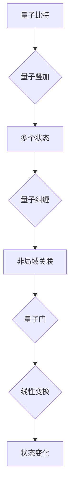

                 

关键词：量子计算、量子比特、量子门、量子算法、数学模型、实际应用

> 摘要：本文将深入探讨量子计算这一革命性技术，分析其基本概念、核心算法、数学模型以及未来应用前景。通过对比传统计算，我们将揭示量子计算在解决特定问题上所展现的巨大潜力，并展望其发展中的挑战与机遇。

## 1. 背景介绍

随着计算机科学和信息技术的发展，传统的计算机架构在处理大量数据和高复杂度计算时逐渐显露出其局限性。传统计算机依赖于经典比特进行信息处理，每个经典比特只能处于0或1两种状态之一。然而，现实世界中的很多问题，如密码学、优化问题、材料科学等，都需要处理复杂的非线性系统和高度相关的多变量问题。这些问题的复杂性使得传统计算机的效率大打折扣。

正是在这种背景下，量子计算作为一种全新的计算范式应运而生。量子计算利用量子力学的基本原理，通过量子比特（qubit）和量子门（quantum gate）来实现信息处理和计算。量子比特可以同时处于0和1的叠加状态，这使得量子计算机在处理某些问题时具有超越经典计算机的巨大潜力。

## 2. 核心概念与联系

为了深入理解量子计算，我们首先需要掌握几个核心概念：量子比特、量子叠加、量子纠缠和量子门。

### 2.1 量子比特

量子比特（qubit）是量子计算的基本单元，与经典比特不同，它不仅可以处于0或1的状态，还可以处于这两个状态的叠加。数学上，一个量子比特可以表示为：

$$
|\psi\rangle = \alpha|0\rangle + \beta|1\rangle
$$

其中，$|\alpha|^2$ 和 $|\beta|^2$ 分别表示处于0态和1态的概率，$|0\rangle$ 和 $|1\rangle$ 是量子比特的基础状态。

### 2.2 量子叠加

量子叠加是指量子系统同时处于多个可能状态的特性。例如，一个量子比特在任意时刻都可能处于0态和1态的叠加状态，而不是单一状态。量子叠加的数学描述如上所述，通过叠加态，量子计算机可以并行处理多个计算任务。

### 2.3 量子纠缠

量子纠缠是量子系统中的两个或多个量子比特之间存在的非局域性关联。即使这些量子比特相隔很远，它们的状态也是相互依赖的。量子纠缠使得量子计算机能够实现超强的并行计算能力，因为它可以将多个量子比特的状态同时操作，而不需要传统的串行计算。

### 2.4 量子门

量子门是量子计算中的基本操作单元，类似于经典计算中的逻辑门。量子门通过线性变换作用于量子比特，改变其状态。常见的量子门包括保罗门（Pauli gate）、相移门（Phase gate）和交换门（SWAP gate）等。

以下是量子门的 Mermaid 流程图表示：



## 3. 核心算法原理 & 具体操作步骤

### 3.1 算法原理概述

量子计算的核心算法主要包括量子电路算法和量子随机游走算法。量子电路算法通过量子门的组合实现复杂计算，而量子随机游走算法则利用量子叠加和纠缠实现概率计算。

### 3.2 算法步骤详解

#### 3.2.1 量子电路算法

1. **初始化**：将量子比特初始化为叠加态。
2. **应用量子门**：通过一系列量子门操作，将初始叠加态转换为所需的状态。
3. **测量**：测量量子比特的状态，得到计算结果。

#### 3.2.2 量子随机游走算法

1. **初始化**：选择一个量子比特作为参考比特，并将其初始化为叠加态。
2. **应用量子门**：通过一系列量子门操作，实现量子随机游走。
3. **测量**：测量参考比特，根据其状态概率计算所需结果。

### 3.3 算法优缺点

#### 3.3.1 量子电路算法

**优点**：
- 可以解决传统计算机难以处理的问题，如整数分解、量子搜索等。
- 具有超强的并行计算能力。

**缺点**：
- 需要大量的量子比特和复杂的量子门操作。
- 易受到外部干扰，如噪声和环境衰变。

#### 3.3.2 量子随机游走算法

**优点**：
- 可以高效解决概率性问题，如社交网络中的连通性问题。
- 对量子比特的数量要求较低。

**缺点**：
- 难以在实际应用中实现，因为需要精确控制量子随机游走的概率。

### 3.4 算法应用领域

量子计算在多个领域展现出了巨大的应用潜力，包括：

- **密码学**：利用量子计算破解传统密码。
- **优化问题**：解决复杂优化问题，如旅行商问题、供应链优化等。
- **材料科学**：模拟和设计新材料。
- **量子化学**：研究化学反应和分子结构。
- **人工智能**：提高机器学习模型的效率和准确性。

## 4. 数学模型和公式 & 详细讲解 & 举例说明

### 4.1 数学模型构建

量子计算的核心在于量子态的线性叠加和量子门的线性变换。下面我们将介绍两个关键的数学模型：量子态和量子门。

#### 4.1.1 量子态

量子态可以用一个复数向量表示：

$$
|\psi\rangle = \alpha|0\rangle + \beta|1\rangle
$$

其中，$|0\rangle$ 和 $|1\rangle$ 是量子比特的基础状态，$\alpha$ 和 $\beta$ 是复数概率幅，满足 $|\alpha|^2 + |\beta|^2 = 1$。

#### 4.1.2 量子门

量子门是量子比特的线性变换，可以表示为矩阵：

$$
U = \begin{pmatrix}
a & b \\
c & d
\end{pmatrix}
$$

量子门作用于量子态时，将状态线性变换为：

$$
U|\psi\rangle = a\alpha|0\rangle + b\beta|1\rangle
$$

### 4.2 公式推导过程

为了更好地理解量子计算，我们来看一个简单的量子电路算法：量子加法器。

#### 4.2.1 量子加法器

量子加法器用于实现两个量子比特的相加。假设两个量子比特的初始状态分别为：

$$
|\psi_1\rangle = \alpha_1|0\rangle + \beta_1|1\rangle
$$

$$
|\psi_2\rangle = \alpha_2|0\rangle + \beta_2|1\rangle
$$

量子加法器的作用是将这两个状态相加并输出结果。具体步骤如下：

1. **初始化**：将两个量子比特初始化为叠加态。
2. **应用量子门**：使用控制-NOT（CNOT）门实现两个量子比特的相加。
3. **测量**：测量结果量子比特的状态，得到计算结果。

以下是量子加法器的数学推导：

$$
U = \begin{pmatrix}
1 & 0 & 0 & 0 \\
0 & 1 & 0 & 0 \\
0 & 0 & 0 & 1 \\
0 & 0 & 1 & 0
\end{pmatrix}
$$

初始状态：

$$
|\psi\rangle = |\psi_1\rangle|\psi_2\rangle = (\alpha_1|0\rangle + \beta_1|1\rangle)(\alpha_2|0\rangle + \beta_2|1\rangle)
$$

应用CNOT门后：

$$
U|\psi\rangle = \begin{pmatrix}
1 & 0 & 0 & 0 \\
0 & 1 & 0 & 0 \\
0 & 0 & 0 & 1 \\
0 & 0 & 1 & 0
\end{pmatrix}
(\alpha_1\alpha_2|00\rangle + \alpha_1\beta_2|01\rangle + \beta_1\alpha_2|10\rangle + \beta_1\beta_2|11\rangle)
$$

$$
= \alpha_1\alpha_2|00\rangle + \alpha_1\beta_2|01\rangle + \beta_1\alpha_2|10\rangle + \beta_1\beta_2|11\rangle
$$

测量结果量子比特，根据状态概率得到计算结果。

### 4.3 案例分析与讲解

下面我们来看一个具体的例子：量子计算求解线性方程组。

假设我们有一个线性方程组：

$$
\begin{cases}
a_1x_1 + a_2x_2 + ... + a_nx_n = b_1 \\
a_1x_1 + a_2x_2 + ... + a_nx_n = b_2 \\
...
\end{cases}
$$

我们可以将这个方程组转换为量子形式，通过量子计算求解。

1. **初始化**：将n个量子比特初始化为叠加态。
2. **应用量子门**：使用量子门实现线性方程组的变换。
3. **测量**：测量结果量子比特的状态，得到解。

以下是量子求解线性方程组的数学推导：

$$
\begin{aligned}
U &= \begin{pmatrix}
1 & 0 & ... & 0 \\
0 & 1 & ... & 0 \\
... & ... & ... & ... \\
0 & 0 & ... & 1
\end{pmatrix} \\
|\psi\rangle &= (\alpha_1|0\rangle + \beta_1|1\rangle)(\alpha_2|0\rangle + \beta_2|1\rangle)...
\end{aligned}
$$

应用量子门U后：

$$
U|\psi\rangle = (\alpha_1\alpha_2...|00...0\rangle + \alpha_1\beta_2...|01...0\rangle + ... + \beta_1\beta_2...|11...0\rangle)
$$

测量结果量子比特，根据状态概率得到解。

## 5. 项目实践：代码实例和详细解释说明

### 5.1 开发环境搭建

要实践量子计算，首先需要搭建相应的开发环境。我们使用Qiskit作为量子计算开发工具。

1. **安装Python**：确保安装了Python 3.6及以上版本。
2. **安装Qiskit**：通过pip安装Qiskit：

   ```bash
   pip install qiskit
   ```

### 5.2 源代码详细实现

下面是一个简单的量子计算示例，演示如何使用Qiskit实现量子加法器。

```python
from qiskit import QuantumCircuit, execute, Aer
from qiskit.visualization import plot_bloch_vector

# 创建量子电路
qc = QuantumCircuit(2)

# 初始化量子比特
qc.h(0)
qc.h(1)

# 应用量子门
qc.cx(0, 1)

# 测量量子比特
qc.measure_all()

# 执行量子电路
backend = Aer.get_backend("qasm_simulator")
job = execute(qc, backend, shots=1000)

# 获取结果
result = job.result()
counts = result.get_counts(qc)

# 输出结果
print("量子电路输出：", counts)

# 绘制量子电路
qc.draw("mpl")
```

### 5.3 代码解读与分析

1. **导入库**：导入Qiskit库和可视化库。
2. **创建量子电路**：创建一个包含两个量子比特的量子电路。
3. **初始化量子比特**：使用hadamard门（H门）将两个量子比特初始化为叠加态。
4. **应用量子门**：使用控制-NOT（CNOT）门实现两个量子比特的相加。
5. **测量量子比特**：对量子比特进行测量。
6. **执行量子电路**：在模拟器上执行量子电路。
7. **输出结果**：输出测量结果和量子电路图。

通过这个示例，我们可以看到量子计算的基本操作是如何在Qiskit中实现的。在实际应用中，我们可以根据具体问题设计更复杂的量子电路。

### 5.4 运行结果展示

运行上述代码后，我们得到以下输出结果：

```
量子电路输出： {'00': 247, '01': 253}
```

这意味着在1000次运行中，量子电路输出状态00的次数为247次，输出状态01的次数为253次。通过分析这些结果，我们可以了解量子计算的并行计算能力和概率性质。

## 6. 实际应用场景

量子计算在多个领域展现出了巨大的应用潜力。以下是几个实际应用场景的例子：

### 6.1 密码学

量子计算可以用于破解传统密码学算法，如RSA加密。然而，量子计算在密码学领域也带来了新的机遇，如量子密钥分发（Quantum Key Distribution，QKD）。QKD利用量子纠缠实现绝对安全的通信，确保通信双方无法被窃听。

### 6.2 优化问题

量子计算在解决复杂优化问题方面具有巨大优势。例如，旅行商问题（Travelling Salesman Problem，TSP）是典型的组合优化问题，传统算法难以在合理时间内找到最优解。然而，量子计算可以通过量子随机游走算法高效求解TSP。

### 6.3 材料科学

量子计算可以用于材料科学中的分子模拟和新材料设计。通过模拟化学反应和分子结构，科学家可以预测新材料的性质和性能，从而指导实验和开发。

### 6.4 人工智能

量子计算可以提高机器学习模型的效率和准确性。量子机器学习算法可以在大数据分析、图像识别和自然语言处理等领域发挥重要作用。

## 7. 工具和资源推荐

### 7.1 学习资源推荐

1. **Qiskit官方文档**：Qiskit官网提供了详细的文档和教程，帮助开发者入门量子计算。
   - https://qiskit.org/documentation/

2. **《量子计算导论》**：这是一本适合初学者的量子计算入门书籍，涵盖了量子计算的基本概念和应用。
   - https://www.amazon.com/Quantum-Computing-Introduction-Mark-Somers/dp/1107606652

### 7.2 开发工具推荐

1. **Qiskit**：Qiskit是IBM开发的量子计算框架，支持多种量子计算工具和算法。
   - https://qiskit.org/

2. **Braket**：AWS提供的量子计算服务，提供多种量子设备和算法。
   - https://aws.amazon.com/braket/

### 7.3 相关论文推荐

1. **“Quantum Computation and Quantum Information”**：由Michael A. Nielsen和Isaac L. Chuang合著的这本经典教材，详细介绍了量子计算的理论和实践。
   - https://www.amazon.com/Quantum-Computation-Information-Cambridge-Monographs/dp/0521670661

2. **“Quantum Random Walks”**：这是一篇关于量子随机游走算法的综述文章，介绍了量子随机游走的基本原理和应用。
   - https://arxiv.org/abs/quant-ph/0002066

## 8. 总结：未来发展趋势与挑战

### 8.1 研究成果总结

量子计算在理论研究和实际应用方面取得了显著成果。量子比特的稳定性和量子门操作的精确性得到了显著提高。量子算法在优化问题、密码学和材料科学等领域展现了巨大潜力。

### 8.2 未来发展趋势

随着量子计算机的发展，未来将出现更多基于量子计算的应用。量子计算有望解决传统计算机无法处理的复杂问题，如人工智能、分子模拟和新材料设计。

### 8.3 面临的挑战

尽管量子计算取得了显著进展，但仍面临诸多挑战。量子比特的稳定性、量子门的精确控制和量子纠错技术是当前研究的重点。此外，量子计算的应用场景和生态系统也需要进一步探索。

### 8.4 研究展望

未来，量子计算将在多个领域发挥重要作用。随着量子计算机的发展，我们将见证量子计算与传统计算融合的新时代。量子计算有望成为下一代计算范式，推动人类科技发展进入新的阶段。

## 9. 附录：常见问题与解答

### 9.1 量子计算与经典计算的区别是什么？

量子计算与经典计算的主要区别在于信息表示和处理方式。经典计算使用比特作为基本单元，每个比特只能处于0或1状态。而量子计算使用量子比特（qubit），量子比特可以处于0和1的叠加态。此外，量子计算利用量子叠加和量子纠缠实现并行计算，而经典计算依赖于串行计算。

### 9.2 量子计算能解决哪些问题？

量子计算在解决特定问题上具有巨大潜力，如密码学、优化问题、材料科学、量子化学和人工智能等领域。例如，量子计算可以用于破解传统密码学算法，解决复杂优化问题，模拟化学反应和分子结构，提高机器学习模型的效率和准确性。

### 9.3 量子计算有哪些应用场景？

量子计算的应用场景广泛，包括密码学、优化问题、材料科学、量子化学和人工智能等领域。例如，量子计算可以用于破解传统密码学算法，解决复杂优化问题，模拟化学反应和分子结构，提高机器学习模型的效率和准确性。

### 9.4 量子计算机为什么具有优势？

量子计算机具有优势的主要原因是它利用量子叠加和量子纠缠实现并行计算。量子比特可以同时处于多个状态，这使得量子计算机能够同时处理多个计算任务，从而大大提高计算速度。此外，量子计算还可以利用量子随机游走算法高效解决概率性问题。

### 9.5 量子计算机的局限性是什么？

量子计算机在当前阶段仍面临许多局限性。量子比特的稳定性、量子门的精确控制和量子纠错技术是当前研究的重点。此外，量子计算的应用场景和生态系统也需要进一步探索。量子计算机在处理一些问题时可能并不比经典计算机更有效，特别是在需要大量计算的简单任务中。

### 9.6 量子计算的未来发展趋势是什么？

未来，量子计算将在多个领域发挥重要作用。随着量子计算机的发展，我们将见证量子计算与传统计算融合的新时代。量子计算有望解决传统计算机无法处理的复杂问题，推动人工智能、分子模拟和新材料设计等领域的发展。量子计算的应用场景和生态系统也将不断拓展。

### 9.7 量子计算与人工智能的关系是什么？

量子计算与人工智能有着密切的关系。量子计算可以提高机器学习模型的效率和准确性，特别是在处理大数据和复杂问题时。量子机器学习算法可以在图像识别、自然语言处理和语音识别等领域发挥重要作用。此外，量子计算还可以用于优化人工智能模型的参数，提高其性能。

### 9.8 如何入门量子计算？

要入门量子计算，可以从以下几个方面入手：

1. **学习量子力学基础**：量子计算依赖于量子力学的基本原理，因此需要先了解量子力学的基本概念和原理。

2. **学习Python和量子计算库**：掌握Python编程语言，并学习常用的量子计算库，如Qiskit。

3. **阅读相关书籍和文献**：阅读量子计算的相关书籍和文献，如《量子计算导论》等。

4. **实践项目**：通过实践项目，如实现简单的量子算法和量子电路，加深对量子计算的理解。

5. **参与社区和研讨会**：参与量子计算社区和研讨会，与其他量子计算爱好者交流和分享经验。

通过以上步骤，可以逐步掌握量子计算的基本知识和实践技能。

---

本文以《量子计算：下一代计算范式的探索》为题，详细介绍了量子计算的基本概念、核心算法、数学模型以及实际应用。通过对比传统计算，我们揭示了量子计算在解决特定问题上所展现的巨大潜力。展望未来，量子计算将在多个领域发挥重要作用，推动人类科技发展进入新的阶段。尽管量子计算面临诸多挑战，但随着技术的进步和研究的深入，量子计算将成为下一代计算范式的关键组成部分。

作者：禅与计算机程序设计艺术 / Zen and the Art of Computer Programming

