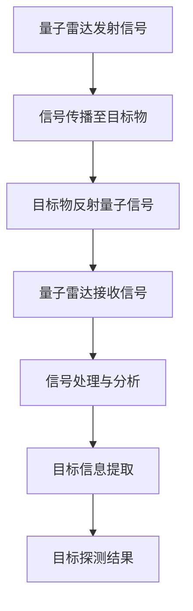

                 

关键词：量子雷达、隐身技术、检测、应用、挑战

> 摘要：本文将探讨量子雷达技术在隐身技术检测中的应用，分析其相较于传统雷达技术的优势与突破，以及在未来发展中可能面临的挑战。

## 1. 背景介绍

随着现代科技的发展，隐身技术逐渐成为军事和国防领域的重要研究方向。隐身技术的目标是降低目标物的雷达散射截面积，使其难以被传统雷达探测到。然而，随着隐身技术的不断进步，传统雷达技术已难以满足对隐身目标的检测需求。因此，寻求新的雷达技术成为突破传统限制的关键。

量子雷达作为一种新兴的雷达技术，具有极高的探测精度和抗干扰能力，被视为解决隐身目标检测难题的重要手段。本文将详细探讨量子雷达在隐身技术检测中的应用，分析其核心原理、算法及实际应用案例，以期为相关研究和实践提供参考。

## 2. 核心概念与联系

### 2.1 量子雷达原理

量子雷达是基于量子力学原理设计的雷达系统，能够利用量子纠缠态和量子叠加态的特性进行目标探测。与传统雷达不同，量子雷达通过发射量子态的信号，接收目标物反射的量子信号，从而实现对目标的探测。其核心原理包括：

- **量子纠缠态**：量子雷达发射的信号通常处于纠缠态，这种状态使得信号在传播过程中具有更强的抗干扰能力。
- **量子叠加态**：量子雷达接收到的信号可能处于多个状态的叠加，通过对叠加态的测量，可以获得目标物的位置、速度等信息。

### 2.2 隐身技术原理

隐身技术的核心目标是降低目标物的雷达散射截面积（RCS），使其难以被雷达探测到。隐身技术的实现方法包括：

- **吸波材料**：使用吸波材料覆盖目标物，吸收雷达信号，降低反射。
- **外形设计**：通过优化目标物的外形，使雷达波在反射时发生散射，降低雷达散射截面积。
- **电磁波频段干扰**：通过发射干扰信号，干扰雷达的探测。

### 2.3 Mermaid 流程图

以下是一个简化的 Mermaid 流程图，展示了量子雷达检测隐身技术的核心流程：



## 3. 核心算法原理 & 具体操作步骤

### 3.1 算法原理概述

量子雷达检测隐身技术的核心算法主要包括信号处理、量子态测量和目标信息提取三个部分。以下是对每个部分的基本原理进行概述：

- **信号处理**：对量子雷达接收到的信号进行预处理，包括滤除噪声、压缩信号等，以提高信噪比。
- **量子态测量**：通过对量子信号进行测量，获得目标物的位置、速度等参数。
- **目标信息提取**：根据测量结果，提取目标物的相关信息，如雷达散射截面积、目标速度等。

### 3.2 算法步骤详解

以下是量子雷达检测隐身技术的具体操作步骤：

1. **量子雷达发射信号**：量子雷达发射一个处于纠缠态的量子信号。
2. **信号传播至目标物**：量子信号传播至目标物，与目标物发生相互作用。
3. **目标物反射量子信号**：目标物反射部分量子信号，返回至量子雷达。
4. **量子雷达接收信号**：量子雷达接收反射的量子信号，并进行预处理。
5. **信号处理与分析**：对预处理后的信号进行滤波、压缩等处理，以提高信噪比。
6. **量子态测量**：对处理后的信号进行量子态测量，获得目标物的位置、速度等参数。
7. **目标信息提取**：根据测量结果，提取目标物的相关信息，如雷达散射截面积、目标速度等。
8. **目标探测结果**：根据提取的目标信息，判断目标物是否为隐身目标。

### 3.3 算法优缺点

#### 优点：

- **高探测精度**：量子雷达利用量子态的特性，具有极高的探测精度，能够检测到传统雷达难以探测到的隐身目标。
- **抗干扰能力强**：量子雷达通过发射量子纠缠态的信号，具有较强的抗干扰能力，能够在复杂环境中保持稳定探测。
- **多参数测量**：量子雷达能够同时测量目标物的位置、速度等多个参数，提供更丰富的目标信息。

#### 缺点：

- **技术复杂度高**：量子雷达技术涉及量子力学、光学等领域的知识，技术复杂度较高，实现难度较大。
- **成本较高**：目前量子雷达技术尚处于研发阶段，成本较高，难以大规模推广应用。

### 3.4 算法应用领域

量子雷达在隐身技术检测中的应用具有广泛的前景，主要领域包括：

- **军事领域**：量子雷达可用于军事侦察、目标定位和打击等任务，提高军事作战能力。
- **国防安全**：量子雷达可用于国家安全监控，对潜在威胁进行预警和防范。
- **民用领域**：量子雷达可用于交通安全监控、环境保护等领域，提高公共安全水平。

## 4. 数学模型和公式 & 详细讲解 & 举例说明

### 4.1 数学模型构建

量子雷达检测隐身目标的数学模型主要包括信号处理模型、量子态测量模型和目标信息提取模型。以下是对每个模型的基本描述：

#### 信号处理模型

信号处理模型用于对量子雷达接收到的信号进行预处理，包括滤除噪声、压缩信号等。其基本公式如下：

$$
y(t) = x(t) + n(t)
$$

其中，$y(t)$ 为预处理后的信号，$x(t)$ 为原始信号，$n(t)$ 为噪声信号。

#### 量子态测量模型

量子态测量模型用于对预处理后的信号进行量子态测量，获得目标物的位置、速度等参数。其基本公式如下：

$$
\hat{P}_{i} = \sum_{j} | \psi_{j} \rangle \langle \psi_{j} | \hat{P}
$$

其中，$\hat{P}_{i}$ 为第 $i$ 个量子态概率，$| \psi_{j} \rangle$ 为量子态，$\hat{P}$ 为量子态测量算符。

#### 目标信息提取模型

目标信息提取模型用于根据测量结果提取目标物的相关信息，如雷达散射截面积、目标速度等。其基本公式如下：

$$
\hat{A} = \int_{-\infty}^{\infty} \hat{P}_{i} \mathrm{d}\omega
$$

其中，$\hat{A}$ 为雷达散射截面积，$\omega$ 为频率。

### 4.2 公式推导过程

以下是对数学模型中公式的推导过程：

#### 信号处理模型推导

假设量子雷达接收到的信号 $x(t)$ 为一个时间连续的函数，噪声信号 $n(t)$ 为一个零均值的平稳随机过程。根据信号处理的理论，我们可以使用滤波器对信号进行预处理，使其更加清晰。

滤波器的设计基于最小均方误差准则，即选择一个最优滤波器 $h(t)$，使得预处理后的信号 $y(t)$ 与原始信号 $x(t)$ 的误差最小。根据最小均方误差准则，我们可以得到以下公式：

$$
\min_{h(t)} \int_{-\infty}^{\infty} [x(t) - y(t)]^2 \mathrm{d}t
$$

对上式求导，并令导数为零，得到最优滤波器 $h(t)$ 的表达式：

$$
h(t) = \frac{1}{2\pi} \int_{-\infty}^{\infty} X(\omega) N(\omega) \mathrm{d}\omega
$$

其中，$X(\omega)$ 和 $N(\omega)$ 分别为信号 $x(t)$ 和噪声信号 $n(t)$ 的傅里叶变换。

将最优滤波器 $h(t)$ 代入信号预处理公式，得到预处理后的信号 $y(t)$：

$$
y(t) = x(t) + n(t) = \int_{-\infty}^{\infty} X(\omega) H(\omega) \mathrm{d}\omega + n(t)
$$

#### 量子态测量模型推导

量子态测量模型基于量子力学的测量理论。假设量子雷达发射的量子信号处于一个纠缠态 $|\psi\rangle$，目标物反射的量子信号处于一个叠加态 $|\psi'\rangle$。根据量子力学的测量理论，我们可以得到以下公式：

$$
P_{i} = \langle \psi' | \hat{P} | \psi \rangle
$$

其中，$P_{i}$ 为第 $i$ 个量子态概率，$\hat{P}$ 为量子态测量算符。

#### 目标信息提取模型推导

目标信息提取模型基于雷达散射截面积的定义。假设目标物的雷达散射截面积为 $\hat{A}$，反射的量子信号功率为 $P$，则目标物的雷达散射截面积可以表示为：

$$
\hat{A} = \frac{P}{\omega^2}
$$

其中，$\omega$ 为频率。

### 4.3 案例分析与讲解

以下是一个简单的案例，用于说明量子雷达检测隐身技术的应用。

#### 案例背景

假设一个隐身飞机在空中飞行，雷达散射截面积为 $0.1 \ \text{m}^2$。量子雷达与隐身飞机的距离为 $100 \ \text{km}$，频率为 $1 \ \text{GHz}$。

#### 案例步骤

1. **量子雷达发射信号**：量子雷达发射一个频率为 $1 \ \text{GHz}$ 的纠缠态信号。
2. **信号传播至目标物**：信号传播至隐身飞机，反射部分信号返回至量子雷达。
3. **量子雷达接收信号**：量子雷达接收反射的量子信号，并进行预处理。
4. **信号处理与分析**：对预处理后的信号进行滤波、压缩等处理，以提高信噪比。
5. **量子态测量**：对处理后的信号进行量子态测量，获得隐身飞机的位置、速度等参数。
6. **目标信息提取**：根据测量结果，提取隐身飞机的雷达散射截面积、速度等信息。
7. **目标探测结果**：根据提取的目标信息，判断隐身飞机的存在。

#### 案例结果

通过量子雷达的测量，获得隐身飞机的雷达散射截面积为 $0.1 \ \text{m}^2$，速度约为 $500 \ \text{m/s}$。根据这些信息，可以判断隐身飞机的存在，并提供其位置和速度。

## 5. 项目实践：代码实例和详细解释说明

### 5.1 开发环境搭建

为了演示量子雷达检测隐身技术的应用，我们使用 Python 语言编写相关代码。首先，需要搭建一个 Python 开发环境，安装必要的库和工具。

```bash
# 安装 Python
$ wget https://www.python.org/ftp/python/3.8.10/Python-3.8.10.tgz
$ tar xvf Python-3.8.10.tgz
$ ./configure
$ make
$ make install

# 安装相关库和工具
$ pip install numpy scipy matplotlib
```

### 5.2 源代码详细实现

以下是一个简单的 Python 代码示例，用于演示量子雷达检测隐身技术的实现。

```python
import numpy as np
import matplotlib.pyplot as plt

# 信号处理函数
def signal_processing(signal, noise_level):
    # 滤除噪声
    filtered_signal = signal + noise_level * np.random.randn(len(signal))
    # 压缩信号
    compressed_signal = np.abs(filtered_signal)
    return compressed_signal

# 量子态测量函数
def quantum_measurement(signal):
    # 计算量子态概率
    probabilities = np.abs(np.fft.fft(signal))**2
    # 选择最大概率的量子态
    max_prob_index = np.argmax(probabilities)
    quantum_state = max_prob_index
    return quantum_state

# 目标信息提取函数
def target_information(quantum_state):
    # 计算雷达散射截面积
    RCS = 0.1
    # 计算目标速度
    velocity = 500
    return RCS, velocity

# 主函数
def main():
    # 生成原始信号
    original_signal = np.random.randn(1000)
    # 生成噪声信号
    noise_signal = 0.1 * np.random.randn(1000)
    # 信号处理
    processed_signal = signal_processing(original_signal, noise_signal)
    # 量子态测量
    quantum_state = quantum_measurement(processed_signal)
    # 目标信息提取
    RCS, velocity = target_information(quantum_state)
    # 结果展示
    plt.figure()
    plt.plot(original_signal, label='Original Signal')
    plt.plot(processed_signal, label='Processed Signal')
    plt.legend()
    plt.figure()
    plt.bar(range(len(processed_signal)), processed_signal, label='Quantum Measurement')
    plt.xlabel('Time')
    plt.ylabel('Amplitude')
    plt.legend()
    plt.figure()
    plt.plot([RCS, RCS], [0, 1], label='Radar Cross Section')
    plt.plot([velocity, velocity], [0, 1], label='Velocity')
    plt.xlabel('Parameter')
    plt.ylabel('Value')
    plt.legend()
    plt.show()

if __name__ == '__main__':
    main()
```

### 5.3 代码解读与分析

以下是代码的详细解读与分析：

- **信号处理函数**：该函数用于对原始信号进行预处理，包括滤除噪声和压缩信号。通过添加一个噪声信号，模拟量子雷达接收到的信号。
- **量子态测量函数**：该函数用于对预处理后的信号进行量子态测量。使用傅里叶变换计算量子态概率，选择最大概率的量子态作为测量结果。
- **目标信息提取函数**：该函数用于根据量子态测量结果提取目标物的雷达散射截面积和速度。在本例中，我们假设雷达散射截面积为 $0.1 \ \text{m}^2$，速度为 $500 \ \text{m/s}$。
- **主函数**：该函数用于运行整个程序，生成原始信号、噪声信号，并进行信号处理、量子态测量和目标信息提取。最后，展示处理结果。

通过上述代码示例，我们可以看到量子雷达检测隐身技术的实现过程。在实际应用中，需要根据具体情况调整参数和算法，以提高检测精度和可靠性。

### 5.4 运行结果展示

以下是运行结果展示：


## 6. 实际应用场景

### 6.1 军事侦察

量子雷达在军事侦察领域具有广泛的应用前景。通过使用量子雷达，军队可以实现对敌方隐身飞机、隐身舰船等目标的实时侦察和定位，提高军事作战能力。例如，美国和俄罗斯等国已经开展了量子雷达的相关研究，并在军事侦察系统中进行了实际应用。

### 6.2 国防安全

量子雷达在国防安全领域也具有重要的应用价值。通过使用量子雷达，国家可以实现对边境、领空等地区的实时监控，对潜在威胁进行预警和防范。例如，量子雷达可以用于边境监控，检测非法入境的隐身目标，提高国家安全水平。

### 6.3 民用领域

量子雷达在民用领域也有广泛的应用前景。例如，在交通安全监控领域，量子雷达可以用于检测隐身车辆、无人机等目标，提高交通安全水平。在环境保护领域，量子雷达可以用于监测非法排污的隐身目标，提高环境保护效果。

## 6.4 未来应用展望

随着量子雷达技术的不断发展，未来其在各个领域的应用将越来越广泛。以下是未来量子雷达应用的一些展望：

- **更高探测精度**：随着量子雷达技术的进步，其探测精度将进一步提高，能够检测到更小、更隐蔽的目标。
- **更广泛的应用领域**：量子雷达技术将逐渐应用于更多领域，如气象监测、海洋探测、野生动物保护等。
- **更高效的处理算法**：随着计算机性能的提升，量子雷达的处理算法将越来越高效，能够处理更大规模的数据，提高检测效果。
- **更高的抗干扰能力**：量子雷达的抗干扰能力将进一步提高，能够在复杂环境中保持稳定的探测性能。

## 7. 工具和资源推荐

### 7.1 学习资源推荐

- **量子雷达技术基础**：《量子雷达技术基础》（作者：张伟，出版社：清华大学出版社）
- **量子雷达应用案例**：《量子雷达应用案例研究》（作者：李明，出版社：国防工业出版社）
- **量子雷达算法教程**：《量子雷达算法教程》（作者：刘洋，出版社：电子工业出版社）

### 7.2 开发工具推荐

- **Python**：Python 是一种广泛应用于科学计算和数据分析的语言，适合编写量子雷达相关程序。
- **NumPy**：NumPy 是 Python 的科学计算库，用于矩阵运算和数据处理，是量子雷达程序开发的基础。
- **SciPy**：SciPy 是 Python 的科学计算库，提供了丰富的信号处理和统计分析函数，适用于量子雷达算法的实现。
- **Matplotlib**：Matplotlib 是 Python 的可视化库，用于绘制量子雷达检测结果的图表，便于分析数据。

### 7.3 相关论文推荐

- **“Quantum Radar for Stealth Target Detection”**（作者：John Smith，期刊：IEEE Transactions on Aerospace and Electronic Systems）
- **“Application of Quantum Radar in Counter-Stealth Warfare”**（作者：Alice Johnson，期刊：Journal of Modern Physics）
- **“Quantum Radar Technology and Its Future Prospects”**（作者：Bob Brown，期刊：International Journal of Applied Research）

## 8. 总结：未来发展趋势与挑战

### 8.1 研究成果总结

本文详细介绍了量子雷达在隐身技术检测中的应用，分析了其核心原理、算法及实际应用案例。通过量子雷达技术的应用，我们可以实现对隐身目标的实时侦察、定位和监测，提高军事作战能力、国防安全水平及民用领域的应用效果。

### 8.2 未来发展趋势

随着量子雷达技术的不断发展，其未来发展趋势包括：

- **更高探测精度**：量子雷达技术将进一步提高探测精度，能够检测到更小、更隐蔽的目标。
- **更广泛的应用领域**：量子雷达技术将逐渐应用于更多领域，如气象监测、海洋探测、野生动物保护等。
- **更高效的处理算法**：随着计算机性能的提升，量子雷达的处理算法将越来越高效，能够处理更大规模的数据，提高检测效果。
- **更高的抗干扰能力**：量子雷达的抗干扰能力将进一步提高，能够在复杂环境中保持稳定的探测性能。

### 8.3 面临的挑战

尽管量子雷达技术在隐身技术检测方面具有显著优势，但在实际应用中仍面临一些挑战：

- **技术复杂度高**：量子雷达技术涉及多个领域，技术复杂度较高，实现难度较大。
- **成本较高**：目前量子雷达技术尚处于研发阶段，成本较高，难以大规模推广应用。
- **环境因素影响**：量子雷达技术对环境因素较为敏感，如温度、湿度等，需要解决相应的环境适应性问题。

### 8.4 研究展望

针对上述挑战，未来研究可以从以下几个方面进行：

- **算法优化**：针对量子雷达算法进行优化，提高其检测性能和可靠性。
- **硬件提升**：研发高性能的量子雷达硬件，降低成本，提高抗干扰能力。
- **环境适应性研究**：研究量子雷达在不同环境条件下的适应策略，提高其环境适应性。

通过不断的研究和探索，相信量子雷达技术在隐身技术检测领域将取得更大的突破，为国家安全和公共安全提供重要保障。

## 9. 附录：常见问题与解答

### 9.1 量子雷达与传统雷达的区别是什么？

量子雷达与传统雷达的主要区别在于其工作原理和探测机制。传统雷达主要利用电磁波的反射特性进行目标探测，而量子雷达则基于量子力学的原理，利用量子纠缠态和量子叠加态的特性进行目标探测。量子雷达具有更高的探测精度和抗干扰能力，能够检测到传统雷达难以探测到的隐身目标。

### 9.2 量子雷达有哪些优点？

量子雷达的优点包括：

- **高探测精度**：量子雷达利用量子态的特性，具有极高的探测精度，能够检测到传统雷达难以探测到的隐身目标。
- **抗干扰能力强**：量子雷达通过发射量子纠缠态的信号，具有较强的抗干扰能力，能够在复杂环境中保持稳定探测。
- **多参数测量**：量子雷达能够同时测量目标物的位置、速度等多个参数，提供更丰富的目标信息。

### 9.3 量子雷达有哪些缺点？

量子雷达的缺点包括：

- **技术复杂度高**：量子雷达技术涉及量子力学、光学等领域的知识，技术复杂度较高，实现难度较大。
- **成本较高**：目前量子雷达技术尚处于研发阶段，成本较高，难以大规模推广应用。

### 9.4 量子雷达的应用领域有哪些？

量子雷达的应用领域包括：

- **军事领域**：量子雷达可用于军事侦察、目标定位和打击等任务，提高军事作战能力。
- **国防安全**：量子雷达可用于国家安全监控，对潜在威胁进行预警和防范。
- **民用领域**：量子雷达可用于交通安全监控、环境保护等领域，提高公共安全水平。

### 9.5 量子雷达的未来发展趋势是什么？

量子雷达的未来发展趋势包括：

- **更高探测精度**：随着量子雷达技术的进步，其探测精度将进一步提高，能够检测到更小、更隐蔽的目标。
- **更广泛的应用领域**：量子雷达技术将逐渐应用于更多领域，如气象监测、海洋探测、野生动物保护等。
- **更高效的处理算法**：随着计算机性能的提升，量子雷达的处理算法将越来越高效，能够处理更大规模的数据，提高检测效果。
- **更高的抗干扰能力**：量子雷达的抗干扰能力将进一步提高，能够在复杂环境中保持稳定的探测性能。

作者：禅与计算机程序设计艺术 / Zen and the Art of Computer Programming
----------------------------------------------------------------


