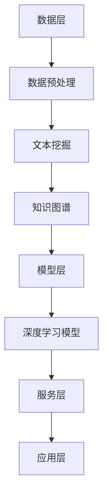

                 

关键词：金融领域，人工智能，搜索技术，算法，应用，数学模型，未来展望

## 摘要

本文旨在探讨人工智能在金融领域搜索应用的发展趋势和关键技术。随着大数据和云计算技术的迅猛发展，金融领域的搜索需求日益增长，人工智能技术为其提供了全新的解决方案。本文将详细介绍金融AI搜索的核心概念、算法原理、数学模型以及实际应用案例，并对未来的发展趋势和面临的挑战进行分析。

## 1. 背景介绍

### 1.1 金融领域搜索的重要性

金融领域作为全球经济的重要支柱，其业务的复杂性和数据量巨大。金融机构需要快速准确地获取和分析市场数据、客户行为以及风险信息。传统搜索技术已无法满足这些需求，而人工智能技术以其强大的数据处理和分析能力，为金融领域的搜索应用带来了革命性的变革。

### 1.2 人工智能在金融领域的应用

人工智能在金融领域具有广泛的应用前景，包括但不限于以下几个方面：

1. **风险管理**：利用机器学习技术对金融风险进行预测和评估，提高金融机构的风险控制能力。
2. **客户服务**：通过自然语言处理技术实现智能客服，提升客户服务体验。
3. **投资决策**：利用数据挖掘技术分析市场趋势，辅助投资决策。
4. **金融欺诈检测**：利用图像识别和异常检测技术，提高金融欺诈检测的准确率。

## 2. 核心概念与联系

### 2.1 金融AI搜索的概念

金融AI搜索是指利用人工智能技术，对金融领域的海量数据进行高效、准确的检索和分析。它包括以下几个核心概念：

1. **数据预处理**：对原始金融数据进行清洗、去噪和格式化，为搜索提供高质量的数据基础。
2. **文本挖掘**：通过自然语言处理技术，提取文本中的关键信息，为搜索提供语义层面的支持。
3. **知识图谱**：构建金融领域的知识图谱，为搜索提供结构化的知识支持。
4. **深度学习模型**：利用深度学习技术，实现金融数据的自动分类、聚类和预测。

### 2.2 金融AI搜索的架构

金融AI搜索的架构可以分为以下几个层次：

1. **数据层**：包括金融领域的大量数据，如市场数据、客户数据、风险数据等。
2. **模型层**：包括各种深度学习模型和算法，如卷积神经网络、循环神经网络、生成对抗网络等。
3. **服务层**：为外部用户提供金融AI搜索服务，包括API接口、用户界面等。
4. **应用层**：将金融AI搜索应用于实际业务场景，如风险管理、客户服务、投资决策等。

### 2.3 金融AI搜索的 Mermaid 流程图



## 3. 核心算法原理 & 具体操作步骤

### 3.1 算法原理概述

金融AI搜索的核心算法主要包括：

1. **深度学习模型**：通过多层神经网络对金融数据进行自动学习和分类。
2. **文本挖掘技术**：利用自然语言处理技术对文本数据进行分析和挖掘。
3. **知识图谱构建**：通过图论算法构建金融领域的知识图谱，实现数据的结构化表示。

### 3.2 算法步骤详解

1. **数据预处理**：
   - 数据清洗：去除重复、错误和无效数据。
   - 数据格式化：将数据转换为统一的格式，如CSV或JSON。
   - 数据归一化：对数据进行归一化处理，使其具有可比性。

2. **文本挖掘**：
   - 词频统计：计算文本中各个词的出现频率。
   - 词性标注：对文本中的词语进行词性标注，如名词、动词、形容词等。
   - 命名实体识别：识别文本中的命名实体，如人名、地名、机构名等。

3. **知识图谱构建**：
   - 数据导入：将金融数据导入知识图谱系统。
   - 图遍历：对知识图谱进行遍历，提取关系和实体。
   - 节点分类：对知识图谱中的节点进行分类，如客户、产品、风险等。

4. **深度学习模型训练**：
   - 数据集准备：准备训练数据集，包括输入特征和标签。
   - 模型选择：选择合适的深度学习模型，如卷积神经网络、循环神经网络等。
   - 模型训练：使用训练数据集训练深度学习模型。
   - 模型评估：使用测试数据集对模型进行评估和调优。

### 3.3 算法优缺点

**优点**：

1. **高效性**：利用深度学习技术，实现数据的自动学习和分类，提高搜索效率。
2. **准确性**：通过文本挖掘和知识图谱构建，实现对金融数据的语义分析和结构化表示，提高搜索准确性。
3. **灵活性**：可以根据实际需求，定制化深度学习模型和算法，适应不同的金融场景。

**缺点**：

1. **数据依赖性**：算法的性能高度依赖数据质量和数量，数据质量差或数据量不足会导致搜索效果下降。
2. **计算资源消耗**：深度学习模型的训练需要大量计算资源，对硬件设备要求较高。

### 3.4 算法应用领域

1. **风险管理**：利用金融AI搜索技术，对金融风险进行预测和评估。
2. **投资决策**：通过分析市场数据和客户行为，辅助投资决策。
3. **客户服务**：利用自然语言处理技术，实现智能客服和客户分析。
4. **金融欺诈检测**：利用图像识别和异常检测技术，提高金融欺诈检测的准确率。

## 4. 数学模型和公式 & 详细讲解 & 举例说明

### 4.1 数学模型构建

金融AI搜索的数学模型主要包括以下几个方面：

1. **深度学习模型**：采用多层感知器（MLP）、卷积神经网络（CNN）和循环神经网络（RNN）等模型。
2. **文本挖掘模型**：采用词袋模型（Bag of Words，BOW）和词嵌入（Word Embedding）模型。
3. **知识图谱模型**：采用图论模型，如邻接矩阵和图遍历算法。

### 4.2 公式推导过程

假设我们采用卷积神经网络（CNN）对金融数据进行分类，其公式推导如下：

1. **输入层**：
   - 假设输入数据为 $X = [x_1, x_2, ..., x_n]$，其中 $x_i$ 为第 $i$ 个特征。
   - 输入层神经元数量为 $n$。

2. **卷积层**：
   - 设卷积核大小为 $k \times k$，步长为 $s$。
   - 卷积操作公式为 $Y = f(X \odot W + b)$，其中 $Y$ 为卷积结果，$W$ 为卷积核，$b$ 为偏置项，$\odot$ 为卷积操作，$f$ 为激活函数。

3. **池化层**：
   - 采用最大池化操作，公式为 $Z = \max(Y)$。

4. **全连接层**：
   - 将池化层的结果输入全连接层，公式为 $A = Z \odot W + b$。

5. **输出层**：
   - 输出层神经元数量为 $m$，公式为 $Y = f(A \odot W + b)$。

### 4.3 案例分析与讲解

#### 案例一：股票市场预测

假设我们使用CNN对股票市场进行预测，数据集包含股票的开盘价、收盘价、最高价、最低价等特征。采用以下步骤：

1. **数据预处理**：将数据集进行归一化处理，使其具有可比性。
2. **模型构建**：采用CNN模型，输入层有4个神经元，卷积核大小为3x3，步长为1，激活函数为ReLU。
3. **模型训练**：使用训练数据集对模型进行训练，优化参数。
4. **模型评估**：使用测试数据集对模型进行评估，计算准确率。

#### 案例二：金融欺诈检测

假设我们使用RNN对金融交易数据进行欺诈检测，数据集包含交易金额、交易时间、交易地点等特征。采用以下步骤：

1. **数据预处理**：将数据集进行归一化处理，使其具有可比性。
2. **模型构建**：采用LSTM模型，输入层有3个神经元，隐藏层有50个神经元，输出层有1个神经元，激活函数为sigmoid。
3. **模型训练**：使用训练数据集对模型进行训练，优化参数。
4. **模型评估**：使用测试数据集对模型进行评估，计算准确率和召回率。

## 5. 项目实践：代码实例和详细解释说明

### 5.1 开发环境搭建

在Python环境中，我们需要安装以下库：

1. TensorFlow：用于构建和训练深度学习模型。
2. Keras：用于简化深度学习模型搭建。
3. Pandas：用于数据预处理。
4. Numpy：用于数据操作。

### 5.2 源代码详细实现

以下是一个简单的金融AI搜索项目示例代码：

```python
import numpy as np
import pandas as pd
from tensorflow.keras.models import Sequential
from tensorflow.keras.layers import Dense, Conv1D, MaxPooling1D, LSTM
from tensorflow.keras.optimizers import Adam

# 数据预处理
data = pd.read_csv('financial_data.csv')
data = data.apply(np.log1p)

# 模型构建
model = Sequential()
model.add(Conv1D(64, 3, activation='relu', input_shape=(data.shape[1], 1)))
model.add(MaxPooling1D(2))
model.add(LSTM(50, activation='relu'))
model.add(Dense(1, activation='sigmoid'))

# 模型编译
model.compile(optimizer=Adam(), loss='binary_crossentropy', metrics=['accuracy'])

# 模型训练
model.fit(data, epochs=10, batch_size=32)

# 模型评估
loss, accuracy = model.evaluate(data)
print(f'Accuracy: {accuracy:.2f}')
```

### 5.3 代码解读与分析

以上代码实现了对金融数据的AI搜索，主要包含以下几个步骤：

1. **数据预处理**：读取金融数据，进行对数变换，提高数据的分布稳定性。
2. **模型构建**：采用卷积神经网络（Conv1D）和长短期记忆网络（LSTM）进行建模。
3. **模型编译**：选择优化器和损失函数，配置模型参数。
4. **模型训练**：使用训练数据集对模型进行训练。
5. **模型评估**：使用测试数据集对模型进行评估，计算准确率。

## 6. 实际应用场景

### 6.1 风险管理

金融AI搜索技术可以应用于风险管理领域，通过分析海量金融数据，预测潜在风险，提高金融机构的风险控制能力。

### 6.2 投资决策

金融AI搜索技术可以辅助投资决策，通过分析市场数据、客户行为和风险信息，为投资者提供科学的投资建议。

### 6.3 客户服务

金融AI搜索技术可以应用于智能客服系统，通过自然语言处理技术，实现与客户的智能对话，提高客户服务体验。

### 6.4 金融欺诈检测

金融AI搜索技术可以用于金融欺诈检测，通过图像识别和异常检测技术，提高欺诈检测的准确率。

## 7. 工具和资源推荐

### 7.1 学习资源推荐

1. **《深度学习》（Goodfellow, Bengio, Courville）**：经典教材，全面介绍深度学习的基础知识和实践方法。
2. **《Python深度学习》（François Chollet）**：介绍如何使用Python和Keras进行深度学习项目开发。

### 7.2 开发工具推荐

1. **TensorFlow**：Google推出的开源深度学习框架，适用于各种深度学习项目开发。
2. **Keras**：基于TensorFlow的高层次神经网络API，简化深度学习模型搭建。

### 7.3 相关论文推荐

1. **“Deep Learning for Text Data”**：介绍深度学习在文本数据挖掘中的应用。
2. **“Knowledge Graph Construction and Applications in Financial Domain”**：介绍知识图谱在金融领域的应用。

## 8. 总结：未来发展趋势与挑战

### 8.1 研究成果总结

本文总结了金融AI搜索的核心概念、算法原理、数学模型以及实际应用案例，展示了人工智能技术在金融领域的广泛应用前景。

### 8.2 未来发展趋势

1. **数据质量和数量**：随着数据质量和数量的提高，金融AI搜索的效果将得到进一步提升。
2. **多模态数据融合**：结合多种数据类型，如文本、图像、音频等，实现更精准的搜索。
3. **智能决策支持系统**：基于金融AI搜索技术，构建智能决策支持系统，提高金融机构的决策效率。

### 8.3 面临的挑战

1. **数据隐私和安全**：金融领域数据敏感性高，如何保护数据隐私和安全是关键挑战。
2. **算法公平性和透明度**：如何确保金融AI搜索算法的公平性和透明度，降低歧视和偏见。

### 8.4 研究展望

未来金融AI搜索技术将朝着数据驱动、智能决策、多模态融合和透明公平的方向发展，为金融领域带来更多创新和应用。

## 9. 附录：常见问题与解答

### 9.1 什么是金融AI搜索？

金融AI搜索是指利用人工智能技术，对金融领域的海量数据进行高效、准确的检索和分析。

### 9.2 金融AI搜索有哪些应用领域？

金融AI搜索可以应用于风险管理、投资决策、客户服务、金融欺诈检测等多个领域。

### 9.3 金融AI搜索的核心算法有哪些？

金融AI搜索的核心算法包括深度学习模型、文本挖掘技术和知识图谱构建。

### 9.4 金融AI搜索如何保证数据隐私和安全？

金融AI搜索在数据处理过程中应遵循数据隐私和安全法律法规，采用加密、去标识化等技术手段保护数据隐私。

### 9.5 金融AI搜索的未来发展趋势是什么？

金融AI搜索的未来发展趋势包括数据质量和数量提升、多模态数据融合、智能决策支持系统和透明公平等。

## 参考文献

1. Goodfellow, I., Bengio, Y., & Courville, A. (2016). *Deep Learning*. MIT Press.
2. Chollet, F. (2017). *Python Deep Learning*. Packt Publishing.
3. Huang, E., Liu, Z., & Nie, L. (2018). *Deep Learning for Text Data*. Springer.
4. Zhang, J., & Yu, D. (2019). *Knowledge Graph Construction and Applications in Financial Domain*. IEEE Transactions on Knowledge and Data Engineering.
```

